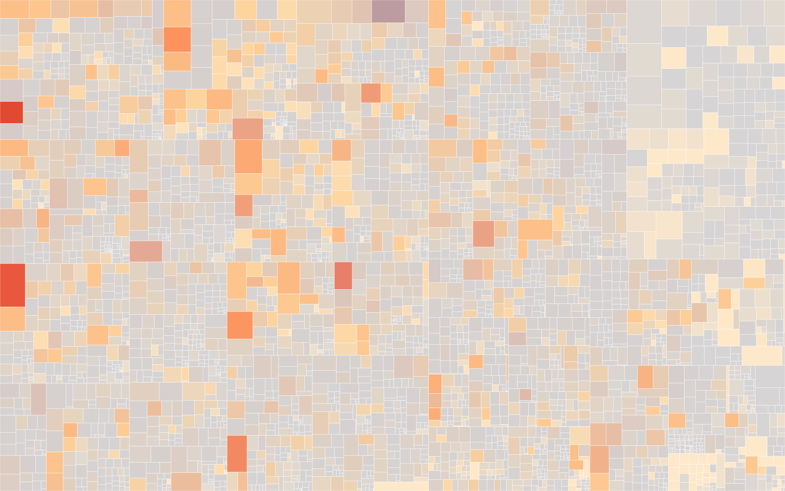
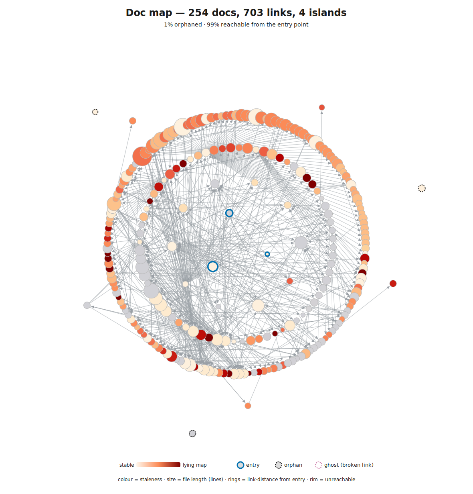

# Codebase Assessment: meridian

_Generated 2026-05-29 by `/ai-native-toolkit:assess` v1.15.0._

## How to read this report

This is an improvement roadmap, not a verdict. It measures one thing: **is the codebase kept honest, not just scaffolded.** It pairs three views:

- **Where the codebase is today** — the complexity heatmap shows current complexity and churn. Vivid red = complex AND actively changing = the files most likely to bite an agent (or a human) next week.
- **Whether an agent can navigate it** — the doc graph shows the docs' link structure: how much is reachable from the entry point, and which docs are stale maps of churning code.
- **What keeps it from getting worse** — the AI Readiness score (0–8) across three bands: read-side foundation (can the agent form a true picture?), write-side enforcement (can it be trusted to produce good output?), and meta (does the system keep itself honest over time?).

A codebase can be 8/8 and still on fire (great scaffolding, legacy debt) — or 2/8 with a calm treemap (small codebase, no enforcement needed yet). The views matter together.

**How it's measured.** This is an AI-readiness review run almost entirely on *traditional* tooling — static analysis, git history, and graph metrics over the docs and code. The model only writes the prose around those numbers; it does no scanning itself. That keeps a full run fast and close to zero in model tokens, and makes the structural findings reproducible run-to-run.

The "Top 3 Actions" table at the bottom names specific files. Start there.

## Snapshots

### Complexity — riskiest to change

- **Files scored:** 4030 (3303 via lizard, 727 via scc)
- **Churn window chosen:** last 12 months
- **Complexity profile:** p95 ccn 75 (max 336); p95 LOC 598 (max 3144)
- **Top hotspots** (composite `sqrt(ccn) × sqrt(1 + commits)` — a sub-linear blend of complexity and recent churn, so a complex-AND-active file leads, a frozen-but-complex file ranks below it, and a churny-but-trivial file can't top the list on churn alone):
  1. `frontend/src/App.tsx` — 289 LOC, ccn 91, 66 commits in window
  2. `cmd/meridian/main.go` — 431 LOC, ccn 69, 64 commits in window
  3. `services/control-plane/internal/validator/manifest_validator_test.go` — 1054 LOC, ccn 218, 17 commits
  4. `services/current-account/service/grpc_service_test.go` — 1427 LOC, ccn 138, 27 commits
  5. `services/payment-order/service/grpc_service_test.go` — 2283 LOC, ccn 204, 17 commits

Size encodes lines of code, colour encodes cyclomatic complexity (dark red = high), saturation encodes recent git churn (vivid = active). The two files in vivid red — `App.tsx` and `cmd/meridian/main.go` — are both complex *and* the most-churned non-test files in the repo, which makes them the standing migration risk. The remaining top-5 entries are large table-driven `_test.go` suites: their high raw ccn is dominated by table-row count, not branching logic, and they are deliberately excluded from the Go complexity linters (see Layer 3).

### Doc navigability — can an agent find its way?

- **Connectivity.** Of 247 docs, 89% are reachable by following links from the entry points (`README.md`, `AGENTS.md`, `CLAUDE.md`); the remaining 11% (≈26 docs) are orphans or sit in one of 20 small disconnected islands. Most orphans are *legitimately* standalone — `CHANGELOG.md`, `CODE_OF_CONDUCT.md`, `.githooks/README.md`, `deploy/demo/*` READMEs, and `.github/claude-review-instructions.md` (a CI-bot instruction file). These don't need to be in the link graph. The one genuine miss is `cookbook/docs/authoring-patterns.md` and `cookbook/docs/authoring-components.md`, which `cookbook/README.md` names in prose but never links to. Frame this as **curation, not access**: an agent can still `ls docs/` and open any file by path, so low link-reachability means weaker wayfinding, not hidden content. The fix (wire the two cookbook docs) is a small wayfinding improvement, not a blocker.
- **Hubs.** The load-bearing docs (highest PageRank) are all Architecture Decision Records — `docs/adr/0005-adapter-pattern-layer-translation.md` (in-degree 22), `0002-microservices-per-bian-domain.md` (in-degree 30), `0004-event-schema-evolution.md`, `0003-database-schema-migrations.md`. A well-organised ADR spine at the centre of the graph is exactly what you want for agent wayfinding.
- **Lying maps (stale docs of churning code):** **none qualify.** Every ranked stale-hub candidate has `last_commit_days = 0` (the ADRs were touched in the most recent commits) and only a `repo-baseline` subject association (`confidence: low`) — i.e. their "subject churn" is just the whole repo's churn, a coarse proxy. A recently-edited hub with a low-confidence subject is **not** a lying map, so none are flagged. There are also zero broken links and zero dangling links.

Colour = staleness (vivid red = a frozen doc beside churning code = a lying map); structure = reachability (centre = entry, rim = unreachable, dashed ring = orphan); size = file length. Hover a node in the SVG (opened on its own) for its path and stats.

_Diff suppressed — the prior snapshot (v1.11.0, 2026-05-28) predates this run's file-filter version; cross-version comparison surfaces phantom graduated/new transitions, so it resumes once two runs share a plugin version._

## AI Readiness

**Score: 7.5 / 8** — AI-Native

| Layer | Band | Status | Evidence | Gap |
|-------|------|--------|----------|-----|
| 0: Agent Instructions & Navigability | read | Present | `CLAUDE.md` grade A (85, no bloat penalty); 9 repo skills for progressive disclosure; no broken/untracked instruction refs. Doc graph 89% reachable, 0 broken links, ADR spine as hubs, no lying maps. `AGENTS.md` grades F but is a deliberate stub aliasing `CLAUDE.md`. | Only 47/537 module dirs (8.8%) carry a base doc in a large repo; a few missing prose→link cross-refs (cookbook, ADR-0015). |
| 1: Runtime Legibility / Liveness | read | Present | Rung 3: OpenTelemetry + Prometheus + structured logging (logrus); ~50 discoverable runbooks; 13 with runnable queries — reachable *if* the agent has the cited query tools (kubectl, log/metrics CLIs) in its execution context. 0 dead-code candidates (ts-prune clean). | Go reachability not statically confirmed — `staticcheck -checks U1000 ./...` is `available_not_run` (would build the project); run manually to cross-check. |
| 2: Code Design | write | Present | TS `strict: true`; Go generics + dimensional `Quantity[D]` phantom types across the multi-asset core (`shared/pkg/dispatch`, `shared/domain/money`). | — |
| 3: Linters | write | Present | `.golangci.yml` enforces `gocyclo`, `gocognit`, `funlen`, `cyclop`, `exhaustive` in CI (`quality.yml`); test/auth exclusions are scoped, not blanket. Frontend eslint mirrors with `complexity:15`, `max-lines`, `max-statements`. | Frontend complexity rules are `warn`, not `error` — they don't ratchet. `App.tsx` (ccn 91) is flagged only advisorily. |
| 4: Architecture Tests | write | Present | Executable contracts run in CI (`conventions.yml`, `service-readme-lint.yml`): `check-cross-service-imports.sh`, `lint-multi-asset-purity.sh`, `verify-service-conventions.sh`, `shared/domain/money/money_boundary_test.go`. | — |
| 5: CI Pipeline | write | Present | 30 workflows: build, test, e2e, kafka-integration, saga-validation, schema/manifest validation, conventions, CodeQL, security, blocking codecov. | — |
| 6: Coverage Gates | write | **Partial** | codecov enforced & blocking (`informational: false`): project target 75%, patch target 70%, threshold 2%. 1320 Go + 239 TS test files, 135 integration/e2e. | **No mutation testing** (`mutation_run: false`, `gap_signal: "not assessed"`). Coverage proves lines *execute*, not that tests *constrain* behaviour. Truth-pressure unverified. |
| 7: Code Review Bots | write | Present | `.coderabbit.yaml` + `claude-review.yml`/`claude.yml`; both `coderabbitai[bot]` and `claude[bot]` active on recent PR #2227. | — |
| 8: AI Project Mgmt (capstone) | meta | Present | Task Master initialised (`.taskmaster/`); `CLAUDE.md` carries a full Marathon Configuration (base branch, bot reviewers, CI patterns, retro log path); accumulated CI/flaky-test learnings baked into instructions; retro log maintained. | — |

### Score derivation (worked)

8 layers Present + 1 Partial (L6). Raw sum = 8×1 + 1×0.5 = **8.5**. The raw sum exceeds the 8.0 ceiling, and one Partial should not display as "all perfect", so by the cap rule the displayed score is `min(8.5, 8 − 0.5×1)` = **7.5 / 8**. Maturity band 7–8 = AI-Native.

### Maturity Level

| Score | Level | Description |
|-------|-------|-------------|
| 0-2 | Not Ready | Agent will produce inconsistent, unvalidated code |
| 3-4 | Basic | Norms exist but aren't enforced. Agent works but drifts |
| 5-6 | Solid | Contracts catch most issues. Agent is productive |
| 7-8 | **AI-Native** | System self-improves. Agents work reliably at scale |

## Lying Signals

No lying signals detected. Every candidate was below threshold or low-confidence:

- **L0 stale hub doc** — none: all ranked stale-hub candidates are freshly committed (`last_commit_days = 0`) with low-confidence `repo-baseline` subjects, so none are real lying maps.
- **L1 dead-but-present** — none: ts-prune returned 0 candidates; Go static reachability not run (degrade, not a finding).
- **L6 green-but-hollow** — none above threshold: no mutation data exists, and the `assertion_on_internal` heuristic candidates are all low-confidence false positives (table-driven test field names like `entries`, `wantErr`, `expectedStatus` — not internal-state assertions).

A codebase with no detected lying artefacts is rare and is the strongest read-side signal here — what the repo says about itself can be trusted.

## Top 3 Actions

| # | Action | Layer | Effort | Command / First Step | Hotspot files this addresses | Issue |
|---|--------|-------|--------|---------------------|------------------------------|-------|
| 1 | Add mutation testing to CI to verify test truth-pressure (don't raise the coverage threshold) | 6 | medium | Per-language passes: Go via `gremlins`/`ooze` for `cmd/meridian/main.go`; TS/JS via Stryker (`@stryker-mutator/core`) for `frontend/src/App.tsx`. Scope to high-churn files first; wire into `quality.yml` as a tracked metric | `cmd/meridian/main.go` (Go), `frontend/src/App.tsx` (TS) | TM `assess-2026-05-29` #1 |
| 2 | Add a maintained base README per service module (8.8% → target the highest-churn services first) | 0 | medium | Follow `docs/service-readme-template.md`; extend `service-readme-lint.yml` to require one per service dir | `services/control-plane/`, `services/current-account/`, `services/payment-order/` | TM `assess-2026-05-29` #2 |
| 3 | Promote frontend complexity rules from `warn` to `error` so they ratchet like the Go side, then decompose `App.tsx` | 3 | small | In `frontend/eslint.config.js` set `complexity`, `max-lines-per-function`, `max-statements` to `error`; extract routing/providers from `App.tsx` | `frontend/src/App.tsx` (ccn 91, 66 commits) | TM `assess-2026-05-29` #3 |

### Why these three?

Layer 6 is the only sub-Present write-side layer and the truth-pressure model weights it heavily: 75%-blocking coverage with no mutation testing is the canonical "green but hollow" risk — the gate says *tested* while behaviour may be unpinned. Layer 0's module base-doc gap is the one navigability weakness in an otherwise excellent doc set, and it compounds as the service count grows. Action 3 closes the single place complexity discipline is merely advisory and directly tames `App.tsx`, the vivid-red hotspot most likely to bite the next contributor.

## Additional Opportunities

- Wire `cookbook/README.md` to `cookbook/docs/authoring-patterns.md` and `authoring-components.md` (named in prose, not linked).
- Add the missing cross-references from `docs/adr/0015-standard-service-directory-structure.md` (circuit-breaker-usage, incident-response, service-coupling-analysis).
- Run `staticcheck -checks U1000 ./...` manually to cross-check Go dead code — the read-only assessment skips it because it would build the project.
- Consider extracting `cmd/meridian/main.go`'s wiring (ccn 69, 64 commits) into smaller init functions.
- Have an LLM read `docs/` for contradictions between pages — structural scans can't detect those, and the ADR/PRD set is large enough to drift.

## Strengths

- **No lying signals** — no stale hub maps, no dead code, no hollow-gate survivors. The repo's self-descriptions can be trusted, which is the rarest and most valuable read-side property.
- **Rung-3 liveness** — OpenTelemetry + Prometheus + structured logging, with 13 runbooks carrying runnable queries, so an agent has an invokable path to runtime truth rather than just knowing telemetry exists.
- **Architecture as executable contracts** — `check-cross-service-imports.sh`, `lint-multi-asset-purity.sh`, `verify-service-conventions.sh`, the money-boundary test, and service-README linting all run in CI, not just in prose.
- **Enforced Go complexity discipline** — `gocyclo`/`gocognit`/`funlen`/`cyclop`/`exhaustive` block merges, with thoughtfully scoped (not blanket) test/auth exclusions.
- **Deep CI surface** — 30 workflows including CodeQL, security defaults, schema/manifest validation, and blocking codecov gates.
- **Grade-A instruction surface** — a 647-line `CLAUDE.md` (no bloat penalty) plus 9 on-demand skills for progressive disclosure, anchoring a doc graph that's 89% reachable with an ADR spine at its centre.

**Wiki:** see `.assess/index.md` for the full hotspot catalog across all runs, `.assess/log.md` for run history, and `.assess/hotspots/<file>.md` for per-file briefings.

---

_Report generated by [`/ai-native-toolkit:assess`](https://github.com/bjcoombs/ai-native-toolkit). Install in any Claude Code session: `/plugin marketplace add https://github.com/bjcoombs/ai-native-toolkit` then `/plugin install ai-native-toolkit@ai-native-toolkit`._
