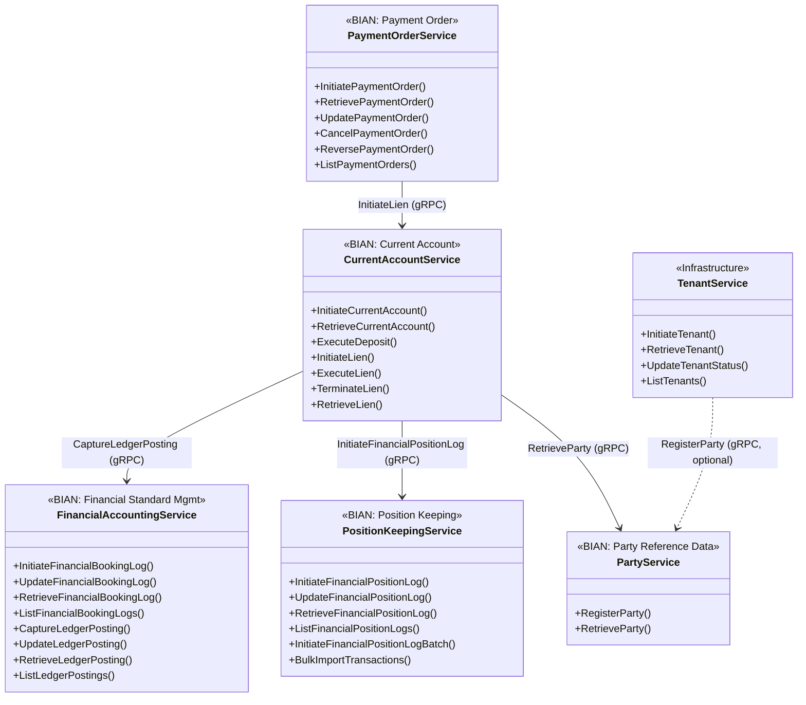

# Meridian Protocol Buffer Definitions

This directory contains Protocol Buffer (protobuf) definitions for all Meridian services and events.

## Directory Structure

```text
api/proto/
├── meridian/
│   ├── common/v1/                # Common types shared across services
│   ├── current_account/v1/       # CurrentAccount BIAN service
│   ├── financial_accounting/v1/  # FinancialAccounting BIAN service
│   ├── party/v1/                 # Party BIAN service
│   ├── payment_order/v1/         # PaymentOrder BIAN service
│   ├── platform/v1/              # Platform services (idempotency)
│   ├── position_keeping/v1/      # PositionKeeping BIAN service
│   ├── tenant/v1/                # Tenant infrastructure service
│   └── events/v1/                # Kafka event schemas
```

## Service Architecture

The diagram below shows the gRPC service interfaces and their runtime dependencies.
Banks adopting BIAN standards can integrate services individually or as a complete suite.



**Key:**

- Solid arrows (`-->`) = required runtime dependency
- Dashed arrows (`..>`) = optional runtime dependency (graceful degradation if unavailable)

**Standalone Services** (can operate independently):

- PartyService, PositionKeepingService, FinancialAccountingService, TenantService

**Dependent Services** (require upstream services):

- CurrentAccountService → Party, PositionKeeping, FinancialAccounting
- PaymentOrderService → CurrentAccount (for fund reservations via Lien)
- TenantService → Party (optional: registers organisation Party on tenant creation)

## Tooling

Meridian uses [buf](https://buf.build) for protobuf management:

- **buf.yaml**: Lint and breaking change detection configuration
- **buf.gen.yaml**: Code generation configuration
- **Makefile**: Convenience targets for proto operations

### Available Commands

```bash

# Generate Go code from proto definitions

make proto

# Lint proto files

make proto-lint

# Check for breaking changes against develop branch

make proto-breaking

# Install all protobuf tools

make install
```

## Code Generation

Generated code is placed alongside proto definitions:

```text
api/proto/meridian/common/v1/
├── health.proto          # Source definition
├── health.pb.go          # Generated protobuf code
├── health_grpc.pb.go     # Generated gRPC service code
└── health.pb.validate.go # Generated validation code
```

**Note**: Generated files (`*.pb.go`) are committed to version control for reproducibility.

## OpenAPI Specification

An OpenAPI (Swagger 2.0) specification is generated from the proto definitions using grpc-gateway annotations.

### Generating the OpenAPI Spec

```bash
# Generate all code including OpenAPI spec
make proto

# The spec is written to:
# api/openapi/meridian.swagger.json
```

### Accessing the OpenAPI Spec

The generated spec is **not committed to version control** (it's in `.gitignore`).
Generate it locally with `make proto` or `buf generate`.

**Output location**: `api/openapi/meridian.swagger.json`

### Features

The OpenAPI specification includes:

- **HTTP/REST mappings** for all gRPC endpoints via `google.api.http` annotations
- **Bearer token authentication** security definitions
- **201 Created response codes** for resource creation endpoints
- **Request/response schemas** derived from protobuf messages

### Using the Spec

1. **Import into Postman/Insomnia**: Import `api/openapi/meridian.swagger.json` directly
2. **Generate client SDKs**: Use OpenAPI Generator with the spec
3. **API documentation**: Host with Swagger UI or Redoc
4. **API Gateway configuration**: Use for AWS API Gateway, Kong, etc.

### Preview with Swagger UI

You can preview the API documentation locally using Swagger UI:

```bash
# Using Docker (recommended)
make proto
docker run -p 8080:8080 -e SWAGGER_JSON=/spec/meridian.swagger.json \
  -v $(pwd)/api/openapi:/spec swaggerapi/swagger-ui
# Open http://localhost:8080

# Using npx (quick preview)
make proto
npx swagger-ui-watcher api/openapi/meridian.swagger.json
```

### HTTP Endpoint Patterns

Services expose RESTful endpoints following these patterns:

| gRPC Method | HTTP Method | URL Pattern |
|-------------|-------------|-------------|
| `InitiatePaymentOrder` | POST | `/v1/payment-orders` |
| `RetrievePaymentOrder` | GET | `/v1/payment-orders/{payment_order_id}` |
| `UpdatePaymentOrder` | PATCH | `/v1/payment-orders/{payment_order_id}` |
| `InitiateCurrentAccount` | POST | `/v1/current-accounts` |
| `InitiateLien` | POST | `/v1/current-accounts/{account_id}/liens` |
| `Check` (Health) | GET | `/v1/health` |

## Writing Proto Definitions

### Package Naming

Follow the pattern: `meridian.<domain>.<version>`

```protobuf
syntax = "proto3";

package meridian.financial_accounting.v1;

option go_package = "github.com/meridianhub/meridian/api/proto/meridian/financial_accounting/v1;financialaccountingv1";
```

### Directory Structure

Proto files must be in a directory matching their package:

- Package: `meridian.common.v1`
- Directory: `api/proto/meridian/common/v1/`

### Linting Rules

Buf enforces strict linting rules (configured in buf.yaml):

1. **STANDARD**: Follow standard protobuf style guide
2. **COMMENTS**: All public elements must have comments
3. **Enum zero values**: Must end with `_UNSPECIFIED`
4. **Service suffix**: Services must end with `Service`
5. **RPC naming**: Request/Response types should match RPC name

Example:

```protobuf
// HealthService provides health check endpoints.
service HealthService {
  // Check performs a health check.
  rpc Check(CheckRequest) returns (CheckResponse);
}

// CheckRequest is the request for a health check.
message CheckRequest {
  // service is the name of the service to check (optional).
  string service = 1;
}

// CheckResponse is the response for a health check.
message CheckResponse {
  // ServingStatus describes the health status.
  enum ServingStatus {
    // SERVING_STATUS_UNSPECIFIED means the status is unknown.
    SERVING_STATUS_UNSPECIFIED = 0;
    // SERVING_STATUS_SERVING means healthy and serving.
    SERVING_STATUS_SERVING = 1;
  }

  // status is the health status of the service.
  ServingStatus status = 1;
}
```

## Breaking Change Detection

Buf compares proto changes against the `develop` branch to detect breaking changes:

```bash
make proto-breaking
```

This prevents accidental API breakages before merging to develop.

## Event Schema Evolution

Event schemas in `api/proto/meridian/events/` use protobuf's native versioning (per ADR-0004):

- Schema compatibility validated via `buf breaking` in CI/CD
- No runtime schema registry needed (Kafka is internal-only)
- Same protobuf definitions used for both gRPC and Kafka events
- New BIAN behaviour qualifiers → new event types (new topics)
- Backward-compatible changes → add optional fields

See [ADR-0004: Event Schema Evolution Strategy](../../docs/adr/0004-event-schema-evolution.md) for details.

## References

- [buf Documentation](https://buf.build/docs)
- [Protocol Buffers Guide](https://protobuf.dev/programming-guides/proto3/)
- [gRPC Go Quick Start](https://grpc.io/docs/languages/go/quickstart/)
- [ADR-0004: Event Schema Evolution Strategy](../../docs/adr/0004-event-schema-evolution.md)
