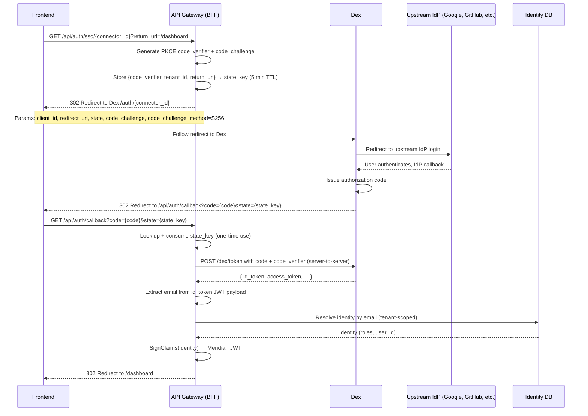

# Meridian Demo Environment — Auth Architecture

## Overview

The demo environment uses a **Backend For Frontend (BFF)** pattern for authentication. The API gateway
acts as the sole intermediary between the frontend and all identity operations. The frontend never
communicates with Dex directly.

Two authentication methods are supported:

| Method | Endpoint | Dex involvement |
|--------|----------|-----------------|
| Password | `POST /api/auth/login` | None — gateway validates credentials directly |
| SSO (OIDC) | `GET /api/auth/sso/{connector_id}` | Gateway orchestrates the full OAuth2 PKCE flow |

In both cases, the gateway issues a **Meridian JWT** — a short-lived token signed with an RSA private
key and validated by the gateway's auth middleware on subsequent requests. Clients never receive a Dex
token.

---

## Password Authentication Flow

Password authentication bypasses Dex entirely. The gateway validates credentials against the identity
store and signs a Meridian JWT directly.

```text
Frontend                  API Gateway               Identity DB
   |                           |                         |
   |-- POST /api/auth/login -->|                         |
   |   { email, password }     |                         |
   |                           |-- connector.Login() --->|
   |                           |<-- identity, valid -----|
   |                           |                         |
   |                           | SignClaims(identity)    |
   |<-- { access_token } ------|                         |
```

**Request:**

```http
POST /api/auth/login
Content-Type: application/json

{ "email": "user@example.com", "password": "..." }
```

**Response (200 OK):**

```json
{
  "access_token": "<meridian-jwt>",
  "token_type": "Bearer",
  "expires_in": 3600
}
```

The tenant is resolved from the request subdomain (e.g., `acme.demo.meridianhub.cloud`) or the
`X-Tenant-Slug` header in local development mode.

---

## SSO Authentication Flow

SSO uses the **OAuth2 authorization code flow with PKCE** (RFC 7636). The gateway generates and stores
PKCE parameters server-side, preventing code interception attacks without requiring a client secret.



**Key security properties:**

- The PKCE `code_verifier` is stored server-side and never sent to the browser. Dex validates the
  verifier against the challenge on token exchange.
- The `state` parameter is a 128-bit random key. Consuming it on callback prevents replay attacks.
- The token exchange (`POST /dex/token`) is a server-to-server call over HTTPS. The current
  implementation skips `id_token` signature verification on the basis that the token arrives
  directly from the Dex endpoint over a trusted TLS connection. This is a deliberate trade-off
  documented in the source (`auth_sso_handler.go`). Per RFC 8725, services that parse JWT claims
  to make security decisions should verify the signature; a future hardening step would add
  JWKS-based verification of the Dex `id_token`.
- The Meridian JWT is delivered in the URL fragment (`#access_token=...`). Fragments are not sent to
  servers in subsequent HTTP requests, preventing the token from appearing in access logs.
- The `return_url` parameter is sanitized to relative paths only. Absolute URLs and
  protocol-relative URLs are rejected to prevent open redirect attacks.

---

## Tenant Resolution

Every auth request is tenant-scoped. The gateway resolves the tenant before any authentication logic
runs.

| Mode | Resolution method |
|------|-------------------|
| Production | Subdomain: `{tenant-slug}.demo.meridianhub.cloud` |
| Local development (`LOCAL_DEV_MODE=true`) | `X-Tenant-Slug` request header |

For SSO flows, the tenant ID is captured at `HandleInitiate` time and stored in the PKCE state.
The callback endpoint (`/api/auth/callback`) does not need to re-resolve the tenant — it reads it
from the stored state.

---

## Adding a New Tenant (No Dex Restart Required)

Tenant onboarding does not require changes to `dex.yaml` or a Dex restart. SSO connectors are global
(configured once in Dex), while tenant membership is managed in the Meridian identity store.

To onboard a new tenant:

1. Create the tenant record in the Meridian database (via the admin API or direct DB insert).
2. Create user records in the identity store for that tenant, setting the email to match the upstream
   IdP account.
3. The next SSO login for a user whose email matches a record in that tenant will succeed
   automatically.

The `connector_id` in `GET /api/auth/sso/{connector_id}` maps to a connector defined in `dex.yaml`.
The same connector can serve multiple tenants — tenant context is preserved through the PKCE state
parameter, not the Dex connector.

---

## SSO Connector Configuration

Connectors are defined in `/opt/meridian/dex.yaml`. Adding a connector requires editing this file
and restarting the Dex container. No Meridian restart is needed.

**Restart Dex after editing `dex.yaml`:**

```bash
ssh root@<demo-server-ip>
cd /opt/meridian
docker compose restart dex
```

The demo server IP is recorded in the internal runbook. Do not commit it to this file.

### Google connector

```yaml
connectors:
  - type: google
    id: google
    name: Google
    config:
      clientID: YOUR_GOOGLE_CLIENT_ID
      clientSecret: YOUR_GOOGLE_CLIENT_SECRET
      # Must match the redirect URI registered in Google Cloud Console:
      # https://<dex-issuer>/dex/callback
      redirectURI: https://demo.meridianhub.cloud/dex/callback
```

Frontend trigger: `GET /api/auth/sso/google`

### GitHub connector

```yaml
connectors:
  - type: github
    id: github
    name: GitHub
    config:
      clientID: YOUR_GITHUB_CLIENT_ID
      clientSecret: YOUR_GITHUB_CLIENT_SECRET
      redirectURI: https://demo.meridianhub.cloud/dex/callback
      # Restrict to specific organisations (optional):
      orgs:
        - name: your-github-org
```

Frontend trigger: `GET /api/auth/sso/github`

### SAML connector (enterprise)

```yaml
connectors:
  - type: saml
    id: saml-corp
    name: Corporate SSO
    config:
      ssoURL: https://idp.example.com/saml/sso
      caData: |
        LS0tLS1CRUdJTi...  # base64-encoded CA certificate
      redirectURI: https://demo.meridianhub.cloud/dex/callback
      usernameAttr: email
      emailAttr: email
```

Frontend trigger: `GET /api/auth/sso/saml-corp`

---

## Environment Variables

### BFF SSO (API Gateway)

| Variable | Required | Default | Description |
|----------|----------|---------|-------------|
| `SSO_DEX_ISSUER_URL` | Yes (to enable SSO) | — | Dex issuer URL |
| `SSO_CLIENT_ID` | No | `meridian-service` | OAuth client ID registered in `dex.yaml` |
| `SSO_CALLBACK_URL` | Yes (when SSO enabled) | — | Absolute BFF callback URL |
| `JWT_SIGNING_KEY` | Yes (non-dev) | — | RSA private key in PEM format |
| `JWT_SIGNING_KEY_ID` | No | `meridian-1` | `kid` header value in issued JWTs |
| `JWT_SIGNING_ISSUER` | No | `meridian` | `iss` claim value in issued JWTs |
| `JWT_TOKEN_TTL` | No | `1h` | JWT lifetime (Go duration format, e.g. `2h`, `30m`) |

Example values for the demo environment:

- `SSO_DEX_ISSUER_URL=https://demo.meridianhub.cloud/dex`
- `SSO_CALLBACK_URL=https://demo.meridianhub.cloud/api/auth/callback`

### Auth Middleware (JWT Validation)

| Variable | Required | Default | Description |
|----------|----------|---------|-------------|
| `AUTH_ENABLED` | No | `false` | Enforce JWT validation on API routes |
| `JWKS_URL` | Yes (when `AUTH_ENABLED=true`) | `{DEX_ISSUER}/keys` | JWKS endpoint for JWT validation |
| `JWT_ISSUER` | No | — | Expected `iss` claim; validation skipped if empty |
| `JWT_AUDIENCE` | No | — | Expected `aud` claim; validation skipped if empty |

In the demo environment, `JWKS_URL` is set to `http://dex:5556/dex/keys` (the internal Dex
endpoint). This validates **Dex-issued tokens only**.

When SSO is enabled (`SSO_DEX_ISSUER_URL` is set), the auth middleware builds a **composite
validator**: it first tries the local `JWT_SIGNING_KEY` (for Meridian BFF tokens issued by
`HandleLogin` and `HandleCallback`), and falls back to the Dex JWKS endpoint for any Dex-issued
tokens. The gateway's own public key is served at `GET /api/auth/jwks`.

Setting `JWKS_URL` to Dex's keys endpoint is therefore correct: Meridian tokens are validated
locally against `JWT_SIGNING_KEY`, while the Dex JWKS covers the fallback path.

---

## Registered Endpoints

| Method | Path | Handler | Auth required |
|--------|------|---------|---------------|
| `POST` | `/api/auth/login` | `AuthHandler.HandleLogin` | No |
| `GET` | `/api/auth/jwks` | `AuthHandler.HandleJWKS` | No |
| `GET` | `/api/auth/sso/{connector_id}` | `SSOHandler.HandleInitiate` | No |
| `GET` | `/api/auth/callback` | `SSOHandler.HandleCallback` | No |

All other `/api/*` routes require a valid Meridian JWT in the `Authorization: Bearer <token>` header.

---

## Multi-Replica Considerations

The PKCE state store (`StateStore`) is an in-memory structure. With a single gateway replica (the
current demo topology), this is sufficient. If the gateway is scaled horizontally, the
`HandleInitiate` and `HandleCallback` requests may land on different replicas, causing state lookup
failures.

To support horizontal scaling, replace `StateStore` with a shared store. The `StateStore` is
injected via `SSOHandlerConfig.StateStore`, so the swap requires no changes to handler logic:

- **Redis**: Store state as a Redis key with 5-minute TTL.
- **Database**: Store state in a short-lived database table with `expires_at` column.
- **Signed encrypted tokens**: Encode state as an encrypted, signed URL parameter (stateless, no
  shared store needed).
