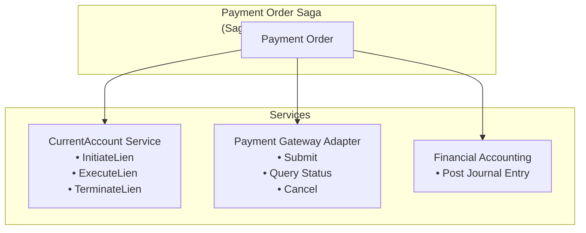
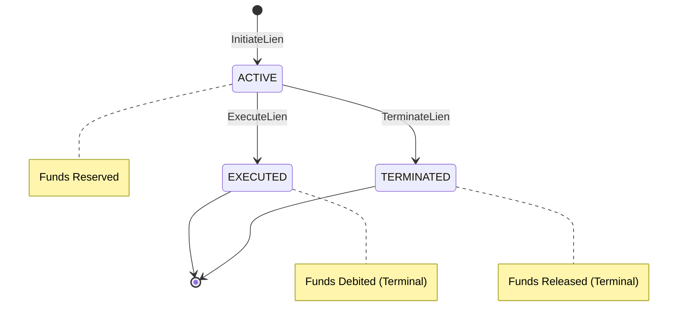

# 12. Lien-Based Fund Reservation for Payment Order Saga

Date: 2025-11-25

## Status

Accepted

> **Orchestration mechanism superseded by [ADR-0028](0028-starlark-saga-cel-valuation.md) (2026-01).** The lien-based
> fund-reservation *decision* (reserve funds via a lien, then confirm or compensate) still holds. The Go-coded
> `PaymentOrderSaga.Execute` shown below is no longer the orchestration mechanism: saga step sequencing and LIFO
> compensation are now expressed as Starlark saga definitions executed by `shared/pkg/saga.StarlarkSagaRunner`. Read the
> Go saga below for the lien/compensation semantics, not as the current control flow.

## Context

The Payment Order service domain orchestrates multi-step payment flows that involve:

1. Reserving funds from the debtor's account
2. Executing external payment (e.g., Faster Payments, SEPA)
3. Confirming or compensating based on external outcome

Without fund reservation, a race condition exists: between checking available balance and executing the debit,
other transactions could reduce the balance below the required amount, causing overdrafts or failed payments.

Traditional approaches include:

- **Pessimistic locking**: Lock the account row during the entire saga (blocks concurrent operations)
- **Optimistic locking**: Check balance at execution time, fail if insufficient (requires retry logic)
- **Two-phase commit**: Distributed transaction across services (complex, poor availability)

Banking systems have long solved this with **liens** (also called holds, reservations, or earmarks) - a mechanism
to reserve funds without immediately debiting them.

## Decision Drivers

- **Overdraft prevention**: Must guarantee funds exist before initiating external payment
- **Saga compensation**: Must be able to release funds if external payment fails
- **Concurrent access**: Multiple payments from same account must work correctly
- **BIAN alignment**: Follow BIAN v14 Current Account service domain patterns
- **Audit requirements**: Full traceability of fund reservations for regulatory compliance
- **Performance**: Avoid blocking concurrent account operations during long-running sagas

## Considered Options

1. **Pessimistic locking** - Lock account during saga execution
2. **Optimistic locking with retry** - Check balance at execution, retry on conflict
3. **Immediate debit with reversal** - Debit immediately, reverse if payment fails
4. **Lien-based reservation** - Reserve funds via lien, execute or terminate based on outcome

## Decision Outcome

Chosen option: **Lien-based reservation**, because it provides the safety guarantees of pessimistic locking
while maintaining the availability benefits of optimistic concurrency. It aligns with established banking
patterns and BIAN's Current Account service domain.

### Architecture



**Saga Flow:**

1. `InitiateLien(account, amount)` → Lien(ACTIVE)
2. Submit to Payment Gateway → External Payment
3. Success: `ExecuteLien(lien_id)` → Lien(EXECUTED), Transaction created
4. Failure: `TerminateLien(lien_id, reason)` → Lien(TERMINATED), Funds released

### Lien State Machine



### Balance Invariant

**Formula:** `Available Balance = Current Balance - Sum(Active Liens)`

| Component | Amount | Reference |
|-----------|--------|-----------|
| Current Balance | £1,000.00 | |
| Active Lien 1 | -£200.00 | Payment Order PO-001 |
| Active Lien 2 | -£150.00 | Payment Order PO-002 |
| **Available Balance** | **£650.00** | |

A new payment request for £700.00 would be rejected (insufficient available balance).

## Implementation

### Proto Definition (CurrentAccount Service)

```protobuf
// Lien lifecycle states
enum LienStatus {
  LIEN_STATUS_UNSPECIFIED = 0;
  LIEN_STATUS_ACTIVE = 1;      // Funds reserved
  LIEN_STATUS_EXECUTED = 2;    // Funds debited (terminal)
  LIEN_STATUS_TERMINATED = 3;  // Reservation released (terminal)
}

// Fund reservation record
message Lien {
  string lien_id = 1;
  string account_id = 2;
  MoneyAmount amount = 3;
  LienStatus status = 4;
  string payment_order_reference = 5;  // Links to orchestrating saga
  Timestamp created_at = 6;
  Timestamp updated_at = 7;
}

// BIAN Behavior Qualifiers
service CurrentAccountService {
  rpc InitiateLien(InitiateLienRequest) returns (InitiateLienResponse);
  rpc ExecuteLien(ExecuteLienRequest) returns (ExecuteLienResponse);
  rpc TerminateLien(TerminateLienRequest) returns (TerminateLienResponse);
  rpc RetrieveLien(RetrieveLienRequest) returns (RetrieveLienResponse);
}
```

### Saga Orchestration (Payment Order Service)

```go
func (s *PaymentOrderSaga) Execute(ctx context.Context, order *PaymentOrder) error {
    // Step 1: Reserve funds
    lien, err := s.currentAccount.InitiateLien(ctx, &InitiateLienRequest{
        AccountId:             order.DebtorAccountId,
        Amount:                order.Amount,
        PaymentOrderReference: order.Id,
        IdempotencyKey:        order.IdempotencyKey,
    })
    if err != nil {
        return fmt.Errorf("failed to reserve funds: %w", err)
    }

    // Step 2: Submit to payment network
    result, err := s.paymentGateway.Submit(ctx, order)
    if err != nil {
        // Compensation: Release the lien
        _, terminateErr := s.currentAccount.TerminateLien(ctx, &TerminateLienRequest{
            LienId: lien.LienId,
            Reason: fmt.Sprintf("Payment submission failed: %v", err),
        })
        if terminateErr != nil {
            // Log for manual reconciliation
            s.logger.Error("failed to terminate lien after payment failure",
                "lien_id", lien.LienId,
                "error", terminateErr)
        }
        return fmt.Errorf("payment submission failed: %w", err)
    }

    // Step 3: Execute the lien (debit the account)
    _, err = s.currentAccount.ExecuteLien(ctx, &ExecuteLienRequest{
        LienId: lien.LienId,
    })
    if err != nil {
        // Critical: Payment succeeded but debit failed
        // This requires manual intervention
        s.alerting.SendCriticalAlert(ctx, AlertLienExecutionFailed{
            LienId:         lien.LienId,
            PaymentOrderId: order.Id,
            Error:          err.Error(),
        })
        return fmt.Errorf("critical: payment succeeded but debit failed: %w", err)
    }

    return nil
}
```

### Database Implementation

```sql
CREATE TABLE liens (
    lien_id         UUID PRIMARY KEY DEFAULT gen_random_uuid(),
    account_id      UUID NOT NULL REFERENCES accounts(account_id),
    amount_cents    BIGINT NOT NULL CHECK (amount_cents > 0),
    currency        VARCHAR(3) NOT NULL,
    status          VARCHAR(20) NOT NULL DEFAULT 'ACTIVE',
    payment_order_reference VARCHAR(255) NOT NULL,
    created_at      TIMESTAMPTZ NOT NULL DEFAULT NOW(),
    updated_at      TIMESTAMPTZ NOT NULL DEFAULT NOW(),

    CONSTRAINT valid_status CHECK (status IN ('ACTIVE', 'EXECUTED', 'TERMINATED'))
);

-- Index for available balance calculation
CREATE INDEX idx_liens_account_status ON liens(account_id, status) WHERE status = 'ACTIVE';

-- Index for payment order queries
CREATE INDEX idx_liens_payment_order ON liens(payment_order_reference);

-- Function to calculate available balance
CREATE OR REPLACE FUNCTION available_balance(p_account_id UUID)
RETURNS BIGINT AS $$
    SELECT COALESCE(
        (SELECT current_balance_cents FROM accounts WHERE account_id = p_account_id),
        0
    ) - COALESCE(
        (SELECT SUM(amount_cents) FROM liens
         WHERE account_id = p_account_id AND status = 'ACTIVE'),
        0
    );
$$ LANGUAGE SQL STABLE;
```

### Concurrent Lien Creation

When multiple Payment Orders attempt to reserve funds simultaneously, the combined amount may exceed available
balance. The service layer handles this with atomic check-and-reserve:

```sql
-- Atomic check-and-reserve with row-level locking
BEGIN;
SELECT current_balance_cents,
       (SELECT COALESCE(SUM(amount_cents), 0) FROM liens
        WHERE account_id = $1 AND status = 'ACTIVE') as reserved
FROM accounts
WHERE account_id = $1
FOR UPDATE;  -- Row-level lock prevents concurrent modifications

-- Application checks: current_balance - reserved >= requested_amount
-- If sufficient: INSERT INTO liens ...
COMMIT;
```

The `FOR UPDATE` lock is held only for the duration of the balance check and lien insertion (milliseconds),
not the entire saga duration. This provides atomicity without the blocking issues of pessimistic locking.

### Idempotency

All lien operations must be idempotent for safe saga retries.

**InitiateLien**: Uses `IdempotencyKey` to ensure exactly-once creation:

```go
func (s *LienService) InitiateLien(ctx context.Context, req *InitiateLienRequest) (*Lien, error) {
    // Check idempotency cache first
    if existing, found := s.idempotencyCache.Get(req.IdempotencyKey); found {
        return existing.(*Lien), nil
    }
    // Proceed with lien creation...
}
```

**ExecuteLien**: Idempotent by `lien_id` - calling ExecuteLien on an already-executed lien returns success
with the same response. This is critical when the saga orchestrator retries after a timeout:

```go
func (s *LienService) ExecuteLien(ctx context.Context, req *ExecuteLienRequest) (*ExecuteLienResponse, error) {
    lien, err := s.repo.FindByID(ctx, req.LienId)
    if err != nil {
        return nil, err
    }

    // Idempotent: return success if already executed
    if lien.Status == LienStatusExecuted {
        return &ExecuteLienResponse{
            Lien:             lien,
            TransactionId:    lien.TransactionId,  // Previously created
            AvailableBalance: s.getAvailableBalance(ctx, lien.AccountId),
        }, nil
    }

    // Proceed with execution...
}
```

**TerminateLien**: Similarly idempotent - terminating an already-terminated lien returns success.

## Positive Consequences

- **Guaranteed fund availability**: Liens ensure funds exist before external payment initiation
- **Safe saga compensation**: TerminateLien cleanly releases funds on failure
- **Concurrent payment support**: Multiple payments can reserve funds simultaneously
- **Full audit trail**: Every reservation is recorded with timestamps and payment references
- **BIAN alignment**: Follows established banking industry patterns
- **No blocking**: Unlike pessimistic locking, doesn't block concurrent account operations

## Negative Consequences

- **Complexity**: Additional service calls in the payment flow
- **Orphaned liens**: Saga failures could leave liens in ACTIVE state (mitigated by monitoring/cleanup jobs)
- **Balance fragmentation**: Many small liens could reduce available balance significantly
- **Storage overhead**: Liens table grows with transaction volume (mitigated by archival)

## Comparison with Alternatives

### Pessimistic Locking

```go
// Anti-pattern: Blocks all concurrent operations
tx := db.BeginSerializable()
defer tx.Rollback()

account := tx.LockAccount(accountId)  // Blocks other transactions
if account.Balance < amount {
    return ErrInsufficientFunds
}
// ... long-running external call ...
account.Balance -= amount
tx.Commit()
```

**Problems:**
- Blocks concurrent deposits, withdrawals, balance queries
- Long-running external calls hold locks for extended periods
- Database contention under load

### Immediate Debit with Reversal

```go
// Anti-pattern: Temporary overdraft risk
account.Balance -= amount  // Immediate debit
if err := paymentGateway.Submit(order); err != nil {
    account.Balance += amount  // Reversal
    return err
}
```

**Problems:**
- Brief window where account shows incorrect balance
- Concurrent operations see wrong balance
- Regulatory issues with showing overdraft state

### Lien-Based (Chosen)

**Benefits:**
- No blocking of concurrent operations
- Balance always accurate (includes pending reservations)
- Clean compensation path
- Industry-standard pattern

## Links

- [ADR-0005: Adapter Pattern for Layer Translation](0005-adapter-pattern-layer-translation.md)
- [BIAN v14 Current Account Service Domain](https://bian.org/semantic-apis/current-account/) - Defines the
  CurrentAccountFacility control record and associated behavior qualifiers
- [Saga Pattern (Microsoft)](https://docs.microsoft.com/en-us/azure/architecture/reference-architectures/saga/saga)
- [GitHub Issue #7: Payment Order Service](https://github.com/meridianhub/meridian/issues/7)
- [PR #153: Add Lien Control Record to CurrentAccount proto](https://github.com/meridianhub/meridian/pull/153)

## Notes

### Lien Expiration

Consider adding `expires_at` field for automatic termination of stale liens:

```protobuf
message Lien {
  // ... existing fields ...
  google.protobuf.Timestamp expires_at = 8;  // Optional auto-termination
}
```

A background job would terminate expired liens and alert on potential orphaned payment orders. This enhancement
is tracked for future implementation as part of the Payment Order service development.

### Monitoring Requirements

- **Alert on stale active liens**: Liens in ACTIVE state > 24 hours indicate failed sagas
- **Dashboard for lien utilization**: Track reserved vs. available funds ratio
- **Audit reports**: All lien state transitions for compliance

### Future Enhancements

- **ListLiens RPC**: Query all liens for an account (useful for support/debugging)
- **Partial execution**: Execute only part of a lien amount
- **Lien extension**: Extend expiration for long-running payment processes
