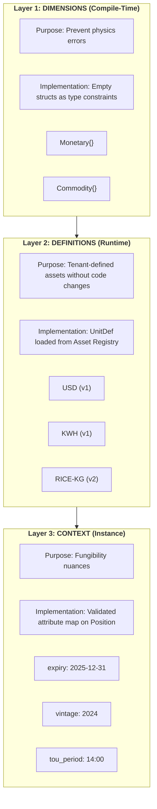
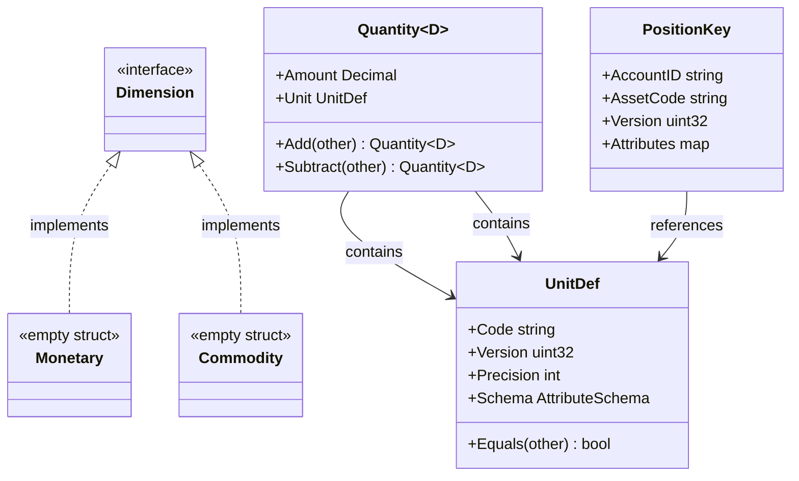
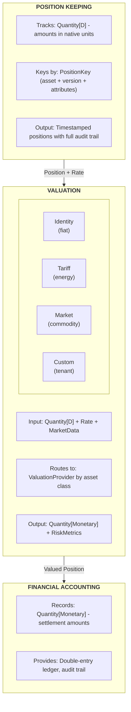

# 13. Universal Quantity Type System

Date: 2025-12-03

## Status

Proposed

## Context

Meridian is a **high-integrity transaction engine**. At its core, the system does two things:

1. **Position Keeping**: Track quantities in their native units
2. **Valuation**: Convert positions to settlement currency

### The Key Insight: Fiat is the Degenerate Case

Today, Meridian tracks fiat currency. The valuation function is trivial: £1 = £1.

But the architecture we've built - Position Keeping, Financial Accounting, Sagas, audit trails -
applies to *any* quantifiable asset. The only thing that changes is the **valuation function**:

| Asset Type | Position (Native Unit) | Valuation Function | Settlement |
|------------|----------------------|-------------------|------------|
| Fiat | £100.00 | Identity (1:1) | £100.00 |
| Energy | 150 kWh | Tariff × Time-of-Use | £52.50 |
| Compute | 10 GPU-hours | Spot Price × Region | $25.00 |
| Inventory | 500 kg Rice | Market Price × Quality | €875.00 |
| Carbon | 50 tCO2e | Exchange Price × Vintage | €2,750.00 |

**Position Keeping is asset-agnostic. Valuation is where complexity lives.**

### The SaaS Challenge

A prototype can hardcode asset types. An enterprise platform cannot.

**Requirements:**
- Tenants must define new assets (e.g., "RICE-VOUCHER") without code deployment
- Assets may have **contextual attributes** (expiry dates, vintages, time-of-use periods)
- Schema changes must not corrupt historical data
- The compiler must still catch "physics errors" (adding money to rice)

This demands a **hybrid approach**: compile-time safety for dimensions, runtime flexibility for definitions.

## Decision Drivers

* **Compile-time dimensional safety**: Prevent physics errors (money + rice) at build time
* **Runtime asset flexibility**: New assets without code deployment
* **Contextual fungibility**: Support expiry, vintage, time-of-use as position attributes
* **Schema evolution**: Asset definition changes must not mutate historical ledger entries
* **Precision flexibility**: Different assets need different precision (fiat: 2, crypto: 8)
* **Migration path**: Existing Money usage must migrate incrementally

## Decision Outcome

Chosen option: **Dimensional Hybrid Pattern** - separating Physics (Code) from Policy (Data).

### The 3-Layer Asset Model



| Layer | Purpose | Implementation | Changes Require |
|-------|---------|----------------|-----------------|
| **Dimensions** | Prevent physics errors | Empty structs (`Monetary{}`, `Commodity{}`) | Code deployment |
| **Definitions** | Tenant asset catalog | `UnitDef` from database | Registry update |
| **Context** | Position attributes | Validated attribute map | Nothing (data) |

### Core Types

```go
// =============================================================================
// LAYER 1: DIMENSIONS (Compile-Time Physics)
// =============================================================================

// Dimensions are empty structs - they exist only for type constraints.
// You cannot accidentally add Monetary to Commodity.

type Monetary struct{}   // Money, currencies, financial instruments
type Commodity struct{}  // Physical goods, energy, compute resources

// =============================================================================
// LAYER 2: DEFINITIONS (Runtime Products)
// =============================================================================

// UnitDef is loaded from the Asset Registry at runtime.
// Tenants create these without code changes.

type UnitDef struct {
    Code      string          // "USD", "KWH", "RICE-VOUCHER"
    Version   uint32          // Schema version (1, 2, 3...)
    Precision int             // Decimal places (2, 4, 0)
    Schema    AttributeSchema // Rules for Layer 3 validation
}

// Equality check enforces version - Rice(v1) ≠ Rice(v2)
func (u UnitDef) Equals(other UnitDef) bool {
    return u.Code == other.Code && u.Version == other.Version
}

// =============================================================================
// LAYER 3: THE UNIVERSAL CONTAINER
// =============================================================================

// Quantity is parameterized by Dimension, not by specific asset.
// This gives compile-time safety without compile-time asset definitions.

type Quantity[D any] struct {
    Amount decimal.Decimal
    Unit   UnitDef
}

// Type aliases for domain clarity
type Money = Quantity[Monetary]
type Asset = Quantity[Commodity]

// =============================================================================
// POSITION KEY: Handles Fungibility/Context
// =============================================================================

// A position is unique based on WHAT it is and WHICH batch/context it belongs to.

type PositionKey struct {
    AccountID  string
    AssetCode  string            // From UnitDef.Code
    Version    uint32            // From UnitDef.Version
    Attributes map[string]string // Validated by Schema (expiry, vintage, tou)
}
```

### Compile-Time Safety

```go
// COMPILES: Same dimension
dollars := Money{Amount: decimal.NewFromInt(100), Unit: usdDef}
euros := Money{Amount: decimal.NewFromInt(50), Unit: eurDef}
sum, err := dollars.Add(euros)  // OK: both Quantity[Monetary]

// COMPILE ERROR: Different dimensions
rice := Asset{Amount: decimal.NewFromInt(500), Unit: riceDef}
invalid := dollars.Add(rice)  // Error: cannot use Quantity[Commodity] as Quantity[Monetary]

// RUNTIME CHECK: Same dimension, different assets
mixed, err := dollars.Add(euros)  // Returns ErrCurrencyMismatch (USD ≠ EUR)

// RUNTIME CHECK: Same asset, different versions
riceV1 := Asset{Amount: decimal.NewFromInt(100), Unit: riceDef_v1}
riceV2 := Asset{Amount: decimal.NewFromInt(100), Unit: riceDef_v2}
invalid, err := riceV1.Add(riceV2)  // Returns ErrVersionMismatch
```

### Type Hierarchy



### The Position/Valuation Model



**For fiat currency**: Valuation is the identity function. Position = Settlement.

**For everything else**: Valuation is where the domain complexity lives. The ledger
doesn't need to understand it - just route to the right provider.

### Why Dimensions, Not Specific Types?

**The alternative** (from earlier drafts) was `Quantity[Currency]`, `Quantity[EnergyUnit]`, etc.

**The problem**: Every new asset category requires a new Go type and code deployment.

**The solution**: Dimensions are coarse-grained categories that rarely change:
- `Monetary` - anything that settles to currency
- `Commodity` - physical goods, resources, inventory

New assets within a dimension (USD, EUR, KWH, GPU-HR, RICE-KG) are just `UnitDef` records
in the database. No code changes.

### Package Structure

```
pkg/platform/quantity/
├── quantity.go       // Quantity[D] generic type and operations
├── dimension.go      // Monetary{}, Commodity{} empty structs
├── unit.go           // UnitDef struct and validation
│
└── currency/         // Built-in fiat support (ISO 4217)
    ├── currency.go   // Predefined UnitDefs for major currencies
    └── codes.go      // USD, EUR, GBP, etc.
```

The core library provides the generic container. Asset definitions live in the database
(see [ADR-0014: Dynamic Asset Registry](0014-dynamic-asset-registry.md)).

### Rate Type for Valuation

```go
// Rate represents a conversion factor between two unit types.
// For temporal pricing, rates have validity periods.
type Rate struct {
    From      UnitDef
    To        UnitDef
    Factor    decimal.Decimal
    ValidFrom time.Time
    ValidTo   time.Time
}

// Identity rate for fiat (£1 = £1)
identityRate := Rate{From: gbpDef, To: gbpDef, Factor: decimal.NewFromInt(1)}

// FX rate
fxRate := Rate{From: usdDef, To: gbpDef, Factor: decimal.NewFromFloat(0.79)}
```

### Pluggable Valuation Architecture

The ledger doesn't implement valuation math. It routes to specialized providers.

```go
// ValuationProvider is implemented by each pricing engine
type ValuationProvider interface {
    Valuate(ctx context.Context, req ValuationRequest) (ValuationResponse, error)
    Supports(dimension string, assetCode string) bool
}

// The orchestrator routes to the appropriate provider
type ValuationOrchestrator struct {
    providers  []ValuationProvider
    marketData MarketDataService
}

func (v *ValuationOrchestrator) Valuate(ctx context.Context, position Position) (Money, error) {
    provider := v.findProvider(position.Dimension, position.Unit.Code)
    if provider == nil {
        // Monetary dimension with no special provider = identity
        return position.AsMoney(), nil
    }
    return provider.Valuate(ctx, position, v.marketData)
}
```

## Positive Consequences

* **Compile-time dimensional safety**: Cannot add Money to Commodity - caught by compiler
* **Runtime asset flexibility**: New assets via database, no code deployment
* **Version-based fungibility**: Rice(v1) ≠ Rice(v2), migration requires explicit trade
* **Contextual positions**: Attributes handle expiry, vintage, time-of-use
* **Clean separation**: Physics in code, Policy in data
* **Single Quantity implementation**: No duplication across asset types

## Negative Consequences

* **Learning curve**: Team must understand the 3-layer model
* **Migration effort**: Existing Money types need refactoring
* **Coarser compile-time checks**: USD vs EUR is runtime, not compile-time
* **Registry dependency**: Asset operations require Asset Registry lookup

## Links

* [ADR-0014: Dynamic Asset Registry & Lifecycle](0014-dynamic-asset-registry.md) - Asset definitions, versioning, migration
* [ADR-0003: Database Schema Migrations](0003-database-schema-migrations.md) - Money struct examples
* [ADR-0005: Adapter Pattern](0005-adapter-pattern-layer-translation.md) - Layer translation patterns
* [Go Generics Tutorial](https://go.dev/doc/tutorial/generics) - Official documentation
* [shopspring/decimal](https://github.com/shopspring/decimal) - Precise decimal arithmetic

## Notes

### Protocol Buffer Representation (Wire Format)

Use a generic asset message to avoid recompilation per asset type:

```protobuf
message AssetAmount {
    string amount = 1;           // Decimal as string
    string asset_code = 2;       // "USD", "KWH", "RICE-KG"
    uint32 version = 3;          // Schema version
    map<string, string> attributes = 4;  // Context (expiry, vintage, etc.)
}
```

The adapter layer validates:
1. `asset_code` exists in Registry
2. `version` matches or is compatible
3. `attributes` conform to the asset's schema

### Database Persistence

**Storage**: Composite columns for SQL aggregation:

```sql
CREATE TABLE positions (
    id UUID PRIMARY KEY,
    account_id UUID NOT NULL,
    asset_code VARCHAR(32) NOT NULL,
    asset_version INTEGER NOT NULL,
    amount DECIMAL(38, 18) NOT NULL,
    attributes JSONB,  -- Validated by application layer
    -- ...
    UNIQUE(account_id, asset_code, asset_version, attributes)
);
```

**Why composite + JSONB:**
- Composite columns enable `SUM(amount) WHERE asset_code = 'KWH'`
- JSONB handles variable attributes while preserving queryability
- Application layer enforces schema; database stores validated data

### Migration Strategy

Phase 1: Introduce Quantity[D] and UnitDef (non-breaking)

Phase 2: Create Currency UnitDefs for existing fiat types

Phase 3: Migrate services to use Quantity[Monetary] with UnitDef

Phase 4: Remove legacy Money types

### Reconsidering This Decision

Revisit if:
- Two dimensions prove insufficient (need finer compile-time granularity)
- Runtime dimension lookup causes performance issues
- The Asset Registry becomes a bottleneck for high-frequency operations
