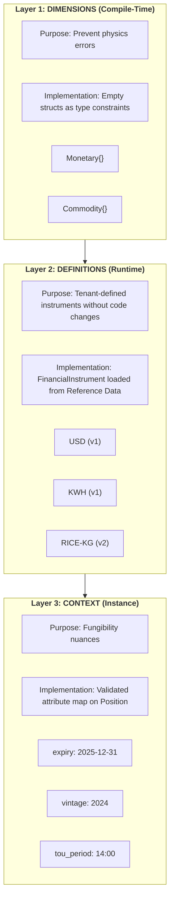
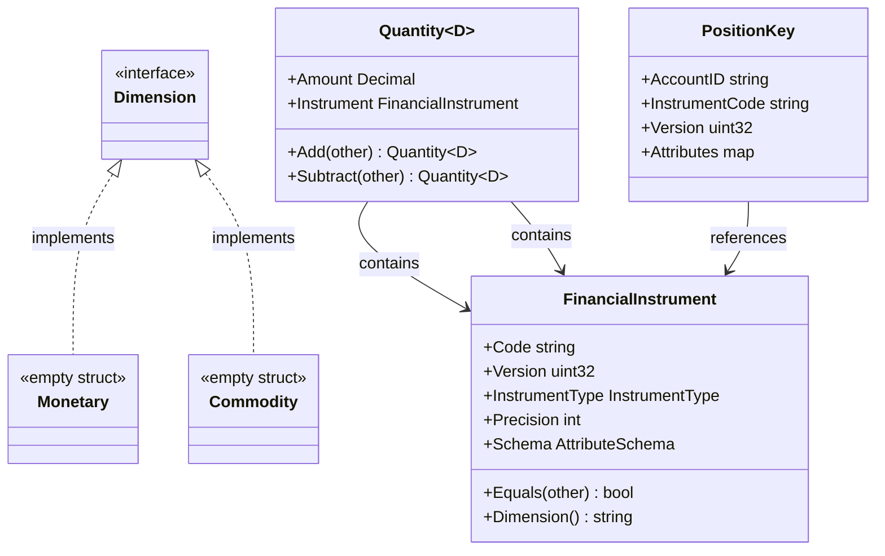
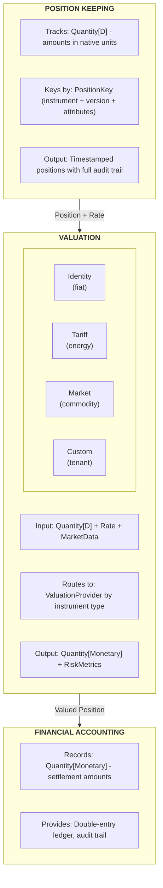

# 13. Universal Quantity Type System

Date: 2025-12-03

## Status

Accepted (Implemented)

## Context

Meridian is a **high-integrity transaction engine**. At its core, the system does two things:

1. **Position Keeping**: Track quantities in their native units
2. **Valuation**: Convert positions to settlement currency

### The Key Insight: Fiat is the Degenerate Case

Today, Meridian tracks fiat currency. The valuation function is trivial: £1 = £1.

But the architecture we've built - Position Keeping, Financial Accounting, Sagas, audit trails -
applies to *any* quantifiable financial instrument. The only thing that changes is the
**valuation function**:

| Instrument Type | Position (Native Unit) | Valuation Function | Settlement (GBP) |
|-----------------|----------------------|-------------------|------------------|
| Same-currency Fiat | £100.00 | Identity (1:1) | £100.00 |
| Cross-currency Fiat | $100.00 | FX Rate @ Timestamp | £79.00 |
| Energy | 150 kWh | Tariff × Time-of-Use | £52.50 |
| Compute | 10 GPU-hours | Spot Price × Region | £19.75 |
| Inventory | 500 kg Rice | Market Price × Quality | £875.00 |
| Carbon | 50 tCO2e | Exchange Price × Vintage | £2,750.00 |

**Position Keeping is instrument-agnostic. Valuation is where complexity lives.**

### The SaaS Challenge

A prototype can hardcode instrument types. An enterprise platform cannot.

**Requirements:**
- Tenants must define new financial instruments (e.g., "RICE-VOUCHER") without code deployment
- Instruments may have **contextual attributes** (expiry dates, vintages, time-of-use periods)
- Schema changes must not corrupt historical data
- The compiler must still catch "physics errors" (adding money to rice)

This demands a **hybrid approach**: compile-time safety for dimensions, runtime flexibility for definitions.

## Decision Drivers

* **Compile-time dimensional safety**: Prevent physics errors (money + rice) at build time
* **Runtime instrument flexibility**: New instruments without code deployment
* **Contextual fungibility**: Support expiry, vintage, time-of-use as position attributes
* **Schema evolution**: Instrument definition changes must not mutate historical ledger entries
* **Precision flexibility**: Different instruments need different precision (fiat: 2, crypto: 8)
* **Migration path**: Existing Money usage must migrate incrementally

## Decision Outcome

Chosen option: **Dimensional Hybrid Pattern** - separating Physics (Code) from Policy (Data).

### The 3-Layer Model



| Layer | Purpose | Implementation | Changes Require |
|-------|---------|----------------|-----------------|
| **Dimensions** | Prevent physics errors | Empty structs (`Monetary{}`, `Commodity{}`) | Code deployment |
| **Definitions** | Tenant instrument catalog | `FinancialInstrument` from BIAN Reference Data | Registry update |
| **Context** | Position attributes | Validated attribute map | Nothing (data) |

### Core Types

```go
// =============================================================================
// LAYER 1: DIMENSIONS (Compile-Time Physics)
// =============================================================================

// Dimensions are empty structs - they exist only for type constraints.
// You cannot accidentally add Monetary to Commodity.
// These map to BIAN InstrumentType categories.

type Monetary struct{}   // Currency, Debt, Equity, Derivatives
type Commodity struct{}  // Physical goods, energy, compute resources

// =============================================================================
// LAYER 2: DEFINITIONS (Runtime - BIAN Financial Instrument)
// =============================================================================

// FinancialInstrument is loaded from the BIAN Financial Instrument Reference
// Data Management service at runtime. Tenants create these without code changes.
// Maps to BIAN FinancialInstrument business object.

type FinancialInstrument struct {
    Code           string          // BIAN: FinancialInstrumentIdentification ("USD", "KWH")
    Version        uint32          // Schema version (1, 2, 3...)
    Dimension      string          // "Monetary" or "Commodity" - required for deserialization
    InstrumentType InstrumentType  // BIAN: FinancialInstrumentType
    Precision      int             // Decimal places (2, 4, 0)
}

// Note: Attribute validation uses CEL expressions stored in the Reference Data service.
// See ADR-0014 for CEL-based Schema-on-Write validation.

// InstrumentType aligns with BIAN financialinstrumenttypevalues.
type InstrumentType string

const (
    InstrumentTypeCurrency   InstrumentType = "Currency"
    InstrumentTypeDebt       InstrumentType = "Debt"
    InstrumentTypeEquity     InstrumentType = "Equity"
    InstrumentTypeDerivative InstrumentType = "Derivative"
    InstrumentTypeCommodity  InstrumentType = "Commodity"
)

// Dimension returns the compile-time dimension for this instrument type.
// Used for type safety and partition routing.
func (t InstrumentType) Dimension() string {
    switch t {
    case InstrumentTypeCommodity:
        return "Commodity"
    case InstrumentTypeCurrency, InstrumentTypeDebt, InstrumentTypeEquity, InstrumentTypeDerivative:
        return "Monetary"
    default:
        // Should never reach here: CHECK constraint enforces valid types at DB level
        return "Monetary"
    }
}

// Equality check enforces version - Rice(v1) ≠ Rice(v2)
func (f FinancialInstrument) Equals(other FinancialInstrument) bool {
    return f.Code == other.Code && f.Version == other.Version
}

// =============================================================================
// LAYER 3: THE UNIVERSAL CONTAINER
// =============================================================================

// Quantity is parameterized by Dimension, not by specific instrument.
// This gives compile-time safety without compile-time instrument definitions.

type Quantity[D any] struct {
    Amount     decimal.Decimal
    Instrument FinancialInstrument
}

// Type aliases for domain clarity
type Money = Quantity[Monetary]
type Physical = Quantity[Commodity]

// =============================================================================
// GENERIC BRIDGE: Runtime → Compile-Time Conversion
// =============================================================================

// ParseQuantity is the ONLY boundary where runtime strings become compile-time types.
// Go generics are erased at runtime, but DB/Proto use string dimensions.
// This factory reconstructs the correct Quantity type at the adapter layer.
func ParseQuantity(amount decimal.Decimal, instrument FinancialInstrument) (any, error) {
    switch instrument.Dimension {
    case "Monetary":
        return Quantity[Monetary]{Amount: amount, Instrument: instrument}, nil
    case "Commodity":
        return Quantity[Commodity]{Amount: amount, Instrument: instrument}, nil
    default:
        return nil, ErrUnknownDimension
    }
}

// =============================================================================
// POSITION KEY: Handles Fungibility/Context
// =============================================================================

// A position is unique based on WHAT it is and WHICH batch/context it belongs to.
// Maps to BIAN Position Keeping concepts.

type PositionKey struct {
    AccountID      string
    InstrumentCode string            // From FinancialInstrument.Code
    Version        uint32            // From FinancialInstrument.Version
    Attributes     map[string]string // Validated by Schema (expiry, vintage, tou)
}

// =============================================================================
// ERROR TYPES
// =============================================================================

import "errors"

var (
    // ErrInstrumentMismatch is returned when adding quantities of different instruments
    ErrInstrumentMismatch = errors.New("instrument mismatch: cannot combine different instruments")

    // ErrVersionMismatch is returned when adding quantities of different versions
    ErrVersionMismatch = errors.New("version mismatch: cannot combine different instrument versions")

    // ErrDimensionMismatch is returned when a loaded instrument has unexpected dimension
    ErrDimensionMismatch = errors.New("dimension mismatch: instrument type does not match expected dimension")

    // ErrUnknownDimension is returned when ParseQuantity receives an unrecognized dimension
    ErrUnknownDimension = errors.New("unknown dimension: must be 'Monetary' or 'Commodity'")
)
```

### Compile-Time Safety

```go
// COMPILES: Same dimension
dollars := Money{Amount: decimal.NewFromInt(100), Instrument: usdInstrument}
euros := Money{Amount: decimal.NewFromInt(50), Instrument: eurInstrument}
sum, err := dollars.Add(euros)  // OK: both Quantity[Monetary]

// COMPILE ERROR: Different dimensions
rice := Physical{Amount: decimal.NewFromInt(500), Instrument: riceInstrument}
invalid := dollars.Add(rice)  // Error: cannot use Quantity[Commodity] as Quantity[Monetary]

// RUNTIME CHECK: Same dimension, different instruments
mixed, err := dollars.Add(euros)  // Returns ErrInstrumentMismatch (USD ≠ EUR)

// RUNTIME CHECK: Same instrument, different versions
riceV1 := Physical{Amount: decimal.NewFromInt(100), Instrument: riceInstrument_v1}
riceV2 := Physical{Amount: decimal.NewFromInt(100), Instrument: riceInstrument_v2}
invalid, err := riceV1.Add(riceV2)  // Returns ErrVersionMismatch
```

### Type Hierarchy



### The Position/Valuation Model



**For same-currency fiat**: Valuation is the identity function. £100 GBP = £100 GBP.

**For cross-currency fiat**: Valuation requires FX rate lookup at a specific timestamp.
$100 USD → £X GBP depends on the exchange rate at valuation time. This is temporal
pricing, just like energy tariffs - the FX provider is simply another ValuationProvider.

**For non-fiat instruments**: Valuation routes to specialized providers (tariff engines,
market data feeds, custom tenant logic). The ledger doesn't implement the math -
it just routes to the right provider based on instrument type.

### Multi-Asset Examples

The following examples demonstrate how the Quantity[D] type system handles real-world
multi-asset scenarios.

#### Energy Position with Time-of-Use Pricing

Energy metering requires tracking consumption by time period for tariff calculation:

```go
package energy

import (
    "context"
    "fmt"

    "github.com/shopspring/decimal"
    "meridian/shared/domain/quantity"
)

// RecordEnergyUsage creates a position for energy consumption with time-of-use attributes.
// The tou_period (0-47) represents half-hourly slots in a day.
func RecordEnergyUsage(
    ctx context.Context,
    refData InstrumentReferenceDataService,
    positionKeeping PositionKeepingService,
    tenantID, accountID string,
    kwhUsed decimal.Decimal,
    touPeriod int,
    tariffZone string,
) error {
    // Load KWH instrument from Reference Data
    compiled, err := refData.RetrieveLatest(ctx, tenantID, "KWH")
    if err != nil {
        return fmt.Errorf("load KWH instrument: %w", err)
    }

    // Create position with time-of-use attributes
    position := quantity.Physical{
        Amount:     kwhUsed,
        Instrument: compiled.Definition.ToFinancialInstrument(),
    }

    attrs := map[string]string{
        "tou_period":  fmt.Sprintf("%d", touPeriod), // 0-47 for half-hourly slots
        "tariff_zone": tariffZone,
    }

    // Validate attributes against instrument schema
    if err := refData.ValidateAttributes(ctx, compiled, attrs); err != nil {
        return fmt.Errorf("invalid energy attributes: %w", err)
    }

    // Record measurement - separate positions per tou_period (fungibility rules)
    // Positions with different tou_period values cannot be merged
    return positionKeeping.RecordMeasurement(ctx, accountID, position, attrs)
}
```

#### Carbon Credit Trading with Vintage Tracking

Carbon credits require vintage and registry tracking for compliance:

```go
package carbon

import (
    "context"
    "fmt"

    "github.com/shopspring/decimal"
    "meridian/shared/domain/quantity"
)

// TransferCarbonCredits moves voluntary carbon units between accounts.
// VCU-2024 (v1) and VCU-2025 (v1) are separate instrument codes.
// Same vintage from different registries tracked separately via attributes.
func TransferCarbonCredits(
    ctx context.Context,
    refData InstrumentReferenceDataService,
    ledger LedgerService,
    tenantID string,
    fromAccount, toAccount string,
    tonnes decimal.Decimal,
    vintage, projectID, registry string,
) error {
    // Load VCU instrument - code includes vintage year
    instrumentCode := fmt.Sprintf("VCU-%s", vintage)
    compiled, err := refData.RetrieveLatest(ctx, tenantID, instrumentCode)
    if err != nil {
        return fmt.Errorf("load %s instrument: %w", instrumentCode, err)
    }

    // Create position for carbon credits
    vcuPosition := quantity.Physical{
        Amount:     tonnes, // Tonnes CO2 equivalent
        Instrument: compiled.Definition.ToFinancialInstrument(),
    }

    attrs := map[string]string{
        "vintage":    vintage,
        "project_id": projectID,
        "registry":   registry, // e.g., "VERRA", "GOLD_STANDARD"
    }

    // Validate attributes - registry must be recognized
    if err := refData.ValidateAttributes(ctx, compiled, attrs); err != nil {
        return fmt.Errorf("invalid carbon credit attributes: %w", err)
    }

    // Fungibility check: same project + registry + vintage can merge
    // Different registries = different positions (regulatory requirement)
    return ledger.Transfer(ctx, fromAccount, toAccount, vcuPosition, attrs)
}
```

#### GPU-Hour Metering for Cloud Billing

Compute resources tracked by region and instance type:

```go
package compute

import (
    "context"
    "fmt"

    "github.com/shopspring/decimal"
    "meridian/shared/domain/quantity"
)

// RecordComputeUsage tracks GPU compute consumption for billing.
// Different regions and instance types are non-fungible for pricing accuracy.
func RecordComputeUsage(
    ctx context.Context,
    refData InstrumentReferenceDataService,
    positionKeeping PositionKeepingService,
    tenantID, accountID string,
    gpuHours decimal.Decimal,
    region, instanceType string,
) error {
    // Load GPU-HOUR instrument
    compiled, err := refData.RetrieveLatest(ctx, tenantID, "GPU-HOUR")
    if err != nil {
        return fmt.Errorf("load GPU-HOUR instrument: %w", err)
    }

    // Create compute position
    computePosition := quantity.Physical{
        Amount:     gpuHours, // e.g., 2.5 GPU-hours
        Instrument: compiled.Definition.ToFinancialInstrument(),
    }

    attrs := map[string]string{
        "region":        region,        // e.g., "us-east-1"
        "instance_type": instanceType,  // e.g., "p4d.24xlarge"
    }

    // Positions are only fungible within same region + instance type
    // This ensures accurate pricing (spot rates vary by region)
    return positionKeeping.RecordMeasurement(ctx, accountID, computePosition, attrs)
}
```

### Temporal Pricing for Energy Tariffs

Energy tariffs vary by time of day. The valuation layer handles this complexity:

```go
// TariffRate represents a time-bound energy price
type TariffRate struct {
    TariffZone  string
    TOUPeriod   int             // 0-47 (half-hourly)
    PricePerKWH decimal.Decimal // Rate in settlement currency
    ValidFrom   time.Time
    ValidTo     time.Time
}

// EnergyValuationProvider implements ValuationProvider for energy positions
type EnergyValuationProvider struct {
    tariffService TariffService
}

func (p *EnergyValuationProvider) Valuate(
    ctx context.Context,
    req ValuationRequest,
) (ValuationResponse, error) {
    // Extract attributes from position
    touPeriod, _ := strconv.Atoi(req.Attributes["tou_period"])
    tariffZone := req.Attributes["tariff_zone"]

    // Lookup tariff rate for the specific time period
    rate, err := p.tariffService.GetRate(ctx, tariffZone, touPeriod, req.ValuationTime)
    if err != nil {
        return ValuationResponse{}, fmt.Errorf("tariff lookup: %w", err)
    }

    // Value = Amount * TariffRate
    // 150 kWh * £0.35/kWh = £52.50
    valuedAmount := req.Position.Amount.Mul(rate.PricePerKWH)

    return ValuationResponse{
        OriginalPosition: req.Position,
        ValuedAmount: quantity.Money{
            Amount:     valuedAmount,
            Instrument: p.settlementCurrency,
        },
        Rate:          rate.PricePerKWH,
        ValuationTime: req.ValuationTime,
    }, nil
}

func (p *EnergyValuationProvider) Supports(instrumentType InstrumentType, code string) bool {
    return instrumentType == InstrumentTypeCommodity && strings.HasPrefix(code, "KWH")
}
```

### Valuation Complexity by Instrument Type

| Instrument | Position Unit | Valuation Complexity | Provider |
|------------|---------------|---------------------|----------|
| Same-currency Fiat | GBP 100.00 | Identity (1:1) | IdentityProvider |
| Cross-currency Fiat | USD 100.00 | FX rate at timestamp | FXProvider |
| Energy | 150 kWh | Tariff x Time-of-Use x Zone | TariffProvider |
| Compute | 10 GPU-hours | Spot price x Region x Instance | ComputePricingProvider |
| Carbon Credits | 50 tCO2e | Exchange price x Vintage x Registry | CarbonMarketProvider |
| Inventory | 500 kg Rice | Market price x Quality grade | CommodityMarketProvider |

**Key insight**: Position Keeping is simple (track amounts by attributes). Valuation is
where the complexity lives, and it's handled by pluggable providers, not the core ledger.

### Why Dimensions, Not Specific Types?

**The alternative** (from earlier drafts) was `Quantity[Currency]`, `Quantity[EnergyUnit]`, etc.

**The problem**: Every new instrument category requires a new Go type and code deployment.

**The solution**: Dimensions are coarse-grained categories that rarely change:
- `Monetary` - anything that settles to currency (BIAN: Currency, Debt, Equity, Derivative)
- `Commodity` - physical goods, resources, inventory (BIAN: Commodity)

New instruments within a dimension (USD, EUR, KWH, GPU-HR, RICE-KG) are just
`FinancialInstrument` records in the BIAN Reference Data service. No code changes.

### Package Structure

```
shared/platform/quantity/
├── quantity.go       // Quantity[D] generic type and operations
├── dimension.go      // Monetary{}, Commodity{} empty structs
├── instrument.go     // FinancialInstrument struct
│
└── currency/         // Built-in fiat support (ISO 4217)
    ├── currency.go   // Predefined instruments for major currencies
    └── codes.go      // USD, EUR, GBP, etc.
```

The core library provides the generic container. Financial Instrument definitions live in the
BIAN Financial Instrument Reference Data Management service
(see [ADR-0014: Financial Instrument Reference Data](0014-financial-instrument-reference-data.md)).

### Rate Type for Valuation

```go
// Rate represents a conversion factor between two instruments.
// For temporal pricing, rates have validity periods.
// Maps to BIAN Financial Instrument Valuation concepts.
type Rate struct {
    From      FinancialInstrument
    To        FinancialInstrument
    Factor    decimal.Decimal
    ValidFrom *time.Time  // nil = effective from beginning of time
    ValidTo   *time.Time  // nil = effective indefinitely
}

// Identity rate for fiat (£1 = £1)
identityRate := Rate{From: gbpInstrument, To: gbpInstrument, Factor: decimal.NewFromInt(1)}

// FX rate
fxRate := Rate{From: usdInstrument, To: gbpInstrument, Factor: decimal.NewFromFloat(0.79)}
```

**Rate Resolution Semantics:**

- **Selection**: For a given valuation timestamp, select rates where `ValidFrom <= timestamp < ValidTo`
- **Overlaps**: If multiple rates match, prefer the one with the latest `ValidFrom` (most recent wins)
- **Gaps**: If no rate exists for a timestamp, valuation fails with `ErrNoRateAvailable`
- **Missing bounds**: `nil ValidFrom` means effective from epoch; `nil ValidTo` means no expiry

Detailed rate resolution rules will be specified in the ValuationOrchestrator implementation.

### Pluggable Valuation Architecture

The ledger doesn't implement valuation math. It routes to specialized providers.
This aligns with BIAN's separation of Position Keeping from Financial Instrument Valuation.

```go
// ValuationProvider is implemented by each pricing engine
type ValuationProvider interface {
    Valuate(ctx context.Context, req ValuationRequest) (ValuationResponse, error)
    Supports(instrumentType InstrumentType, instrumentCode string) bool
}

// The orchestrator routes to the appropriate provider
type ValuationOrchestrator struct {
    providers  []ValuationProvider
    marketData MarketDataService
}

func (v *ValuationOrchestrator) Valuate(ctx context.Context, position Position) (Money, error) {
    provider := v.findProvider(position.Instrument.InstrumentType, position.Instrument.Code)
    if provider == nil {
        // Monetary dimension with no special provider = identity
        return position.AsMoney(), nil
    }
    return provider.Valuate(ctx, position, v.marketData)
}
```

## Positive Consequences

* **Compile-time dimensional safety**: Cannot add Money to Commodity - caught by compiler
* **Runtime instrument flexibility**: New instruments via BIAN Reference Data, no code deployment
* **BIAN alignment**: Types map to BIAN Financial Instrument concepts
* **Version-based fungibility**: Rice(v1) ≠ Rice(v2), migration requires explicit trade
* **Contextual positions**: Attributes handle expiry, vintage, time-of-use
* **Clean separation**: Physics in code, Policy in data
* **Single Quantity implementation**: No duplication across instrument types

## Negative Consequences

* **Learning curve**: Team must understand the 3-layer model
* **Migration effort**: Existing Money types need refactoring
* **Coarser compile-time checks**: USD vs EUR is runtime, not compile-time
* **Registry dependency**: Instrument operations require Reference Data lookup

## Links

* [ADR-0014: Financial Instrument Reference Data](0014-financial-instrument-reference-data.md) - Instrument definitions, versioning, migration
* [ADR-0003: Database Schema Migrations](0003-database-schema-migrations.md) - Money struct examples
* [ADR-0005: Adapter Pattern](0005-adapter-pattern-layer-translation.md) - Layer translation patterns
* [BIAN Service Domains](https://bian.org) - Financial Instrument Reference Data Management, Position Keeping
* [Go Generics Tutorial](https://go.dev/doc/tutorial/generics) - Official documentation
* [shopspring/decimal](https://github.com/shopspring/decimal) - Precise decimal arithmetic

## Notes

### Protocol Buffer Representation (Wire Format)

We choose a generic message to avoid per-instrument recompilation:

```protobuf
// Maps to BIAN FinancialInstrument with quantity
message InstrumentAmount {
    string amount = 1;                       // Decimal as string
    string instrument_code = 2;              // BIAN: FinancialInstrumentIdentification
    uint32 version = 3;                      // Schema version
    map<string, string> attributes = 4;      // Context (expiry, vintage, etc.)
}
```

**Adapter Validation Contract:**

The adapter layer performs Schema-on-Write validation before converting to domain types:

1. `instrument_code` must exist in Reference Data → `codes.NotFound` if missing
2. `version` must match or be compatible → `codes.FailedPrecondition` if incompatible
3. `attributes` must conform to schema → `codes.InvalidArgument` if invalid

If validation fails, the adapter returns an error and rejects the request. Invalid data
never enters the domain layer.

### Database Persistence

**Storage**: Composite columns for SQL aggregation:

```sql
CREATE TABLE positions (
    id UUID PRIMARY KEY,
    account_id UUID NOT NULL,
    instrument_code VARCHAR(32) NOT NULL,
    instrument_version INTEGER NOT NULL,
    amount DECIMAL(38, 18) NOT NULL,
    attributes JSONB,  -- Validated by application layer
    -- ...
    UNIQUE(account_id, instrument_code, instrument_version, attributes)
);
```

**Why composite + JSONB:**
- Composite columns enable `SUM(amount) WHERE instrument_code = 'KWH'`
- JSONB handles variable attributes while preserving queryability
- Application layer enforces schema; database stores validated data

**Partition Routing:**

Consumers may partition ledger tables by dimension. The dimension is derived from
`instrument_type` via the Reference Data service - no need to store it redundantly.

```go
// At write time, derive dimension for partition routing
func (r *LedgerRepository) Insert(ctx context.Context, entry LedgerEntry) error {
    instrument, err := r.referenceData.GetInstrument(ctx, entry.InstrumentCode, entry.Version)
    if err != nil {
        return err
    }
    dimension := instrument.InstrumentType.Dimension()
    // Route to appropriate partition based on dimension
    return r.insertWithPartition(ctx, entry, dimension)
}
```

**Scanner Validation Contract:**

When reading positions from the database, the scanner validates dimension consistency:

```go
func (q *Quantity[D]) Scan(src interface{}) error {
    // 1. Parse amount and instrument_code from row
    // 2. Load FinancialInstrument from Reference Data by code + version
    // 3. Validate dimension matches expected D
    if instrument.InstrumentType.Dimension() != dimensionName[D]() {
        return ErrDimensionMismatch  // Fatal: DB corruption or migration bug
    }
    // 4. Populate Quantity fields
}
```

**Failure Semantics:** An invalid `instrument_code` or dimension mismatch in a persisted row
indicates database corruption or a migration/adapter bug. The scanner returns a non-nil
error and fails fast - it never silently defaults or coerces values.

### Migration Strategy

Phase 1: Introduce Quantity[D] and FinancialInstrument (non-breaking)

Phase 2: Create Currency instruments for existing fiat types via Reference Data

Phase 3: Migrate services to use Quantity[Monetary] with FinancialInstrument

Phase 4: Remove legacy Money types

### Reconsidering This Decision

Revisit if:
- Two dimensions prove insufficient (need finer compile-time granularity)
- Runtime dimension lookup causes performance issues
- The Reference Data service becomes a bottleneck for high-frequency operations
