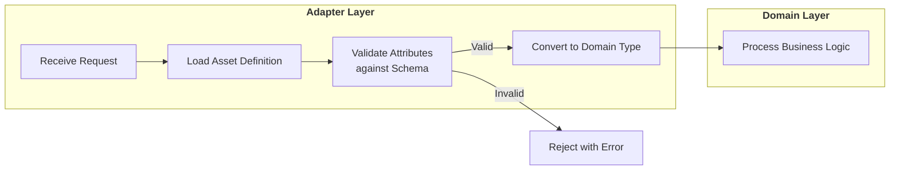
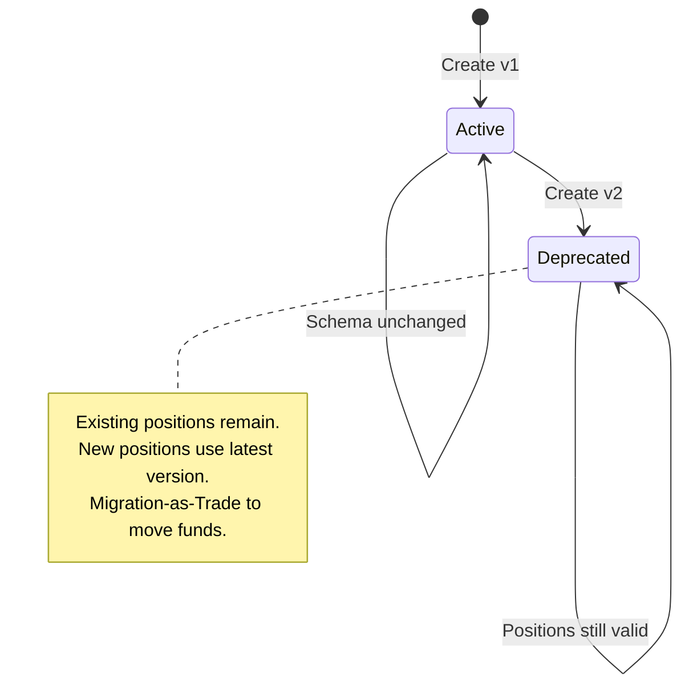
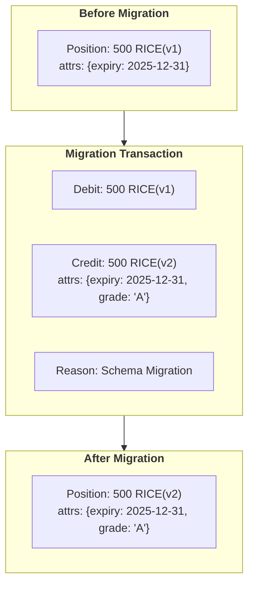

# 14. Dynamic Asset Registry & Lifecycle

Date: 2025-12-04

## Status

Proposed

## Context

[ADR-0013](0013-generic-asset-quantity-types.md) establishes the **Dimensional Hybrid Pattern**:
compile-time safety via Dimensions (`Monetary{}`, `Commodity{}`), runtime flexibility via
`UnitDef` records. This ADR defines how those `UnitDef` records are stored, versioned, and
migrated.

### The SaaS Challenge

A multi-tenant platform must allow tenants to define custom assets without code deployment:

| Tenant | Custom Asset | Attributes |
|--------|--------------|------------|
| Utility Co | `KWH-PEAK` | `tou_period`, `tariff_zone` |
| Agribusiness | `RICE-VOUCHER` | `expiry_date`, `quality_grade` |
| Carbon Exchange | `VCU-2024` | `vintage`, `project_id`, `registry` |

**Requirements:**
- Tenants define assets via configuration, not code changes
- Each asset has a schema defining valid attributes
- Schema changes must not corrupt historical positions
- Positions with different versions are not fungible

### Schema Evolution Problem

When an asset's schema changes (e.g., adding `quality_grade` to rice), what happens to
existing positions?

**Bad approach**: Mutate historical records to add the new field.
- Corrupts audit trail
- May violate accounting regulations
- Can't prove what the position looked like at settlement time

**Good approach**: Treat schema changes as version increments.
- `RICE-VOUCHER(v1)` positions remain untouched
- New positions use `RICE-VOUCHER(v2)` with the new schema
- Migration is explicit: trade v1 for v2 via ledger transaction

## Decision Drivers

* **Tenant autonomy**: New assets without platform code deployment
* **Audit integrity**: Historical positions must be immutable
* **Schema validation**: Invalid attributes rejected at ingestion
* **Version isolation**: Different versions are distinct assets
* **Migration transparency**: Version transitions are auditable ledger events

## Decision Outcome

Chosen option: **Dynamic Asset Registry with Schema-on-Write and Migration-as-Trade**.

### Asset Registry Schema

```sql
CREATE TABLE asset_definitions (
    id UUID PRIMARY KEY DEFAULT gen_random_uuid(),
    tenant_id UUID NOT NULL,
    code VARCHAR(32) NOT NULL,          -- "USD", "KWH", "RICE-VOUCHER"
    version INTEGER NOT NULL DEFAULT 1,
    dimension VARCHAR(32) NOT NULL,     -- "Monetary", "Commodity"
    precision INTEGER NOT NULL,         -- Decimal places (2, 4, 8)
    attribute_schema JSONB NOT NULL,    -- JSON Schema for validation
    display_name VARCHAR(128),
    description TEXT,
    created_at TIMESTAMPTZ NOT NULL DEFAULT NOW(),
    deprecated_at TIMESTAMPTZ,          -- Soft deprecation

    UNIQUE(tenant_id, code, version),
    CHECK (precision >= 0 AND precision <= 18),
    CHECK (dimension IN ('Monetary', 'Commodity'))
);

CREATE INDEX idx_asset_definitions_lookup
    ON asset_definitions(tenant_id, code, version)
    WHERE deprecated_at IS NULL;
```

### Attribute Schema Definition

Each asset defines its valid attributes using JSON Schema:

```json
{
  "type": "object",
  "properties": {
    "expiry_date": {
      "type": "string",
      "format": "date",
      "description": "ISO 8601 date when voucher expires"
    },
    "quality_grade": {
      "type": "string",
      "enum": ["A", "B", "C"],
      "description": "Quality classification"
    }
  },
  "required": ["expiry_date"],
  "additionalProperties": false
}
```

### Asset Definition in Go

```go
// AssetDefinition is loaded from the Asset Registry database.
// This is the runtime representation of UnitDef from ADR-0013.
type AssetDefinition struct {
    ID              uuid.UUID
    TenantID        uuid.UUID
    Code            string           // "RICE-VOUCHER"
    Version         uint32           // 1, 2, 3...
    Dimension       string           // "Monetary", "Commodity"
    Precision       int              // Decimal places
    AttributeSchema json.RawMessage  // JSON Schema
    DisplayName     string
    Description     string
    CreatedAt       time.Time
    DeprecatedAt    *time.Time
}

// ToUnitDef converts to the domain type from ADR-0013.
func (a AssetDefinition) ToUnitDef() quantity.UnitDef {
    return quantity.UnitDef{
        Code:      a.Code,
        Version:   a.Version,
        Precision: a.Precision,
        Schema:    quantity.AttributeSchema(a.AttributeSchema),
    }
}
```

### Schema-on-Write Validation

Attributes are validated **at ingestion**, before entering the domain layer:



```go
// AssetRegistry validates and loads asset definitions.
type AssetRegistry interface {
    // GetDefinition loads an asset definition by code and version.
    GetDefinition(ctx context.Context, tenantID uuid.UUID, code string, version uint32) (AssetDefinition, error)

    // GetLatestDefinition loads the latest non-deprecated version.
    GetLatestDefinition(ctx context.Context, tenantID uuid.UUID, code string) (AssetDefinition, error)

    // ValidateAttributes checks attributes against the asset's schema.
    ValidateAttributes(ctx context.Context, def AssetDefinition, attrs map[string]string) error
}

// Adapter layer usage with explicit error taxonomy
func (a *TransactionAdapter) CreatePosition(ctx context.Context, req *pb.CreatePositionRequest) error {
    // Extract tenant from context (see Tenant Isolation section)
    tenantID, err := auth.TenantFromContext(ctx)
    if err != nil {
        return status.Errorf(codes.Unauthenticated, "tenant context required")
    }

    // 1. Load asset definition
    def, err := a.registry.GetDefinition(ctx, tenantID, req.AssetCode, req.AssetVersion)
    if err != nil {
        if errors.Is(err, ErrAssetNotFound) {
            return status.Errorf(codes.NotFound, "unknown asset: %s v%d", req.AssetCode, req.AssetVersion)
        }
        // Registry lookup failure (database error, etc.)
        return status.Errorf(codes.Internal, "registry lookup failed: %v", err)
    }

    // 2. Validate attributes against schema
    if err := a.registry.ValidateAttributes(ctx, def, req.Attributes); err != nil {
        var schemaErr *SchemaError
        if errors.As(err, &schemaErr) {
            // Malformed schema in registry = platform bug
            return status.Errorf(codes.FailedPrecondition, "schema error: %v", err)
        }
        // User-provided attributes don't match schema
        return status.Errorf(codes.InvalidArgument, "invalid attributes: %v", err)
    }

    // 3. Convert to domain type - now guaranteed valid
    position := domain.Position{
        Key: domain.PositionKey{
            AccountID:  req.AccountID,
            AssetCode:  def.Code,
            Version:    def.Version,
            Attributes: req.Attributes,
        },
        Amount: decimal.RequireFromString(req.Amount),
    }

    // 4. Idempotency: positionService.Create should be idempotent
    // (reject duplicate position keys or use upsert pattern)
    return a.positionService.Create(ctx, position)
}

// Error taxonomy:
// - codes.NotFound: Asset code/version doesn't exist in registry
// - codes.InvalidArgument: User attributes fail schema validation
// - codes.FailedPrecondition: Schema itself is malformed (platform bug)
// - codes.Internal: Registry/database unavailable
// - codes.Unauthenticated: No tenant context
```

### Version Lifecycle



1. **Create**: New asset definition with `version=1`
2. **Evolve**: Schema change creates `version=2`, deprecates `version=1`
3. **Migrate**: Explicit ledger transactions move positions from v1 to v2
4. **Archive**: After full migration, v1 has zero positions (historical records remain)

### Migration-as-Trade Pattern

When schema changes, positions don't automatically migrate. Instead, generate explicit
ledger transactions that preserve audit trail:



```go
// MigrationService handles version transitions.
type MigrationService struct {
    registry   AssetRegistry
    ledger     LedgerService
}

// MigratePosition creates a ledger transaction to move from old to new version.
func (m *MigrationService) MigratePosition(
    ctx context.Context,
    position Position,
    targetVersion uint32,
    newAttributes map[string]string,
) error {
    // 1. Load target version definition
    targetDef, err := m.registry.GetDefinition(ctx, position.TenantID, position.AssetCode, targetVersion)
    if err != nil {
        return fmt.Errorf("target version not found: %w", err)
    }

    // 2. Validate new attributes
    if err := m.registry.ValidateAttributes(ctx, targetDef, newAttributes); err != nil {
        return fmt.Errorf("invalid attributes for target version: %w", err)
    }

    // 3. Create migration transaction (atomic debit + credit)
    tx := LedgerTransaction{
        Type:   TransactionTypeMigration,
        Reason: fmt.Sprintf("Schema migration from v%d to v%d", position.Version, targetVersion),
        Entries: []LedgerEntry{
            {
                AccountID: position.AccountID,
                AssetCode: position.AssetCode,
                Version:   position.Version,
                Amount:    position.Amount.Neg(), // Debit old version
                Attributes: position.Attributes,
            },
            {
                AccountID: position.AccountID,
                AssetCode: position.AssetCode,
                Version:   targetVersion,
                Amount:    position.Amount, // Credit new version
                Attributes: newAttributes,
            },
        },
    }

    return m.ledger.Execute(ctx, tx)
}
```

### Bulk Migration (Wash & Reload)

For large-scale migrations, batch processing with idempotency and failure recovery:

```go
// BulkMigration represents a migration job with idempotency tracking.
type BulkMigration struct {
    ID            uuid.UUID
    TenantID      uuid.UUID
    AssetCode     string
    FromVersion   uint32
    ToVersion     uint32
    Status        MigrationStatus // Pending, Running, Completed, Failed
    Progress      int             // Positions migrated
    Total         int             // Total positions
    LastProcessed uuid.UUID       // Cursor for resumable iteration
    AttributeMap  map[string]string // Default attributes for new version
    CreatedAt     time.Time
    CompletedAt   *time.Time
}

// MigrateBatch processes a batch of positions with idempotency.
// If the job restarts, it resumes from LastProcessed cursor.
func (m *MigrationService) MigrateBatch(ctx context.Context, job *BulkMigration, batchSize int) error {
    // Fetch only un-migrated positions (those still on FromVersion)
    // The WHERE clause inherently provides idempotency: once migrated,
    // positions move to ToVersion and won't appear in subsequent queries.
    positions, err := m.ledger.GetPositions(ctx, GetPositionsRequest{
        TenantID:  job.TenantID,
        AssetCode: job.AssetCode,
        Version:   job.FromVersion,  // Only fetch source version
        AfterID:   job.LastProcessed, // Resume from cursor
        Limit:     batchSize,
    })
    if err != nil {
        return err
    }

    for _, pos := range positions {
        attrs := mergeAttributes(pos.Attributes, job.AttributeMap)
        if err := m.MigratePosition(ctx, pos, job.ToVersion, attrs); err != nil {
            // Record failure point for investigation
            job.Status = MigrationStatusFailed
            return fmt.Errorf("failed to migrate position %s: %w", pos.ID, err)
        }
        // Update cursor after each successful migration
        job.LastProcessed = pos.ID
        job.Progress++
    }

    return nil
}
```

**Idempotency guarantees:**
- Positions only appear in query while on `FromVersion`; once migrated, they're excluded
- `LastProcessed` cursor enables resumable iteration after crashes
- Each `MigratePosition` is atomic (ledger transaction); partial failures leave source positions intact
- Re-running the job on a completed migration is a no-op (zero positions match the query)

### Caching Strategy

Asset definitions are read frequently, written rarely. Use read-through cache:

```go
type CachedAssetRegistry struct {
    db    *sql.DB
    cache *cache.Cache // e.g., go-cache, groupcache
    ttl   time.Duration
}

func (r *CachedAssetRegistry) GetDefinition(ctx context.Context, tenantID uuid.UUID, code string, version uint32) (AssetDefinition, error) {
    key := fmt.Sprintf("asset:%s:%s:%d", tenantID, code, version)

    if cached, found := r.cache.Get(key); found {
        return cached.(AssetDefinition), nil
    }

    def, err := r.loadFromDB(ctx, tenantID, code, version)
    if err != nil {
        return AssetDefinition{}, err
    }

    r.cache.Set(key, def, r.ttl)
    return def, nil
}
```

**Cache invalidation strategy:**

- **When**: Synchronously at database commit, before API returns success
- **Scope**: Invalidate specific cache keys (`asset:{tenantID}:{code}:*`) not entire tenant cache
- **Distributed invalidation**: Use pub/sub (Redis, Kafka) to broadcast invalidation events to all instances

```go
// On asset version creation or deprecation
func (r *CachedAssetRegistry) InvalidateAsset(ctx context.Context, tenantID uuid.UUID, code string) error {
    // 1. Invalidate local cache
    pattern := fmt.Sprintf("asset:%s:%s:*", tenantID, code)
    r.cache.DeleteByPattern(pattern)

    // 2. Broadcast to other instances
    return r.pubsub.Publish(ctx, "asset-invalidation", InvalidationEvent{
        TenantID: tenantID,
        Code:     code,
    })
}
```

**Consistency guarantee**: Stale reads are possible during the brief window between DB commit and
cache invalidation propagation (eventual consistency). For strong consistency requirements,
bypass cache and query database directly.

## Positive Consequences

* **Tenant autonomy**: New assets via database, no code deployment
* **Audit integrity**: Migration-as-Trade preserves complete history
* **Schema safety**: Invalid attributes rejected before entering domain
* **Version clarity**: Different versions are explicitly distinct
* **Cache-friendly**: Definitions are immutable once created

## Negative Consequences

* **Migration complexity**: Schema changes require explicit migration jobs
* **Registry dependency**: All asset operations need registry lookup
* **Cache invalidation**: Must coordinate across service instances
* **Storage overhead**: Each version stored separately

## Links

* [ADR-0013: Universal Quantity Type System](0013-generic-asset-quantity-types.md) - Type system foundation
* [ADR-0003: Database Schema Migrations](0003-database-schema-migrations.md) - Migration patterns
* [ADR-0005: Adapter Pattern](0005-adapter-pattern-layer-translation.md) - Layer translation
* [JSON Schema Specification](https://json-schema.org/) - Attribute validation

## Notes

### Tenant Isolation

Asset definitions are tenant-scoped. The `tenant_id` column ensures:
- Tenants cannot see or use other tenants' custom assets
- Platform-wide assets (USD, EUR) use a special system tenant ID
- Queries always filter by tenant

**Context propagation**: Tenant ID is extracted from the authenticated request context via
`auth.TenantFromContext(ctx)`. All gRPC interceptors validate authentication and inject
tenant context before handlers execute.

**Enforcement**: The `AssetRegistry` interface requires `tenantID` as an explicit parameter
(not optional). Queries use parameterized SQL with tenant filter:

```sql
SELECT * FROM asset_definitions
WHERE tenant_id = $1 AND code = $2 AND version = $3
```

This prevents accidental cross-tenant queries. The system tenant ID (`00000000-...`) is
used for platform assets and is automatically included in tenant lookups via UNION or
separate query.

### Built-in Assets

Platform provides standard assets that all tenants inherit:

```sql
-- System tenant for platform-wide assets
INSERT INTO asset_definitions (tenant_id, code, version, dimension, precision, attribute_schema)
VALUES
    ('00000000-0000-0000-0000-000000000000', 'USD', 1, 'Monetary', 2, '{}'),
    ('00000000-0000-0000-0000-000000000000', 'EUR', 1, 'Monetary', 2, '{}'),
    ('00000000-0000-0000-0000-000000000000', 'GBP', 1, 'Monetary', 2, '{}');
```

### API for Asset Management

```protobuf
service AssetRegistry {
    // Create a new asset definition
    rpc CreateAsset(CreateAssetRequest) returns (AssetDefinition);

    // Create a new version of an existing asset
    rpc CreateAssetVersion(CreateAssetVersionRequest) returns (AssetDefinition);

    // List assets for a tenant
    rpc ListAssets(ListAssetsRequest) returns (ListAssetsResponse);

    // Get specific asset definition
    rpc GetAsset(GetAssetRequest) returns (AssetDefinition);

    // Deprecate an asset version
    rpc DeprecateAsset(DeprecateAssetRequest) returns (AssetDefinition);
}

message CreateAssetRequest {
    string code = 1;
    string dimension = 2;
    int32 precision = 3;
    string attribute_schema = 4;  // JSON Schema as string
    string display_name = 5;
    string description = 6;
}
```

### Relationships & Integration Points

This ADR focuses on **asset definitions** (what assets exist, their schemas, versions).
[ADR-0013](0013-generic-asset-quantity-types.md) focuses on **types and valuation** (how quantities
are represented, converted, and valued).

```
┌─────────────────────────────────────────────────────────────────────────────┐
│                           ARCHITECTURAL BOUNDARY                             │
├─────────────────────────────────────┬───────────────────────────────────────┤
│        ADR-0014 (This ADR)          │            ADR-0013                   │
│        Asset Registry               │         Type System & Valuation       │
├─────────────────────────────────────┼───────────────────────────────────────┤
│ • Asset definitions (UnitDef)       │ • Quantity[D] generic type            │
│ • Schema validation                 │ • Rate type and resolution            │
│ • Version lifecycle                 │ • ValuationProvider interface         │
│ • Migration-as-Trade                │ • ValuationOrchestrator               │
│ • Tenant isolation                  │ • Position/Valuation flow             │
└─────────────────────────────────────┴───────────────────────────────────────┘
```

**Integration flow:**

1. **At ingestion**: Adapter queries `AssetRegistry.GetDefinition()` to load `UnitDef`
2. **At runtime**: `Quantity[D]` instances carry the loaded `UnitDef`
3. **At valuation**: `ValuationOrchestrator` uses `UnitDef.Code` to route to appropriate provider

**Out of scope for this ADR:**
- `ValuationProvider` registration and discovery (future ADR or implementation detail)
- Rate management and temporal rate storage (covered in ADR-0013's Rate type)
- Market data integration (ValuationProvider implementation concern)

### Reconsidering This Decision

Revisit if:
- Schema validation becomes a performance bottleneck
- Migration-as-Trade proves too operationally complex
- Tenant isolation requirements change (multi-tenant asset sharing)
- Real-time schema evolution is needed (without version increment)
