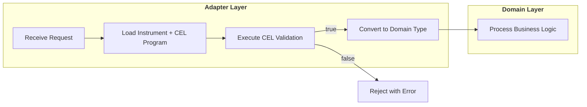
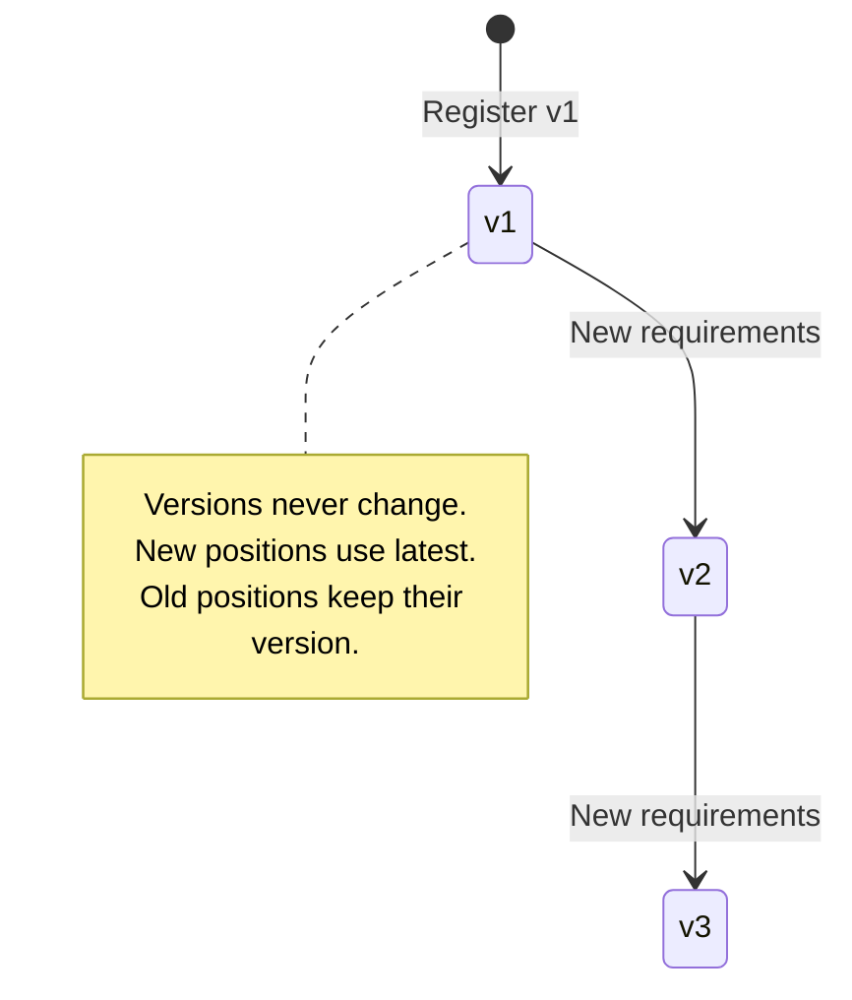

# 14. Financial Instrument Reference Data

Date: 2025-12-04 (Revised: 2026-05 to match shipped implementation)

## Status

Accepted (Implemented)

The `reference-data` service is shipped (`services/reference-data/`), with the instrument registry, CEL compiler,
per-tenant caching, and gRPC API all live. The core decision below - a BIAN Financial Instrument Reference Data
service using CEL for validation and fungibility - holds. Several specifics evolved during implementation; the
revision note captures the deltas.

> **Implementation drift (what shipped vs the original 2025-12-04 draft):**
>
> - **Table is `instrument_definition` (singular), with no `tenant_id` column.** Multi-tenancy is schema-per-tenant
>   (each tenant's `org_<id>` schema holds its own `instrument_definition` table), so the unique key is
>   `UNIQUE(code, version)`, not `UNIQUE(tenant_id, code, version)`. Migration:
>   `services/reference-data/migrations/20260104000001_initial.sql`.
> - **Fungibility is a bucket-key model, not a pairwise boolean.** The column is `fungibility_key_expression` and the
>   CEL returns a **string** bucket key for a single position; two positions are fungible iff they produce the same
>   key. There is no dual-input `a`/`b` `a == b` comparison. CEL validation env variable is `attributes`, not `attrs`.
> - **Instruments have a DRAFT → ACTIVE → DEPRECATED lifecycle.** The draft's "no `deprecated_at`, versions immutable"
>   decision did not ship; `status`, `activated_at`, `deprecated_at`, and `successor_id` columns exist, and the API has
>   `UpdateInstrument`, `ActivateInstrument`, and `DeprecateInstrument`. (Published versions are still treated as
>   immutable in spirit; lifecycle transitions are how change is managed.)
> - **CEL and JSON Schema coexist.** `attribute_schema` (JSON Schema, JSONB) was retained alongside the CEL
>   expressions rather than replaced by them.
> - **No `SystemTenantID` constant or cross-tenant fallback.** Platform instruments (GBP/USD/EUR) are seeded into each
>   tenant's own schema via `registry/seeder.go` with an `is_system = true` flag.
> - **CEL compiler is shared** at `shared/pkg/cel/` (the `services/reference-data/cel` package re-exports it); it
>   manages bucket-key / eligibility / event-filter environments.
> - **Caching is a per-tenant map of LRU caches** (`cache/instrument_cache.go`), still using `hashicorp/golang-lru/v2`.
> - The service is `ReferenceDataService`; proto at `api/proto/meridian/reference_data/v1/instrument.proto`. Domain
>   type lives in `services/reference-data/registry/` (there is no `domain/` package).
>
> The sections below have been updated to reflect the above. Older illustrative snippets are marked where retained.

## Context

[ADR-0013](0013-generic-asset-quantity-types.md) establishes the **Dimensional Hybrid Pattern**:
compile-time safety via Dimensions (`Monetary{}`, `Commodity{}`), runtime flexibility via
`FinancialInstrument` records. This ADR defines the BIAN service that stores, versions, and
manages those instrument definitions.

### BIAN Service Domain

This ADR implements **BIAN Financial Instrument Reference Data Management** (v14.0.0):

> "This Service Domain maintains a directory of financial instrument reference data"

| BIAN Concept | Meridian Implementation |
|--------------|------------------------|
| Service Domain | Financial Instrument Reference Data Management |
| Control Record | `FinancialInstrumentDirectoryEntry` |
| Business Object | `FinancialInstrument` |
| Behavior Qualifiers | Currency, DebtInstrument, Equity, Futures, Option, Warrant |

**BIAN Instrument Types** (from `financialinstrumenttypevalues`):

| BIAN Type | Description | Dimension (derived) |
|-----------|-------------|---------------------|
| Currency | Fiat money (ISO 4217) | Monetary |
| Debt | Bonds, loans, credit instruments | Monetary |
| Equity | Stocks, shares | Monetary |
| Derivative | Options, futures, swaps | Monetary |
| Commodity | Physical goods, energy, inventory | Commodity |

### The SaaS Challenge

A multi-tenant platform must allow tenants to define custom financial instruments without
code deployment:

| Tenant | Custom Instrument | Attributes | BIAN Type |
|--------|------------------|------------|-----------|
| Utility Co | `KWH-PEAK` | `tou_period`, `tariff_zone` | Commodity |
| Agribusiness | `RICE-VOUCHER` | `expiry_date`, `quality_grade` | Commodity |
| Carbon Exchange | `VCU-2024` | `vintage`, `project_id`, `registry` | Commodity |
| Treasury | `USD-T-BILL` | `maturity_date`, `coupon_rate` | Debt |

**Requirements:**
- Tenants define instruments via configuration, not code changes
- Each instrument has a schema defining valid attributes
- Schema changes must not corrupt historical positions
- Positions with different versions are not fungible

### Validation and Fungibility Challenge

Each instrument needs two types of rules:

1. **Validation**: Is this set of attributes valid for this instrument?
   - Example: Energy positions require `tou_period` attribute
   - Example: Vouchers require `expiry_date` in the future

2. **Fungibility**: Can these two positions be merged in Position Keeping?
   - Example: Same voucher, same expiry → fungible
   - Example: Same voucher, different expiry → not fungible (must track separately)

**Traditional approaches** (JSON Schema, hardcoded rules) don't solve both problems:
- JSON Schema validates structure but can't express cross-field or temporal logic
- Hardcoded rules require code deployment for each new instrument

**Our approach**: CEL (Common Expression Language) for both validation and fungibility.
CEL is non-Turing complete (guaranteed termination), compiles to bytecode (~100ns execution),
and supports cross-field validation with temporal functions.

## Decision Drivers

* **BIAN compliance**: Implement standard Financial Instrument Reference Data Management
* **Tenant autonomy**: New instruments without platform code deployment
* **CEL validation**: Invalid attributes rejected at ingestion using compiled expressions
* **Fungibility rules**: Tenant-defined rules for position merging without code changes
* **Performance**: ~100ns validation via pre-compiled CEL bytecode
* **System Tenant inheritance**: Platform instruments available to all tenants

## Decision Outcome

Chosen option: **BIAN Financial Instrument Reference Data Management Service**.

### Directory Entry Schema

The shipped DDL (`services/reference-data/migrations/20260104000001_initial.sql`, plus later migrations that add
`is_system` and `successor_id`). Note: the table lives in each tenant's `org_<id>` schema, so there is no `tenant_id`
column.

```sql
-- BIAN: FinancialInstrumentDirectoryEntry (created in each tenant's org_<id> schema)
CREATE TABLE instrument_definition (
    id UUID PRIMARY KEY DEFAULT gen_random_uuid(),

    -- BIAN: FinancialInstrumentIdentification
    code VARCHAR(50) NOT NULL,
    version INTEGER NOT NULL DEFAULT 1,

    -- Dimension (derived from instrument_type in ADR-0013)
    dimension VARCHAR(32) NOT NULL,

    -- Instrument Properties
    precision INTEGER NOT NULL,             -- Decimal places (2, 4, 8)

    -- CEL Expressions
    validation_expression       TEXT,                       -- Ingestion gatekeeper (nullable)
    fungibility_key_expression  TEXT NOT NULL DEFAULT '',    -- Returns a STRING bucket key
    error_message_expression    TEXT,                        -- Optional custom validation error

    -- JSON Schema (retained alongside CEL)
    attribute_schema            JSONB,

    -- BIAN: FinancialInstrumentName
    display_name VARCHAR(128),
    description  TEXT,

    -- Lifecycle (DRAFT -> ACTIVE -> DEPRECATED)
    status        VARCHAR(20) NOT NULL DEFAULT 'DRAFT',
    is_system     BOOLEAN NOT NULL DEFAULT FALSE,           -- platform-seeded instrument
    successor_id  UUID,                                     -- lineage to replacement version
    created_at    TIMESTAMPTZ NOT NULL DEFAULT NOW(),
    updated_at    TIMESTAMPTZ NOT NULL DEFAULT NOW(),
    activated_at  TIMESTAMPTZ,
    deprecated_at TIMESTAMPTZ,

    UNIQUE(code, version),
    CHECK (precision >= 0 AND precision <= 18),
    CHECK (dimension IN ('MONETARY','ENERGY','QUANTITY','COMPUTE','TIME','MASS','VOLUME'))
);

CREATE INDEX idx_instrument_definition_lookup
    ON instrument_definition(code, version);
```

**Key design decisions:**

1. **CEL alongside JSON Schema**: `validation_expression` and `fungibility_key_expression` carry the CEL logic. The
   `attribute_schema` JSON Schema column was retained (not replaced) for structural validation and tooling. CEL
   compiles to bytecode (~100ns) for hot-path checks.

2. **Bucket-key fungibility**: `fungibility_key_expression` is a single-input CEL that returns a **string** bucket key
   for one position. Two positions are fungible iff their keys match - no pairwise `a == b` comparison. Default `''`
   means "all positions of this instrument share one bucket" (fully fungible).

3. **Lifecycle, not pure immutability**: instruments move DRAFT → ACTIVE → DEPRECATED (`status`), with
   `activated_at`/`deprecated_at` timestamps and `successor_id` lineage. Published versions are not edited in place;
   change is managed via new versions and deprecation (see ADR-0022 for successor lineage).

4. **Dimension stored explicitly** using the `MONETARY/ENERGY/QUANTITY/COMPUTE/TIME/MASS/VOLUME` enum, required for the
   `ParseQuantity()` factory (see ADR-0013 Generic Bridge section).

5. **Schema-per-tenant**: no `tenant_id` column; isolation is by the tenant's `org_<id>` schema. Platform instruments
   are seeded per tenant with `is_system = true`.

### Domain Types

```go
// InstrumentDefinition is the domain type for instrument reference data
// (package: services/reference-data/registry). Maps to BIAN
// FinancialInstrumentDirectoryEntry. No TenantID field - tenancy is the schema.
type InstrumentDefinition struct {
    ID uuid.UUID

    // Identification
    Code      string  // "USD", "KWH", "RICE-VOUCHER"
    Version   uint32  // Schema version (1, 2, 3...)
    Dimension string  // "MONETARY", "ENERGY", "QUANTITY", "COMPUTE", "TIME", "MASS", "VOLUME"

    // Properties
    Precision int     // Decimal places

    // CEL Expressions (compiled at load time)
    ValidationExpression     string  // Ingestion gatekeeper (single input: attributes)
    FungibilityKeyExpression string  // Returns a string bucket key for one position
    ErrorMessageExpression   string  // Optional custom validation-failure message

    // JSON Schema (retained alongside CEL)
    AttributeSchema []byte

    // Display
    DisplayName string
    Description string

    // Lifecycle
    Status       string     // DRAFT | ACTIVE | DEPRECATED
    IsSystem     bool       // platform-seeded instrument
    SuccessorID  *uuid.UUID // lineage to replacement version (ADR-0022)
    CreatedAt    time.Time
    UpdatedAt    time.Time
    ActivatedAt  *time.Time
    DeprecatedAt *time.Time
}

// ToFinancialInstrument converts to the ADR-0013 domain type.
func (d InstrumentDefinition) ToFinancialInstrument() FinancialInstrument {
    return FinancialInstrument{
        Code:      d.Code,
        Version:   d.Version,
        Dimension: d.Dimension,
        Precision: d.Precision,
    }
}
```

### CEL Expression Definitions

Each instrument defines two CEL expressions. Both take a **single** position's attributes (variable named
`attributes`); the validation env also exposes `amount`, `valid_from`, `valid_to`, and `source`.

**1. Validation Expression** - Ingestion gatekeeper. Returns a bool (single input: `attributes`)

```cel
// Simple: require expiry_date exists
has(attributes.expiry_date)

// With type validation
has(attributes.expiry_date) && has(attributes.quality_grade) &&
  attributes.quality_grade in ["A", "B", "C"]

// Temporal: expiry must be in the future
has(attributes.expiry_date) &&
  timestamp(attributes.expiry_date) > now()

// Energy with time-of-use period
has(attributes.tou_period) &&
  int(attributes.tou_period) >= 0 && int(attributes.tou_period) <= 47
```

**2. Fungibility Key Expression** - Position bucketing. Returns a **string** key (single input: `attributes`).
Two positions are fungible iff they evaluate to the same key. There is no pairwise `a`/`b` comparison.

```cel
// Default ('' empty expression): all positions of this instrument share one bucket (fully fungible)

// Bucket by expiry date
attributes.expiry_date

// Bucket by expiry date AND quality grade
attributes.expiry_date + "|" + attributes.quality_grade

// Energy: bucket by time-of-use period and tariff zone
attributes.tou_period + "|" + attributes.tariff_zone
```

### CEL Compiler

The shared compiler at `shared/pkg/cel/compiler.go` pre-compiles CEL expressions at load time for ~100ns evaluation.
The `services/reference-data/cel` package is a thin re-export shim over it. The compiler maintains several
single-input environments (the variable is `attributes`, a `map<string,string>`), notably:

- a **validation** env (`attributes` plus `amount`, `valid_from`, `valid_to`, `source`) - the program returns a bool
- a **bucket-key** env (`attributes`) - the program must return a **string**; a non-string result is an error
  (`ErrBucketKeyNotString`)
- additional envs for eligibility and event-filter expressions used elsewhere in the platform

```go
import "github.com/google/cel-go/cel"

// Bucket-key environment: single attributes map, expression MUST return a string.
func createBucketKeyEnv() (*cel.Env, error) {
    return cel.NewEnv(
        cel.Variable("attributes", cel.MapType(cel.StringType, cel.StringType)),
    )
}

// Validation environment: attributes + position metadata, expression returns a bool.
func createValidationEnv() (*cel.Env, error) {
    return cel.NewEnv(
        cel.Variable("attributes", cel.MapType(cel.StringType, cel.StringType)),
        cel.Variable("amount", cel.StringType),
        cel.Variable("valid_from", cel.TimestampType),
        cel.Variable("valid_to", cel.TimestampType),
        cel.Variable("source", cel.StringType),
    )
}
```

There is no dual-input `a`/`b` fungibility environment; fungibility is the single-input bucket-key program above.

### Schema-on-Write Validation

Attributes are validated **at ingestion** using compiled CEL:



### Service Interface (BIAN Operations)

The registry interface is tenant-scoped by the request's `org_<id>` schema (resolved from context), so lookups take no
`tenantID` parameter. Validation returns a bool; fungibility returns a bucket-key string.

```go
// Registry implements BIAN Financial Instrument Reference Data operations.
// (services/reference-data/registry)
type Registry interface {
    // Register creates a new instrument definition (status DRAFT).
    // Validates CEL expressions compile before persisting.
    Register(ctx context.Context, def InstrumentDefinition) error

    // Retrieve loads an instrument by code and version. version=0 => latest.
    Retrieve(ctx context.Context, code string, version uint32) (CachedInstrument, error)

    // RetrieveLatest loads the latest version (convenience wrapper).
    RetrieveLatest(ctx context.Context, code string) (CachedInstrument, error)

    // Lifecycle transitions.
    Activate(ctx context.Context, code string, version uint32) error
    Deprecate(ctx context.Context, code string, version uint32, successorID *uuid.UUID) error

    // ValidateAttributes runs the compiled validation program (returns nil if valid).
    ValidateAttributes(ctx context.Context, inst CachedInstrument, attributes map[string]string) error

    // FungibilityKey runs the compiled bucket-key program for one position.
    // Two positions are fungible iff their keys are equal.
    FungibilityKey(ctx context.Context, inst CachedInstrument, attributes map[string]string) (string, error)
}
```

### Platform Instruments (per-tenant seeding)

There is no system-tenant UUID or cross-tenant fallback. Platform-wide instruments (GBP, USD, EUR) are seeded into
**each tenant's own schema** at provisioning time via `registry/seeder.go`, flagged `is_system = true`:

```go
// services/reference-data/registry/seeder.go (sketch)
func (s *Seeder) SeedTenant(ctx context.Context, tenantID tenant.TenantID) error {
    for _, def := range systemInstruments() { // GBP, USD, EUR ...
        def.IsSystem = true
        if err := s.registry.Register(ctx, def); err != nil { // writes into the tenant's org_<id> schema
            return err
        }
    }
    return nil
}
```

Tenants can register their own instruments alongside the seeded `is_system` ones; lookups resolve within the tenant's
schema, so no fallback chain is needed.

### Version Lifecycle

Published instrument versions are not edited in place; change is managed by registering new versions and using the
DRAFT → ACTIVE → DEPRECATED lifecycle (with `successor_id` lineage). Old positions keep their version:



1. **Register**: New instrument with `version=1`
2. **Evolve**: New requirements register `version=2` (v1 remains unchanged)
3. **Query**: `RetrieveLatest()` returns highest version; explicit version queries return that version

### Caching Strategy

Instrument definitions are read frequently, written rarely. The cache (`cache/instrument_cache.go`) uses bounded LRU
(`hashicorp/golang-lru/v2`) but is structured as a **per-tenant map of LRU caches** - one LRU per tenant, lazily
created - so a busy tenant cannot evict another tenant's hot entries. The per-tenant key is a struct of `{code,
version}` and the value is a `*CachedInstrument` (definition + compiled CEL programs):

```go
import lru "github.com/hashicorp/golang-lru/v2"

type InstrumentCache struct {
    mu           sync.RWMutex
    tenantCaches map[tenant.TenantID]*lru.Cache[Key, *CachedInstrument] // one LRU per tenant
    maxPerTenant int
    compiler     *cel.Compiler
}

type Key struct {
    Code    string
    Version uint32
}

func (c *InstrumentCache) tenantCache(t tenant.TenantID) *lru.Cache[Key, *CachedInstrument] {
    c.mu.Lock()
    defer c.mu.Unlock()
    cache, ok := c.tenantCaches[t]
    if !ok {
        cache, _ = lru.New[Key, *CachedInstrument](c.maxPerTenant) // created on first use
        c.tenantCaches[t] = cache
    }
    return cache
}
```

**Why per-tenant bounded LRU:**
- A single flat cache lets one noisy tenant evict others' entries; per-tenant LRUs isolate eviction.
- `sync.Map` grows unbounded → memory leak risk with temporary instruments.
- LRU evicts least-recently-used when a tenant's cache reaches capacity.

## Positive Consequences

* **BIAN compliance**: Implements standard Financial Instrument Reference Data Management
* **Tenant autonomy**: New instruments via configuration, no code deployment
* **CEL performance**: ~100ns validation vs ~1ms JSON Schema
* **Fungibility rules**: Tenant-defined position merge logic without code changes
* **Version clarity**: Different versions are explicitly distinct, with a DRAFT/ACTIVE/DEPRECATED lifecycle
* **Cache-friendly**: Compiled CEL programs cached in per-tenant bounded LRUs
* **Platform instruments**: GBP/USD/EUR seeded per tenant (`is_system = true`) so every tenant has base currencies

## Negative Consequences

* **CEL learning curve**: Teams must learn CEL expression syntax
* **Registry dependency**: All instrument operations need reference data lookup
* **Compilation cost**: First load compiles CEL expressions (~1ms one-time cost)
* **Storage overhead**: Each version stored separately

## Links

* [ADR-0013: Universal Quantity Type System](0013-generic-asset-quantity-types.md) - Type system foundation
* [ADR-0003: Database Schema Migrations](0003-database-schema-migrations.md) - Migration patterns
* [ADR-0005: Adapter Pattern](0005-adapter-pattern-layer-translation.md) - Layer translation
* [BIAN Financial Instrument Reference Data Management](https://bian.org) - Service domain specification
* [CEL Specification](https://github.com/google/cel-spec) - Common Expression Language
* [cel-go Library](https://github.com/google/cel-go) - Go implementation
* [hashicorp/golang-lru](https://github.com/hashicorp/golang-lru) - Bounded LRU cache

## Notes

### Tenant Isolation

Instrument definitions are tenant-scoped **by schema** (each tenant's `org_<id>` schema has its own
`instrument_definition` table); there is no `tenant_id` column:
- Tenants cannot see or use other tenants' custom instruments (different schemas)
- Platform-wide instruments (GBP, USD, EUR) are seeded into each tenant's schema with `is_system = true`
- Queries run within the tenant's `search_path`; no per-row tenant filter is needed

### Instrument Type Mapping Guidance

When categorizing custom instruments, consider the economic characteristics:

| If the instrument... | Map to | Examples |
|---------------------|--------|----------|
| Is legal tender or settles obligations | **Currency** | USD, EUR, GBP |
| Represents ownership in an entity | **Equity** | Shares, stock units |
| Is an obligation to pay/receive | **Debt** | Bonds, loans, receivables |
| Derives value from an underlying | **Derivative** | Options, futures, swaps |
| Is consumed, redeemed, or amortized | **Commodity** | Energy, compute, inventory |

**Commodity is the catch-all for consumable value:**

| Instrument | Why Commodity? | Key Attributes |
|------------|---------------|----------------|
| Energy credits (KWH) | Consumed when used | `tou_period`, `tariff_zone` |
| Loyalty points / Airmiles | Redeemed for services, expires | `expiry_date`, `program_id` |
| Vouchers / Gift cards | Redeemed for goods, expires | `expiry_date`, `merchant_id` |
| Content licenses | Amortized over term | `license_start`, `license_end`, `content_id` |
| Compute credits | Consumed when used | `region`, `instance_type` |
| Carbon credits | Retired when used | `vintage`, `project_id`, `registry` |
| Physical inventory | Sold or consumed | `quality_grade`, `lot_number` |

**The key insight**: If the position decreases through consumption, redemption, or
amortization (rather than sale or transfer), it's a Commodity.

**Attributes handle the nuances**: Expiry dates, vintages, license terms, and quality
grades are all position attributes validated by the instrument's schema - not separate
instrument types.

### Built-in Instruments

The platform seeds standard currencies into **each tenant's schema** (via `registry/seeder.go`), flagged
`is_system = true`. There is no system-tenant row. Conceptually, per tenant:

```sql
-- Seeded into each tenant's org_<id> schema at provisioning time
INSERT INTO instrument_definition
    (code, version, dimension, precision,
     validation_expression, fungibility_key_expression, display_name, status, is_system)
VALUES
    ('USD', 1, 'MONETARY', 2, NULL, '', 'US Dollar',     'ACTIVE', TRUE),
    ('EUR', 1, 'MONETARY', 2, NULL, '', 'Euro',          'ACTIVE', TRUE),
    ('GBP', 1, 'MONETARY', 2, NULL, '', 'British Pound', 'ACTIVE', TRUE);
```

**Note**: Fiat currencies need no validation (NULL) and an empty `fungibility_key_expression` (`''`), meaning all
positions of the same currency fall into one bucket (fully fungible).

### Multi-Asset Instrument Examples

> **Note:** The example INSERTs below predate the bucket-key fungibility model and the singular table name. Read them
> for the CEL validation logic. In current code: the table is `instrument_definition` (singular, no `tenant_id`); the
> fungibility column is `fungibility_key_expression` and must return a **string** key for one position (e.g.
> `attributes.tou_period + "|" + attributes.tariff_zone`) rather than a pairwise `a.x == b.x` boolean.

The following examples demonstrate CEL expressions for real-world commodity instruments.
See [ADR-0013](0013-generic-asset-quantity-types.md) for corresponding Go usage examples.

#### Energy Instrument (KWH)

Energy positions require time-of-use period for tariff calculation:

```sql
-- Energy: Kilowatt Hour with time-of-use pricing
INSERT INTO instrument_definitions
    (tenant_id, code, version, dimension, precision,
     validation_expression, fungibility_expression, display_name, description)
VALUES
    ('tenant-uuid-here', 'KWH', 1, 'Commodity', 4,
     -- Validation: tou_period must be 0-47 (half-hourly slots), tariff_zone required
     'has(attrs.tou_period) && int(attrs.tou_period) >= 0 && int(attrs.tou_period) <= 47 && has(attrs.tariff_zone)',
     -- Fungibility: same time period AND same zone can merge
     'a.tou_period == b.tou_period && a.tariff_zone == b.tariff_zone',
     'Kilowatt Hour',
     'Energy consumption unit for time-of-use metering and billing');
```

**CEL validation logic**:
- `has(attrs.tou_period)` - Time-of-use period is required
- `int(attrs.tou_period) >= 0 && int(attrs.tou_period) <= 47` - Valid half-hourly slot (48 per day)
- `has(attrs.tariff_zone)` - Tariff zone is required for pricing

**Fungibility rule**: Positions can only merge if they have the same `tou_period` AND `tariff_zone`.
This ensures accurate tariff calculation - peak and off-peak energy cannot be combined.

#### Carbon Credit Instrument (VCU)

Voluntary carbon units require vintage tracking for compliance:

```sql
-- Carbon: Voluntary Carbon Unit with vintage and registry tracking
INSERT INTO instrument_definitions
    (tenant_id, code, version, dimension, precision,
     validation_expression, fungibility_expression, display_name, description)
VALUES
    ('tenant-uuid-here', 'VCU', 1, 'Commodity', 0,
     -- Validation: vintage year must be between 2000 and current year
     'has(attrs.vintage) && int(attrs.vintage) >= 2000 && int(attrs.vintage) <= timestamp(now()).getFullYear() && has(attrs.project_id) && has(attrs.registry) && attrs.registry in ["VERRA", "GOLD_STANDARD", "ACR", "CAR"]',
     -- Fungibility: same vintage + project + registry can merge
     'a.vintage == b.vintage && a.project_id == b.project_id && a.registry == b.registry',
     'Voluntary Carbon Unit',
     'Carbon credit representing 1 tonne CO2 equivalent offset');
```

**CEL validation logic**:
- `int(attrs.vintage) >= 2000 && int(attrs.vintage) <= timestamp(now()).getFullYear()` - Vintage cannot be in the future
- `attrs.registry in ["VERRA", "GOLD_STANDARD", "ACR", "CAR"]` - Registry must be recognized

**Fungibility rule**: Credits from the same project, registry, and vintage can merge.
Different registries require separate positions for regulatory compliance.

#### Compute Credit Instrument (GPU-HOUR)

Cloud compute resources tracked by region and instance type:

```sql
-- Compute: GPU Hour for cloud billing
INSERT INTO instrument_definitions
    (tenant_id, code, version, dimension, precision,
     validation_expression, fungibility_expression, display_name, description)
VALUES
    ('tenant-uuid-here', 'GPU-HOUR', 1, 'Commodity', 4,
     -- Validation: region and instance_type are required
     'has(attrs.region) && has(attrs.instance_type) && size(attrs.region) > 0 && size(attrs.instance_type) > 0',
     -- Fungibility: same region AND instance type can merge
     'a.region == b.region && a.instance_type == b.instance_type',
     'GPU Compute Hour',
     'Compute resource unit for GPU-accelerated workloads');
```

**CEL validation logic**:
- `has(attrs.region) && size(attrs.region) > 0` - Non-empty region required
- `has(attrs.instance_type) && size(attrs.instance_type) > 0` - Non-empty instance type required

**Fungibility rule**: Usage from same region and instance type can merge.
Different regions have different pricing, so they must be tracked separately.

#### Custom Tenant Instrument: Rice Voucher

Complete example of a tenant creating a custom instrument for food distribution:

```go
package ngo

import (
    "context"

    "github.com/meridianhub/meridian/services/reference-data/registry"
)

// RegisterRiceVoucher creates a custom instrument for an NGO food distribution program.
// Vouchers are redeemable for 1kg of rice at distribution centers.
// The tenant is resolved from ctx (org_<id> schema), so there is no TenantID field.
func RegisterRiceVoucher(ctx context.Context, reg registry.Registry) error {
    def := registry.InstrumentDefinition{
        Code:      "RICE-VOUCHER",
        Version:   1,
        Dimension: "QUANTITY",
        Precision: 0, // Whole vouchers only

        // Validation: expiry must be in the future, quality grade must be valid
        ValidationExpression: `has(attributes.expiry_date) &&
            timestamp(attributes.expiry_date) > now() &&
            has(attributes.quality_grade) &&
            attributes.quality_grade in ["A", "B", "C"]`,

        // Fungibility key: bucket by expiry date + quality grade (same key => fungible)
        FungibilityKeyExpression: `attributes.expiry_date + "|" + attributes.quality_grade`,

        DisplayName: "Rice Voucher",
        Description: "Redeemable voucher for 1kg of rice at distribution centers",
    }

    return reg.Register(ctx, def)
}
```

**Equivalent SQL**:

```sql
INSERT INTO instrument_definitions
    (tenant_id, code, version, dimension, precision,
     validation_expression, fungibility_expression, display_name, description)
VALUES
    ('ngo-tenant-uuid', 'RICE-VOUCHER', 1, 'Commodity', 0,
     'has(attrs.expiry_date) && timestamp(attrs.expiry_date) > now() && has(attrs.quality_grade) && attrs.quality_grade in ["A", "B", "C"]',
     'a.expiry_date == b.expiry_date && a.quality_grade == b.quality_grade',
     'Rice Voucher',
     'Redeemable voucher for 1kg of rice at distribution centers');
```

### Instrument Version Evolution

When requirements change, create a new version rather than modifying existing definitions.
This example shows how a Rice Voucher evolves from v1 to v2:

**Version 1** (original): Only expiry_date required

```sql
-- Original: only expiry tracking
INSERT INTO instrument_definitions
    (tenant_id, code, version, dimension, precision,
     validation_expression, fungibility_expression, display_name)
VALUES
    ('ngo-tenant-uuid', 'RICE-VOUCHER', 1, 'Commodity', 0,
     'has(attrs.expiry_date) && timestamp(attrs.expiry_date) > now()',
     'a.expiry_date == b.expiry_date',
     'Rice Voucher');
```

**Version 2** (evolved): Quality grade now required for regulatory compliance

```sql
-- New version: adds quality_grade requirement
INSERT INTO instrument_definitions
    (tenant_id, code, version, dimension, precision,
     validation_expression, fungibility_expression, display_name)
VALUES
    ('ngo-tenant-uuid', 'RICE-VOUCHER', 2, 'Commodity', 0,
     'has(attrs.expiry_date) && timestamp(attrs.expiry_date) > now() && has(attrs.quality_grade) && attrs.quality_grade in ["A", "B", "C"]',
     'a.expiry_date == b.expiry_date && a.quality_grade == b.quality_grade',
     'Rice Voucher');
```

**Migration behavior**:

```go
// Existing v1 positions remain valid - they keep their version
existingPosition := Position{
    InstrumentCode:    "RICE-VOUCHER",
    InstrumentVersion: 1, // Stays at v1
    Attributes:        map[string]string{"expiry_date": "2025-06-30"},
}

// New positions use v2 and require quality_grade
newPosition := Position{
    InstrumentCode:    "RICE-VOUCHER",
    InstrumentVersion: 2, // Uses latest version
    Attributes: map[string]string{
        "expiry_date":   "2025-12-31",
        "quality_grade": "A",
    },
}

// v1 and v2 positions are NOT fungible - different versions are distinct
// To migrate v1 to v2: create a trade (debit v1, credit v2 with added attribute)
```

**Key principles**:

1. **Immutability**: Once created, a version never changes
2. **Coexistence**: Old and new versions exist simultaneously
3. **Non-fungibility**: Different versions cannot be merged (v1 position =/= v2 position)
4. **Migration-as-Trade**: Converting v1 to v2 requires explicit ledger entries

### gRPC API (BIAN Operations)

The real service is `ReferenceDataService` (`api/proto/meridian/reference_data/v1/instrument.proto`). It exposes the
full lifecycle, and carries **both** the CEL expressions and the JSON Schema (`attribute_schema`) - they coexist.

```protobuf
service ReferenceDataService {
    rpc RegisterInstrument(RegisterInstrumentRequest) returns (Instrument);
    rpc RetrieveInstrument(RetrieveInstrumentRequest) returns (Instrument);
    rpc ListInstruments(ListInstrumentsRequest) returns (ListInstrumentsResponse);
    rpc UpdateInstrument(UpdateInstrumentRequest) returns (Instrument);   // DRAFT edits
    rpc ActivateInstrument(ActivateInstrumentRequest) returns (Instrument);
    rpc DeprecateInstrument(DeprecateInstrumentRequest) returns (Instrument);
    rpc EvaluateInstrument(EvaluateInstrumentRequest) returns (EvaluateInstrumentResponse); // CEL playground
    rpc GetAttributeSchema(GetAttributeSchemaRequest) returns (GetAttributeSchemaResponse);
    // (plus account-type and node RPCs on the same service)
}

message RegisterInstrumentRequest {
    string instrument_code            = 1;
    string instrument_type            = 2;  // maps to dimension
    string instrument_name            = 3;
    int32  precision                  = 4;
    string validation_expression      = 5;  // CEL (bool)
    string fungibility_key_expression = 6;  // CEL (returns string bucket key)
    string error_message_expression   = 7;  // CEL (optional)
    string attribute_schema           = 8;  // JSON Schema (coexists with CEL)
    string description                = 9;
}

message RetrieveInstrumentRequest {
    string instrument_code = 1;
    uint32 version         = 2;  // 0 = latest
}
```

> Note: the field numbers above mirror the proto's mix of CEL and JSON-Schema fields; consult the proto for the exact
> wire numbers. The point is that lifecycle RPCs (`Update`/`Activate`/`Deprecate`) and JSON Schema both exist - the
> earlier draft's "no deprecate, CEL replaces JSON Schema" framing did not ship.

### Consumer Guidance: Partition Routing

Consumers of this service (e.g., Position Keeping, Ledger) may partition storage by
dimension for regulatory segregation. The dimension is derived from `instrument_type`:

```go
dimension := instrument.Dimension  // "MONETARY", "ENERGY", "QUANTITY", "COMPUTE", "TIME", "MASS", "VOLUME"
```

This keeps the Reference Data service focused on its BIAN responsibility (instrument
definitions) while allowing consumers to implement their own storage strategies.

### Reconsidering This Decision

Revisit if:
- Schema validation becomes a performance bottleneck
- Migration-as-Trade proves too operationally complex
- Tenant isolation requirements change (multi-tenant instrument sharing)
- BIAN releases breaking changes to Financial Instrument Reference Data Management
