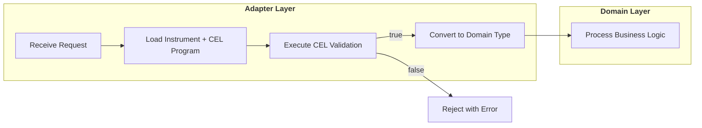
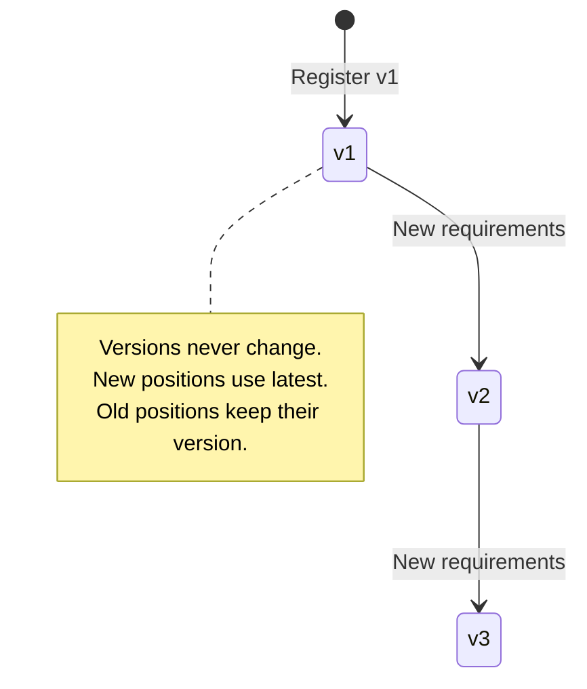

# 14. Financial Instrument Reference Data

Date: 2025-12-04

## Status

Proposed

## Context

[ADR-0013](0013-generic-asset-quantity-types.md) establishes the **Dimensional Hybrid Pattern**:
compile-time safety via Dimensions (`Monetary{}`, `Commodity{}`), runtime flexibility via
`FinancialInstrument` records. This ADR defines the BIAN service that stores, versions, and
manages those instrument definitions.

### BIAN Service Domain

This ADR implements **BIAN Financial Instrument Reference Data Management** (v14.0.0):

> "This Service Domain maintains a directory of financial instrument reference data"

| BIAN Concept | Meridian Implementation |
|--------------|------------------------|
| Service Domain | Financial Instrument Reference Data Management |
| Control Record | `FinancialInstrumentDirectoryEntry` |
| Business Object | `FinancialInstrument` |
| Behavior Qualifiers | Currency, DebtInstrument, Equity, Futures, Option, Warrant |

**BIAN Instrument Types** (from `financialinstrumenttypevalues`):

| BIAN Type | Description | Dimension (derived) |
|-----------|-------------|---------------------|
| Currency | Fiat money (ISO 4217) | Monetary |
| Debt | Bonds, loans, credit instruments | Monetary |
| Equity | Stocks, shares | Monetary |
| Derivative | Options, futures, swaps | Monetary |
| Commodity | Physical goods, energy, inventory | Commodity |

### The SaaS Challenge

A multi-tenant platform must allow tenants to define custom financial instruments without
code deployment:

| Tenant | Custom Instrument | Attributes | BIAN Type |
|--------|------------------|------------|-----------|
| Utility Co | `KWH-PEAK` | `tou_period`, `tariff_zone` | Commodity |
| Agribusiness | `RICE-VOUCHER` | `expiry_date`, `quality_grade` | Commodity |
| Carbon Exchange | `VCU-2024` | `vintage`, `project_id`, `registry` | Commodity |
| Treasury | `USD-T-BILL` | `maturity_date`, `coupon_rate` | Debt |

**Requirements:**
- Tenants define instruments via configuration, not code changes
- Each instrument has a schema defining valid attributes
- Schema changes must not corrupt historical positions
- Positions with different versions are not fungible

### Validation and Fungibility Challenge

Each instrument needs two types of rules:

1. **Validation**: Is this set of attributes valid for this instrument?
   - Example: Energy positions require `tou_period` attribute
   - Example: Vouchers require `expiry_date` in the future

2. **Fungibility**: Can these two positions be merged in Position Keeping?
   - Example: Same voucher, same expiry → fungible
   - Example: Same voucher, different expiry → not fungible (must track separately)

**Traditional approaches** (JSON Schema, hardcoded rules) don't solve both problems:
- JSON Schema validates structure but can't express cross-field or temporal logic
- Hardcoded rules require code deployment for each new instrument

**Our approach**: CEL (Common Expression Language) for both validation and fungibility.
CEL is non-Turing complete (guaranteed termination), compiles to bytecode (~100ns execution),
and supports cross-field validation with temporal functions.

## Decision Drivers

* **BIAN compliance**: Implement standard Financial Instrument Reference Data Management
* **Tenant autonomy**: New instruments without platform code deployment
* **CEL validation**: Invalid attributes rejected at ingestion using compiled expressions
* **Fungibility rules**: Tenant-defined rules for position merging without code changes
* **Performance**: ~100ns validation via pre-compiled CEL bytecode
* **System Tenant inheritance**: Platform instruments available to all tenants

## Decision Outcome

Chosen option: **BIAN Financial Instrument Reference Data Management Service**.

### Directory Entry Schema

```sql
-- BIAN: FinancialInstrumentDirectoryEntry
CREATE TABLE instrument_definitions (
    id UUID PRIMARY KEY DEFAULT gen_random_uuid(),
    tenant_id UUID NOT NULL,

    -- BIAN: FinancialInstrumentIdentification
    code VARCHAR(32) NOT NULL,
    version INTEGER NOT NULL DEFAULT 1,

    -- Dimension (derived from instrument_type in ADR-0013)
    dimension VARCHAR(32) NOT NULL,         -- "Monetary" or "Commodity"

    -- Instrument Properties
    precision INTEGER NOT NULL,             -- Decimal places (2, 4, 8)

    -- CEL Expressions (replaces JSON Schema)
    validation_expression TEXT NOT NULL DEFAULT 'true',     -- Ingestion gatekeeper
    fungibility_expression TEXT NOT NULL DEFAULT 'a == b',  -- Position merge arbiter

    -- BIAN: FinancialInstrumentName
    display_name VARCHAR(128),
    description TEXT,

    -- Lifecycle
    created_at TIMESTAMPTZ NOT NULL DEFAULT NOW(),

    UNIQUE(tenant_id, code, version),
    CHECK (precision >= 0 AND precision <= 18),
    CHECK (dimension IN ('Monetary', 'Commodity')),
    CHECK (validation_expression <> ''),
    CHECK (fungibility_expression <> '')
);

CREATE INDEX idx_instrument_definitions_lookup
    ON instrument_definitions(tenant_id, code, version);
```

**Key design decisions:**

1. **CEL instead of JSON Schema**: `validation_expression` and `fungibility_expression`
   replace the JSONB schema field. CEL compiles to bytecode (~100ns) vs JSON Schema (~1ms).

2. **No `deprecated_at`**: Simplified lifecycle - versions are immutable once created.
   New requirements = new version.

3. **Dimension stored explicitly**: Required for `ParseQuantity()` factory
   (see ADR-0013 Generic Bridge section).

### Domain Types

```go
// InstrumentDefinition is the domain type for instrument reference data.
// Maps to BIAN FinancialInstrumentDirectoryEntry.
type InstrumentDefinition struct {
    ID        uuid.UUID
    TenantID  uuid.UUID

    // Identification
    Code      string  // "USD", "KWH", "RICE-VOUCHER"
    Version   uint32  // Schema version (1, 2, 3...)
    Dimension string  // "Monetary" or "Commodity"

    // Properties
    Precision int     // Decimal places

    // CEL Expressions (compiled at load time)
    ValidationExpression  string  // Ingestion gatekeeper
    FungibilityExpression string  // Position merge arbiter

    // Display
    DisplayName string
    Description string

    // Lifecycle
    CreatedAt time.Time
}

// ToFinancialInstrument converts to the ADR-0013 domain type.
func (d InstrumentDefinition) ToFinancialInstrument() FinancialInstrument {
    return FinancialInstrument{
        Code:      d.Code,
        Version:   d.Version,
        Dimension: d.Dimension,
        Precision: d.Precision,
    }
}
```

### CEL Expression Definitions

Each instrument defines two CEL expressions:

**1. Validation Expression** - Ingestion gatekeeper (single input: `attrs`)

```cel
// Simple: require expiry_date exists
has(attrs.expiry_date)

// With type validation
has(attrs.expiry_date) && has(attrs.quality_grade) &&
  attrs.quality_grade in ["A", "B", "C"]

// Temporal: expiry must be in the future
has(attrs.expiry_date) &&
  timestamp(attrs.expiry_date) > now()

// Energy with time-of-use period
has(attrs.tou_period) &&
  int(attrs.tou_period) >= 0 && int(attrs.tou_period) <= 47
```

**2. Fungibility Expression** - Position merge arbiter (two inputs: `a`, `b`)

```cel
// Simple equality (default)
a == b

// Same expiry date required for merge
a.expiry_date == b.expiry_date

// Same day and quality grade
a.expiry_date == b.expiry_date && a.quality_grade == b.quality_grade

// Time-bound: same period required
a.tou_period == b.tou_period
```

### CEL Compiler

The service pre-compiles CEL expressions at load time for ~100ns validation:

```go
import (
    "github.com/google/cel-go/cel"
    lru "github.com/hashicorp/golang-lru/v2"
)

// CELCompiler manages two CEL environments for different expression types.
type CELCompiler struct {
    validationEnv  *cel.Env  // Single input: attrs map
    fungibilityEnv *cel.Env  // Two inputs: a, b maps
}

// NewCELCompiler creates a compiler with pre-configured environments.
func NewCELCompiler() (*CELCompiler, error) {
    // Validation: single attrs map
    valEnv, err := cel.NewEnv(
        cel.Variable("attrs", cel.MapType(cel.StringType, cel.StringType)),
    )
    if err != nil {
        return nil, err
    }

    // Fungibility: two attribute maps (a and b)
    fungEnv, err := cel.NewEnv(
        cel.Variable("a", cel.MapType(cel.StringType, cel.StringType)),
        cel.Variable("b", cel.MapType(cel.StringType, cel.StringType)),
    )
    if err != nil {
        return nil, err
    }

    return &CELCompiler{
        validationEnv:  valEnv,
        fungibilityEnv: fungEnv,
    }, nil
}

// CompiledInstrument holds pre-compiled CEL programs for an instrument.
type CompiledInstrument struct {
    Definition          InstrumentDefinition
    ValidationProgram   cel.Program
    FungibilityProgram  cel.Program
}
```

### Schema-on-Write Validation

Attributes are validated **at ingestion** using compiled CEL:



### Service Interface (BIAN Operations)

```go
// InstrumentReferenceDataService implements BIAN service operations.
type InstrumentReferenceDataService interface {
    // Register creates a new instrument definition (BIAN: Register)
    // Validates CEL expressions compile before persisting.
    Register(ctx context.Context, def InstrumentDefinition) error

    // Retrieve loads an instrument by code and version (BIAN: Retrieve)
    // Pass version=0 to retrieve the latest version.
    // Returns compiled CEL programs alongside the definition.
    Retrieve(ctx context.Context, tenantID uuid.UUID, code string, version uint32) (CompiledInstrument, error)

    // RetrieveLatest loads the latest version (convenience wrapper)
    RetrieveLatest(ctx context.Context, tenantID uuid.UUID, code string) (CompiledInstrument, error)

    // ValidateAttributes executes the validation CEL program
    ValidateAttributes(ctx context.Context, inst CompiledInstrument, attrs map[string]string) error

    // AreFungible executes the fungibility CEL program
    AreFungible(ctx context.Context, inst CompiledInstrument, a, b map[string]string) (bool, error)
}
```

### System Tenant Inheritance

Platform-wide instruments (USD, EUR, GBP) use the System Tenant ID:

```go
const SystemTenantID = "00000000-0000-0000-0000-000000000000"
```

**Lookup falls back to System Tenant:**

```go
func (s *service) Retrieve(
    ctx context.Context,
    tenantID uuid.UUID,
    code string,
    version uint32,
) (CompiledInstrument, error) {
    // 1. Try tenant-specific instrument first
    inst, err := s.cache.Get(tenantID, code, version)
    if err == nil {
        return inst, nil
    }
    if !errors.Is(err, ErrNotFound) {
        return CompiledInstrument{}, err
    }

    // 2. Fall back to System Tenant
    inst, err = s.cache.Get(SystemTenantID, code, version)
    if err != nil {
        return CompiledInstrument{}, fmt.Errorf("instrument %s (v%d) not found", code, version)
    }
    return inst, nil
}
```

### Version Lifecycle

Instrument versions are **immutable once created**. New requirements = new version:



1. **Register**: New instrument with `version=1`
2. **Evolve**: New requirements register `version=2` (v1 remains unchanged)
3. **Query**: `RetrieveLatest()` returns highest version; explicit version queries return that version

### Caching Strategy

Instrument definitions are read frequently, written rarely. Use **bounded LRU cache**
to prevent memory leaks from temporary or abandoned instruments:

```go
import lru "github.com/hashicorp/golang-lru/v2"

type CachedReferenceData struct {
    db       *sql.DB
    cache    *lru.Cache[string, CompiledInstrument]  // Bounded LRU
    compiler *CELCompiler
}

func NewCachedReferenceData(db *sql.DB, maxEntries int) (*CachedReferenceData, error) {
    cache, err := lru.New[string, CompiledInstrument](maxEntries)
    if err != nil {
        return nil, err
    }
    compiler, err := NewCELCompiler()
    if err != nil {
        return nil, err
    }
    return &CachedReferenceData{
        db:       db,
        cache:    cache,
        compiler: compiler,
    }, nil
}

func (r *CachedReferenceData) Get(
    tenantID uuid.UUID,
    code string,
    version uint32,
) (CompiledInstrument, error) {
    key := fmt.Sprintf("%s:%s:%d", tenantID, code, version)

    if cached, ok := r.cache.Get(key); ok {
        return cached, nil
    }

    // Load from DB and compile CEL expressions
    def, err := r.loadFromDB(tenantID, code, version)
    if err != nil {
        return CompiledInstrument{}, err
    }

    compiled, err := r.compiler.Compile(def)
    if err != nil {
        return CompiledInstrument{}, fmt.Errorf("compile CEL: %w", err)
    }

    r.cache.Add(key, compiled)  // LRU evicts oldest if full
    return compiled, nil
}
```

**Why bounded LRU:**
- `sync.Map` grows unbounded → memory leak risk with temporary instruments
- LRU evicts least-recently-used when capacity reached
- Recommended capacity: 10,000 entries (typical: ~100 active instruments per tenant)

## Positive Consequences

* **BIAN compliance**: Implements standard Financial Instrument Reference Data Management
* **Tenant autonomy**: New instruments via configuration, no code deployment
* **CEL performance**: ~100ns validation vs ~1ms JSON Schema
* **Fungibility rules**: Tenant-defined position merge logic without code changes
* **Version clarity**: Different versions are explicitly distinct, immutable
* **Cache-friendly**: Compiled CEL programs cached in bounded LRU
* **System Tenant**: Platform instruments (USD, EUR) inherited by all tenants

## Negative Consequences

* **CEL learning curve**: Teams must learn CEL expression syntax
* **Registry dependency**: All instrument operations need reference data lookup
* **Compilation cost**: First load compiles CEL expressions (~1ms one-time cost)
* **Storage overhead**: Each version stored separately

## Links

* [ADR-0013: Universal Quantity Type System](0013-generic-asset-quantity-types.md) - Type system foundation
* [ADR-0003: Database Schema Migrations](0003-database-schema-migrations.md) - Migration patterns
* [ADR-0005: Adapter Pattern](0005-adapter-pattern-layer-translation.md) - Layer translation
* [BIAN Financial Instrument Reference Data Management](https://bian.org) - Service domain specification
* [CEL Specification](https://github.com/google/cel-spec) - Common Expression Language
* [cel-go Library](https://github.com/google/cel-go) - Go implementation
* [hashicorp/golang-lru](https://github.com/hashicorp/golang-lru) - Bounded LRU cache

## Notes

### Tenant Isolation

Instrument definitions are tenant-scoped. The `tenant_id` column ensures:
- Tenants cannot see or use other tenants' custom instruments
- Platform-wide instruments (USD, EUR) use a special system tenant ID
- Queries always filter by tenant

### Instrument Type Mapping Guidance

When categorizing custom instruments, consider the economic characteristics:

| If the instrument... | Map to | Examples |
|---------------------|--------|----------|
| Is legal tender or settles obligations | **Currency** | USD, EUR, GBP |
| Represents ownership in an entity | **Equity** | Shares, stock units |
| Is an obligation to pay/receive | **Debt** | Bonds, loans, receivables |
| Derives value from an underlying | **Derivative** | Options, futures, swaps |
| Is consumed, redeemed, or amortized | **Commodity** | Energy, compute, inventory |

**Commodity is the catch-all for consumable value:**

| Instrument | Why Commodity? | Key Attributes |
|------------|---------------|----------------|
| Energy credits (KWH) | Consumed when used | `tou_period`, `tariff_zone` |
| Loyalty points / Airmiles | Redeemed for services, expires | `expiry_date`, `program_id` |
| Vouchers / Gift cards | Redeemed for goods, expires | `expiry_date`, `merchant_id` |
| Content licenses | Amortized over term | `license_start`, `license_end`, `content_id` |
| Compute credits | Consumed when used | `region`, `instance_type` |
| Carbon credits | Retired when used | `vintage`, `project_id`, `registry` |
| Physical inventory | Sold or consumed | `quality_grade`, `lot_number` |

**The key insight**: If the position decreases through consumption, redemption, or
amortization (rather than sale or transfer), it's a Commodity.

**Attributes handle the nuances**: Expiry dates, vintages, license terms, and quality
grades are all position attributes validated by the instrument's schema - not separate
instrument types.

### Built-in Instruments

Platform provides standard instruments via System Tenant that all tenants inherit:

```sql
-- System tenant for platform-wide instruments
INSERT INTO instrument_definitions
    (tenant_id, code, version, dimension, precision,
     validation_expression, fungibility_expression, display_name)
VALUES
    ('00000000-0000-0000-0000-000000000000', 'USD', 1, 'Monetary', 2,
     'true', 'a == b', 'US Dollar'),
    ('00000000-0000-0000-0000-000000000000', 'EUR', 1, 'Monetary', 2,
     'true', 'a == b', 'Euro'),
    ('00000000-0000-0000-0000-000000000000', 'GBP', 1, 'Monetary', 2,
     'true', 'a == b', 'British Pound');
```

**Note**: Fiat currencies use `'true'` for validation (no attributes required) and
`'a == b'` for fungibility (all positions of same currency are fungible).

### Multi-Asset Instrument Examples

The following examples demonstrate CEL expressions for real-world commodity instruments.
See [ADR-0013](0013-generic-asset-quantity-types.md) for corresponding Go usage examples.

#### Energy Instrument (KWH)

Energy positions require time-of-use period for tariff calculation:

```sql
-- Energy: Kilowatt Hour with time-of-use pricing
INSERT INTO instrument_definitions
    (tenant_id, code, version, dimension, precision,
     validation_expression, fungibility_expression, display_name, description)
VALUES
    ('tenant-uuid-here', 'KWH', 1, 'Commodity', 4,
     -- Validation: tou_period must be 0-47 (half-hourly slots), tariff_zone required
     'has(attrs.tou_period) && int(attrs.tou_period) >= 0 && int(attrs.tou_period) <= 47 && has(attrs.tariff_zone)',
     -- Fungibility: same time period AND same zone can merge
     'a.tou_period == b.tou_period && a.tariff_zone == b.tariff_zone',
     'Kilowatt Hour',
     'Energy consumption unit for time-of-use metering and billing');
```

**CEL validation logic**:
- `has(attrs.tou_period)` - Time-of-use period is required
- `int(attrs.tou_period) >= 0 && int(attrs.tou_period) <= 47` - Valid half-hourly slot (48 per day)
- `has(attrs.tariff_zone)` - Tariff zone is required for pricing

**Fungibility rule**: Positions can only merge if they have the same `tou_period` AND `tariff_zone`.
This ensures accurate tariff calculation - peak and off-peak energy cannot be combined.

#### Carbon Credit Instrument (VCU)

Voluntary carbon units require vintage tracking for compliance:

```sql
-- Carbon: Voluntary Carbon Unit with vintage and registry tracking
INSERT INTO instrument_definitions
    (tenant_id, code, version, dimension, precision,
     validation_expression, fungibility_expression, display_name, description)
VALUES
    ('tenant-uuid-here', 'VCU', 1, 'Commodity', 0,
     -- Validation: vintage year must be between 2000 and current year
     'has(attrs.vintage) && int(attrs.vintage) >= 2000 && int(attrs.vintage) <= timestamp(now()).getFullYear() && has(attrs.project_id) && has(attrs.registry) && attrs.registry in ["VERRA", "GOLD_STANDARD", "ACR", "CAR"]',
     -- Fungibility: same vintage + project + registry can merge
     'a.vintage == b.vintage && a.project_id == b.project_id && a.registry == b.registry',
     'Voluntary Carbon Unit',
     'Carbon credit representing 1 tonne CO2 equivalent offset');
```

**CEL validation logic**:
- `int(attrs.vintage) >= 2000 && int(attrs.vintage) <= timestamp(now()).getFullYear()` - Vintage cannot be in the future
- `attrs.registry in ["VERRA", "GOLD_STANDARD", "ACR", "CAR"]` - Registry must be recognized

**Fungibility rule**: Credits from the same project, registry, and vintage can merge.
Different registries require separate positions for regulatory compliance.

#### Compute Credit Instrument (GPU-HOUR)

Cloud compute resources tracked by region and instance type:

```sql
-- Compute: GPU Hour for cloud billing
INSERT INTO instrument_definitions
    (tenant_id, code, version, dimension, precision,
     validation_expression, fungibility_expression, display_name, description)
VALUES
    ('tenant-uuid-here', 'GPU-HOUR', 1, 'Commodity', 4,
     -- Validation: region and instance_type are required
     'has(attrs.region) && has(attrs.instance_type) && size(attrs.region) > 0 && size(attrs.instance_type) > 0',
     -- Fungibility: same region AND instance type can merge
     'a.region == b.region && a.instance_type == b.instance_type',
     'GPU Compute Hour',
     'Compute resource unit for GPU-accelerated workloads');
```

**CEL validation logic**:
- `has(attrs.region) && size(attrs.region) > 0` - Non-empty region required
- `has(attrs.instance_type) && size(attrs.instance_type) > 0` - Non-empty instance type required

**Fungibility rule**: Usage from same region and instance type can merge.
Different regions have different pricing, so they must be tracked separately.

#### Custom Tenant Instrument: Rice Voucher

Complete example of a tenant creating a custom instrument for food distribution:

```go
package ngo

import (
    "context"

    "github.com/google/uuid"
    "meridian/services/reference-data/domain"
)

// RegisterRiceVoucher creates a custom instrument for an NGO food distribution program.
// Vouchers are redeemable for 1kg of rice at distribution centers.
func RegisterRiceVoucher(
    ctx context.Context,
    referenceData InstrumentReferenceDataService,
    ngoTenantID uuid.UUID,
) error {
    def := domain.InstrumentDefinition{
        TenantID:  ngoTenantID,
        Code:      "RICE-VOUCHER",
        Version:   1,
        Dimension: "Commodity",
        Precision: 0, // Whole vouchers only

        // Validation: expiry must be in the future, quality grade must be valid
        ValidationExpression: `has(attrs.expiry_date) &&
            timestamp(attrs.expiry_date) > now() &&
            has(attrs.quality_grade) &&
            attrs.quality_grade in ["A", "B", "C"]`,

        // Fungibility: same expiry date AND quality grade can merge
        FungibilityExpression: `a.expiry_date == b.expiry_date &&
            a.quality_grade == b.quality_grade`,

        DisplayName: "Rice Voucher",
        Description: "Redeemable voucher for 1kg of rice at distribution centers",
    }

    return referenceData.Register(ctx, def)
}
```

**Equivalent SQL**:

```sql
INSERT INTO instrument_definitions
    (tenant_id, code, version, dimension, precision,
     validation_expression, fungibility_expression, display_name, description)
VALUES
    ('ngo-tenant-uuid', 'RICE-VOUCHER', 1, 'Commodity', 0,
     'has(attrs.expiry_date) && timestamp(attrs.expiry_date) > now() && has(attrs.quality_grade) && attrs.quality_grade in ["A", "B", "C"]',
     'a.expiry_date == b.expiry_date && a.quality_grade == b.quality_grade',
     'Rice Voucher',
     'Redeemable voucher for 1kg of rice at distribution centers');
```

### Instrument Version Evolution

When requirements change, create a new version rather than modifying existing definitions.
This example shows how a Rice Voucher evolves from v1 to v2:

**Version 1** (original): Only expiry_date required

```sql
-- Original: only expiry tracking
INSERT INTO instrument_definitions
    (tenant_id, code, version, dimension, precision,
     validation_expression, fungibility_expression, display_name)
VALUES
    ('ngo-tenant-uuid', 'RICE-VOUCHER', 1, 'Commodity', 0,
     'has(attrs.expiry_date) && timestamp(attrs.expiry_date) > now()',
     'a.expiry_date == b.expiry_date',
     'Rice Voucher');
```

**Version 2** (evolved): Quality grade now required for regulatory compliance

```sql
-- New version: adds quality_grade requirement
INSERT INTO instrument_definitions
    (tenant_id, code, version, dimension, precision,
     validation_expression, fungibility_expression, display_name)
VALUES
    ('ngo-tenant-uuid', 'RICE-VOUCHER', 2, 'Commodity', 0,
     'has(attrs.expiry_date) && timestamp(attrs.expiry_date) > now() && has(attrs.quality_grade) && attrs.quality_grade in ["A", "B", "C"]',
     'a.expiry_date == b.expiry_date && a.quality_grade == b.quality_grade',
     'Rice Voucher');
```

**Migration behavior**:

```go
// Existing v1 positions remain valid - they keep their version
existingPosition := Position{
    InstrumentCode:    "RICE-VOUCHER",
    InstrumentVersion: 1, // Stays at v1
    Attributes:        map[string]string{"expiry_date": "2025-06-30"},
}

// New positions use v2 and require quality_grade
newPosition := Position{
    InstrumentCode:    "RICE-VOUCHER",
    InstrumentVersion: 2, // Uses latest version
    Attributes: map[string]string{
        "expiry_date":   "2025-12-31",
        "quality_grade": "A",
    },
}

// v1 and v2 positions are NOT fungible - different versions are distinct
// To migrate v1 to v2: create a trade (debit v1, credit v2 with added attribute)
```

**Key principles**:

1. **Immutability**: Once created, a version never changes
2. **Coexistence**: Old and new versions exist simultaneously
3. **Non-fungibility**: Different versions cannot be merged (v1 position =/= v2 position)
4. **Migration-as-Trade**: Converting v1 to v2 requires explicit ledger entries

### gRPC API (BIAN Operations)

```protobuf
service FinancialInstrumentReferenceDataManagement {
    // BIAN: Register
    rpc Register(RegisterInstrumentRequest) returns (FinancialInstrumentDirectoryEntry);

    // BIAN: Retrieve
    rpc Retrieve(RetrieveInstrumentRequest) returns (FinancialInstrumentDirectoryEntry);

    // BIAN: Retrieve (list)
    rpc List(ListInstrumentsRequest) returns (ListInstrumentsResponse);

    // BIAN: Update (deprecate)
    rpc Deprecate(DeprecateInstrumentRequest) returns (FinancialInstrumentDirectoryEntry);
}

message RegisterInstrumentRequest {
    string instrument_code = 1;
    string instrument_type = 2;     // Currency, Debt, Equity, Derivative, Commodity
    string instrument_name = 3;
    int32 precision = 4;
    string attribute_schema = 5;    // JSON Schema as string
    string description = 6;
}

message RetrieveInstrumentRequest {
    string instrument_code = 1;
    uint32 version = 2;             // 0 = latest non-deprecated
}
```

### Consumer Guidance: Partition Routing

Consumers of this service (e.g., Position Keeping, Ledger) may partition storage by
dimension for regulatory segregation. The dimension is derived from `instrument_type`:

```go
dimension := instrument.InstrumentType.Dimension()  // "Monetary" or "Commodity"
```

This keeps the Reference Data service focused on its BIAN responsibility (instrument
definitions) while allowing consumers to implement their own storage strategies.

### Reconsidering This Decision

Revisit if:
- Schema validation becomes a performance bottleneck
- Migration-as-Trade proves too operationally complex
- Tenant isolation requirements change (multi-tenant instrument sharing)
- BIAN releases breaking changes to Financial Instrument Reference Data Management
