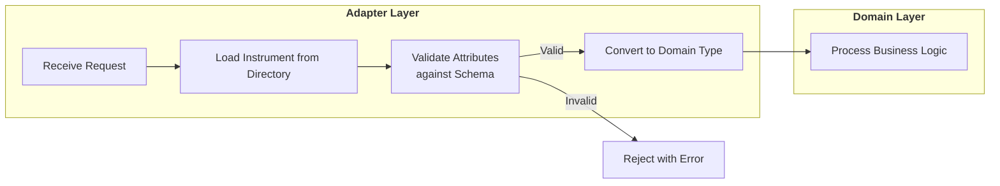
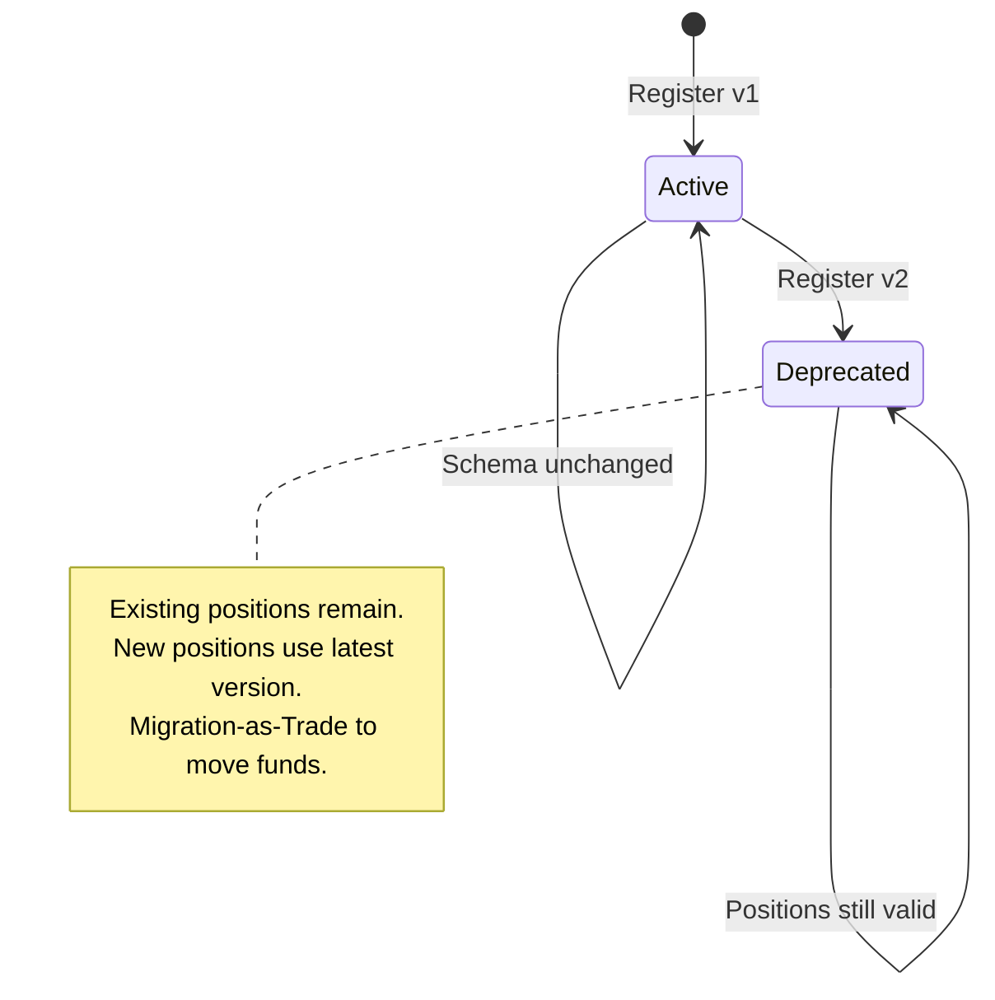
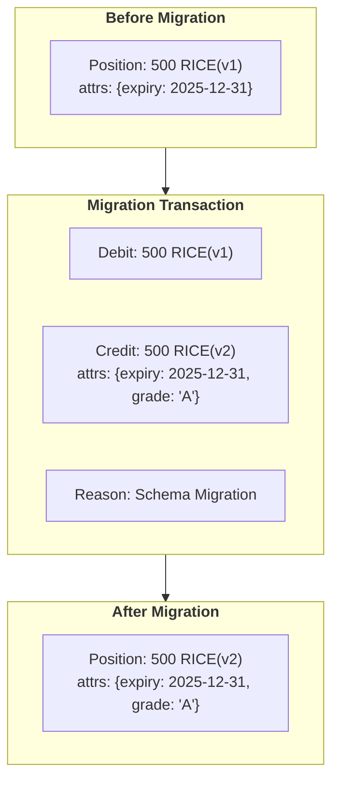

# 14. Financial Instrument Reference Data

Date: 2025-12-04

## Status

Proposed

## Context

[ADR-0013](0013-generic-asset-quantity-types.md) establishes the **Dimensional Hybrid Pattern**:
compile-time safety via Dimensions (`Monetary{}`, `Commodity{}`), runtime flexibility via
`FinancialInstrument` records. This ADR defines the BIAN service that stores, versions, and
manages those instrument definitions.

### BIAN Service Domain

This ADR implements **BIAN Financial Instrument Reference Data Management** (v13.0.0):

> "This Service Domain maintains a directory of financial instrument reference data"

| BIAN Concept | Meridian Implementation |
|--------------|------------------------|
| Service Domain | Financial Instrument Reference Data Management |
| Control Record | `FinancialInstrumentDirectoryEntry` |
| Business Object | `FinancialInstrument` |
| Behavior Qualifiers | Currency, DebtInstrument, Equity, Futures, Option, Warrant |

**BIAN Instrument Types** (from `financialinstrumenttypevalues`):

| BIAN Type | Description | Dimension (derived) |
|-----------|-------------|---------------------|
| Currency | Fiat money (ISO 4217) | Monetary |
| Debt | Bonds, loans, credit instruments | Monetary |
| Equity | Stocks, shares | Monetary |
| Derivative | Options, futures, swaps | Monetary |
| Commodity | Physical goods, energy, inventory | Commodity |

### The SaaS Challenge

A multi-tenant platform must allow tenants to define custom financial instruments without
code deployment:

| Tenant | Custom Instrument | Attributes | BIAN Type |
|--------|------------------|------------|-----------|
| Utility Co | `KWH-PEAK` | `tou_period`, `tariff_zone` | Commodity |
| Agribusiness | `RICE-VOUCHER` | `expiry_date`, `quality_grade` | Commodity |
| Carbon Exchange | `VCU-2024` | `vintage`, `project_id`, `registry` | Commodity |
| Treasury | `USD-T-BILL` | `maturity_date`, `coupon_rate` | Debt |

**Requirements:**
- Tenants define instruments via configuration, not code changes
- Each instrument has a schema defining valid attributes
- Schema changes must not corrupt historical positions
- Positions with different versions are not fungible

### Schema Evolution Problem

When an instrument's schema changes (e.g., adding `quality_grade` to rice), what happens to
existing positions?

**Bad approach**: Mutate historical records to add the new field.
- Corrupts audit trail
- May violate accounting regulations
- Can't prove what the position looked like at settlement time

**Good approach**: Treat schema changes as version increments.
- `RICE-VOUCHER(v1)` positions remain untouched
- New positions use `RICE-VOUCHER(v2)` with the new schema
- Migration is explicit: trade v1 for v2 via ledger transaction

## Decision Drivers

* **BIAN compliance**: Implement standard Financial Instrument Reference Data Management
* **Tenant autonomy**: New instruments without platform code deployment
* **Audit integrity**: Historical positions must be immutable
* **Schema validation**: Invalid attributes rejected at ingestion
* **Version isolation**: Different versions are distinct instruments
* **Migration transparency**: Version transitions are auditable ledger events

## Decision Outcome

Chosen option: **BIAN Financial Instrument Reference Data Management Service**.

### Directory Entry Schema

```sql
-- BIAN: FinancialInstrumentDirectoryEntry
CREATE TABLE financial_instrument_directory (
    id UUID PRIMARY KEY DEFAULT gen_random_uuid(),
    tenant_id UUID NOT NULL,

    -- BIAN: FinancialInstrumentIdentification
    instrument_code VARCHAR(32) NOT NULL,
    version INTEGER NOT NULL DEFAULT 1,

    -- BIAN: FinancialInstrumentType
    instrument_type VARCHAR(50) NOT NULL,

    -- BIAN: FinancialInstrumentName
    instrument_name VARCHAR(128),

    -- Instrument Properties
    precision INTEGER NOT NULL,             -- Decimal places (2, 4, 8)
    attribute_schema JSONB NOT NULL,        -- JSON Schema for position attributes
    description TEXT,

    -- Lifecycle (BIAN: DirectoryEntryStatus)
    created_at TIMESTAMPTZ NOT NULL DEFAULT NOW(),
    deprecated_at TIMESTAMPTZ,

    UNIQUE(tenant_id, instrument_code, version),
    CHECK (precision >= 0 AND precision <= 18),
    CHECK (instrument_type IN ('Currency', 'Debt', 'Equity', 'Derivative', 'Commodity'))
);

CREATE INDEX idx_instrument_directory_lookup
    ON financial_instrument_directory(tenant_id, instrument_code, version)
    WHERE deprecated_at IS NULL;
```

**Note**: No `dimension` column - it's derived from `instrument_type` at runtime:

```go
func (t InstrumentType) Dimension() string {
    if t == InstrumentTypeCommodity {
        return "Commodity"
    }
    return "Monetary"
}
```

### Domain Types

```go
// FinancialInstrumentDirectoryEntry is the BIAN Control Record.
// Loaded from the database, used by consuming services.
type FinancialInstrumentDirectoryEntry struct {
    ID              uuid.UUID
    TenantID        uuid.UUID

    // BIAN Standard Fields
    InstrumentCode  string         // "USD", "KWH", "RICE-VOUCHER"
    Version         uint32         // Schema version (1, 2, 3...)
    InstrumentType  InstrumentType // Currency, Debt, Equity, Derivative, Commodity
    InstrumentName  string         // Human-readable name

    // Properties
    Precision       int             // Decimal places
    AttributeSchema json.RawMessage // JSON Schema for validation
    Description     string

    // Lifecycle
    CreatedAt       time.Time
    DeprecatedAt    *time.Time
}

// ToFinancialInstrument converts to the domain type from ADR-0013.
func (e FinancialInstrumentDirectoryEntry) ToFinancialInstrument() FinancialInstrument {
    return FinancialInstrument{
        Code:           e.InstrumentCode,
        Version:        e.Version,
        InstrumentType: e.InstrumentType,
        Precision:      e.Precision,
        Schema:         AttributeSchema(e.AttributeSchema),
    }
}
```

### Attribute Schema Definition

Each instrument defines its valid attributes using JSON Schema:

```json
{
  "type": "object",
  "properties": {
    "expiry_date": {
      "type": "string",
      "format": "date",
      "description": "ISO 8601 date when voucher expires"
    },
    "quality_grade": {
      "type": "string",
      "enum": ["A", "B", "C"],
      "description": "Quality classification"
    }
  },
  "required": ["expiry_date"],
  "additionalProperties": false
}
```

### Schema-on-Write Validation

Attributes are validated **at ingestion**, before entering the domain layer:



### Service Interface (BIAN Operations)

```go
// FinancialInstrumentReferenceData implements BIAN service operations.
type FinancialInstrumentReferenceData interface {
    // Register creates a new instrument (BIAN: Register)
    Register(ctx context.Context, entry FinancialInstrumentDirectoryEntry) error

    // Retrieve loads an instrument by code and version (BIAN: Retrieve)
    Retrieve(ctx context.Context, tenantID uuid.UUID, code string, version uint32) (FinancialInstrumentDirectoryEntry, error)

    // RetrieveLatest loads the latest non-deprecated version
    RetrieveLatest(ctx context.Context, tenantID uuid.UUID, code string) (FinancialInstrumentDirectoryEntry, error)

    // Update deprecates an instrument version (BIAN: Update)
    Deprecate(ctx context.Context, tenantID uuid.UUID, code string, version uint32) error

    // ValidateAttributes checks attributes against the instrument's schema
    ValidateAttributes(ctx context.Context, entry FinancialInstrumentDirectoryEntry, attrs map[string]string) error
}
```

### Version Lifecycle



1. **Register**: New instrument with `version=1`
2. **Evolve**: Schema change registers `version=2`, deprecates `version=1`
3. **Migrate**: Explicit ledger transactions move positions from v1 to v2
4. **Archive**: After full migration, v1 has zero positions (historical records remain)

### Migration-as-Trade Pattern

When schema changes, positions don't automatically migrate. Instead, generate explicit
ledger transactions that preserve audit trail:



```go
// MigrationService handles version transitions via the ledger.
type MigrationService struct {
    referenceData FinancialInstrumentReferenceData
    ledger        LedgerService
}

// MigratePosition creates a ledger transaction to move from old to new version.
func (m *MigrationService) MigratePosition(
    ctx context.Context,
    position Position,
    targetVersion uint32,
    newAttributes map[string]string,
) error {
    // 1. Load target version from Reference Data
    target, err := m.referenceData.Retrieve(ctx, position.TenantID, position.InstrumentCode, targetVersion)
    if err != nil {
        return fmt.Errorf("target version not found: %w", err)
    }

    // 2. Validate new attributes against target schema
    if err := m.referenceData.ValidateAttributes(ctx, target, newAttributes); err != nil {
        return fmt.Errorf("invalid attributes for target version: %w", err)
    }

    // 3. Create migration transaction (atomic debit + credit)
    tx := LedgerTransaction{
        Type:   TransactionTypeMigration,
        Reason: fmt.Sprintf("Schema migration from v%d to v%d", position.Version, targetVersion),
        Entries: []LedgerEntry{
            {
                AccountID:      position.AccountID,
                InstrumentCode: position.InstrumentCode,
                Version:        position.Version,
                Amount:         position.Amount.Neg(), // Debit old version
                Attributes:     position.Attributes,
            },
            {
                AccountID:      position.AccountID,
                InstrumentCode: position.InstrumentCode,
                Version:        targetVersion,
                Amount:         position.Amount, // Credit new version
                Attributes:     newAttributes,
            },
        },
    }

    return m.ledger.Execute(ctx, tx)
}
```

### Caching Strategy

Instrument definitions are read frequently, written rarely. Use read-through cache:

```go
type CachedReferenceData struct {
    db    *sql.DB
    cache *cache.Cache
    ttl   time.Duration
}

func (r *CachedReferenceData) Retrieve(ctx context.Context, tenantID uuid.UUID, code string, version uint32) (FinancialInstrumentDirectoryEntry, error) {
    key := fmt.Sprintf("instrument:%s:%s:%d", tenantID, code, version)

    if cached, found := r.cache.Get(key); found {
        return cached.(FinancialInstrumentDirectoryEntry), nil
    }

    entry, err := r.loadFromDB(ctx, tenantID, code, version)
    if err != nil {
        return FinancialInstrumentDirectoryEntry{}, err
    }

    r.cache.Set(key, entry, r.ttl)
    return entry, nil
}
```

**Cache invalidation**: On instrument registration or deprecation, invalidate specific keys
and broadcast to other service instances via pub/sub.

## Positive Consequences

* **BIAN compliance**: Implements standard Financial Instrument Reference Data Management
* **Tenant autonomy**: New instruments via configuration, no code deployment
* **Audit integrity**: Migration-as-Trade preserves complete history
* **Schema safety**: Invalid attributes rejected before entering domain
* **Version clarity**: Different versions are explicitly distinct
* **Cache-friendly**: Directory entries are immutable once created
* **Clean separation**: Reference data is separate from position keeping

## Negative Consequences

* **Migration complexity**: Schema changes require explicit migration jobs
* **Registry dependency**: All instrument operations need reference data lookup
* **Cache invalidation**: Must coordinate across service instances
* **Storage overhead**: Each version stored separately

## Links

* [ADR-0013: Universal Quantity Type System](0013-generic-asset-quantity-types.md) - Type system foundation
* [ADR-0003: Database Schema Migrations](0003-database-schema-migrations.md) - Migration patterns
* [ADR-0005: Adapter Pattern](0005-adapter-pattern-layer-translation.md) - Layer translation
* [BIAN Financial Instrument Reference Data Management](https://bian.org) - Service domain specification
* [JSON Schema Specification](https://json-schema.org/) - Attribute validation

## Notes

### Tenant Isolation

Instrument definitions are tenant-scoped. The `tenant_id` column ensures:
- Tenants cannot see or use other tenants' custom instruments
- Platform-wide instruments (USD, EUR) use a special system tenant ID
- Queries always filter by tenant

### Built-in Instruments

Platform provides standard instruments that all tenants inherit:

```sql
-- System tenant for platform-wide instruments
INSERT INTO financial_instrument_directory
    (tenant_id, instrument_code, version, instrument_type, instrument_name, precision, attribute_schema)
VALUES
    ('00000000-0000-0000-0000-000000000000', 'USD', 1, 'Currency', 'US Dollar', 2, '{}'),
    ('00000000-0000-0000-0000-000000000000', 'EUR', 1, 'Currency', 'Euro', 2, '{}'),
    ('00000000-0000-0000-0000-000000000000', 'GBP', 1, 'Currency', 'British Pound', 2, '{}');
```

### gRPC API (BIAN Operations)

```protobuf
service FinancialInstrumentReferenceDataManagement {
    // BIAN: Register
    rpc Register(RegisterInstrumentRequest) returns (FinancialInstrumentDirectoryEntry);

    // BIAN: Retrieve
    rpc Retrieve(RetrieveInstrumentRequest) returns (FinancialInstrumentDirectoryEntry);

    // BIAN: Retrieve (list)
    rpc List(ListInstrumentsRequest) returns (ListInstrumentsResponse);

    // BIAN: Update (deprecate)
    rpc Deprecate(DeprecateInstrumentRequest) returns (FinancialInstrumentDirectoryEntry);
}

message RegisterInstrumentRequest {
    string instrument_code = 1;
    string instrument_type = 2;     // Currency, Debt, Equity, Derivative, Commodity
    string instrument_name = 3;
    int32 precision = 4;
    string attribute_schema = 5;    // JSON Schema as string
    string description = 6;
}

message RetrieveInstrumentRequest {
    string instrument_code = 1;
    uint32 version = 2;             // 0 = latest non-deprecated
}
```

### Consumer Guidance: Partition Routing

Consumers of this service (e.g., Position Keeping, Ledger) may partition storage by
dimension for regulatory segregation. The dimension is derived from `instrument_type`:

```go
dimension := instrument.InstrumentType.Dimension()  // "Monetary" or "Commodity"
```

This keeps the Reference Data service focused on its BIAN responsibility (instrument
definitions) while allowing consumers to implement their own storage strategies.

### Reconsidering This Decision

Revisit if:
- Schema validation becomes a performance bottleneck
- Migration-as-Trade proves too operationally complex
- Tenant isolation requirements change (multi-tenant instrument sharing)
- BIAN releases breaking changes to Financial Instrument Reference Data Management
