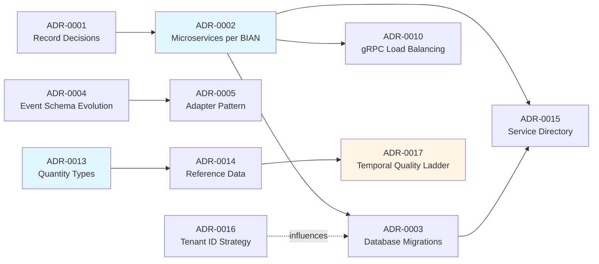

# Architecture Decision Records

This directory contains Architecture Decision Records (ADRs) for Meridian.

## What are ADRs?

Architecture Decision Records capture important architectural decisions made in the project, along with their context
and consequences. They help:

- Document the reasoning behind architectural choices
- Prevent relitigating already-decided trade-offs
- Onboard new team members with historical context
- Guide AI assistants and tools with appropriate context

## Creating New ADRs

We use the [adr-tools](https://github.com/npryce/adr-tools) CLI for managing ADRs:

```bash

# Install adr-tools (if not already installed)

brew install adr-tools

# Create a new ADR

adr new "Title of Decision"

# Link ADRs (when one supersedes another)

adr link <source> "Supersedes" <target>
```

For more complex ADRs, use the [template.md](template.md) file as a starting point, which follows the MADR (Markdown
Architectural Decision Records) format.

## ADR Index

| ADR | Title | Status | Date |
|-----|-------|--------|------|
| [ADR-0001](0001-record-architecture-decisions.md) | Record Architecture Decisions | Accepted | 2025-10-24 |
<!-- markdownlint-disable MD013 -->
| [ADR-0002](0002-microservices-per-bian-domain.md) | Microservices Architecture with One Service per BIAN Domain | Accepted | 2025-10-25 |
| [ADR-0003](0003-database-schema-migrations.md) | Database Schema Migrations with Atlas | Accepted | 2025-10-25 (Revised) |
| [ADR-0004](0004-event-schema-evolution.md) | Event Schema Evolution with Protobuf and Buf | Accepted | 2025-10-25 |
| [ADR-0005](0005-adapter-pattern-layer-translation.md) | Adapter Pattern for Layer Translation | Accepted | 2025-10-25 |
| [ADR-0006](0006-tilt-local-development.md) | Tilt for Local Kubernetes Development | Accepted | 2025-10-25 |
| [ADR-0007](0007-raw-yaml-over-helm-for-initial-development.md) | Raw YAML over Helm for Initial Development | Accepted | 2025-10-25 |
<!-- markdownlint-enable MD013 -->
| [ADR-0008](0008-defensive-testing-standards.md) | Defensive Testing Standards | Accepted | 2025-10-25 |
| [ADR-0009](0009-application-level-audit-logging.md) | Application-Level Audit Logging | Accepted | 2025-11-04 |
<!-- markdownlint-disable-next-line MD013 -->
| [ADR-0010](0010-grpc-client-side-load-balancing.md) | gRPC Client-Side Load Balancing with Headless Services | Accepted | 2025-11-14 |
| [ADR-0011](0011-iso-20022-compliance-via-adapter-layer.md) | ISO 20022 Compliance via Adapter Layer | Accepted | 2025-11-14 |
| [ADR-0012](0012-lien-based-fund-reservation.md) | Lien-Based Fund Reservation for Payment Order Saga | Accepted | 2025-11-25 |
| [ADR-0013](0013-generic-asset-quantity-types.md) | Universal Quantity Type System | Accepted | 2025-12-03 |
| [ADR-0014](0014-financial-instrument-reference-data.md) | Financial Instrument Reference Data | Accepted | 2025-12-04 |
| [ADR-0015](0015-standard-service-directory-structure.md) | Standard Service Directory Structure | Accepted | 2025-12-06 |
| [ADR-0016](0016-tenant-id-naming-strategy.md) | Tenant ID Naming Strategy | Accepted | 2025-12-13 |
<!-- markdownlint-disable-next-line MD013 -->
| [ADR-0017](0017-temporal-quality-ladder.md) | Temporal Quality Ledger (Data Physics) | Accepted | 2025-12-14 |
| [ADR-0018](0018-settlement-reconciliation.md) | Settlement & Reconciliation (Lifecycle) | Accepted | 2025-12-14 |
| [ADR-0019](0019-resilient-client-patterns.md) | Resilient Client Patterns | Accepted | 2025-12-18 |
| [ADR-0020](0020-per-service-audit-workers.md) | Per-Service Audit Workers | Accepted | 2025-12-20 |
<!-- markdownlint-disable-next-line MD013 -->
| [ADR-0021](0021-kyc-aml-verification-provider-architecture.md) | KYC/AML Verification Provider Architecture | Proposed | 2025-12-22 |
| [ADR-0022](0022-instrument-successor-lineage.md) | Instrument Successor Lineage | Accepted | 2025-12-28 |
<!-- markdownlint-disable-next-line MD013 -->
| [ADR-0023](0023-balance-delegation-to-position-keeping.md) | Balance Delegation to Position Keeping | Accepted | 2026-01-08 |
| [ADR-0024](0024-internal-bank-account-service.md) | Internal Account Service Domain | Accepted | 2026-01-15 |
<!-- markdownlint-disable-next-line MD013 -->
| [ADR-0025](0025-clearing-purpose-specialization.md) | Clearing Purpose Specialization | Accepted | 2026-01-16 |
<!-- markdownlint-disable-next-line MD013 -->
| [ADR-0026](0026-canonical-ingestion-contract.md) | Canonical Ingestion Contract | Accepted | 2026-01-17 |
<!-- markdownlint-disable-next-line MD013 -->
| [ADR-0027](0027-market-information-management.md) | Market Information Management Service Architecture | Accepted | 2026-01-19 |
<!-- markdownlint-disable-next-line MD013 -->
| [ADR-0028](0028-starlark-saga-cel-valuation.md) | Starlark Saga Orchestration with CEL Valuation | Accepted | 2026-01-20 |
<!-- markdownlint-disable-next-line MD013 -->
| [ADR-0029](0029-settlement-scheduler-architecture.md) | Settlement Scheduler Architecture | Accepted | 2026-02-09 |
<!-- markdownlint-disable-next-line MD013 -->
| [ADR-0030](0030-kyc-aml-provider-selection.md) | KYC/AML Provider Selection | Accepted | 2026-02-12 |
<!-- markdownlint-disable-next-line MD013 -->
| [ADR-0031](0031-getbalance-nil-guard-retention.md) | Retain Nil Guard on PositionKeepingClient in GetBalance | Accepted | 2026-02-13 |
<!-- markdownlint-disable-next-line MD013 -->
| [ADR-0032](0032-vanguard-json-transcoding-gateway.md) | Vanguard HTTP/JSON Transcoding Gateway | Accepted | 2026-02-20 |
<!-- markdownlint-disable-next-line MD013 -->
| [ADR-0033](0033-event-triggered-sagas.md) | Event-Triggered Sagas | Accepted | 2026-03-04 |
<!-- markdownlint-disable-next-line MD013 -->
| [ADR-0034](0034-position-compaction-strategy.md) | Position Compaction Strategy | Accepted | 2026-03-06 |
<!-- markdownlint-disable-next-line MD013 -->
| [ADR-0035](0035-multi-asset-purity.md) | Multi-Asset Purity Enforcement | Accepted | 2026-03-07 |
<!-- markdownlint-disable-next-line MD013 -->
| [ADR-0036](0036-embedded-dex-identity.md) | Embed Dex OIDC Server in the Meridian Binary | Accepted | 2026-03-13 |
<!-- markdownlint-disable-next-line MD013 -->
| [ADR-0037](0037-scheduler-attribution-design.md) | Scheduler Attribution Design | Accepted | 2026-04-07 |

## Architecture Decision Relationships

Key **foundational** architectural decisions and their dependencies. This graph is intentionally scoped to the
foundational set and does not depict every ADR; consult the full index table above for the complete list (including
the saga set ADR-0028/0033 and later decisions ADR-0029 onward).



**Legend:**

- Solid lines: Direct dependencies
- Dashed lines: Influences or relates to
- Blue background: Foundational decisions
- Orange background: Proposed/experimental

## Categories

### Project Structure

- [ADR-0001](0001-record-architecture-decisions.md) - Record Architecture Decisions
- [ADR-0002](0002-microservices-per-bian-domain.md) - Microservices Architecture
- [ADR-0015](0015-standard-service-directory-structure.md) - Standard Service Directory Structure

### Data Management & Architecture Patterns

- [ADR-0003](0003-database-schema-migrations.md) - Database Schema Migrations with Atlas
- [ADR-0004](0004-event-schema-evolution.md) - Event Schema Evolution with Protobuf and Buf
- [ADR-0005](0005-adapter-pattern-layer-translation.md) - Adapter Pattern for Layer Translation
- [ADR-0009](0009-application-level-audit-logging.md) - Application-Level Audit Logging
- [ADR-0012](0012-lien-based-fund-reservation.md) - Lien-Based Fund Reservation for Payment Order Saga
- [ADR-0013](0013-generic-asset-quantity-types.md) - Universal Quantity Type System
- [ADR-0014](0014-financial-instrument-reference-data.md) - Financial Instrument Reference Data (BIAN)
- [ADR-0017](0017-temporal-quality-ladder.md) - Temporal Quality Ledger (Data Physics)
- [ADR-0018](0018-settlement-reconciliation.md) - Settlement & Reconciliation (Lifecycle)
- [ADR-0023](0023-balance-delegation-to-position-keeping.md) - Balance Delegation to Position Keeping
- [ADR-0024](0024-internal-bank-account-service.md) - Internal Account Service Domain
- [ADR-0025](0025-clearing-purpose-specialization.md) - Clearing Purpose Specialization
- [ADR-0026](0026-canonical-ingestion-contract.md) - Canonical Ingestion Contract

### Development Environment & Infrastructure

- [ADR-0006](0006-tilt-local-development.md) - Tilt for Local Kubernetes Development
- [ADR-0007](0007-raw-yaml-over-helm-for-initial-development.md) - Raw YAML over Helm for Initial Development
- [ADR-0010](0010-grpc-client-side-load-balancing.md) - gRPC Client-Side Load Balancing with Headless Services
- [ADR-0011](0011-iso-20022-compliance-via-adapter-layer.md) - ISO 20022 Compliance via Adapter Layer

### Quality & Testing

- [ADR-0008](0008-defensive-testing-standards.md) - Defensive Testing Standards

### API Gateway & Protocols

- [ADR-0032](0032-vanguard-json-transcoding-gateway.md) - Vanguard HTTP/JSON Transcoding Gateway

### Event-Driven Architecture

- [ADR-0033](0033-event-triggered-sagas.md) - Event-Triggered Sagas

### Multi-Tenancy

- [ADR-0016](0016-tenant-id-naming-strategy.md) - Tenant ID Naming Strategy

## Key Architectural Changes

**2025-10-25 Revision:** Moved from unified schema management to separated concerns:

- **Previous approach:** Go structs with tags as single source of truth for database, events, and APIs
- **New approach:** Separate domain models, persistence entities, and event schemas with explicit adapters
- **Rationale:** Real-world experience showed unified approach was too rigid. Separated concerns allow:
  - Database audit fields without polluting domain
  - Event metadata without cluttering business logic
  - Independent versioning of database, events, and APIs
  - Follows industry best practices (Google, LinkedIn, Netflix, AWS)

See [ADR-0004](0004-event-schema-evolution.md) and [ADR-0005](0005-adapter-pattern-layer-translation.md) for
details.

## Future ADRs to Consider

Based on the Meridian project requirements, these ADRs may be created as implementation progresses:

- **Database Choice: CockroachDB vs YugabyteDB** - Distributed SQL database selection
- **Idempotency Implementation** - Redis-based idempotency strategy
- **Test Strategy for Financial Systems** - TDD approach for zero-tolerance systems
- **Service Mesh vs API Gateway** - Cross-cutting concerns for microservices
<!-- markdownlint-disable-next-line MD013 -->
- **Event Versioning Strategy** - How to handle breaking changes in Kafka events

## References

<!-- markdownlint-disable MD013 -->

- [Documenting Architecture Decisions](http://thinkrelevance.com/blog/2011/11/15/documenting-architecture-decisions) - Michael Nygard
- [MADR](https://adr.github.io/madr/) - Markdown Architectural Decision Records
- [adr-tools](https://github.com/npryce/adr-tools) - Command-line tools for working with ADRs

<!-- markdownlint-enable MD013 -->
- [BIAN Standards](https://bian.org/) - Banking Industry Architecture Network
