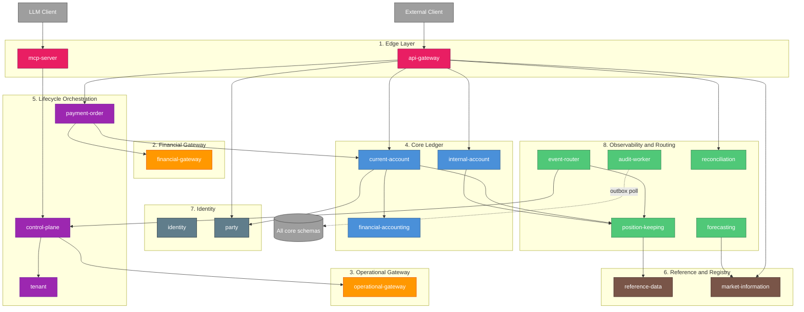

# Meridian Architecture Layers

**Status:** Active
**Audience:** Engineers, AI contributors, integrators
**Scope:** All 19 services in `services/`

## Overview

Meridian is composed of 19 microservices organised into 8 functional layers. Each layer
groups services by the role they play in a request, not by the team that owns them. This
document is the canonical reference for those layers. Service READMEs, PRDs, and
architectural decisions reference layer names defined here so contributors can locate any
service within the request path quickly.

The layers form a directed graph from the edge inwards: external clients enter through
the Edge layer, are routed through one of the gateways, and resolve into the Core
Ledger. Lifecycle Orchestration coordinates multi-step workflows across core services.
Reference & Registry, Identity, and Observability & Routing are cross-cutting concerns
that any layer may depend on.

The grouping is functional, not deployment-topological. Several layers contain a single
service today, but the layer name reserves the slot for future siblings (for example,
additional gateways under Operational Gateway).

## Layer Map

**Legend:**

- Solid arrows: synchronous gRPC dependency in the request path
- Dashed arrows: asynchronous or polling dependency

---

## 1. Edge Layer

**Services:** `api-gateway`, `mcp-server`

### Purpose

The Edge layer is the only externally addressable surface of the platform. It terminates
client protocols, authenticates callers, resolves the tenant context, and forwards
requests to backend services. Every external request to Meridian transits this layer.

### Inbound

- HTTP/JSON, Connect, gRPC-Web, and gRPC clients (api-gateway)
- LLM clients via Model Context Protocol over stdio or streamable HTTP (mcp-server)

### Outbound

- All Core Ledger services via gRPC proxying (api-gateway)
- `control-plane` for manifest plan and apply operations (mcp-server)
- Read RPCs across most services for inspection tools (mcp-server)

### Key Responsibilities

- JWT and API key authentication, JWKS rotation
- Tenant resolution from subdomain or `X-Tenant-ID` header
- HTTP/JSON to gRPC transcoding via Vanguard
- Plan-before-apply safety for manifest mutations from LLM clients
- Rate limiting and request shaping at the perimeter

### Boundary Rules

- No business logic. Backend services own validation and state transitions.
- No direct database access for domain data. Tenant lookup cache is the only exception.

---

## 2. Financial Gateway

**Services:** `financial-gateway`

### Purpose

Outbound dispatch and inbound reconciliation for financial instructions. Owns the
provider connection lifecycle, instruction state machine, and webhook handling for any
operation that moves money or other ledgered value through an external rail.

### Inbound

- `payment-order` saga steps invoking dispatch via gRPC
- External payment providers via HTTP webhooks

### Outbound

- External payment provider APIs (HTTP)
- CockroachDB for instruction persistence

### Key Responsibilities

- Instruction lifecycle: `PENDING` -> `DISPATCHING` -> `DELIVERED` -> `ACKNOWLEDGED`
- HMAC-SHA256 signature verification for inbound webhooks
- Provider connection health monitoring and circuit breaking
- Idempotent dispatch with retry and exponential backoff

### Boundary Rules

- Only handles `payment.*` instruction types. Non-financial instructions are rejected
  and must use Operational Gateway.
- Does not post to the ledger. Settlement events propagate back to `payment-order`
  which orchestrates the ledger update via Core Ledger services.

---

## 3. Operational Gateway

**Services:** `operational-gateway`

### Purpose

Outbound dispatch for non-financial operational instructions. Mirror image of Financial
Gateway for instructions that do not involve money movement and therefore do not require
double-entry ledger integration.

### Inbound

- Saga steps from `control-plane` and tenant-defined Starlark sagas via gRPC

### Outbound

- External KYC providers, IoT device endpoints, partner SFTP servers, settlement
  notification systems
- CockroachDB for instruction persistence

### Key Responsibilities

- Routing by instruction type prefix: `kyc.*`, `device.*`, `settlement.*`, `partner.*`
- Connection registry and provider health checks
- Polling-based dispatch loop (CockroachDB does not support `LISTEN/NOTIFY`)

### Boundary Rules

- Rejects `payment.*` instructions. They must route through Financial Gateway to
  preserve the ledger and audit trail invariants required for financial transactions.

---

## 4. Core Ledger

**Services:** `current-account`, `internal-account`, `financial-accounting`

### Purpose

The accounting nucleus. These three services together provide BIAN-compliant
double-entry bookkeeping for all asset classes the platform supports: fiat currency,
energy (kWh), carbon credits, compute hours, and any future tenant-defined instrument.

The split mirrors BIAN: customer-facing accounts (`current-account`), internal and
counterparty accounts (`internal-account`), and the general ledger
(`financial-accounting`).

### Inbound

- `api-gateway` for customer operations
- `payment-order` for lien creation and settlement steps
- Tenant-defined sagas via `control-plane`

### Outbound

- `position-keeping` for balance queries and transaction history (`current-account`
  and `internal-account` delegate balance ownership per ADR-0023; `financial-accounting`
  has no PK client and does not query positions)
- `party` for ownership validation (current-account)
- `reference-data` for instrument definitions (transitively, via position-keeping)

### Key Responsibilities

- Account lifecycle: `ACTIVE` -> `FROZEN`/`SUSPENDED` -> `CLOSED`
- Lien-based fund reservation for in-flight payments
- Double-entry posting where debits always equal credits, enforced at the database
  level
- Multi-asset support through dimensioned quantities (`Currency`, `Energy`, `Carbon`,
  `Compute`)
- Idempotency via stable keys, optionally backed by Redis for multi-replica safety

### Boundary Rules

- Balance is never stored on customer or internal accounts. `current-account` and
  `internal-account` delegate balance reads to `position-keeping` per ADR-0023.
  `financial-accounting` owns booking logs and ledger postings but does not own
  balances.
- No service in this layer calls another directly outside well-defined orchestration
  flows. `payment-order` is the orchestrator; Core Ledger services are participants.

### Coupling Notes

Per the [coupling analysis](architecture/service-coupling-analysis.md):

- `current-account` has instability `I=1.00`. It is an orchestration entry point with
  two synchronous downstream dependencies and no upstream code dependents - exactly the
  shape expected for a customer-facing facade.
- `financial-accounting` has instability `I=0.00`. It is a stable provider with no
  outbound code dependencies on other services.

---

## 5. Lifecycle Orchestration

**Services:** `payment-order`, `control-plane`, `tenant`

### Purpose

Multi-step workflows that span Core Ledger services and gateways. Each service in this
layer owns a state machine that drives a long-running process to completion or
compensation.

### Inbound

- `api-gateway` for tenant-initiated operations (payments, manifest applies)
- `mcp-server` for LLM-initiated manifest operations
- `event-router` for event-triggered saga execution
- `tenantctl` CLI for tenant lifecycle commands

### Outbound

- Core Ledger services for state mutations
- Financial Gateway for payment dispatch
- Operational Gateway for non-financial dispatch
- Reference & Registry for instrument and saga definition lookups
- All services for tenant provisioning (tenant)

### Key Responsibilities

- **payment-order:** Saga-orchestrated payment lifecycle. State machine
  `INITIATED -> RESERVED -> EXECUTING -> COMPLETED` with automatic compensation on
  failure (lien release, reversal posting). Handles webhook callbacks from Financial
  Gateway and reconciles to ledger.
- **control-plane:** Manifest-driven configuration. Validates protobuf, CEL, and
  Starlark; diffs against last-applied state; executes the apply as a saga across
  affected services. Hosts the causation tree (Glass Box) audit trail and Stripe
  webhook reconciliation.
- **tenant:** Schema-per-tenant provisioning across CockroachDB. Drives the
  `pending -> in_progress -> active` lifecycle, seeds system instruments via
  `reference-data`, and registers the organisation party via `party`.

### Boundary Rules

- Sagas are bounded. The Starlark execution environment forbids `while` loops and
  recursion, guaranteeing termination. See the project CLAUDE.md for the full
  rationale.
- Compensation is declarative. Every step declares its inverse so the saga engine can
  unwind on failure.

---

## 6. Reference and Registry

**Services:** `reference-data`, `market-information`

### Purpose

Slowly-changing reference data that the rest of the platform reads but rarely writes.
Both services follow a `DRAFT -> ACTIVE -> DEPRECATED` lifecycle and use CEL for
declarative validation.

### Inbound

- All Core Ledger services for instrument definitions (reference-data)
- `forecasting` for historical price observations (market-information)
- `api-gateway` for direct read access (market-information)
- Lifecycle Orchestration for instrument and saga definition lookups during validation

### Outbound

- CockroachDB only

### Key Responsibilities

- **reference-data:** Instrument definitions (`GBP`, `KWH`, `TONNE_CO2E`, `GPU_HR`),
  valuation methods (Starlark), saga definitions, valuation policies (CEL), and the
  hierarchical `reference_data_node` registry. System instruments are seeded by
  `tenant` during provisioning; tenant instruments are user-managed.
- **market-information:** BIAN Market Information Management. Bi-temporal price
  observations with the time-bound quality ladder
  (`ESTIMATE -> PROVISIONAL -> ACTUAL -> REVISED`). Data sources carry trust levels
  for conflict resolution.

### Boundary Rules

- Reference data is the contract for the rest of the platform. Schema and CEL
  expressions are evaluated against this layer at validation time.
- Instruments cannot be deleted, only deprecated. Existing positions remain valid
  against deprecated instruments.

---

## 7. Identity

**Services:** `identity`, `party`

### Purpose

Authentication, authorisation, and identity. The split separates platform-level
authentication (`identity`) from BIAN party reference data (`party`). Platform users
log in through `identity`; the customers and counterparties they transact with are
modelled in `party`.

### Inbound

- `api-gateway` for token introspection and JWKS (identity)
- `current-account` and Lifecycle Orchestration for party validation (party)
- `tenant` for organisation party registration (party)

### Outbound

- CockroachDB for user, credential, and party persistence
- Embedded Dex OIDC server for authentication flows (identity)

### Key Responsibilities

- **identity:** Embedded Dex OIDC server (served at `/dex/*`), bridge to identity
  domain via `PasswordConnector`, per-tenant user and role management, demo and
  operator user bootstrap.
- **party:** BIAN Party Reference Data. `INDIVIDUAL` and `ORGANIZATION` types,
  lifecycle `ACTIVE -> RESTRICTED -> TERMINATED`, write-once external references
  (Companies House, LEI, National ID, Tax ID) with format-validated regex.

### Boundary Rules

- `tenant` (platform multi-tenancy) is distinct from `party.organization` (legal
  entity). One tenant may be represented by one party but they are different concerns.
- Party records are never hard-deleted. Status transitions are the only deactivation
  mechanism.

---

## 8. Observability and Routing

**Services:** `audit-worker`, `event-router`, `reconciliation`, `forecasting`,
`position-keeping`

### Purpose

Asynchronous services that observe, route, reconcile, or measure activity in other
layers. Most operate by polling or by consuming events; none sit on the synchronous
request path of a customer operation, with the important exception of
`position-keeping`, which is included here because of its role as the read-side
authority for balances and transaction history.

### Inbound

- Kafka topics from any service emitting domain or audit events (event-router,
  audit-worker, position-keeping consumers)
- CockroachDB outbox tables (audit-worker)
- gRPC reads from Core Ledger services and `api-gateway` (position-keeping,
  reconciliation)

### Outbound

- `control-plane` `ExecuteSaga` for event-triggered workflows (event-router)
- `position-keeping` `RecordMeasurement` for platform billing measurements
  (event-router)
- All upstream services for cross-service position queries (reconciliation)
- `market-information` for forecast input (forecasting)
- Kafka topics for downstream consumers (position-keeping)

### Key Responsibilities

- **position-keeping:** BIAN Transaction Log. Authoritative source for balance
  computation across all 7 BIAN balance types (`OPENING`, `CLOSING`, `CURRENT`,
  `AVAILABLE`, `LEDGER`, `RESERVE`, `FREE`). Immutable transaction history with
  parent-child lineage for reversals and amendments. Per ADR-0023, all other services
  delegate balance queries here.
- **event-router:** CEL-filtered Kafka consumer. Routes domain events to handlers,
  triggers sagas via `control-plane`, transforms audit events into utilization
  measurements for tenant-zero platform billing.
- **reconciliation:** BIAN Account Reconciliation. Compares positions across
  `position-keeping`, `financial-accounting`, and `current-account`. Tracks
  variances and disputes through their lifecycle.
- **forecasting:** Forward curve generation via tenant-defined Starlark strategies.
  Cron-scheduled with Redis lease management for distributed safety. Built-in
  templates: `moving_average`, `seasonal_decomposition`, `capacity_pricing`,
  `external_blend`.
- **audit-worker:** Fallback path of the dual-path audit system (ADR-0009). Polls
  `audit_outbox` tables across services and moves entries to `audit_log` when Kafka is
  unavailable. Default poll interval 5 seconds; alert threshold
  `meridian_audit_worker_outbox_depth > 1000`.

### Boundary Rules

- `position-keeping` instability is `I=0.00`. It is the most-depended-on service in
  the platform; all balance and transaction-history reads converge here. Treat its
  proto contract as load-bearing.
- `event-router` is a single deployment consuming from many topics, not a per-service
  consumer. Scale via HPA on Kafka consumer lag.
- `audit-worker` is the fallback, not the primary. Under healthy Kafka conditions, the
  Kafka consumer path is the audit pipeline. The worker exists so audit cannot be lost
  during a broker outage.

---

## Cross-Layer Patterns

### Request Path

A customer-initiated payment is the canonical example of a request flowing through
every layer:

1. **Edge:** `api-gateway` receives HTTP `POST /payment-orders`, authenticates the
   JWT, resolves the tenant, transcodes to gRPC, forwards to Lifecycle Orchestration.
2. **Lifecycle Orchestration:** `payment-order` validates the request, opens a saga.
3. **Core Ledger:** `payment-order` calls `current-account.InitiateLien` to reserve
   funds; `current-account` validates the party via Identity (`party`), then calls
   `position-keeping` to confirm available balance.
4. **Financial Gateway:** `payment-order` calls `financial-gateway.Dispatch` to send
   the instruction to the external rail.
5. **Observability and Routing:** the resulting `transaction-captured` event flows
   through Kafka; `event-router` may trigger downstream sagas; the audit event
   propagates to `audit_log` via Kafka or the outbox fallback in `audit-worker`.
6. **Settlement:** the external provider posts back via webhook to
   `financial-gateway`, which notifies `payment-order`, which calls
   `financial-accounting.CaptureLedgerPosting` and `current-account.ExecuteLien`.

### Communication Protocols by Layer

| Layer | Synchronous | Asynchronous | External |
|-------|-------------|--------------|----------|
| Edge | gRPC out | - | HTTP, MCP in |
| Financial Gateway | gRPC in | - | HTTP webhooks in/out |
| Operational Gateway | gRPC in | - | HTTP/SFTP out |
| Core Ledger | gRPC in/out | Kafka emit | - |
| Lifecycle Orchestration | gRPC in/out | Kafka consume | - |
| Reference and Registry | gRPC in | - | - |
| Identity | gRPC in | - | OIDC out |
| Observability and Routing | gRPC in/out | Kafka consume + emit | - |

### Multi-Tenancy

Every layer respects the schema-per-tenant model. The tenant context is established at
the Edge layer and propagated through gRPC metadata. CockroachDB schemas
(`org_{tenant_id}`) provide isolation at the storage layer. A small number of tables
(reference-data system instruments, saga definitions) are seeded per tenant during
provisioning by the `tenant` service.

### Audit Trail

The async audit system (ADR-0009) is cross-layer. Every service in Core Ledger,
Lifecycle Orchestration, and Identity has GORM hooks that capture changes and publish
to Kafka topics like `audit.events.<service>`. The Kafka primary path feeds dedicated
audit consumers; the `audit_outbox` fallback path feeds `audit-worker`. Both converge
on `audit_log` tables.

### Bounded Programmability

Tenant-authored logic is constrained to two languages, both of which guarantee
termination:

- **Starlark** for sagas, valuation methods, and forecasting strategies. No `while`
  loops, no recursion, no imports.
- **CEL** for validation rules, fungibility bucket keys, and event filters. Pure
  expressions, no state mutation, sub-millisecond evaluation.

This constraint surfaces at multiple layers: `reference-data` validates and stores the
scripts; `control-plane` compiles them during manifest apply; the Core Ledger and
Observability layers execute them at runtime. The schema-driven approach means
AI-generated configuration hits a type-checker wall before reaching production.

---

## Coupling Reference

The published [coupling analysis](architecture/service-coupling-analysis.md) covers
three services in detail. Headline metrics:

| Service | Layer | Afferent | Efferent | Instability | Assessment |
|---------|-------|---------:|---------:|------------:|------------|
| position-keeping | Observability and Routing | 1 | 0 | 0.00 | Stable provider |
| financial-accounting | Core Ledger | 1 | 0 | 0.00 | Stable provider |
| current-account | Core Ledger | 0 | 2 | 1.00 | Orchestration facade |

Position-keeping and financial-accounting sit at the bottom of the dependency graph;
current-account sits at the top of the customer-facing facade. The pattern is
intentional: read-side and posting-side authorities should be stable, while
orchestrators should be free to change.

For full coupling counts and inter-service import maps, see
[`docs/architecture/coupling-metrics.json`](architecture/coupling-metrics.json) and
[`docs/architecture/service-coupling-analysis.md`](architecture/service-coupling-analysis.md).

---

## References

- [`services/README.md`](../services/README.md) - runtime architecture, ports,
  protocols
- [`docs/architecture/bian-service-boundaries.md`](architecture/bian-service-boundaries.md) -
  BIAN domain mapping per service
- [`docs/architecture/service-coupling-analysis.md`](architecture/service-coupling-analysis.md) -
  coupling metrics and import-graph analysis
- [`docs/architecture/event-driven-architecture.md`](architecture/event-driven-architecture.md) -
  event flow and topic conventions
- [`docs/architecture/starlark-saga-architecture.md`](architecture/starlark-saga-architecture.md) -
  saga execution model
- ADR-0002: Microservices per BIAN Domain
- ADR-0009: Application-Level Audit Logging
- ADR-0023: Balance Delegation to Position Keeping
