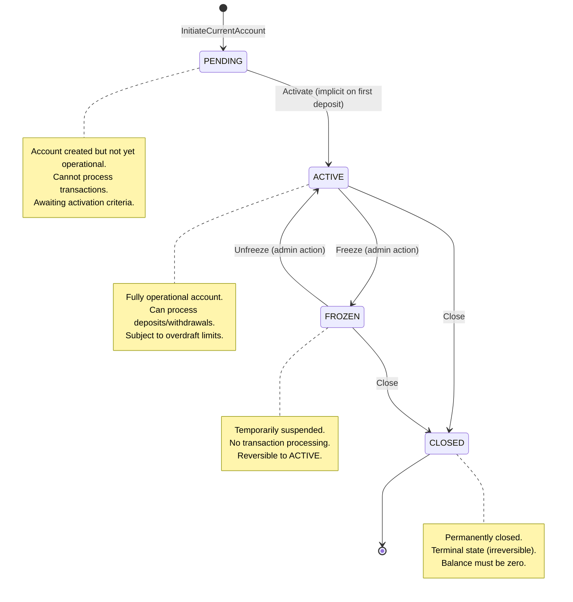
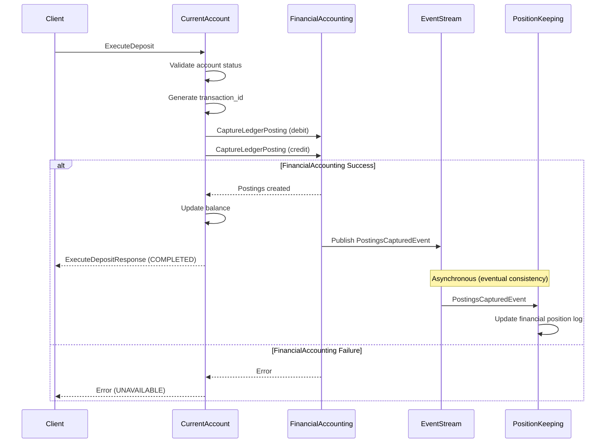
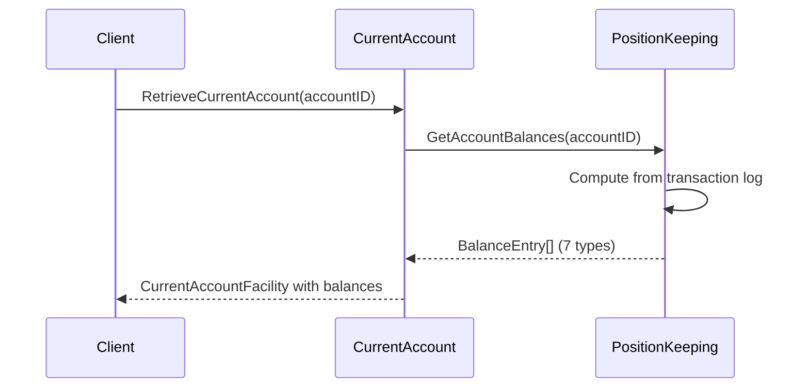

# CurrentAccount Service Behavioral API Contract

**Document Version:** 1.1
**Last Updated:** 2026-01-08
**Status:** Active
**BIAN Domain:** Current Account (Service Domain)
**Proto Definition:** `api/proto/meridian/current_account/v1/current_account.proto`
**Related Documents:**

- [BIAN Service Boundaries](../bian-service-boundaries.md)
- [Service Coupling Analysis](../service-coupling-analysis.md)
- [ADR-0023: Balance Delegation to Position Keeping](../../adr/0023-balance-delegation-to-position-keeping.md)

## Overview

The CurrentAccount service implements the BIAN Current Account service domain, managing customer deposit account facilities including account lifecycle, configuration, and transaction orchestration. This service acts as the orchestration layer coordinating operations across PositionKeeping and FinancialAccounting services.

**Key Responsibilities:**

- Account facility lifecycle management (PENDING → ACTIVE → FROZEN → CLOSED)
- Overdraft configuration and limit enforcement
- Transaction orchestration (deposits, withdrawals)
- Client-facing API for account operations
- Audit logging and event publishing

**Architectural Pattern:** Orchestration Layer (Instability I=1.00)

- Depends on: PositionKeeping (balance queries via `GetAccountBalances`), FinancialAccounting (ledger postings)
- No dependents: Client-facing service with no upstream consumers
- High instability is expected and appropriate for this orchestration role

**Balance Delegation (ADR-0023):** Balance is NOT stored in Current Account. All balance queries
delegate to Position Keeping service which computes 7 BIAN balance types (OPENING, CLOSING,
CURRENT, AVAILABLE, LEDGER, RESERVE, FREE) from the transaction log.

## State Machine

The CurrentAccount service manages account facilities through a well-defined state machine:



### State Transition Rules

**PENDING → ACTIVE:**

- Trigger: First successful deposit OR explicit activation
- Preconditions: Valid account configuration, IBAN validated
- Postconditions: Account can process transactions
- Reversible: Yes (via FROZEN state)

**ACTIVE → FROZEN:**

- Trigger: Administrative action (e.g., fraud detection, regulatory hold)
- Preconditions: Account exists, not already FROZEN or CLOSED
- Postconditions: All transaction processing blocked
- Reversible: Yes (via Unfreeze operation)

**FROZEN → ACTIVE:**

- Trigger: Administrative action (unfreeze)
- Preconditions: Account in FROZEN state, no outstanding holds
- Postconditions: Account resumes normal operation
- Reversible: Yes (can freeze again)

**ACTIVE/FROZEN → CLOSED:**

- Trigger: Administrative closure OR customer request
- Preconditions: Account balance must be zero
- Postconditions: Account permanently disabled, no further transactions
- Reversible: No (terminal state)

## API Operations

### InitiateCurrentAccount

Creates a new current account facility.

**Proto Definition:**

```protobuf
rpc InitiateCurrentAccount(InitiateCurrentAccountRequest) returns (InitiateCurrentAccountResponse);

message InitiateCurrentAccountRequest {
  string customer_id = 1;                      // Owner of the account
  string account_identification = 2;           // IBAN (validated)
  meridian.common.v1.Currency base_currency = 3;  // Account currency
}

message InitiateCurrentAccountResponse {
  string account_id = 1;                       // Generated account ID
  CurrentAccountFacility facility = 2;         // Complete facility details
}
```

**Behavioral Semantics:**

This operation creates a new account facility with initial PENDING status. The account transitions to ACTIVE either on first deposit or explicit activation.

**Preconditions:**

- `customer_id` must be non-empty (1-100 chars, alphanumeric with hyphens/underscores)
- `account_identification` must be valid IBAN format: 2 letter country code + 2 check digits + up to 30 alphanumeric characters
- `base_currency` must be a defined Currency enum value (not UNSPECIFIED)
- IBAN must be globally unique across all accounts (checked at persistence layer)

**Postconditions:**

- New `CurrentAccountFacility` created with status ACCOUNT_STATUS_PENDING
- `account_id` generated (UUID format)
- `created_at` and `updated_at` timestamps set to current time
- `version` initialized to 0 for optimistic locking
- `current_balance` initialized with zero balance and available balance
- `overdraft_limit` initialized with zero limit and disabled state
- `transaction_history` initialized as empty
- Audit log entry created for account creation

**Invariants:**

- Account ID is immutable once assigned
- IBAN is immutable once assigned
- Base currency is immutable once set
- Account always has valid timestamps (created_at <= updated_at)
- Version is non-negative and monotonically increasing

**Error Handling:**

| Error Code | Condition | Response |
|------------|-----------|----------|
| `INVALID_ARGUMENT` | Missing required field (customer_id, IBAN, currency) | Details indicate which field is missing |
| `INVALID_ARGUMENT` | Invalid IBAN format | Details include IBAN validation error |
| `INVALID_ARGUMENT` | Unspecified currency (value 0) | Details request valid currency |
| `ALREADY_EXISTS` | IBAN already exists in system | Details include conflicting account_id |
| `INTERNAL` | Database failure during creation | Retry with exponential backoff |

**Idempotency:**

This operation is NOT idempotent by default. Each call creates a new account with a unique account_id. To support idempotent account creation, clients should:

1. Generate a unique `customer_id + IBAN` combination
2. Handle `ALREADY_EXISTS` errors by retrieving the existing account
3. Verify the existing account matches desired configuration

Future enhancement: Add explicit `idempotency_key` field to request.

**Concurrency:**

Account creation uses database-level unique constraints on IBAN to prevent duplicates. Concurrent requests with the same IBAN will result in one success and others receiving `ALREADY_EXISTS` errors.

**Examples:**

```json
// Successful creation
Request: {
  "customer_id": "cust-123",
  "account_identification": "GB82WEST12345698765432",
  "base_currency": "CURRENCY_GBP"
}

Response: {
  "account_id": "acc-550e8400-e29b-41d4-a716-446655440000",
  "facility": {
    "account_id": "acc-550e8400-e29b-41d4-a716-446655440000",
    "account_identification": "GB82WEST12345698765432",
    "account_status": "ACCOUNT_STATUS_PENDING",
    "base_currency": "CURRENCY_GBP",
    "created_at": "2025-11-19T10:30:00Z",
    "updated_at": "2025-11-19T10:30:00Z",
    "version": 0,
    "current_balance": {
      "current_balance": { "amount": { "currency_code": "GBP", "units": 0 }},
      "available_balance": { "amount": { "currency_code": "GBP", "units": 0 }},
      "last_updated": "2025-11-19T10:30:00Z"
    },
    "overdraft_limit": {
      "overdraft_limit": { "amount": { "currency_code": "GBP", "units": 0 }},
      "interest_rate": 0.0,
      "is_enabled": false,
      "last_updated": "2025-11-19T10:30:00Z"
    }
  }
}

// Duplicate IBAN error
Request: {
  "customer_id": "cust-456",
  "account_identification": "GB82WEST12345698765432",  // Already exists
  "base_currency": "CURRENCY_GBP"
}

Response: {
  "code": "ALREADY_EXISTS",
  "message": "Account with IBAN GB82WEST12345698765432 already exists",
  "details": [
    {
      "existing_account_id": "acc-550e8400-e29b-41d4-a716-446655440000"
    }
  ]
}
```

---

### ExecuteDeposit

Processes a deposit transaction (BIAN Behavior Qualifier: Deposits).

**Proto Definition:**

```protobuf
rpc ExecuteDeposit(ExecuteDepositRequest) returns (ExecuteDepositResponse);

message ExecuteDepositRequest {
  string account_id = 1;                       // Target account
  meridian.common.v1.MoneyAmount amount = 2;   // Deposit amount
  string description = 3;                      // Optional description
  string reference = 4;                        // Optional reference
}

message ExecuteDepositResponse {
  string account_id = 1;                       // Account ID
  string transaction_id = 2;                   // Generated transaction ID
  meridian.common.v1.MoneyAmount new_balance = 3;          // Updated balance
  meridian.common.v1.MoneyAmount available_balance = 4;    // Updated available
  TransactionStatus status = 5;                // Transaction status
}
```

**Behavioral Semantics:**

This operation orchestrates a deposit transaction following the saga orchestration pattern defined in ADR-002:

1. **CurrentAccount**: Validates account status, generates transaction ID, and acts as saga orchestrator
2. **FinancialAccounting**: Validates and creates double-entry ledger postings (debit: cash, credit: customer account), then publishes `PostingsCapturedEvent`
3. **PositionKeeping**: Consumes `PostingsCapturedEvent` asynchronously and records transaction in financial position log

The operation follows a saga orchestration pattern with CurrentAccount as the orchestrator. CurrentAccount synchronously calls FinancialAccounting, which handles validation and event publication. PositionKeeping operates asynchronously via event consumption, ensuring loose coupling and independent scalability. If FinancialAccounting fails, the transaction is marked as FAILED and compensation operations may be triggered.

**Preconditions:**

- `account_id` must exist and be non-empty
- Account status must be ACCOUNT_STATUS_ACTIVE (not PENDING, FROZEN, or CLOSED)
- `amount` must be positive (> 0)
- `amount.currency` must match account's `base_currency`
- Description (if provided) must be <= 500 characters
- Reference (if provided) must be alphanumeric with hyphens/underscores/slashes, <= 100 characters

**Postconditions (Success):**

- New transaction created with status TRANSACTION_STATUS_COMPLETED
- Double-entry postings created in FinancialAccounting service
- `PostingsCapturedEvent` published to event stream (for PositionKeeping consumption)
- Transaction will be recorded in PositionKeeping service asynchronously after event consumption (eventual consistency)
- Account balance increased by deposit amount
- Available balance increased by deposit amount
- Account `updated_at` timestamp updated
- Account version incremented

**Postconditions (Failure):**

- Transaction created with status TRANSACTION_STATUS_FAILED
- No change to account balance
- Compensation operations triggered for partial successes
- Error details logged in audit trail

**Invariants:**

- Account balance >= -(overdraft_limit) at all times
- Available balance = current_balance + (overdraft_enabled ? overdraft_limit : 0)
- Transaction amount must be positive
- Transaction currency must match account currency
- Completed transactions are immutable (cannot be modified, only reversed)

**Error Handling:**

| Error Code | Condition | Response | Retry Strategy |
|------------|-----------|----------|----------------|
| `NOT_FOUND` | Account does not exist | Details include account_id | Do not retry (permanent) |
| `FAILED_PRECONDITION` | Account status not ACTIVE | Details include current status | Retry after status change |
| `INVALID_ARGUMENT` | Negative or zero amount | Details explain validation | Do not retry (fix request) |
| `INVALID_ARGUMENT` | Currency mismatch | Details show expected vs actual | Do not retry (fix request) |
| `UNAVAILABLE` | FinancialAccounting service unavailable | Circuit breaker details | Retry with exponential backoff |
| `DEADLINE_EXCEEDED` | Downstream timeout | Timeout duration | Retry with longer timeout |
| `INTERNAL` | Unexpected error | Stack trace in logs only | Retry up to 3 times |

**Idempotency:**

Currently NOT idempotent. Future enhancement will add `idempotency_key` field to request. Until then, clients must:

1. Generate unique transaction references
2. Check transaction history before retrying
3. Handle potential duplicate transactions at application layer

**Concurrency:**

Deposits use optimistic locking on account version:

1. Read current account version
2. Perform deposit operations
3. Update account with version check: `WHERE version = <read_version>`
4. If version mismatch (concurrent update), retry from step 1

Maximum retry attempts: 3 with 100ms exponential backoff.

**Saga Orchestration:**

ExecuteDeposit implements a saga orchestration pattern (per ADR-002) with the following steps:



**Compensation Operations:**

If FinancialAccounting fails during the synchronous saga:

1. Transaction is marked as FAILED with failure reason
2. Error is returned to client immediately
3. Transaction remains in FAILED state (visible in history)
4. No `PostingsCapturedEvent` is published (PositionKeeping never sees the transaction)
5. Client may retry, creating a new transaction

If PositionKeeping fails asynchronously after consuming `PostingsCapturedEvent`:

1. PositionKeeping's event consumer retries with exponential backoff (per ADR-004 idempotency pattern)
2. Dead letter queue captures permanently failed events after max retries
3. CurrentAccount and FinancialAccounting remain consistent (transaction COMPLETED, postings captured)
4. Operations team alerted to investigate PositionKeeping failure
5. Manual reconciliation may be required if DLQ processing fails

**Examples:**

```json
// Successful deposit
Request: {
  "account_id": "acc-550e8400-e29b-41d4-a716-446655440000",
  "amount": {
    "amount": {
      "currency_code": "GBP",
      "units": 100,
      "nanos": 0
    }
  },
  "description": "Cash deposit at branch",
  "reference": "DEP-2025-001"
}

Response: {
  "account_id": "acc-550e8400-e29b-41d4-a716-446655440000",
  "transaction_id": "txn-660e8400-e29b-41d4-a716-446655440001",
  "new_balance": {
    "amount": {
      "currency_code": "GBP",
      "units": 100,
      "nanos": 0
    }
  },
  "available_balance": {
    "amount": {
      "currency_code": "GBP",
      "units": 100,
      "nanos": 0
    }
  },
  "status": "TRANSACTION_STATUS_COMPLETED"
}

// Account frozen error
Request: {
  "account_id": "acc-frozen-account",
  "amount": { /* ... */ }
}

Response: {
  "code": "FAILED_PRECONDITION",
  "message": "Cannot process transaction: account is frozen",
  "details": [
    {
      "account_id": "acc-frozen-account",
      "current_status": "ACCOUNT_STATUS_FROZEN",
      "required_status": "ACCOUNT_STATUS_ACTIVE"
    }
  ]
}

// Currency mismatch error
Request: {
  "account_id": "acc-550e8400-e29b-41d4-a716-446655440000",
  "amount": {
    "amount": {
      "currency_code": "USD",  // Account is GBP
      "units": 100
    }
  }
}

Response: {
  "code": "INVALID_ARGUMENT",
  "message": "Transaction currency must match account base currency",
  "details": [
    {
      "account_currency": "GBP",
      "transaction_currency": "USD"
    }
  ]
}
```

---

### RetrieveCurrentAccount

Retrieves current account details including balance and transaction history.

**Proto Definition:**

```protobuf
rpc RetrieveCurrentAccount(RetrieveCurrentAccountRequest) returns (RetrieveCurrentAccountResponse);

message RetrieveCurrentAccountRequest {
  string account_id = 1;                       // Account to retrieve
}

message RetrieveCurrentAccountResponse {
  CurrentAccountFacility facility = 1;         // Complete facility details
}
```

**Behavioral Semantics:**

This operation retrieves the current state of an account facility, including:

- Account metadata (ID, IBAN, status, currency)
- Current and available balances (aggregated from PositionKeeping)
- Overdraft configuration
- Recent transaction history (last 100 transactions from PositionKeeping)

The operation performs real-time aggregation from PositionKeeping for balance and transaction data. Balances are calculated on-demand, not cached.

**Preconditions:**

- `account_id` must be non-empty (1-100 chars)
- Account must exist in the system

**Postconditions:**

- Returns complete `CurrentAccountFacility` with current state
- Balance reflects latest transactions from PositionKeeping
- Transaction history sorted by timestamp descending (most recent first)
- No state changes (read-only operation)

**Invariants:**

- Read operation never modifies account state
- Balance calculation: sum of all POSTED transactions from PositionKeeping
- Available balance = current_balance + (overdraft_enabled ? overdraft_limit : 0)
- Transaction history always sorted by timestamp DESC

**Error Handling:**

| Error Code | Condition | Response | Retry Strategy |
|------------|-----------|----------|----------------|
| `NOT_FOUND` | Account does not exist | Details include account_id | Do not retry |
| `INVALID_ARGUMENT` | Empty or invalid account_id | Details explain format requirement | Do not retry |
| `UNAVAILABLE` | PositionKeeping service unavailable | Circuit breaker details | Retry with exponential backoff |
| `DEADLINE_EXCEEDED` | PositionKeeping query timeout | Timeout duration | Retry with longer timeout |

**Idempotency:**

Fully idempotent. Multiple calls with the same `account_id` return the current state at the time of each call. No side effects.

**Concurrency:**

Read operations use snapshot isolation at the database level. Concurrent writes may result in different balance values across multiple reads. Clients requiring consistent reads should:

1. Note the `version` field in the response
2. Use version for optimistic locking if performing subsequent updates
3. Retry reads if version changes unexpectedly

**Read Consistency Guarantees:**

- **Balance Consistency**: Reflects all POSTED transactions at read time
- **Transaction History**: Eventually consistent (may lag by < 1 second for async postings)
- **Status Consistency**: Strongly consistent (reflects latest status immediately)

**Examples:**

```json
// Successful retrieval
Request: {
  "account_id": "acc-550e8400-e29b-41d4-a716-446655440000"
}

Response: {
  "facility": {
    "account_id": "acc-550e8400-e29b-41d4-a716-446655440000",
    "account_identification": "GB82WEST12345698765432",
    "account_status": "ACCOUNT_STATUS_ACTIVE",
    "base_currency": "CURRENCY_GBP",
    "created_at": "2025-11-19T10:30:00Z",
    "updated_at": "2025-11-19T11:45:23Z",
    "version": 5,
    "current_balance": {
      "current_balance": {
        "amount": {
          "currency_code": "GBP",
          "units": 1250,
          "nanos": 500000000  // £1,250.50
        }
      },
      "available_balance": {
        "amount": {
          "currency_code": "GBP",
          "units": 2250,
          "nanos": 500000000  // £2,250.50 (includes £1,000 overdraft)
        }
      },
      "last_updated": "2025-11-19T11:45:23Z"
    },
    "overdraft_limit": {
      "overdraft_limit": {
        "amount": {
          "currency_code": "GBP",
          "units": 1000,
          "nanos": 0
        }
      },
      "interest_rate": 18.9,
      "is_enabled": true,
      "last_updated": "2025-11-19T10:35:00Z"
    },
    "transaction_history": {
      "account_id": "acc-550e8400-e29b-41d4-a716-446655440000",
      "transactions": [
        {
          "transaction_id": "txn-latest",
          "account_id": "acc-550e8400-e29b-41d4-a716-446655440000",
          "direction": "POSTING_DIRECTION_CREDIT",
          "amount": { "amount": { "currency_code": "GBP", "units": 50, "nanos": 500000000 }},
          "status": "TRANSACTION_STATUS_POSTED",
          "description": "ATM deposit",
          "reference": "ATM-001",
          "timestamp": "2025-11-19T11:45:23Z"
        },
        // ... up to 100 most recent transactions
      ],
      "total_count": 247,
      "last_updated": "2025-11-19T11:45:23Z"
    }
  }
}

// Account not found
Request: {
  "account_id": "acc-nonexistent"
}

Response: {
  "code": "NOT_FOUND",
  "message": "Account not found",
  "details": [
    {
      "account_id": "acc-nonexistent"
    }
  ]
}
```

---

## Service-Level Invariants

These invariants MUST hold at all times across all operations:

### Account Lifecycle Invariants

1. **Account ID Uniqueness**: Each account_id is globally unique and immutable once assigned
2. **IBAN Uniqueness**: Each IBAN is globally unique across all accounts
3. **Status Validity**: Account status is always one of {PENDING, ACTIVE, FROZEN, CLOSED}
4. **Status Finality**: Once CLOSED, account cannot transition to any other status
5. **Currency Immutability**: base_currency cannot change after account creation

### Balance Invariants

> **Note:** Balance is computed by Position Keeping service (ADR-0023). Current Account does NOT
> store balance locally. These invariants are enforced by Position Keeping's balance computation.

1. **Balance Constraint**: `current_balance >= -overdraft_limit` (if overdraft enabled) OR `current_balance >= 0` (if overdraft disabled)
2. **Available Balance**: `available_balance = current_balance + (overdraft_enabled ? overdraft_limit : 0) - active_liens`
   > `active_liens` are fund holds created via `InitiateLien` operations (see [Lien Lifecycle](../../../services/current-account/README.md#lien-lifecycle)).
   > Only liens with status `ACTIVE` reduce available balance; `EXECUTED` and `TERMINATED` liens do not.
3. **Balance Source**: Balance is queried from PositionKeeping via `GetAccountBalances` RPC (7 BIAN types)
4. **Zero Balance Closure**: Account can only transition to CLOSED if `current_balance == 0`

### Transaction Invariants

1. **Transaction Amount**: All transaction amounts must be positive (> 0)
2. **Currency Matching**: Transaction currency must match account base_currency
3. **Transaction Immutability**: COMPLETED transactions cannot be modified (only reversed)
4. **Status Constraint**: Transactions in PENDING/FROZEN/CLOSED accounts are rejected

### Temporal Invariants

1. **Timestamp Ordering**: `created_at <= updated_at` at all times
2. **Version Monotonicity**: Version is non-negative and monotonically increasing
3. **Transaction Ordering**: Transaction history sorted by timestamp DESC (most recent first)

### Overdraft Invariants

1. **Overdraft Limit**: If `is_enabled = false`, then `overdraft_limit = 0`
2. **Interest Rate Range**: `0 <= interest_rate <= 100` (percentage)
3. **Overdraft Currency**: overdraft_limit currency must match account base_currency

## Concurrency Control

### Optimistic Locking

All update operations use optimistic locking via the `version` field:

```sql
UPDATE account
SET
  account_status = $1,
  updated_at = NOW(),
  version = version + 1
WHERE
  account_id = $2
  AND version = $3  -- Optimistic lock check
```

**Conflict Resolution:**

- If version mismatch occurs, operation returns `FAILED_PRECONDITION` error
- Client must retry: read latest version, apply changes, update with new version
- Maximum retry attempts: 3 with exponential backoff (100ms, 200ms, 400ms)

### Distributed Locking

For operations spanning multiple services (e.g., ExecuteDeposit), the CurrentAccount service uses a distributed lock pattern:

1. Acquire lock on account_id (Redis-based, 30-second TTL)
2. Perform saga orchestration
3. Release lock on completion or failure

This prevents concurrent deposits from creating race conditions in downstream services.

### Transaction Isolation

Database operations use `SERIALIZABLE` isolation level for account updates to prevent phantom reads and ensure consistency.

## Compensation Patterns

The CurrentAccount service implements saga compensation for failed multi-service operations.

### ExecuteDeposit Compensation

The saga orchestration pattern (per ADR-002) defines two failure scenarios:

#### Scenario 1: FinancialAccounting fails (synchronous saga failure)

- No compensation needed (no state changes in downstream services)
- Transaction marked as TRANSACTION_STATUS_FAILED in CurrentAccount
- No `PostingsCapturedEvent` published (PositionKeeping never sees transaction)
- Error returned immediately to client
- Log failure reason in audit trail
- Client may retry with new transaction

#### Scenario 2: PositionKeeping fails asynchronously (eventual consistency failure)

- FinancialAccounting succeeded (postings captured, event published)
- CurrentAccount shows transaction as COMPLETED
- PositionKeeping's event consumer fails to process `PostingsCapturedEvent`
- Compensation steps:
  1. Event consumer retries with exponential backoff (per ADR-004)
  2. After max retries, event moves to dead letter queue (DLQ)
  3. Operations team alerted to investigate DLQ
  4. Manual reconciliation triggered if needed
  5. CurrentAccount and FinancialAccounting remain consistent (no rollback)

#### Scenario 3: Balance update fails after FinancialAccounting succeeds

- FinancialAccounting succeeded, `PostingsCapturedEvent` published
- CurrentAccount fails to update local balance cache
- Compensation: Trigger async reconciliation job
- Alert operations team
- Balance will be corrected by reconciliation (within 15 minutes)
- Transaction remains COMPLETED in FinancialAccounting

### Idempotent Compensation

Compensation operations are idempotent:

- Marking transaction as FAILED can be called multiple times safely
- Event consumer uses idempotency pattern (event_id deduplication per ADR-004)
- Audit log entries include correlation IDs for deduplication
- Reconciliation jobs track completion state to prevent duplicate processing

## Future Enhancements

### Planned Features (Not Yet Implemented)

1. **Idempotency Key Support**
   - Add `idempotency_key` field to all mutating operations
   - Redis-based idempotency key storage (24-hour TTL)
   - Return cached response for duplicate keys

2. **Withdrawal Operations**
   - `ExecuteWithdrawal` RPC for debit transactions
   - Overdraft limit enforcement
   - Daily withdrawal limit configuration

3. **Account Status Operations**
   - `FreezeAccount` RPC for administrative suspension
   - `UnfreezeAccount` RPC to resume operations
   - `CloseAccount` RPC for permanent closure (requires zero balance)

4. **Overdraft Management**
   - `UpdateOverdraftConfiguration` RPC
   - Real-time overdraft usage tracking
   - Overdraft interest calculation and posting

5. **Standing Orders**
   - Scheduled recurring payments
   - Standing order management operations
   - Integration with payment processing service

6. **Account Sweeps**
   - Automatic balance transfers to linked accounts
   - Sweep rule configuration
   - Threshold-based triggering

7. **Payment Operations**
   - Outbound payment initiation
   - Payment status tracking
   - Payment cancellation support

## Balance Query Delegation

Per ADR-0023, Current Account delegates all balance queries to Position Keeping service.

### Balance Query Pattern



### BIAN Balance Types

Position Keeping computes 7 BIAN-compliant balance types:

| Balance Type | Description | Use Case |
|--------------|-------------|----------|
| `OPENING` | Balance at period start | Reconciliation, statements |
| `CLOSING` | Balance at period end | Reconciliation, statements |
| `CURRENT` | Real-time posted balance | Account display |
| `AVAILABLE` | Available for withdrawal | Transaction validation |
| `LEDGER` | Book balance | Accounting |
| `RESERVE` | Held in reserve | Regulatory holds |
| `FREE` | Unencumbered balance | Withdrawal limit |

### Balance Query Implementation

Current Account queries Position Keeping on every `RetrieveCurrentAccount` call:

```go
// Inside RetrieveCurrentAccount handler
balances, err := s.positionKeepingClient.GetAccountBalances(ctx, &pk.GetAccountBalancesRequest{
    AccountId: req.AccountId,
})
if err != nil {
    // Circuit breaker handles transient failures
    return nil, status.Error(codes.Unavailable, "Position Keeping unavailable")
}

// Map balances to response
facility.CurrentBalance = mapBalancesToResponse(balances)
```

### Error Handling for Balance Queries

| Error | Handling | Client Behavior |
|-------|----------|-----------------|
| Position Keeping unavailable | Circuit breaker, return UNAVAILABLE | Retry with backoff |
| Timeout | Return DEADLINE_EXCEEDED | Retry with longer timeout |
| Account not found in PK | Return balance as zero | Normal (new account) |

## Related Documentation

- **Proto Schema**: `api/proto/meridian/current_account/v1/current_account.proto`
- **Service Boundaries**: `docs/architecture/bian-service-boundaries.md`
- **Coupling Analysis**: `docs/architecture/service-coupling-analysis.md`
- **Position Keeping Contract**: [position-keeping-contract.md](position-keeping-contract.md)
- **Financial Accounting Contract**: [financial-accounting-contract.md](financial-accounting-contract.md)
- **ADR-0002**: Microservices Per BIAN Domain
- **ADR-0005**: Adapter Pattern Layer Translation
- **ADR-0023**: Balance Delegation to Position Keeping
- **BIAN Reference**: Current Account Service Domain (Release 14.0)
