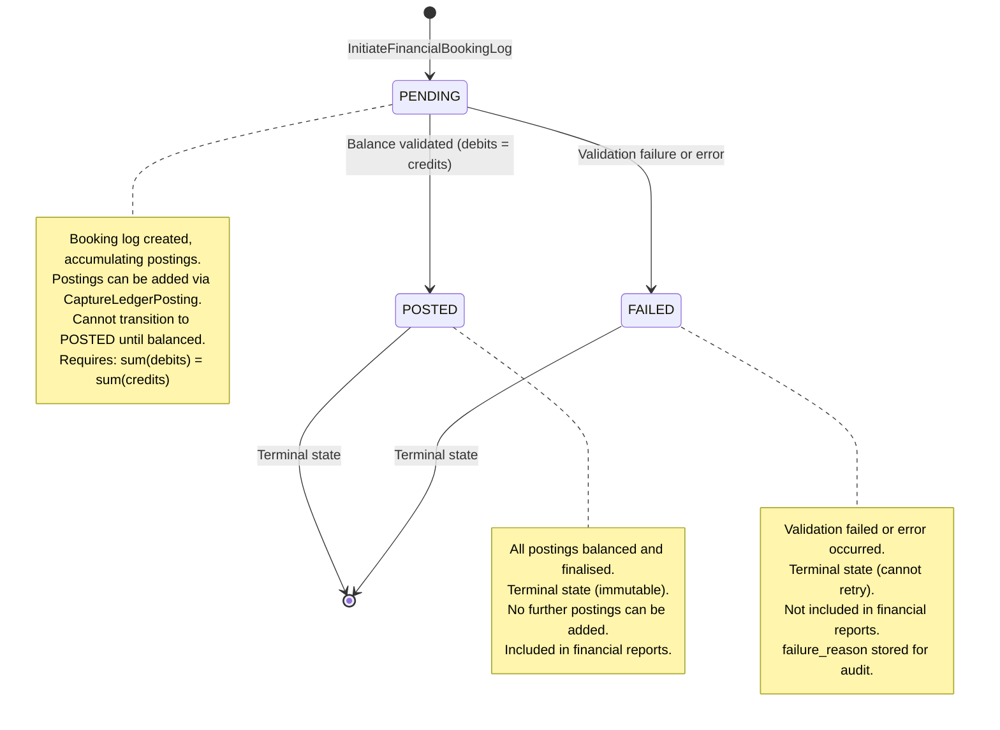
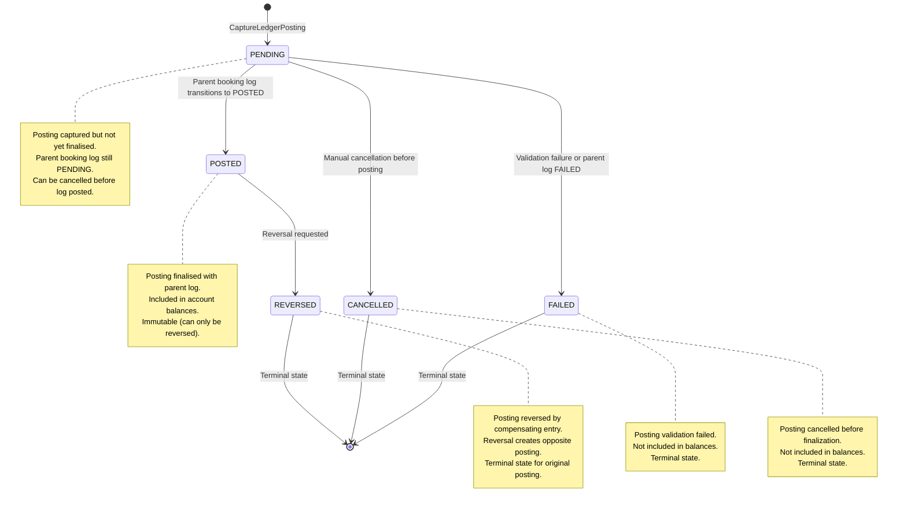

# FinancialAccounting Service Behavioral API Contract

**Document Version:** 1.0
**Last Updated:** 2025-11-19
**Status:** Active
**BIAN Domain:** Financial Accounting (Service Domain)
**Proto Definition:** `api/proto/meridian/financial_accounting/v1/financial_accounting.proto`
**Event Subscriptions:** `api/proto/meridian/events/v1/deposit_event.proto`
**Event Publications:** `api/proto/meridian/events/v1/financial_accounting_events.proto`
**Related Documents:**

- [BIAN Service Boundaries](../bian-service-boundaries.md)
- [Service Coupling Analysis](../service-coupling-analysis.md)

## Overview

The FinancialAccounting service implements the BIAN Financial Accounting service domain, handling double-entry bookkeeping logic, managing financial booking logs, ledger postings, chart of accounts, and providing financial reporting data. This service ensures all financial transactions are properly balanced and recorded according to accounting standards.

**Key Responsibilities:**

- Double-entry bookkeeping validation (debits = credits)
- Financial booking log lifecycle management
- Ledger posting creation and updates
- Chart of accounts rule enforcement
- Financial reporting queries (trial balance, general ledger)
- Event-driven processing (deposit events from CurrentAccount)
- Posting completion event publishing

**Architectural Pattern:** Stable Provider Service (Instability I=0.00)

- Depends on: No other BIAN domain services (stable foundation)
- Dependents: CurrentAccount service (gRPC client)
- Event sources: CurrentAccount (deposit events via Kafka)
- Event consumers: Future services subscribing to posting events

## State Machine

The FinancialAccounting service manages two state machines: Booking Log Status and Posting Status.

### Booking Log Status State Machine



### Ledger Posting Status State Machine



## Double-Entry Invariants

The FinancialAccounting service enforces fundamental double-entry bookkeeping principles:

### Core Accounting Equation

```text
Assets = Liabilities + Equity
```

### Posting Balance Invariant

For every `FinancialBookingLog`, the following MUST hold before transitioning to POSTED:

```text
sum(postings WHERE posting_direction = DEBIT) = sum(postings WHERE posting_direction = CREDIT)
```

**Enforcement:**

- Validated at service layer before status transition
- Booking log cannot transition to POSTED if unbalanced
- Error returned: `FAILED_PRECONDITION` with balance details

### Posting Amount Invariant

All posting amounts MUST be positive (> 0):

```text
posting_amount.units > 0 || (posting_amount.units == 0 && posting_amount.nanos > 0)
```

**Rationale:**

- Negative amounts create ambiguity in double-entry accounting
- Direction (DEBIT vs CREDIT) indicates increase vs decrease
- Simplifies validation and reporting

### Currency Consistency Invariant

All postings within a booking log MUST use the same currency:

```text
All postings.posting_amount.currency_code = booking_log.base_currency
```

## API Operations

### InitiateFinancialBookingLog

Creates a new financial booking log to accumulate ledger postings.

**Proto Definition:**

```protobuf
rpc InitiateFinancialBookingLog(InitiateFinancialBookingLogRequest)
    returns (InitiateFinancialBookingLogResponse);

message InitiateFinancialBookingLogRequest {
  meridian.common.v1.AccountType financial_account_type = 1;  // Account type
  string product_service_reference = 2;       // Product/service ID
  string business_unit_reference = 3;         // Business unit ID
  string chart_of_accounts_rules = 4;         // Accounting rules
  meridian.common.v1.Currency base_currency = 5;  // Currency
  meridian.common.v1.IdempotencyKey idempotency_key = 6;  // Required
}

message InitiateFinancialBookingLogResponse {
  FinancialBookingLog financial_booking_log = 1;  // Created log
}
```

**Behavioral Semantics:**

This operation creates a new booking log to group related ledger postings. The log starts in PENDING status and accumulates postings until balanced, at which point it can transition to POSTED.

**Preconditions:**

- `financial_account_type` must be defined enum value (not UNSPECIFIED)
- Valid types: DEBIT, CREDIT, VOSTRO, NOSTRO, CURRENT, SAVINGS
- `product_service_reference` non-empty (1-255 chars)
- `business_unit_reference` non-empty (1-255 chars)
- `chart_of_accounts_rules` non-empty (min 1 char)
- `base_currency` must be defined Currency enum (not UNSPECIFIED)
- `idempotency_key` required and must be unique

**Postconditions:**

- New `FinancialBookingLog` created with unique ID
- Status initialized to TRANSACTION_STATUS_PENDING
- `created_at` and `updated_at` set to current timestamp
- Empty `postings` array (postings added via CaptureLedgerPosting)
- Idempotency key stored with 24-hour TTL

**Invariants:**

- Booking log ID is globally unique
- Account type, currency, business unit are immutable once set
- Status is always a defined enum value
- created_at <= updated_at
- Chart of accounts rules can be updated (mutable field)

**Error Handling:**

| Error Code | Condition | Response | Retry Strategy |
|------------|-----------|----------|----------------|
| `INVALID_ARGUMENT` | Missing required field | Details indicate field | Do not retry |
| `INVALID_ARGUMENT` | Unspecified enum value | Details request valid value | Do not retry |
| `ALREADY_EXISTS` | Duplicate idempotency_key | Returns cached response | Safe to treat as success |
| `INTERNAL` | Database failure | Stack trace in logs | Retry with exponential backoff |

**Idempotency:**

This operation is **fully idempotent** via the `idempotency_key` field:

- First request with key K: Creates log, stores key K → log mapping (24-hour TTL)
- Subsequent requests with key K: Return cached `FinancialBookingLog` from first request
- No duplicate logs created
- Safe to retry indefinitely with same key

**Concurrency:**

Log creation is atomic. Concurrent requests with different idempotency keys create separate logs. Concurrent requests with the same key return the same log.

**Examples:**

```json
// Successful creation
Request: {
  "financial_account_type": "ACCOUNT_TYPE_CURRENT",
  "product_service_reference": "PROD-CHECKING-001",
  "business_unit_reference": "BU-RETAIL",
  "chart_of_accounts_rules": "UK-GAAP-2025",
  "base_currency": "CURRENCY_GBP",
  "idempotency_key": {
    "key": "booking-log-idem-001",
    "ttl_seconds": 86400
  }
}

Response: {
  "financial_booking_log": {
    "id": "booking-ee0e8400-e29b-41d4-a716-446655440008",
    "financial_account_type": "ACCOUNT_TYPE_CURRENT",
    "product_service_reference": "PROD-CHECKING-001",
    "business_unit_reference": "BU-RETAIL",
    "chart_of_accounts_rules": "UK-GAAP-2025",
    "base_currency": "CURRENCY_GBP",
    "status": "TRANSACTION_STATUS_PENDING",
    "created_at": "2025-11-19T13:00:00Z",
    "updated_at": "2025-11-19T13:00:00Z",
    "postings": []  // Empty initially
  }
}
```

---

### UpdateFinancialBookingLog

Updates an existing booking log (status or chart of accounts rules).

**Proto Definition:**

```protobuf
rpc UpdateFinancialBookingLog(UpdateFinancialBookingLogRequest)
    returns (UpdateFinancialBookingLogResponse);

message UpdateFinancialBookingLogRequest {
  string id = 1;                                  // Booking log ID
  meridian.common.v1.TransactionStatus status = 2;  // New status
  string chart_of_accounts_rules = 3;             // Updated rules (optional)
}

message UpdateFinancialBookingLogResponse {
  FinancialBookingLog financial_booking_log = 1;  // Updated log
}
```

**Behavioral Semantics:**

This operation updates the status or chart of accounts rules of an existing booking log. Only these fields are mutable; other fields (account type, currency, business unit) are immutable.

**Preconditions:**

- `id` must be non-empty (1-255 chars) of an existing log
- `status` must be defined enum value (not UNSPECIFIED)
- If transitioning to POSTED:
  - All postings must be balanced: sum(debits) = sum(credits)
  - At least one posting must exist
- If `chart_of_accounts_rules` provided (non-empty), updates rules
- If `chart_of_accounts_rules` empty, preserves existing rules

**Postconditions:**

- Log status updated to requested value (if valid transition)
- If `chart_of_accounts_rules` provided, updated in log
- `updated_at` set to current timestamp
- If transitioning to POSTED, all child postings also transition to POSTED

**Invariants:**

- Immutable fields (account_type, base_currency, business_unit_reference) never change
- POSTED and FAILED are terminal states (no further transitions)
- Status transitions follow state machine rules
- Balance validation occurs before POSTED transition

**Error Handling:**

| Error Code | Condition | Response | Retry Strategy |
|------------|-----------|----------|----------------|
| `NOT_FOUND` | Booking log does not exist | Details include ID | Do not retry |
| `INVALID_ARGUMENT` | Invalid status enum | Details explain valid values | Do not retry |
| `FAILED_PRECONDITION` | Unbalanced postings for POSTED | Details show debit/credit sums | Add postings, retry |
| `FAILED_PRECONDITION` | No postings for POSTED | Details request postings | Add postings, retry |
| `FAILED_PRECONDITION` | Invalid status transition | Details show current status | Do not retry |
| `INTERNAL` | Database failure | Stack trace in logs | Retry with backoff |

**Status Transition Validation:**

Allowed transitions:

- PENDING → POSTED (if balanced)
- PENDING → FAILED (on error)
- Any status → FAILED (emergency failure)

Rejected transitions:

- POSTED → PENDING (cannot un-post)
- POSTED → CANCELLED (use reversal instead)
- FAILED → POSTED (terminal state)
- CANCELLED → any (terminal state)

**Balance Validation (POSTED Transition):**

Server validates:

1. At least one posting exists
2. Sum of DEBIT postings = Sum of CREDIT postings
3. Currency consistency across all postings

Validation algorithm:

```text
debit_sum = sum(p.posting_amount WHERE p.posting_direction = DEBIT)
credit_sum = sum(p.posting_amount WHERE p.posting_direction = CREDIT)

if debit_sum != credit_sum:
  return FAILED_PRECONDITION("Unbalanced: debits={debit_sum}, credits={credit_sum}")

if len(postings) == 0:
  return FAILED_PRECONDITION("Cannot post empty booking log")
```

**Concurrency:**

Updates are serialized at the database level. Concurrent updates to the same log are queued. Consider using optimistic locking (version field) in future enhancement.

**Examples:**

```json
// Transition to POSTED (success - balanced)
Request: {
  "id": "booking-ee0e8400-e29b-41d4-a716-446655440008",
  "status": "TRANSACTION_STATUS_POSTED"
}

// Assume log has:
// - Posting 1: DEBIT £100
// - Posting 2: CREDIT £100
// = Balanced

Response: {
  "financial_booking_log": {
    "id": "booking-ee0e8400-e29b-41d4-a716-446655440008",
    "status": "TRANSACTION_STATUS_POSTED",  // Updated
    "updated_at": "2025-11-19T13:15:00Z",
    "postings": [
      {
        "id": "posting-001",
        "posting_direction": "POSTING_DIRECTION_DEBIT",
        "posting_amount": { "currency_code": "GBP", "units": 100 },
        "status": "TRANSACTION_STATUS_POSTED"  // Also updated
      },
      {
        "id": "posting-002",
        "posting_direction": "POSTING_DIRECTION_CREDIT",
        "posting_amount": { "currency_code": "GBP", "units": 100 },
        "status": "TRANSACTION_STATUS_POSTED"  // Also updated
      }
    ]
  }
}

// Transition to POSTED (failure - unbalanced)
Request: {
  "id": "booking-unbalanced",
  "status": "TRANSACTION_STATUS_POSTED"
}

// Log has:
// - Posting 1: DEBIT £100
// - Posting 2: CREDIT £50
// = Unbalanced (debits > credits by £50)

Response: {
  "code": "FAILED_PRECONDITION",
  "message": "Cannot post unbalanced booking log",
  "details": [
    {
      "booking_log_id": "booking-unbalanced",
      "debit_sum": { "currency_code": "GBP", "units": 100 },
      "credit_sum": { "currency_code": "GBP", "units": 50 },
      "difference": { "currency_code": "GBP", "units": 50 },
      "required": "sum(debits) must equal sum(credits)"
    }
  ]
}

// Update chart of accounts rules
Request: {
  "id": "booking-ee0e8400-e29b-41d4-a716-446655440008",
  "status": "TRANSACTION_STATUS_PENDING",  // Keep current status
  "chart_of_accounts_rules": "UK-GAAP-2025-AMENDED"
}

Response: {
  "financial_booking_log": {
    "id": "booking-ee0e8400-e29b-41d4-a716-446655440008",
    "chart_of_accounts_rules": "UK-GAAP-2025-AMENDED",  // Updated
    "updated_at": "2025-11-19T13:20:00Z"
  }
}
```

---

### RetrieveFinancialBookingLog

Retrieves a specific financial booking log by ID.

**Proto Definition:**

```protobuf
rpc RetrieveFinancialBookingLog(RetrieveFinancialBookingLogRequest)
    returns (RetrieveFinancialBookingLogResponse);

message RetrieveFinancialBookingLogRequest {
  string id = 1;  // Booking log ID
}

message RetrieveFinancialBookingLogResponse {
  FinancialBookingLog financial_booking_log = 1;  // Complete log
}
```

**Behavioral Semantics:**

This operation retrieves a complete booking log including all ledger postings. The operation is read-only and never modifies state.

**Preconditions:**

- `id` must be non-empty (1-255 chars)
- Booking log must exist

**Postconditions:**

- Returns complete `FinancialBookingLog` with current state
- All postings included in `postings` array
- No state changes (read-only)

**Invariants:**

- Read operation never modifies log
- Postings sorted by created_at ASC
- Balance calculation: sum(debits) vs sum(credits)

**Error Handling:**

| Error Code | Condition | Response | Retry Strategy |
|------------|-----------|----------|----------------|
| `NOT_FOUND` | Booking log does not exist | Details include ID | Do not retry |
| `INVALID_ARGUMENT` | Empty ID | Details request non-empty | Do not retry |
| `INTERNAL` | Database failure | Stack trace in logs | Retry with backoff |

**Idempotency:**

Fully idempotent. Multiple calls return current state at time of each call. No side effects.

**Concurrency:**

Read operations use snapshot isolation. Concurrent writes may result in different states across multiple reads.

**Performance Considerations:**

- Small logs (< 10 postings): < 10ms
- Medium logs (10-100 postings): 10ms - 50ms
- Large logs (100-1,000 postings): 50ms - 500ms
- For logs with many postings, consider using ListLedgerPostings with pagination

---

### ListFinancialBookingLogs

Lists financial booking logs with filtering and pagination.

**Proto Definition:**

```protobuf
rpc ListFinancialBookingLogs(ListFinancialBookingLogsRequest)
    returns (ListFinancialBookingLogsResponse);

message ListFinancialBookingLogsRequest {
  meridian.common.v1.Pagination pagination = 1;  // Page size & token
  meridian.common.v1.TransactionStatus status = 2;  // Filter by status
  string business_unit_reference = 3;            // Filter by business unit
}

message ListFinancialBookingLogsResponse {
  repeated FinancialBookingLog financial_booking_logs = 1;  // Matching logs
  meridian.common.v1.PaginationResponse pagination = 2;     // Next page token
}
```

**Behavioral Semantics:**

This operation queries booking logs with optional filters and returns paginated results. Designed for financial reporting and reconciliation.

**Preconditions:**

- If `pagination` provided, page_size 1-1,000 (default 50, max 1,000)
- If `status` provided, must be defined enum value
- If `business_unit_reference` provided, non-empty

**Postconditions:**

- Returns logs matching all provided filters (AND logic)
- Results sorted by created_at DESC (most recent first)
- Default page size: 50, max: 1,000
- `pagination.next_page_token` present if more results
- `pagination.total_count` = -1 (unknown, for performance)

**Invariants:**

- Results sorted by created_at DESC
- Page size never exceeds 1,000
- Pagination tokens time-limited (1 hour)

**Error Handling:**

| Error Code | Condition | Response | Retry Strategy |
|------------|-----------|----------|----------------|
| `INVALID_ARGUMENT` | page_size > 1,000 | Details show max | Reduce page size |
| `INVALID_ARGUMENT` | Invalid page_token | Details suggest restart | Restart from page 1 |
| `DEADLINE_EXCEEDED` | Query timeout | Timeout duration | Add filters, retry |

**Idempotency:**

Fully idempotent. No side effects.

**Performance:**

- Filtered queries (status, business_unit): Fast index lookup
- Unfiltered queries: Full table scan (avoid in production)

---

### CaptureLedgerPosting

Creates a new ledger posting within a booking log.

**Proto Definition:**

```protobuf
rpc CaptureLedgerPosting(CaptureLedgerPostingRequest)
    returns (CaptureLedgerPostingResponse);

message CaptureLedgerPostingRequest {
  string financial_booking_log_id = 1;        // Parent log ID
  meridian.common.v1.PostingDirection posting_direction = 2;  // DEBIT or CREDIT
  google.type.Money posting_amount = 3;       // Amount (must be positive)
  string account_id = 4;                      // Target account
  google.protobuf.Timestamp value_date = 5;   // Effective date
  meridian.common.v1.IdempotencyKey idempotency_key = 6;  // Required
}

message CaptureLedgerPostingResponse {
  LedgerPosting ledger_posting = 1;           // Created posting
}
```

**Behavioral Semantics:**

This operation creates a new ledger posting within an existing booking log. Postings are created individually (not as balanced pairs) and validated at the service layer when the booking log transitions to POSTED.

**Preconditions:**

- `financial_booking_log_id` must be non-empty (1-255 chars) of existing log
- Parent log must be in PENDING status (cannot add to POSTED logs)
- `posting_direction` must be DEBIT or CREDIT (not UNSPECIFIED)
- `posting_amount` must be positive: `units > 0 || (units == 0 && nanos > 0)`
- `posting_amount.currency_code` must match parent log's base_currency
- `account_id` must be non-empty (1-255 chars, alphanumeric with hyphens/underscores)
- `value_date` must be present
- `idempotency_key` required

**Postconditions:**

- New `LedgerPosting` created with unique ID
- Posting added to parent log's `postings` array
- Posting status initialized to PENDING
- `created_at` set to current timestamp
- Idempotency key stored with 24-hour TTL

**Invariants:**

- Posting ID is globally unique
- Posting amount always positive
- Direction always DEBIT or CREDIT
- Currency matches parent log
- Amount, direction, account_id immutable once created
- Only status and posting_result can be updated

**Error Handling:**

| Error Code | Condition | Response | Retry Strategy |
|------------|-----------|----------|----------------|
| `NOT_FOUND` | Booking log does not exist | Details include log ID | Do not retry |
| `FAILED_PRECONDITION` | Parent log not PENDING | Details show current status | Cannot add to POSTED log |
| `INVALID_ARGUMENT` | Zero or negative amount | Details explain positive requirement | Fix amount, retry |
| `INVALID_ARGUMENT` | Currency mismatch | Details show log currency | Fix currency, retry |
| `INVALID_ARGUMENT` | Unspecified direction | Details request DEBIT or CREDIT | Fix direction, retry |
| `ALREADY_EXISTS` | Duplicate idempotency_key | Returns cached posting | Safe to treat as success |
| `INTERNAL` | Database failure | Stack trace in logs | Retry with backoff |

**Idempotency:**

This operation is **fully idempotent** via the `idempotency_key` field:

- First request with key K: Creates posting, stores key K → posting mapping
- Subsequent requests with key K: Return cached `LedgerPosting`
- No duplicate postings created
- Safe to retry indefinitely

**Concurrency:**

Posting creation is atomic. Multiple postings can be created concurrently for the same booking log. Balance validation occurs later during UpdateFinancialBookingLog (transition to POSTED).

**Posting Direction Semantics:**

**DEBIT Posting:**

- Increases asset accounts (e.g., Cash, Accounts Receivable)
- Decreases liability accounts (e.g., Accounts Payable)
- Decreases equity accounts (e.g., Revenue)

**CREDIT Posting:**

- Decreases asset accounts
- Increases liability accounts (e.g., Customer Deposits)
- Increases equity accounts (e.g., Revenue, Capital)

**Examples:**

```json
// Capture debit posting (asset increase)
Request: {
  "financial_booking_log_id": "booking-ee0e8400-e29b-41d4-a716-446655440008",
  "posting_direction": "POSTING_DIRECTION_DEBIT",
  "posting_amount": {
    "currency_code": "GBP",
    "units": 100,
    "nanos": 0
  },
  "account_id": "CASH-GBP-001",
  "value_date": "2025-11-19T13:00:00Z",
  "idempotency_key": {
    "key": "posting-debit-001"
  }
}

Response: {
  "ledger_posting": {
    "id": "posting-ff0e8400-e29b-41d4-a716-446655440009",
    "financial_booking_log_id": "booking-ee0e8400-e29b-41d4-a716-446655440008",
    "posting_direction": "POSTING_DIRECTION_DEBIT",
    "posting_amount": {
      "currency_code": "GBP",
      "units": 100,
      "nanos": 0
    },
    "account_id": "CASH-GBP-001",
    "value_date": "2025-11-19T13:00:00Z",
    "posting_result": "",
    "created_at": "2025-11-19T13:05:00Z",
    "status": "TRANSACTION_STATUS_PENDING"
  }
}

// Capture credit posting (liability increase)
Request: {
  "financial_booking_log_id": "booking-ee0e8400-e29b-41d4-a716-446655440008",
  "posting_direction": "POSTING_DIRECTION_CREDIT",
  "posting_amount": {
    "currency_code": "GBP",
    "units": 100,
    "nanos": 0
  },
  "account_id": "CUSTOMER-DEPOSITS-001",
  "value_date": "2025-11-19T13:00:00Z",
  "idempotency_key": {
    "key": "posting-credit-001"
  }
}

Response: {
  "ledger_posting": {
    "id": "posting-gg0e8400-e29b-41d4-a716-446655440010",
    "financial_booking_log_id": "booking-ee0e8400-e29b-41d4-a716-446655440008",
    "posting_direction": "POSTING_DIRECTION_CREDIT",
    "posting_amount": {
      "currency_code": "GBP",
      "units": 100,
      "nanos": 0
    },
    "account_id": "CUSTOMER-DEPOSITS-001",
    "value_date": "2025-11-19T13:00:00Z",
    "posting_result": "",
    "created_at": "2025-11-19T13:05:01Z",
    "status": "TRANSACTION_STATUS_PENDING"
  }
}

// Now booking log is balanced:
// Debits: £100 (CASH)
// Credits: £100 (CUSTOMER-DEPOSITS)
// Can transition to POSTED

// Currency mismatch error
Request: {
  "financial_booking_log_id": "booking-ee0e8400-e29b-41d4-a716-446655440008",
  "posting_direction": "POSTING_DIRECTION_DEBIT",
  "posting_amount": {
    "currency_code": "USD",  // Log is GBP
    "units": 100
  },
  "account_id": "CASH-USD-001",
  "value_date": "2025-11-19T13:00:00Z",
  "idempotency_key": { "key": "posting-currency-mismatch" }
}

Response: {
  "code": "INVALID_ARGUMENT",
  "message": "Posting currency must match booking log base currency",
  "details": [
    {
      "booking_log_id": "booking-ee0e8400-e29b-41d4-a716-446655440008",
      "log_currency": "GBP",
      "posting_currency": "USD"
    }
  ]
}
```

---

### UpdateLedgerPosting

Updates an existing ledger posting (status or posting result only).

**Proto Definition:**

```protobuf
rpc UpdateLedgerPosting(UpdateLedgerPostingRequest)
    returns (UpdateLedgerPostingResponse);

message UpdateLedgerPostingRequest {
  string id = 1;                                  // Posting ID
  meridian.common.v1.TransactionStatus status = 2;  // New status
  string posting_result = 3;                      // Result description (optional)
}

message UpdateLedgerPostingResponse {
  LedgerPosting ledger_posting = 1;               // Updated posting
}
```

**Behavioral Semantics:**

This operation updates the status or posting result of an existing posting. Amount, direction, and account_id are immutable once created.

**Preconditions:**

- `id` must be non-empty (1-255 chars) of existing posting
- `status` must be defined enum value
- `posting_result` max 1,000 chars (if provided)
- Status transitions must follow posting state machine

**Postconditions:**

- Posting status updated to requested value (if valid transition)
- If `posting_result` provided, updated in posting
- If `posting_result` empty, preserves existing result

**Invariants:**

- Immutable fields (amount, direction, account_id) never change
- POSTED and FAILED are terminal states
- Status transitions follow state machine

**Error Handling:**

| Error Code | Condition | Response | Retry Strategy |
|------------|-----------|----------|----------------|
| `NOT_FOUND` | Posting does not exist | Details include ID | Do not retry |
| `INVALID_ARGUMENT` | Invalid status enum | Details explain valid values | Do not retry |
| `FAILED_PRECONDITION` | Invalid status transition | Details show current status | Do not retry |
| `INVALID_ARGUMENT` | posting_result > 1,000 chars | Details show max length | Truncate, retry |

**Idempotency:**

Not currently idempotent. Future enhancement: Add idempotency_key to request.

**Concurrency:**

Updates are serialized at the database level.

---

### RetrieveLedgerPosting

Retrieves a specific ledger posting by ID.

**Proto Definition:**

```protobuf
rpc RetrieveLedgerPosting(RetrieveLedgerPostingRequest)
    returns (RetrieveLedgerPostingResponse);

message RetrieveLedgerPostingRequest {
  string id = 1;  // Posting ID
}

message RetrieveLedgerPostingResponse {
  LedgerPosting ledger_posting = 1;  // Complete posting
}
```

**Behavioral Semantics:**

This operation retrieves a specific posting. Read-only, no state changes.

**Error Handling:**

| Error Code | Condition | Response |
|------------|-----------|----------|
| `NOT_FOUND` | Posting does not exist | Details include ID |

**Idempotency:**

Fully idempotent. No side effects.

---

### ListLedgerPostings

Lists ledger postings with comprehensive filtering and pagination.

**Proto Definition:**

```protobuf
rpc ListLedgerPostings(ListLedgerPostingsRequest)
    returns (ListLedgerPostingsResponse);

message ListLedgerPostingsRequest {
  meridian.common.v1.Pagination pagination = 1;  // Page size & token
  string financial_booking_log_id = 2;           // Filter by parent log
  string account_id = 3;                         // Filter by account
  meridian.common.v1.PostingDirection posting_direction = 4;  // Filter by direction
  google.protobuf.Timestamp value_date_from = 5; // Filter by date range (from)
  google.protobuf.Timestamp value_date_to = 6;   // Filter by date range (to)
  string currency = 7;                           // Filter by currency (ISO code)
  meridian.common.v1.TransactionStatus status = 8;  // Filter by status
}

message ListLedgerPostingsResponse {
  repeated LedgerPosting ledger_postings = 1;    // Matching postings
  meridian.common.v1.PaginationResponse pagination = 2;  // Next page token
}
```

**Behavioral Semantics:**

This operation queries postings with multiple filter options for financial reporting (trial balance, general ledger, account statements).

**Preconditions:**

- If `pagination` provided, page_size 1-1,000 (default 50, max 1,000)
- If `financial_booking_log_id` provided, max 255 chars
- If `account_id` provided, alphanumeric with hyphens/underscores, max 255 chars
- If `currency` provided, 3-letter ISO code (e.g., "GBP", "USD")
- All filters are optional (AND logic if multiple provided)

**Postconditions:**

- Returns postings matching all provided filters
- Results sorted by value_date DESC, then created_at DESC
- Default page size: 50, max: 1,000
- `pagination.next_page_token` present if more results

**Invariants:**

- Results sorted by value_date DESC
- Page size never exceeds 1,000
- Pagination tokens time-limited (1 hour)

**Error Handling:**

| Error Code | Condition | Response | Retry Strategy |
|------------|-----------|----------|----------------|
| `INVALID_ARGUMENT` | Invalid currency code | Details show expected format | Fix currency, retry |
| `INVALID_ARGUMENT` | page_size > 1,000 | Details show max | Reduce page size |
| `INVALID_ARGUMENT` | Invalid page_token | Details suggest restart | Restart from page 1 |
| `DEADLINE_EXCEEDED` | Query timeout | Timeout duration | Add more filters, retry |

**Idempotency:**

Fully idempotent. No side effects.

**Use Cases:**

1. **Trial Balance**: List all postings with status=POSTED, group by account_id, sum debits/credits
2. **General Ledger**: List postings for specific account_id, filter by date range
3. **Booking Log Details**: List postings for specific financial_booking_log_id
4. **Currency Report**: List postings for specific currency
5. **Debit/Credit Analysis**: Filter by posting_direction

**Performance:**

- Filtered queries (booking_log_id, account_id): Fast index lookup
- Date range queries: Sequential scan (slower for large ranges)
- Unfiltered queries: Full table scan (avoid in production)

**Examples:**

```json
// Trial balance query (all posted postings)
Request: {
  "status": "TRANSACTION_STATUS_POSTED",
  "pagination": {
    "page_size": 1000
  }
}

Response: {
  "ledger_postings": [
    {
      "id": "posting-001",
      "account_id": "CASH-GBP-001",
      "posting_direction": "POSTING_DIRECTION_DEBIT",
      "posting_amount": { "currency_code": "GBP", "units": 1000 },
      "status": "TRANSACTION_STATUS_POSTED"
    },
    {
      "id": "posting-002",
      "account_id": "CUSTOMER-DEPOSITS-001",
      "posting_direction": "POSTING_DIRECTION_CREDIT",
      "posting_amount": { "currency_code": "GBP", "units": 1000 },
      "status": "TRANSACTION_STATUS_POSTED"
    },
    // ... more postings
  ],
  "pagination": {
    "next_page_token": "opaque-cursor-xyz789",
    "total_count": -1
  }
}

// Account statement query (specific account, date range)
Request: {
  "account_id": "CASH-GBP-001",
  "value_date_from": "2025-11-01T00:00:00Z",
  "value_date_to": "2025-11-19T23:59:59Z",
  "status": "TRANSACTION_STATUS_POSTED",
  "pagination": {
    "page_size": 100
  }
}

Response: {
  "ledger_postings": [
    // All postings for CASH-GBP-001 in November 2025
  ],
  "pagination": { /* ... */ }
}

// Currency-specific report
Request: {
  "currency": "GBP",
  "status": "TRANSACTION_STATUS_POSTED",
  "pagination": {
    "page_size": 500
  }
}

Response: {
  "ledger_postings": [
    // All posted GBP postings
  ],
  "pagination": { /* ... */ }
}
```

---

## Service-Level Invariants

These invariants MUST hold at all times across all operations:

### Booking Log Invariants

1. **ID Uniqueness**: Each booking log ID is globally unique
2. **Status Validity**: Status is always a defined enum value (not UNSPECIFIED)
3. **Terminal States**: POSTED and FAILED are terminal (no further transitions)
4. **Balance Before Posted**: Log cannot transition to POSTED if unbalanced
5. **Immutable Core Fields**: account_type, base_currency, business_unit_reference immutable
6. **Timestamp Ordering**: created_at <= updated_at
7. **Non-Empty Postings**: Log can only transition to POSTED if postings.length > 0

### Posting Invariants

1. **ID Uniqueness**: Each posting ID is globally unique
2. **Positive Amounts**: All posting_amount values > 0
3. **Direction Validity**: Direction is DEBIT or CREDIT (not UNSPECIFIED)
4. **Currency Consistency**: All postings in a log have same currency as log.base_currency
5. **Immutable Core Fields**: amount, direction, account_id immutable once created
6. **Status Validity**: Status is always a defined enum value
7. **Parent Reference**: financial_booking_log_id always references existing log

### Double-Entry Invariants

1. **Balance Equation**: For POSTED logs: sum(DEBIT postings) = sum(CREDIT postings)
2. **Currency Matching**: All postings in a log use same currency
3. **No Mixed Currencies**: Cannot have GBP and USD postings in same log
4. **Accounting Equation**: Assets (debits) = Liabilities + Equity (credits) globally

### Temporal Invariants

1. **Value Date Ordering**: Postings can have value_date in past, present, or future
2. **Created Timestamp**: All entities have non-null created_at
3. **Updated Timestamp**: All entities have non-null updated_at

## Concurrency Control

### Transaction Isolation

All operations use database-level transaction isolation:

- **Booking log creation**: SERIALIZABLE isolation
- **Posting creation**: SERIALIZABLE isolation
- **Status updates**: SERIALIZABLE isolation
- **Balance validation**: SERIALIZABLE isolation (prevents race conditions)

### Optimistic Locking (Future Enhancement)

Currently not implemented. Future enhancement will add version field to FinancialBookingLog for optimistic locking similar to PositionKeeping.

### Distributed Locking (Future Enhancement)

For high-concurrency scenarios, consider distributed locks on booking_log_id during balance validation.

## Compensation Patterns

The FinancialAccounting service supports saga compensation for failed operations.

### Posting Cancellation

**Scenario**: Booking log created with postings, but upstream service fails before posting.

**Compensation:**

1. Update booking log status to FAILED
2. Update all child posting statuses to CANCELLED
3. Log failure reason in audit trail
4. Postings excluded from balance calculations

**Idempotent**: Cancellation operations are idempotent (can be called multiple times safely).

### Posting Reversal

**Scenario**: Posted transaction needs to be reversed (e.g., payment dispute).

**Compensation:**

1. Create new booking log for reversal
2. Create opposite postings (DEBIT ↔ CREDIT swap)
3. Same accounts, same amounts, opposite directions
4. Mark original postings as REVERSED
5. Post reversal log (balanced automatically)

**Example:**

Original transaction:

- Debit: CASH-GBP £100
- Credit: CUSTOMER-DEPOSITS £100

Reversal transaction:

- Debit: CUSTOMER-DEPOSITS £100
- Credit: CASH-GBP £100

**Net Effect**: Original transaction reversed, balances restored.

## Event-Driven Processing

The FinancialAccounting service consumes and publishes events.

### Event Consumption (Kafka)

**Deposit Events** from CurrentAccount service:

```protobuf
// api/proto/meridian/events/v1/deposit_event.proto
message DepositEvent {
  string account_id = 1;
  MoneyAmount amount = 2;
  string transaction_id = 3;
  google.protobuf.Timestamp timestamp = 4;
}
```

**Consumer Implementation**: `internal/financial-accounting/adapters/messaging/deposit_consumer.go`

**Processing Logic:**

1. Receive DepositEvent from Kafka topic
2. Create FinancialBookingLog for deposit
3. Create two postings:
   - DEBIT: CASH account (asset increase)
   - CREDIT: CUSTOMER-DEPOSITS account (liability increase)
4. Transition booking log to POSTED (automatically balanced)
5. Publish PostingCompleteEvent (see below)

**Error Handling:**

- Invalid event schema: Log error, send to dead letter queue
- Duplicate event (idempotency): Detect via transaction_id, return cached result
- Downstream failure: Retry with exponential backoff (max 3 attempts), then DLQ

**Concurrency**: Multiple consumers process events in parallel (Kafka consumer group).

### Event Publishing (Kafka)

**Posting Complete Events** for downstream consumers:

```protobuf
// api/proto/meridian/events/v1/financial_accounting_events.proto
message PostingCompleteEvent {
  string booking_log_id = 1;
  repeated LedgerPosting postings = 2;
  google.protobuf.Timestamp posted_at = 3;
}
```

**Publisher Implementation**: `internal/financial-accounting/adapters/messaging/accounting_event_publisher.go` (9 usages detected)

**Publishing Triggers:**

- Booking log transitions to POSTED
- All child postings transitioned to POSTED
- Event contains complete posting details

**Event Guarantees:**

- **At-least-once delivery**: Events may be delivered multiple times
- **Ordering**: Events for same booking_log_id maintain order
- **Schema evolution**: Backward-compatible schema changes only (ADR-0004)

## Chart of Accounts

The FinancialAccounting service enforces chart of accounts rules.

### Chart of Accounts Rules

Stored in `FinancialBookingLog.chart_of_accounts_rules` field as a string identifier (e.g., "UK-GAAP-2025").

**Purpose:**

- Define valid account codes
- Specify posting rules
- Enforce account hierarchy
- Support multi-dimensional accounting (cost centers, departments, projects)

### Account Code Validation

Server validates that all `posting.account_id` values are valid according to the chart of accounts rules:

**Validation Logic:**

1. Parse `chart_of_accounts_rules` to retrieve rule set
2. For each posting, validate `account_id` against rule set
3. Reject posting if account_id is invalid
4. Return `INVALID_ARGUMENT` error with details

**Example Account Codes:**

- `CASH-GBP-001`: Cash account in GBP
- `CUSTOMER-DEPOSITS-001`: Customer deposit liability
- `REVENUE-INTEREST-001`: Interest revenue
- `EXPENSE-OPERATIONS-001`: Operational expenses

### Multi-Dimensional Chart of Accounts

Future enhancement: Support multi-dimensional account codes:

- `CASH-GBP-LONDON-RETAIL`: Cash (currency) - (location) - (business unit)
- Enables detailed financial reporting
- Supports cost center accounting
- Facilitates management reporting

## Financial Reporting

The FinancialAccounting service provides data for standard financial reports.

### Trial Balance

Lists all accounts with debit and credit balances.

**Query:**

```text
ListLedgerPostings(status=POSTED)
  → Group by account_id
  → Sum(amount WHERE direction=DEBIT)
  → Sum(amount WHERE direction=CREDIT)
  → Display accounts with non-zero balance
```

**Invariant Validation:**

```text
Sum(all debit balances) = Sum(all credit balances)
```

If this invariant fails, indicates data corruption or unbalanced postings.

### General Ledger

Detailed transaction history for a specific account.

**Query:**

```text
ListLedgerPostings(
  account_id="CASH-GBP-001",
  status=POSTED,
  value_date_from="2025-11-01",
  value_date_to="2025-11-30"
)
  → Order by value_date DESC
  → Display: date, description, debit, credit, running balance
```

### Balance Sheet

Assets = Liabilities + Equity

**Query:**

```text
Asset accounts: Sum(DEBIT) - Sum(CREDIT)
Liability accounts: Sum(CREDIT) - Sum(DEBIT)
Equity accounts: Sum(CREDIT) - Sum(DEBIT)

Invariant: Assets = Liabilities + Equity
```

### Income Statement (Profit & Loss)

Revenue - Expenses = Net Income

**Query:**

```text
Revenue accounts: Sum(CREDIT) - Sum(DEBIT) for period
Expense accounts: Sum(DEBIT) - Sum(CREDIT) for period

Net Income = Revenue - Expenses
```

## Future Enhancements

### Planned Features

1. **Batch Posting API**: Create multiple postings in single atomic request
2. **Posting Templates**: Predefined posting patterns for common transactions
3. **Account Hierarchy**: Support for account parent-child relationships
4. **Multi-Currency Support**: Postings in different currencies with conversion rates
5. **Posting Reversal API**: Dedicated RPC for creating reversal postings
6. **Audit Trail**: Comprehensive audit trail for all booking log and posting changes
7. **Reconciliation API**: Automated reconciliation between postings and external data
8. **Budget Tracking**: Compare actual postings against budget allocations
9. **Cost Center Accounting**: Multi-dimensional account codes with cost centers
10. **Accrual Accounting**: Support for accrued revenue/expenses

### Experimental Features

1. **Real-Time Balance API**: Streaming balance updates via gRPC server-streaming
2. **Blockchain Audit Trail**: Immutable blockchain-based audit trail for postings
3. **AI-Powered Anomaly Detection**: Machine learning for detecting unusual posting patterns

## Related Documentation

- **Proto Schema**: `api/proto/meridian/financial_accounting/v1/financial_accounting.proto`
- **Event Schema (Subscriptions)**: `api/proto/meridian/events/v1/deposit_event.proto`
- **Event Schema (Publications)**: `api/proto/meridian/events/v1/financial_accounting_events.proto`
- **Service Boundaries**: `docs/architecture/bian-service-boundaries.md`
- **Coupling Analysis**: `docs/architecture/service-coupling-analysis.md`
- **Current Account Contract**: `docs/architecture/api-contracts/current-account-contract.md`
- **Position Keeping Contract**: `docs/architecture/api-contracts/position-keeping-contract.md`
- **ADR-0002**: Microservices Per BIAN Domain
- **ADR-0004**: Event Schema Evolution
- **ADR-0005**: Adapter Pattern Layer Translation
- **BIAN Reference**: Financial Accounting Service Domain (Release 13.0)
