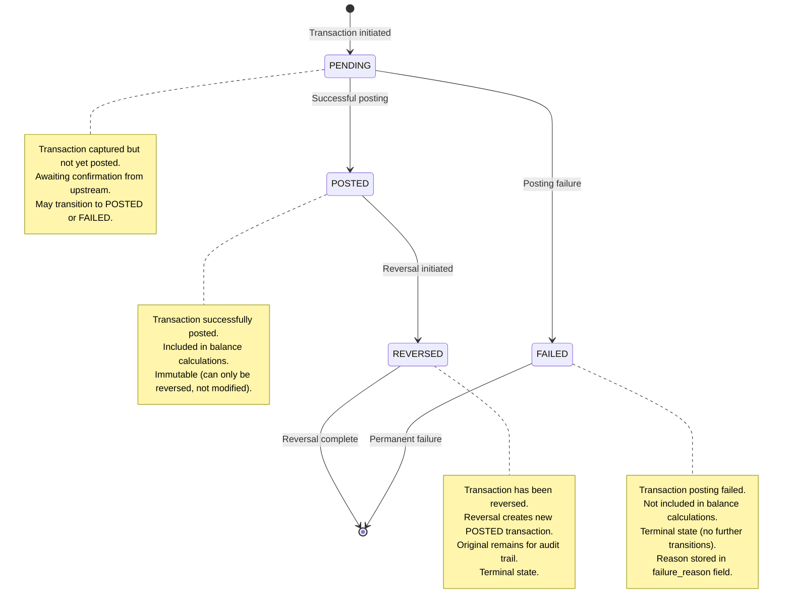
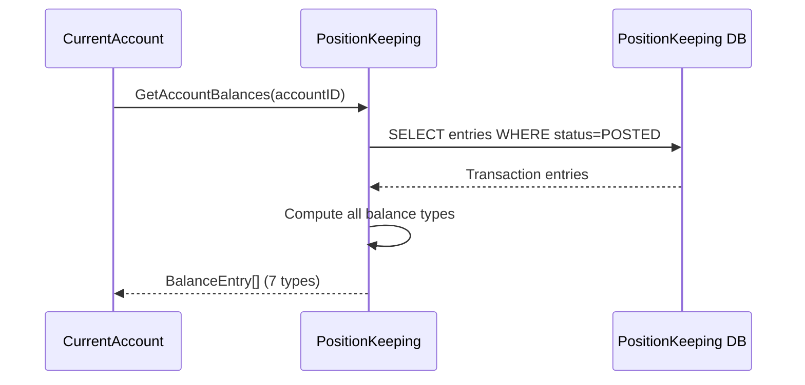

# PositionKeeping Service Behavioral API Contract

**Document Version:** 1.1
**Last Updated:** 2026-01-08
**Status:** Active
**BIAN Domain:** Position Keeping (Service Domain)
**Proto Definition:** `api/proto/meridian/position_keeping/v1/position_keeping.proto`
**Event Schema:** `api/proto/meridian/events/v1/position_keeping_events.proto`
**Related Documents:**

- [BIAN Service Boundaries](../bian-service-boundaries.md)
- [Service Coupling Analysis](../service-coupling-analysis.md)
- [ADR-0023: Balance Delegation to Position Keeping](../adr/0023-balance-delegation-to-position-keeping.md)

## Overview

The PositionKeeping service implements the BIAN Position Keeping service domain, maintaining real-time financial position tracking through comprehensive transaction logging, lineage tracking, audit trails, and status management. This service is the authoritative source of truth for transaction history and position snapshots.

**Key Responsibilities:**

- Immutable transaction log persistence
- Transaction lineage and relationship tracking
- Comprehensive audit trail for regulatory compliance
- Transaction status lifecycle management
- Position snapshot generation and reporting
- Bulk transaction import (up to 1,000 entries per batch)
- Event publishing for downstream consumers
- **Balance computation** (authoritative source for all 7 BIAN balance types - see ADR-0023)

**Architectural Pattern:** Stable Provider Service (Instability I=0.00)

- Depends on: No other BIAN domain services (stable foundation)
- Dependents: CurrentAccount service (gRPC client)
- Event consumers: Future services subscribing to position events

## State Machine

The PositionKeeping service manages transaction status through a well-defined state machine:



### Status Transition Rules

**PENDING → POSTED:**

- Trigger: Upstream service confirms successful transaction
- Preconditions: Transaction validated, no conflicts
- Postconditions: Transaction included in balance calculations, audit trail updated
- Reversible: Yes (via REVERSED state, not direct modification)

**PENDING → FAILED:**

- Trigger: Upstream service reports failure OR validation error
- Preconditions: Transaction in PENDING state
- Postconditions: Transaction excluded from balance, failure_reason recorded
- Reversible: No (terminal state)

**POSTED → REVERSED:**

- Trigger: Reversal request from upstream service
- Preconditions: Transaction in POSTED state, reversal authorized
- Postconditions: New POSTED transaction created (opposite direction), original marked REVERSED
- Reversible: No (terminal state, but reversal itself can be reversed)

**Immutability Guarantee:**

- Transactions in POSTED state cannot be modified
- Fields (amount, direction, account_id) are immutable once created
- Status updates only (PENDING → POSTED/FAILED, POSTED → REVERSED)
- All changes tracked in audit trail with user/timestamp

## API Operations

### InitiateFinancialPositionLog

Creates a new financial position log for an account.

**Proto Definition:**

```protobuf
rpc InitiateFinancialPositionLog(InitiateFinancialPositionLogRequest)
    returns (InitiateFinancialPositionLogResponse);

message InitiateFinancialPositionLogRequest {
  string account_id = 1;                       // Account for this log (required)
  TransactionLogEntry initial_entry = 2;       // First transaction (optional)
  TransactionLineage transaction_lineage = 3;  // Lineage info (optional)
  meridian.common.v1.IdempotencyKey idempotency_key = 4;  // Exactly-once processing
}

message InitiateFinancialPositionLogResponse {
  FinancialPositionLog log = 1;                // Created log (always present)
}
```

**Behavioral Semantics:**

This operation creates a new financial position log, which is the aggregate root for tracking all transactions, lineage, audit trail, and status for a specific account. Logs are typically created once per account, with subsequent transactions added via UpdateFinancialPositionLog.

**Preconditions:**

- `account_id` must be non-empty (1-255 chars)
- If `initial_entry` provided:
  - `entry_id` must be valid UUID
  - `transaction_id` must be valid UUID
  - `account_id` in entry must match request account_id
  - `amount` must be present with valid currency
  - `direction` must be DEBIT or CREDIT (not UNSPECIFIED)
  - `timestamp` must be present
  - `description` max 500 chars
  - `reference` alphanumeric with hyphens/underscores/slashes, max 255 chars
- If `transaction_lineage` provided:
  - `transaction_id` must be valid UUID (matches initial_entry if both provided)
  - `transaction_type` must be non-empty (1-100 chars)
- `idempotency_key` is required and must be unique

**Postconditions:**

- New `FinancialPositionLog` created with unique `log_id` (UUID)
- `account_id` associated with log
- If `initial_entry` provided, included in `transaction_log_entries`
- If `transaction_lineage` provided, stored in log
- `status_tracking` initialized with PENDING status
- `created_at` and `updated_at` set to current timestamp
- `version` initialized to 0
- Audit trail entry created for log creation
- Idempotency key stored with 24-hour TTL

**Invariants:**

- Log ID is globally unique (UUID v4)
- Account ID is immutable once set
- Transaction entries are append-only (never deleted or modified)
- Audit trail is append-only and immutable
- Version is non-negative and monotonically increasing
- created_at <= updated_at

**Error Handling:**

| Error Code | Condition | Response | Retry Strategy |
|------------|-----------|----------|----------------|
| `INVALID_ARGUMENT` | Missing account_id | Details indicate missing field | Do not retry |
| `INVALID_ARGUMENT` | Invalid UUID format | Details show which field | Do not retry |
| `INVALID_ARGUMENT` | Invalid entry fields | Details explain validation error | Do not retry |
| `ALREADY_EXISTS` | Duplicate idempotency_key | Returns cached response | Safe to treat as success |
| `RESOURCE_EXHAUSTED` | Too many entries in initial_entry | Details show max limit | Do not retry |
| `INTERNAL` | Database failure | Stack trace in logs | Retry with exponential backoff |

**Idempotency:**

This operation is **fully idempotent** via the `idempotency_key` field:

- First request with key K: Creates log, stores key K → log_id mapping (24-hour TTL)
- Subsequent requests with key K: Return cached `FinancialPositionLog` from first request
- No duplicate logs created
- Safe to retry indefinitely with same key

**Idempotency Key Storage:**

- Redis-based with 24-hour TTL
- Key format: `idempotency:position:initiate:<key>`
- Value: Serialized `FinancialPositionLog`
- TTL ensures eventual cleanup of old keys

**Concurrency:**

Log creation is atomic at the database level. Concurrent requests with different idempotency keys create separate logs. Concurrent requests with the same idempotency key return the same log (idempotency guarantee).

**Examples:**

```json
// Successful creation with initial entry
Request: {
  "account_id": "acc-550e8400-e29b-41d4-a716-446655440000",
  "initial_entry": {
    "entry_id": "entry-770e8400-e29b-41d4-a716-446655440001",
    "transaction_id": "txn-880e8400-e29b-41d4-a716-446655440002",
    "account_id": "acc-550e8400-e29b-41d4-a716-446655440000",
    "amount": {
      "amount": {
        "currency_code": "GBP",
        "units": 100,
        "nanos": 0
      }
    },
    "direction": "POSTING_DIRECTION_CREDIT",
    "timestamp": "2025-11-19T10:00:00Z",
    "description": "Initial deposit",
    "reference": "INIT-001"
  },
  "transaction_lineage": {
    "transaction_id": "txn-880e8400-e29b-41d4-a716-446655440002",
    "transaction_type": "deposit",
    "created_at": "2025-11-19T10:00:00Z"
  },
  "idempotency_key": {
    "key": "idem-create-log-001",
    "ttl_seconds": 86400
  }
}

Response: {
  "log": {
    "log_id": "log-990e8400-e29b-41d4-a716-446655440003",
    "account_id": "acc-550e8400-e29b-41d4-a716-446655440000",
    "transaction_log_entries": [
      {
        "entry_id": "entry-770e8400-e29b-41d4-a716-446655440001",
        "transaction_id": "txn-880e8400-e29b-41d4-a716-446655440002",
        "account_id": "acc-550e8400-e29b-41d4-a716-446655440000",
        "amount": { /* ... */ },
        "direction": "POSTING_DIRECTION_CREDIT",
        "timestamp": "2025-11-19T10:00:00Z",
        "description": "Initial deposit",
        "reference": "INIT-001"
      }
    ],
    "transaction_lineage": {
      "transaction_id": "txn-880e8400-e29b-41d4-a716-446655440002",
      "transaction_type": "deposit",
      "created_at": "2025-11-19T10:00:00Z"
    },
    "audit_trail": [
      {
        "audit_id": "audit-aa0e8400-e29b-41d4-a716-446655440004",
        "timestamp": "2025-11-19T10:00:00Z",
        "user_id": "system",
        "action": "created",
        "details": "Financial position log created",
        "ip_address": "10.0.1.5",
        "system_context": {
          "service": "position-keeping",
          "version": "1.0.0"
        }
      }
    ],
    "status_tracking": {
      "current_status": "TRANSACTION_STATUS_PENDING",
      "status_updated_at": "2025-11-19T10:00:00Z"
    },
    "created_at": "2025-11-19T10:00:00Z",
    "updated_at": "2025-11-19T10:00:00Z",
    "version": 0
  }
}

// Idempotent retry (same key)
Request: {
  "account_id": "acc-different-id",  // Different account, same key
  "idempotency_key": {
    "key": "idem-create-log-001"      // Same key as above
  }
}

Response: {
  "log": {
    // Returns SAME log as first request (cached response)
    "log_id": "log-990e8400-e29b-41d4-a716-446655440003",
    "account_id": "acc-550e8400-e29b-41d4-a716-446655440000",  // Original account
    // ... (same as first response)
  }
}
```

---

### InitiateFinancialPositionLogBatch

Creates multiple financial position logs atomically in a single transaction.

**Proto Definition:**

```protobuf
rpc InitiateFinancialPositionLogBatch(InitiateFinancialPositionLogBatchRequest)
    returns (InitiateFinancialPositionLogBatchResponse);

message InitiateFinancialPositionLogBatchRequest {
  repeated BatchInitiateRequest requests = 1;  // 1-10,000 logs
  meridian.common.v1.IdempotencyKey idempotency_key = 2;  // Entire batch
  string batch_id = 3;                         // Optional tracking ID (UUID)
}

message InitiateFinancialPositionLogBatchResponse {
  repeated BatchInitiateResult results = 1;    // One per request
  string batch_id = 2;                         // Tracking ID (UUID)
  int32 total_count = 3;                       // Total requests
  int32 success_count = 4;                     // Successful creations
  int32 failure_count = 5;                     // Failed creations
}
```

**Behavioral Semantics:**

This operation creates multiple logs in a single atomic transaction. All logs succeed or all fail together (atomicity guarantee). This is critical for batch imports where partial success could create data inconsistencies.

**Preconditions:**

- `requests` must contain 1-10,000 items
- Each `BatchInitiateRequest` must satisfy InitiateFinancialPositionLog preconditions
- `idempotency_key` is required for the entire batch
- `batch_id` (if provided) must be valid UUID

**Postconditions (All Success):**

- All logs created with unique log_ids
- All results have `success = true` and populated `log` field
- `success_count = total_count`, `failure_count = 0`
- Batch idempotency key stored with 24-hour TTL
- Single audit trail entry for batch operation

**Postconditions (Any Failure):**

- Transaction rolled back (no logs created)
- All results have `success = false` and populated `error_message`
- `success_count = 0`, `failure_count = total_count`
- Client must retry entire batch or fix errors

**Invariants:**

- Atomicity: All logs created or none created (no partial success)
- Batch ID uniqueness (if provided)
- Results array order matches requests array order
- `total_count = success_count + failure_count`

**Error Handling:**

| Error Code | Condition | Response | Retry Strategy |
|------------|-----------|----------|----------------|
| `INVALID_ARGUMENT` | requests empty or > 10,000 | Details show count limits | Do not retry |
| `INVALID_ARGUMENT` | Any request has invalid fields | Details show first error | Fix request, retry |
| `ALREADY_EXISTS` | Duplicate idempotency_key | Returns cached batch response | Safe to treat as success |
| `RESOURCE_EXHAUSTED` | Batch too large for transaction | Details suggest smaller batches | Split batch, retry |
| `DEADLINE_EXCEEDED` | Transaction timeout | Timeout duration | Retry with longer timeout |
| `INTERNAL` | Database failure | Stack trace in logs | Retry with exponential backoff |

**Idempotency:**

Batch operation is **fully idempotent** via the `idempotency_key` field:

- First request with key K: Creates all logs, stores key K → batch response (24-hour TTL)
- Subsequent requests with key K: Return cached batch response
- No duplicate logs created
- Safe to retry entire batch indefinitely

**Concurrency:**

Batch creation uses database-level transaction isolation (SERIALIZABLE). Concurrent batch requests are serialized. Large batches (> 1,000 logs) may hold locks for extended periods.

**Performance Characteristics:**

- Small batches (< 100 logs): < 100ms
- Medium batches (100-1,000 logs): 100ms - 1s
- Large batches (1,000-10,000 logs): 1s - 10s
- Recommend batches of 100-500 for optimal throughput

**Examples:**

```json
// Successful batch creation
Request: {
  "requests": [
    {
      "account_id": "acc-001",
      "initial_entry": { /* ... */ }
    },
    {
      "account_id": "acc-002",
      "initial_entry": { /* ... */ }
    },
    {
      "account_id": "acc-003",
      "initial_entry": { /* ... */ }
    }
  ],
  "idempotency_key": {
    "key": "batch-idem-001"
  },
  "batch_id": "batch-bb0e8400-e29b-41d4-a716-446655440005"
}

Response: {
  "results": [
    {
      "success": true,
      "log": { "log_id": "log-001", "account_id": "acc-001", /* ... */ },
      "account_id": "acc-001"
    },
    {
      "success": true,
      "log": { "log_id": "log-002", "account_id": "acc-002", /* ... */ },
      "account_id": "acc-002"
    },
    {
      "success": true,
      "log": { "log_id": "log-003", "account_id": "acc-003", /* ... */ },
      "account_id": "acc-003"
    }
  ],
  "batch_id": "batch-bb0e8400-e29b-41d4-a716-446655440005",
  "total_count": 3,
  "success_count": 3,
  "failure_count": 0
}

// Batch with validation error (all fail)
Request: {
  "requests": [
    {
      "account_id": "acc-001",
      "initial_entry": { /* valid */ }
    },
    {
      "account_id": "",  // INVALID: empty account_id
      "initial_entry": { /* ... */ }
    }
  ],
  "idempotency_key": {
    "key": "batch-idem-002"
  }
}

Response: {
  "code": "INVALID_ARGUMENT",
  "message": "Batch validation failed: request[1] has empty account_id",
  "details": [
    {
      "request_index": 1,
      "field": "account_id",
      "error": "account_id must be non-empty"
    }
  ]
}
// Note: No logs created due to atomicity
```

---

### UpdateFinancialPositionLog

Updates an existing financial position log by adding entries, updating status, or adding audit records.

**Proto Definition:**

```protobuf
rpc UpdateFinancialPositionLog(UpdateFinancialPositionLogRequest)
    returns (UpdateFinancialPositionLogResponse);

message UpdateFinancialPositionLogRequest {
  string log_id = 1;                           // Log to update (UUID, required)
  TransactionLogEntry new_entry = 2;           // Add transaction (optional)
  StatusTracking status_update = 3;            // Update status (optional)
  AuditTrailEntry audit_entry = 4;             // Add audit record (optional)
  int64 version = 5;                           // Optimistic lock (required)
  meridian.common.v1.IdempotencyKey idempotency_key = 6;  // Exactly-once
}

message UpdateFinancialPositionLogResponse {
  FinancialPositionLog log = 1;                // Updated log
}
```

**Behavioral Semantics:**

This operation updates an existing log by appending new data. Updates are **append-only**: existing entries, lineage, and audit records are never modified or deleted. Only status can transition to a different value.

**Preconditions:**

- `log_id` must be valid UUID of existing log
- `version` must match current log version (optimistic lock)
- At least one of {new_entry, status_update, audit_entry} must be provided
- If `new_entry` provided, must satisfy TransactionLogEntry validations
- If `status_update` provided, status transition must be valid (see state machine)
- `idempotency_key` required

**Postconditions:**

- If `new_entry` provided, appended to `transaction_log_entries`
- If `status_update` provided, `status_tracking` updated with new status
- If `audit_entry` provided, appended to `audit_trail`
- `updated_at` set to current timestamp
- `version` incremented by 1
- Idempotency key stored with 24-hour TTL

**Invariants:**

- Existing entries never modified or deleted (append-only)
- Status transitions follow state machine rules
- Version monotonically increases
- Audit trail always includes update entry
- Transaction log entries max 10,000 items
- Audit trail max 10,000 items

**Error Handling:**

| Error Code | Condition | Response | Retry Strategy |
|------------|-----------|----------|----------------|
| `NOT_FOUND` | Log does not exist | Details include log_id | Do not retry |
| `INVALID_ARGUMENT` | Invalid new_entry fields | Details explain error | Fix request, retry |
| `INVALID_ARGUMENT` | Invalid status transition | Details show current/requested | Do not retry |
| `FAILED_PRECONDITION` | Version mismatch | Details show current version | Read latest, retry |
| `RESOURCE_EXHAUSTED` | Max entries reached (10,000) | Details suggest new log | Create new log |
| `ALREADY_EXISTS` | Duplicate idempotency_key | Returns cached response | Safe to treat as success |
| `INTERNAL` | Database failure | Stack trace in logs | Retry with exponential backoff |

**Idempotency:**

This operation is **fully idempotent** via the `idempotency_key` field:

- First request with key K: Performs update, stores key K → updated log
- Subsequent requests with key K: Return cached updated log
- Duplicate entries not appended
- Safe to retry indefinitely

**Concurrency:**

Updates use **optimistic locking** via version field:

1. Client reads log with version V
2. Client prepares update with version V
3. Server updates log only if current version is V
4. If version mismatch, server returns `FAILED_PRECONDITION`
5. Client retries: read latest version, prepare update, submit

Maximum retry attempts: 3 with exponential backoff (100ms, 200ms, 400ms).

**Status Transition Validation:**

Server validates status transitions according to state machine:

- PENDING → POSTED: Allowed
- PENDING → FAILED: Allowed
- POSTED → REVERSED: Allowed
- POSTED → PENDING: **Rejected** (cannot un-post)
- FAILED → POSTED: **Rejected** (terminal state)
- REVERSED → POSTED: **Rejected** (terminal state)

**Examples:**

```json
// Add new transaction entry
Request: {
  "log_id": "log-990e8400-e29b-41d4-a716-446655440003",
  "new_entry": {
    "entry_id": "entry-cc0e8400-e29b-41d4-a716-446655440006",
    "transaction_id": "txn-dd0e8400-e29b-41d4-a716-446655440007",
    "account_id": "acc-550e8400-e29b-41d4-a716-446655440000",
    "amount": {
      "amount": {
        "currency_code": "GBP",
        "units": 50,
        "nanos": 0
      }
    },
    "direction": "POSTING_DIRECTION_DEBIT",
    "timestamp": "2025-11-19T11:00:00Z",
    "description": "ATM withdrawal",
    "reference": "ATM-001"
  },
  "version": 0,
  "idempotency_key": {
    "key": "update-log-add-entry-001"
  }
}

Response: {
  "log": {
    "log_id": "log-990e8400-e29b-41d4-a716-446655440003",
    "transaction_log_entries": [
      { /* ... existing entry ... */ },
      { /* ... new entry added ... */ }
    ],
    "version": 1,  // Incremented
    "updated_at": "2025-11-19T11:00:01Z"
  }
}

// Update status to POSTED
Request: {
  "log_id": "log-990e8400-e29b-41d4-a716-446655440003",
  "status_update": {
    "current_status": "TRANSACTION_STATUS_POSTED",
    "previous_status": "TRANSACTION_STATUS_PENDING",
    "status_updated_at": "2025-11-19T11:05:00Z",
    "status_reason": "Confirmed by upstream service"
  },
  "version": 1,
  "idempotency_key": {
    "key": "update-log-status-001"
  }
}

Response: {
  "log": {
    "status_tracking": {
      "current_status": "TRANSACTION_STATUS_POSTED",
      "previous_status": "TRANSACTION_STATUS_PENDING",
      "status_updated_at": "2025-11-19T11:05:00Z",
      "status_reason": "Confirmed by upstream service"
    },
    "version": 2,  // Incremented again
    "updated_at": "2025-11-19T11:05:01Z"
  }
}

// Version conflict error
Request: {
  "log_id": "log-990e8400-e29b-41d4-a716-446655440003",
  "new_entry": { /* ... */ },
  "version": 0,  // Stale version
  "idempotency_key": { "key": "update-conflict-001" }
}

Response: {
  "code": "FAILED_PRECONDITION",
  "message": "Version conflict: log has been modified",
  "details": [
    {
      "log_id": "log-990e8400-e29b-41d4-a716-446655440003",
      "expected_version": 0,
      "current_version": 2
    }
  ]
}
```

---

### RetrieveFinancialPositionLog

Retrieves a specific financial position log by ID.

**Proto Definition:**

```protobuf
rpc RetrieveFinancialPositionLog(RetrieveFinancialPositionLogRequest)
    returns (RetrieveFinancialPositionLogResponse);

message RetrieveFinancialPositionLogRequest {
  string log_id = 1;  // UUID of log to retrieve
}

message RetrieveFinancialPositionLogResponse {
  FinancialPositionLog log = 1;  // Complete log (always present)
}
```

**Behavioral Semantics:**

This operation retrieves the complete financial position log including all transaction entries, lineage, audit trail, and status. The operation is read-only and never modifies state.

**Preconditions:**

- `log_id` must be valid UUID
- Log must exist in the system

**Postconditions:**

- Returns complete `FinancialPositionLog` with current state
- All transaction entries included (may be large for old logs)
- Complete audit trail included
- No state changes (read-only)

**Invariants:**

- Read operation never modifies log
- Transaction entries sorted by timestamp ASC
- Audit trail sorted by timestamp ASC
- Version reflects latest update

**Error Handling:**

| Error Code | Condition | Response | Retry Strategy |
|------------|-----------|----------|----------------|
| `NOT_FOUND` | Log does not exist | Details include log_id | Do not retry |
| `INVALID_ARGUMENT` | Invalid UUID format | Details explain format | Do not retry |
| `DEADLINE_EXCEEDED` | Query timeout (large log) | Timeout duration | Retry with longer timeout |
| `INTERNAL` | Database failure | Stack trace in logs | Retry with exponential backoff |

**Idempotency:**

Fully idempotent. Multiple calls with the same `log_id` return the current state at the time of each call. No side effects.

**Concurrency:**

Read operations use snapshot isolation. Concurrent writes may result in different versions across multiple reads. Clients requiring consistent reads should note the `version` field.

**Performance Considerations:**

- Small logs (< 100 entries): < 10ms
- Medium logs (100-1,000 entries): 10ms - 100ms
- Large logs (1,000-10,000 entries): 100ms - 1s
- For very large logs, consider using ListFinancialPositionLogs with pagination

**Examples:**

```json
// Successful retrieval
Request: {
  "log_id": "log-990e8400-e29b-41d4-a716-446655440003"
}

Response: {
  "log": {
    "log_id": "log-990e8400-e29b-41d4-a716-446655440003",
    "account_id": "acc-550e8400-e29b-41d4-a716-446655440000",
    "transaction_log_entries": [
      { /* entry 1 */ },
      { /* entry 2 */ },
      // ... all entries
    ],
    "transaction_lineage": { /* ... */ },
    "audit_trail": [
      { /* audit 1 */ },
      { /* audit 2 */ },
      // ... all audit records
    ],
    "status_tracking": {
      "current_status": "TRANSACTION_STATUS_POSTED",
      "status_updated_at": "2025-11-19T11:05:00Z"
    },
    "created_at": "2025-11-19T10:00:00Z",
    "updated_at": "2025-11-19T11:05:01Z",
    "version": 2
  }
}

// Log not found
Request: {
  "log_id": "log-nonexistent"
}

Response: {
  "code": "NOT_FOUND",
  "message": "Financial position log not found",
  "details": [
    {
      "log_id": "log-nonexistent"
    }
  ]
}
```

---

### BulkImportTransactions

Imports multiple transaction entries into an existing log (high-volume batch operation).

**Proto Definition:**

```protobuf
rpc BulkImportTransactions(BulkImportTransactionsRequest)
    returns (BulkImportTransactionsResponse);

message BulkImportTransactionsRequest {
  string log_id = 1;                           // Target log (UUID)
  repeated TransactionLogEntry entries = 2;    // 1-1,000 entries
  AuditTrailEntry audit_entry = 3;             // Required for compliance
  int64 version = 4;                           // Optimistic lock
}

message BulkImportTransactionsResponse {
  FinancialPositionLog log = 1;                // Updated log
  int32 imported_count = 2;                    // Success count
  int32 failed_count = 3;                      // Failure count
  repeated string failure_details = 4;         // Error descriptions
}
```

**Behavioral Semantics:**

This operation appends multiple transaction entries to an existing log in a single atomic operation. Designed for high-volume batch imports (e.g., end-of-day batch processing, data migration).

**Preconditions:**

- `log_id` must be valid UUID of existing log
- `entries` must contain 1-1,000 items
- Each entry must satisfy TransactionLogEntry validations
- `audit_entry` is required (regulatory compliance)
- `version` must match current log version

**Postconditions (All Success):**

- All entries appended to `transaction_log_entries`
- `imported_count = entries.length`, `failed_count = 0`
- Audit entry appended to `audit_trail`
- `updated_at` and `version` updated
- `failure_details` empty

**Postconditions (Partial Failure):**

- Valid entries appended, invalid entries rejected
- `imported_count` + `failed_count` = `entries.length`
- `failure_details` contains error for each failed entry
- Audit entry records partial success

**Invariants:**

- Transaction entries append-only
- Total entries after import <= 10,000 (hard limit)
- Entries maintain timestamp ordering
- Audit trail always records bulk import operation

**Error Handling:**

| Error Code | Condition | Response | Retry Strategy |
|------------|-----------|----------|----------------|
| `NOT_FOUND` | Log does not exist | Details include log_id | Do not retry |
| `INVALID_ARGUMENT` | entries empty or > 1,000 | Details show limits | Fix request |
| `INVALID_ARGUMENT` | Missing audit_entry | Details require audit | Add audit, retry |
| `FAILED_PRECONDITION` | Version mismatch | Details show versions | Read latest, retry |
| `RESOURCE_EXHAUSTED` | Would exceed 10,000 entries | Details show current count | Create new log |
| `INTERNAL` | Database failure | Stack trace in logs | Retry with backoff |

**Idempotency:**

Currently **NOT idempotent** (duplicate entries will be appended). Future enhancement: Add idempotency_key to request. Until then, clients must:

1. Track imported entry IDs
2. Check log before retrying
3. Filter out already-imported entries

**Concurrency:**

Uses optimistic locking via version field. Concurrent bulk imports will serialize (one succeeds, others get version conflict).

**Performance Characteristics:**

- Small batch (< 100 entries): < 100ms
- Medium batch (100-500 entries): 100ms - 500ms
- Large batch (500-1,000 entries): 500ms - 2s
- Recommend batches of 100-300 for optimal throughput

**Examples:**

```json
// Successful bulk import
Request: {
  "log_id": "log-990e8400-e29b-41d4-a716-446655440003",
  "entries": [
    {
      "entry_id": "entry-001",
      "transaction_id": "txn-001",
      "account_id": "acc-550e8400-e29b-41d4-a716-446655440000",
      "amount": { "amount": { "currency_code": "GBP", "units": 10 }},
      "direction": "POSTING_DIRECTION_CREDIT",
      "timestamp": "2025-11-19T12:00:00Z",
      "description": "Batch entry 1"
    },
    {
      "entry_id": "entry-002",
      // ... entry 2
    },
    // ... up to 1,000 entries
  ],
  "audit_entry": {
    "audit_id": "audit-bulk-001",
    "timestamp": "2025-11-19T12:05:00Z",
    "user_id": "batch-import-service",
    "action": "bulk_import",
    "details": "Imported 500 transactions from end-of-day batch",
    "ip_address": "10.0.1.10",
    "system_context": {
      "service": "batch-processor",
      "batch_id": "batch-2025-11-19"
    }
  },
  "version": 2
}

Response: {
  "log": {
    "log_id": "log-990e8400-e29b-41d4-a716-446655440003",
    "transaction_log_entries": [
      // ... existing entries
      // ... 500 new entries appended
    ],
    "version": 3,
    "updated_at": "2025-11-19T12:05:05Z"
  },
  "imported_count": 500,
  "failed_count": 0,
  "failure_details": []
}

// Partial failure (some invalid entries)
Request: {
  "log_id": "log-990e8400-e29b-41d4-a716-446655440003",
  "entries": [
    { /* valid entry */ },
    {
      "entry_id": "entry-bad",
      "transaction_id": "not-a-uuid",  // INVALID
      // ...
    },
    { /* valid entry */ }
  ],
  "audit_entry": { /* ... */ },
  "version": 3
}

Response: {
  "log": { /* ... with 2 entries added ... */ },
  "imported_count": 2,
  "failed_count": 1,
  "failure_details": [
    "Entry[1]: transaction_id 'not-a-uuid' is not a valid UUID"
  ]
}
```

---

### ListFinancialPositionLogs

Lists financial position logs with filtering and pagination.

**Proto Definition:**

```protobuf
rpc ListFinancialPositionLogs(ListFinancialPositionLogsRequest)
    returns (ListFinancialPositionLogsResponse);

message ListFinancialPositionLogsRequest {
  string account_id = 1;                       // Filter by account (optional)
  meridian.common.v1.TransactionStatus status = 2;  // Filter by status (optional)
  meridian.common.v1.DateRange date_range = 3; // Filter by created_at (optional)
  meridian.common.v1.Pagination pagination = 4;     // Page size & token
}

message ListFinancialPositionLogsResponse {
  repeated FinancialPositionLog logs = 1;      // Matching logs
  meridian.common.v1.PaginationResponse pagination = 2;  // Next page token
}
```

**Behavioral Semantics:**

This operation queries logs with optional filters and returns paginated results. Designed for reporting, reconciliation, and audit queries.

**Preconditions:**

- If `account_id` provided, max 255 chars
- If `status` provided, must be defined enum value
- If `date_range` provided, start_date and end_date must be YYYY-MM-DD format
- If `pagination` provided, page_size 1-1,000 (default 50)

**Postconditions:**

- Returns logs matching all provided filters (AND logic)
- Results sorted by created_at DESC (most recent first)
- `pagination.next_page_token` present if more results available
- `pagination.total_count` = -1 (unknown, for performance)

**Invariants:**

- Results always sorted by created_at DESC
- Page size never exceeds 1,000
- Pagination tokens are opaque and time-limited (1 hour)

**Error Handling:**

| Error Code | Condition | Response | Retry Strategy |
|------------|-----------|----------|----------------|
| `INVALID_ARGUMENT` | Invalid date format | Details show expected format | Fix request |
| `INVALID_ARGUMENT` | page_size > 1,000 | Details show max | Reduce page size |
| `INVALID_ARGUMENT` | Invalid/expired page_token | Details suggest restart | Restart from page 1 |
| `DEADLINE_EXCEEDED` | Query timeout | Timeout duration | Add more filters, retry |
| `INTERNAL` | Database failure | Stack trace in logs | Retry with backoff |

**Idempotency:**

Fully idempotent. Multiple calls with same filters return current results at time of each call. No side effects.

**Concurrency:**

Read operations use snapshot isolation. Results reflect database state at query time. New logs created during pagination may or may not appear in results.

**Pagination Semantics:**

- **Cursor-based**: page_token encodes position in result set
- **Token expiry**: 1 hour (prevents stale pagination)
- **Consistency**: Results may change between pages (not transactional)
- **Empty results**: next_page_token empty, indicates last page

**Performance Considerations:**

- Filtered queries (account_id, status): Fast index lookup
- Date range queries: Sequential scan (slower for large ranges)
- Unfiltered queries: Full table scan (avoid in production)
- Large page sizes (> 500): May timeout, use smaller pages

**Examples:**

```json
// List logs for specific account (page 1)
Request: {
  "account_id": "acc-550e8400-e29b-41d4-a716-446655440000",
  "pagination": {
    "page_size": 50
  }
}

Response: {
  "logs": [
    { "log_id": "log-001", "account_id": "acc-550e...", /* ... */ },
    { "log_id": "log-002", "account_id": "acc-550e...", /* ... */ },
    // ... 50 logs total
  ],
  "pagination": {
    "next_page_token": "opaque-cursor-abc123",
    "total_count": -1  // Unknown
  }
}

// Fetch page 2
Request: {
  "account_id": "acc-550e8400-e29b-41d4-a716-446655440000",
  "pagination": {
    "page_size": 50,
    "page_token": "opaque-cursor-abc123"
  }
}

Response: {
  "logs": [
    { "log_id": "log-051", /* ... */ },
    // ... remaining logs
  ],
  "pagination": {
    "next_page_token": "",  // Last page
    "total_count": -1
  }
}

// Filter by status and date range
Request: {
  "status": "TRANSACTION_STATUS_POSTED",
  "date_range": {
    "start_date": "2025-11-01",
    "end_date": "2025-11-19"
  },
  "pagination": {
    "page_size": 100
  }
}

Response: {
  "logs": [
    // ... logs with status=POSTED created between Nov 1-19
  ],
  "pagination": { /* ... */ }
}
```

---

## Service-Level Invariants

These invariants MUST hold at all times across all operations:

### Log Invariants

1. **Log ID Uniqueness**: Each log_id is globally unique (UUID v4)
2. **Account Association**: Log is always associated with exactly one account_id
3. **Immutability**: Account ID and log ID are immutable once created
4. **Version Monotonicity**: Version is non-negative and monotonically increasing
5. **Timestamp Ordering**: created_at <= updated_at at all times

### Transaction Entry Invariants

1. **Append-Only**: Transaction entries never deleted or modified, only appended
2. **Entry ID Uniqueness**: Each entry_id is globally unique (UUID)
3. **Transaction ID Format**: All transaction_ids are valid UUIDs
4. **Amount Positivity**: Transaction amounts must be positive (> 0)
5. **Direction Validity**: Direction must be DEBIT or CREDIT (not UNSPECIFIED)
6. **Max Entries**: Maximum 10,000 entries per log
7. **Timestamp Presence**: All entries have non-null timestamps

### Lineage Invariants

1. **Transaction ID Matching**: Lineage transaction_id matches at least one entry
2. **Parent Reference**: parent_transaction_id (if present) is valid UUID
3. **Child References**: All child_transaction_ids are valid UUIDs
4. **Related References**: All related_transaction_ids are valid UUIDs
5. **Acyclic Graph**: Lineage forms directed acyclic graph (no cycles)

### Audit Trail Invariants

1. **Append-Only**: Audit entries never deleted or modified
2. **Audit ID Uniqueness**: Each audit_id is globally unique (UUID)
3. **Timestamp Presence**: All audit entries have non-null timestamps
4. **User Tracking**: All audit entries have user_id
5. **Action Recording**: All audit entries have action description
6. **Max Entries**: Maximum 10,000 audit entries per log
7. **IP Address Format**: IP addresses (if present) are valid IPv4 or IPv6

### Status Invariants

1. **Status Validity**: Current status must be defined enum value
2. **State Machine**: Status transitions follow state machine rules
3. **Terminal States**: FAILED and REVERSED are terminal (no further transitions)
4. **Posted Immutability**: POSTED status can only transition to REVERSED
5. **Timestamp Presence**: status_updated_at always present

## Concurrency Control

### Optimistic Locking

All update operations use optimistic locking via the `version` field:

```sql
UPDATE financial_position_log
SET
  transaction_log_entries = $1,
  updated_at = NOW(),
  version = version + 1
WHERE
  log_id = $2
  AND version = $3  -- Optimistic lock check
RETURNING *
```

**Conflict Resolution:**

- If version mismatch: Return `FAILED_PRECONDITION` error
- Client retries: Read latest version, apply changes, update with new version
- Maximum retry attempts: 3 with exponential backoff (100ms, 200ms, 400ms)

### Transaction Isolation

Database operations use `SERIALIZABLE` isolation level for updates to prevent:

- Dirty reads
- Non-repeatable reads
- Phantom reads
- Lost updates

### Distributed Locking

For bulk operations (BulkImportTransactions, batch creates), the service uses distributed locks:

- Redis-based distributed lock (30-second TTL)
- Lock key: `lock:position:log:<log_id>`
- Prevents concurrent bulk operations on same log

## Lineage Tracking

The PositionKeeping service maintains a transaction lineage graph to track relationships between transactions.

### Lineage Relationships

**Parent-Child:**

- Parent: Original transaction
- Child: Subsequent transaction derived from parent
- Example: Payment (parent) → Individual line items (children)

**Related Transactions:**

- Reversals: Transaction that reverses another
- Adjustments: Transaction that modifies another
- Corrections: Transaction that fixes an error in another

### Lineage Queries

Clients can traverse lineage to:

- Find all children of a transaction (decomposition)
- Find parent of a transaction (aggregation)
- Find reversal of a transaction (compensation)
- Build complete transaction history tree

### Lineage Example

```text
Transaction A (deposit)
├─ Transaction B (fee deduction) [child]
├─ Transaction C (interest calculation) [child]
└─ Transaction D (reversal) [related]
```

## Audit Trail Completeness

The PositionKeeping service maintains a comprehensive audit trail for regulatory compliance.

### Audit Requirements

1. **User Attribution**: Every action records user_id
2. **Timestamp Precision**: Timestamps accurate to nanosecond precision
3. **Action Description**: Human-readable action descriptions
4. **IP Address Tracking**: Source IP for all actions
5. **System Context**: Service name, version, environment
6. **Immutability**: Audit entries cannot be deleted or modified

### Compliance Support

The audit trail supports:

- SOX compliance (financial transaction tracking)
- GDPR compliance (data access logging)
- PCI DSS compliance (cardholder data access)
- Banking regulations (transaction audit trails)

### Audit Retention

- Audit entries retained for 7 years (regulatory requirement)
- Archived to cold storage after 1 year
- Immutable append-only log structure

## Reconciliation Window Semantics

The PositionKeeping service supports reconciliation processes through temporal queries.

### Reconciliation Periods

- **Intraday**: Hourly reconciliation (rolling 24 hours)
- **Daily**: End-of-day reconciliation (midnight cutoff)
- **Monthly**: Month-end reconciliation (last day of month)
- **Yearly**: Year-end reconciliation (December 31st)

### Reconciliation Queries

Use `ListFinancialPositionLogs` with `date_range` filter:

```json
{
  "date_range": {
    "start_date": "2025-11-19",
    "end_date": "2025-11-19"
  },
  "status": "TRANSACTION_STATUS_POSTED",
  "pagination": { "page_size": 1000 }
}
```

### Reconciliation Guarantees

- All POSTED transactions included in balance calculations
- PENDING transactions excluded (not yet confirmed)
- FAILED transactions excluded (errors)
- REVERSED transactions offset by reversal entries

## Event Publishing

The PositionKeeping service publishes events to Kafka for downstream consumers (42 publisher usages detected).

### Event Types

1. **PositionUpdated**: Log created or updated
2. **TransactionPosted**: Transaction status changed to POSTED
3. **TransactionFailed**: Transaction status changed to FAILED
4. **TransactionReversed**: Transaction status changed to REVERSED

### Event Guarantees

- **At-least-once delivery**: Events may be delivered multiple times
- **Ordering**: Events for same log_id maintain order
- **Schema evolution**: Backward-compatible schema changes only (ADR-0004)

### Event Schema

Defined in `api/proto/meridian/events/v1/position_keeping_events.proto`.

## Balance Query APIs

Position Keeping is the authoritative source for balance computation (ADR-0023). Balance is
computed on-demand from POSTED transaction entries.

### GetAccountBalance

Retrieves a single balance type for an account.

**Proto Definition:**

```protobuf
rpc GetAccountBalance(GetAccountBalanceRequest) returns (GetAccountBalanceResponse);

message GetAccountBalanceRequest {
  string account_id = 1;                          // Account to query (required)
  BalanceType balance_type = 2;                   // Balance type to retrieve (required)
  string currency = 3;                            // Currency filter (optional)
}

message GetAccountBalanceResponse {
  string account_id = 1;                          // Account queried
  BalanceType balance_type = 2;                   // Balance type returned
  meridian.common.v1.MoneyAmount amount = 3;      // Balance amount
  google.protobuf.Timestamp as_of = 4;            // Timestamp of computation
}
```

**Behavioral Semantics:**

This operation computes the requested balance type from POSTED transaction entries.

**Preconditions:**

- `account_id` must be non-empty (1-255 chars)
- `balance_type` must be defined enum value (not UNSPECIFIED)
- If `currency` provided, must be valid currency code

**Postconditions:**

- Returns computed balance for requested type
- `as_of` reflects timestamp of computation
- No state changes (read-only)

**Balance Types:**

| Balance Type | Proto Enum | Computation |
|--------------|------------|-------------|
| Opening | `BALANCE_TYPE_OPENING` | Balance at start of accounting period |
| Closing | `BALANCE_TYPE_CLOSING` | Balance at end of accounting period |
| Current | `BALANCE_TYPE_CURRENT` | Sum of all POSTED transactions |
| Available | `BALANCE_TYPE_AVAILABLE` | Current minus holds, liens, reserves |
| Ledger | `BALANCE_TYPE_LEDGER` | Book balance |
| Reserve | `BALANCE_TYPE_RESERVE` | Amount held in reserve |
| Free | `BALANCE_TYPE_FREE` | Unencumbered balance |

**Error Handling:**

| Error Code | Condition | Response | Retry Strategy |
|------------|-----------|----------|----------------|
| `INVALID_ARGUMENT` | Missing account_id | Details indicate field | Do not retry |
| `INVALID_ARGUMENT` | Invalid balance_type | Details show valid types | Do not retry |
| `NOT_FOUND` | Account has no transactions | Returns zero balance | Normal (new account) |
| `DEADLINE_EXCEEDED` | Computation timeout | Timeout duration | Retry with backoff |
| `INTERNAL` | Database failure | Stack trace in logs | Retry with backoff |

**Idempotency:**

Fully idempotent. Read-only operation with no side effects.

**Examples:**

```json
// Query available balance
Request: {
  "account_id": "acc-550e8400-e29b-41d4-a716-446655440000",
  "balance_type": "BALANCE_TYPE_AVAILABLE",
  "currency": "GBP"
}

Response: {
  "account_id": "acc-550e8400-e29b-41d4-a716-446655440000",
  "balance_type": "BALANCE_TYPE_AVAILABLE",
  "amount": {
    "currency_code": "GBP",
    "units": 1500,
    "nanos": 500000000
  },
  "as_of": "2026-01-08T14:30:00Z"
}
```

---

### GetAccountBalances

Retrieves all balance types for an account in a single call.

**Proto Definition:**

```protobuf
rpc GetAccountBalances(GetAccountBalancesRequest) returns (GetAccountBalancesResponse);

message GetAccountBalancesRequest {
  string account_id = 1;                          // Account to query (required)
  string currency = 2;                            // Currency filter (optional)
}

message GetAccountBalancesResponse {
  string account_id = 1;                          // Account queried
  repeated BalanceEntry balances = 2;             // All balance types
  google.protobuf.Timestamp as_of = 3;            // Timestamp of computation
}

message BalanceEntry {
  BalanceType balance_type = 1;
  meridian.common.v1.MoneyAmount amount = 2;
}
```

**Behavioral Semantics:**

This operation computes all 7 balance types in a single pass over POSTED transactions.
More efficient than calling `GetAccountBalance` 7 times.

**Preconditions:**

- `account_id` must be non-empty (1-255 chars)
- If `currency` provided, must be valid currency code

**Postconditions:**

- Returns 7 balance entries (one per balance type)
- All balances computed from same transaction snapshot
- `as_of` reflects timestamp of computation
- No state changes (read-only)

**Performance:**

- Single query: O(n) where n = number of POSTED transactions
- All 7 balance types computed in single pass
- More efficient than 7 individual `GetAccountBalance` calls

**Error Handling:**

| Error Code | Condition | Response | Retry Strategy |
|------------|-----------|----------|----------------|
| `INVALID_ARGUMENT` | Missing account_id | Details indicate field | Do not retry |
| `NOT_FOUND` | Account has no transactions | Returns zero for all types | Normal (new account) |
| `DEADLINE_EXCEEDED` | Computation timeout | Timeout duration | Retry with backoff |
| `INTERNAL` | Database failure | Stack trace in logs | Retry with backoff |

**Idempotency:**

Fully idempotent. Read-only operation with no side effects.

**Examples:**

```json
// Query all balances
Request: {
  "account_id": "acc-550e8400-e29b-41d4-a716-446655440000",
  "currency": "GBP"
}

Response: {
  "account_id": "acc-550e8400-e29b-41d4-a716-446655440000",
  "balances": [
    {
      "balance_type": "BALANCE_TYPE_OPENING",
      "amount": { "currency_code": "GBP", "units": 10000, "nanos": 0 }
    },
    {
      "balance_type": "BALANCE_TYPE_CLOSING",
      "amount": { "currency_code": "GBP", "units": 15000, "nanos": 0 }
    },
    {
      "balance_type": "BALANCE_TYPE_CURRENT",
      "amount": { "currency_code": "GBP", "units": 15500, "nanos": 500000000 }
    },
    {
      "balance_type": "BALANCE_TYPE_AVAILABLE",
      "amount": { "currency_code": "GBP", "units": 14000, "nanos": 0 }
    },
    {
      "balance_type": "BALANCE_TYPE_LEDGER",
      "amount": { "currency_code": "GBP", "units": 15500, "nanos": 500000000 }
    },
    {
      "balance_type": "BALANCE_TYPE_RESERVE",
      "amount": { "currency_code": "GBP", "units": 500, "nanos": 0 }
    },
    {
      "balance_type": "BALANCE_TYPE_FREE",
      "amount": { "currency_code": "GBP", "units": 14000, "nanos": 0 }
    }
  ],
  "as_of": "2026-01-08T14:30:00Z"
}
```

---

### Balance Computation Semantics

Balance is computed on-demand from POSTED transactions:

```text
CURRENT   = Σ(POSTED transactions: credits - debits)
AVAILABLE = CURRENT - RESERVE - ACTIVE_LIENS
LEDGER    = CURRENT (excluding pending transactions)
FREE      = CURRENT - RESERVE - HOLDS
OPENING   = Balance at accounting period start
CLOSING   = Balance at accounting period end
```

### Balance Query Architecture



### Performance Optimization

For high-traffic accounts, consider:

- **Balance snapshots**: Periodic materialized balance at EOD
- **Caching**: Short-lived cache (TTL 1-5 seconds) for read-heavy workloads
- **Async computation**: Background balance computation for non-critical queries

## Future Enhancements

### Planned Features

1. **Streaming API**: gRPC server-streaming for real-time transaction updates
2. **Compression**: GZIP compression for bulk import requests
3. **Batch Idempotency**: Idempotency key support for BulkImportTransactions
4. **Query Optimization**: Materialized views for common queries
5. **Archival**: Automatic archival of old logs (> 1 year)
6. **Lineage API**: Dedicated RPC for lineage traversal queries
7. **Aggregate Queries**: Sum/count operations across logs
8. **Balance Snapshots**: Materialized balance views for high-traffic accounts

## Related Documentation

- **Proto Schema**: `api/proto/meridian/position_keeping/v1/position_keeping.proto`
- **Event Schema**: `api/proto/meridian/events/v1/position_keeping_events.proto`
- **Service Boundaries**: `docs/architecture/bian-service-boundaries.md`
- **Coupling Analysis**: `docs/architecture/service-coupling-analysis.md`
- **Current Account Contract**: `docs/architecture/api-contracts/current-account-contract.md`
- **Financial Accounting Contract**: `docs/architecture/api-contracts/financial-accounting-contract.md`
- **ADR-0002**: Microservices Per BIAN Domain
- **ADR-0004**: Event Schema Evolution
- **ADR-0023**: Balance Delegation to Position Keeping
- **BIAN Reference**: Position Keeping Service Domain (Release 14.0)
