# BIAN Service Boundaries

**Document Version:** 1.1
**Last Updated:** 2026-01-19
**Status:** Active
**Related ADR:** [ADR-0002: Microservices Per BIAN Domain](../adr/0002-microservices-per-bian-domain.md)
**Related Analysis:** [Service Coupling Analysis](service-coupling-analysis.md)

## Overview

This document defines the service boundaries for Meridian's microservices architecture, aligned with the Banking Industry Architecture Network (BIAN) Service Landscape specification. Each service maps to a distinct BIAN service domain, ensuring clear ownership, independent scaling, and failure isolation.

### Architecture Principles

Meridian follows a microservices-per-BIAN-domain architecture where:

1. **One Service per BIAN Domain**: Each BIAN service domain is implemented as an independently deployable microservice
2. **Independent Databases**: Each service owns its database schema with no cross-service database access
3. **Proto-Based Communication**: Services communicate exclusively via protobuf-defined gRPC (synchronous) and Kafka events (asynchronous)
4. **No Internal Package Coupling**: Services must not import `internal/<other-service>/` packages
5. **Shared Platform Code**: Common infrastructure resides in `pkg/platform/` (currently being migrated from `internal/platform/`)

### BIAN Compliance

The service boundaries defined in this document adhere to BIAN Service Landscape Release 13.0, which provides:

- Standardized service domain definitions for banking operations
- Well-defined service operation patterns (Initiate, Update, Retrieve, Execute)
- Clear separation of concerns between account management, transaction processing, and financial reporting
- Industry-standard API contracts that facilitate interoperability

### Current Coupling Analysis Summary

As of the [2025-11-19 coupling analysis](service-coupling-analysis.md):

- **Zero cross-service domain violations**: No service imports another service's internal packages
- **17 platform usage violations**: Services import `internal/platform/*` packages (remediation in progress to move to `pkg/platform/`)
- **Clean proto dependencies**: 14 safe cross-service proto imports for gRPC client communication
- **Stable architecture**: Position-keeping (I=0.00) and financial-accounting (I=0.00) are stable provider services; current-account (I=1.00) is an orchestration layer with expected high instability

---

## CurrentAccount Service

**BIAN Domain:** Current Account
**Service Location:** `cmd/current-account/`
**Internal Package:** `internal/current-account/`
**Proto Definition:** `api/proto/meridian/current_account/v1/current_account.proto`
**Database Schema:** `current_account_audit` (audit_log, audit_outbox)

### Purpose

Manages customer deposit account facilities including account lifecycle, configuration, and transaction orchestration. Acts as the primary entry point for customer account operations.

### Ownership

The CurrentAccount service owns:

#### Account Lifecycle Management

- **Account creation and initialisation** (`InitiateCurrentAccount` RPC)
  - Account ID generation and assignment
  - IBAN validation and storage (`account_identification`)
  - Account status management (ACTIVE, FROZEN, CLOSED)
  - Base currency configuration

#### Account Configuration

- **Overdraft facility settings** (`OverdraftConfiguration` entity)
  - Overdraft limit amounts
  - Interest rate configuration
  - Enable/disable overdraft facility
  - Overdraft configuration versioning

- **Account metadata** (`CurrentAccountFacility` entity)
  - Account identification (IBAN format)
  - Created/updated timestamps
  - Optimistic locking version control

#### Transaction Orchestration

- **Deposit transaction coordination** (`ExecuteDeposit` RPC)
  - Orchestrates multi-service transaction flow
  - Validates deposit requests
  - Coordinates with position-keeping for balance updates
  - Coordinates with financial-accounting for ledger postings
  - Provides transaction status to clients

- **Transaction initiation and validation**
  - Transaction ID generation
  - Amount validation (positive values, currency matching)
  - Account status validation (must be ACTIVE)
  - Overdraft limit enforcement

#### Client Interaction

- **Account inquiry operations** (`RetrieveCurrentAccount` RPC)
  - Returns complete account facility details
  - Includes current balance and available balance
  - Provides transaction history
  - Returns account status and configuration

### Boundaries

#### What This Service OWNS

**Data Entities (Proto Definitions):**

- `CurrentAccountFacility` - Complete account facility representation
- `AccountBalance` - Current and available balance tracking
- `OverdraftConfiguration` - Overdraft settings and limits
- `AccountTransaction` - Transaction representation for client responses
- `TransactionHistory` - Transaction history aggregation
- `AccountStatus` enum - Account lifecycle states
- `TransactionStatus` enum - Transaction processing states

**Operations:**

- Account facility creation and configuration
- Account status transitions (activate, freeze, close)
- Transaction orchestration logic
- Overdraft limit enforcement
- Client-facing API for account operations

**Database Tables:**

- `current_account_audit.audit_log` - Audit trail for account operations
- `current_account_audit.audit_outbox` - Transactional outbox for reliable event publishing

**gRPC Service:**

- `CurrentAccountService` - All RPCs defined in `current_account.proto`

#### What This Service DEPENDS ON

**Position-Keeping Service (gRPC Client):**

- **Balance queries** via `GetAccountBalance` and `GetAccountBalances` RPCs
  - Returns 7 BIAN balance types: OPENING, CLOSING, CURRENT, AVAILABLE, LEDGER, RESERVE, FREE
  - Balance is computed by Position Keeping, not stored in Current Account
  - See [ADR-0023](../adr/0023-balance-delegation-to-position-keeping.md)
- Transaction log retrieval for account history
- Position snapshot data for reconciliation
- **Implementation:** `services/current-account/client/positionkeeping_client.go`
- **Proto Import:** `meridian/position_keeping/v1/position_keeping.proto`

**Financial-Accounting Service (gRPC Client):**

- Journal entry creation for deposit transactions
- Ledger posting operations
- Financial booking log status queries
- **Implementation:** `services/current-account/client/financialaccounting_client.go`
- **Proto Import:** `meridian/financial_accounting/v1/financial_accounting.proto`

**Resilience Patterns:**

- Circuit breaker for downstream service failures
- Retry logic with exponential backoff
- Graceful degradation when dependencies are unavailable
- **Implementation:** `shared/pkg/clients/resilient.go`

**Platform Services:**

- Observability (OpenTelemetry tracing, structured logging, metrics)
- Test infrastructure (Testcontainers for integration tests)

#### What This Service MUST NOT Do

**Forbidden Operations:**

1. **Direct balance storage or computation** - Balances are owned by Position Keeping service
   - MUST call `PositionKeepingService.GetAccountBalance` or `GetAccountBalances` for balance queries
   - MUST NOT store balance in database (balance columns removed per ADR-0023)
   - MUST NOT compute balance from local transaction data

2. **Direct ledger posting** - Double-entry bookkeeping is owned by financial-accounting service
   - MUST call `FinancialAccountingService.CaptureLedgerPosting` instead
   - MUST NOT implement accounting logic

3. **Transaction log persistence** - Transaction history is owned by position-keeping service
   - MUST call `PositionKeepingService` for transaction retrieval
   - MUST NOT maintain its own transaction log

4. **Cross-service internal imports** - Architectural boundary violation
   - MUST NOT import `internal/position-keeping/*` packages
   - MUST NOT import `internal/financial-accounting/*` packages
   - MUST use proto-defined gRPC clients only

5. **Database schema access to other services**
   - MUST NOT query position-keeping or financial-accounting databases
   - MUST use gRPC APIs for all cross-service data access

### Service Instability Analysis

**Coupling Metrics (from 2025-11-19 analysis):**

- **Afferent Coupling (Ca):** 0 (no services depend on current-account)
- **Efferent Coupling (Ce):** 2 (depends on position-keeping and financial-accounting)
- **Instability (I):** 1.00 (fully dependent, no dependents)
- **Assessment:** Orchestration layer pattern - expected high instability

**Interpretation:**
This service acts as an orchestration layer coordinating operations across position-keeping and financial-accounting. High instability (I=1.00) is architecturally appropriate for this role, as it:

- Shields clients from multi-service complexity
- Provides a unified API for account operations
- Adapts to changes in downstream service contracts

**Mitigation Strategies:**

- Anti-corruption layer pattern insulates from proto changes
- Circuit breakers prevent cascade failures
- Comprehensive integration testing validates orchestration logic

---

## PositionKeeping Service

**BIAN Domain:** Position Keeping
**Service Location:** `cmd/position-keeping/`
**Internal Package:** `internal/position-keeping/`
**Proto Definition:** `api/proto/meridian/position_keeping/v1/position_keeping.proto`
**Event Publications:** `api/proto/meridian/events/v1/position_keeping_events.proto`

### Purpose

Maintains real-time financial position tracking through comprehensive transaction logging, lineage tracking, audit trails, and status management. Serves as the authoritative source for transaction history and position snapshots.

### Ownership

The PositionKeeping service owns:

#### Transaction Log Persistence

- **Transaction log entries** (`TransactionLogEntry` entity)
  - Entry ID assignment (UUID format)
  - Transaction ID correlation
  - Account ID association
  - Amount and direction (debit/credit) tracking
  - Timestamp recording
  - Description and reference fields

- **Bulk transaction import** (`BulkImportTransactions` RPC)
  - High-volume transaction ingestion (up to 1,000 entries per request)
  - Atomic batch processing
  - Import result tracking (success/failure counts)
  - Failure detail reporting

#### Transaction Lineage Tracking

- **Parent-child relationships** (`TransactionLineage` entity)
  - Parent transaction references
  - Child transaction collections
  - Related transaction tracking (reversals, adjustments)
  - Transaction type classification
  - Lineage creation timestamps

- **Lineage query and traversal**
  - Trace transaction chains from root to leaves
  - Identify reversal and adjustment relationships
  - Support reconciliation workflows

#### Audit Trail Management

- **Comprehensive audit logging** (`AuditTrailEntry` entity)
  - Audit ID generation
  - User action tracking
  - IP address recording (IPv4/IPv6)
  - System context metadata (service name, version)
  - Detailed action descriptions

- **Compliance support**
  - Immutable audit records
  - Full user action history
  - Regulatory reporting data

#### Status Tracking

- **Transaction lifecycle management** (`StatusTracking` entity)
  - Current status (PENDING, COMPLETED, FAILED, REVERSED)
  - Previous status tracking
  - Status transition timestamps
  - Status reason and failure detail capture

- **Status query operations**
  - Filter logs by status
  - Track status transition history
  - Support operational monitoring

#### Position Log Management

- **Financial position logs** (`FinancialPositionLog` entity - aggregate root)
  - Log ID generation (UUID)
  - Account-scoped position tracking
  - Aggregation of transaction entries, lineage, audit trail, and status
  - Optimistic concurrency control (version field)

- **Batch log creation** (`InitiateFinancialPositionLogBatch` RPC)
  - Atomic creation of multiple logs (1-10,000 logs per batch)
  - Batch ID tracking
  - Per-log success/failure reporting
  - Idempotency support for entire batch

#### Position Snapshots and Reporting

- **Historical position queries** (`ListFinancialPositionLogs` RPC)
  - Filter by account ID
  - Filter by status
  - Date range queries
  - Paginated results

- **Position snapshot data**
  - Point-in-time account positions
  - Reconciliation support
  - Audit trail queries

#### Balance Computation (Authoritative Source)

- **Balance calculation** - Position Keeping is the authoritative source for all balance types
  - Computes 7 BIAN balance types: OPENING, CLOSING, CURRENT, AVAILABLE, LEDGER, RESERVE, FREE
  - Balance derived from POSTED transaction log entries
  - See [ADR-0023](../adr/0023-balance-delegation-to-position-keeping.md)

- **Balance query APIs** (`GetAccountBalance`, `GetAccountBalances` RPCs)
  - `GetAccountBalance` - Query single balance type for an account
  - `GetAccountBalances` - Query all 7 balance types for an account
  - Returns `as_of` timestamp indicating when balance was calculated

- **Opening balance support** for account migration
  - Initialize accounts with opening balance via synthetic transaction entry
  - Supports migration from legacy systems

### Boundaries

#### What This Service OWNS

**Data Entities (Proto Definitions):**

- `FinancialPositionLog` - Aggregate root for position tracking
- `TransactionLogEntry` - Individual transaction records
- `TransactionLineage` - Transaction relationship graph
- `AuditTrailEntry` - Compliance audit records
- `StatusTracking` - Transaction lifecycle status

**Operations:**

- Transaction log creation and updates
- Transaction lineage management
- Audit trail recording
- Status lifecycle management
- Position snapshot generation
- Bulk transaction import

**Database Schema:**

- Position-keeping database with transaction log tables
- Transaction lineage tables
- Audit trail tables
- Status tracking tables

**gRPC Service:**

- `PositionKeepingService` - All RPCs defined in `position_keeping.proto`

**Event Publications (Kafka):**

- Position update events (42 publisher usages identified in coupling analysis)
- Transaction status change events
- Audit trail events
- **Implementation:** `internal/position-keeping/adapters/messaging/kafka_event_publisher.go`
- **Domain Interface:** `internal/position-keeping/domain/event_publisher.go`

#### What This Service DEPENDS ON

**Platform Services:**

- Observability (OpenTelemetry tracing, structured logging, metrics)
- Kafka event publishing infrastructure
- Authentication and authorisation (JWT validation)

**No Direct Service Dependencies:**

- Position-keeping is a provider service with zero efferent coupling (Ce=0)
- Does not call other BIAN domain services
- Publishes events for asynchronous consumer processing

#### What This Service MUST NOT Do

**Forbidden Operations:**

1. **Account lifecycle management** - Owned by current-account service
   - MUST NOT create or manage account facilities
   - MUST NOT enforce overdraft limits
   - MUST accept account IDs as external identifiers

2. **Ledger posting and double-entry logic** - Owned by financial-accounting service
   - MUST NOT perform double-entry bookkeeping
   - MUST NOT manage chart of accounts
   - MUST record transactions as single-sided entries

3. **Transaction orchestration** - Owned by current-account service
   - MUST NOT coordinate multi-service operations
   - MUST provide data services only (create, retrieve, update logs)

4. **Cross-service internal imports**
   - MUST NOT import `internal/current-account/*` packages
   - MUST NOT import `internal/financial-accounting/*` packages

5. **Business rule enforcement beyond transaction logging**
   - MUST NOT validate business rules (e.g., transaction limits)
   - MUST accept validated transactions from upstream services
   - MUST focus on accurate record-keeping and audit trails

### Service Stability Analysis

**Coupling Metrics (from 2025-11-19 analysis):**

- **Afferent Coupling (Ca):** 1 (current-account depends on this service)
- **Efferent Coupling (Ce):** 0 (no dependencies on other domain services)
- **Instability (I):** 0.00 (fully stable)
- **Assessment:** Stable provider service - foundational layer

**Interpretation:**
This service is a stable foundation for transaction tracking with:

- No outbound dependencies on other BIAN domains
- Single consumer (current-account) with well-defined proto contract
- Low risk of cascading changes
- Appropriate role as a data persistence and audit service

**Stability Benefits:**

- Changes isolated to this service only
- Proto contract evolution is controlled
- Event schema managed via buf breaking change detection (ADR-0004)

---

## FinancialAccounting Service

**BIAN Domain:** Financial Accounting
**Service Location:** `cmd/financial-accounting/`
**Internal Package:** `internal/financial-accounting/`
**Proto Definition:** `api/proto/meridian/financial_accounting/v1/financial_accounting.proto`
**Event Subscriptions:** `api/proto/meridian/events/v1/deposit_event.proto`, `api/proto/meridian/events/v1/financial_accounting_events.proto`

### Purpose

Implements double-entry bookkeeping logic, manages financial booking logs, ledger postings, chart of accounts, and provides financial reporting data. Ensures all financial transactions are properly balanced and recorded according to accounting standards.

### Ownership

The FinancialAccounting service owns:

#### Financial Booking Log Management

- **Booking log creation** (`InitiateFinancialBookingLog` RPC)
  - Booking log ID generation
  - Financial account type classification
  - Product/service reference tracking
  - Business unit association
  - Chart of accounts rule application
  - Base currency configuration
  - Status lifecycle management (PENDING, POSTED)

- **Booking log updates** (`UpdateFinancialBookingLog` RPC)
  - Status transitions (e.g., PENDING → POSTED)
  - Chart of accounts rule modifications
  - Immutable field protection (account type, currency, business unit)

- **Booking log queries** (`RetrieveFinancialBookingLog`, `ListFinancialBookingLogs` RPCs)
  - Retrieve by ID
  - Filter by status, business unit
  - Pagination support

#### Double-Entry Bookkeeping Logic

- **Ledger posting creation** (`CaptureLedgerPosting` RPC)
  - Posting ID generation
  - Debit/credit classification (`PostingDirection`)
  - Amount validation (must be positive)
  - Account ID association
  - Value date tracking
  - Posting result recording

- **Balance validation**
  - Ensure debits = credits before transitioning booking log to POSTED status
  - Prevent unbalanced booking logs from being finalised
  - Validate double-entry integrity at service layer

- **Posting updates** (`UpdateLedgerPosting` RPC)
  - Status transitions
  - Posting result updates
  - Immutable field protection (amount, direction, account ID)

#### Chart of Accounts Management

- **Chart of accounts rules** (`FinancialBookingLog.chart_of_accounts_rules` field)
  - Account code validation
  - Posting rule enforcement
  - Account hierarchy management

- **Account code validation**
  - Ensure valid account codes in ledger postings
  - Support multi-dimensional chart of accounts

#### Financial Reporting Data

- **Ledger posting queries** (`ListLedgerPostings` RPC)
  - Filter by booking log ID
  - Filter by account ID
  - Filter by posting direction (debit/credit)
  - Filter by value date range
  - Filter by currency
  - Filter by status
  - Pagination support (default 50 items, max 1,000)

- **Financial reporting support**
  - General ledger data extraction
  - Trial balance calculations (via posting queries)
  - Account balance aggregations

#### Event-Driven Processing

- **Deposit event consumption** (`DepositConsumer`)
  - Listens to deposit events from Kafka
  - Automatically creates booking logs and postings for deposits
  - Asynchronous transaction processing
  - **Implementation:** `internal/financial-accounting/adapters/messaging/deposit_consumer.go`

- **Financial accounting event publication** (9 publisher usages identified)
  - Publishes posting completion events
  - Publishes booking log status changes
  - **Events:** `financial_accounting_events.proto`

### Boundaries

#### What This Service OWNS

**Data Entities (Proto Definitions):**

- `FinancialBookingLog` - Aggregate root for financial bookings
- `LedgerPosting` - Individual debit/credit postings
- Chart of accounts rules (embedded in booking log)

**Operations:**

- Double-entry bookkeeping validation
- Ledger posting creation and updates
- Financial booking log lifecycle management
- Chart of accounts rule enforcement
- Financial reporting queries
- Balance validation logic

**Database Schema:**

- Financial-accounting database with booking log tables
- Ledger posting tables
- Chart of accounts reference data

**gRPC Service:**

- `FinancialAccountingService` - All RPCs defined in `financial_accounting.proto`

**Event Subscriptions (Kafka):**

- Deposit events from current-account service
- **Consumer Implementation:** `DepositConsumer`

**Event Publications (Kafka):**

- Posting completion events
- Booking log status change events
- **Publisher Implementation:** Kafka event publisher adapter

#### What This Service DEPENDS ON

**Current-Account Service (Asynchronous via Kafka):**

- Consumes deposit events to create accounting entries
- No direct gRPC dependency on current-account

**Platform Services:**

- Observability (OpenTelemetry tracing, structured logging, metrics)
- Kafka infrastructure (consumer and producer)
- Test infrastructure (Testcontainers for integration tests)

**No Synchronous Service Dependencies:**

- Financial-accounting does not make gRPC calls to other BIAN services
- Operates asynchronously via event consumption

#### What This Service MUST NOT Do

**Forbidden Operations:**

1. **Account balance tracking** - Owned by position-keeping service
   - MUST NOT maintain running balance state
   - MUST record postings only (double-entry pairs)
   - Balance queries should use position-keeping service

2. **Account lifecycle management** - Owned by current-account service
   - MUST NOT create or manage account facilities
   - MUST NOT enforce overdraft limits
   - MUST accept account IDs as external references

3. **Transaction orchestration** - Owned by current-account service
   - MUST NOT coordinate multi-service workflows
   - MUST process events and API requests independently

4. **Cross-service internal imports**
   - MUST NOT import `internal/current-account/*` packages
   - MUST NOT import `internal/position-keeping/*` packages

5. **Transaction log persistence beyond accounting entries**
   - MUST NOT duplicate position-keeping's transaction log
   - MUST focus on double-entry postings only
   - Audit trail is owned by position-keeping service

### Service Stability Analysis

**Coupling Metrics (from 2025-11-19 analysis):**

- **Afferent Coupling (Ca):** 1 (current-account depends on this service)
- **Efferent Coupling (Ce):** 0 (no dependencies on other domain services)
- **Instability (I):** 0.00 (fully stable)
- **Assessment:** Stable provider service - foundational layer

**Interpretation:**
This service is a stable foundation for financial operations with:

- No outbound synchronous dependencies on other BIAN domains
- Single gRPC consumer (current-account) with well-defined proto contract
- Event-driven architecture for asynchronous processing
- Low risk of cascading changes

**Stability Benefits:**

- Changes isolated to accounting logic
- Proto contract evolution is controlled
- Event schema managed via buf breaking change detection (ADR-0004)
- Decoupled from other services via async events

---

## MarketInformation Service

**BIAN Domain:** Market Information Management
**Service Location:** `services/market-information/`
**Proto Definition:** `api/proto/meridian/market_information/v1/market_information.proto`
**Database Schema:** `meridian_market_information`

### Purpose

Manages market data, reference prices, and rate information with bi-temporal support and quality-based supersession. Provides price benchmarks, indices, and reference data for energy pricing, FX rates, weather derivatives, and general market information.

### Ownership

The MarketInformation service owns:

#### Market Price Observations

- **Observation recording** (`RecordObservation`, `RecordObservationBatch` RPCs)
  - High-precision decimal values with units
  - Bi-temporal fields: observed_at (event time), valid_from/valid_to (effective time), created_at (knowledge time)
  - Quality ladder: ESTIMATE < ACTUAL < VERIFIED
  - Resolution key computation via CEL expressions
  - Trust level inheritance from data sources

- **Bi-temporal queries** (`RetrieveObservation`, `ListObservations` RPCs)
  - Current knowledge queries (superseded_by IS NULL)
  - Historical knowledge queries (what did we know at time T?)
  - Effective time queries (what rate was valid on date D?)

- **Supersession tracking**
  - Automatic supersession based on quality level
  - Forward references via superseded_by field
  - Full lineage preservation for audit

#### Dataset Definitions

- **Dataset lifecycle management** (`CreateDataSet`, `ActivateDataSet`, `DeprecateDataSet` RPCs)
  - DRAFT: Configuration phase, CEL expressions editable
  - ACTIVE: Production use, CEL expressions immutable
  - DEPRECATED: Retired, no new observations accepted

- **CEL expression configuration**
  - Validation expressions (e.g., `decimal(value) > 0`)
  - Resolution key expressions (e.g., `base_currency + "/" + quote_currency`)
  - Error message expressions for custom validation failures

#### Data Sources

- **Source configuration** (`CreateDataSource`, `ListDataSources` RPCs)
  - Trust levels (0-100) for conflict resolution
  - Source types: API, MANUAL, SCHEDULED
  - Active/inactive status management

### Boundaries

#### What This Service OWNS

**Data Entities (Proto Definitions):**

- `MarketPriceObservation` - Bi-temporal market data observations
- `DataSetDefinition` - Dataset configurations with CEL expressions
- `DataSource` - External/internal data source definitions
- `QualityLevel` enum - ESTIMATE, ACTUAL, VERIFIED
- `DataSetStatus` enum - DRAFT, ACTIVE, DEPRECATED

**Operations:**

- Observation recording (single and batch)
- Bi-temporal observation queries
- Dataset lifecycle management
- Data source configuration
- CEL expression compilation and evaluation
- Quality-based supersession logic

**Database Tables:**

- `market_price_observation` - Bi-temporal observations with quality ladder
- `dataset_definition` - Dataset configurations
- `data_source` - Data source definitions

**gRPC Service:**

- `MarketInformationService` - All RPCs defined in `market_information.proto`

**Event Publications (Kafka):**

- `ObservationRecordedEvent` - Published for ACTUAL and VERIFIED observations only
- ESTIMATE observations are not published (too noisy, will be superseded)

#### What This Service DEPENDS ON

**Platform Services:**

- Observability (OpenTelemetry tracing, structured logging, metrics)
- Kafka event publishing infrastructure

**No Direct Service Dependencies:**

- Market Information is a provider service with zero efferent coupling (Ce=0)
- Does not call other BIAN domain services
- Publishes events for asynchronous consumer processing

#### What This Service MUST NOT Do

**Forbidden Operations:**

1. **Transaction processing** - Owned by Position Keeping service
   - MUST NOT maintain transaction logs with debit/credit entries
   - Market data is observational, not transactional

2. **Account balance tracking** - Owned by Position Keeping service
   - MUST NOT compute or store account balances
   - Market data has no balance concept

3. **Double-entry bookkeeping** - Owned by Financial Accounting service
   - MUST NOT create ledger postings
   - Market observations are single-valued, not balanced entries

4. **ETL from external sources** - Per ADR-0026 Canonical Ingestion Contract
   - MUST NOT implement data extraction or transformation logic
   - External adapters handle ETL; this service accepts pre-structured Protobuf

5. **Cross-service internal imports**
   - MUST NOT import `internal/<other-service>/` packages
   - MUST use proto-defined gRPC clients only

### Service Stability Analysis

**Coupling Metrics:**

- **Afferent Coupling (Ca):** 0 (no services depend on market-information yet)
- **Efferent Coupling (Ce):** 0 (no dependencies on other domain services)
- **Instability (I):** 0.00 (fully stable)
- **Assessment:** Stable provider service - foundational layer

**Interpretation:**
This service is a stable foundation for market data with:

- No outbound dependencies on other BIAN domains
- Event-driven architecture for asynchronous consumers
- Low risk of cascading changes
- Appropriate role as a data persistence and query service

**Stability Benefits:**

- Changes isolated to market data logic
- Proto contract evolution is controlled
- Event schema managed via buf breaking change detection (ADR-0004)
- Decoupled from other services via async events

---

## Shared vs Service-Specific Code

### Platform Code (`pkg/platform/` - Shared Infrastructure)

**IMPORTANT: Migration in Progress**
Platform code is currently in `internal/platform/` but is being migrated to `pkg/platform/` to follow Go module semantics. See [Coupling Analysis - P1-1 Remediation](service-coupling-analysis.md#p1-1-migrate-platform-code-from-internalplatform-to-pkgplatform) for details.

#### Current Platform Packages (To Be Moved to `pkg/platform/`)

**`observability/` - OpenTelemetry Integration**

- Distributed tracing with OpenTelemetry
- Structured logging with contextual fields
- Metrics collection (counters, histograms, gauges)
- Trace context propagation across gRPC calls
- **Used by:** All services (7 imports detected)
- **Files:**
  - `cmd/current-account/main.go` - Service startup tracing
  - `internal/current-account/service/grpc_service.go` - Request tracing
  - `services/current-account/client/` - Client-side tracing
  - `cmd/financial-accounting/main.go` - Service startup tracing
  - `internal/position-keeping/app/container.go` - Dependency injection with tracing

**`kafka/` - Kafka Producer/Consumer Infrastructure**

- Kafka producer with protobuf serialisation
- Kafka consumer with offset management
- Consumer group coordination
- Error handling and retry logic
- **Used by:** Position-keeping, financial-accounting (3 imports detected)
- **Files:**
  - `internal/position-keeping/adapters/messaging/kafka_event_publisher.go`
  - `internal/financial-accounting/adapters/messaging/deposit_consumer.go`

**`testdb/` - Testcontainers Integration**

- PostgreSQL Testcontainers setup
- Database schema initialisation for tests
- Transaction isolation for test cases
- Connection pool management for tests
- **Used by:** Current-account, financial-accounting (5 imports detected)
- **Files:**
  - `internal/current-account/adapters/persistence/repository_test.go`
  - `internal/current-account/service/grpc_service_test.go`
  - `internal/financial-accounting/adapters/persistence/repository_test.go`
  - `internal/financial-accounting/service/posting_service_test.go`
  - `internal/financial-accounting/adapters/messaging/deposit_consumer_test.go`

**`auth/` - JWT Validation and Authorisation**

- JWT token parsing and validation
- Authorisation middleware for gRPC
- Role-based access control (RBAC)
- **Used by:** Position-keeping (1 import detected)
- **Files:**
  - `internal/position-keeping/app/container.go`

#### Future Platform Packages (Not Yet Implemented)

**`database/` - Database Connection Management**

- Connection pooling
- Transaction management
- Database health checks
- Migration coordination with Atlas

**`grpc/` - gRPC Server and Client Utilities**

- Server interceptors (logging, tracing, auth)
- Client interceptors (retry, circuit breaker)
- Health check implementations
- gRPC connection management

**`idempotency/` - Idempotency Key Management**

- Redis-based idempotency key storage
- Duplicate request detection
- Response caching for idempotent operations

### Service Structure

Each service follows a layered architecture within its `services/<service>/` directory.

#### CurrentAccount Service Structure

```text
services/current-account/
├── domain/              # Business logic and domain models
├── service/             # gRPC service implementation
├── client/              # Service-owned gRPC client (for consumers)
├── adapters/
│   └── persistence/     # Database adapters
├── atlas/               # Schema configuration
├── migrations/          # Database migrations
└── k8s/                 # Kubernetes manifests
```

**Key Characteristics:**

- Domain models enforce account lifecycle rules
- Service layer orchestrates cross-service operations
- Resilience patterns via `shared/pkg/clients` (circuit breaker, retry)

#### PositionKeeping Service Structure

```text
services/position-keeping/
├── domain/              # Business logic, aggregate root pattern
├── service/             # gRPC service implementation
├── client/              # Service-owned gRPC client
├── adapters/
│   ├── persistence/     # Database adapters
│   └── messaging/       # Kafka event publisher
├── atlas/               # Schema configuration
├── migrations/          # Database migrations
└── k8s/                 # Kubernetes manifests
```

**Key Characteristics:**

- Rich domain model with aggregate root pattern
- Event publishing via Kafka adapter
- Dependency injection for testability

#### FinancialAccounting Service Structure

```text
services/financial-accounting/
├── domain/              # Business logic, double-entry validation
├── service/             # gRPC service implementation
├── client/              # Service-owned gRPC client
├── adapters/
│   ├── persistence/     # Database adapters
│   └── messaging/       # Kafka consumer for position-keeping events
├── atlas/               # Schema configuration
├── migrations/          # Database migrations
└── k8s/                 # Kubernetes manifests
```

**Key Characteristics:**

- Double-entry bookkeeping validation in domain layer
- Event-driven architecture with Kafka consumers
- Separation of booking log and posting operations
- Chart of accounts rule enforcement

---

## Dependency Rules

These rules enforce architectural boundaries and prevent coupling violations. They are validated via automated coupling analysis (see [Service Coupling Analysis](service-coupling-analysis.md)).

### Core Rules

#### Rule 1: No Cross-Service Internal Imports

**Rule:** Services MUST NOT import `internal/<other-service>/` packages.

**Rationale:**

- `internal/` packages are private to each service by Go convention
- Cross-service imports create tight coupling and violate service boundaries
- Changes in one service's internals should not affect other services
- Maintains service independence and deployment autonomy

**Current Status:** COMPLIANT (0 violations detected in coupling analysis)

**Enforcement:**

- Automated coupling analysis via `scripts/analyze-coupling.sh`
- CI coupling gates (planned - see P2-2 remediation)
- Pre-commit hooks (planned)
- Code review vigilance

**Examples:**

```go
// FORBIDDEN - Cross-service internal import
import "github.com/meridianhub/meridian/internal/position-keeping/domain"
import "github.com/meridianhub/meridian/internal/financial-accounting/service"

// CORRECT - Use proto-defined gRPC client
import pb "github.com/meridianhub/meridian/api/proto/meridian/position_keeping/v1"
import fa_pb "github.com/meridianhub/meridian/api/proto/meridian/financial_accounting/v1"
```

**Detection:**

```bash
# Automated detection via coupling analysis
./scripts/analyze-coupling.sh | jq '.violations[] | select(.type == "cross-service-internal-import")'
```

#### Rule 2: Proto-Only Inter-Service Communication

**Rule:** Services MUST communicate exclusively via protobuf-defined gRPC (synchronous) or Kafka events (asynchronous).

**Rationale:**

- Proto definitions provide versioned, type-safe contracts
- Breaking changes detected via `buf breaking` in CI (ADR-0004)
- Enables independent service deployment with contract compatibility
- Clear contract boundaries prevent implementation leakage
- Supports polyglot service implementations

**Current Status:** COMPLIANT (14 safe proto imports detected)

**Communication Patterns:**

**Synchronous (gRPC):**

- Current-account → Position-keeping (balance queries, transaction retrieval)
- Current-account → Financial-accounting (posting creation)

**Asynchronous (Kafka):**

- Current-account → Financial-accounting (deposit events)
- Position-keeping → All consumers (position update events)
- Financial-accounting → All consumers (posting completion events)

**Examples:**

```go
// CORRECT - gRPC client usage
client := pb.NewPositionKeepingServiceClient(conn)
resp, err := client.RetrieveFinancialPositionLog(ctx, req)

// CORRECT - Kafka event publication
event := &events.DepositEvent{
    AccountId: accountID,
    Amount:    amount,
}
publisher.Publish(ctx, event)

// FORBIDDEN - Direct function call to another service
import "github.com/meridianhub/meridian/internal/position-keeping/service"
result := service.CreateTransactionLog(log)  // ❌ NOT ALLOWED
```

**Contract Evolution:**

```bash
# Validate proto changes for breaking modifications
buf breaking --against '.git#branch=develop'
```

#### Rule 3: Platform Code in `pkg/platform/` Only

**Rule:** Shared platform code MUST reside in `pkg/platform/` and MUST NOT be in `internal/platform/`.

**Rationale:**

- `internal/` is semantically private and should not be imported across services
- `pkg/` is the correct location for shared, reusable libraries
- Clarifies which code is truly internal vs shared infrastructure
- Follows Go module semantics for public packages
- Enables external tools to import platform utilities

**Current Status:** NON-COMPLIANT (17 violations - migration in progress)

**Remediation:** See [Coupling Analysis - P1-1](service-coupling-analysis.md#p1-1-migrate-platform-code-from-internalplatform-to-pkgplatform) for detailed migration plan.

**Affected Packages:**

- `internal/platform/observability` → `pkg/platform/observability` (7 files)
- `internal/platform/kafka` → `pkg/platform/kafka` (3 files)
- `internal/platform/testdb` → `pkg/platform/testdb` (5 files)
- `internal/platform/auth` → `pkg/platform/auth` (1 file)

**Examples:**

```go
// CURRENT (NON-COMPLIANT) - Will be removed
import "github.com/meridianhub/meridian/internal/platform/observability"

// TARGET (COMPLIANT) - Migration target
import "github.com/meridianhub/meridian/pkg/platform/observability"
```

**Migration Checklist:**

- [ ] Move package from `internal/platform/` to `pkg/platform/`
- [ ] Update all import statements across services
- [ ] Update go.mod if package exports change
- [ ] Run full test suite to verify compatibility
- [ ] Update documentation references

#### Rule 4: Independent Database Schemas

**Rule:** Each service MUST own its database schema with no cross-service database access.

**Rationale:**

- Database sharing creates tight coupling at the data layer
- Schema changes in one service should not impact others
- Supports independent service deployment and scaling
- Enables per-service database technology choices
- Prevents cascade failures from schema migrations

**Current Status:** COMPLIANT (no cross-service database access detected)

**Database Ownership:**

- **CurrentAccount:** `current_account_audit` schema (audit_log, audit_outbox)
- **PositionKeeping:** Position-keeping database (transaction logs, lineage, audit trails)
- **FinancialAccounting:** Financial-accounting database (booking logs, ledger postings)

**Migration Management:**

- Each service manages its own migrations via Atlas (ADR-0003)
- Migration files in `<service>/migrations/`
- Independent migration execution per service
- No shared migration coordination required

**Examples:**

```go
// FORBIDDEN - Direct cross-service database query
db.Query("SELECT * FROM position_keeping.transaction_log WHERE ...")
db.Exec("UPDATE financial_accounting.booking_log SET status = ?", status)

// CORRECT - Use gRPC to query other service's data
client.RetrieveFinancialPositionLog(ctx, &pb.RetrieveRequest{LogId: logID})
client.UpdateFinancialBookingLog(ctx, &pb.UpdateRequest{LogId: logID, Status: status})
```

**Database Connection Isolation:**

```go
// Each service maintains its own database connection pool
// internal/current-account/app/container.go
db, err := sql.Open("postgres", os.Getenv("CURRENT_ACCOUNT_DB_URL"))

// internal/position-keeping/app/container.go
db, err := sql.Open("postgres", os.Getenv("POSITION_KEEPING_DB_URL"))
```

#### Rule 5: Service-Specific Business Logic

**Rule:** Business logic specific to a BIAN domain MUST reside in that service's `internal/<service>/domain/` package.

**Rationale:**

- Domain logic should be co-located with the service that owns the domain
- Prevents business rule duplication across services
- Maintains single source of truth for domain behaviours
- Supports domain-driven design principles
- Clear ownership for business rule changes

**Current Status:** COMPLIANT (verified via directory structure analysis)

**Domain Logic Ownership:**

**CurrentAccount Domain:**

- Account lifecycle state machine (ACTIVE, FROZEN, CLOSED)
- Overdraft limit validation
- Transaction orchestration workflows

**PositionKeeping Domain:**

- Transaction lineage tracking logic
- Audit trail immutability rules
- Status transition validation

**FinancialAccounting Domain:**

- Double-entry balance validation
- Chart of accounts rule enforcement
- Posting direction validation (debit/credit)

**Examples:**

```go
// CORRECT - Domain logic in service's domain package
// internal/current-account/domain/account.go
func (a *Account) ValidateOverdraftLimit(amount Money) error {
    if !a.OverdraftEnabled {
        return errors.New("overdraft not enabled")
    }
    if amount.GreaterThan(a.OverdraftLimit) {
        return errors.New("exceeds overdraft limit")
    }
    return nil
}

// FORBIDDEN - Domain logic in shared package
// pkg/domain/account.go (THIS SHOULD NOT EXIST)
func ValidateOverdraft(amount, limit Money) error { ... }
```

### Allowed Dependency Directions

These dependency patterns are architecturally permitted and support the BIAN-aligned service design:

#### CurrentAccount → PositionKeeping (gRPC Sync)

**Purpose:** Query transaction history and position snapshots
**Direction:** Orchestration layer → Data provider
**Operations:**

- `RetrieveFinancialPositionLog` - Fetch individual transaction logs
- `ListFinancialPositionLogs` - Query transaction history with filtering
- Balance snapshot retrieval for account operations

**Justification:**

- Current-account orchestrates customer-facing operations requiring transaction history
- Position-keeping is the authoritative source for transaction data
- One-way dependency preserves stability of position-keeping service

#### CurrentAccount → FinancialAccounting (gRPC Sync)

**Purpose:** Initiate ledger postings and booking logs
**Direction:** Orchestration layer → Accounting provider
**Operations:**

- `InitiateFinancialBookingLog` - Create new booking logs for transactions
- `CaptureLedgerPosting` - Record debit/credit postings
- `RetrieveFinancialBookingLog` - Check posting status

**Justification:**

- Current-account orchestrates deposit transactions requiring accounting entries
- Financial-accounting enforces double-entry bookkeeping rules
- Separation ensures accounting integrity independent of account operations

#### FinancialAccounting → PositionKeeping (Events Async)

**Purpose:** Publish posting completion events for position tracking
**Direction:** Accounting provider → Event consumers
**Communication:** Kafka events (`PostingsCaptured`, `BookingLogStatusChanged`)

**Justification:**

- Async communication prevents tight coupling between accounting and position tracking
- Position-keeping can consume events to maintain audit trail
- Event-driven architecture supports eventual consistency

#### All Services → Platform (Shared Utilities)

**Purpose:** Access shared infrastructure (observability, Kafka, auth)
**Direction:** Services → Platform utilities
**Allowed Packages:**

- `pkg/platform/observability` - OpenTelemetry tracing, logging, metrics
- `pkg/platform/kafka` - Kafka producer/consumer infrastructure
- `pkg/platform/auth` - JWT validation and authorisation
- `pkg/platform/testdb` - Testcontainers integration for tests

**Justification:**

- Platform code is shared infrastructure, not business logic
- Prevents duplication of cross-cutting concerns
- Centralised maintenance of observability and integration patterns

### Forbidden Dependency Patterns

These patterns violate architectural boundaries and MUST be prevented:

#### ❌ Circular Dependencies

**Pattern:** Service A → Service B → Service A
**Why Forbidden:**

- Creates tight coupling preventing independent deployment
- Makes service boundaries unclear
- Complicates failure isolation and testing

**Example:**

```go
// FORBIDDEN - Circular dependency
// CurrentAccount → FinancialAccounting → CurrentAccount

// internal/current-account/service/account_service.go
import fa_pb "meridian/financial_accounting/v1"
faClient.InitiateBookingLog(...)

// internal/financial-accounting/service/posting_service.go
import ca_pb "meridian/current_account/v1"  // ❌ NOT ALLOWED
caClient.RetrieveAccount(...)
```

**Solution:** Introduce events or shared data entities to break the cycle

#### ❌ PositionKeeping → Any Service (Outbound Dependencies)

**Pattern:** PositionKeeping calling other services
**Why Forbidden:**

- Position-keeping is a stable provider service (I=0.00)
- Should have zero efferent coupling to maintain stability
- Acts as authoritative data source, not orchestrator

**Example:**

```go
// FORBIDDEN - Position-keeping calling other services
// internal/position-keeping/service/position_service.go
import fa_pb "meridian/financial_accounting/v1"  // ❌ NOT ALLOWED
faClient.InitiateBookingLog(...)
```

**Solution:** Position-keeping publishes events; other services consume and react

#### ❌ CurrentAccount → PositionKeeping Direct Transaction Creation

**Pattern:** Current-account directly creating transaction logs in position-keeping
**Why Forbidden:**

- Bypasses financial-accounting's double-entry validation
- Creates unbalanced accounting entries
- Violates BIAN transaction flow patterns

**Example:**

```go
// FORBIDDEN - Bypassing financial-accounting
// internal/current-account/service/deposit_service.go
pkClient.UpdateFinancialPositionLog(ctx, &pb.UpdateRequest{
    TransactionLog: &pb.TransactionLogEntry{
        Amount: depositAmount,  // ❌ Missing double-entry validation
    },
})
```

**Solution:** Current-account MUST call financial-accounting first, which then publishes events to position-keeping

**Correct Flow:**

1. CurrentAccount → FinancialAccounting (`InitiateBookingLog`)
2. FinancialAccounting validates double-entry rules
3. FinancialAccounting publishes `PostingsCaptured` event
4. PositionKeeping consumes event and creates transaction log

### Dependency Rationale and Trade-offs

#### Why CurrentAccount Has High Instability (I=1.00)

**Coupling Metrics:**

- **Afferent Coupling (Ca):** 0 (no services depend on current-account)
- **Efferent Coupling (Ce):** 2 (depends on position-keeping and financial-accounting)
- **Instability (I):** 1.00 (fully dependent, no dependents)

**Architectural Justification:**

- Current-account is an **orchestration layer** coordinating account operations
- Acts as API gateway for client applications
- Shields clients from multi-service complexity
- High instability is expected and appropriate for this role

**Trade-offs:**

- **Benefit:** Unified API for account operations reduces client complexity
- **Cost:** Changes in downstream services may require current-account updates
- **Mitigation:** Anti-corruption layer pattern insulates from proto changes

#### Why PositionKeeping and FinancialAccounting Are Stable (I=0.00)

**Coupling Metrics:**

- **Afferent Coupling (Ca):** 1 (current-account depends on each)
- **Efferent Coupling (Ce):** 0 (no dependencies on other domain services)
- **Instability (I):** 0.00 (fully stable)

**Architectural Justification:**

- Both are **provider services** offering data and computation
- Act as stable foundations for orchestration layers
- Changes isolated to service boundaries
- Event-driven architecture for asynchronous coupling

**Trade-offs:**

- **Benefit:** Low risk of cascading changes, independent evolution
- **Cost:** Must maintain backward compatibility in proto contracts
- **Mitigation:** `buf breaking` detects contract violations in CI

#### BIAN Compliance Mapping

**BIAN Principle:** Clear separation between account management, transaction processing, and financial reporting

**Meridian Implementation:**

- **CurrentAccount (BIAN Current Account):** Account lifecycle and orchestration
- **PositionKeeping (BIAN Position Keeping):** Transaction logs and audit trails
- **FinancialAccounting (BIAN Financial Accounting):** Double-entry bookkeeping

**Dependency Alignment:**

- Orchestration layer (CurrentAccount) coordinates operations
- Data providers (PositionKeeping, FinancialAccounting) maintain domain integrity
- Event-driven flows support eventual consistency

**Reference:** [BIAN Service Landscape Release 13.0](https://bian.org/servicelandscape-13-0-0/)

### Enforcement Mechanisms

#### Automated Detection (Current)

**Coupling Analysis Script:**

```bash
# Run coupling analysis
./scripts/analyze-coupling.sh > docs/architecture/coupling-metrics.json

# Check for violations
jq '.violations | length' docs/architecture/coupling-metrics.json
```

**Detects:**

- Cross-service internal imports
- Platform package misuse
- Proto usage patterns
- gRPC client instantiation
- Kafka event patterns

#### CI/CD Gates (Planned - P2-2 Remediation)

**Pre-commit Hook:**

```bash
#!/bin/bash
# .git/hooks/pre-commit
violations=$(./scripts/analyze-coupling.sh | jq '.violations | length')
if [[ $violations -gt 0 ]]; then
    echo "ERROR: $violations coupling violations detected"
    ./scripts/analyze-coupling.sh | jq '.violations'
    exit 1
fi
```

**GitHub Actions Workflow:**

```yaml
name: Coupling Analysis
on: [pull_request]
jobs:
  analyze:
    runs-on: ubuntu-latest
    steps:
      - name: Run coupling analysis
        run: ./scripts/analyze-coupling.sh
      - name: Check for violations
        run: |
          violations=$(jq '.violations | length' coupling-metrics.json)
          if [[ $violations -gt 0 ]]; then
            echo "::error::$violations coupling violations detected"
            exit 1
          fi
```

#### Code Review Checklist

When reviewing pull requests, verify:

- [ ] **No cross-service internal imports** - Check import statements in changed files
- [ ] **Proto-only communication** - All inter-service calls use gRPC or events
- [ ] **Platform code location** - New shared code in `pkg/platform/`, not `internal/platform/`
- [ ] **Database isolation** - No direct queries to other service schemas
- [ ] **Domain logic placement** - Business rules in owning service's domain package
- [ ] **Dependency direction** - New dependencies follow allowed patterns
- [ ] **No circular dependencies** - Service dependency graph remains acyclic

#### Recommended Tooling

**Static Analysis Integration:**

```bash
# Add to Makefile
lint-coupling:
    @echo "Analyzing service coupling..."
    @./scripts/analyze-coupling.sh > coupling-report.json
    @jq '.violations | length' coupling-report.json | \
        awk '{if ($$1 > 0) {print "FAIL: " $$1 " violations"; exit 1} else {print "PASS"}}'

# Integration with existing linting
make lint-coupling
```

**IDE Integration (IntelliJ IDEA / GoLand):**

- Configure inspection to flag `internal/<service>` imports across service boundaries
- Create shared run configuration to execute coupling analysis
- Add file watcher to run analysis on Go file changes

**VS Code Integration:**

- Add task in `.vscode/tasks.json` to run coupling analysis
- Configure problem matcher to display violations in Problems panel

---

## Entity Ownership Matrix

This matrix provides a clear mapping of which service owns each proto-defined entity. Ownership means the service has authority to create, update, and delete the entity.

| Entity | Owner Service | Proto Definition | Purpose | References |
|--------|---------------|------------------|---------|------------|
| `CurrentAccountFacility` | CurrentAccount | `current_account.proto` | Account facility representation | BIAN Current Account domain |
| `AccountBalance` | CurrentAccount | `current_account.proto` | Current and available balance | Aggregated from PositionKeeping |
| `OverdraftConfiguration` | CurrentAccount | `current_account.proto` | Overdraft settings | CurrentAccount configuration |
| `AccountTransaction` | CurrentAccount | `current_account.proto` | Transaction representation for clients | Client-facing view |
| `TransactionHistory` | CurrentAccount | `current_account.proto` | Transaction history aggregation | Aggregated from PositionKeeping |
| `FinancialPositionLog` | PositionKeeping | `position_keeping.proto` | Aggregate root for position tracking | BIAN Position Keeping domain |
| `TransactionLogEntry` | PositionKeeping | `position_keeping.proto` | Individual transaction records | Position tracking |
| `TransactionLineage` | PositionKeeping | `position_keeping.proto` | Transaction relationship graph | Audit and reconciliation |
| `AuditTrailEntry` | PositionKeeping | `position_keeping.proto` | Compliance audit records | Regulatory compliance |
| `StatusTracking` | PositionKeeping | `position_keeping.proto` | Transaction lifecycle status | Status management |
| `FinancialBookingLog` | FinancialAccounting | `financial_accounting.proto` | Booking log for financial transactions | BIAN Financial Accounting domain |
| `LedgerPosting` | FinancialAccounting | `financial_accounting.proto` | Individual debit/credit postings | Double-entry bookkeeping |
| `MarketPriceObservation` | MarketInformation | `market_information.proto` | Bi-temporal market data observations | BIAN Market Information domain |
| `DataSetDefinition` | MarketInformation | `market_information.proto` | Dataset configurations with CEL expressions | Market data validation config |
| `DataSource` | MarketInformation | `market_information.proto` | External/internal data source definitions | Data provenance tracking |

### Shared Entities (Common Proto)

These entities are shared across services and defined in `meridian/common/v1/types.proto`:

| Entity | Definition Location | Used By | Purpose |
|--------|---------------------|---------|---------|
| `Currency` | `common/v1/types.proto` | All services | ISO 4217 currency codes (USD, EUR, GBP, etc.) |
| `MoneyAmount` | `common/v1/types.proto` | All services | Monetary amount with currency |
| `PostingDirection` | `common/v1/types.proto` | PositionKeeping, FinancialAccounting | Debit/Credit classification |
| `TransactionStatus` | `common/v1/types.proto` | All services | Transaction lifecycle states (PENDING, COMPLETED, FAILED, REVERSED) |
| `AccountType` | `common/v1/types.proto` | FinancialAccounting | Financial account classification |
| `IdempotencyKey` | `common/v1/types.proto` | All services | Idempotency key for exactly-once processing |
| `DateRange` | `common/v1/types.proto` | All services | Date range for queries |
| `Pagination` | `common/v1/types.proto` | All services | Pagination request parameters |
| `PaginationResponse` | `common/v1/types.proto` | All services | Pagination metadata |

**Governance:**

- Changes to shared entities require cross-service impact analysis
- Breaking changes detected via `buf breaking` (ADR-0004)
- Require approval from all service teams

---

## BIAN Mapping Reference

This section maps Meridian services to their corresponding BIAN service domains with official BIAN references.

### CurrentAccount Service → BIAN Current Account

**BIAN Service Domain:** Current Account (SD)
**BIAN Definition:** "This service domain orchestrates a consumer current/checking account. The typical range of services and fees covers payments from the account, standing orders, sweeps, and liens."

**Meridian Implementation:**

- Account facility creation (`InitiateCurrentAccount` → BIAN Initiate)
- Deposit execution (`ExecuteDeposit` → BIAN Execute behaviour qualifier)
- Account retrieval (`RetrieveCurrentAccount` → BIAN Retrieve)

**BIAN Control Record:** `CurrentAccountFacility`
**BIAN Behaviour Qualifiers:**

- Deposits (implemented)
- Payments (not yet implemented)
- IssuedDevice (not yet implemented)
- Sweep (not yet implemented)

**Alignment:**

- Account status management matches BIAN lifecycle states
- Overdraft configuration aligns with BIAN account features
- Transaction orchestration follows BIAN service operation patterns

### PositionKeeping Service → BIAN Position Keeping

**BIAN Service Domain:** Position Keeping (SD)
**BIAN Definition:** "This service domain maintains a financial transaction log to support production. Reconciliation and accounting/settlement processes."

**Meridian Implementation:**

- Log initiation (`InitiateFinancialPositionLog` → BIAN Initiate)
- Log updates (`UpdateFinancialPositionLog` → BIAN Update)
- Log retrieval (`RetrieveFinancialPositionLog` → BIAN Retrieve)
- Bulk import (`BulkImportTransactions` → BIAN Execute)
- List logs (`ListFinancialPositionLogs` → BIAN Retrieve with filtering)

**BIAN Control Record:** `FinancialPositionLog`
**BIAN Behaviour Qualifiers:**

- TransactionLog (implemented via `TransactionLogEntry`)
- TransactionLineage (implemented)
- AuditTrail (implemented via `AuditTrailEntry`)
- StatusTracking (implemented)

**Alignment:**

- Transaction log structure matches BIAN position tracking
- Audit trail supports BIAN compliance requirements
- Lineage tracking enables BIAN reconciliation processes
- Batch operations align with BIAN high-volume processing patterns

### FinancialAccounting Service → BIAN Financial Accounting

**BIAN Service Domain:** Financial Accounting (SD)
**BIAN Definition:** "This service domain handles the booking of financial transactions to a company's general ledger (double-entry bookkeeping)."

**Meridian Implementation:**

- Booking log initiation (`InitiateFinancialBookingLog` → BIAN Initiate)
- Booking log update (`UpdateFinancialBookingLog` → BIAN Update)
- Posting capture (`CaptureLedgerPosting` → BIAN Capture behaviour qualifier)
- Posting update (`UpdateLedgerPosting` → BIAN Update)
- List operations (`ListFinancialBookingLogs`, `ListLedgerPostings` → BIAN Retrieve)

**BIAN Control Record:** `FinancialBookingLog`
**BIAN Behaviour Qualifiers:**

- LedgerPosting (implemented via `LedgerPosting` entity)

**Alignment:**

- Double-entry bookkeeping follows BIAN accounting principles
- Chart of accounts rules align with BIAN financial configuration
- Posting direction (debit/credit) matches BIAN standards
- Status lifecycle supports BIAN posting finalization (POSTED status)

### MarketInformation Service → BIAN Market Information Management

**BIAN Service Domain:** Market Information Management (SD)
**BIAN Definition:** "This service domain supports the distribution and management of market pricing and information including price benchmarks, indices, and reference data."

**Meridian Implementation:**

- Observation recording (`RecordObservation`, `RecordObservationBatch` → BIAN Capture)
- Observation retrieval (`RetrieveObservation` → BIAN Retrieve)
- Observation listing (`ListObservations` → BIAN Retrieve with filtering)
- Dataset management (`CreateDataSet`, `ActivateDataSet` → BIAN Initiate, Update)

**BIAN Control Record:** `MarketPriceObservation`
**BIAN Behaviour Qualifiers:**

- PriceObservation (implemented via `MarketPriceObservation` entity)
- DataSetConfiguration (implemented via `DataSetDefinition` entity)
- SourceManagement (implemented via `DataSource` entity)

**Alignment:**

- Bi-temporal data model supports BIAN audit and compliance requirements
- Quality ladder (ESTIMATE → ACTUAL → VERIFIED) matches BIAN data quality patterns
- Resolution keys enable BIAN-style instrument identification
- CEL expressions provide configurable validation per BIAN dataset specifications

---

## Service Communication Patterns

This section documents the actual communication flows between services based on coupling analysis findings.

### Synchronous Communication (gRPC)

#### CurrentAccount → PositionKeeping

**Purpose:** Query balance and transaction history for account operations

**gRPC Operations:**

- `RetrieveFinancialPositionLog` - Get transaction log for account
- `ListFinancialPositionLogs` - Query transactions with filtering

**Implementation:**

- **Client:** `services/current-account/client/positionkeeping_client.go`
- **Proto Import:** `meridian/position_keeping/v1/position_keeping.proto`
- **Resilience:** Circuit breaker via `shared/pkg/clients`

**Usage Pattern:**

```go
// Retrieve account transaction history
resp, err := pkClient.ListFinancialPositionLogs(ctx, &pb.ListRequest{
    AccountId: accountID,
    Pagination: &common.Pagination{PageSize: 100},
})
```

#### CurrentAccount → FinancialAccounting

**Purpose:** Create ledger postings for deposit transactions

**gRPC Operations:**

- `CaptureLedgerPosting` - Create debit/credit postings
- `RetrieveFinancialBookingLog` - Query booking log status

**Implementation:**

- **Client:** `services/current-account/client/financialaccounting_client.go`
- **Proto Import:** `meridian/financial_accounting/v1/financial_accounting.proto`
- **Resilience:** Circuit breaker via `shared/pkg/clients`

**Usage Pattern:**

```go
// Create credit posting for deposit
resp, err := faClient.CaptureLedgerPosting(ctx, &pb.CaptureRequest{
    FinancialBookingLogId: logID,
    PostingDirection:      common.POSTING_DIRECTION_CREDIT,
    PostingAmount:         amount,
    AccountId:             accountID,
})
```

### Asynchronous Communication (Kafka)

#### CurrentAccount → FinancialAccounting (Deposit Events)

**Purpose:** Asynchronously notify financial-accounting of deposit transactions

**Event Schema:**

- **Proto:** `meridian/events/v1/deposit_event.proto`
- **Topic:** `meridian.deposits` (assumed)

**Publisher:**

- **Service:** CurrentAccount (inferred - publisher implementation not yet visible in coupling analysis)

**Consumer:**

- **Service:** FinancialAccounting
- **Implementation:** `internal/financial-accounting/adapters/messaging/deposit_consumer.go`

**Event Flow:**

1. CurrentAccount publishes `DepositEvent` after successful deposit
2. FinancialAccounting consumes event
3. FinancialAccounting creates booking log and postings
4. FinancialAccounting publishes completion event

#### PositionKeeping → All Consumers (Position Events)

**Purpose:** Broadcast position updates for downstream processing

**Event Schema:**

- **Proto:** `meridian/events/v1/position_keeping_events.proto`

**Publisher:**

- **Service:** PositionKeeping
- **Implementation:** `internal/position-keeping/adapters/messaging/kafka_event_publisher.go`
- **Usage:** 42 event publisher usages detected

**Consumers:**

- Not yet implemented (events available for future consumers)

**Event Types:**

- Position update events
- Transaction status change events
- Audit trail events

#### FinancialAccounting → All Consumers (Accounting Events)

**Purpose:** Broadcast posting completion and booking log events

**Event Schema:**

- **Proto:** `meridian/events/v1/financial_accounting_events.proto`

**Publisher:**

- **Service:** FinancialAccounting
- **Implementation:** Kafka event publisher (9 usages detected)

**Consumers:**

- Not yet implemented (events available for future consumers)

**Event Types:**

- Posting completion events
- Booking log status change events

---

## Testing Service Boundaries

### Integration Test Strategy

Each service has integration tests that validate boundaries are respected:

**CurrentAccount Integration Tests:**

- `grpc_service_integration_test.go` - End-to-end gRPC service tests
- `repository_test.go` - Database isolation tests
- Validates that service only accesses its own database

**PositionKeeping Integration Tests:**

- Repository tests with Testcontainers
- Kafka event publishing tests
- Validates event schema compliance

**FinancialAccounting Integration Tests:**

- `posting_service_test.go` - Double-entry validation tests
- `deposit_consumer_test.go` - Event consumption tests
- `repository_test.go` - Database isolation tests

### Contract Testing

**Proto Contract Validation:**

- `buf breaking` detects breaking changes in proto definitions (ADR-0004)
- CI fails if proto changes break downstream consumers
- Forces backward-compatible evolution

**Recommended Future Tests:**

- Consumer-driven contract tests (e.g., Pact)
- Verify gRPC clients match actual server implementations
- Validate event schemas match consumer expectations

### Boundary Violation Detection

**Automated Coupling Analysis:**

- Script: `scripts/analyze-coupling.sh`
- Metrics: `docs/architecture/coupling-metrics.json`
- Analysis: `docs/architecture/service-coupling-analysis.md`

**CI Gates (Planned - See P2-2 Remediation):**

- Pre-commit hook warns of coupling violations
- CI workflow fails on cross-service internal imports
- Coupling metrics tracked over time

**Manual Review Checklist:**

- [ ] No `internal/<other-service>/` imports
- [ ] All cross-service calls use proto-defined gRPC or events
- [ ] No direct database access to other service schemas
- [ ] Business logic resides in owning service's domain package
- [ ] Platform code uses `pkg/platform/` (post-migration)

---

## Appendix: Component Architecture Diagram

### Comprehensive System Architecture

This diagram shows the complete component architecture including services, platform layer, databases, and communication patterns with stability indicators from coupling analysis.

```mermaid
graph TD
    subgraph External["External Clients"]
        CLIENT[Client Applications<br/>Web/Mobile/API]
    end

    subgraph Services["Microservices Layer"]
        CA[CurrentAccount<br/>BIAN: Current Account<br/><b>I=1.00 Orchestrator</b>]
        FA[FinancialAccounting<br/>BIAN: Financial Accounting<br/><b>I=0.00 Stable</b>]
        PK[PositionKeeping<br/>BIAN: Position Keeping<br/><b>I=0.00 Stable</b>]
    end

    subgraph Platform["Platform Layer pkg/platform/"]
        OBS[Observability<br/>OpenTelemetry]
        KAFKA_PLAT[Kafka Infrastructure<br/>Producer/Consumer]
        AUTH[Authentication<br/>JWT Validation]
        TESTDB[Test Infrastructure<br/>Testcontainers]
    end

    subgraph Databases["Database Layer"]
        CADB[(CurrentAccount DB<br/>current_account_audit)]
        FADB[(FinancialAccounting DB<br/>booking_logs<br/>ledger_postings)]
        PKDB[(PositionKeeping DB<br/>transaction_logs<br/>lineage<br/>audit_trails)]
    end

    subgraph Messaging["Event Streaming"]
        KAFKA[Apache Kafka<br/>Event Bus]
    end

    %% Client to Services
    CLIENT -->|gRPC| CA

    %% Synchronous Inter-Service Communication (gRPC)
    CA -->|gRPC: RetrieveFinancialPositionLog<br/>ListFinancialPositionLogs| PK
    CA -->|gRPC: InitiateFinancialBookingLog<br/>CaptureLedgerPosting| FA

    %% Asynchronous Inter-Service Communication (Kafka)
    CA -.->|Event: DepositInitiated| KAFKA
    FA -.->|Event: PostingsCaptured<br/>BookingLogStatusChanged| KAFKA
    PK -.->|Event: PositionUpdated<br/>TransactionStatusChanged| KAFKA

    KAFKA -.->|Consume: DepositEvent| FA
    KAFKA -.->|Future: Position Events| PK

    %% Service to Database
    CA --> CADB
    FA --> FADB
    PK --> PKDB

    %% Service to Platform
    CA --> OBS
    CA --> TESTDB
    FA --> OBS
    FA --> KAFKA_PLAT
    FA --> TESTDB
    PK --> OBS
    PK --> KAFKA_PLAT
    PK --> AUTH

    %% Platform to Messaging
    KAFKA_PLAT --> KAFKA

    %% Styling
    classDef unstable fill:#ffd43b,stroke:#fab005,stroke-width:3px,color:#000
    classDef stable fill:#51cf66,stroke:#37b24d,stroke-width:3px,color:#000
    classDef platform fill:#748ffc,stroke:#4c6ef5,stroke-width:2px,color:#fff
    classDef database fill:#495057,stroke:#343a40,stroke-width:2px,color:#fff
    classDef external fill:#e9ecef,stroke:#adb5bd,stroke-width:2px,color:#495057
    classDef messaging fill:#ff6b6b,stroke:#c92a2a,stroke-width:2px,color:#fff

    class CA unstable
    class FA,PK stable
    class OBS,KAFKA_PLAT,AUTH,TESTDB platform
    class CADB,FADB,PKDB database
    class CLIENT external
    class KAFKA messaging

    %% Legend
    subgraph Legend["Legend"]
        direction TB
        L1["<b>Service Stability (Instability Metric I)</b>"]
        L2["🟨 Yellow I=1.00: Unstable Orchestrator - Depends on other services"]
        L3["🟩 Green I=0.00: Stable Provider - No dependencies on other services"]
        L4["<b>Communication Patterns</b>"]
        L5["━━━ Solid Line: Synchronous gRPC (request-response)"]
        L6["┄┄┄ Dashed Line: Asynchronous Kafka Events (fire-and-forget)"]
        L7["<b>Component Types</b>"]
        L8["🔵 Blue: Platform Infrastructure (shared)"]
        L9["⚫ Gray: Databases (service-owned)"]
        L10["🔴 Red: Event Streaming (Kafka)"]
    end
```



### Architecture Diagram Interpretation

#### Service Layer Characteristics

**CurrentAccount (Yellow - I=1.00):**

- **Role:** Orchestration layer and client-facing API gateway
- **Instability Metric:** I = Ce / (Ca + Ce) = 2 / (0 + 2) = 1.00
- **Dependencies:** Synchronously calls PositionKeeping and FinancialAccounting via gRPC
- **Dependents:** None (no other services depend on current-account)
- **Assessment:** High instability is architecturally appropriate for an orchestration layer
- **Communication:**
  - Outbound gRPC: 2 synchronous dependencies
  - Outbound Events: Publishes deposit events to Kafka
  - Inbound: Receives requests from external clients only

**FinancialAccounting (Green - I=0.00):**

- **Role:** Double-entry bookkeeping and ledger posting provider
- **Instability Metric:** I = Ce / (Ca + Ce) = 0 / (1 + 0) = 0.00
- **Dependencies:** None on other BIAN domain services (only platform)
- **Dependents:** CurrentAccount service (1 afferent coupling)
- **Assessment:** Stable foundation service with no outbound domain dependencies
- **Communication:**
  - Inbound gRPC: Receives booking log and posting requests from CurrentAccount
  - Inbound Events: Consumes deposit events from Kafka
  - Outbound Events: Publishes posting completion and booking log status events

**PositionKeeping (Green - I=0.00):**

- **Role:** Transaction log and audit trail provider
- **Instability Metric:** I = Ce / (Ca + Ce) = 0 / (1 + 0) = 0.00
- **Dependencies:** None on other BIAN domain services (only platform)
- **Dependents:** CurrentAccount service (1 afferent coupling)
- **Assessment:** Stable foundation service acting as authoritative transaction log
- **Communication:**
  - Inbound gRPC: Receives position log queries from CurrentAccount
  - Outbound Events: Publishes position update and transaction status events
  - No synchronous outbound dependencies (maintains stability)

#### Platform Layer (Blue Components)

**Observability (OpenTelemetry):**

- **Used by:** All services
- **Provides:** Distributed tracing, structured logging, metrics collection
- **Current Location:** `internal/platform/observability` (migration to `pkg/platform/observability` in progress)
- **Imports:** 7 files across all services

**Kafka Infrastructure:**

- **Used by:** FinancialAccounting, PositionKeeping
- **Provides:** Proto-based producer/consumer, offset management, error handling
- **Current Location:** `internal/platform/kafka` (migration to `pkg/platform/kafka` in progress)
- **Imports:** 3 files

**Authentication (JWT):**

- **Used by:** PositionKeeping
- **Provides:** JWT token validation, authorisation middleware, RBAC
- **Current Location:** `internal/platform/auth` (migration to `pkg/platform/auth` in progress)
- **Imports:** 1 file

**Test Infrastructure (Testcontainers):**

- **Used by:** CurrentAccount, FinancialAccounting
- **Provides:** PostgreSQL Testcontainers setup, database schema initialisation
- **Current Location:** `internal/platform/testdb` (migration to `pkg/platform/testdb` in progress)
- **Imports:** 5 test files

#### Database Layer (Gray Components)

**CurrentAccount Database:**

- **Schema:** `current_account_audit`
- **Tables:** `audit_log`, `audit_outbox`
- **Purpose:** Audit trail for account operations, transactional outbox pattern
- **Migration Tool:** Atlas (ADR-0003)
- **Isolation:** No cross-service database access

**FinancialAccounting Database:**

- **Tables:** `financial_booking_logs`, `ledger_postings`, `chart_of_accounts`
- **Purpose:** Double-entry bookkeeping, ledger postings, financial reporting data
- **Migration Tool:** Atlas (ADR-0003)
- **Isolation:** Independent schema, no shared tables

**PositionKeeping Database:**

- **Tables:** `transaction_logs`, `transaction_lineage`, `audit_trails`, `status_tracking`
- **Purpose:** Transaction history, lineage tracking, compliance audit records
- **Migration Tool:** Atlas (ADR-0003)
- **Isolation:** Authoritative transaction log, no external writes

#### Event Streaming Layer (Red Component)

**Apache Kafka:**

- **Role:** Event bus for asynchronous inter-service communication
- **Event Topics:**
  - `meridian.deposits` - Deposit events from CurrentAccount
  - `meridian.financial_accounting.postings` - Posting completion events
  - `meridian.position_keeping.positions` - Position update events
- **Schema Management:** Protobuf with `buf breaking` validation (ADR-0004)
- **Producers:** All services publish domain events
- **Consumers:** FinancialAccounting (deposit events), future consumers for position/accounting events

#### Communication Flow Examples

**Deposit Transaction Flow (Synchronous + Asynchronous):**

1. **Client → CurrentAccount** (gRPC): `ExecuteDeposit` request
2. **CurrentAccount → FinancialAccounting** (gRPC): `InitiateFinancialBookingLog` + `CaptureLedgerPosting`
3. **CurrentAccount → PositionKeeping** (gRPC): `RetrieveFinancialPositionLog` for current balance
4. **CurrentAccount → Kafka** (Event): Publish `DepositInitiated` event
5. **Kafka → FinancialAccounting** (Event): Consume `DepositEvent`, create booking log asynchronously
6. **FinancialAccounting → Kafka** (Event): Publish `PostingsCaptured` event
7. **Kafka → PositionKeeping** (Event): Future consumer to update transaction log

**Account Balance Query (Synchronous Only):**

1. **Client → CurrentAccount** (gRPC): `RetrieveCurrentAccount` request
2. **CurrentAccount → PositionKeeping** (gRPC): `ListFinancialPositionLogs` to retrieve transaction history
3. **CurrentAccount ← PositionKeeping** (gRPC): Return transaction logs
4. **Client ← CurrentAccount** (gRPC): Return account balance and history

#### Dependency Rule Enforcement

**Allowed Patterns (Shown in Diagram):**

- ✅ CurrentAccount → PositionKeeping (gRPC sync)
- ✅ CurrentAccount → FinancialAccounting (gRPC sync)
- ✅ FinancialAccounting → PositionKeeping (Kafka async via events)
- ✅ All Services → Platform (shared infrastructure)

**Forbidden Patterns (Not in Diagram):**

- ❌ PositionKeeping → Any Service (would violate I=0.00 stability)
- ❌ FinancialAccounting → CurrentAccount (would create circular dependency)
- ❌ Direct database access across service boundaries
- ❌ Internal package imports between services

#### Scalability and Failure Isolation

**Independent Scaling:**

- Each service can be scaled independently based on load
- Database per service supports per-service capacity planning
- Kafka enables buffering during load spikes

**Failure Isolation:**

- Circuit breakers on gRPC clients prevent cascade failures
- Kafka ensures async events are not lost during service outages
- Database isolation prevents cross-service transaction rollbacks

**Resilience Patterns:**

- **CurrentAccount:** Circuit breaker, retry with exponential backoff
- **FinancialAccounting:** Event-driven processing, at-least-once delivery
- **PositionKeeping:** Idempotent event handlers, optimistic concurrency control

---

## Document Maintenance

**Update Triggers:**

- New service added to architecture
- Service boundary changed (ownership transfer)
- New proto entity defined
- Coupling analysis reveals new patterns
- Platform code organisation changes

**Review Cadence:**

- Quarterly review of service boundaries
- Update after major architectural changes
- Update when coupling metrics exceed thresholds

**Related Documentation:**

- [ADR-0002: Microservices Per BIAN Domain](../adr/0002-microservices-per-bian-domain.md)
- [Service Coupling Analysis](service-coupling-analysis.md)
- [Coupling Metrics](coupling-metrics.json)
- [ADR-0004: Event Schema Evolution](../adr/0004-event-schema-evolution.md)
- [ADR-0005: Adapter Pattern Layer Translation](../adr/0005-adapter-pattern-layer-translation.md)
