# Meridian Data Model Reference

**Document Version:** 1.0
**Last Updated:** 2026-04-05
**Status:** Active
**Related:**
- [ADR-0002: Microservices Per BIAN Domain](../adr/0002-microservices-per-bian-domain.md)
- [ADR-0003: Database Schema Migrations with Atlas](../adr/0003-database-schema-migrations.md)
- [ADR-0016: Tenant ID Naming Strategy](../adr/0016-tenant-id-naming-strategy.md)
- [BIAN Service Boundaries](bian-service-boundaries.md)

## Overview

This document is the single reference for how Meridian stores relational data. It covers:

1. The database-per-service plus schema-per-tenant topology
2. What lives in the `public` schema vs tenant (`org_<id>`) schemas
3. How tenant schemas are provisioned and request routing works
4. Per-service table ownership
5. Cross-tenant access (the only permitted pattern)

**Database target.** Meridian is designed to run on **CockroachDB in production**. The `develop` and `demo` environments currently run PostgreSQL 16 because it is faster to boot locally and sufficient for end-to-end testing, and CockroachDB is PostgreSQL wire-compatible. Migrations, schema DDL, and runtime SQL are therefore written to the **common subset** of PostgreSQL and CockroachDB: no PL/pgSQL, no range types (`TSTZRANGE`), no exclusion constraints, no `LISTEN/NOTIFY`, split column-add from partial-index-add, and so on. See [ADR-0003](../adr/0003-database-schema-migrations.md) for the full compatibility rules and [docs/reports/cockroachdb-migration-audit.md](../reports/cockroachdb-migration-audit.md) for the compatibility audit. Anything in this document that says "Postgres" applies equally to CockroachDB unless explicitly noted.

## Topology at a Glance

```
┌─────────────────────────────────────────────────────────────────────┐
│                       meridian_platform (DB)                        │
│  public schema: tenant, tenant_provisioning, manifest_version,      │
│                 manifest_apply_job, platform_saga_definition,       │
│                 staff_user, api_key                                 │
└─────────────────────────────────────────────────────────────────────┘

┌─────────────────────────────────────────────────────────────────────┐
│                     meridian_<service> (DB, one per service)        │
│  public schema:   (empty - see PR #2125)                            │
│                   exception: market_information.tenant_data_        │
│                              entitlements (cross-tenant ACL)        │
│  org_<tenant_a>:  full service table set, reference data seeded     │
│  org_<tenant_b>:  full service table set, reference data seeded     │
│  org_<tenant_c>:  ...                                               │
└─────────────────────────────────────────────────────────────────────┘
```

**Two axes of isolation:**

- **Database-per-service** — each BIAN domain service owns a distinct database (`meridian_current_account`, `meridian_party`, ...). No service reads another's database; cross-service communication is gRPC or Kafka.
- **Schema-per-tenant** — within each service database, each tenant has its own schema named `org_<tenant_id>`. All tenant-owned tables are replicated into every tenant schema.

Platform-level services (`control-plane`, `tenant`) share a single `meridian_platform` database and store their data in the `public` schema because their concerns span all tenants.

## Tenant Isolation Mechanism

### Provisioning

When a tenant is created, `services/tenant/provisioner/postgres_provisioner.go` drives the following sequence against every service database:

1. `CREATE SCHEMA IF NOT EXISTS org_<tenant_id>`
2. Apply service-specific Atlas migrations inside that schema
3. Run post-provisioning seeders (see [Reference Data Replication](#reference-data-replication))
4. Record success or failure in `public.tenant_provisioning` / `public.tenant_provisioning_status` inside `meridian_platform`

Provisioning is **fail-hard**. Any seeder failure leaves the tenant in `provisioning_failed` and blocks activation.

### Request Routing

At request time, tenant scoping is enforced by `shared/platform/db/gorm_tenant_scope.go`:

- `tenant.FromContext(ctx)` extracts the tenant id from the request context
- `tenantID.SchemaName()` returns `org_<id>`
- A transaction is opened and `SET LOCAL search_path TO org_<id>` is issued
- The helper verifies the schema exists in `pg_namespace`; a missing schema or missing tenant context fails the request immediately

`SET LOCAL` is transaction-scoped so the search_path never leaks between requests.

> **Important — PR #2125:** `public` was removed from the search_path across the codebase. Previously `SET LOCAL search_path TO org_<id>, public` allowed implicit fall-through to platform data. That fallback is gone. Any table a service needs at runtime must exist in the tenant schema, or be accessed via a fully-qualified `public.<table>` reference (only `tenant_data_entitlements` does this — see [Cross-Tenant Access](#cross-tenant-access)).

### Reference Data Replication

Because tenant schemas no longer inherit from `public`, reference data is physically copied into every tenant schema on provisioning. The seeders registered in `cmd/meridian/wire_services.go`:

| Seeder | What it writes | Target |
|---|---|---|
| `InstrumentSeeder` | Platform instruments (GBP, USD, EUR, KWH, TONNE_CO2E) | `reference_data.instrument_definition` |
| `SagaSeeder` | Embedded saga scripts from `defaults/` | `reference_data.saga_definition` |
| `AccountTypeSeeder` | Canonical account-type blueprints | `reference_data.account_type_definitions` |
| `ValuationSeeder` | System valuation methods and policies | `reference_data.valuation_method`, `valuation_policy` |
| `IdentityBootstrap` | Initial tenant admin (self-service signup) | `identity.identity`, `role_assignment` |

All seeders are idempotent via `ON CONFLICT` clauses so re-provisioning is safe.

## Service Inventory

Each service owns one database. The schema location column indicates whether tables live in `public` (platform concerns) or per-tenant `org_<id>` schemas.

| Service | Database | Schema Location | BIAN Domain |
|---|---|---|---|
| api-gateway | _(stateless)_ | — | _infrastructure_ |
| audit-worker | _(stateless, consumes outboxes)_ | — | _infrastructure_ |
| control-plane | `meridian_platform` | `public` | _infrastructure_ |
| current-account | `meridian_current_account` | `org_<id>` | Current Account |
| event-router | _(stateless)_ | — | _infrastructure_ |
| financial-accounting | `meridian_financial_accounting` | `org_<id>` | Financial Accounting |
| financial-gateway | `meridian_financial_gateway` | `org_<id>` | _infrastructure_ |
| forecasting | `meridian_forecasting` | `org_<id>` | _analytics_ |
| identity | `meridian_identity` | `org_<id>` | _infrastructure_ |
| internal-account | `meridian_internal_account` | `org_<id>` | Internal Account |
| market-information | `meridian_market_information` | `org_<id>` + `public` ACL | Market Information Management |
| mcp-server | _(stateless)_ | — | _infrastructure_ |
| operational-gateway | `meridian_operational_gateway` | `org_<id>` | _infrastructure_ |
| party | `meridian_party` | `org_<id>` | Party Reference Data Directory |
| payment-order | `meridian_payment_order` | `org_<id>` | Payment Order |
| position-keeping | `meridian_position_keeping` | `org_<id>` | Position Keeping |
| reconciliation | `meridian_reconciliation` | `org_<id>` | Account Reconciliation |
| reference-data | `meridian_reference_data` | `org_<id>` | Reference Data Directory |
| tenant | `meridian_platform` | `public` | _infrastructure_ |

## Table Ownership by Service

Tables listed below live in the `org_<tenant_id>` schema of the service database unless explicitly marked **[public]**. Audit infrastructure tables (`audit_log`, `audit_outbox`, `event_outbox`) exist in most services and are omitted from each entry for brevity — assume they are present unless noted otherwise.

### Platform Tier (meridian_platform, public schema)

**control-plane** — manifest lifecycle and staff identity
- `staff_user` — platform admin console users (distinct from `party`)
- `api_key` — platform API keys scoped to `staff_user`
- `manifest_version` — immutable manifest snapshots with extracted `relationship_graph` JSONB
- `manifest_apply_job` — apply orchestration state, links to saga executions
- `platform_saga_definition` — shared saga definitions used by `apply_manifest`

**tenant** — multi-tenant registry and provisioning
- `tenant` — tenant id (VARCHAR), display name, settlement asset, status
- `tenant_provisioning` — provisioning state machine with per-service schema map (JSONB)
- `tenant_provisioning_status` — per (tenant, service) provisioning row

### BIAN Domain Tier (one database per service, tenant schemas)

**party** — customer and counterparty identity
- `party`, `party_association`, `party_demographic`, `party_reference`
- `party_bank_relation`, `party_payment_method`, `party_verification`
- `party_type_definition`, `party_attributes` — tenant-configurable party schemas (JSON Schema + CEL)
- Enum: `verification_status` (PENDING / APPROVED / REJECTED / MANUAL_REVIEW)

**identity** — OIDC-backed user identities per tenant
- `identity` — user records (PENDING_INVITE / ACTIVE / SUSPENDED / LOCKED)
- `role_assignment` — VIEWER / OPERATOR / ADMIN / TENANT_OWNER / PLATFORM with grant/revoke audit
- `invitation` — user invitation workflow with token hash
- `email_verification_token`, `password_reset_token` — self-service signup flows

**current-account** — customer deposit accounts
- `account` — account identification; balances are authoritative in `position-keeping`
- `lien` — holds on account balances, linked to payment orders
- `withdrawal` — withdrawal tracking with idempotency reference
- `webhook_deliveries` — outbound Freeze / Close notifications
- `valuation_features` — per-account valuation cache

**internal-account** — counterparty and operational accounts
- `internal_bank_account` — CLEARING / NOSTRO / VOSTRO / HOLDING / SUSPENSE / REVENUE / EXPENSE / INVENTORY. Multi-asset dimension support. No balance columns — delegates to `position-keeping`.
- `internal_bank_account_status_history` — ACTIVE / SUSPENDED / CLOSED transitions
- `lien` — fund reservations with bucket-aware multi-asset valuation
- `valuation_features`

**position-keeping** — authoritative transaction log and balance source
- `financial_position_log` — aggregate root, max 10k entries, status PENDING / RECONCILED / POSTED / CANCELLED / FAILED / REJECTED / AMENDED / REVERSED
- `transaction_log_entry` — individual DEBIT/CREDIT entries
- `audit_trail_entry`, `transaction_lineage` — parent/child relationships
- `position` — append-only, O(1) writes, dimensioned (Monetary / Energy / Compute / Carbon / Time / Physical / Custom) with `bucket_key` for fungibility
- `measurement` — multi-unit measurement audit (kWh, GPU-hours, CPU-hours, Storage-GB, Carbon-tonnes, Water-litres)
- `reservation` — lien-backed projections
- `rebucketing_audit_log`, `import_manifest`

**financial-accounting** — double-entry general ledger
- `financial_booking_log` — booking aggregate with chart-of-accounts rules, immutable idempotency key
- `ledger_posting` — DEBIT / CREDIT postings with `value_date`

**payment-order** — payment saga orchestration and billing
- `payment_order` — state machine tracking lien execution and retries
- `saga_executions` — saga audit trail linked to payment orders
- `billing_run`, `invoice`, `billing_dunning` — platform billing cycles
- `email_outbox`, `email_audit_log`, `suppressed_addresses`, `communication_preferences`, `party_global_unsubscribe` — customer communications

**reference-data** — instruments, sagas, account types, valuation rules
- `instrument_definition` — versioned (code, version); dimensions MONETARY / ENERGY / QUANTITY / COMPUTE / TIME / MASS / VOLUME; status DRAFT / ACTIVE / DEPRECATED
- `valuation_method` — Starlark conversion logic, bi-temporal
- `valuation_policy` — CEL expressions, bi-temporal, `estimated_cost` budgeting
- `saga_definition` — Starlark saga scripts with successor lineage
- `saga_reference`
- `account_type_definitions` — versioned account type blueprints, behavior class CUSTOMER / CLEARING / NOSTRO / VOSTRO / HOLDING / SUSPENSE / REVENUE / EXPENSE / INVENTORY
- `account_type_valuation_methods`, `mapping_definition`, `reference_data_node`

**market-information** — bi-temporal market data
- `dataset_definition` — market data type, CEL validation and resolution, versioned, DRAFT / ACTIVE / DEPRECATED
- `market_price_observation` — bi-temporal observations (valid_from / valid_to), quality ladder (1=ESTIMATE, 2=ACTUAL, 3=VERIFIED), supersession chain via `superseded_by`
- `data_source` — external / internal sources with `trust_level`
- **[public] `tenant_data_entitlements`** — cross-tenant ACL (only cross-tenant pattern in the codebase)

**reconciliation** — settlement reconciliation
- `settlement_run` — run lifecycle, scope ACCOUNT / INSTRUMENT / PORTFOLIO / FULL
- `settlement_snapshot` — point-in-time balances, expected vs actual, computed variance
- `variance` — detected imbalances with reason and status
- `dispute` — variance dispute workflow
- `balance_assertion` — CEL-based assertions
- `imbalance_trend`, `scheduler_execution`, `pause_resume`

**forecasting** — Starlark-based forward curve generation
- `forecasting_strategy` — horizon (1-168h), granularity, input/output dataset codes, cron schedule
- `scheduler_execution` — distributed lease tracking

**operational-gateway** — non-financial outbound dispatch
- `provider_connections` — HTTPS / GRPC / WEBHOOK / MQTT / AMQP endpoints with auth config, health, and circuit state
- `instructions` — outbox with PENDING / DISPATCHING / DELIVERED / ACKNOWLEDGED / RETRYING / FAILED / EXPIRED / CANCELLED
- `instruction_attempts` — per-attempt audit
- `instruction_routes` — routing configuration

**financial-gateway** — external payment provider integration
- `event_outbox` — outbound payment instructions (most state is delegated to providers)

## Entity Relationships

The diagrams below show intra-service relationships (enforced by foreign keys inside each service database). Cross-service references - for example `current_account.account.party_id` pointing at `party.party.id` - are **not** foreign keys; they are UUIDs resolved via gRPC at write time. The final diagram shows those logical references.

Audit tables (`audit_log`, `audit_outbox`, `event_outbox`) and outbox tables are present in most services but omitted from these diagrams for readability.

### Platform Tier (`meridian_platform`)

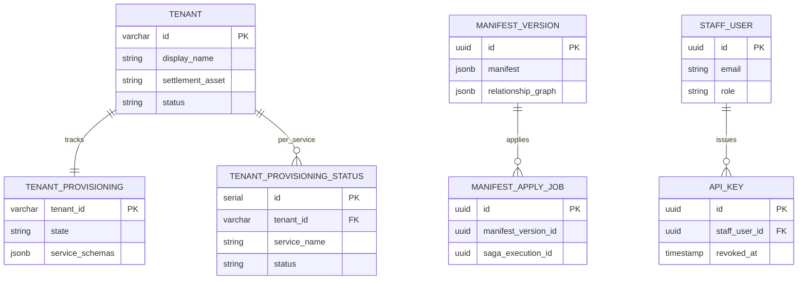

### Party

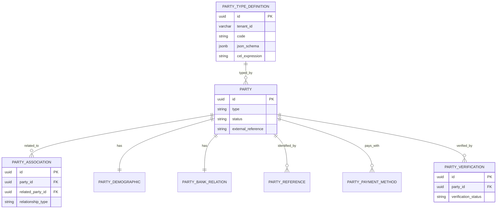

### Identity

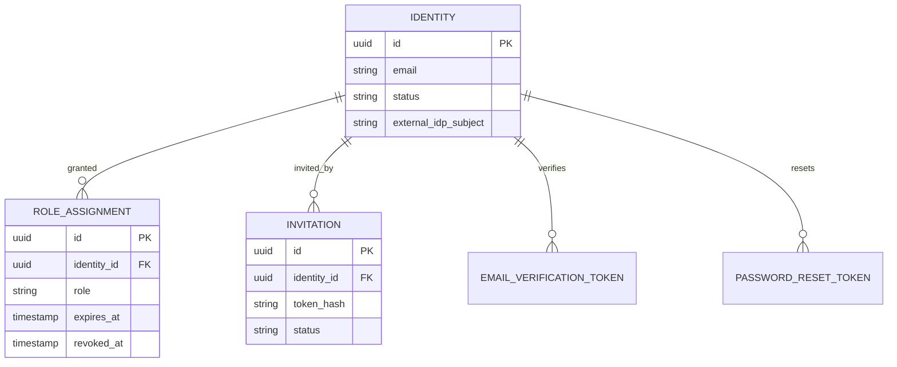

### Current Account

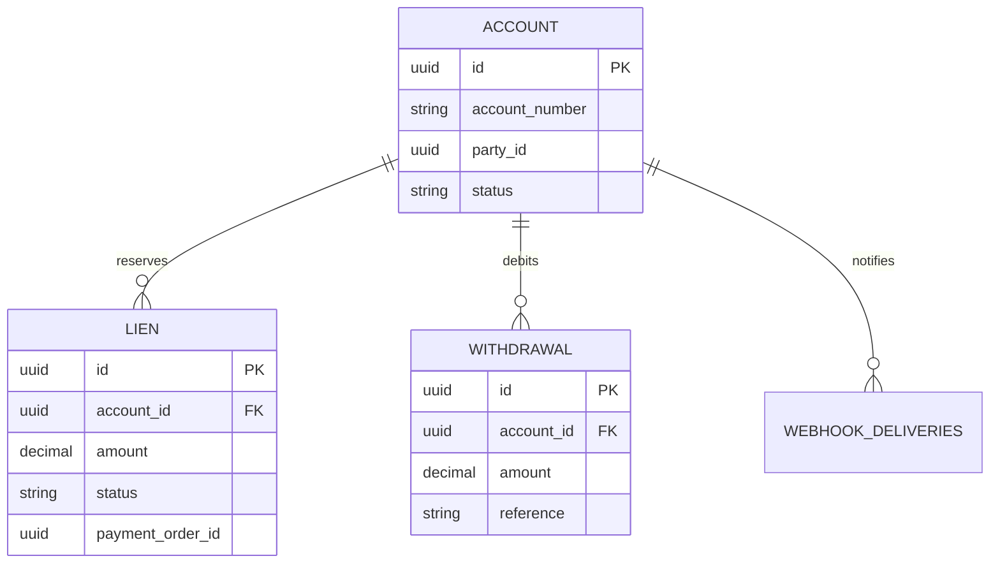

### Internal Account

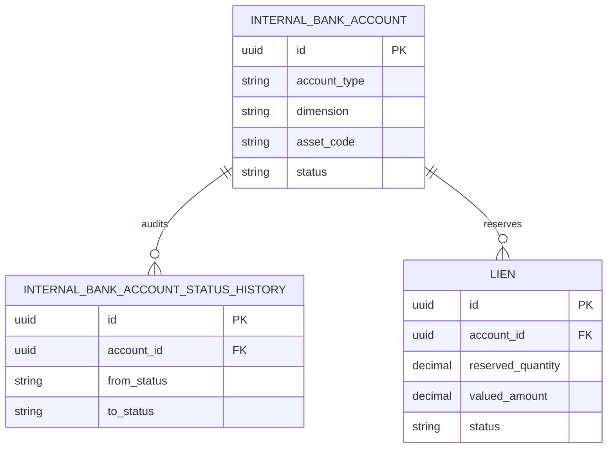

### Position Keeping

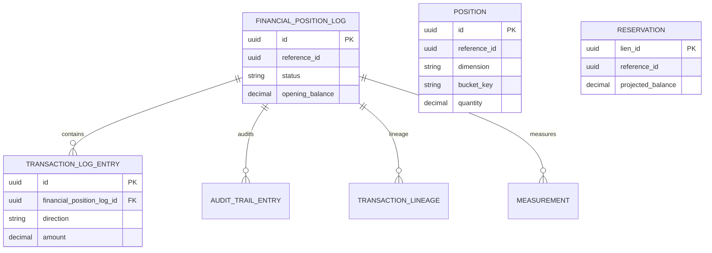

`POSITION` is append-only and not foreign-keyed to `FINANCIAL_POSITION_LOG`; it joins by `reference_id` at read time.

### Financial Accounting

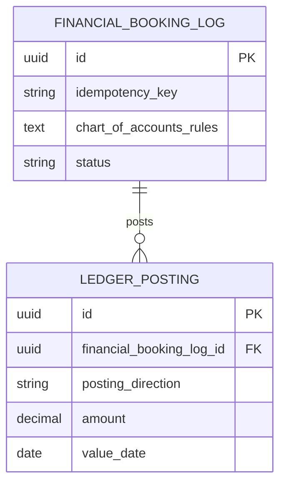

### Reference Data

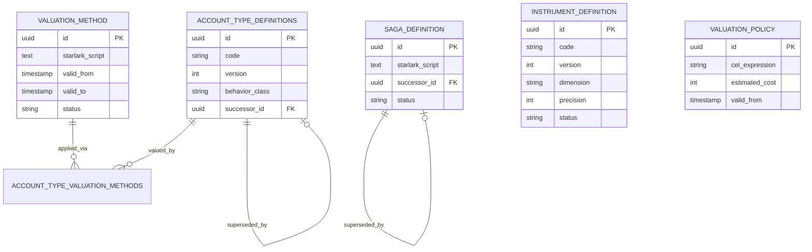

### Payment Order and Billing

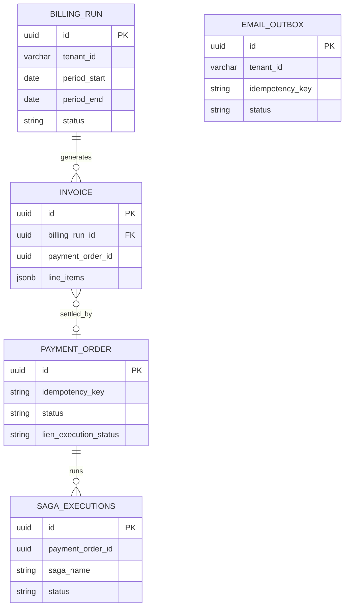

### Market Information

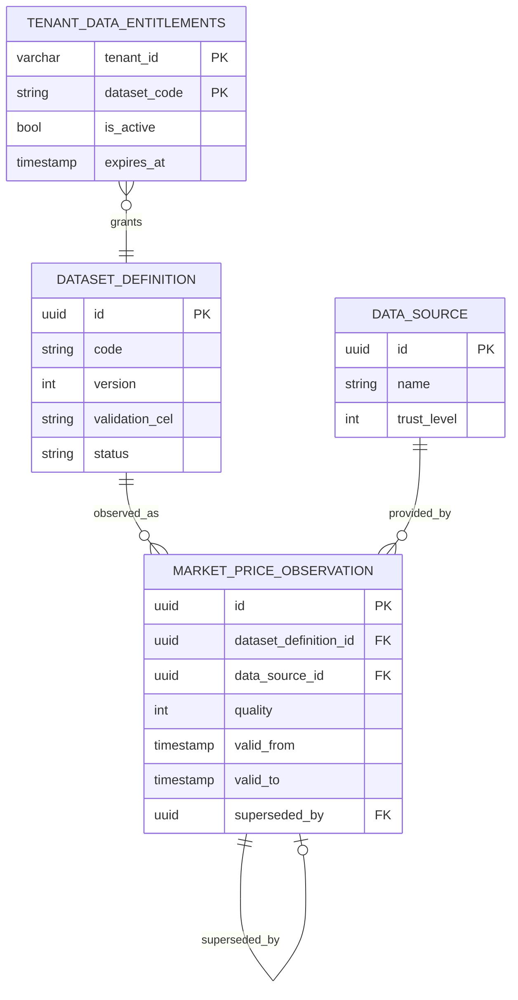

`TENANT_DATA_ENTITLEMENTS` lives in the `public` schema of `meridian_market_information` - see [Cross-Tenant Access](#cross-tenant-access).

### Reconciliation

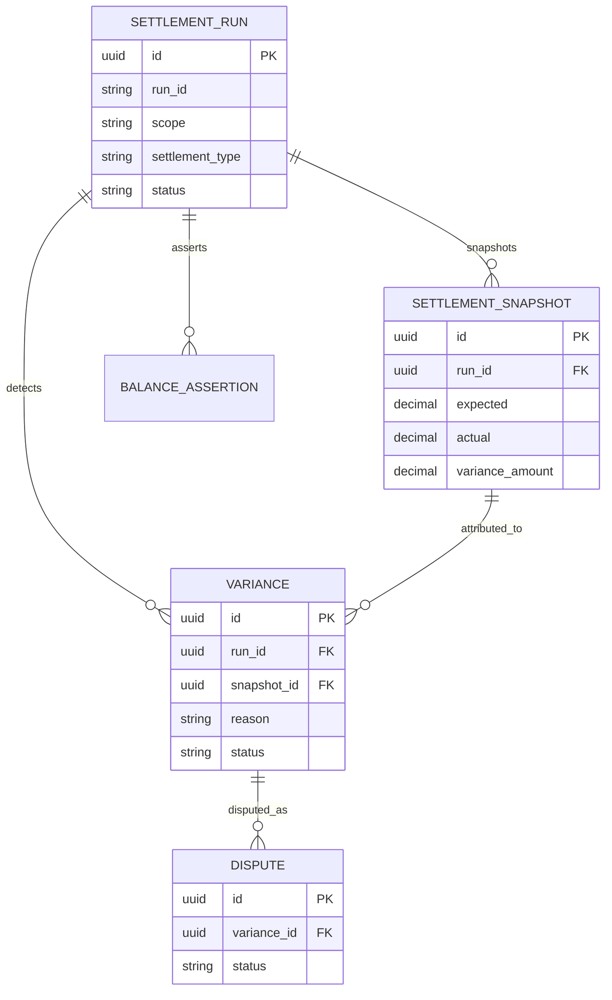

### Operational Gateway

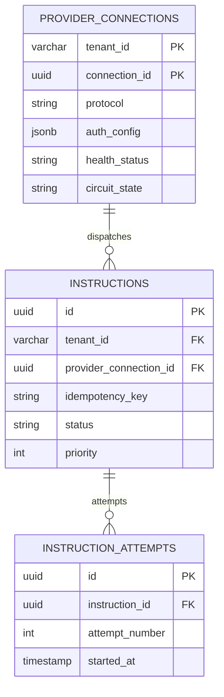

### Cross-Service Logical References

These are UUID references resolved via gRPC at write time - there are no foreign keys crossing service boundaries. Arrows point from the holder of the reference to the authoritative owner.

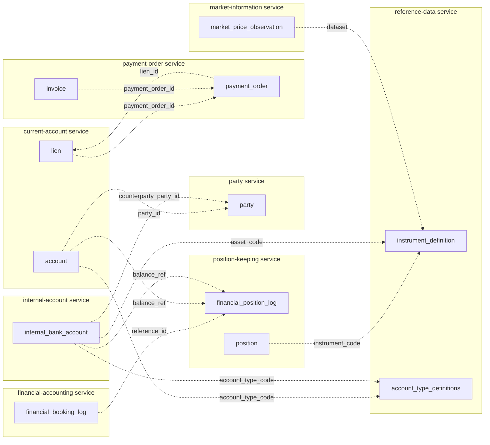

## Cross-Tenant Access

There is **exactly one** cross-tenant access pattern in the codebase:

`services/market-information/adapters/persistence/observation_repository.go` queries `public.tenant_data_entitlements` directly (bypassing `SET LOCAL search_path`) to check whether a tenant may read a shared dataset:

```sql
SELECT EXISTS (
  SELECT 1 FROM public.tenant_data_entitlements
  WHERE tenant_id = $1 AND dataset_code = $2 AND is_active = TRUE
    AND (expires_at IS NULL OR expires_at > NOW())
)
```

Datasets are tagged PUBLIC, PRIVATE, or RESTRICTED. RESTRICTED datasets require an entitlement row. The TOCTOU window between the entitlement check and the data read is an accepted eventual-consistency tradeoff.

**No other service performs cross-tenant queries.** Any future cross-tenant requirement should be proposed via ADR.

## Shared Patterns

**Outbox pattern.** Most services have `event_outbox` (Kafka publishing) and `audit_outbox` (audit stream publishing). Writes are transactional with domain changes; a background worker drains the outbox. `payment-order` additionally has `email_outbox` for customer communications. See `shared/platform/events/outbox.go`.

**Immutable audit trail.** Every tenant-scoped service writes `audit_log` via GORM hooks, backed by `audit_outbox` for delivery to the audit topic. `audit-worker` is the fallback drain when Kafka is unavailable.

**Bi-temporal data.** `market-information` and `reference-data` (valuation methods/policies) store both transaction time (`created_at`) and valid time (`valid_from` / `valid_to`) separately. This is the pattern underpinning the Temporal Quality Ladder (see ADR-0017).

**Append-only positions.** `position.positions` is write-only; reads aggregate via bucket keys. This removes write contention from the hot path.

**Foreign keys stop at the service boundary.** Cross-service references (e.g. `current-account.account.party_id`) are UUIDs with no FK constraint — integrity is enforced at write time via gRPC lookups.

## Migrations

Meridian uses [Atlas](https://atlasgo.io/) for schema management. Each service has:

- `services/<service>/migrations/` — versioned SQL files named `YYYYMMDD000NNN_description.sql`
- `services/<service>/atlas/atlas.hcl` — Atlas config (env: local, ci, production)
- `atlas.sum` — integrity hash, must be regenerated after any migration change (`atlas migrate hash`)

Atlas diffs against GORM models loaded by `utilities/atlas-loader`, which is the source of truth for desired schema. See [ADR-0003](../adr/0003-database-schema-migrations.md) for the full workflow and the CockroachDB compatibility rules that all migrations must follow (split column-add from partial-index-add, no PL/pgSQL, no range types, etc.).

## Recent Changes

- **PR #2126** (2026-04-04) — Self-service signup to tenant creation end-to-end flow. Added `email_verification_token` and `password_reset_token` to `identity`, and `self_registered_admin` bootstrap for new tenant owners.
- **PR #2125** (2026-04-03) — Removed `public` from `search_path` across the codebase. Reference data (instruments, sagas, account types, valuation methods) now replicated into each tenant schema on provisioning. The `public` schema fallback no longer exists at runtime.
- **PR #2121** — Tenant isolation audit hardening — see `docs/audits/tenant-isolation-audit-2026-04-04.md`.

## See Also

- [ADR-0002: Microservices Per BIAN Domain](../adr/0002-microservices-per-bian-domain.md)
- [ADR-0003: Database Schema Migrations with Atlas](../adr/0003-database-schema-migrations.md)
- [ADR-0016: Tenant ID Naming Strategy](../adr/0016-tenant-id-naming-strategy.md)
- [ADR-0017: Temporal Quality Ladder](../adr/0017-temporal-quality-ladder.md)
- [BIAN Service Boundaries](bian-service-boundaries.md)
- [Tenant Isolation Audit 2026-04-04](../audits/tenant-isolation-audit-2026-04-04.md)
