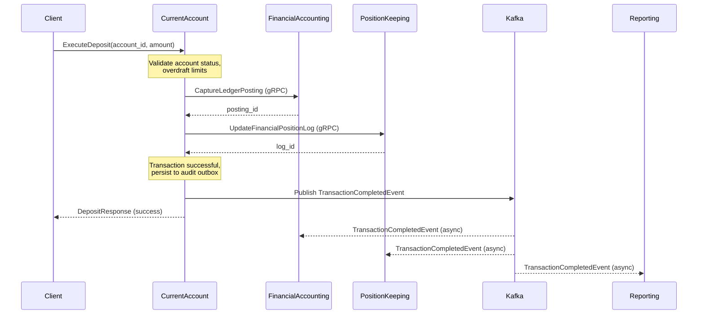
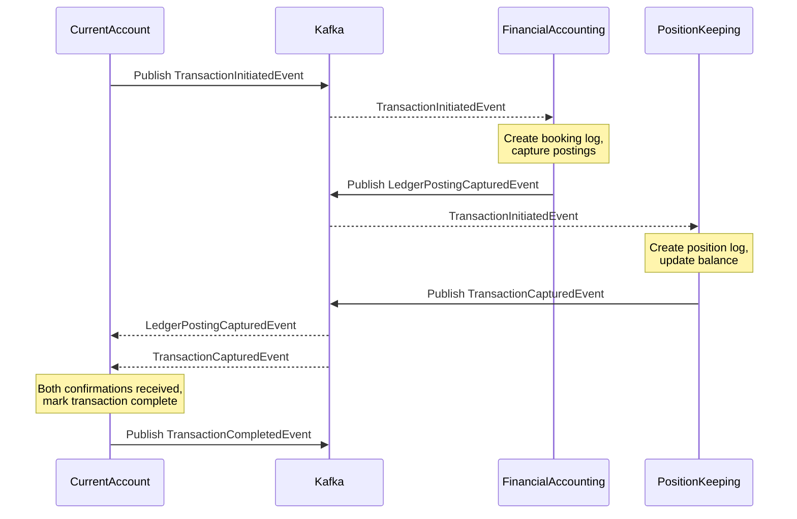
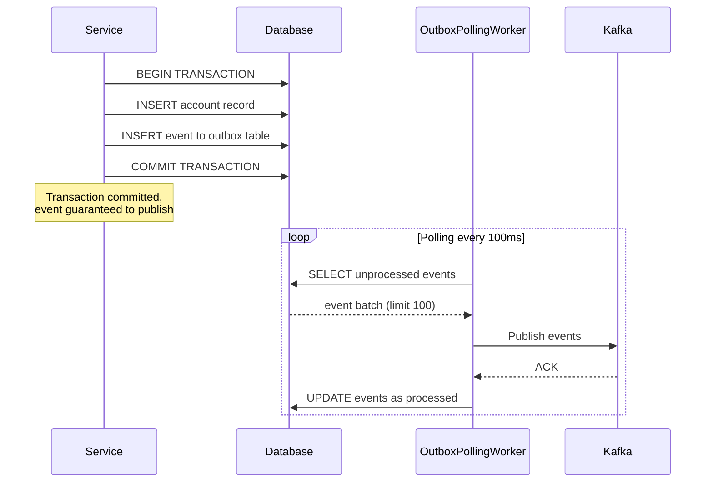
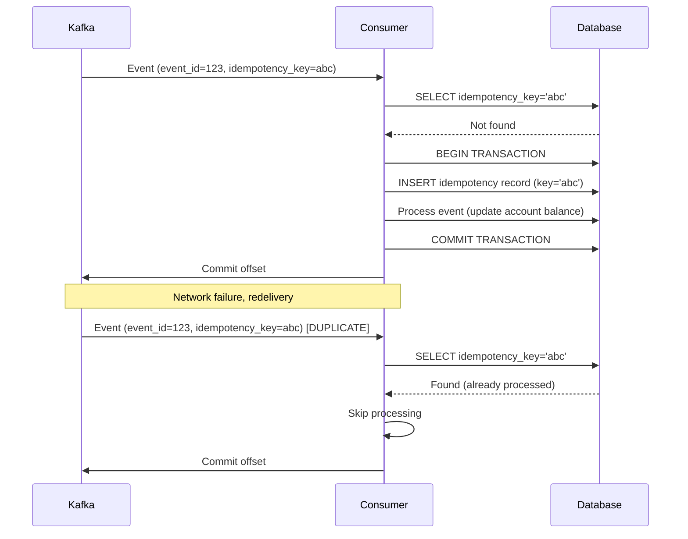
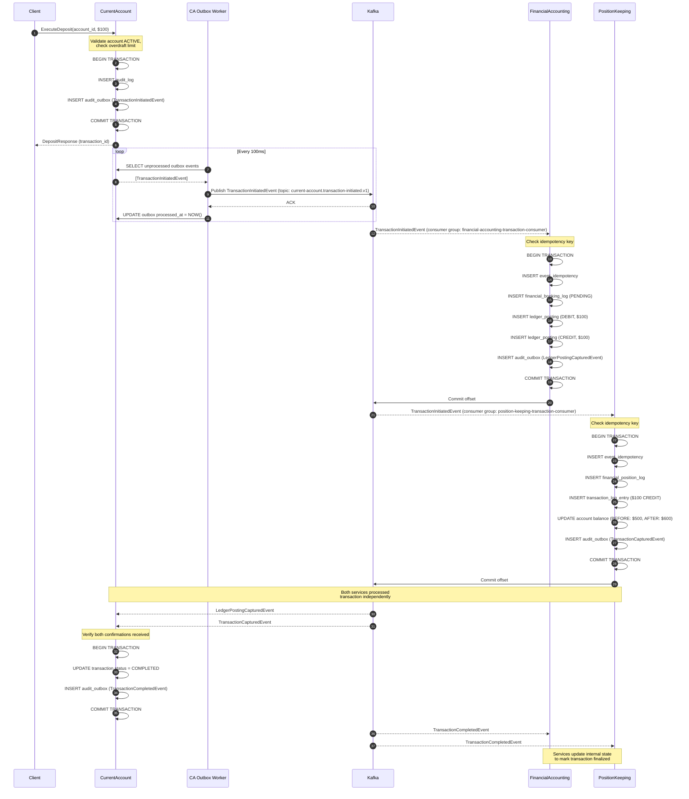

# Event-Driven Architecture

**Document Version:** 1.0
**Last Updated:** 2025-11-19
**Status:** Active
**Related ADR:** [ADR-0004: Event Schema Evolution](../adr/0004-event-schema-evolution.md)
**Related Documentation:** [BIAN Service Boundaries](bian-service-boundaries.md)

## Overview

Meridian's event-driven architecture enables asynchronous communication between BIAN service domains using Apache Kafka as the messaging backbone. Events represent significant domain state changes and enable loose coupling, scalability, and eventual consistency across services.

### Architecture Principles

1. **Events as Facts**: Events represent immutable facts about what happened in the past (e.g., `AccountCreated`, `TransactionInitiated`)
2. **At-Least-Once Delivery**: Kafka guarantees at-least-once delivery; consumers must implement idempotency
3. **Event Sourcing Lite**: Database is the source of truth; events are for coordination, not primary storage
4. **Schema Evolution via Protobuf**: All events use protobuf with `buf breaking` validation (no Schema Registry)
5. **BIAN Semantic Alignment**: Event types map to BIAN behavior qualifiers (Initiate, Update, Control, Execute)
6. **Outbox Pattern**: Transactional event publishing using outbox tables for reliability

### Key Design Decisions

- **No Schema Registry**: Internal-only Kafka usage enables compile-time validation via `buf breaking` (see ADR-0004)
- **Protobuf Serialization**: Consistent with gRPC APIs, type-safe, efficient
- **Topic-per-Event-Type**: One Kafka topic per event type (e.g., `current-account.account-created.v1`)
- **Partition Key = Aggregate ID**: Events for the same aggregate (account, booking log) go to the same partition for ordering
- **7-Day Retention**: Events are ephemeral coordination; database is persistent source of truth

---

## Event Schema Standards

All events in Meridian follow a consistent structure to ensure traceability, idempotency, and observability.

### Required Event Fields

Every event MUST include these fields:

```protobuf
message ExampleEvent {
  // Event identity and versioning
  string event_id = 1;                       // UUID, uniquely identifies this event instance
  google.protobuf.Timestamp timestamp = N;   // When the event was created
  int64 version = N+1;                       // Aggregate version for optimistic locking

  // Correlation and causation (event choreography)
  string correlation_id = N+2;               // Links related events across services (trace ID)
  string causation_id = N+3;                 // Identifies the event/command that caused this event

  // Idempotency and deduplication
  string idempotency_key = N+4;              // Optional: for exactly-once processing

  // Observability
  map<string, string> metadata = N+5;        // Tracing context, user info, etc.

  // Domain-specific fields
  string aggregate_id = 2;                   // ID of the aggregate (account_id, booking_log_id, etc.)
  // ... other business fields
}
```

### Field Conventions

| Field | Type | Purpose | Example |
|-------|------|---------|---------|
| `event_id` | UUID | Unique event instance identifier | `550e8400-e29b-41d4-a716-446655440000` |
| `aggregate_id` | String | Entity this event relates to | `account_id`, `booking_log_id`, `log_id` |
| `timestamp` | Timestamp | When the event occurred | `2025-11-19T14:30:00Z` |
| `version` | int64 | Aggregate version (optimistic locking) | `1`, `2`, `3` |
| `correlation_id` | String | Groups related events (distributed trace) | Same across all events in a transaction flow |
| `causation_id` | String | Event that triggered this event | `event_id` of the causing event |
| `idempotency_key` | String | Deduplication key (optional) | Client-provided UUID for exactly-once semantics |
| `metadata` | Map<string, string> | Tracing, debugging context | `{"user_id": "user123", "span_id": "abc123"}` |

### Correlation vs Causation

**Correlation ID**: Links ALL events in a distributed transaction

- Example: User initiates deposit → `correlation_id` is the same across `TransactionInitiatedEvent`, `DepositEvent`, `LedgerPostingCapturedEvent`, `TransactionCapturedEvent`, `TransactionCompletedEvent`
- Maps to OpenTelemetry trace ID

**Causation ID**: Direct parent-child relationship between events

- Example: `TransactionInitiatedEvent` (causation_id = command_id) → `DepositEvent` (causation_id = TransactionInitiatedEvent.event_id)
- Forms an event causality chain

### Event Validation

All events use `buf.validate` constraints:

```protobuf
// String validation
string account_id = 2 [(buf.validate.field).string = {
  min_len: 1
  max_len: 100
  pattern: "^[a-zA-Z0-9_-]+$"
}];

// UUID validation
string event_id = 1 [(buf.validate.field).string = {
  uuid: true
}];

// Enum validation
meridian.common.v1.Currency currency = 3 [(buf.validate.field).enum = {
  defined_only: true
  not_in: [0]  // Reject UNSPECIFIED
}];

// Money validation (CEL expression)
google.type.Money amount = 4 [
  (buf.validate.field).required = true,
  (buf.validate.field).cel = {
    id: "positive_amount"
    message: "amount must be greater than zero"
    expression: "this.units > 0 || (this.units == 0 && this.nanos > 0)"
  }
];
```

**Important**: CEL constraints on `google.type.Money` provide documentation but don't generate runtime validation. Service layer MUST enforce money constraints.

---

## Event Catalog

### CurrentAccount Service Events

**Event Proto:** `api/proto/meridian/events/v1/current_account_events.proto`

| Event Type | Topic | Description | Consumers | Partition Key |
|------------|-------|-------------|-----------|---------------|
| `AccountCreatedEvent` | `current-account.account-created.v1` | New account facility initiated | Position-keeping, Financial-accounting, Risk-management | `account_id` |
| `AccountStatusChangedEvent` | `current-account.account-status-changed.v1` | Account status transition (ACTIVE↔FROZEN↔CLOSED) | Position-keeping, Compliance, Reporting | `account_id` |
| `AccountClosedEvent` | `current-account.account-closed.v1` | Account permanently closed (terminal state) | Position-keeping, Financial-accounting, Regulatory | `account_id` |
| `TransactionInitiatedEvent` | `current-account.transaction-initiated.v1` | Transaction validated and ready for processing | Financial-accounting, Position-keeping | `account_id` |
| `TransactionCompletedEvent` | `current-account.transaction-completed.v1` | Transaction successfully processed by all services | Notification, Reporting | `account_id` |
| `TransactionFailedEvent` | `current-account.transaction-failed.v1` | Transaction failed during processing | Monitoring, DLQ, Notification | `account_id` |
| `OverdraftConfiguredEvent` | `current-account.overdraft-configured.v1` | Overdraft facility configured or updated | Risk-management, Reporting | `account_id` |
| `OverdraftLimitExceededEvent` | `current-account.overdraft-limit-exceeded.v1` | Transaction rejected due to insufficient funds | Fraud-detection, Notification | `account_id` |

**Legacy Event (Deprecated):**

- `DepositEvent` (in `deposit_event.proto`) - Being replaced by `TransactionInitiatedEvent` with `transaction_type = DEPOSIT`

### FinancialAccounting Service Events

**Event Proto:** `api/proto/meridian/events/v1/financial_accounting_events.proto`

| Event Type | Topic | Description | Consumers | Partition Key |
|------------|-------|-------------|-----------|---------------|
| `FinancialBookingLogInitiatedEvent` | `financial-accounting.booking-log-initiated.v1` | New booking log created (PENDING state) | Audit, Reporting | `booking_log_id` |
| `FinancialBookingLogUpdatedEvent` | `financial-accounting.booking-log-updated.v1` | Booking log status or rules updated | Audit, Compliance | `booking_log_id` |
| `FinancialBookingLogPostedEvent` | `financial-accounting.booking-log-posted.v1` | Booking log posted to GL (balanced, final state) | General-ledger, Reporting, Reconciliation | `booking_log_id` |
| `FinancialBookingLogClosedEvent` | `financial-accounting.booking-log-closed.v1` | Booking log closed (terminal state) | Audit, Archival | `booking_log_id` |
| `LedgerPostingCapturedEvent` | `financial-accounting.ledger-posting-captured.v1` | Debit/credit posting created | Trial-balance, Account-summary | `booking_log_id` |
| `LedgerPostingAmendedEvent` | `financial-accounting.ledger-posting-amended.v1` | Posting amount amended before posting | Audit, Compliance | `booking_log_id` |
| `LedgerPostingPostedEvent` | `financial-accounting.ledger-posting-posted.v1` | Posting finalized to general ledger | General-ledger, Reporting | `booking_log_id` |
| `LedgerPostingRejectedEvent` | `financial-accounting.ledger-posting-rejected.v1` | Posting rejected during validation (terminal) | Monitoring, DLQ | `booking_log_id` |
| `BalanceValidationFailedEvent` | `financial-accounting.balance-validation-failed.v1` | Debits ≠ Credits (double-entry violation) | Monitoring, Audit, Alerting | `booking_log_id` |

### PositionKeeping Service Events

**Event Proto:** `api/proto/meridian/events/v1/position_keeping_events.proto`

| Event Type | Topic | Description | Consumers | Partition Key |
|------------|-------|-------------|-----------|---------------|
| `TransactionCapturedEvent` | `position-keeping.transaction-captured.v1` | Transaction log entry created (draft state) | Reconciliation, Reporting | `log_id` |
| `TransactionAmendedEvent` | `position-keeping.transaction-amended.v1` | Transaction amended before posting | Audit, Compliance | `log_id` |
| `TransactionReconciledEvent` | `position-keeping.transaction-reconciled.v1` | Transaction reconciled against external records | Reconciliation-dashboard, Reporting | `log_id` |
| `TransactionPostedEvent` | `position-keeping.transaction-posted.v1` | Transaction posted to GL (final state) | Reporting, Analytics | `log_id` |
| `TransactionRejectedEvent` | `position-keeping.transaction-rejected.v1` | Transaction rejected during validation (terminal) | Monitoring, DLQ | `log_id` |
| `TransactionFailedEvent` | `position-keeping.transaction-failed.v1` | Technical failure during processing | Monitoring, SRE, Alerting | `log_id` |
| `TransactionCancelledEvent` | `position-keeping.transaction-cancelled.v1` | Transaction cancelled before posting | Audit, Reporting | `log_id` |
| `BulkTransactionCapturedEvent` | `position-keeping.bulk-transaction-captured.v1` | Bulk import completed (1-10,000 transactions) | Reconciliation, Monitoring | `batch_id` |

---

## Event Flow Patterns

### Pattern 1: Synchronous Orchestration with Asynchronous Events

**Use Case:** Current account deposit transaction



**Publishing Rules:**

1. CurrentAccount publishes `TransactionCompletedEvent` AFTER both gRPC calls succeed
2. Event publishing uses outbox pattern for reliability
3. Consumers process event asynchronously (eventual consistency)

### Pattern 2: Event-Driven Choreography

**Use Case:** Financial accounting processes deposit event from current account



**Choreography Rules:**

1. Services react to events independently (no orchestrator)
2. Correlation ID links all events in the flow
3. Services maintain local state machines based on event sequence
4. Compensating events for failure scenarios (not shown)

### Pattern 3: Outbox Pattern for Transactional Publishing

**Use Case:** Ensure events are published reliably with database consistency



**Outbox Pattern Benefits:**

- ✅ Transactional consistency between database writes and event publishing
- ✅ At-least-once delivery guarantee
- ✅ No lost events (even if Kafka is temporarily unavailable)
- ✅ Automatic retry on publish failures

**Implementation:**

- Outbox table: `audit_outbox` in each service's database
- Polling worker: Background goroutine in each service
- Batch size: 100 events per poll
- Polling interval: 100ms (configurable)

**Outbox Table Schema:**

```sql
CREATE TABLE audit_outbox (
    id BIGSERIAL PRIMARY KEY,
    event_id UUID NOT NULL,
    event_type TEXT NOT NULL,
    aggregate_id TEXT NOT NULL,
    payload BYTEA NOT NULL,  -- Serialized protobuf
    created_at TIMESTAMPTZ NOT NULL DEFAULT NOW(),
    processed_at TIMESTAMPTZ,
    published_at TIMESTAMPTZ,
    retry_count INT NOT NULL DEFAULT 0,
    last_error TEXT,
    CONSTRAINT unique_event_id UNIQUE (event_id)
);

CREATE INDEX idx_outbox_unprocessed ON audit_outbox (created_at)
WHERE processed_at IS NULL;
```

### Pattern 4: Idempotent Event Consumption

**Use Case:** Handle duplicate events (at-least-once delivery)



**Idempotency Implementation:**

1. Check `idempotency_key` against deduplication table BEFORE processing
2. Store idempotency record in SAME transaction as business logic
3. Skip processing if key already exists
4. Idempotency keys expire after 7 days (match Kafka retention)

**Idempotency Table Schema:**

```sql
CREATE TABLE event_idempotency (
    idempotency_key TEXT PRIMARY KEY,
    event_id UUID NOT NULL,
    event_type TEXT NOT NULL,
    processed_at TIMESTAMPTZ NOT NULL DEFAULT NOW(),
    response_payload BYTEA  -- Optional: cache response for exactly-once semantics
);

CREATE INDEX idx_idempotency_expiry ON event_idempotency (processed_at);
-- Cleanup job: DELETE WHERE processed_at < NOW() - INTERVAL '7 days'
```

---

## Publishing Patterns

### Service Publishing Responsibilities

| Service | Publishes Events | Publishing Method | Trigger |
|---------|------------------|-------------------|---------|
| **CurrentAccount** | Account lifecycle, transaction orchestration events | Outbox pattern | After successful gRPC calls to downstream services |
| **FinancialAccounting** | Booking log and posting events | Outbox pattern | After database writes (booking log creation, posting capture) |
| **PositionKeeping** | Transaction log and position events | Outbox pattern | After database writes (transaction log creation, status updates) |

### Publishing Rules

#### Rule 1: Publish AFTER Persistence

- Events MUST be published AFTER the database write commits
- Use outbox table to ensure transactional consistency
- Never publish events before state changes are durable

#### Rule 2: Publish ONCE per State Change

- Each significant state transition publishes ONE event
- Example: Account creation → `AccountCreatedEvent` (not `AccountInitiated` + `AccountCreated`)

#### Rule 3: Correlation and Causation Chain

- All events in a flow share the same `correlation_id`
- Each event's `causation_id` = parent event's `event_id`
- First event in flow: `causation_id` = command/request ID

#### Rule 4: Partition Key = Aggregate ID

- Account events: `partition_key = account_id`
- Booking log events: `partition_key = booking_log_id`
- Position log events: `partition_key = log_id`
- Ensures event ordering per aggregate

#### Rule 5: Versioning and Optimistic Locking

- Include `version` field in all events
- Version increments with each state change (version 1, 2, 3, ...)
- Consumers can detect out-of-order delivery (version N+2 arrives before N+1)

### Example: Publishing an Account Created Event

```go
// internal/current-account/service/account_service.go

func (s *AccountService) CreateAccount(ctx context.Context, req *pb.CreateAccountRequest) (*pb.AccountResponse, error) {
    // 1. Domain logic: Create account entity
    account := domain.NewAccount(req.AccountIdentification, req.BaseCurrency)

    // 2. Begin database transaction
    tx, err := s.db.BeginTx(ctx, nil)
    if err != nil {
        return nil, fmt.Errorf("begin transaction: %w", err)
    }
    defer tx.Rollback()

    // 3. Persist account to database
    if err := s.accountRepo.Create(ctx, tx, account); err != nil {
        return nil, fmt.Errorf("create account: %w", err)
    }

    // 4. Create event
    event := &eventsv1.AccountCreatedEvent{
        EventId:                uuid.New().String(),
        AccountId:              account.ID,
        AccountIdentification:  account.IBAN,
        BaseCurrency:           account.Currency,
        AccountStatus:          "ACTIVE",
        ProductReference:       req.ProductReference,
        CustomerReference:      req.CustomerReference,
        CreatedBy:              getUserID(ctx),
        CorrelationId:          getCorrelationID(ctx),
        CausationId:            getCommandID(ctx),
        Timestamp:              timestamppb.Now(),
        Version:                1,
        IdempotencyKey:         req.IdempotencyKey,
        Metadata:               getTraceMetadata(ctx),
    }

    // 5. Serialize event to protobuf
    eventBytes, err := proto.Marshal(event)
    if err != nil {
        return nil, fmt.Errorf("marshal event: %w", err)
    }

    // 6. Insert into outbox table (same transaction)
    outboxEntry := &domain.OutboxEntry{
        EventID:     event.EventId,
        EventType:   "current_account.account_created.v1",
        AggregateID: account.ID,
        Payload:     eventBytes,
        CreatedAt:   time.Now(),
    }

    if err := s.outboxRepo.Insert(ctx, tx, outboxEntry); err != nil {
        return nil, fmt.Errorf("insert outbox entry: %w", err)
    }

    // 7. Commit transaction (account + outbox entry)
    if err := tx.Commit(); err != nil {
        return nil, fmt.Errorf("commit transaction: %w", err)
    }

    // Event will be published by background outbox worker
    return &pb.AccountResponse{Account: account.ToProto()}, nil
}
```

---

## Consumption Patterns

### Consumer Configuration

All Kafka consumers MUST use these settings:

```go
consumerConfig := kafka.ConsumerConfig{
    BootstrapServers: "kafka:9092",
    GroupID:          "financial-accounting-deposit-consumer",  // Unique per service + topic
    ClientID:         "financial-accounting-1",
    AutoOffsetReset:  "earliest",  // Start from beginning if no offset exists
    EnableAutoCommit: false,        // Manual commit after successful processing
    PollTimeout:      100 * time.Millisecond,
    HandlerTimeout:   30 * time.Second,
}
```

**Key Settings:**

- `EnableAutoCommit: false` - Ensures at-least-once processing (manual commit after business logic)
- `AutoOffsetReset: "earliest"` - Prevents data loss on new consumer groups
- `HandlerTimeout: 30s` - Maximum processing time per message
- `PollTimeout: 100ms` - Responsive shutdown without CPU waste

### Idempotent Consumer Pattern

```go
// internal/financial-accounting/adapters/messaging/transaction_initiated_consumer.go

func (c *TransactionInitiatedConsumer) handleMessage(ctx context.Context, key []byte, msg proto.Message) error {
    event, ok := msg.(*eventsv1.TransactionInitiatedEvent)
    if !ok {
        return fmt.Errorf("unexpected message type: %T", msg)
    }

    // 1. Check idempotency key
    if event.IdempotencyKey != "" {
        exists, err := c.idempotencyRepo.Exists(ctx, event.IdempotencyKey)
        if err != nil {
            return fmt.Errorf("check idempotency: %w", err)
        }
        if exists {
            // Already processed - skip
            return nil
        }
    }

    // 2. Begin transaction
    tx, err := c.db.BeginTx(ctx, nil)
    if err != nil {
        return fmt.Errorf("begin transaction: %w", err)
    }
    defer tx.Rollback()

    // 3. Record idempotency key (if provided)
    if event.IdempotencyKey != "" {
        if err := c.idempotencyRepo.Record(ctx, tx, event.IdempotencyKey, event.EventId); err != nil {
            return fmt.Errorf("record idempotency: %w", err)
        }
    }

    // 4. Business logic: Create booking log and postings
    bookingLog := domain.NewBookingLog(event.AccountId, event.TransactionAmount)
    if err := c.bookingLogRepo.Create(ctx, tx, bookingLog); err != nil {
        return fmt.Errorf("create booking log: %w", err)
    }

    debitPosting := domain.NewPosting(bookingLog.ID, "DEBIT", event.TransactionAmount)
    creditPosting := domain.NewPosting(bookingLog.ID, "CREDIT", event.TransactionAmount)

    if err := c.postingRepo.CreateBatch(ctx, tx, []domain.Posting{debitPosting, creditPosting}); err != nil {
        return fmt.Errorf("create postings: %w", err)
    }

    // 5. Commit transaction
    if err := tx.Commit(); err != nil {
        return fmt.Errorf("commit transaction: %w", err)
    }

    // 6. Success - Kafka consumer will commit offset automatically
    return nil
}
```

### Dead Letter Queue (DLQ) Pattern

Events that fail processing after retries are sent to a DLQ topic for investigation.

```go
// internal/platform/kafka/consumer.go

func (c *ProtoConsumer) processMessage(ctx context.Context, msg *kafka.Message) error {
    handlerCtx, cancel := context.WithTimeout(ctx, c.handlerTimeout)
    defer cancel()

    protoMsg := c.msgFactory()
    if err := proto.Unmarshal(msg.Value, protoMsg); err != nil {
        // Deserialization error - send to DLQ immediately (unrecoverable)
        c.dlqProducer.Send(ctx, msg, err)
        return nil  // Don't retry
    }

    // Invoke handler
    if err := c.handler(handlerCtx, msg.Key, protoMsg); err != nil {
        // Check retry count
        retryCount := getRetryCount(msg.Headers)
        if retryCount >= c.dlqConfig.MaxRetries {
            // Max retries exceeded - send to DLQ
            c.dlqProducer.Send(ctx, msg, err)
            return nil  // Don't retry further
        }

        // Increment retry count and requeue
        return fmt.Errorf("handler failed (retry %d/%d): %w", retryCount, c.dlqConfig.MaxRetries, err)
    }

    return nil
}
```

**DLQ Topic Naming:**

- Main topic: `financial-accounting.ledger-posting-captured.v1`
- DLQ topic: `financial-accounting.ledger-posting-captured.v1.dlq`

**DLQ Message Format:**

```json
{
  "original_topic": "financial-accounting.ledger-posting-captured.v1",
  "original_partition": 2,
  "original_offset": 12345,
  "original_key": "booking-log-123",
  "original_value": "<base64-encoded-protobuf>",
  "error_message": "database connection timeout",
  "retry_count": 3,
  "failed_at": "2025-11-19T14:30:00Z",
  "headers": {
    "correlation_id": "trace-abc-123",
    "causation_id": "event-xyz-456"
  }
}
```

### Consumer Error Handling Strategy

| Error Type | Retry | DLQ | Strategy |
|------------|-------|-----|----------|
| Deserialization error | No | Yes | Unrecoverable - data corruption |
| Idempotency key exists | No | No | Already processed - skip silently |
| Database connection timeout | Yes (3x) | After max retries | Transient - retry with exponential backoff |
| Constraint violation | No | Yes | Business rule violation - manual investigation |
| Downstream service unavailable | Yes (3x) | After max retries | Transient - retry with circuit breaker |

---

## Event Ordering and Delivery Guarantees

### At-Least-Once Delivery

Kafka guarantees at-least-once delivery when consumers use manual offset commits:

```go
consumer.EnableAutoCommit = false

// Process message
if err := handler(ctx, key, msg); err != nil {
    // Don't commit offset - message will be redelivered
    return err
}

// Success - commit offset
consumer.CommitMessage(msg)
```

**Implication:** Consumers MUST be idempotent (handle duplicate events safely).

### Event Ordering per Partition

Events with the same partition key (aggregate ID) are delivered in order:

| Account ID | Event Sequence | Partition | Order Guaranteed? |
|------------|----------------|-----------|-------------------|
| `account-1` | Created → StatusChanged → Closed | Partition 0 | ✅ Yes (same partition) |
| `account-2` | Created → StatusChanged | Partition 1 | ✅ Yes (same partition) |
| `account-1` + `account-2` | Mixed events | Multiple partitions | ❌ No (different partitions) |

**Publishing Code:**

```go
// Use account_id as partition key
partitionKey := event.AccountId

kafka.Publish(ctx, topic, partitionKey, event)
// All events for account-1 go to the same partition → ordered delivery
```

### Handling Out-of-Order Events

Consumers should detect out-of-order delivery using event versions:

```go
func (c *AccountConsumer) handleEvent(ctx context.Context, event *eventsv1.AccountStatusChangedEvent) error {
    // Fetch current account state
    account, err := c.accountRepo.FindByID(ctx, event.AccountId)
    if err != nil {
        return fmt.Errorf("fetch account: %w", err)
    }

    // Check version (optimistic locking)
    if event.Version <= account.Version {
        // Out-of-order or duplicate event - already processed
        return nil
    }

    if event.Version > account.Version + 1 {
        // Gap detected (missing events) - log warning
        log.Warnf("Event gap detected for account %s: current version %d, event version %d",
            event.AccountId, account.Version, event.Version)
        // Option 1: Reject and retry (event may arrive later)
        // Option 2: Fetch missing events from source
        // Option 3: Continue and accept gap (eventual consistency)
    }

    // Apply event
    account.ApplyStatusChange(event)
    account.Version = event.Version

    return c.accountRepo.Update(ctx, account)
}
```

### Partition Strategy

**Kafka Topic Configuration:**

```bash
kafka-topics --create \
  --topic current-account.account-created.v1 \
  --partitions 3 \
  --replication-factor 3 \
  --config retention.ms=604800000  # 7 days
```

**Partition Count Guidelines:**

- Low-volume topics (< 1,000 events/sec): 3 partitions
- Medium-volume topics (1,000-10,000 events/sec): 6 partitions
- High-volume topics (> 10,000 events/sec): 12+ partitions

**Partition Key Strategy:**

- Account events: `account_id`
- Booking log events: `booking_log_id`
- Position log events: `log_id`
- Bulk operations: `batch_id`

**Benefit:** Horizontal scalability (add consumers up to partition count)

---

## Schema Evolution and Versioning

Meridian uses protobuf's native versioning with `buf breaking` enforcement (no Schema Registry required). See [ADR-0004](../adr/0004-event-schema-evolution.md) for full details.

### Safe Changes (Backward Compatible)

✅ **Add optional fields** (consumers ignore unknown fields)

```protobuf
// Before
message AccountCreatedEvent {
  string event_id = 1;
  string account_id = 2;
  string account_status = 3;
}

// After - add optional metadata
message AccountCreatedEvent {
  string event_id = 1;
  string account_id = 2;
  string account_status = 3;
  string created_by = 4;           // NEW: optional field
  map<string, string> metadata = 5; // NEW: optional field
}
```

**CI Validation:** `buf breaking --against main` passes

✅ **Add new event types** (new BIAN behavior qualifiers)

```protobuf
// New event for BIAN 14.0 "Suspend" behavior qualifier
message AccountSuspendedEvent {
  string event_id = 1;
  string account_id = 2;
  string suspension_reason = 3;
  google.protobuf.Timestamp suspended_until = 4;
  // ...
}
```

**Topic Strategy:** New event = new topic (`current-account.account-suspended.v1`)

### Breaking Changes (Require Coordination)

❌ **Remove fields** (old consumers expect the field)

❌ **Change field types** (wire format incompatible)

❌ **Change field numbers** (protobuf uses numbers for serialization)

❌ **Rename fields** (breaks generated code, even though wire format is compatible)

**Mitigation:** Create a new event type instead of modifying existing events

### Event Versioning Strategy

**Topic Naming Convention:**

```text
<service>.<event-name>.<version>

Examples:
- current-account.account-created.v1
- financial-accounting.ledger-posting-captured.v1
- position-keeping.transaction-captured.v1
```

**Version Increments:**

- `v1` → `v2` only for breaking changes (rarely needed)
- Backward-compatible changes stay in `v1` (add optional fields)
- New BIAN behavior qualifiers = new event types (not version bumps)

**Example Evolution:**

```text
# BIAN 14.0
current-account.account-created.v1
current-account.account-status-changed.v1

# BIAN 14.0 adds "Suspend" behavior qualifier
current-account.account-suspended.v1  ← New event type, NOT v2 of status-changed
```

### CI/CD Schema Validation

```yaml
# .github/workflows/proto-validation.yml

name: Protobuf Schema Validation

on: [pull_request]

jobs:
  validate:
    runs-on: ubuntu-latest
    steps:
      - uses: actions/checkout@v3
        with:
          fetch-depth: 0  # Fetch all history for buf breaking

      - name: Install buf
        run: |
          curl -sSL https://github.com/bufbuild/buf/releases/download/v1.28.1/buf-Linux-x86_64 \
            -o /usr/local/bin/buf
          chmod +x /usr/local/bin/buf

      - name: Lint protobuf schemas
        run: buf lint

      - name: Check for breaking changes
        run: buf breaking --against '.git#branch=main'
```

**Result:** Pull requests with breaking proto changes fail CI

---

## Kafka Topic Configuration

### Topic Naming Convention

```text
<service>.<event-name>.<version>

Service:    current-account | financial-accounting | position-keeping
Event Name: account-created | ledger-posting-captured | transaction-captured
Version:    v1 | v2 | v3
```

**Examples:**

- `current-account.account-created.v1`
- `financial-accounting.booking-log-posted.v1`
- `position-keeping.transaction-captured.v1`

### Topic Configuration Standards

All topics MUST use these settings:

```bash
kafka-topics --create \
  --topic <topic-name> \
  --partitions <partition-count> \
  --replication-factor 3 \
  --config retention.ms=604800000 \
  --config cleanup.policy=delete \
  --config compression.type=producer \
  --config min.insync.replicas=2
```

| Setting | Value | Rationale |
|---------|-------|-----------|
| `partitions` | 3-12 (based on volume) | Horizontal scalability |
| `replication-factor` | 3 | Fault tolerance (2 broker failures) |
| `retention.ms` | 604800000 (7 days) | Matches event coordination needs |
| `cleanup.policy` | delete | Time-based deletion (not compaction) |
| `compression.type` | producer | Let producer choose (snappy default) |
| `min.insync.replicas` | 2 | Durability (2 replicas must ACK) |

### Retention Policy

**7-Day Retention Rationale:**

- Events are for coordination, NOT system of record (database is source of truth)
- Consumers should catch up within hours, not days
- Kafka replay is for recovery, not historical analysis (use database for historical queries)
- Shorter retention = lower storage costs and faster broker startup

**Exception:** Audit topics may have longer retention (30-90 days) for compliance

### Topic Lifecycle

**Topic Creation:**

1. Define event schema in `api/proto/meridian/events/v1/<service>_events.proto`
2. Run `buf generate` to generate Go code
3. Create Kafka topic with standard configuration (via Terraform or Kafka admin scripts)
4. Implement publisher in service
5. Implement consumer in subscribing services

**Topic Deprecation:**

1. Mark topic as deprecated in documentation
2. Add warning logs to publishers/consumers
3. Allow 2 release cycles (4-8 weeks) for migration
4. Delete topic after all consumers migrated

---

## Monitoring and Observability

### Producer Metrics

**Track these metrics for all event publishers:**

| Metric | Type | Description | Alert Threshold |
|--------|------|-------------|-----------------|
| `kafka_producer_publish_total` | Counter | Total events published | N/A (trend) |
| `kafka_producer_publish_errors_total` | Counter | Failed publish attempts | > 0 (alert immediately) |
| `kafka_producer_publish_duration_seconds` | Histogram | Time to publish event | p99 > 1s |
| `kafka_producer_outbox_lag_seconds` | Gauge | Time since oldest unprocessed outbox event | > 60s |
| `kafka_producer_outbox_size` | Gauge | Number of unprocessed outbox events | > 10,000 |

**Example Prometheus Query:**

```promql
# Publish error rate
rate(kafka_producer_publish_errors_total[5m]) > 0

# Outbox lag (oldest unprocessed event)
kafka_producer_outbox_lag_seconds > 60
```

### Consumer Metrics

**Track these metrics for all event consumers:**

| Metric | Type | Description | Alert Threshold |
|--------|------|-------------|-----------------|
| `kafka_consumer_messages_consumed_total` | Counter | Total messages consumed | N/A (trend) |
| `kafka_consumer_processing_errors_total` | Counter | Failed message processing | > 0 (alert immediately) |
| `kafka_consumer_processing_duration_seconds` | Histogram | Message processing time | p99 > 30s |
| `kafka_consumer_lag` | Gauge | Consumer group lag (messages behind) | > 1,000 |
| `kafka_consumer_dlq_messages_total` | Counter | Messages sent to DLQ | > 0 (alert immediately) |

**Example Prometheus Query:**

```promql
# Consumer lag
kafka_consumer_lag{group="financial-accounting-deposit-consumer"} > 1000

# DLQ messages
rate(kafka_consumer_dlq_messages_total[5m]) > 0
```

### Distributed Tracing

All events include OpenTelemetry trace context:

```go
// Publish event with trace context
func (p *EventPublisher) publishWithTracing(ctx context.Context, event *eventsv1.AccountCreatedEvent) error {
    // Extract trace context from ctx
    span := trace.SpanFromContext(ctx)
    event.Metadata = map[string]string{
        "trace_id": span.SpanContext().TraceID().String(),
        "span_id":  span.SpanContext().SpanID().String(),
    }

    // Publish event
    return p.producer.Publish(ctx, "current-account.account-created.v1", event.AccountId, event)
}

// Consume event and propagate trace context
func (c *EventConsumer) handleWithTracing(ctx context.Context, event *eventsv1.AccountCreatedEvent) error {
    // Extract trace context from event metadata
    traceID, _ := trace.TraceIDFromHex(event.Metadata["trace_id"])
    spanID, _ := trace.SpanIDFromHex(event.Metadata["span_id"])

    spanContext := trace.NewSpanContext(trace.SpanContextConfig{
        TraceID: traceID,
        SpanID:  spanID,
        TraceFlags: trace.FlagsSampled,
    })

    ctx = trace.ContextWithRemoteSpanContext(ctx, spanContext)

    // Start consumer span
    ctx, span := tracer.Start(ctx, "consume.account-created")
    defer span.End()

    // Process event with trace context
    return c.processEvent(ctx, event)
}
```

**Trace Visualization (Jaeger/Tempo):**

```text
Trace: Create Account (trace_id=abc123)
├─ Span: CurrentAccount.CreateAccount (200ms)
│  ├─ Span: Database.Insert account (50ms)
│  ├─ Span: Database.Insert outbox (20ms)
│  └─ Span: Kafka.Publish AccountCreatedEvent (10ms)
├─ Span: FinancialAccounting.ConsumeAccountCreated (150ms)
│  ├─ Span: Database.CreateBookingLog (60ms)
│  └─ Span: Kafka.Publish BookingLogInitiatedEvent (10ms)
└─ Span: PositionKeeping.ConsumeAccountCreated (100ms)
   ├─ Span: Database.CreatePositionLog (40ms)
   └─ Span: Kafka.Publish TransactionCapturedEvent (10ms)
```

### Logging Standards

All event publishers and consumers MUST log:

**Publisher Logs:**

```go
log.Info("Publishing event",
    "event_type", "current_account.account_created.v1",
    "event_id", event.EventId,
    "aggregate_id", event.AccountId,
    "correlation_id", event.CorrelationId,
    "partition_key", event.AccountId,
)

log.Error("Failed to publish event",
    "event_type", "current_account.account_created.v1",
    "event_id", event.EventId,
    "error", err,
    "retry_count", retryCount,
)
```

**Consumer Logs:**

```go
log.Info("Consumed event",
    "event_type", "current_account.account_created.v1",
    "event_id", event.EventId,
    "aggregate_id", event.AccountId,
    "correlation_id", event.CorrelationId,
    "processing_duration_ms", processingDurationMs,
)

log.Error("Failed to process event",
    "event_type", "current_account.account_created.v1",
    "event_id", event.EventId,
    "error", err,
    "retry_count", retryCount,
    "will_send_to_dlq", willSendToDLQ,
)
```

---

## Testing Event-Driven Flows

### Unit Tests: Event Serialization

```go
// api/proto/meridian/events/v1/current_account_events_test.go

func TestAccountCreatedEvent_Serialization(t *testing.T) {
    original := &eventsv1.AccountCreatedEvent{
        EventId:               "550e8400-e29b-41d4-a716-446655440000",
        AccountId:             "account-123",
        AccountIdentification: "GB82WEST12345698765432",
        BaseCurrency:          commonv1.Currency_CURRENCY_GBP,
        AccountStatus:         "ACTIVE",
        CorrelationId:         "trace-abc-123",
        Timestamp:             timestamppb.Now(),
        Version:               1,
    }

    // Serialize
    bytes, err := proto.Marshal(original)
    require.NoError(t, err)

    // Deserialize
    deserialized := &eventsv1.AccountCreatedEvent{}
    err = proto.Unmarshal(bytes, deserialized)
    require.NoError(t, err)

    // Assert equality
    assert.Equal(t, original.EventId, deserialized.EventId)
    assert.Equal(t, original.AccountId, deserialized.AccountId)
    assert.Equal(t, original.BaseCurrency, deserialized.BaseCurrency)
}
```

### Integration Tests: End-to-End Event Flow

```go
// internal/current-account/service/account_service_integration_test.go

func TestCreateAccount_PublishesEvent(t *testing.T) {
    // Start Kafka testcontainer
    kafkaContainer := testcontainers.StartKafka(t)
    defer kafkaContainer.Terminate(t)

    // Start test Kafka consumer
    consumed := make(chan *eventsv1.AccountCreatedEvent, 1)
    consumer := startTestConsumer(t, kafkaContainer, "current-account.account-created.v1", consumed)
    defer consumer.Stop()

    // Execute service method
    resp, err := accountService.CreateAccount(ctx, &pb.CreateAccountRequest{
        AccountIdentification: "GB82WEST12345698765432",
        BaseCurrency:          commonv1.Currency_CURRENCY_GBP,
    })
    require.NoError(t, err)

    // Assert event was published
    select {
    case event := <-consumed:
        assert.Equal(t, resp.Account.AccountId, event.AccountId)
        assert.Equal(t, "ACTIVE", event.AccountStatus)
        assert.NotEmpty(t, event.EventId)
        assert.NotEmpty(t, event.CorrelationId)
    case <-time.After(5 * time.Second):
        t.Fatal("Timeout waiting for event")
    }
}
```

### Contract Tests: Consumer Expectations

```go
// internal/financial-accounting/adapters/messaging/account_created_consumer_test.go

func TestAccountCreatedConsumer_HandleEvent(t *testing.T) {
    // Arrange: Create test event
    event := &eventsv1.AccountCreatedEvent{
        EventId:               uuid.New().String(),
        AccountId:             "account-123",
        AccountIdentification: "GB82WEST12345698765432",
        BaseCurrency:          commonv1.Currency_CURRENCY_GBP,
        AccountStatus:         "ACTIVE",
        CorrelationId:         "trace-abc-123",
        Timestamp:             timestamppb.Now(),
        Version:               1,
    }

    // Act: Invoke consumer handler
    err := consumer.handleMessage(ctx, []byte("account-123"), event)
    require.NoError(t, err)

    // Assert: Booking log created
    bookingLog, err := bookingLogRepo.FindByAccountID(ctx, "account-123")
    require.NoError(t, err)
    assert.Equal(t, "account-123", bookingLog.AccountID)
    assert.Equal(t, commonv1.Currency_CURRENCY_GBP, bookingLog.BaseCurrency)
}
```

### Idempotency Tests

```go
func TestConsumer_Idempotency(t *testing.T) {
    event := &eventsv1.AccountCreatedEvent{
        EventId:        uuid.New().String(),
        AccountId:      "account-123",
        IdempotencyKey: "idempotent-key-123",
        // ...
    }

    // Process event first time
    err := consumer.handleMessage(ctx, []byte("account-123"), event)
    require.NoError(t, err)

    // Assert booking log created
    logs, err := bookingLogRepo.FindByAccountID(ctx, "account-123")
    require.NoError(t, err)
    assert.Len(t, logs, 1)

    // Process SAME event again (duplicate delivery)
    err = consumer.handleMessage(ctx, []byte("account-123"), event)
    require.NoError(t, err)

    // Assert no duplicate booking log created
    logs, err = bookingLogRepo.FindByAccountID(ctx, "account-123")
    require.NoError(t, err)
    assert.Len(t, logs, 1)  // Still only 1 booking log
}
```

---

## Production Checklist

Before deploying event-driven features to production:

- [ ] **Event Schemas Defined**: All events in `api/proto/meridian/events/v1/*.proto`
- [ ] **buf Validation Passing**: `buf lint` and `buf breaking --against main` pass in CI
- [ ] **Kafka Topics Created**: All topics exist with correct configuration (partitions, retention, replication)
- [ ] **Outbox Tables Created**: `audit_outbox` table exists in each service database
- [ ] **Outbox Workers Running**: Background workers polling outbox tables every 100ms
- [ ] **Idempotency Tables Created**: `event_idempotency` table exists for each consumer
- [ ] **DLQ Topics Created**: `<topic>.dlq` topics exist for all main topics
- [ ] **Monitoring Configured**: Prometheus metrics, Grafana dashboards, alerts for lag/errors
- [ ] **Distributed Tracing Enabled**: OpenTelemetry trace context propagated in event metadata
- [ ] **Integration Tests Passing**: End-to-end tests with Kafka testcontainers
- [ ] **Idempotency Tests Passing**: Duplicate event handling verified
- [ ] **Consumer Lag Acceptable**: Consumer groups processing within 1-2 seconds of publish
- [ ] **Runbook Created**: Operational procedures for DLQ triage, consumer lag investigation

---

## Troubleshooting Guide

### Issue: Consumer Lag Increasing

**Symptoms:**

- `kafka_consumer_lag` metric increasing over time
- Consumers falling behind producers

**Diagnosis:**

```bash
# Check consumer group lag
kafka-consumer-groups --bootstrap-server kafka:9092 \
  --group financial-accounting-deposit-consumer \
  --describe

# Output:
# TOPIC                                       PARTITION  CURRENT-OFFSET  LOG-END-OFFSET  LAG
# current-account.transaction-initiated.v1    0          1000            5000            4000  ← LAG
```

**Resolution:**

1. **Scale consumers horizontally**: Add consumer instances (up to partition count)
2. **Optimize handler performance**: Profile slow database queries, add indexes
3. **Increase partition count**: (requires topic recreation and consumer rebalance)
4. **Batch processing**: Process events in batches instead of one-by-one

### Issue: Events Not Being Published

**Symptoms:**

- Outbox table growing (events not processed)
- `kafka_producer_outbox_lag_seconds` metric increasing

**Diagnosis:**

```sql
-- Check oldest unprocessed outbox events
SELECT event_id, event_type, created_at, retry_count, last_error
FROM audit_outbox
WHERE processed_at IS NULL
ORDER BY created_at ASC
LIMIT 10;
```

**Resolution:**

1. **Check Kafka broker availability**: `kafka-topics --bootstrap-server kafka:9092 --list`
2. **Check outbox worker running**: Verify background goroutine started
3. **Check for serialization errors**: Review `last_error` field in outbox table
4. **Check Kafka ACLs**: Ensure producer has WRITE permission on topics
5. **Restart service**: Outbox worker may be stuck (restart triggers recovery)

### Issue: Duplicate Event Processing

**Symptoms:**

- Duplicate database records created
- Idempotency violations logged

**Diagnosis:**

```go
// Check logs for idempotency key violations
log.Warn("Duplicate event detected",
    "event_id", event.EventId,
    "idempotency_key", event.IdempotencyKey,
    "account_id", event.AccountId,
)
```

**Resolution:**

1. **Verify idempotency key checks**: Ensure `event_idempotency` table query BEFORE processing
2. **Transaction isolation**: Ensure idempotency record inserted in SAME transaction as business logic
3. **Add unique constraints**: Database-level constraint on idempotency key
4. **Manual cleanup**: Identify and remove duplicate records

### Issue: DLQ Messages Accumulating

**Symptoms:**

- `kafka_consumer_dlq_messages_total` metric increasing
- Events failing after max retries

**Diagnosis:**

```bash
# Consume DLQ topic to inspect failed messages
kafka-console-consumer --bootstrap-server kafka:9092 \
  --topic financial-accounting.ledger-posting-captured.v1.dlq \
  --from-beginning
```

**Resolution:**

1. **Inspect error messages**: Review `error_message` field in DLQ messages
2. **Fix root cause**: Database constraint violations, invalid data, downstream service failures
3. **Replay from DLQ**: After fixing root cause, republish DLQ messages to main topic
4. **Dead letter analysis**: Categorize failures (transient vs permanent) for prevention

---

## Related Documentation

- [ADR-0004: Event Schema Evolution](../adr/0004-event-schema-evolution.md)
- [ADR-0005: Adapter Pattern Layer Translation](../adr/0005-adapter-pattern-layer-translation.md)
- [BIAN Service Boundaries](bian-service-boundaries.md)
- [Service Coupling Analysis](service-coupling-analysis.md)

## Appendix: Complete Event Flow Example

### Scenario: Customer Deposits $100 into Account



**Event Sequence:**

| Step | Event | Publisher | Topic | Consumers |
|------|-------|-----------|-------|-----------|
| 1 | `TransactionInitiatedEvent` | CurrentAccount | `current-account.transaction-initiated.v1` | FinancialAccounting, PositionKeeping |
| 2 | `LedgerPostingCapturedEvent` | FinancialAccounting | `financial-accounting.ledger-posting-captured.v1` | CurrentAccount, Reporting |
| 3 | `TransactionCapturedEvent` | PositionKeeping | `position-keeping.transaction-captured.v1` | CurrentAccount, Reporting |
| 4 | `TransactionCompletedEvent` | CurrentAccount | `current-account.transaction-completed.v1` | FinancialAccounting, PositionKeeping, Notification |

**Correlation ID:** Same across all 4 events (distributed trace)

**Causation Chain:**

```text
Command: ExecuteDeposit (causation_id = cmd-123)
  └─> TransactionInitiatedEvent (event_id = evt-1, causation_id = cmd-123)
       ├─> LedgerPostingCapturedEvent (event_id = evt-2, causation_id = evt-1)
       ├─> TransactionCapturedEvent (event_id = evt-3, causation_id = evt-1)
       └─> TransactionCompletedEvent (event_id = evt-4, causation_id = evt-1)
```

---

**Document Version:** 1.0
**Last Updated:** 2025-11-19
**Next Review:** 2026-02-19 (quarterly)
