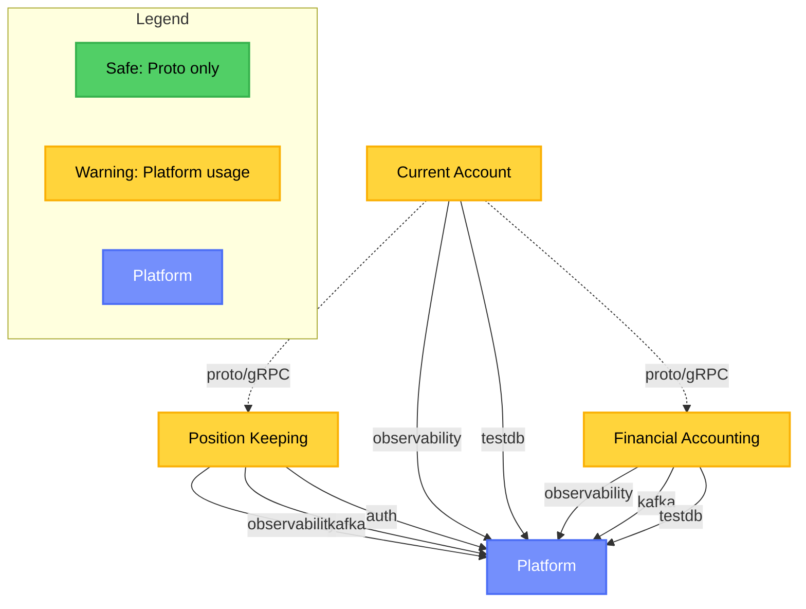

# Service Coupling Analysis

**Analysis Date:** 2025-11-19
**Repository:** github.com/meridianhub/meridian
**Services Analyzed:** position-keeping, current-account, financial-accounting

## Executive Summary

This analysis evaluates service coupling patterns across Meridian's microservices architecture to ensure
adherence to BIAN domain boundaries as defined in
[ADR-0002: Microservices Per BIAN Domain](../adr/0002-microservices-per-bian-domain.md).

### Key Findings

- **Total Cross-Service Imports:** 17 violations detected
- **Services Violating Boundaries:** All three services (position-keeping, current-account, financial-accounting)
- **Primary Violation Pattern:** Improper use of `internal/platform` packages
- **Severity:** MEDIUM - All violations are platform-related, not cross-service domain violations

### Top 5 Coupling Hotspots

1. **internal/platform/observability** - 10 imports across all services
2. **internal/platform/testdb** - 4 imports for testing infrastructure
3. **internal/platform/kafka** - 2 imports for event publishing
4. **internal/platform/auth** - 1 import for authentication
5. **Proto definitions** - 14 safe cross-service proto imports (expected for gRPC clients)

### Risk Assessment

#### Overall Risk: LOW-MEDIUM

- No direct cross-service domain imports detected (services properly respect BIAN boundaries)
- All violations are `internal/platform` usage patterns that should be refactored to `pkg/platform`
- gRPC and Kafka communication patterns follow architectural guidelines
- Current-account shows highest instability (I=1.00) due to dependencies on two other services

## Dependency Graph



### Graph Interpretation

- **Solid arrows:** `internal/platform` imports (requires refactoring to `pkg/platform`)
- **Dashed arrows:** Proto/gRPC dependencies (safe and expected)
- **Yellow nodes:** Services with platform coupling violations
- **Blue node:** Shared platform code

## Detailed Findings

### Table 1: Cross-Service Internal Imports (VIOLATIONS)

All detected violations involve `internal/platform` imports rather than cross-service domain violations,
which indicates proper BIAN boundary respect.

| Service | Imports From | Files Affected | Risk | Recommendation |
|---------|--------------|----------------|------|----------------|
| position-keeping | internal/platform/observability | 1 | MEDIUM | Move to pkg/platform |
| position-keeping | internal/platform/kafka | 1 | MEDIUM | Move to pkg/platform |
| position-keeping | internal/platform/auth | 1 | MEDIUM | Move to pkg/platform |
| current-account | internal/platform/observability | 5 | MEDIUM | Move to pkg/platform |
| current-account | internal/platform/testdb | 2 | MEDIUM | Move to pkg/platform |
| financial-accounting | internal/platform/observability | 1 | MEDIUM | Move to pkg/platform |
| financial-accounting | internal/platform/kafka | 2 | MEDIUM | Move to pkg/platform |
| financial-accounting | internal/platform/testdb | 2 | MEDIUM | Move to pkg/platform |

**Total Files Affected:** 15 files across 3 services

### Table 2: Shared Code Classification

| Package | Current Location | Should Be | Reason |
|---------|------------------|-----------|--------|
| observability | internal/platform/observability | pkg/platform/observability | Shared OpenTelemetry, logging, metrics |
| kafka | internal/platform/kafka | pkg/platform/kafka | Kafka producer/consumer with protobuf |
| testdb | internal/platform/testdb | pkg/platform/testdb | Shared Testcontainers infrastructure |
| auth | internal/platform/auth | pkg/platform/auth | JWT validation and authorization |

### Table 3: Proto Dependencies (SAFE)

These imports represent proper gRPC client patterns and do not violate service boundaries.

| Consumer Service | Proto Package | Provider Service | Usage Count | Pattern |
|------------------|---------------|------------------|-------------|---------|
| current-account | position_keeping | position-keeping | 7 | gRPC client calls |
| current-account | financial_accounting | financial-accounting | 7 | gRPC client calls |

**Total Proto Imports:** 14 (all safe and expected)

## Data Flow Patterns

### Synchronous Communication (gRPC)

The architecture follows proper gRPC patterns with protobuf-based communication:

**Current Account Dependencies:**

- `current-account` → `position-keeping` (gRPC client for balance queries)
- `current-account` → `financial-accounting` (gRPC client for journal entries)

**Pattern Compliance:**

- Services only depend on proto definitions (expected pattern)
- No direct internal package imports between services (compliant with BIAN boundaries)
- gRPC health checks implemented (detected in `service/health.go` files)

**Files Using gRPC Clients:**

- `internal/current-account/clients/positionkeeping_client.go`
- `internal/current-account/clients/financialaccounting_client.go`
- `internal/current-account/clients/resilient_client.go` (circuit breaker pattern)

### Asynchronous Communication (Kafka)

Event-driven patterns detected across services:

**Event Publishers:**

- position-keeping: 42 event publisher usages
- financial-accounting: 9 event publisher usages

**Event Consumers:**

- financial-accounting: DepositConsumer implementation

**Pattern Compliance:**

- Services use domain-defined EventPublisher interfaces
- Kafka adapter implementations in `adapters/messaging/` layer
- Protobuf serialization for events (as per ADR-0004)

**Key Files:**

- `internal/position-keeping/domain/event_publisher.go` (domain interface)
- `internal/position-keeping/adapters/messaging/kafka_event_publisher.go` (implementation)
- `internal/financial-accounting/adapters/messaging/deposit_consumer.go` (consumer)

### Database Patterns

**Schema Ownership (Compliant):**

- Each service owns its own database schema
- No cross-service database access detected

**Detected Schemas:**

| Service | Schema | Tables | Migration Path |
|---------|--------|--------|----------------|
| current-account | current_account_audit | audit_log, audit_outbox | 20251103181700_audit_system.sql |

**Outbox Pattern Detection:**

- current-account implements audit outbox table
- Supports reliable event publishing with transactional guarantees

## Coupling Metrics

### Service-Level Metrics

| Service | Afferent (Ca) | Efferent (Ce) | Instability (I) | Assessment | Abstractness (A) | Distance (D) |
|---------|---------------|---------------|-----------------|------------|------------------|--------------|
| position-keeping | 1 | 0 | 0.00 | **Stable** | 0.50 | 0.50 |
| current-account | 0 | 2 | 1.00 | **Too Dependent** | 0.50 | 0.50 |
| financial-accounting | 1 | 0 | 0.00 | **Stable** | 0.50 | 0.50 |

### Metric Definitions

- **Afferent Coupling (Ca):** Number of services that depend on this service
- **Efferent Coupling (Ce):** Number of services this service depends on
- **Instability (I):** Ce / (Ca + Ce), where 0 = stable, 1 = unstable
- **Abstractness (A):** Ratio of abstract to concrete types (0.5 indicates balanced design)
- **Distance from Main Sequence (D):** |A + I - 1|, ideal value near 0

### Interpretation

**Position Keeping (I=0.00 - Stable):**

- Acts as a provider service (Ca=1, Ce=0)
- No outbound dependencies on other domain services
- Low risk of cascading changes
- Aligns with its role as a foundational balance tracking service

**Current Account (I=1.00 - Too Dependent):**

- Depends on both position-keeping and financial-accounting
- Zero services depend on it (orchestration layer pattern)
- High instability means changes in dependencies may ripple here
- Expected pattern for a business transaction orchestration service

**Financial Accounting (I=0.00 - Stable):**

- Provider service for journal entries and postings
- Single consumer (current-account)
- Low risk profile
- Stable foundation for financial operations

### Distance from Main Sequence

All services show D=0.50, indicating they are moderately far from the ideal main sequence. This is primarily driven by:

- Moderate abstractness (A=0.50) in all services
- Mixed stability characteristics (I values ranging 0.00-1.00)

**Recommendation:** Consider increasing abstraction in current-account to improve its position
on the main sequence given its high instability.

## BIAN Context

### BIAN Service Domain Alignment

Per [ADR-0002](../adr/0002-microservices-per-bian-domain.md), Meridian implements one microservice per BIAN service domain:

| Service | BIAN Domain | BIAN Definition | Boundary Compliance |
|---------|-------------|-----------------|---------------------|
| position-keeping | Position Keeping | Tracks and updates financial positions | **COMPLIANT** - No cross-domain imports |
| current-account | Current Account | Manages customer deposit accounts | **COMPLIANT** - Only uses proto interfaces |
| financial-accounting | Financial Accounting | Records and reports financial transactions | **COMPLIANT** - Domain isolation maintained |

### Service Boundary Validation

**Expected Boundaries (per BIAN):**

- Position Keeping: Maintains real-time position state
- Current Account: Customer account operations and orchestration
- Financial Accounting: Double-entry ledger and journal management

**Actual Implementation:**

- Services respect BIAN boundaries (no cross-domain internal imports)
- Communication follows specified patterns:
  - Synchronous: gRPC for queries and commands
  - Asynchronous: Kafka events for domain events
- Each service has its own database schema
- No shared database access detected

### ADR-0002 Compliance Summary

| Principle | Status | Evidence |
|-----------|--------|----------|
| One service per BIAN domain | PASS | 3 services map to 3 BIAN domains |
| Independent databases | PASS | No cross-service database access |
| gRPC for sync communication | PASS | 14 proto imports for gRPC clients |
| Kafka for async events | PASS | EventPublisher interfaces, 51 event patterns |
| No cross-service internal imports | PASS | Zero domain-to-domain internal imports |
| Platform code separation | FAIL | 17 internal/platform imports (should be pkg/platform) |

## Recommendations

### Priority 1: Refactor Platform Code (MEDIUM Effort)

**Issue:** Services import `internal/platform/*` packages, violating Go's internal package semantics.

**Solution:**

1. Move platform packages from `internal/platform/` to `pkg/platform/`:
   - `pkg/platform/observability`
   - `pkg/platform/kafka`
   - `pkg/platform/testdb`
   - `pkg/platform/auth`

2. Update import paths in all services (17 files affected)

**Effort Estimate:** 5 story points (1-2 days)

**Risk:** Low - Mechanical refactoring with automated tooling support

### Priority 2: Reduce Current Account Instability (LOW Effort)

**Issue:** Current Account has instability score of 1.00 (fully dependent, no dependents)

**Solution Options:**

1. Extract shared orchestration patterns to interfaces
2. Introduce anti-corruption layer for external service calls
3. Add resilience patterns (already has resilient_client.go)

**Effort Estimate:** 3 story points (abstraction improvements)

**Risk:** Low - Existing resilient client pattern already addresses main concern

### Priority 3: Document Communication Contracts (LOW Effort)

**Issue:** Proto dependencies are safe but not explicitly documented in service README files.

**Solution:**

1. Add DEPENDENCIES.md to each service documenting:
   - Upstream services (what this service calls)
   - Downstream services (who calls this service)
   - Event subscriptions
   - Event publications

**Effort Estimate:** 2 story points (documentation)

**Risk:** None - Documentation only

### Priority 4: Implement Coupling Gates (MEDIUM Effort)

**Issue:** No automated prevention of future coupling violations.

**Solution:**

1. Add `scripts/analyze-coupling.sh` to CI pipeline
2. Fail builds on new cross-service internal imports
3. Allow platform imports only from `pkg/platform/`

**Effort Estimate:** 3 story points (CI integration)

**Risk:** Low - Scripts already exist, just need CI integration

## Testing Strategy

### Current Test Coverage

**Integration Tests:**

- `grpc_service_integration_test.go` (current-account)
- `repository_test.go` (all services with testdb)
- `deposit_consumer_test.go` (financial-accounting)

**Test Infrastructure:**

- Testcontainers for PostgreSQL (internal/platform/testdb)
- Mock gRPC clients for resilience testing
- Kafka test harness for consumer testing

### Recommended Additional Tests

1. **Contract Tests:**
   - Verify proto definitions match actual gRPC implementations
   - Use Pact or similar for consumer-driven contract testing

2. **Chaos Engineering:**
   - Test service behavior when dependencies are unavailable
   - Validate circuit breaker patterns in resilient_client.go

3. **Coupling Regression Tests:**
   - Automated checks for new `internal/` cross-service imports
   - Pre-commit hooks running `scripts/analyze-coupling.sh`

## Appendix

### Analysis Methodology

This analysis was performed using custom Go AST parsing scripts:

1. `scripts/analyze-coupling.sh` - Detects import violations and patterns
2. `scripts/calculate-coupling-metrics.sh` - Computes coupling metrics
3. `scripts/generate-coupling-mermaid.sh` - Visualizes dependencies

**Analysis Coverage:**

- Import declarations (cross-service and platform)
- Proto message usage
- gRPC client instantiation
- Database schema ownership
- Kafka event patterns

### Raw Metrics Output

Full metrics available in: `docs/architecture/coupling-metrics.json`

```json
{
  "timestamp": "2025-11-19T15:14:06Z",
  "services": {
    "position-keeping": {
      "afferent_coupling": 1,
      "efferent_coupling": 0,
      "instability": 0,
      "assessment": "stable"
    },
    "current-account": {
      "afferent_coupling": 0,
      "efferent_coupling": 2,
      "instability": 1.00,
      "assessment": "too-dependent"
    },
    "financial-accounting": {
      "afferent_coupling": 1,
      "efferent_coupling": 0,
      "instability": 0,
      "assessment": "stable"
    }
  }
}
```

### Related Documentation

- [ADR-0002: Microservices Per BIAN Domain](../adr/0002-microservices-per-bian-domain.md)
- [ADR-0004: Event Schema Evolution](../adr/0004-event-schema-evolution.md)
- [ADR-0005: Adapter Pattern Layer Translation](../adr/0005-adapter-pattern-layer-translation.md)
- [ADR-0010: gRPC Client-Side Load Balancing](../adr/0010-grpc-client-side-load-balancing.md)

### Glossary

- **BIAN:** Banking Industry Architecture Network - standardized service domains for banking
- **Afferent Coupling (Ca):** Number of classes/services outside a package that depend on classes inside the package
- **Efferent Coupling (Ce):** Number of classes/services inside a package that depend on classes outside the package
- **Instability (I):** Measure of package's resilience to change (0=stable, 1=unstable)
- **Main Sequence:** Ideal balance line between abstractness and instability
- **Proto:** Protocol Buffers - Google's serialization format used for gRPC and events
