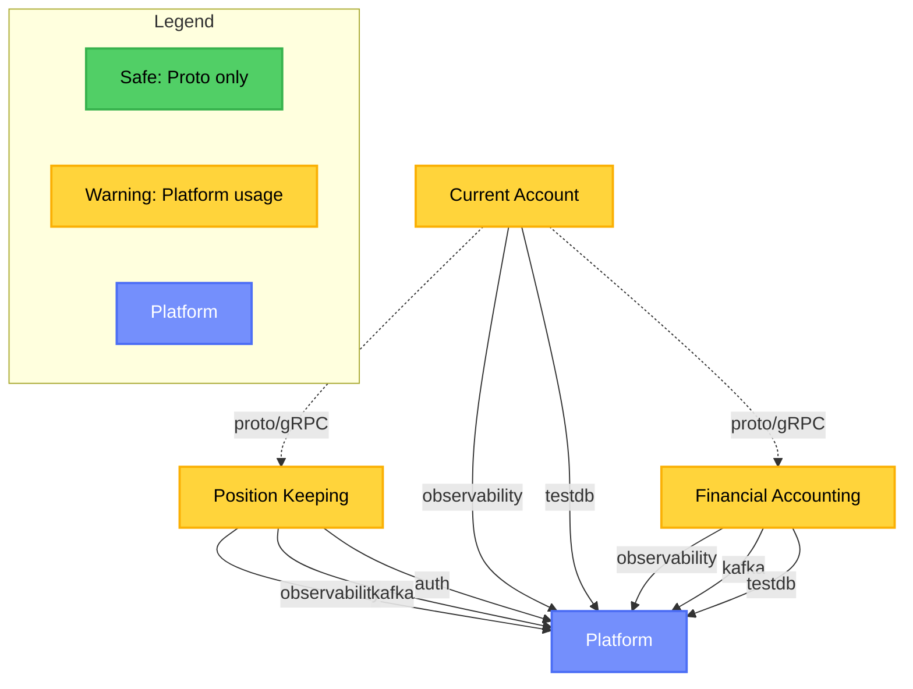

# Service Coupling Analysis

**Analysis Date:** 2025-11-19
**Repository:** github.com/meridianhub/meridian
**Services Analyzed:** position-keeping, current-account, financial-accounting

## Executive Summary

This analysis evaluates service coupling patterns across Meridian's microservices architecture to ensure
adherence to BIAN domain boundaries as defined in
[ADR-0002: Microservices Per BIAN Domain](../adr/0002-microservices-per-bian-domain.md).

### Key Findings

- **Total Cross-Service Imports:** 17 violations detected
- **Services Violating Boundaries:** All three services (position-keeping, current-account, financial-accounting)
- **Primary Violation Pattern:** Improper use of `internal/platform` packages
- **Severity:** MEDIUM - All violations are platform-related, not cross-service domain violations

### Top 5 Coupling Hotspots

1. **internal/platform/observability** - 10 imports across all services
2. **internal/platform/testdb** - 4 imports for testing infrastructure
3. **internal/platform/kafka** - 2 imports for event publishing
4. **internal/platform/auth** - 1 import for authentication
5. **Proto definitions** - 14 safe cross-service proto imports (expected for gRPC clients)

### Risk Assessment

#### Overall Risk: LOW-MEDIUM

- No direct cross-service domain imports detected (services properly respect BIAN boundaries)
- All violations are `internal/platform` usage patterns that should be refactored to `pkg/platform`
- gRPC and Kafka communication patterns follow architectural guidelines
- Current-account shows highest instability (I=1.00) due to dependencies on two other services

## Dependency Graph



### Graph Interpretation

- **Solid arrows:** `internal/platform` imports (requires refactoring to `pkg/platform`)
- **Dashed arrows:** Proto/gRPC dependencies (safe and expected)
- **Yellow nodes:** Services with platform coupling violations
- **Blue node:** Shared platform code

## Detailed Findings

### Table 1: Cross-Service Internal Imports (VIOLATIONS)

All detected violations involve `internal/platform` imports rather than cross-service domain violations,
which indicates proper BIAN boundary respect.

| Service | Imports From | Files Affected | Risk | Recommendation |
|---------|--------------|----------------|------|----------------|
| position-keeping | internal/platform/observability | 1 | MEDIUM | Move to pkg/platform |
| position-keeping | internal/platform/kafka | 1 | MEDIUM | Move to pkg/platform |
| position-keeping | internal/platform/auth | 1 | MEDIUM | Move to pkg/platform |
| current-account | internal/platform/observability | 5 | MEDIUM | Move to pkg/platform |
| current-account | internal/platform/testdb | 2 | MEDIUM | Move to pkg/platform |
| financial-accounting | internal/platform/observability | 1 | MEDIUM | Move to pkg/platform |
| financial-accounting | internal/platform/kafka | 2 | MEDIUM | Move to pkg/platform |
| financial-accounting | internal/platform/testdb | 2 | MEDIUM | Move to pkg/platform |

**Total Files Affected:** 15 files across 3 services

### Table 2: Shared Code Classification

| Package | Current Location | Should Be | Reason |
|---------|------------------|-----------|--------|
| observability | internal/platform/observability | pkg/platform/observability | Shared OpenTelemetry, logging, metrics |
| kafka | internal/platform/kafka | pkg/platform/kafka | Kafka producer/consumer with protobuf |
| testdb | internal/platform/testdb | pkg/platform/testdb | Shared Testcontainers infrastructure |
| auth | internal/platform/auth | pkg/platform/auth | JWT validation and authorisation |

### Table 3: Proto Dependencies (SAFE)

These imports represent proper gRPC client patterns and do not violate service boundaries.

| Consumer Service | Proto Package | Provider Service | Usage Count | Pattern |
|------------------|---------------|------------------|-------------|---------|
| current-account | position_keeping | position-keeping | 7 | gRPC client calls |
| current-account | financial_accounting | financial-accounting | 7 | gRPC client calls |

**Total Proto Imports:** 14 (all safe and expected)

## Data Flow Patterns

### Synchronous Communication (gRPC)

The architecture follows proper gRPC patterns with protobuf-based communication:

**Current Account Dependencies:**

- `current-account` → `position-keeping` (gRPC client for balance queries)
- `current-account` → `financial-accounting` (gRPC client for journal entries)

**Pattern Compliance:**

- Services only depend on proto definitions (expected pattern)
- No direct internal package imports between services (compliant with BIAN boundaries)
- gRPC health checks implemented (detected in `service/health.go` files)

**Files Using gRPC Clients:**

- `services/current-account/client/client.go`
- `shared/pkg/clients/resilient.go` (circuit breaker pattern)

### Asynchronous Communication (Kafka)

Event-driven patterns detected across services:

**Event Publishers:**

- position-keeping: 42 event publisher usages
- financial-accounting: 9 event publisher usages

**Event Consumers:**

- financial-accounting: DepositConsumer implementation

**Pattern Compliance:**

- Services use domain-defined EventPublisher interfaces
- Kafka adapter implementations in `adapters/messaging/` layer
- Protobuf serialisation for events (as per ADR-0004)

**Key Files:**

- `internal/position-keeping/domain/event_publisher.go` (domain interface)
- `internal/position-keeping/adapters/messaging/kafka_event_publisher.go` (implementation)
- `internal/financial-accounting/adapters/messaging/deposit_consumer.go` (consumer)

### Database Patterns

**Schema Ownership (Compliant):**

- Each service owns its own database schema
- No cross-service database access detected

**Detected Schemas:**

| Service | Schema | Tables | Migration Path |
|---------|--------|--------|----------------|
| current-account | current_account_audit | audit_log, audit_outbox | 20251103181700_audit_system.sql |

**Outbox Pattern Detection:**

- current-account implements audit outbox table
- Supports reliable event publishing with transactional guarantees

## Coupling Metrics

### Service-Level Metrics

| Service | Afferent (Ca) | Efferent (Ce) | Instability (I) | Assessment | Abstractness (A) | Distance (D) |
|---------|---------------|---------------|-----------------|------------|------------------|--------------|
| position-keeping | 1 | 0 | 0.00 | **Stable** | 0.50 | 0.50 |
| current-account | 0 | 2 | 1.00 | **Too Dependent** | 0.50 | 0.50 |
| financial-accounting | 1 | 0 | 0.00 | **Stable** | 0.50 | 0.50 |

### Metric Definitions

- **Afferent Coupling (Ca):** Number of services that depend on this service
- **Efferent Coupling (Ce):** Number of services this service depends on
- **Instability (I):** Ce / (Ca + Ce), where 0 = stable, 1 = unstable
- **Abstractness (A):** Ratio of abstract to concrete types (0.5 indicates balanced design)
- **Distance from Main Sequence (D):** |A + I - 1|, ideal value near 0

### Interpretation

**Position Keeping (I=0.00 - Stable):**

- Acts as a provider service (Ca=1, Ce=0)
- No outbound dependencies on other domain services
- Low risk of cascading changes
- Aligns with its role as a foundational balance tracking service

**Current Account (I=1.00 - Too Dependent):**

- Depends on both position-keeping and financial-accounting
- Zero services depend on it (orchestration layer pattern)
- High instability means changes in dependencies may ripple here
- Expected pattern for a business transaction orchestration service

**Financial Accounting (I=0.00 - Stable):**

- Provider service for journal entries and postings
- Single consumer (current-account)
- Low risk profile
- Stable foundation for financial operations

### Distance from Main Sequence

All services show D=0.50, indicating they are moderately far from the ideal main sequence. This is primarily driven by:

- Moderate abstractness (A=0.50) in all services
- Mixed stability characteristics (I values ranging 0.00-1.00)

**Recommendation:** Consider increasing abstraction in current-account to improve its position
on the main sequence given its high instability.

## BIAN Context

### BIAN Service Domain Alignment

Per [ADR-0002](../adr/0002-microservices-per-bian-domain.md), Meridian implements one microservice per BIAN service domain:

| Service | BIAN Domain | BIAN Definition | Boundary Compliance |
|---------|-------------|-----------------|---------------------|
| position-keeping | Position Keeping | Tracks and updates financial positions | **COMPLIANT** - No cross-domain imports |
| current-account | Current Account | Manages customer deposit accounts | **COMPLIANT** - Only uses proto interfaces |
| financial-accounting | Financial Accounting | Records and reports financial transactions | **COMPLIANT** - Domain isolation maintained |

### Service Boundary Validation

**Expected Boundaries (per BIAN):**

- Position Keeping: Maintains real-time position state
- Current Account: Customer account operations and orchestration
- Financial Accounting: Double-entry ledger and journal management

**Actual Implementation:**

- Services respect BIAN boundaries (no cross-domain internal imports)
- Communication follows specified patterns:
  - Synchronous: gRPC for queries and commands
  - Asynchronous: Kafka events for domain events
- Each service has its own database schema
- No shared database access detected

### ADR-0002 Compliance Summary

| Principle | Status | Evidence |
|-----------|--------|----------|
| One service per BIAN domain | PASS | 3 services map to 3 BIAN domains |
| Independent databases | PASS | No cross-service database access |
| gRPC for sync communication | PASS | 14 proto imports for gRPC clients |
| Kafka for async events | PASS | EventPublisher interfaces, 51 event patterns |
| No cross-service internal imports | PASS | Zero domain-to-domain internal imports |
| Platform code separation | FAIL | 17 internal/platform imports (should be pkg/platform) |

## Prioritized Remediation Plan

This section provides actionable remediation steps with specific file paths, effort estimates, and dependencies.
All items are categorized by priority based on their impact on service independence and architectural health.

### Priority Legend

- **P0 - Critical**: Breaks service independence and violates BIAN domain boundaries
- **P1 - High**: Architectural debt that increases technical risk and maintenance burden
- **P2 - Medium**: Code organisation issues that affect code clarity and maintenance

### P0 - Critical (Breaks Service Independence)

**Status:** Currently, no P0 violations exist in the codebase. All services properly respect BIAN domain
boundaries with zero cross-service internal imports detected.

**Prevention:** The absence of P0 violations demonstrates proper architectural discipline. To maintain this:

- Enable CI gates (see P1-1 below) to prevent future violations
- Require architectural review for any new service dependencies
- Maintain strict separation between `internal/` packages across services

### P1 - High (Architectural Debt)

#### P1-1: Migrate Platform Code from internal/platform to pkg/platform

**Problem:** Services import `internal/platform/*` packages, violating Go's internal package semantics.
The `internal/` directory is meant for code that should not be imported by other modules, but our services
need shared platform utilities.

**Impact:**

- Violates Go module semantics (15 files affected across 3 services)
- Prevents platform code reuse by external tools or future services
- Creates confusion about which code is truly internal vs shared

**Affected Files (15 total):**

**Observability (7 files):**

- `cmd/current-account/main.go:18`
- `cmd/financial-accounting/main.go:17`
- `internal/current-account/service/grpc_service.go:22`
- `services/current-account/client/client.go:10`
- `services/current-account/client/client_test.go:8`
- `internal/position-keeping/app/container.go:10`

**Kafka (2 files):**

- `internal/position-keeping/adapters/messaging/kafka_event_publisher_test.go:9`
- `internal/financial-accounting/adapters/messaging/deposit_consumer.go:12`
- `internal/financial-accounting/adapters/messaging/deposit_consumer_test.go:12`

**TestDB (4 files):**

- `internal/current-account/adapters/persistence/repository_test.go:10`
- `internal/current-account/service/grpc_service_test.go:12`
- `internal/financial-accounting/adapters/persistence/repository_test.go:12`
- `internal/financial-accounting/service/posting_service_test.go:11`
- `internal/financial-accounting/adapters/messaging/deposit_consumer_test.go:13`

**Auth (1 file):**

- `internal/position-keeping/app/container.go:9`

**Solution:**

**Step 1: Create pkg/platform structure** (1 story point)

```bash
mkdir -p pkg/platform/{observability,kafka,testdb,auth}
```

**Step 2: Move platform packages** (2 story points)

- Move `internal/platform/observability` → `pkg/platform/observability`
- Move `internal/platform/kafka` → `pkg/platform/kafka`
- Move `internal/platform/testdb` → `pkg/platform/testdb`
- Move `internal/platform/auth` → `pkg/platform/auth`
- Preserve git history using `git mv`

**Step 3: Update import paths** (2 story points)

```bash
# Automated with find/replace
find ./cmd ./internal -name "*.go" -exec sed -i '' \
  's|github.com/meridianhub/meridian/internal/platform|github.com/meridianhub/meridian/pkg/platform|g' {} \;
```

**Step 4: Verify with tests** (1 story point)

```bash
# Run all tests to ensure no regressions
make test

# Run coupling analysis to verify fix
./scripts/analyze-coupling.sh | jq '.violations[] | select(.type == "internal-platform-import")'
# Should return empty
```

**Effort Estimate:** 5 story points (1-2 days)

**Dependencies:** None - can be done independently

**Risk:** Low - Mechanical refactoring with automated tooling support. No business logic changes.

**Alignment:**

- **ADR-0002:** Supports proper platform code separation for microservices
- **ADR-0005:** Platform adapters remain reusable across services

**Related Tasks:** Foundation for all future platform work

---

#### P1-2: Reduce Current Account Service Instability

**Problem:** Current Account service has an instability score of 1.00 (I=Ce/(Ca+Ce) = 2/(0+2) = 1.00),
indicating it depends on two services (position-keeping, financial-accounting) but has zero services
depending on it.

**Impact:**

- High change propagation risk - changes in dependencies ripple here
- Service acts as orchestration layer without its own dependents
- Distance from main sequence (D=0.50) indicates room for architectural improvement

**Why This Matters:**
This is expected for an orchestration service but indicates architectural fragility. The service is vulnerable
to changes in both position-keeping and financial-accounting.

**Affected Components:**

- `services/current-account/client/client.go` (depends on position-keeping and financial-accounting)
- `shared/pkg/clients/resilient.go` (circuit breaker - partial mitigation)
- `shared/pkg/clients/circuitbreaker.go` (circuit breaker implementation)

**Solution Options:**

**Option A: Enhance Anti-Corruption Layer** (Recommended - 3 story points)

```go
// Add abstraction layer between current-account and dependencies

// Define domain-level interfaces (not proto-coupled)
type PositionReader interface {
    GetBalance(ctx context.Context, accountID string) (Balance, error)
}

type JournalWriter interface {
    RecordEntry(ctx context.Context, entry JournalEntry) error
}

// Implement adapters that translate to gRPC
type PositionKeepingAdapter struct {
    client pb.PositionKeepingServiceClient
}

func (a *PositionKeepingAdapter) GetBalance(ctx context.Context, accountID string) (Balance, error) {
    // Translate domain request → proto → domain response
    // Insulates current-account from proto changes in position-keeping
}
```

**Option B: Extract Orchestration Patterns** (5 story points)

- Create shared `pkg/orchestration` package with Saga patterns
- Move orchestration logic out of current-account
- Benefits future services that need similar patterns

**Option C: Accept Current State** (0 story points)

- Instability is expected for orchestration services
- Existing `resilient_client.go` already mitigates cascade failures
- No action needed unless change frequency becomes problematic

**Effort Estimate:** 3 story points (Option A recommended)

**Dependencies:** None - orthogonal to other remediation items

**Risk:** Medium - Requires careful testing of service interactions

**Alignment:**

- **ADR-0002:** Maintains service independence through abstraction
- **ADR-0005:** Anti-corruption layer follows adapter pattern

**Related Tasks:** Consider in future architecture reviews

---

### P2 - Medium (Code Organisation)

#### P2-1: Document Inter-Service Communication Contracts

**Problem:** Proto dependencies are architecturally sound but not explicitly documented in service-level
documentation. Developers need to read code to understand service dependencies.

**Impact:**

- Onboarding friction for new developers
- Difficult to visualize system architecture
- Risk of undocumented breaking changes

**Solution:**

Create `DEPENDENCIES.md` in each service directory documenting:

**Template:**

```markdown
# Service Dependencies

## Upstream Services (What We Call)

### position-keeping
- **Protocol:** gRPC
- **Proto:** `api/proto/meridian/position_keeping/v1`
- **Usage:** Balance queries for account operations
- **Files:** `services/current-account/client/client.go`

## Downstream Services (Who Calls Us)

None - current-account is an orchestration service with no direct dependents.

## Event Publications

None - current-account does not publish domain events.

## Event Subscriptions

None - current-account operates synchronously via gRPC.
```

**Files to Create:**

- `cmd/current-account/DEPENDENCIES.md`
- `cmd/position-keeping/DEPENDENCIES.md`
- `cmd/financial-accounting/DEPENDENCIES.md`

**Effort Estimate:** 2 story points (1 file per service × 3 services)

**Dependencies:** None - pure documentation

**Risk:** None - documentation only

**Alignment:**

- **ADR-0002:** Documents microservices communication patterns
- General best practice for microservices architectures

**Related Tasks:** Update during onboarding documentation refresh

---

#### P2-2: Implement Automated Coupling Gates in CI

**Problem:** No automated prevention of future coupling violations. Developers can accidentally introduce
cross-service imports without immediate feedback.

**Impact:**

- Risk of architectural drift over time
- Coupling violations only caught in code review (if at all)
- No historical tracking of coupling metrics

**Solution:**

**Step 1: Add CI script** (1 story point)

```yaml
# .github/workflows/coupling-check.yml
name: Service Coupling Analysis

on: [pull_request]

jobs:
  coupling-check:
    runs-on: ubuntu-latest
    steps:
      - uses: actions/checkout@v3
      - name: Run coupling analysis
        run: ./scripts/analyze-coupling.sh > coupling-report.json
      - name: Check for violations
        run: |
          VIOLATIONS=$(jq '.violations | length' coupling-report.json)
          if [ "$VIOLATIONS" -gt 0 ]; then
            echo "❌ Found $VIOLATIONS coupling violations"
            jq '.violations[]' coupling-report.json
            exit 1
          fi
          echo "✅ No coupling violations detected"
      - name: Upload coupling metrics
        uses: actions/upload-artifact@v3
        with:
          name: coupling-metrics
          path: coupling-report.json
```

**Step 2: Add pre-commit hook** (1 story point)

```bash
# .git/hooks/pre-commit
#!/bin/bash
./scripts/analyze-coupling.sh > /tmp/coupling-report.json
VIOLATIONS=$(jq '.violations | length' /tmp/coupling-report.json)
if [ "$VIOLATIONS" -gt 0 ]; then
  echo "⚠️  Warning: $VIOLATIONS coupling violations detected"
  echo "Run './scripts/analyze-coupling.sh' for details"
  # Non-blocking warning (change to 'exit 1' for blocking)
fi
```

**Step 3: Add coupling metrics dashboard** (1 story point)

- Store coupling metrics history in Git
- Track instability trends over time
- Visualize in README or docs site

**Effort Estimate:** 3 story points

**Dependencies:**

- Should be implemented after P1-1 (platform migration) to avoid false positives
- Requires P1-1 completion first

**Risk:** Low - Scripts already exist, just need CI integration

**Alignment:**

- **ADR-0002:** Enforces microservices boundaries automatically
- Continuous architecture validation

**Related Tasks:** Part of broader CI/CD improvements

---

### Summary Table

| ID | Priority | Description | Effort (SP) | Risk | Dependencies |
|----|----------|-------------|-------------|------|--------------|
| P1-1 | High | Migrate internal/platform to pkg/platform | 5 | Low | None |
| P1-2 | High | Reduce current-account instability | 3 | Medium | None |
| P2-1 | Medium | Document service dependencies | 2 | None | None |
| P2-2 | Medium | Implement CI coupling gates | 3 | Low | P1-1 |

**Total Effort:** 13 story points (approximately 2-3 weeks for one developer)

**Recommended Execution Order:**

1. **P1-1** (Week 1) - Platform migration unblocks everything else
2. **P2-2** (Week 1-2) - CI gates prevent regression after P1-1
3. **P2-1** (Week 2) - Documentation can happen in parallel
4. **P1-2** (Week 3) - Architectural improvement, consider in next sprint

---

### Maintenance and Monitoring

After implementing remediation items:

**Continuous Monitoring:**

- Run `./scripts/analyze-coupling.sh` weekly to track metrics
- Review coupling metrics in sprint retrospectives
- Alert on instability score changes > 0.2

**Quarterly Review:**

- Reassess service boundaries and communication patterns
- Evaluate new coupling patterns from feature development
- Update this remediation plan with new findings

**Success Criteria:**

- Zero `internal-platform-import` violations (tracked in CI)
- All services maintain I < 0.8 (instability score)
- Service dependency graph matches BIAN architecture
- < 5 minutes for new developers to understand service dependencies (via DEPENDENCIES.md)

## Testing Strategy

### Current Test Coverage

**Integration Tests:**

- `grpc_service_integration_test.go` (current-account)
- `repository_test.go` (all services with testdb)
- `deposit_consumer_test.go` (financial-accounting)

**Test Infrastructure:**

- Testcontainers for PostgreSQL (internal/platform/testdb)
- Mock gRPC clients for resilience testing
- Kafka test harness for consumer testing

### Recommended Additional Tests

1. **Contract Tests:**
   - Verify proto definitions match actual gRPC implementations
   - Use Pact or similar for consumer-driven contract testing

2. **Chaos Engineering:**
   - Test service behaviour when dependencies are unavailable
   - Validate circuit breaker patterns in resilient_client.go

3. **Coupling Regression Tests:**
   - Automated checks for new `internal/` cross-service imports
   - Pre-commit hooks running `scripts/analyze-coupling.sh`

## Appendix

### Analysis Methodology

This analysis was performed using custom Go AST parsing scripts:

1. `scripts/analyze-coupling.sh` - Detects import violations and patterns
2. `scripts/calculate-coupling-metrics.sh` - Computes coupling metrics
3. `scripts/generate-coupling-mermaid.sh` - Visualizes dependencies

**Analysis Coverage:**

- Import declarations (cross-service and platform)
- Proto message usage
- gRPC client instantiation
- Database schema ownership
- Kafka event patterns

### Raw Metrics Output

Full metrics available in: `docs/architecture/coupling-metrics.json`

```json
{
  "timestamp": "2025-11-19T15:14:06Z",
  "services": {
    "position-keeping": {
      "afferent_coupling": 1,
      "efferent_coupling": 0,
      "instability": 0,
      "assessment": "stable"
    },
    "current-account": {
      "afferent_coupling": 0,
      "efferent_coupling": 2,
      "instability": 1.00,
      "assessment": "too-dependent"
    },
    "financial-accounting": {
      "afferent_coupling": 1,
      "efferent_coupling": 0,
      "instability": 0,
      "assessment": "stable"
    }
  }
}
```

### Related Documentation

- [ADR-0002: Microservices Per BIAN Domain](../adr/0002-microservices-per-bian-domain.md)
- [ADR-0004: Event Schema Evolution](../adr/0004-event-schema-evolution.md)
- [ADR-0005: Adapter Pattern Layer Translation](../adr/0005-adapter-pattern-layer-translation.md)
- [ADR-0010: gRPC Client-Side Load Balancing](../adr/0010-grpc-client-side-load-balancing.md)

### Glossary

- **BIAN:** Banking Industry Architecture Network - standardized service domains for banking
- **Afferent Coupling (Ca):** Number of classes/services outside a package that depend on classes inside the package
- **Efferent Coupling (Ce):** Number of classes/services inside a package that depend on classes outside the package
- **Instability (I):** Measure of package's resilience to change (0=stable, 1=unstable)
- **Main Sequence:** Ideal balance line between abstractness and instability
- **Proto:** Protocol Buffers - Google's serialisation format used for gRPC and events
