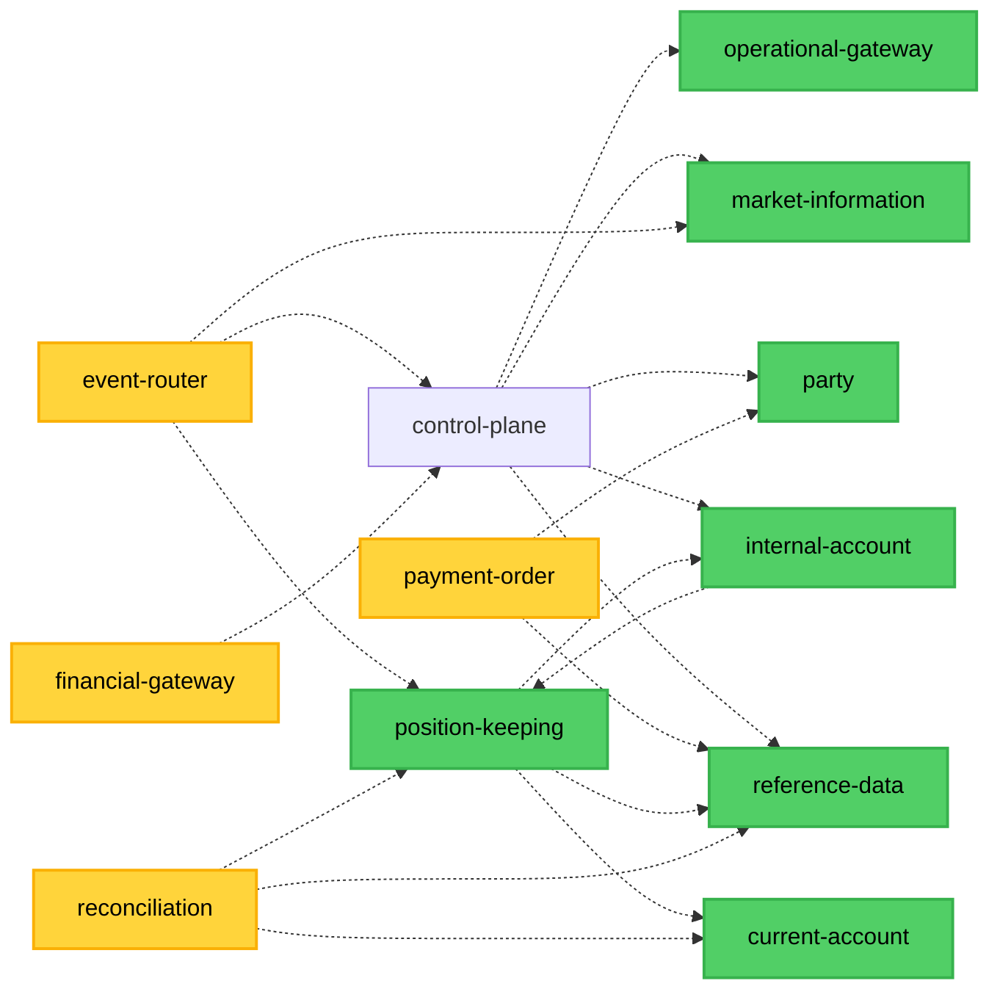

# Service Coupling Analysis

**Analysis Date:** 2026-06-08
**Repository:** github.com/meridianhub/meridian
**Services Analyzed:** All 19 services under `services/` (api-gateway, audit-worker, control-plane,
current-account, event-router, financial-accounting, financial-gateway, forecasting, identity,
internal-account, market-information, mcp-server, operational-gateway, party, payment-order,
position-keeping, reconciliation, reference-data, tenant)

> **Methodology note (2026-06-08 refresh):** The codebase has since migrated services out of the
> top-level `internal/` tree into `services/<service>/`, and platform code out of `internal/platform/`
> into `shared/platform/`. The `scripts/analyze-coupling.sh` helper still discovers services by scanning
> the top-level `internal/` directory, which now contains only `bootstrap` and `migrations`. As a result
> the script reports zero domain services and cannot produce current coupling metrics until it is updated
> to scan `services/` (see [P1-3](#p1-3-update-coupling-tooling-to-scan-services)). The figures below were
> derived directly from the `services/` tree using `rg` over cross-service gRPC client instantiation,
> Kafka topic usage, and import paths.

## Executive Summary

This analysis evaluates service coupling patterns across Meridian's microservices architecture to ensure
adherence to BIAN domain boundaries as defined in
[ADR-0002: Microservices Per BIAN Domain](../adr/0002-microservices-per-bian-domain.md).

### Key Findings

- **Cross-service internal imports:** 0 - no service imports another service's internal packages
- **Platform code location:** `shared/platform/` (the `internal/platform` → shared migration is complete;
  see [P1-1](#p1-1-migrate-platform-code-out-of-internalplatform-completed)). Shared reusable libraries
  also live under `shared/pkg/` and `shared/domain/`.
- **Inter-service communication:** synchronous gRPC clients and asynchronous Kafka events only, consistent
  with ADR-0002 and ADR-0004
- **Severity:** LOW - BIAN domain boundaries are respected across all 19 services

### Top Coupling Hotspots (Provider Services)

Afferent coupling (how many other services call a service over gRPC) concentrates on foundational
provider/registry services:

1. **reference-data** - depended on by 5 services (instrument/account-type/saga registry lookups)
2. **position-keeping** - depended on by 4 services (balance and position queries)
3. **control-plane** - depended on by 3 services (manifest history, saga orchestration)
4. **market-information** - depended on by 3 services (price observations)
5. **mcp-server** - pure consumer/aggregator (depends on 7 services, no inbound dependencies)

### Risk Assessment

#### Overall Risk: LOW

- No cross-service domain imports detected (services properly respect BIAN boundaries)
- Platform code now lives in `shared/platform/`, so the former `internal/platform` violation class no
  longer exists
- gRPC and Kafka communication patterns follow architectural guidelines
- Pure-consumer services (mcp-server, event-router, payment-order, financial-gateway) show high
  instability (I=1.00) by design - they orchestrate or aggregate without exposing inbound dependencies

## Dependency Graph

Edges show cross-service gRPC client dependencies (consumer → provider) derived from
`New<Service>ServiceClient` instantiation in non-test code under `services/`. All edges are dashed because
every inter-service call goes through proto/gRPC - there are no cross-service internal imports. The
`mcp-server` aggregator (consumes 7 services for the MCP tool surface) is omitted from the graph to reduce
clutter; it is reflected in the metrics table below.



### Graph Interpretation

- **Dashed arrows:** Proto/gRPC dependencies (the only permitted inter-service coupling)
- **Green nodes:** Provider services with inbound dependencies (afferent coupling)
- **Yellow nodes:** Pure-consumer/orchestration services (no inbound dependencies)
- **No solid arrows:** There are zero cross-service internal package imports - platform code is shared
  via `shared/platform/` and `shared/pkg/`, not via cross-service imports

## Detailed Findings

### Table 1: Cross-Service Internal Imports (VIOLATIONS)

No cross-service internal imports were detected. Services under `services/` do not import another
service's `internal/` packages; inter-service interaction is primarily via proto/gRPC and Kafka. A small
number of shared domain types are imported across services as a known, allowlisted pattern (for example
`api-gateway` importing `identity`/`tenant` domain types and `event-router` importing `audit-worker`
domain types); these are tracked separately in architecture tests and are not boundary violations.

**Total internal-package violations:** 0

The former violation class - services importing `internal/platform/*` - no longer applies because platform
code has been relocated to `shared/platform/` (see Table 2). Shared infrastructure is now imported through
its public `shared/...` path by design, which does not violate Go internal-package semantics.

### Table 2: Shared Code Location (current)

| Package family | Location | Examples | Purpose |
|----------------|----------|----------|---------|
| Platform infrastructure | `shared/platform/` | observability, kafka, events, db, auth, testdb, scheduler, ratelimit, gateway, tenant | Cross-cutting runtime infrastructure |
| Reusable libraries | `shared/pkg/` | clients, saga, money, amount, cel, validation, idempotency, grpc, health, valuation | Domain-agnostic helpers and patterns |
| Shared domain models | `shared/domain/` | models, common entity types | Types shared across service domains |

### Table 3: Cross-Service gRPC Dependencies (SAFE)

These edges represent proper gRPC client patterns (consumer service constructs the provider's generated
client). They do not violate service boundaries.

| Consumer Service | Provider Service(s) | Pattern |
|------------------|---------------------|---------|
| control-plane | reference-data, internal-account, market-information, party, operational-gateway | gRPC client calls |
| event-router | control-plane, market-information, position-keeping | gRPC client calls |
| financial-gateway | control-plane | gRPC client calls |
| internal-account | position-keeping | gRPC client calls |
| payment-order | party, reference-data | gRPC client calls |
| position-keeping | current-account, internal-account, reference-data | gRPC client calls |
| reconciliation | current-account, position-keeping, reference-data | gRPC client calls |
| mcp-server | reconciliation, control-plane, financial-accounting, market-information, operational-gateway, position-keeping, reference-data | MCP tool aggregator (read-only client surface) |

Provider/registry RPCs (saga registry, account-type registry) are served by `reference-data`; manifest
history and economy-generation RPCs are served by `control-plane`; provider-connection and
instruction-route RPCs are served by `operational-gateway`.

## Data Flow Patterns

### Synchronous Communication (gRPC)

The architecture follows proper gRPC patterns with protobuf-based communication. Each consuming service
constructs the provider's generated client (see Table 3). Representative dependencies:

- `position-keeping` → `reference-data`, `internal-account`, `current-account`
- `reconciliation` → `current-account`, `position-keeping`, `reference-data`
- `control-plane` → `reference-data`, `internal-account`, `market-information`, `party`, `operational-gateway`

**Pattern Compliance:**

- Services only depend on generated proto clients (expected pattern)
- No direct internal package imports between services (compliant with BIAN boundaries)
- Resilience (retry, circuit breaker) provided by `shared/pkg/clients`

### Asynchronous Communication (Kafka)

Event-driven publishing and consumption is implemented through the outbox pattern. The canonical machine-
readable list of all Kafka topics lives at `shared/platform/events/topics/topics.yaml` (48 topics across
11 publishing service groups), with Go constants in `shared/platform/events/topics/topics.go`.

**Event Publishers (outbox-based):** current-account, internal-account, financial-accounting,
market-information, payment-order, position-keeping, party, reconciliation, operational-gateway,
financial-gateway

**Event Consumers:** financial-accounting (deposit consumer), payment-order (payment event consumer),
event-router (audit consumer), audit-worker (audit consumer)

**Pattern Compliance:**

- Services use domain-defined `EventPublisher` interfaces with outbox adapters in `adapters/messaging/`
  (or `service/` for some services)
- Protobuf serialization for events (as per ADR-0004)
- Shared outbox implementation: `shared/platform/events/outbox.go`

**Key Files:**

- `services/position-keeping/domain/event_publisher.go` (domain interface)
- `services/position-keeping/adapters/messaging/outbox_event_publisher.go` (outbox publisher)
- `services/financial-accounting/adapters/messaging/deposit_consumer.go` (consumer)

### Database Patterns

**Schema Ownership (Compliant):**

- Each service owns its own database schema and migrations under `services/<service>/migrations/`
- No cross-service database access detected
- Migrations are managed by Atlas (per-service `atlas/atlas.hcl`), not Flyway

**Outbox Pattern:**

- Publishing services maintain an outbox table written in the same transaction as the state change
- A background poller publishes to Kafka, providing at-least-once delivery (see
  [Event-Driven Architecture](event-driven-architecture.md))

## Coupling Metrics

### Service-Level Metrics

Afferent (Ca) and efferent (Ce) coupling below are computed from cross-service gRPC client edges under
`services/` (Table 3), excluding self-references. Abstractness is not recomputed in this refresh (the
former tooling that produced it is stale); the column is omitted pending a tooling update.

| Service | Afferent (Ca) | Efferent (Ce) | Instability (I) | Assessment |
|---------|---------------|---------------|-----------------|------------|
| reference-data | 5 | 0 | 0.00 | **Stable** (foundational registry/provider) |
| position-keeping | 4 | 3 | 0.43 | Balanced (provider and consumer) |
| control-plane | 3 | 5 | 0.63 | Orchestrator (depends on more than depend on it) |
| market-information | 3 | 0 | 0.00 | **Stable** provider |
| current-account | 2 | 0 | 0.00 | **Stable** provider |
| internal-account | 2 | 1 | 0.33 | Mostly stable provider |
| party | 2 | 0 | 0.00 | **Stable** provider |
| operational-gateway | 2 | 0 | 0.00 | **Stable** provider |
| financial-accounting | 1 | 0 | 0.00 | **Stable** provider |
| reconciliation | 1 | 3 | 0.75 | Consumer-heavy |
| payment-order | 0 | 2 | 1.00 | Pure consumer (orchestration) |
| event-router | 0 | 3 | 1.00 | Pure consumer (event fan-out) |
| financial-gateway | 0 | 1 | 1.00 | Pure consumer |
| mcp-server | 0 | 7 | 1.00 | Pure consumer (MCP aggregator) |
| tenant | 0 | 0 | n/a | Isolated (no cross-service gRPC edges) |

Services with no cross-service gRPC edges in either direction (api-gateway, audit-worker, forecasting,
identity) are omitted; they interact via Kafka and the gateway layer rather than direct gRPC clients.

### Metric Definitions

- **Afferent Coupling (Ca):** Number of services that depend on this service
- **Efferent Coupling (Ce):** Number of services this service depends on
- **Instability (I):** Ce / (Ca + Ce), where 0 = stable, 1 = unstable

### Interpretation

**reference-data (I=0.00 - Stable):**

- Highest afferent coupling (Ca=5): instrument, account-type, and saga-registry lookups make it a
  foundational provider
- No outbound gRPC dependencies on other domain services
- Changes here have the widest blast radius - treat its proto surface as a stable contract

**position-keeping (I=0.43 - Balanced):**

- Both a provider (Ca=4: event-router, internal-account, reconciliation, mcp-server) and a consumer
  (Ce=3: current-account, internal-account, reference-data)
- Central to the position/balance flow; sits near the middle of the stability spectrum

**control-plane (I=0.63 - Orchestrator):**

- Depends on five services to orchestrate manifests and sagas while three services depend on its manifest
  history and economy-generation RPCs
- Higher instability is expected for an orchestration layer

**Pure consumers (I=1.00 - payment-order, event-router, financial-gateway, mcp-server):**

- Zero services depend on them; they aggregate or orchestrate
- High instability is by design - changes in their dependencies may ripple here, but nothing downstream
  depends on them

### Stability Observations

The topology is healthy: foundational providers (reference-data, market-information, party,
current-account, financial-accounting) are stable (I=0.00), while orchestration and aggregation layers
(control-plane, event-router, payment-order, mcp-server) carry the instability by design. There are no
cyclic cross-service gRPC dependencies in the edges sampled.

## BIAN Context

### BIAN Service Domain Alignment

Per [ADR-0002](../adr/0002-microservices-per-bian-domain.md), Meridian implements one microservice per BIAN service domain:

| Service | BIAN Domain | BIAN Definition | Boundary Compliance |
|---------|-------------|-----------------|---------------------|
| position-keeping | Position Keeping | Tracks and updates financial positions | **COMPLIANT** - No cross-domain imports |
| current-account | Current Account | Manages customer deposit accounts | **COMPLIANT** - Only uses proto interfaces |
| financial-accounting | Financial Accounting | Records and reports financial transactions | **COMPLIANT** - Domain isolation maintained |
| market-information | Market Information Management | Captures market price observations | **COMPLIANT** - Provider only |
| party | Party Reference Data Management | Party registration and lifecycle (KYC/AML) | **COMPLIANT** - Provider only |
| internal-account | Internal Account / Bank Internal Position | Internal facility and booking management | **COMPLIANT** |
| reference-data | (Platform) Product/Instrument Directory | Instrument, account-type, and saga registry | **COMPLIANT** - Provider only |
| reconciliation | Reconciliation | Settlement reconciliation and variance detection | **COMPLIANT** |
| payment-order | Payment Order | Payment order lifecycle orchestration | **COMPLIANT** - Consumer/orchestrator |
| operational-gateway | (Platform) Operational Instruction Routing | Instruction dispatch to external providers | **COMPLIANT** |
| financial-gateway | (Platform) Payment Provider Gateway | Inbound payment-provider webhooks | **COMPLIANT** |
| control-plane | (Platform) Manifest and Saga Orchestration | Economy manifest apply and saga execution | **COMPLIANT** - Orchestrator |

A complete BIAN domain mapping for all services is maintained in
[BIAN Service Boundaries](bian-service-boundaries.md).

### Service Boundary Validation

**Actual Implementation:**

- Services respect BIAN boundaries (no cross-domain internal imports)
- Communication follows specified patterns:
  - Synchronous: gRPC for queries and commands
  - Asynchronous: Kafka events for domain events
- Each service has its own database schema and Atlas migrations
- No shared database access detected

### ADR-0002 Compliance Summary

| Principle | Status | Evidence |
|-----------|--------|----------|
| One service per BIAN domain | PASS | 19 services under `services/` map to distinct domains |
| Independent databases | PASS | No cross-service database access; per-service Atlas migrations |
| gRPC for sync communication | PASS | Cross-service calls use generated proto clients (Table 3) |
| Kafka for async events | PASS | Outbox publishers + 48 registered topics (`topics.yaml`) |
| No cross-service internal imports | PASS | Zero domain-to-domain internal imports |
| Platform code separation | PASS | Platform code relocated to `shared/platform/` (P1-1 complete) |

## Prioritized Remediation Plan

This section provides actionable remediation steps with specific file paths, effort estimates, and dependencies.
All items are categorized by priority based on their impact on service independence and architectural health.

### Priority Legend

- **P0 - Critical**: Breaks service independence and violates BIAN domain boundaries
- **P1 - High**: Architectural debt that increases technical risk and maintenance burden
- **P2 - Medium**: Code organization issues that affect code clarity and maintenance

### P0 - Critical (Breaks Service Independence)

**Status:** Currently, no P0 violations exist in the codebase. All services properly respect BIAN domain
boundaries with zero cross-service internal imports detected.

**Prevention:** The absence of P0 violations demonstrates proper architectural discipline. To maintain this:

- Update and enable the coupling CI gate (see P1-3) to prevent future violations
- Require architectural review for any new service dependencies
- Maintain strict separation between each service's `internal/` packages

### P1 - High (Architectural Debt)

#### P1-1: Migrate Platform Code out of internal/platform (COMPLETED)

**Status:** COMPLETED. Platform code no longer lives in `internal/platform/`. The migration relocated
shared infrastructure to `shared/platform/` (e.g. `observability`, `kafka`, `events`, `db`, `auth`,
`testdb`, `scheduler`, `gateway`, `tenant`), with additional reusable libraries under `shared/pkg/` and
shared domain types under `shared/domain/`. Services themselves moved from the top-level `internal/<service>/`
tree to `services/<service>/`.

> The original remediation plan proposed `pkg/platform/` as the target; the actual implementation used
> `shared/platform/`. Either location resolves the original problem (platform code is no longer behind a
> non-importable `internal/` boundary). The only `internal/platform` reference remaining in the codebase is
> a documentation comment in `shared/domain/models/base.go`.

**Verification:**

```bash
# No production code imports internal/platform any more
rg -l "meridian/internal/platform" --type go | grep -v _test.go
# (returns nothing)

# Platform code is present under shared/platform
ls shared/platform/
```

**Residual follow-up:** Update `scripts/analyze-coupling.sh` (see P1-3) so the CI gate can be re-enabled
against the new `services/` and `shared/platform/` layout.

---

#### P1-2: Monitor Instability of Orchestration and Aggregation Services

**Problem:** Several services carry high instability (I=1.00) by design - they orchestrate or aggregate
without exposing inbound dependencies: `payment-order`, `event-router`, `financial-gateway`, and the
`mcp-server` MCP aggregator. `control-plane` (I=0.63) and `reconciliation` (I=0.75) are also
consumer-heavy.

**Why This Matters:**
High instability is expected for orchestration and aggregation layers, but it means changes in their
dependencies may ripple into them. This is acceptable as long as those services use the shared resilience
layer and are not themselves depended upon.

**Mitigation (already in place):**

- Resilience (retry, circuit breaker) via `shared/pkg/clients`
- Saga orchestration patterns via `shared/pkg/saga`
- No service depends on these high-instability consumers, so their churn does not propagate downstream

**Action:** No structural change required. Re-run the (updated) coupling tooling each release and alert if a
service's instability shifts by more than 0.2 or if a previously stable provider gains outbound dependencies.

**Effort Estimate:** 0 story points (monitoring only, gated on P1-3)

---

#### P1-3: Update Coupling Tooling to Scan services/

**Problem:** `scripts/analyze-coupling.sh` (and the `calculate-coupling-metrics.sh` /
`generate-coupling-mermaid.sh` helpers that consume its JSON) discover services by scanning the top-level
`internal/` directory. After the service and platform migration, `internal/` contains only `bootstrap` and
`migrations`, so the script reports zero domain services and produces empty violation/proto/schema sections.
The metrics in this document were therefore derived manually from `services/`.

**Impact:**

- The coupling CI gate cannot be enabled until the script is fixed (it would always pass with zero services)
- `docs/architecture/coupling-metrics.json` cannot be regenerated automatically

**Solution:**

- Change service discovery to enumerate `services/*/` (and treat `shared/platform/`, `shared/pkg/`,
  `shared/domain/` as shared, non-service code)
- Update the cross-service import detection to look for `services/<other>/internal` imports
- Re-point the platform-usage check at `shared/platform` (informational only - this is now an allowed
  shared import, not a violation)
- Regenerate `coupling-metrics.json` from the corrected output

**Effort Estimate:** 3 story points

**Dependencies:** None - unblocks the CI gate (P2-2)

**Risk:** Low - tooling-only change

---

### P2 - Medium (Code Organization)

#### P2-1: Document Inter-Service Communication Contracts

**Problem:** Proto dependencies are architecturally sound but not explicitly documented in service-level
documentation. Developers need to read code to understand service dependencies.

**Impact:**

- Onboarding friction for new developers
- Difficult to visualize system architecture
- Risk of undocumented breaking changes

**Solution:**

Create `DEPENDENCIES.md` in each service directory documenting:

**Template:**

```markdown
# Service Dependencies

## Upstream Services (What We Call)

### position-keeping
- **Protocol:** gRPC
- **Proto:** `api/proto/meridian/position_keeping/v1`
- **Usage:** Balance queries for account operations
- **Files:** `services/current-account/client/client.go`

## Downstream Services (Who Calls Us)

None - current-account is an orchestration service with no direct dependents.

## Event Publications

None - current-account does not publish domain events.

## Event Subscriptions

None - current-account operates synchronously via gRPC.
```

**Files to Create:**

- `services/current-account/DEPENDENCIES.md`
- `services/position-keeping/DEPENDENCIES.md`
- `services/financial-accounting/DEPENDENCIES.md`

**Effort Estimate:** 2 story points (1 file per service × 3 services)

**Dependencies:** None - pure documentation

**Risk:** None - documentation only

**Alignment:**

- **ADR-0002:** Documents microservices communication patterns
- General best practice for microservices architectures

**Related Tasks:** Update during onboarding documentation refresh

---

#### P2-2: Implement Automated Coupling Gates in CI

**Problem:** No automated prevention of future coupling violations. Developers can accidentally introduce
cross-service imports without immediate feedback.

**Impact:**

- Risk of architectural drift over time
- Coupling violations only caught in code review (if at all)
- No historical tracking of coupling metrics

**Solution:**

**Step 1: Add CI script** (1 story point)

```yaml
# .github/workflows/coupling-check.yml
name: Service Coupling Analysis

on: [pull_request]

jobs:
  coupling-check:
    runs-on: ubuntu-latest
    steps:
      - uses: actions/checkout@v3
      - name: Run coupling analysis
        run: ./scripts/analyze-coupling.sh > coupling-report.json
      - name: Check for violations
        run: |
          VIOLATIONS=$(jq '.violations | length' coupling-report.json)
          if [ "$VIOLATIONS" -gt 0 ]; then
            echo "❌ Found $VIOLATIONS coupling violations"
            jq '.violations[]' coupling-report.json
            exit 1
          fi
          echo "✅ No coupling violations detected"
      - name: Upload coupling metrics
        uses: actions/upload-artifact@v3
        with:
          name: coupling-metrics
          path: coupling-report.json
```

**Step 2: Add pre-commit hook** (1 story point)

```bash
# .git/hooks/pre-commit
#!/bin/bash
./scripts/analyze-coupling.sh > /tmp/coupling-report.json
VIOLATIONS=$(jq '.violations | length' /tmp/coupling-report.json)
if [ "$VIOLATIONS" -gt 0 ]; then
  echo "⚠️  Warning: $VIOLATIONS coupling violations detected"
  echo "Run './scripts/analyze-coupling.sh' for details"
  # Non-blocking warning (change to 'exit 1' for blocking)
fi
```

**Step 3: Add coupling metrics dashboard** (1 story point)

- Store coupling metrics history in Git
- Track instability trends over time
- Visualize in README or docs site

**Effort Estimate:** 3 story points

**Dependencies:**

- Requires P1-3 (coupling tooling update) first - the script must discover services from `services/`
  before a CI gate is meaningful

**Risk:** Low - Scripts exist but need updating (P1-3), then CI integration

**Alignment:**

- **ADR-0002:** Enforces microservices boundaries automatically
- Continuous architecture validation

**Related Tasks:** Part of broader CI/CD improvements

---

### Summary Table

| ID | Priority | Description | Effort (SP) | Risk | Dependencies | Status |
|----|----------|-------------|-------------|------|--------------|--------|
| P1-1 | High | Migrate platform code out of internal/platform | 5 | Low | None | Completed |
| P1-3 | High | Update coupling tooling to scan `services/` | 3 | Low | None | Open |
| P1-2 | High | Monitor instability of orchestration services | 0 | Low | P1-3 | Open (monitoring) |
| P2-1 | Medium | Document service dependencies | 2 | None | None | Open |
| P2-2 | Medium | Implement CI coupling gates | 3 | Low | P1-3 | Open |

**Remaining Effort:** 8 story points (P1-1 complete)

**Recommended Execution Order:**

1. **P1-3** - Update coupling tooling to scan `services/` (unblocks the CI gate and metric regeneration)
2. **P2-2** - Enable the CI coupling gate once the tooling is corrected
3. **P2-1** - Document service dependencies (can happen in parallel)
4. **P1-2** - Ongoing monitoring of instability trends

---

### Maintenance and Monitoring

After implementing remediation items:

**Continuous Monitoring:**

- Run `./scripts/analyze-coupling.sh` weekly to track metrics (after P1-3 updates it to scan `services/`)
- Review coupling metrics in sprint retrospectives
- Alert on instability score changes > 0.2

**Quarterly Review:**

- Reassess service boundaries and communication patterns
- Evaluate new coupling patterns from feature development
- Update this remediation plan with new findings

**Success Criteria:**

- Zero cross-service internal imports (tracked in CI once P1-3/P2-2 land)
- Provider/registry services (reference-data, market-information, party) remain stable (I near 0.00)
- Service dependency graph matches BIAN architecture (no cyclic cross-service gRPC edges)
- Service dependencies are discoverable from the proto clients and `topics.yaml`

## Testing Strategy

### Current Test Coverage

**Integration Tests:**

- `grpc_service_integration_test.go` (current-account)
- `repository_test.go` (all services with testdb)
- `deposit_consumer_test.go` (financial-accounting)

**Test Infrastructure:**

- CockroachDB Testcontainers via `shared/platform/testdb`
- Mock gRPC clients for resilience testing
- Kafka test harness for consumer testing

### Recommended Additional Tests

1. **Contract Tests:**
   - Verify proto definitions match actual gRPC implementations
   - Use Pact or similar for consumer-driven contract testing

2. **Chaos Engineering:**
   - Test service behavior when dependencies are unavailable
   - Validate circuit breaker patterns in resilient_client.go

3. **Coupling Regression Tests:**
   - Automated checks for new cross-service `services/<other>/internal` imports
   - Pre-commit hooks running `scripts/analyze-coupling.sh` (after P1-3)

## Appendix

### Analysis Methodology

The original analysis used custom scripts:

1. `scripts/analyze-coupling.sh` - Detects import violations and patterns
2. `scripts/calculate-coupling-metrics.sh` - Computes coupling metrics
3. `scripts/generate-coupling-mermaid.sh` - Visualizes dependencies

These scripts discover services from the top-level `internal/` directory and are stale relative to the
current `services/` layout (see [P1-3](#p1-3-update-coupling-tooling-to-scan-services)). The 2026-06-08
refresh therefore derived metrics directly from `services/` using `rg` over `New<Service>ServiceClient`
instantiation (cross-service gRPC edges), Kafka topic usage, and import paths.

**Analysis Coverage:**

- Cross-service gRPC client instantiation (consumer → provider edges)
- Kafka topic ownership via `shared/platform/events/topics/topics.yaml`
- Cross-service internal import scan (zero found)
- Per-service database schema/migration ownership

### Raw Metrics Output

Full metrics available in: `docs/architecture/coupling-metrics.json` (regenerate automatically once P1-3
updates the tooling). Current code-derived values:

```json
{
  "timestamp": "2026-06-08T00:00:00Z",
  "method": "manual-rg-over-services-tree",
  "services": {
    "reference-data":      { "afferent_coupling": 5, "efferent_coupling": 0, "instability": 0.00, "assessment": "stable" },
    "position-keeping":    { "afferent_coupling": 4, "efferent_coupling": 3, "instability": 0.43, "assessment": "balanced" },
    "control-plane":       { "afferent_coupling": 3, "efferent_coupling": 5, "instability": 0.63, "assessment": "orchestrator" },
    "market-information":  { "afferent_coupling": 3, "efferent_coupling": 0, "instability": 0.00, "assessment": "stable" },
    "current-account":     { "afferent_coupling": 2, "efferent_coupling": 0, "instability": 0.00, "assessment": "stable" },
    "internal-account":    { "afferent_coupling": 2, "efferent_coupling": 1, "instability": 0.33, "assessment": "stable" },
    "party":               { "afferent_coupling": 2, "efferent_coupling": 0, "instability": 0.00, "assessment": "stable" },
    "operational-gateway": { "afferent_coupling": 2, "efferent_coupling": 0, "instability": 0.00, "assessment": "stable" },
    "financial-accounting":{ "afferent_coupling": 1, "efferent_coupling": 0, "instability": 0.00, "assessment": "stable" },
    "reconciliation":      { "afferent_coupling": 1, "efferent_coupling": 3, "instability": 0.75, "assessment": "consumer-heavy" },
    "payment-order":       { "afferent_coupling": 0, "efferent_coupling": 2, "instability": 1.00, "assessment": "pure-consumer" },
    "event-router":        { "afferent_coupling": 0, "efferent_coupling": 3, "instability": 1.00, "assessment": "pure-consumer" },
    "financial-gateway":   { "afferent_coupling": 0, "efferent_coupling": 1, "instability": 1.00, "assessment": "pure-consumer" },
    "mcp-server":          { "afferent_coupling": 0, "efferent_coupling": 7, "instability": 1.00, "assessment": "aggregator" }
  }
}
```

### Related Documentation

- [ADR-0002: Microservices Per BIAN Domain](../adr/0002-microservices-per-bian-domain.md)
- [ADR-0004: Event Schema Evolution](../adr/0004-event-schema-evolution.md)
- [ADR-0005: Adapter Pattern Layer Translation](../adr/0005-adapter-pattern-layer-translation.md)
- [ADR-0010: gRPC Client-Side Load Balancing](../adr/0010-grpc-client-side-load-balancing.md)

### Glossary

- **BIAN:** Banking Industry Architecture Network - standardized service domains for banking
- **Afferent Coupling (Ca):** Number of classes/services outside a package that depend on classes inside the package
- **Efferent Coupling (Ce):** Number of classes/services inside a package that depend on classes outside the package
- **Instability (I):** Measure of package's resilience to change (0=stable, 1=unstable)
- **Main Sequence:** Ideal balance line between abstractness and instability
- **Proto:** Protocol Buffers - Google's serialization format used for gRPC and events
