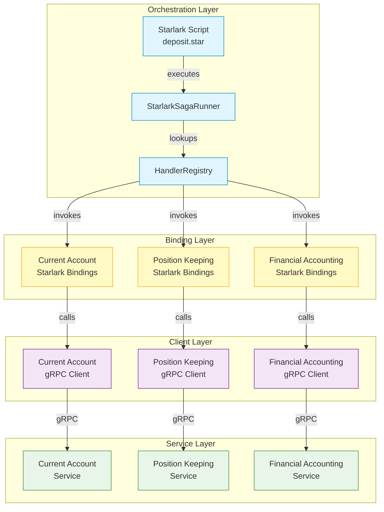
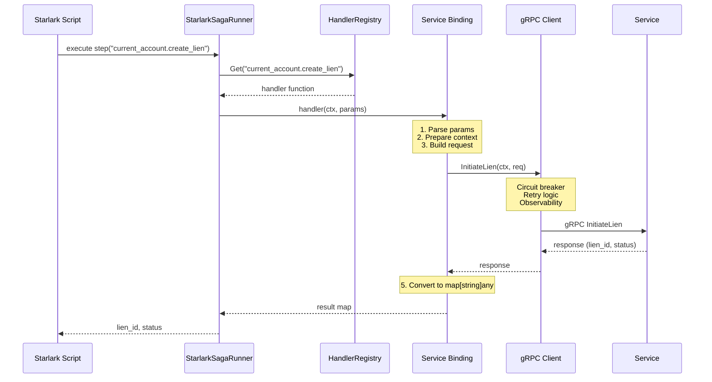
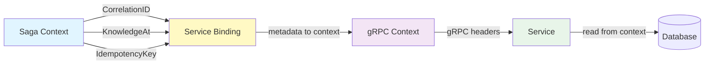
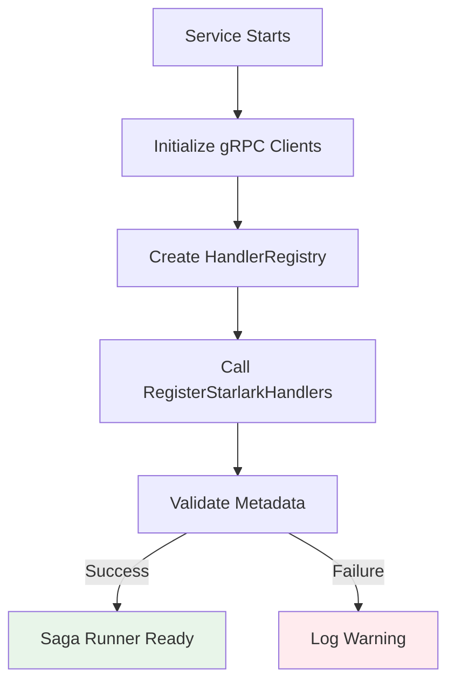
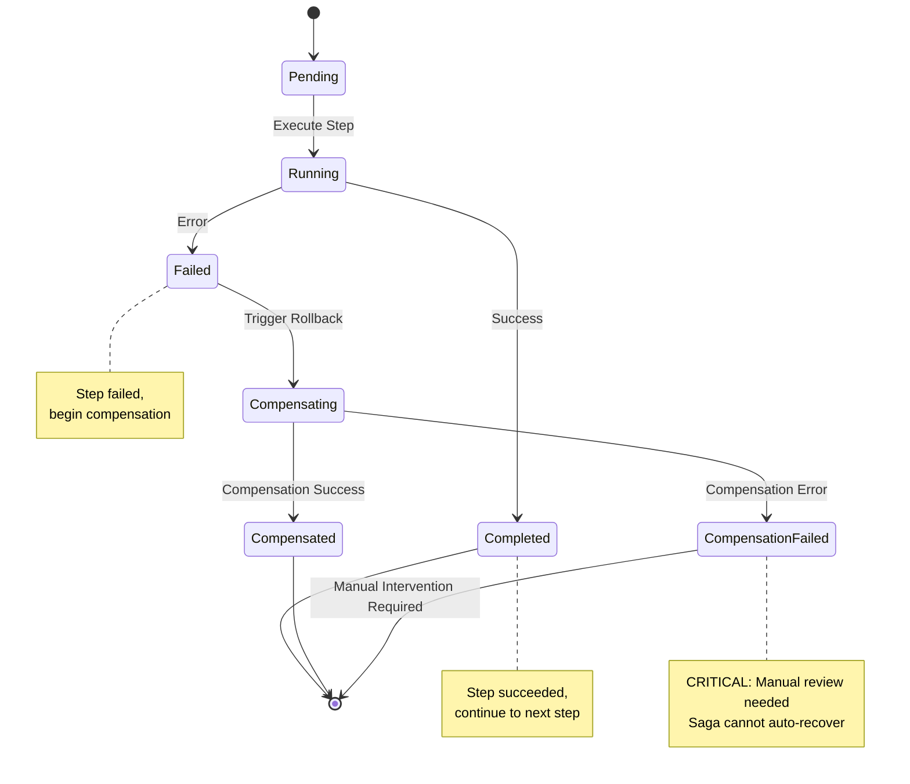

# Starlark Saga Architecture

## Overview

Meridian uses [Starlark](https://github.com/google/starlark-go) for saga orchestration, enabling tenant-specific
workflow definitions without code deployment. This architecture separates orchestration logic (Starlark scripts)
from service implementation (gRPC services), allowing business teams to customise workflows while maintaining
strict type safety and audit compliance.

## Table of Contents

1. [Architecture Principles](#architecture-principles)
2. [Component Overview](#component-overview)
3. [Service Binding Architecture](#service-binding-architecture)
4. [Data Flow](#data-flow)
5. [Dependency Injection Pattern](#dependency-injection-pattern)
6. [Handler Lifecycle](#handler-lifecycle)
7. [Conservation Rules](#conservation-rules)
8. [Saga Execution Model](#saga-execution-model)
9. [Error Handling and Compensation](#error-handling-and-compensation)
10. [Testing Strategy](#testing-strategy)

## Architecture Principles

### 1. Separation of Concerns

- **Starlark Scripts**: Define WHAT operations to perform and in what order
- **Service Bindings**: Adapt Starlark interface to gRPC calls (HOW)
- **Service Implementations**: Execute actual business logic (WHERE)

### 2. Type Safety at Boundaries

- Starlark uses dynamic typing (`map[string]any`)
- Service bindings enforce strict validation using `saga.Require*Param` helpers
- gRPC enforces protocol buffer types
- Conservation rules prevent instrument type mismatches

### 3. Dependency Injection Over Global State

- No global handler registry
- Explicit registration via `RegisterStarlarkHandlers(registry, client)`
- Each service owns its bindings
- Services declare their dependencies

### 4. Idempotency and Traceability

- Saga metadata propagates through all layers
- Correlation IDs enable distributed tracing
- Idempotency keys prevent duplicate operations
- Bi-temporal queries use knowledge_at timestamps

## Component Overview



### Component Responsibilities

| Component | Responsibility | Location |
|-----------|---------------|----------|
| **Starlark Script** | Defines workflow steps and compensation logic | `services/{service}/sagas/*.star` |
| **StarlarkSagaRunner** | Executes Starlark scripts, manages saga state | `shared/pkg/saga/starlark_runner.go` |
| **HandlerRegistry** | Maps handler names to implementations | `shared/pkg/saga/registry.go` |
| **Service Bindings** | Adapts Starlark to gRPC | `services/{service}/client/starlark.go` |
| **gRPC Clients** | Handles networking, resilience, observability | `services/{service}/client/client.go` |
| **Service Implementation** | Executes business logic | `services/{service}/internal/` |

## Service Binding Architecture

Service bindings are the bridge between dynamic Starlark scripts and strongly-typed gRPC services. They live
in each service's client package and follow a consistent pattern.

### File Structure

```text
services/
├── current-account/
│   └── client/
│       ├── client.go           # gRPC client implementation
│       ├── starlark.go         # Starlark service bindings (NEW)
│       └── starlark_test.go    # Binding tests
├── position-keeping/
│   └── client/
│       ├── client.go
│       ├── starlark.go
│       └── starlark_test.go
└── financial-accounting/
    └── client/
        ├── client.go
        ├── starlark.go
        └── starlark_test.go
```

### Binding Pattern

Each `starlark.go` file implements:

1. **RegisterStarlarkHandlers function** - Registers all handlers with metadata
2. **Handler factory functions** - Create closures over the gRPC client
3. **prepareClientContext helper** - Propagates saga metadata

```go
// services/current-account/client/starlark.go

// 1. Registration function (called during service initialisation)
func RegisterStarlarkHandlers(registry *saga.HandlerRegistry, client *Client) error {
    handlers := map[string]struct {
        handler  saga.Handler
        metadata saga.HandlerMetadata
    }{
        "current_account.create_lien": {
            handler: createLienHandler(client),  // Factory function
            metadata: saga.HandlerMetadata{
                Category:            saga.HandlerCategorySettlement,
                ProducesInstruments: []string{"USD", "EUR", "GBP", "NZD"},
            },
        },
    }

    for name, h := range handlers {
        if err := registry.RegisterWithMetadata(name, h.handler, &h.metadata); err != nil {
            return fmt.Errorf("failed to register %s: %w", name, err)
        }
    }
    return nil
}

// 2. Handler factory (closes over client)
func createLienHandler(client *Client) saga.Handler {
    return func(ctx *saga.StarlarkContext, params map[string]any) (any, error) {
        // 5-step pattern: parse, context, request, call, convert
        accountID, _ := saga.RequireStringParam(params, "account_id")
        amount, _ := saga.RequireDecimalParam(params, "amount")

        clientCtx := prepareClientContext(ctx)
        req := &currentaccountv1.InitiateLienRequest{...}
        resp, err := client.InitiateLien(clientCtx, req)

        return map[string]any{
            "lien_id": resp.GetLien().GetLienId(),
            // ...
        }, nil
    }
}

// 3. Context preparation (propagates saga metadata)
func prepareClientContext(ctx *saga.StarlarkContext) context.Context {
    clientCtx := context.Background()
    if correlationID := ctx.CorrelationID(); correlationID != "" {
        clientCtx = clients.WithCorrelationID(clientCtx, correlationID)
    }
    // ... propagate knowledge_at, idempotency key ...
    return clientCtx
}
```

### Why This Pattern?

| Design Choice | Rationale |
|---------------|-----------|
| **Bindings in `client/` package** | Co-located with gRPC client, service team owns both |
| **Closure over `*Client`** | Access to connection pool, config, resilience wrappers |
| **Metadata at registration** | Enables Conservation Rule validation at startup |
| **5-step handler pattern** | Consistent, testable, easy to audit |
| **`prepareClientContext` helper** | DRY metadata propagation, ensures idempotency |

## Data Flow

### End-to-End Saga Execution



### Metadata Propagation

Saga metadata flows through all layers to ensure operations are traceable and idempotent:



**Key Metadata Fields:**

- **CorrelationID**: Links distributed operations across services (e.g., `saga-123-step-2`)
- **KnowledgeAt**: Bi-temporal timestamp for consistent reads (e.g., `2026-02-04T12:00:00Z`)
- **IdempotencyKey**: Prevents duplicate operations on retry (e.g., `saga-123-step-2-retry-1`)

## Dependency Injection Pattern

Services explicitly declare their saga handler dependencies during initialisation:

### Before (Global Registry - Problematic)

```go
// OLD PATTERN - DEPRECATED
executor := saga.NewExecutor(saga.ExecutorConfig{
    Handlers: saga.DefaultRegistry(), // ❌ Global state, hidden dependencies
})
```

**Problems:**

- Global state makes testing difficult
- Hidden dependencies (what services does this saga actually call?)
- Initialisation order matters
- Circular dependencies possible

### After (Explicit Registration - Current)

```go
// NEW PATTERN - RECOMMENDED
func main() {
    // 1. Initialize service clients
    currentAccountClient, cleanup1, _ := currentaccountclient.New(...)
    defer cleanup1()

    posKeepingClient, cleanup2, _ := positionkeepingclient.New(...)
    defer cleanup2()

    finAcctClient, cleanup3, _ := financialaccountingclient.New(...)
    defer cleanup3()

    // 2. Create handler registry
    handlerRegistry := saga.NewHandlerRegistry()

    // 3. Explicitly register service bindings
    if err := currentaccountclient.RegisterStarlarkHandlers(handlerRegistry, currentAccountClient); err != nil {
        logger.Warn("failed to register current-account handlers", "error", err)
    }

    if err := positionkeepingclient.RegisterStarlarkHandlers(handlerRegistry, posKeepingClient); err != nil {
        logger.Warn("failed to register position-keeping handlers", "error", err)
    }

    if err := financialaccountingclient.RegisterStarlarkHandlers(handlerRegistry, finAcctClient); err != nil {
        logger.Warn("failed to register financial-accounting handlers", "error", err)
    }

    // 4. Create saga runner with explicit dependencies
    sagaRunner := saga.NewStarlarkSagaRunner(saga.StarlarkSagaRunnerConfig{
        Handlers: handlerRegistry,  // ✅ Explicit dependencies
        Logger:   logger,
    })
}
```

**Benefits:**

- ✅ Clear dependency graph (this service orchestrates these services)
- ✅ Easy to test (inject mock clients)
- ✅ No global state
- ✅ Graceful degradation (warn on missing services, don't fail)
- ✅ Type-safe (compiler checks concrete `*Client` types)

## Handler Lifecycle

### 1. Registration (Service Startup)



**Key Points:**

- Registration happens once at startup
- Validation catches metadata errors early (e.g., missing ProducesInstruments)
- Failed registrations log warnings but don't crash the service
- Registry is immutable after startup (no dynamic handler addition)

### 2. Discovery (Script Execution)

```text
1. Starlark script calls: current_account.create_lien(...)
2. Runner extracts handler name: "current_account.create_lien"
3. Registry looks up handler by name
4. If not found → runtime error: "handler not found: current_account.create_lien"
5. If found → execute handler function
```

### 3. Invocation (Handler Execution)

```text
Handler execution follows 5-step pattern:

1. PARSE: Extract typed parameters from map[string]any
   - saga.RequireStringParam, RequireDecimalParam, etc.
   - Return validation error if missing/wrong type

2. CONTEXT: Prepare gRPC context with saga metadata
   - Propagate correlation ID, knowledge_at, idempotency key
   - Add timeouts, tracing spans

3. REQUEST: Build strongly-typed gRPC request
   - Convert Starlark types (decimal.Decimal) to proto types
   - Apply business validation rules

4. CALL: Invoke gRPC client method
   - Circuit breaker protects against cascading failures
   - Retry logic handles transient errors
   - Observability metrics recorded

5. CONVERT: Transform proto response to map[string]any
   - Extract relevant fields for Starlark
   - Maintain type consistency (string IDs, decimal amounts)
```

### 4. Compensation (Rollback)

If a later step fails, the saga executes compensation logic defined in the script:

```starlark
# Forward step
step(name="create_lien")
lien_result = current_account.create_lien(
    account_id=account_id,
    amount=amount,
    currency=currency,
)

# Compensation step (runs on failure)
compensate(
    name="cancel_lien",
    step="create_lien",
    handler="current_account.terminate_lien",
    params={
        "lien_id": lien_result["lien_id"],
    },
)
```

## Conservation Rules

### Conservation of Dimension Rule

The **Conservation of Dimension Rule** enforces financial instrument type safety:

> Handlers must declare `ProducesInstruments` metadata matching the instrument types they actually create.
> A handler that produces USD positions cannot declare EUR, preventing runtime type mismatches.

**Enforcement:**

```go
// At registration time:
metadata := saga.HandlerMetadata{
    Category:            saga.CategorySettlement,
    ProducesInstruments: []string{"USD", "EUR"},  // Declared
}

// At execution time:
// Validator checks that actual instruments created match declared instruments
// If handler creates "GBP" position but only declared ["USD", "EUR"] → validation error
```

**Categories:**

- **HandlerCategoryIngestion** - Creates positions from external data (meter readings, market prices)
  - Example: `ProducesInstruments: []string{"KWH", "GAS", "WATER"}`
- **HandlerCategoryValuation** - Computes derived values (mark-to-market, accruals)
  - Example: `ProducesInstruments: []string{}` (usually empty, updates existing)
- **HandlerCategorySettlement** - Executes financial operations (debits, credits)
  - Example: `ProducesInstruments: []string{"USD", "EUR", "GBP"}`

### Why This Matters

```go
// BAD - Declaration doesn't match implementation
metadata: saga.HandlerMetadata{
    ProducesInstruments: []string{"USD"},  // Declared: USD
}

// In handler:
req := &positionkeepingv1.InitiateLogRequest{
    Currency: "EUR",  // MISMATCH! Creates EUR but declared USD
}

// Result: Runtime error caught by validator
// Without this rule: Silent data corruption (wrong currency positions)
```

## Saga Execution Model

### Step Execution



### Saga States

| State | Description | Next Actions |
|-------|-------------|--------------|
| **Pending** | Step not yet executed | Execute forward logic |
| **Running** | Step in progress | Wait for completion |
| **Completed** | Step succeeded | Continue to next step |
| **Failed** | Step failed | Begin compensation |
| **Compensating** | Running rollback logic | Wait for compensation |
| **Compensated** | Rollback succeeded | Continue compensating previous steps |
| **CompensationFailed** | Rollback failed | Alert operations team, manual intervention |

### Idempotency Guarantees

All saga operations are idempotent through:

1. **Idempotency Keys**: Unique per step execution
   ```go
   idempotencyKey := fmt.Sprintf("%s-step-%d-retry-%d", sagaID, stepNum, retryCount)
   ```

2. **Service-Level Deduplication**: Services check idempotency key before execution
   ```go
   if seenBefore := repo.CheckIdempotencyKey(ctx, key); seenBefore {
       return cachedResponse, nil  // Don't re-execute
   }
   ```

3. **Bi-Temporal Consistency**: `knowledge_at` timestamp ensures consistent reads
   ```go
   // All reads in this saga see data as of this moment
   knowledgeAt := time.Now()
   ```

## Error Handling and Compensation

### Error Categories

| Category | Example | Compensation Strategy |
|----------|---------|----------------------|
| **Validation Error** | Invalid account ID | No compensation needed (step didn't execute) |
| **Transient Error** | Network timeout | Retry with backoff |
| **Business Error** | Insufficient funds | Compensate previous steps |
| **System Error** | Database down | Retry, then compensate |
| **Compensation Error** | Rollback failed | Manual intervention required |

### Compensation Patterns

#### 1. Symmetric Compensation

```starlark
# Create resource
step(name="create_lien")
lien = current_account.create_lien(...)

# Symmetric compensation (reverse the operation)
compensate(name="cancel_lien", step="create_lien", handler="current_account.terminate_lien", ...)
```

#### 2. State Transition Compensation

```starlark
# Transition state forward
step(name="update_status")
position_keeping.update_log(log_id=log_id, status="CONFIRMED")

# Transition state backward
compensate(name="revert_status", step="update_status",
    handler="position_keeping.update_log",
    params={"log_id": log_id, "status": "INITIATED"})
```

#### 3. Idempotent Cleanup

```starlark
# Compensation must be idempotent (safe to retry)
compensate(
    name="release_funds",
    step="reserve_funds",
    handler="current_account.terminate_lien",
    params={"lien_id": lien_id},
)
# If lien already terminated → no-op, not an error
```

## Testing Strategy

### 1. Unit Tests (Binding Layer)

Test individual handler functions in isolation:

```go
func TestCreateLienHandler(t *testing.T) {
    mockClient := &MockClient{
        InitiateLienFunc: func(ctx context.Context, req *pb.Request) (*pb.Response, error) {
            return &pb.Response{Lien: &pb.Lien{LienId: "lien-123"}}, nil
        },
    }

    handler := createLienHandler(mockClient)
    ctx := &saga.StarlarkContext{...}
    params := map[string]any{"account_id": "acc-1", "amount": decimal.NewFromFloat(100)}

    result, err := handler(ctx, params)
    require.NoError(t, err)
    assert.Equal(t, "lien-123", result.(map[string]any)["lien_id"])
}
```

### 2. Integration Tests (End-to-End)

Test saga execution with real services using testcontainers:

```go
func TestDepositSaga(t *testing.T) {
    // Setup: Real services with testcontainers
    db, cleanup := testdb.SetupCockroachDB(t, nil)
    defer cleanup()

    currentAccountClient := setupRealClient(t, db)
    posKeepingClient := setupRealClient(t, db)

    // Register handlers
    registry := saga.NewHandlerRegistry()
    currentaccountclient.RegisterStarlarkHandlers(registry, currentAccountClient)
    positionkeepingclient.RegisterStarlarkHandlers(registry, posKeepingClient)

    // Execute saga
    runner := saga.NewStarlarkSagaRunner(...)
    result, err := runner.Execute(ctx, "deposit.star", params)

    // Verify: Check actual database state
    assert.NoError(t, err)
    verifyAccountBalance(t, db, accountID, expectedBalance)
    verifyPositionLog(t, db, accountID, expectedAmount)
}
```

### 3. Compensation Tests

Test rollback logic executes correctly:

```go
func TestDepositSaga_CompensationOnFailure(t *testing.T) {
    // Inject failure at specific step
    posKeepingClient := &MockClient{
        InitiateLogFunc: func(...) error {
            return errors.New("simulated failure")
        },
    }

    // Execute saga (should fail and compensate)
    _, err := runner.Execute(ctx, "deposit.star", params)
    assert.Error(t, err)

    // Verify compensation executed
    verifyLienTerminated(t, db, lienID)
    verifySagaState(t, db, sagaID, "COMPENSATED")
}
```

## See Also

- [Adding Starlark Service Bindings Guide](../guides/adding-starlark-service-bindings.md) - Step-by-step implementation
- [ADR-028: Starlark Saga Orchestration](../adr/0028-starlark-saga-cel-valuation.md) - Design decisions and rationale
- [Troubleshooting Saga Handlers](../runbooks/troubleshooting-saga-handlers.md) - Common issues and solutions
- [Saga Handler Schema](../saga-handlers.schema.json) - JSON schema for handler metadata validation

---

**Last Updated:** 2026-02-04
**Status:** Living Document
