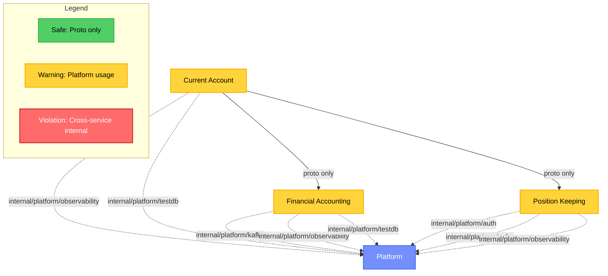

# Service Coupling Visualization Example

This document shows an example of the Mermaid diagram generated by `scripts/generate-coupling-mermaid.sh`.

## Current System State



## Analysis Summary

**Generated:** 2025-11-19 15:11:57 UTC

**Services analyzed:** 3

**Total violations:** 17

- Cross-service internal imports: 0 (CRITICAL)
- Internal/platform usage: 17 (WARNING)

**Proto dependencies (safe):** 14

## Platform Coupling Details

Services using `internal/platform` packages (should migrate to `pkg/platform`):

- **current-account:** observability (6 imports)
- **financial-accounting:** testdb (3 imports)
- **financial-accounting:** kafka (2 imports)
- **current-account:** testdb (2 imports)
- **position-keeping:** observability (1 import)
- **position-keeping:** kafka (1 import)
- **position-keeping:** auth (1 import)
- **financial-accounting:** observability (1 import)

## Interpretation

### Good News

- **No cross-service violations:** All services communicate via proto/gRPC interfaces
- **Clean boundaries:** Services respect each other's internal packages
- **Kafka events:** Event-driven patterns properly implemented

### Areas for Improvement

All services depend on `internal/platform` packages:

1. **Observability:** All services import `internal/platform/observability`
   - **Action:** Migrate to `pkg/platform/observability` or service-specific implementations

2. **TestDB:** Current Account and Financial Accounting import `internal/platform/testdb`
   - **Action:** This is acceptable for test code, but ensure it's test-only

3. **Kafka:** Financial Accounting and Position Keeping import `internal/platform/kafka`
   - **Action:** Migrate to `pkg/platform/kafka` for public event infrastructure

4. **Auth:** Position Keeping imports `internal/platform/auth`
   - **Action:** Migrate to `pkg/platform/auth` for reusable auth utilities

## Recommended Actions

1. Create `pkg/platform/observability` with public API
2. Create `pkg/platform/kafka` with public event infrastructure
3. Create `pkg/platform/auth` with public authentication utilities
4. Update services to import from `pkg/platform/*` instead of `internal/platform/*`
5. Re-run analysis to verify improvements

## How to Generate This

```bash
./scripts/analyze-coupling.sh | ./scripts/generate-coupling-mermaid.sh
```

## Related Documentation

- [scripts/README.md](../scripts/README.md) - Script usage guide
- [ADR-002: Microservices per BIAN Domain](../docs/adr/0002-microservices-per-bian-domain.md)
