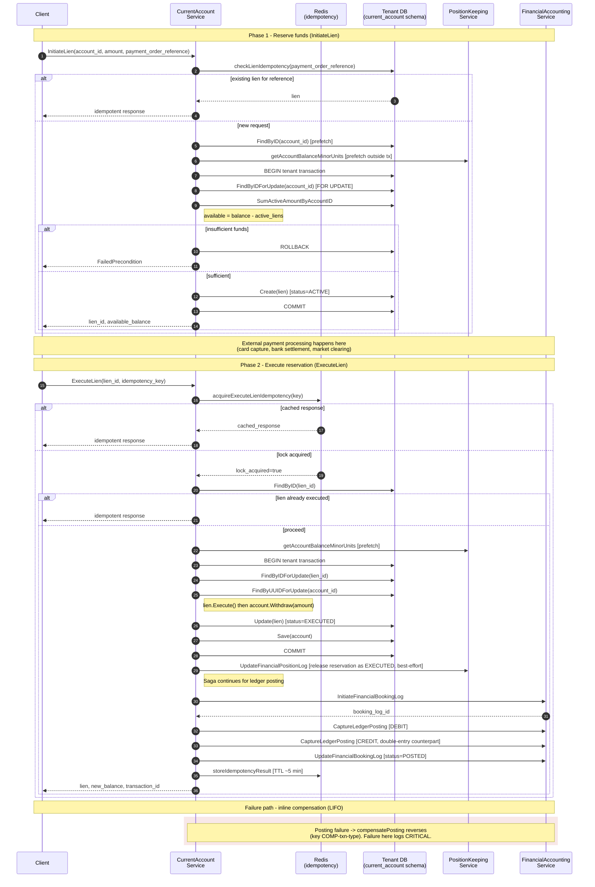

# Meridian Data Flows

This document traces the runtime sequence of operations for four critical flows in Meridian. Each diagram
is grounded in the current source code on `develop`, with file references for the participating components.

Use these flows to:

- Understand cross-service contracts before changing a handler signature
- Locate the failure surface when a saga aborts or a job stalls
- Reason about idempotency, locking, and compensation boundaries

---

## 1. Payment Lifecycle

The payment lifecycle covers the two-phase reservation/execution pattern used for fund movement.
`InitiateLien` reserves available balance against an account; `ExecuteLien` converts that reservation
into a permanent debit, propagating the change through Position Keeping and Financial Accounting.

Both operations are idempotent (lien-level via Redis cache and `payment_order_reference`) and use
pessimistic row locking (`FindByIDForUpdate`) inside a tenant-scoped transaction to serialise
concurrent access to the same account.

**Source:**

- `services/current-account/service/lien_lifecycle.go` - `InitiateLien`, `ExecuteLien`, `TerminateLien`
- `services/current-account/service/saga_handler_position_keeping.go` - position log handlers
- `services/current-account/service/saga_handler_financial_accounting.go` - booking log and posting handlers
- `shared/platform/db` - `WithGormTenantTransaction` (search_path scoping)



**Key invariants:**

- `payment_order_reference` is the upstream idempotency key for `InitiateLien`; the in-memory Redis
  idempotency lock guards `ExecuteLien` for ~5 minutes.
- The Position Keeping balance prefetch happens outside the database transaction. This avoids holding
  row locks while making an external RPC, which prevents deadlocks under contention.
- Reservation release to Position Keeping (`UpdateFinancialPositionLog` with
  `RESERVATION_STATUS_EXECUTED`/`TERMINATED`) is best-effort. The lien state in CurrentAccount remains
  the source of truth.
- Ledger compensation uses `COMP-<transaction_id>-<posting_type>` as its idempotency key so retries
  do not double-compensate.

---

## 2. Audit Pipeline

Every domain mutation in a service that opts into audit fires a GORM
`AfterCreate`/`AfterUpdate`/`AfterDelete` hook (via `shared/platform/audit`). The hook writes an
`audit_outbox` row in the same database transaction as the business write, guaranteeing atomicity.

There are two delivery paths from `audit_outbox` to the consumer that ultimately writes `audit_log`:

- **Primary path:** The service's audit `Publisher` produces an `AuditEvent` directly to Kafka.
  The `audit-worker` consumes the topic and writes to `audit_log` (tenant-scoped via `tenant_id`
  column or `search_path`).
- **Fallback path:** If the Publisher is disabled or Kafka publish fails, the per-service
  `audit.Worker` polls `audit_outbox`, marks rows `processing`, and either retries Kafka or writes
  directly to `audit_log`. The same `event_id` uniqueness gate makes both paths idempotent.

**Source:**

- `shared/platform/audit/hooks.go` - `RecordCreate`, `RecordUpdate`, `RecordDelete`, `AuditOutbox` schema
- `shared/platform/audit/publisher.go` - `Publisher` (Kafka path)
- `shared/platform/audit/worker.go` - `Worker` (outbox poller, per-service schema)
- `services/audit-worker/adapters/kafka/consumer.go` - `AuditConsumer.handleAuditEvent` (writes `audit_log`)
- `services/audit-worker/service/server.go` - `AuditService.ListAuditEntries` (read path)

```mermaid
sequenceDiagram
    autonumber
    participant App as Domain Service<br/>(e.g. current-account)
    participant DB as Service DB<br/>(tenant schema)
    participant Pub as audit.Publisher<br/>(in-process)
    participant Worker as audit.Worker<br/>(in-process poller)
    participant Kafka as Kafka<br/>(audit.events.&lt;svc&gt;.v1)
    participant DLQ as DLQ Topic
    participant Consumer as audit-worker<br/>AuditConsumer
    participant AuditDB as Audit DB<br/>(tenant schema, audit_log)

    Note over App,AuditDB: 1. Domain mutation in a single transaction
    App->>DB: BEGIN
    App->>DB: INSERT/UPDATE/DELETE business row
    App->>DB: GORM AfterCreate/AfterUpdate/AfterDelete fires
    Note right of App: hooks.go RecordCreate/Update/Delete<br/>writes audit_outbox row with same tx
    App->>DB: INSERT audit_outbox (status='pending', event_id=UUID)
    App->>DB: COMMIT

    Note over App,AuditDB: 2a. Primary path - direct publish (per-service Publisher)
    alt Publisher enabled and Kafka reachable
        App->>Pub: PublishOutboxEntry(audit_outbox row)
        Pub->>Kafka: Produce AuditEvent (key=record_id)
        Kafka-->>Pub: ack
        Pub->>DB: UPDATE audit_outbox SET status='completed'
    else Publisher disabled or Kafka unreachable
        Note right of Pub: Row stays status='pending'<br/>for the Worker to pick up
    end

    Note over App,AuditDB: 2b. Fallback path - outbox polling (audit.Worker)
    loop pollInterval (default 5s, adaptive)
        Worker->>DB: SELECT FROM audit_outbox WHERE status='pending' LIMIT batch
        Worker->>DB: UPDATE status='processing' (atomic claim)
        loop each row
            Worker->>Kafka: Produce AuditEvent
            alt produce success
                Kafka-->>Worker: ack
                Worker->>DB: UPDATE status='completed'
            else produce failed
                Worker->>DB: UPDATE retry_count++, last_error
                alt retry_count >= maxRetries
                    Worker->>DB: UPDATE status='failed'
                end
            end
        end
        Note right of Worker: ResetStuckEntries reclaims rows<br/>stuck in 'processing' > 5 min
    end

    Note over App,AuditDB: 3. Consume and persist (audit-worker service)
    Kafka->>Consumer: AuditEvent (with x-tenant-id header)
    Consumer->>Consumer: extract tenant from context
    Consumer->>AuditDB: INSERT INTO audit_log<br/>ON CONFLICT (event_id) DO NOTHING
    alt insert ok
        AuditDB-->>Consumer: ok
        Consumer->>Kafka: commit offset
    else handler error after maxRetries
        Consumer->>DLQ: forward original record + error metadata
        Consumer->>Kafka: commit offset
    end

    Note over App,AuditDB: 4. Read path
    participant API as API Gateway
    API->>Consumer: ListAuditEntries(filters, page_token)
    Consumer->>AuditDB: SELECT FROM audit_log [tenant-scoped, cursor pagination]
    AuditDB-->>Consumer: rows
    Consumer-->>API: AuditLogEntry[] + next_page_token
```

**Key invariants:**

- The `audit_outbox` write shares the business transaction; if the business write rolls back, no
  audit row is produced.
- `event_id` is unique. Both paths use `ON CONFLICT (event_id) DO NOTHING`, so duplicate delivery
  between Publisher and Worker is harmless.
- The `audit-worker` consumer is deployed once per service topic (one consumer group per source
  service), enabling independent scaling and DLQ handling.
- Tenant scoping is enforced by the consumer using the `x-tenant-id` Kafka header
  (`tenant.FromContext`), which is set by `ProtoConsumer` middleware.

---

## 3. Tenant Initialization

`InitiateTenant` returns synchronously with `PROVISIONING_PENDING` (BIAN Initiate semantics, 202
Accepted). Schema creation, migration, and reference data seeding all happen asynchronously in the
`ProvisioningWorker` so a slow provisioner cannot block API callers.

**Source:**

- `services/tenant/service/grpc_tenant_endpoints.go` - `InitiateTenant`
- `services/tenant/service/grpc_provisioning_endpoints.go` - `createProvisioningStatusRecords`, `GetTenantProvisioningStatus`
- `services/tenant/worker/provisioning_worker.go` - `ProvisioningWorker`, `PostProvisioningHook`
- `services/tenant/provisioner/postgres_provisioner.go` - `ProvisionSchemas`, `runPostProvisioningHooks`
- `services/party/service/...` - `RegisterParty` (called via `partyClient`)

```mermaid
sequenceDiagram
    autonumber
    participant Client as tenantctl /<br/>API caller
    participant Tenant as Tenant Service<br/>(grpc_tenant_endpoints)
    participant Party as Party Service
    participant TDB as Tenant DB<br/>(platform schema)
    participant Worker as ProvisioningWorker<br/>(in-process)
    participant Prov as PostgresProvisioner
    participant SvcDBs as Per-service DBs<br/>(party, current-account,<br/>position-keeping, ...)
    participant Hooks as PostProvisioning<br/>Hooks (ref-data,<br/>saga-defaults, ...)

    Note over Client,Hooks: Synchronous - returns 202 immediately
    Client->>Tenant: InitiateTenant(tenant_id, slug, display_name, settlement_asset)
    Tenant->>Tenant: validateSlugAvailability
    alt party client configured
        Tenant->>Party: RegisterParty(PARTY_TYPE_ORGANIZATION,<br/>external_reference=tenant_id)
        Party-->>Tenant: party_id
    end
    Tenant->>TDB: Create(tenant) [status=PROVISIONING_PENDING]
    Tenant->>TDB: InitializeProvisioningStatus<br/>[one row per service, state=pending]
    Tenant-->>Client: tenant{status=PROVISIONING_PENDING},<br/>provisioning_hint

    Note over Client,Hooks: Asynchronous - ProvisioningWorker poll loop
    loop pollInterval
        Worker->>TDB: find tenants WHERE status=PROVISIONING_PENDING
        Worker->>Worker: claim with maxConcurrent semaphore
        Worker->>Prov: ProvisionSchemas(tenant_id)
        Prov->>TDB: prepareProvisioningStatus [state=in_progress]
        loop each configured service
            Prov->>SvcDBs: CREATE SCHEMA IF NOT EXISTS &lt;tenant_schema&gt;
            Prov->>SvcDBs: apply Atlas migrations into tenant schema
            Prov->>TDB: update service_status[service]=active
        end
        Prov->>SvcDBs: verifySchemaProvisioned [check expected tables exist]
        alt verification fails
            Prov->>TDB: markProvisioningFailed
            Prov-->>Worker: error
            Worker->>TDB: update tenant status=PROVISIONING_FAILED + retry/backoff
        else verification ok
            Prov->>TDB: state=active
            loop each registered hook
                Prov->>Hooks: hook(ctx, tenant_id)
                Note right of Hooks: seed instruments,<br/>register sagas,<br/>seed reference data
                alt hook fails
                    Hooks-->>Prov: error
                    Note right of Prov: Per worker contract,<br/>hook failures are fatal:<br/>tenant stays in PROVISIONING_FAILED
                end
            end
            Worker->>TDB: update tenant status=ACTIVE
        end
    end

    Note over Client,Hooks: Status polling (any time after Initiate returns)
    Client->>Tenant: GetTenantProvisioningStatus(tenant_id)
    Tenant->>TDB: GetByID(tenant_id) + FindProvisioningStatusByTenantID
    Tenant-->>Client: overall_status + per-service status array<br/>(migration_version, started_at, completed_at, error_message)
```

**Status transitions:**

| State | Set by | Meaning |
|-------|--------|---------|
| `PROVISIONING_PENDING` | `InitiateTenant` (when provisioner configured) | Awaiting worker pickup |
| `PROVISIONING` (in_progress) | `prepareProvisioningStatus` | Schemas being created/migrated |
| `ACTIVE` | Worker after hooks succeed | Tenant ready for traffic |
| `PROVISIONING_FAILED` | `markProvisioningFailed` or hook failure | Retry-eligible up to maxRetries with exponential backoff |
| `DEPROVISIONED` | Decommission flow | Terminal; cannot re-provision |

**Key invariants:**

- Schema creation uses `CREATE SCHEMA IF NOT EXISTS` and migrations are tracked per-service, so
  retries are safe and idempotent.
- Post-provisioning hooks are fatal (`PostProvisioningHook` contract). A tenant is never marked
  ACTIVE with incomplete reference data.
- Party registration succeeds before tenant persistence; an orphaned Party is acceptable eventual
  consistency (can be reconciled via `external_reference` lookup).
- `ReconcileMigrations` is the catch-up path for tenants created before a service added new
  migrations; requires `platform-admin` or `super-admin` role.

---

## 4. Manifest Convergence

`ApplyManifest` follows kubectl-apply semantics: validate the desired state, diff against live
state, plan a sequenced execution, run it via the `apply_manifest` saga, then record the outcome in
manifest history. Like all sagas in Meridian, the saga is defined in Starlark
(`apply_manifest/v1.5.0.star`) so the engine itself is generic.

**Source:**

- `services/control-plane/service/apply_manifest.go` - `RegisterApplyManifestService` wiring
- `services/control-plane/internal/applier/grpc_handler.go` - `ApplyManifestHandler.ApplyManifest`
- `services/control-plane/internal/applier/executor.go` - `ManifestExecutor`, saga runner
- `services/control-plane/internal/validator/...` - schema, lifecycle, semantic, CEL, Starlark, cross-ref validators
- `services/control-plane/internal/differ/...` - `ManifestDiffer`, `LiveStateProvider`, safety checks
- `services/control-plane/internal/planner/manifest_planner.go` - `ManifestPlanner`
- `services/control-plane/internal/applier/defaults/apply_manifest/v1.5.0.star` - default saga script

```mermaid
sequenceDiagram
    autonumber
    participant Client as Operator /<br/>tenantctl
    participant H as ApplyManifestHandler
    participant V as Validator<br/>(schema/CEL/Starlark/<br/>lifecycle/crossref)
    participant D as ManifestDiffer
    participant LS as LiveStateProvider<br/>(gRPC clients)
    participant VS as ManifestVersionStore<br/>(Postgres)
    participant P as ManifestPlanner
    participant Saga as StarlarkSagaRunner<br/>(apply_manifest)
    participant Svcs as Downstream<br/>Services
    participant Hist as HistoryService
    participant Hooks as PostApplyHooks<br/>(e.g. saga binding<br/>cache invalidation)

    Client->>H: ApplyManifest(manifest, applied_by, dry_run, force, expected_sequence_number)
    H->>H: validate request (manifest required, applied_by unless dry_run)

    Note over H,VS: Step 1 - Validate
    H->>V: Validate(manifest, opts)
    V-->>H: ValidationResult{valid, errors, relationship_graph}
    alt invalid
        H-->>Client: status=VALIDATION_FAILED + errors
    end

    Note over H,VS: Step 2 - Diff
    H->>D: Diff(manifest)
    D->>VS: Load(prior manifest version)
    alt LiveStateProvider configured
        D->>LS: list instruments / account_types / sagas / ... (live)
        LS->>Svcs: gRPC list calls per resource type
        Svcs-->>LS: live resources
        LS-->>D: live state snapshot
        D->>D: compute diff vs (prior_manifest UNION live)
    else
        D->>D: compute diff vs prior manifest only
    end
    D-->>H: DiffPlan{actions, blocked_deletions, summary}
    alt blocked deletions and not force
        H-->>Client: status=BLOCKED + safety_check details
    end

    Note over H,VS: Step 3 - Plan
    H->>P: Plan(diff_plan, tenant_id, manifest_version)
    P-->>H: ExecutionPlan{calls grouped by phase}

    alt dry_run
        H-->>Client: status=DRY_RUN + plan summary
    else live apply
        Note over H,Svcs: Step 4 - Execute apply_manifest saga
        H->>Saga: ExecuteSaga("apply_manifest", input_data, tenant_id)
        Note right of Saga: input_data carries:<br/>instruments,<br/>account_types,<br/>market_data_sources,<br/>market_data_sets,<br/>valuation_rules,<br/>organizations,<br/>internal_accounts,<br/>saga_definitions,<br/>provider_connections,<br/>instruction_routes
        loop phases 10, 20, 30, 35, 40, 55, 60, 70, 90 (sequential)
            loop calls within phase (parallel)
                Saga->>Svcs: handler RPC (e.g. RegisterInstrument, ActivateInstrument)
                Svcs-->>Saga: result
                alt call fails
                    Saga->>Svcs: LIFO compensation of completed steps
                    Saga-->>H: error + phase_status map
                end
            end
        end
        Saga-->>H: success + phase_status map

        Note over H,VS: Step 5 - Record history (optimistic locking)
        H->>Hist: Store(manifest, applied_by, job_id, status=APPLIED,<br/>relationship_graph, expected_sequence_number)
        alt sequence conflict
            Hist-->>H: conflict
            H-->>Client: gRPC ABORTED
        else stored
            Hist-->>H: snapshot{sequence_number}
            H->>VS: Save(manifest) [for next diff]
            H->>Hooks: hook(ctx, tenant_id) [each, with panic recovery]
            H-->>Client: status=APPLIED + snapshot + phase_status
        end
    end

    rect rgb(248, 232, 232)
        Note over H,Svcs: Failure -> PARTIALLY_APPLIED<br/>or FAILED via classifyFailure;<br/>partial outcome recorded.
    end
```

**Key invariants:**

- The differ compares against a union of the last-stored manifest and live service state (when
  `LiveStateProvider` is wired). This gives kubectl-apply convergence: drift in downstream services
  is detected and reconciled on the next apply.
- Deletions are gated by `safety.go`. Force is required to delete resources that have dependencies,
  and force is ignored for `expected_sequence_number` enforcement.
- The execution plan is phased (ADR-0028 ordering: instruments before account types, account types
  before sagas that bind to them, and so on). Within a phase, calls run in parallel; phases run
  sequentially.
- The `apply_manifest` saga itself is loaded with platform-default fallback - tenants can override
  the saga script, but the platform ships `v1.5.0.star` as the default. This lets the saga engine
  apply manifests even before a tenant has registered any custom sagas.
- Manifest history uses an optimistic-locking `expected_sequence_number` to prevent concurrent
  appliers from overwriting each other.

---

## Cross-cutting concerns

These properties hold across all four flows:

| Concern | Mechanism |
|---------|-----------|
| Tenant scoping | `tenant.FromContext` + `db.WithGormTenantTransaction` (sets `search_path`) |
| Idempotency | Database unique constraints (`event_id`, `payment_order_reference`) plus Redis-backed locks for short-window operations (`ExecuteLien`) |
| Distributed transactions | Sagas defined in Starlark, executed by `shared/pkg/saga.StarlarkSagaRunner`, with LIFO compensation |
| Reliable event delivery | Transactional outbox (`audit_outbox`, `event_outbox`) plus background pollers |
| Compensation safety | Compensation idempotency keys distinct from forward-path keys (e.g. `COMP-<txn>-<type>`) |
| Status transitions | Domain methods (`Execute`, `Terminate`, `markProvisioningFailed`) enforce valid transitions; CockroachDB requires application-layer checks since plpgsql triggers are unsupported |
