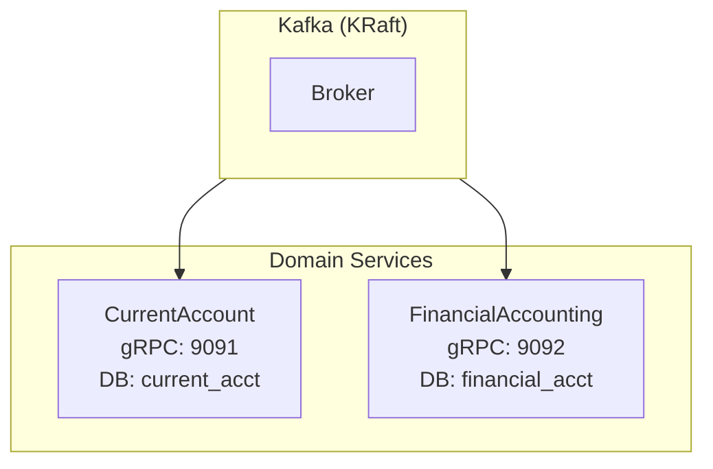

# Meridian Event-Driven Architecture

## High-Level Overview



## Service Details

### CurrentAccount Service (BIAN Domain)

**Responsibilities:**

- Customer account management
- Deposit/withdrawal operations
- Balance tracking
- Account status lifecycle

**Proto Definitions:**

- `CurrentAccountFacility` (Control Record)
- `ExecuteDeposit` (Behaviour Qualifier)
- `ExecuteWithdrawal` (Behaviour Qualifier)

**Database:**

- `current_accounts` table (CockroachDB)
- Stores: balance, status, customer_id

**Kafka Integration:**

- **Publishes to**: `current-account.deposits`
- **Message Type**: `ExecuteDepositRequest` (proto)
- **Consumes from**: `financial-accounting.postings`
- **Message Type**: `LedgerPosting` (proto)

**Event Flow:**

1. Receives gRPC `ExecuteDeposit` request
2. Updates account balance in DB
3. Publishes `ExecuteDepositRequest` to Kafka
4. Returns response to client
5. Later: Consumes `LedgerPosting` confirmation
6. Updates account status to "posted"

---

### FinancialAccounting Service (BIAN Domain)

**Responsibilities:**

- General ledger management
- Double-entry bookkeeping
- Ledger posting creation
- Audit trail

**Proto Definitions:**

- `FinancialBookingLog` (Control Record)
- `LedgerPosting` (Entity)
- `CaptureLedgerPosting` (Service Operation)

**Database:**

- `financial_booking_logs` table
- `ledger_postings` table
- Stores: debit/credit postings, amounts, dates

**Kafka Integration:**

- **Consumes from**: `current-account.deposits`
- **Message Type**: `ExecuteDepositRequest` (proto)
- **Publishes to**: `financial-accounting.postings`
- **Message Type**: `LedgerPosting` (proto)

**Event Flow:**

1. Consumes `ExecuteDepositRequest` from Kafka
2. Creates double-entry postings:
   - Debit: Customer account
   - Credit: Bank cash account
3. Stores postings in DB
4. Publishes `LedgerPosting` confirmation to Kafka

---

## Kafka Topics

### `current-account.deposits`

- **Producer**: CurrentAccount Service
- **Consumer**: FinancialAccounting Service
- **Message**: `ExecuteDepositRequest` (protobuf)
- **Key**: `account_id` (for partitioning)
- **Purpose**: Notify ledger of account transactions

### `financial-accounting.postings`

- **Producer**: FinancialAccounting Service
- **Consumer**: CurrentAccount Service, PositionKeeping Service (future)
- **Message**: `LedgerPosting` (protobuf)
- **Key**: `posting_id`
- **Purpose**: Confirm ledger postings completed

---

## Data Flow: Deposit Example

### Timeline

**T0**: User initiates deposit

```text
User → CurrentAccount gRPC
Request: ExecuteDeposit(account_id: "ACC-123", amount: £100)
```

**T1**: CurrentAccount processes synchronously

```text
CurrentAccount Service:

1. Validate request
2. Update account balance: £0 → £100 (in DB)
3. Set status: "pending_posting"
4. Publish to Kafka: current-account.deposits
5. Return response: deposit_ref="DEP-456"

```

**T2**: Kafka propagates event (~milliseconds)

```text
Kafka Topic: current-account.deposits
Message: ExecuteDepositRequest {
  account_id: "ACC-123"
  amount: {currency: "GBP", units: 100}
}
```

**T3**: FinancialAccounting consumes asynchronously

```text
FinancialAccounting Service:

1. Deserialize proto message
2. Create double-entry postings:
   - Debit: ACC-123 £100
   - Credit: BANK-CASH-001 £100
3. Save to database
4. Publish to Kafka: financial-accounting.postings

```

**T4**: CurrentAccount receives confirmation

```text
CurrentAccount Service (consumer):

1. Consume LedgerPosting from Kafka
2. Update account status: "pending_posting" → "posted"
3. Save to database

```

**T5**: Eventual consistency achieved

- Account balance: £100 ✓
- Account status: "posted" ✓
- Ledger postings: 2 entries ✓

---

## Infrastructure

### Kubernetes (Tilt for local dev)

- CurrentAccount Service (gRPC microservice)
- FinancialAccounting Service (gRPC microservice)
- audit-worker Service (3 replicas - processes audit log entries)
- 3 Kafka brokers (KRaft cluster with quorum, no Zookeeper)
  - kafka-0, kafka-1, kafka-2 form KRaft quorum
  - Replication factor: 2 (tolerates 1 broker failure)
  - StatefulSet with headless service for pod discovery
- 1 CockroachDB instance (distributed SQL)
- 1 Redis instance (future: caching/sessions)

### Databases

- **CockroachDB**: PostgreSQL-compatible distributed SQL
- **Separate databases** per service (no shared DB)
- **Atlas migrations**: Schema as code, versioned

### Kafka Cluster

- **Version**: 3.9.1
- **Mode**: KRaft quorum (no Zookeeper)
- **Brokers**: 3 (kafka-0, kafka-1, kafka-2)
- **Topics**: Auto-created
- **Partitions**: 3 per topic
- **Replication**: 2 (allows 1 broker failure)
- **Deployment**: StatefulSet for stable pod identities
- **Discovery**: Headless service (kafka-headless) for broker communication
- **Client access**: ClusterIP service (kafka) pointing to kafka-0

---

## BIAN Compliance

### Service Domains Implemented

1. **CurrentAccount**: Customer-facing deposit account management
2. **FinancialAccounting**: General ledger and double-entry bookkeeping

### BIAN Patterns Used

**Control Records (CR):**

- `CurrentAccountFacility` - Represents account lifecycle
- `FinancialBookingLog` - Represents booking log lifecycle

**Behaviour Qualifiers (BQ):**

- `Deposit` - Deposit operation on account
- `Withdrawal` - Withdrawal operation (future)
- `Interest` - Interest calculation (future)

**Service Operations:**

- `Initiate` - Create new CR
- `Execute` - Execute BQ operation
- `Update` - Modify CR
- `Retrieve` - Query CR
- `Capture` - Record transaction (ledger posting)

---

## Protocol Buffers Strategy

### Why Proto Everywhere?

**gRPC APIs:**

- Type-safe client-server communication
- Buf validation in CI (breaking change detection)
- Auto-generated Go code

**Kafka Messages:**

- Reuse gRPC request/response types as events
- No duplicate event schemas
- Smaller than JSON (binary encoding)
- Schema evolution built-in

**Example:**

```protobuf
// Used in gRPC AND Kafka
message ExecuteDepositRequest {
  string current_account_facility_reference = 1;
  Money amount = 2;
}
```

### Schema Evolution

- Buf checks for breaking changes in CI
- Proto backward/forward compatibility
- Old consumers can read new messages (with defaults)
- New consumers can read old messages (ignoring unknown fields)

---

## Eventual Consistency

### Why Not Synchronous?

**Benefits of Async:**

- Services can scale independently
- Failure isolation (Kafka down ≠ deposit fails)
- Temporal decoupling (consumers process at their own pace)
- Replay capability (reprocess events if needed)

**Trade-offs:**

- Status may be "pending" briefly
- Requires idempotency
- More complex debugging

### Consistency Guarantees

- **At-least-once** delivery from Kafka
- **Idempotency keys** prevent duplicate processing
- **Optimistic locking** via version fields
- **Audit trail** for all state changes

---

## Testing Strategy

### Unit Tests

- Each service: domain logic, validation
- Coverage >50% required by CI

### Integration Tests

- End-to-end flow: deposit → Kafka → ledger
- Multiple deposits to same account
- Kafka event propagation timing

### Manual Testing

- `scripts/demo.sh` - Full demo flow
- `scripts/kafka-watch.sh` - Monitor events
- `grpcurl` - Manual gRPC calls

---

## Observability (Future)

### Planned

- OpenTelemetry tracing (trace deposit across services)
- Prometheus metrics (Kafka lag, gRPC latency)
- Structured logging with correlation IDs
- Grafana dashboards

### Current

- `kubectl logs` for debugging
- Kafka console consumer for event inspection
- CockroachDB admin UI ([http://localhost:8080](http://localhost:8080))

---

## Scalability Considerations

### Horizontal Scaling

- **CurrentAccount**: Stateless, scale to N replicas
- **FinancialAccounting**: Stateless, scale to N replicas
- **Kafka**: Partition by account_id for parallel processing
- **CockroachDB**: Distributed, add nodes for scale

### Bottlenecks

- Single Kafka broker (dev only) - need multi-broker for prod
- CockroachDB single node - need 3+ nodes for prod
- No caching yet - add Redis for hot account data

### Future: Multi-Broker Kafka

- 3 brokers minimum for quorum
- Replication factor: 3
- Partitions: 10+ per topic
- Consumer groups for parallel processing
