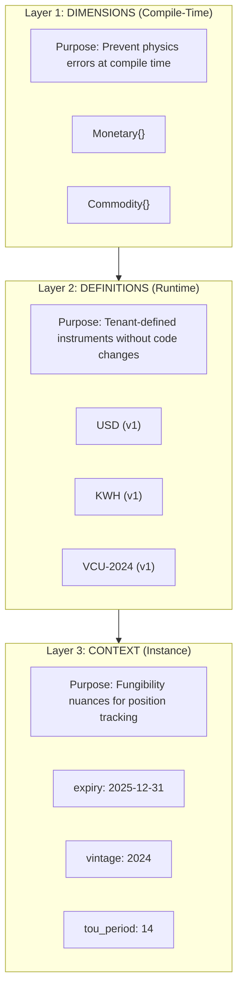
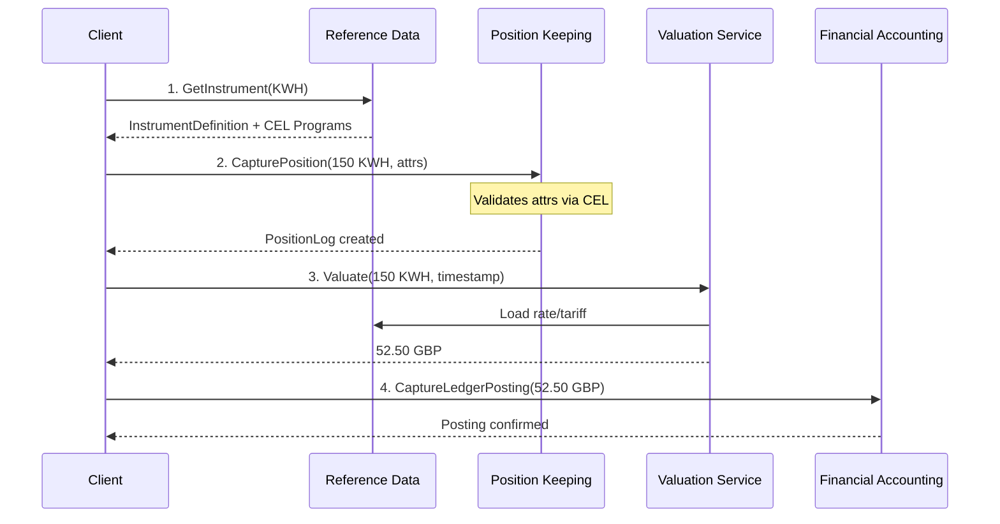
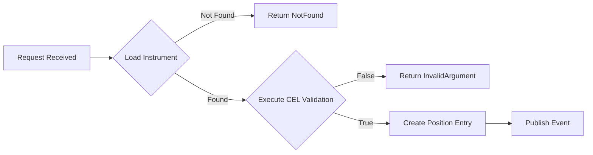

# Multi-Asset Integration Guide

This guide demonstrates how to use Meridian's multi-asset capabilities to track, manage, and
value non-fiat instruments like energy credits, carbon offsets, and compute resources alongside
traditional monetary instruments.

## Overview

Meridian is designed as a universal transaction integrity engine. While traditional banking
ledgers track only fiat currency, Meridian extends this to any quantifiable financial instrument.
The core insight is that **fiat is the degenerate case** - a position where the valuation
function is simply the identity function.

This guide walks through the complete flow for registering custom instruments, creating
positions with contextual attributes, and posting valued amounts to the financial ledger.

## Prerequisites

Before following this guide, ensure you understand:

- [ADR-0013: Universal Quantity Type System](../adr/0013-generic-asset-quantity-types.md) -
  Dimensional type safety
- [ADR-0014: Financial Instrument Reference Data](../adr/0014-financial-instrument-reference-data.md) -
  Instrument definitions and CEL validation
- Familiarity with gRPC and Protocol Buffers

## Key Concepts

### The 3-Layer Model

Meridian separates the physics of value tracking (compile-time safety) from the policy of
instrument definitions (runtime flexibility):



| Layer | Purpose | Changes Require |
|-------|---------|-----------------|
| Dimensions | Prevent physics errors (Money + Rice) | Code deployment |
| Definitions | Tenant instrument catalog | Registry update |
| Context | Position attributes (expiry, vintage) | Nothing (data) |

### Services Involved

Multi-asset operations coordinate across these BIAN-aligned services:

| Service | Port | Role in Multi-Asset Flow |
|---------|------|--------------------------|
| Reference Data | 50059 | Instrument definitions, CEL validation rules, fungibility logic |
| Position Keeping | 50053 | Track quantities in native units with audit trail |
| Financial Accounting | 50052 | Record valued amounts in settlement currency |
| Current Account | 50051 | Customer-facing operations with overdraft and liens |



## Step-by-Step Workflow

### 1. Register a Custom Instrument

Before tracking positions, register the instrument definition with the Reference Data service.
This example registers an energy instrument with time-of-use period tracking.

**gRPC Request:**

```protobuf
// RegisterInstrumentRequest
{
  "instrument_code": "KWH-PEAK",
  "dimension": "Commodity",
  "precision": 3,
  "display_name": "Kilowatt Hour (Peak)",
  "description": "Energy consumption during peak tariff periods",
  "validation_expression": "has(attrs.tou_period) && int(attrs.tou_period) >= 0 && int(attrs.tou_period) <= 47",
  "fungibility_expression": "a.tou_period == b.tou_period"
}
```

**Key fields:**

| Field | Purpose |
|-------|---------|
| `dimension` | "Monetary" or "Commodity" - determines compile-time type safety |
| `precision` | Decimal places (3 for kWh allows 0.001 granularity) |
| `validation_expression` | CEL expression for Schema-on-Write validation |
| `fungibility_expression` | CEL expression determining when positions can merge |

**CEL Validation Details:**

The validation expression runs at ingestion time. If it returns false, the request is
rejected with `InvalidArgument`. The expression has access to:

- `attrs`: map[string]string of position attributes
- Standard CEL functions: `has()`, `int()`, `timestamp()`, `now()`

### 2. Create Position with Attributes

Once the instrument is registered, create positions through Position Keeping.

**gRPC Request:**

```protobuf
// InitiateFinancialPositionLogRequest
{
  "account_id": "ACC-12345678",
  "entries": [{
    "transaction_id": "txn-550e8400-e29b-41d4",
    "amount": "150.000",
    "instrument_code": "KWH-PEAK",
    "instrument_version": 1,
    "attributes": {
      "tou_period": "14",
      "meter_id": "MTR-98765"
    },
    "direction": "CREDIT",
    "timestamp": "2024-01-15T14:30:00Z",
    "source": "IMPORT",
    "description": "Smart meter reading - afternoon peak"
  }]
}
```

**Attribute Validation Flow:**



The service:

1. Loads the instrument definition from Reference Data
2. Executes the compiled CEL validation program (~100ns)
3. Creates the position entry with full audit trail
4. Publishes `transaction-captured` event to Kafka

### 3. Query Position Balance

Query positions with attribute filters to get balances by specific criteria.

**gRPC Request:**

```protobuf
// ListFinancialPositionLogsRequest
{
  "account_id": "ACC-12345678",
  "instrument_code": "KWH-PEAK",
  "attribute_filters": {
    "tou_period": "14"
  },
  "from_timestamp": "2024-01-01T00:00:00Z",
  "to_timestamp": "2024-01-31T23:59:59Z"
}
```

**Response:**

```protobuf
{
  "position_logs": [
    {
      "log_id": "log-123",
      "account_id": "ACC-12345678",
      "current_status": "POSTED",
      "entries": [{
        "amount": "150.000",
        "instrument_code": "KWH-PEAK",
        "attributes": {"tou_period": "14", "meter_id": "MTR-98765"},
        "direction": "CREDIT"
      }]
    }
  ],
  "aggregate_balance": {
    "amount": "150.000",
    "instrument_code": "KWH-PEAK"
  }
}
```

### 4. Value and Post to Financial Accounting Ledger

After capturing positions in native units, convert to settlement currency and post to the
double-entry ledger. This typically happens via a valuation service that applies tariffs
or market rates.

**Valuation Step:**

```protobuf
// ValuatePositionRequest
{
  "instrument_code": "KWH-PEAK",
  "amount": "150.000",
  "attributes": {"tou_period": "14"},
  "valuation_timestamp": "2024-01-15T14:30:00Z",
  "settlement_currency": "GBP"
}

// ValuatePositionResponse
{
  "settlement_amount": {
    "units": 52,
    "nanos": 500000000,
    "currency_code": "GBP"
  },
  "rate_applied": {
    "rate": "0.35",
    "tariff_name": "Peak-Winter-2024",
    "valid_from": "2024-01-01T00:00:00Z",
    "valid_to": "2024-03-31T23:59:59Z"
  }
}
```

**Ledger Posting:**

```protobuf
// CaptureLedgerPostingRequest
{
  "financial_booking_log_id": "log-booking-456",
  "postings": [
    {
      "account_id": "ACC-ENERGY-REVENUE",
      "direction": "CREDIT",
      "amount": {"units": 52, "nanos": 500000000, "currency_code": "GBP"},
      "value_date": "2024-01-15T14:30:00Z",
      "correlation_id": "corr-789"
    },
    {
      "account_id": "ACC-CUSTOMER-12345678",
      "direction": "DEBIT",
      "amount": {"units": 52, "nanos": 500000000, "currency_code": "GBP"},
      "value_date": "2024-01-15T14:30:00Z",
      "correlation_id": "corr-789"
    }
  ]
}
```

**Double-Entry Validation:**

The Financial Accounting service enforces that debits equal credits within each booking log:

```text
DEBIT   Customer Account (liability decrease)  = 52.50 GBP
CREDIT  Energy Revenue (income increase)       = 52.50 GBP
────────────────────────────────────────────────────────────
Balance Check: Debits (52.50) = Credits (52.50)
```

### 5. Handle Version Migration

When instrument schemas change (e.g., adding a new required attribute), you must:

1. Register a new version of the instrument
2. Migrate existing positions via explicit trade operations

**Register New Version:**

```protobuf
// RegisterInstrumentRequest
{
  "instrument_code": "KWH-PEAK",
  "version": 2,
  "dimension": "Commodity",
  "precision": 3,
  "validation_expression": "has(attrs.tou_period) && has(attrs.grid_region) && int(attrs.tou_period) >= 0",
  "fungibility_expression": "a.tou_period == b.tou_period && a.grid_region == b.grid_region"
}
```

**Why Version-Based Immutability:**

Positions created with KWH-PEAK v1 remain valid and queryable. They are not fungible with
v2 positions because the schema differs. To consolidate:

1. Close v1 position (CREDIT reversal)
2. Open v2 position (CREDIT with new attributes)
3. Record this as an explicit migration trade

## Code Examples

### Energy Metering Flow

Complete Go code example demonstrating the multi-asset integration:

```go
package main

import (
    "context"
    "log"
    "time"

    "github.com/shopspring/decimal"
    "google.golang.org/grpc"

    refpb "github.com/meridianhub/meridian/api/proto/meridian/reference_data/v1"
    poskpb "github.com/meridianhub/meridian/api/proto/meridian/position_keeping/v1"
    finpb "github.com/meridianhub/meridian/api/proto/meridian/financial_accounting/v1"
)

func recordEnergyConsumption(ctx context.Context, accountID string, kwhAmount decimal.Decimal, touPeriod int) error {
    // Step 1: Connect to services
    refDataConn, err := grpc.Dial("reference-data:50059", grpc.WithInsecure())
    if err != nil {
        return err
    }
    defer refDataConn.Close()
    refDataClient := refpb.NewInstrumentRegistryClient(refDataConn)

    posKeepConn, err := grpc.Dial("position-keeping:50053", grpc.WithInsecure())
    if err != nil {
        return err
    }
    defer posKeepConn.Close()
    posKeepClient := poskpb.NewPositionKeepingClient(posKeepConn)

    // Step 2: Load instrument definition (validates instrument exists)
    instResp, err := refDataClient.GetActiveDefinition(ctx, &refpb.GetActiveDefinitionRequest{
        InstrumentCode: "KWH-PEAK",
    })
    if err != nil {
        return err
    }
    log.Printf("Loaded instrument: %s v%d (precision: %d)",
        instResp.Definition.Code,
        instResp.Definition.Version,
        instResp.Definition.Precision)

    // Step 3: Create position entry
    posResp, err := posKeepClient.InitiateFinancialPositionLog(ctx, &poskpb.InitiateRequest{
        AccountId: accountID,
        Entries: []*poskpb.TransactionLogEntry{{
            TransactionId:     generateUUID(),
            Amount:            kwhAmount.String(),
            InstrumentCode:    "KWH-PEAK",
            InstrumentVersion: instResp.Definition.Version,
            Attributes: map[string]string{
                "tou_period": fmt.Sprintf("%d", touPeriod),
            },
            Direction:   poskpb.Direction_CREDIT,
            Timestamp:   timestamppb.Now(),
            Source:      poskpb.TransactionSource_IMPORT,
            Description: "Smart meter reading",
        }},
    })
    if err != nil {
        return err
    }
    log.Printf("Position created: %s", posResp.LogId)

    // Step 4: Query balance (verify position was recorded)
    balResp, err := posKeepClient.ListFinancialPositionLogs(ctx, &poskpb.ListRequest{
        AccountId:      accountID,
        InstrumentCode: "KWH-PEAK",
    })
    if err != nil {
        return err
    }
    log.Printf("Current KWH-PEAK balance: %s", balResp.AggregateBalance.Amount)

    return nil
}

func generateUUID() string {
    // Implementation omitted for brevity
    return "txn-" + time.Now().Format("20060102-150405")
}
```

### Carbon Credit Trading Flow

Example for carbon credits with vintage tracking:

```go
func recordCarbonCredit(
    ctx context.Context,
    accountID string,
    tonnes decimal.Decimal,
    vintage int,
    projectID string,
) error {
    // Connect to Reference Data service
    refDataConn, err := grpc.Dial("reference-data:50059", grpc.WithInsecure())
    if err != nil {
        return err
    }
    defer refDataConn.Close()
    refDataClient := refpb.NewInstrumentRegistryClient(refDataConn)

    // Validate instrument exists (VCU = Verified Carbon Unit)
    instResp, err := refDataClient.GetActiveDefinition(ctx, &refpb.GetActiveDefinitionRequest{
        InstrumentCode: "VCU",
    })
    if err != nil {
        // Instrument not registered - create it
        _, err = refDataClient.CreateDraft(ctx, &refpb.CreateDraftRequest{
            InstrumentCode: "VCU",
            Dimension:      "Commodity",
            Precision:      0, // Whole units only
            DisplayName:    "Verified Carbon Unit",
            Description:    "Carbon offset credit certified by Verra",
            ValidationExpression: `
                has(attrs.vintage) &&
                int(attrs.vintage) >= 2015 && int(attrs.vintage) <= 2030 &&
                has(attrs.project_id) &&
                has(attrs.registry) && attrs.registry in ["Verra", "GoldStandard", "ACR"]
            `,
            FungibilityExpression: `
                a.vintage == b.vintage &&
                a.project_id == b.project_id &&
                a.registry == b.registry
            `,
        })
        if err != nil {
            return fmt.Errorf("failed to create VCU instrument: %w", err)
        }

        // Activate the instrument
        _, err = refDataClient.ActivateInstrument(ctx, &refpb.ActivateRequest{
            InstrumentCode: "VCU",
            Version:        1,
        })
        if err != nil {
            return fmt.Errorf("failed to activate VCU instrument: %w", err)
        }
    }

    // Connect to Position Keeping
    posKeepConn, err := grpc.Dial("position-keeping:50053", grpc.WithInsecure())
    if err != nil {
        return err
    }
    defer posKeepConn.Close()
    posKeepClient := poskpb.NewPositionKeepingClient(posKeepConn)

    // Create carbon credit position
    _, err = posKeepClient.InitiateFinancialPositionLog(ctx, &poskpb.InitiateRequest{
        AccountId: accountID,
        Entries: []*poskpb.TransactionLogEntry{{
            TransactionId:     generateUUID(),
            Amount:            tonnes.String(),
            InstrumentCode:    "VCU",
            InstrumentVersion: 1,
            Attributes: map[string]string{
                "vintage":    fmt.Sprintf("%d", vintage),
                "project_id": projectID,
                "registry":   "Verra",
            },
            Direction:   poskpb.Direction_CREDIT,
            Timestamp:   timestamppb.Now(),
            Source:      poskpb.TransactionSource_API,
            Description: fmt.Sprintf("Carbon credit acquisition - Project %s", projectID),
        }},
    })

    return err
}
```

## Testing Multi-Asset Flows

### Integration Test Pattern

Use Testcontainers for multi-service integration tests:

```go
package integration_test

import (
    "context"
    "testing"
    "time"

    "github.com/stretchr/testify/assert"
    "github.com/stretchr/testify/require"

    "github.com/meridianhub/meridian/shared/platform/testdb"
    "github.com/meridianhub/meridian/shared/platform/await"
)

func TestMultiAssetEnergyFlow(t *testing.T) {
    ctx := context.Background()

    // Setup test containers for all required services
    refDataTC := testdb.SetupReferenceDataContainer(t)
    defer refDataTC.Cleanup(t)

    posKeepTC := testdb.SetupPositionKeepingContainer(t)
    defer posKeepTC.Cleanup(t)

    // Step 1: Register energy instrument
    err := refDataTC.Registry.CreateDraft(ctx, &registry.InstrumentDefinition{
        Code:                 "TEST-KWH",
        Dimension:            registry.DimensionCommodity,
        Precision:            3,
        ValidationExpression: `has(attrs.tou_period)`,
        DisplayName:          "Test Kilowatt Hour",
    })
    require.NoError(t, err)

    err = refDataTC.Registry.ActivateInstrument(ctx, "TEST-KWH", 1)
    require.NoError(t, err)

    // Step 2: Create position
    accountID := "ACC-TEST-001"
    log := createTestPositionLog(t, accountID, "TEST-KWH", "100.000", map[string]string{
        "tou_period": "14",
    })

    err = posKeepTC.Repo.Create(ctx, log)
    require.NoError(t, err)

    // Step 3: Verify position was created
    err = await.Until(func() bool {
        retrieved, err := posKeepTC.Repo.FindByID(ctx, log.LogID)
        return err == nil && retrieved != nil
    })
    require.NoError(t, err)

    // Step 4: Query balance
    logs, err := posKeepTC.Repo.FindByAccountID(ctx, accountID)
    require.NoError(t, err)
    require.Len(t, logs, 1)

    // Verify instrument and attributes
    assert.Equal(t, "TEST-KWH", logs[0].Entries[0].InstrumentCode)
    assert.Equal(t, "14", logs[0].Entries[0].Attributes["tou_period"])
}

func createTestPositionLog(
    t *testing.T,
    accountID, instrumentCode, amount string,
    attrs map[string]string,
) *domain.FinancialPositionLog {
    t.Helper()
    // Implementation creates a valid FinancialPositionLog domain object
    // ... (omitted for brevity)
    return log
}
```

## Error Handling

| Error | Cause | Resolution |
|-------|-------|------------|
| `InstrumentNotFound` | Instrument code not registered in Reference Data | Register the instrument before creating positions |
| `InvalidAttributes` | Attributes fail CEL validation expression | Check validation expression; ensure required attributes are present |
| `VersionMismatch` | Position uses deprecated or incompatible version | Query latest version and migrate position if needed |
| `DimensionMismatch` | Wrong Quantity type for instrument dimension | Use `Quantity[Commodity]` for commodity instruments, `Quantity[Monetary]` for fiat |
| `FungibilityViolation` | Attempted to merge positions with incompatible attributes | Positions must satisfy fungibility expression to merge |
| `BalanceImbalance` | Debits do not equal credits in booking log | Ensure all ledger postings balance within the booking log |

### Error Response Format

All gRPC errors follow standard status codes with detailed messages:

```protobuf
// Example error response
{
  "code": "INVALID_ARGUMENT",
  "message": "attribute validation failed",
  "details": [{
    "@type": "type.googleapis.com/google.rpc.BadRequest",
    "field_violations": [{
      "field": "attributes.tou_period",
      "description": "CEL validation returned false: has(attrs.tou_period) && int(attrs.tou_period) >= 0"
    }]
  }]
}
```

## Performance Considerations

### CEL Compilation Caching

CEL expressions are compiled once at instrument load time and cached:

| Operation | Latency |
|-----------|---------|
| First load (compile + cache) | ~1ms |
| Cached execution | ~100ns |

The Reference Data service uses a bounded LRU cache (default: 10,000 entries) to prevent
memory leaks from temporary instruments while maintaining fast validation.

### LRU Cache Sizing

| Tenant Size | Active Instruments | Recommended Cache Size |
|-------------|-------------------|------------------------|
| Small | < 100 | 1,000 entries |
| Medium | 100-1,000 | 5,000 entries |
| Enterprise | 1,000+ | 10,000+ entries |

Configure via environment variable:

```bash
REFERENCE_DATA_CACHE_SIZE=10000
```

### Position Keeping Throughput

| Operation | Throughput | Notes |
|-----------|------------|-------|
| Single position capture | ~1,000/sec | Per service instance |
| Bulk import | ~10,000/sec | Batch of 100 entries |
| Balance query | ~5,000/sec | With attribute filters |

For high-frequency data (smart meters, IoT sensors), consider the Time-Bound Quality Ladder
pattern described in the architecture documentation.

## Deployment Checklist

Before going live with multi-asset support:

- [ ] Register system tenant instruments (USD, EUR, GBP, KWH, VCU) via tenant provisioner
- [ ] Configure Reference Data service cache size based on expected instrument count
- [ ] Validate tenant-specific instrument definitions compile successfully
- [ ] Test CEL expressions with edge cases (missing attributes, invalid values)
- [ ] Verify fungibility rules match business requirements
- [ ] Configure valuation service with rate/tariff sources
- [ ] Test end-to-end flow: Registration, Position Capture, Valuation, Ledger Posting
- [ ] Verify Kafka event publishing for downstream consumers
- [ ] Set up monitoring for CEL validation failures
- [ ] Document tenant-specific instrument schemas

## References

- [ADR-0013: Universal Quantity Type System](../adr/0013-generic-asset-quantity-types.md) -
  Core type system architecture
- [ADR-0014: Financial Instrument Reference Data](../adr/0014-financial-instrument-reference-data.md) -
  Instrument definitions and CEL validation
- [Reference Data Service README](../../services/reference-data/README.md) -
  Service configuration and API
- [Position Keeping Service README](../../services/position-keeping/README.md) -
  Transaction logging and audit trails
- [Financial Accounting Service README](../../services/financial-accounting/README.md) -
  Double-entry ledger posting
- [Current Account Service README](../../services/current-account/README.md) -
  Customer-facing account operations
- [CEL Specification](https://github.com/google/cel-spec) -
  Common Expression Language reference
- [BIAN Financial Instrument Reference Data Management](https://bian.org) -
  BIAN service domain specification
