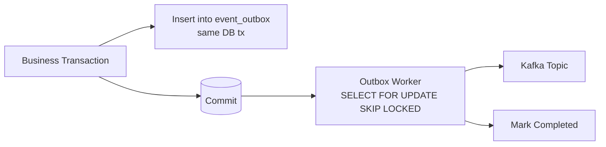
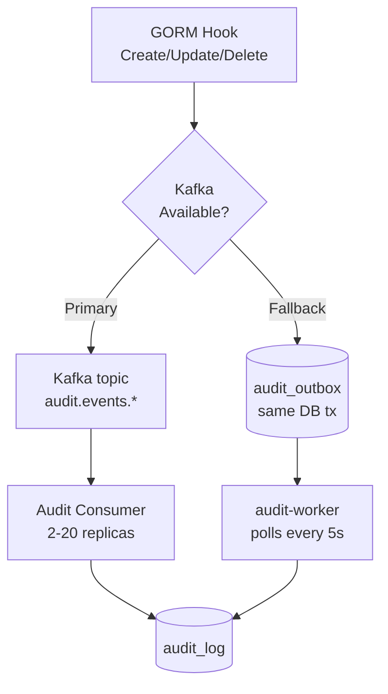
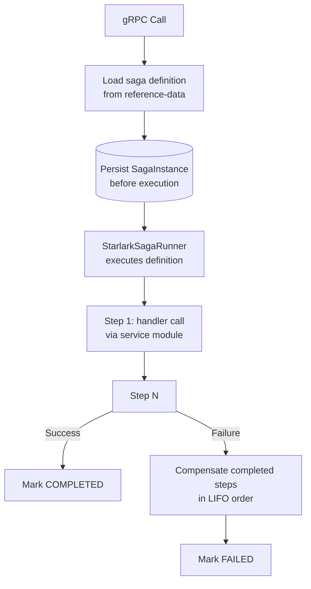
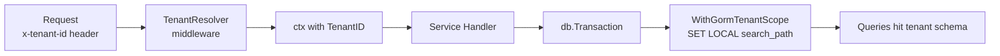
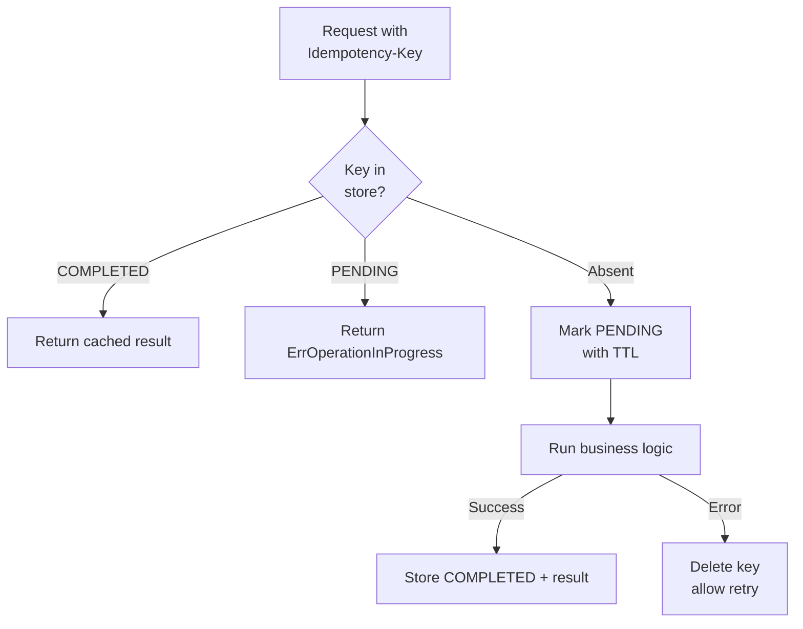
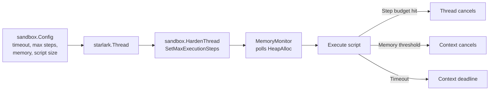

# Cross-Service Implementation Patterns

This document is the canonical index of cross-cutting patterns used across Meridian services. Each pattern lists its
canonical implementation, when to apply it, how it works at a glance, anti-patterns to avoid, and a verified example
reference.

When adding a new service or feature, prefer these patterns over inventing local equivalents. If a pattern does not
fit, raise the gap before writing service-local code - duplicated implementations of these primitives have caused
outages in the past (see ADR-0009 for the audit-pipeline example).

## Pattern Index

| # | Pattern | Canonical Location | Primary Concern |
|---|---------|--------------------|-----------------|
| 1 | [Outbox](#1-outbox-pattern) | `shared/platform/events/` | Reliable event publishing |
| 2 | [Audit Pipeline](#2-audit-pipeline) | `shared/platform/audit/` + `services/audit-worker/` | Tamper-evident change history |
| 3 | [Saga Handler (Starlark)](#3-saga-handler-starlark) | `shared/pkg/saga/` + `services/reference-data/saga/defaults/` | Multi-step workflows with compensation |
| 4 | [Tenant Scoping](#4-tenant-scoping) | `shared/platform/tenant/` | Multi-tenant isolation |
| 5 | [Idempotency](#5-idempotency) | `shared/pkg/idempotency/` | Exactly-once RPC semantics |
| 6 | [Starlark Sandbox](#6-starlark-sandbox) | `shared/platform/sandbox/` | Bounded execution of tenant scripts |

---

## 1. Outbox Pattern

### Canonical Location

`shared/platform/events/outbox.go` - `EventOutbox` model, `OutboxRepository` interface, `PostgresOutboxRepository`
implementation.

Companion files:

- `shared/platform/events/publisher.go` - `OutboxPublisher` for high-level "publish within transaction" API.
- `shared/platform/events/worker.go` - background worker that drains the outbox to Kafka.
- `shared/platform/events/outbox_pgx.go` - pgx-native variant for services that do not use GORM.

### When to Use

Any time a service needs to publish a domain event as part of a state-changing database transaction. The classic
failure mode without this pattern is dual-write inconsistency: the database commit succeeds but the Kafka publish
fails (or vice versa), leaving consumers permanently out of sync.

This pattern is mandatory for:

- Audit-critical control operations (SUSPEND, RESUME, TERMINATE).
- Lifecycle events that other services subscribe to (account opened, payment captured).
- Any event whose loss would corrupt downstream state.

### How It Works

The business operation and the outbox insert share a single database transaction, so either both succeed or both
roll back. A separate worker (one per service, multi-replica safe via `FOR UPDATE SKIP LOCKED`) reads pending
entries, publishes them to Kafka, and marks them completed. Failed publishes are retried with exponential backoff
up to a configured max, then moved to the `failed` status for operator inspection.

Status lifecycle: `pending` -> `processing` -> `completed` (or `failed` after exhausted retries). Stuck `processing`
entries are reset by `ResetStuckEntries` after a configurable threshold.

### Anti-patterns

- Publishing directly to Kafka inside a database transaction. Kafka writes are not transactional; if the DB commit
  later fails, you have orphaned events.
- Publishing directly to Kafka after the database transaction commits. If the process crashes between commit and
  publish, the event is lost forever with no recovery path.
- Building a per-service outbox table with a different schema. Use `event_outbox` and the shared repository so the
  worker, metrics, and operational tooling apply uniformly.
- Calling `Insert` with `tx == nil`. The repository returns `ErrNilTransaction` rather than silently writing through
  a non-transactional connection.

### Example Reference

- Wiring: `cmd/meridian/main.go:276` - `events.NewPostgresOutboxRepository(...)` constructed and injected into the
  financial-accounting service.
- Service usage: `services/financial-accounting/service/server.go:256-257` - service receives an `OutboxPublisher`
  and `PostgresOutboxRepository` as required dependencies.
- Constructor helper: `events.NewEventOutbox(eventType, aggregateID, aggregateType, payload, topic, serviceName,
  correlationID, tenantID)` at `shared/platform/events/outbox.go:313`.

---

## 2. Audit Pipeline

### Canonical Location

`shared/platform/audit/` - GORM hooks, dual-path publisher, consumer, and worker plumbing.

Companion service: `services/audit-worker/` - the fallback worker that drains `audit_outbox` when Kafka is
unavailable.

See ADR-0009 (`docs/adr/0009-application-level-audit-logging.md`) for the architectural rationale and ADR-0020
(`docs/adr/0020-per-service-audit-workers.md`) for the deployment model.

### When to Use

Every domain entity mutation that needs a tamper-evident history. This is non-negotiable for entities that touch
money, energy, regulated personal data, or tenant-visible state. "Internal" operations are not exempt - if it
changes a row, it gets audited.

### How It Works

Entities implement the `Auditable` interface (`AuditID()`, `AuditTableName()`) and add four GORM hooks that delegate
to `audit.RecordCreate`, `audit.CaptureOldValue`, `audit.RecordUpdate`, and `audit.RecordDelete`. The hooks attempt
a Kafka publish first; on failure they fall back to writing an `audit_outbox` row inside the same transaction as
the business operation, so the audit trail is never lost even during a Kafka outage.

| Path | Latency | Throughput | Trigger |
|------|---------|------------|---------|
| Primary (Kafka) | ~2 ms | 1000s/sec | Normal operation |
| Fallback (outbox) | 5 s polling | Bounded by worker batch size | Detected Kafka unavailability |

### Anti-patterns

- Skipping audit for "internal" or "system" operations. The auditor needs the full causal chain; gaps look like
  tampering.
- Synchronous audit writes in the request hot path. Use the GORM hooks - they handle the dual path correctly
  without blocking the caller.
- Map-based GORM updates (`db.Model(&Entity{}).Updates(map...)`) without a manual audit call. GORM hooks are
  bypassed for map updates; use `audit.RecordUpdateManual` after fetching the old row.
- Writing to `audit_log` directly. That table is the consumer's output; producers write to Kafka or the outbox.
- Building a per-service audit table. Use the shared `audit_outbox` and `audit_log` schemas so the audit-worker and
  queries work uniformly.

### Example Reference

- Entity implementing the interface: `services/payment-order/adapters/persistence/payment_order_entity.go:82` -
  `AuditID()` returns the UUID string.
- String-keyed entity variant: `services/tenant/adapters/persistence/entity.go:40` - `AuditID()` returns the raw
  string ID.
- Full README with quick-start template: `shared/platform/audit/README.md`.
- Worker operational guide: `services/audit-worker/README.md`.

---

## 3. Saga Handler (Starlark)

### Canonical Location

Runtime: `shared/pkg/saga/` - persistence, executor, handler registry, Starlark runner (`starlark_runner.go`).

Saga definitions: `services/reference-data/saga/defaults/` - one directory per saga, one `vMAJOR.MINOR.PATCH.star`
file per version. The reference-data service serves these to all consumers.

Schema: `shared/pkg/saga/schema/handlers.yaml` - declares every callable handler, its proto RPC, exposed parameters,
and compensation handler.

### When to Use

Any multi-step workflow where:

- Steps span multiple services or aggregates.
- Partial failure must roll back already-completed steps to a consistent state.
- The workflow needs to be inspectable, versionable, and resumable across service restarts.

Examples in production: deposits, withdrawals, payment execution, dunning escalation, dividend distribution, Stripe
payment capture.

### How It Works

Saga definitions are Starlark scripts that call typed service modules generated from `handlers.yaml`. The runner
persists the `SagaInstance` before execution begins, records each `SagaStepResult`, and on failure walks completed
steps in reverse, invoking the compensation handler declared on each. Compensation handlers are addresses, not
closures - they live in the schema, so a saga definition cannot smuggle in a custom rollback.

Saga instances are claimable (`shared/pkg/saga/claiming.go`) so multiple worker replicas can process them safely.
Lease renewal (`lease_renewer.go`) keeps long-running sagas from being stolen mid-execution. The orphan watcher
(`orphan_watcher.go`) reclaims sagas whose worker died.

### Anti-patterns

- Storing saga definitions inside the service that consumes them. Definitions live in reference-data so they can be
  hot-swapped without redeployment and reviewed centrally.
- Hardcoding compensation logic in Go. Compensation handlers are declared in `handlers.yaml` and resolved at
  registration time; in-line Starlark compensation closures defeat the audit trail.
- Calling handlers directly from gRPC instead of through a saga when the operation has more than one step. The saga
  is the unit of replay and audit; ad-hoc multi-step gRPC calls leave no recoverable trail.
- Using `while` loops or recursion in saga scripts. Starlark forbids both - the bounded execution guarantee is what
  makes sagas safe to run in production. See pattern 6.

### Example Reference

- Definition: `services/reference-data/saga/defaults/deposit/v1.0.0.star` - six-step deposit with double-entry
  posting.
- Multi-version definition: `services/reference-data/saga/defaults/stripe_payment/` - holds `v1.0.0.star`,
  `v2.0.0.star`, `v3.0.0.star`.
- Runner construction: `StarlarkSagaRunnerConfig` at `shared/pkg/saga/starlark_runner.go:35` - shows the `Runtime`,
  `Registry`, and pre-built `ServiceModules` it requires.
- Schema entry: `shared/pkg/saga/schema/handlers.yaml:29` - `position_keeping.initiate_log` with declared
  `compensate: position_keeping.cancel_log`.

---

## 4. Tenant Scoping

### Canonical Location

`shared/platform/tenant/` - `TenantID` type, context helpers (`WithTenant`, `FromContext`, `RequireFromContext`),
universal header keys.

Database scoping: `shared/platform/db/gorm_tenant_scope.go` - `WithGormTenantScope` sets the PostgreSQL `search_path`
for the active transaction.

Universal keys (`shared/platform/tenant/keys.go`):

- `x-tenant-id` - canonical tenant identifier (JWT, gRPC metadata, Kafka headers, HTTP).
- `x-tenant-slug` - URL-safe subdomain identifier.
- `x-tenant-display-name` - human-readable label.
- `x-tenant-status` - lifecycle status (`active`, `provisioning`, etc.).

### When to Use

Every operation that touches tenant data. There are no exceptions: even "platform" operations executed on behalf of
the platform itself flow through a tenant context (the platform-bills-itself dogfooding pattern uses a real tenant
ID).

### How It Works

The tenant ID enters the system through one canonical key (`x-tenant-id`) and is propagated through every layer
using the same key name - JWT claims, gRPC metadata, Kafka headers, HTTP headers, context values. Inside a
transaction, `WithGormTenantScope` issues `SET LOCAL search_path TO <tenant_schema>`; the public schema is
intentionally excluded so any query that targets an unscoped table fails fast rather than leaking across tenants.

`PropagateToBackground` is the only correct way to start a goroutine that outlives the request: it copies the
tenant fields onto a fresh background context, dropping the request's deadline but preserving identity.

### Anti-patterns

- Hardcoding tenant IDs in code, fixtures, or migrations. Use the `TenantID` type and propagate through context.
- Reading tenant from a custom header (`x-org-id`, `tenant`, `client-id`). Use the `TenantIDKey` constant; the
  resolver only honors that one key.
- `MustFromContext` in request paths. Use `RequireFromContext`, which returns `ErrMissingTenantContext` instead of
  panicking. `MustFromContext` is appropriate only at startup.
- `context.Background()` inside a request handler when spawning a goroutine. Use `tenant.PropagateToBackground(ctx)`
  so the async work still has tenant identity.
- Relying on the public schema as a fallback. Tenant schemas hold their own copy of reference data; queries that
  fall through to public are a leak in disguise.

### Example Reference

- Resolver middleware: `shared/platform/gateway/tenant_resolver.go` - extracts the slug from the subdomain (or
  `X-Tenant-Slug` in local dev), looks up the tenant, and attaches `TenantID`, slug, display name, and status to the
  request context.
- Database scope: `shared/platform/db/gorm_tenant_scope.go:59` - `WithGormTenantScope(ctx, tx)` returns the same tx
  with `search_path` set, or `ErrTenantScopeRequiresTransaction` outside a tx.
- Async propagation: `shared/platform/tenant/context.go:133` - `PropagateToBackground` example documented in the
  function's doc comment.

---

## 5. Idempotency

### Canonical Location

`shared/pkg/idempotency/` - `Key` and `Result` types, `Service` interface, `Executor` orchestrator.

Backends:

- `redis_service.go` - production backend, distributed across replicas.
- `postgres_service.go` - durable backend for environments without Redis.
- `noop_service.go` - test fixture only.

### When to Use

Every state-mutating RPC handler. Clients retry on network failures; without idempotency the platform
double-charges, double-credits, or double-issues. Read-only handlers do not need this.

### How It Works

The `Executor.Execute` call wraps the business function, performing check-pending-execute-store atomically. On
success, the result is cached under the key for the configured TTL (default 1 hour). On business-logic error, the
PENDING marker is deleted so the client can retry the same key. `ExecuteWithFailedState` is the variant that records
FAILED instead of deleting; use it for non-retryable errors like insufficient funds.

The `Key` is structured (`TenantID`, `Namespace`, `Operation`, `EntityID`, optional `RequestID`) and validated for
colon-collision before use. The TenantID prefix ensures tenants cannot observe or collide with each other's
idempotency state.

### Anti-patterns

- Per-instance in-memory caches as a stand-in. Idempotency must be shared across replicas; use Redis (or Postgres
  for environments without Redis), never a `sync.Map`.
- Skipping idempotency-key validation on the inbound request. A missing or malformed key is a client bug worth
  surfacing, not silently bypassing.
- Storing idempotency state in the same transaction as the business write. The whole point is that the marker
  survives the business transaction failing.
- Using a non-deterministic key (timestamp, random UUID generated server-side). The client supplies the key; it is
  what makes a retry recognizable.
- Treating `ErrOperationInProgress` as a hard failure. It is a transient signal; the client should back off and
  retry.

### Example Reference

- Wiring into a service: `services/financial-accounting/service/server.go:240-247` - documents how
  `idempotency.NewRedisService` is constructed and passed to the service constructor.
- Executor signature: `Executor.Execute(ctx, key, ttl, fn)` at `shared/pkg/idempotency/executor.go:140`.
- Chaos test demonstrating cleanup on panic:
  `services/financial-accounting/service/idempotency_chaos_test.go:164`.
- Package overview: `shared/pkg/idempotency/doc.go`.

---

## 6. Starlark Sandbox

### Canonical Location

`shared/platform/sandbox/` - `Config` struct with named presets (`DefaultConfig`, `ValuationConfig`,
`ForecasterConfig`), `HardenThread` to apply step limits, `MemoryMonitor` to enforce heap thresholds.

### When to Use

Every code path that executes tenant-supplied Starlark - sagas, valuation strategies, forecasting models,
control-plane validation. Platform-supplied scripts use the same sandbox so behavior is identical in tests and
production.

### How It Works

Three independent budgets bound every script: a hard step count (`MaxStepsPerExecution`), a heap allocation ceiling
(`MemoryThreshold`), and a wall-clock timeout enforced by the caller via `context.WithTimeout`. The step limit
alone is enough to guarantee termination because Starlark is intentionally not Turing-complete (no `while`, no
recursion); the memory and timeout limits guard against pathological-but-finite scripts.

| Preset | Timeout | Max Steps | Use Case |
|--------|---------|-----------|----------|
| `DefaultConfig` | 5 s | 1,000,000 | Saga execution |
| `ValuationConfig` | 5 s | 5,000,000 | Valuation scripts (more arithmetic) |
| `ForecasterConfig` | 10 s | 1,000,000 | Forecasting models |

All scripts are size-capped at 64 KB (`MaxScriptSize`).

### Anti-patterns

- Constructing a `starlark.Thread` directly without calling `sandbox.HardenThread`. Without the step limit, a
  tenant script can monopolize a worker indefinitely.
- Allowing `load()` of arbitrary modules. The runtime injects only the schema-derived service modules; arbitrary
  loads would let scripts pull in unverified code.
- Exposing file system, network, or `os` access through Starlark builtins. The bounded execution guarantee assumes
  pure computation - I/O is what handlers are for.
- Skipping the memory monitor in long-running runtimes. Step counts do not bound allocation; a few iterations of
  large list construction can OOM the worker.
- Per-runtime ad-hoc configs. If a runtime needs different limits, add a named preset to
  `shared/platform/sandbox/config.go` so the operating envelope is visible in one place.

### Example Reference

- Saga runtime: `shared/pkg/saga/runtime.go:244` - `sandbox.HardenThread(thread, sandboxCfg)` applied to every
  Starlark thread before execution.
- Valuation runtime: `shared/pkg/valuation/starlark_runtime.go:135` - same call site, different preset.
- Forecasting runtime: `services/forecasting/starlark/runner.go:315`.
- Control-plane validator: `services/control-plane/internal/validator/handler_schema_integration_test.go:455` -
  validation tests use `sandbox.DefaultConfig()` to mirror production constraints.
- Package overview: `shared/platform/sandbox/doc.go`.

---

## Cross-References

- ADR-0009: Application-Level Audit Logging - `docs/adr/0009-application-level-audit-logging.md`.
- ADR-0020: Per-Service Audit Workers - `docs/adr/0020-per-service-audit-workers.md`.
- Starlark saga architecture - `docs/architecture/starlark-saga-architecture.md`.
- Event-driven architecture overview - `docs/architecture/event-driven-architecture.md`.
- Audit hook quick-start - `shared/platform/audit/README.md`.
- Audit-worker operations guide - `services/audit-worker/README.md`.
