# PRD: Durable Execution Engine

**Status:** Implemented
**Version:** 1.1
**Task Master Tag:** `starlark-saga-orchestration` (24/24 tasks done)
**Companion PRD:** [Starlark Saga Orchestration (Core)](./006-starlark-saga-orchestration-core.md)

---

## Table of Contents

- [1. Executive Summary](#1-executive-summary)
- [2. Functional Requirements](#2-functional-requirements)
- [3. Technical Architecture](#3-technical-architecture)
- [4. Critical Implementation Directives](#4-critical-implementation-directives)
- [5. Parallel Work Streams](#5-parallel-work-streams)
- [6. Migration Strategy](#6-migration-strategy)
- [7. Success Criteria](#7-success-criteria)
- [8. Risks and Mitigations](#8-risks-and-mitigations)
- [9. Links](#9-links)

---

## 1. Executive Summary

The Durable Execution Engine provides the resilience layer ("The Muscle") for Meridian's
Starlark Saga Orchestration system. It ensures that saga execution survives pod restarts,
network failures, and service disruptions without data loss or duplicate processing.

### The Problem Statement

Modern financial workflows span multiple services and can take seconds to minutes to complete. Without durable execution:

| Pain Point | Business Impact |
|------------|-----------------|
| **Pod crash mid-saga** | Partial state, orphaned transactions, manual reconciliation |
| **Duplicate side effects** | Double payments, incorrect balances, audit failures |
| **No visibility into stuck workflows** | Zombie sagas consume resources indefinitely |
| **Non-deterministic replay** | Different results on retry, audit failures |

### The Solution

A durable execution engine built on three pillars:

1. **Replay-Based Recovery**: Re-execute Starlark scripts while returning cached results for completed steps
2. **Lease-Based Ownership**: Prevent race conditions with time-bounded pod claims
3. **Idempotency Guarantees**: Deterministic UUIDs, step-level caching, and external state verification

**Key insight**: By treating saga execution as a deterministic state machine with persistent
checkpoints, we transform Meridian into a "Mini-Temporal" for BIAN ledgers - providing
durable execution guarantees without the operational complexity of a separate workflow engine.

### Scope of This PRD

This PRD covers:

- **FR-13 to FR-26**: Durable execution, determinism, idempotency, performance
- **FR-28 to FR-32**: Error severity, valuation snapshot, async wait, deep copy, causation tree
- **Implementation Streams 7-8**: Durable Execution and External Integration
- **Migration Stream 9**: Migrating existing Go sagas to Starlark

For core Starlark runtime, reference validation, party isolation, and saga composition,
see the [Starlark Saga Orchestration (Core) PRD](./006-starlark-saga-orchestration-core.md).

---

## 2. Functional Requirements

### FR-13: Durable Execution via Replay

- **Requirement**: Saga execution MUST survive pod restarts without data loss
- **Checkpointing**: Before executing any side-effect-producing step, persist `SagaInstance` state
- **Recovery**: On pod restart, orphaned sagas MUST be detected and resumed
- **Replay**: Starlark script re-executes from start; completed steps return cached results
- **Idempotency keys**: Format is `saga_{instance_id}_step_{index}` (See Section 3.1 for details)
- **Idempotency**: Step handlers MUST be idempotent (use idempotency keys)

### FR-14: Strict Determinism

- **Requirement**: The Starlark runtime environment MUST be strictly deterministic
- **No time access**: Runtime MUST NOT provide `time.now()` or similar functions
- **Injected time**: All time-related logic MUST use `ctx.effective_at` or `ctx.knowledge_at`
  - `effective_at`: When the business event occurred (transaction date)
  - `knowledge_at`: When we learned about it (for bi-temporal replay)
- **No randomness**: Runtime MUST NOT provide random number generation
- **Handler purity**: Step handlers MUST return results derived solely from inputs and `knowledge_at`

### FR-15: Step Handler Output Contracts

- **Requirement**: Step handlers MUST return Starlark-compatible `Dict` or `Struct` types
- **Schema definition**: Each handler declares its output schema (keys and types)
- **Validation**: Reference validation SHOULD check that scripts access valid output keys
- **Documentation**: Handler schemas are auto-documented for saga authors

### FR-16: Simulation Mode Boundary

- **Requirement**: Step handlers MUST check `ctx.is_simulation` flag
- **Side-effect handlers**: When `is_simulation=true`, handlers for Financial
  Accounting, Payment Gateway, etc. MUST return mock success without executing
  real transactions
- **Read handlers**: May execute normally (data access is safe)
- **Audit**: Simulation executions are logged but marked as non-production

### FR-17: Causation ID Propagation

- **Requirement**: Runtime MUST automatically inject `causation_id` into all step handler calls
- **Compensation linking**: Compensation steps receive the parent step's `causation_id`
- **Audit trail**: All "Do" and "Undo" actions are linked via causation chain
- **Traceability**: Given any entry, trace back to the saga step that created it
- **See also**: FR-24 for `correlation_id` (groups entire business operation)

### FR-18: Side-Effect Idempotency Enforcement

- **Requirement**: Step Handlers for external integrations MUST explicitly
  declare their idempotency capability
- **Declaration**: Handlers marked `idempotency: "EXTERNAL_SUPPORTED"` or
  `idempotency: "EXTERNAL_NOT_SUPPORTED"`
- **Fail-fast**: If an external service does not support idempotency, the
  Runtime MUST fail-fast during ACTIVATION if that handler is used in a saga
  that lacks a "Pre-Step Check" pattern
- **Pre-Step Check pattern**: Query external system state before executing
  (e.g., check if payment already exists before creating)
- **Standard library**: Runtime provides `verify_external_state(gateway, check_func)`
  builtin for Pre-Step Check enforcement
- **Linter enforcement**: Logic/Physics Linter (SAGA-048) MUST warn if
  `EXTERNAL_NOT_SUPPORTED` handler is called without preceding
  `verify_external_state()` call
- **Rationale**: Replay execution could trigger double payments if external
  gateways don't support our idempotency keys

```python
# Pre-Step Check pattern for non-idempotent gateways
def pay_external(ctx):
    # REQUIRED: verify state before mutation
    if not verify_external_state(payment_gateway, lambda: gateway.check_exists(ctx.ref)):
        payment_gateway.pay(ctx.amount, ctx.ref)
```

### FR-19: Zombie Saga Detection

- **Requirement**: The `saga_instances` table MUST include a `replay_count` column
- **Max Replays**: If a saga exceeds `MAX_REPLAYS` (configurable, default: 5),
  it MUST be transitioned to `FAILED_MANUAL_INTERVENTION` status
- **Alerting**: Zombie detection MUST trigger a high-severity alert (P1) for operator intervention
- **Manual resolution**: Operator can inspect, fix Starlark logic, and reset
  replay_count or mark as permanently failed
- **Rationale**: Prevents infinite "Try -> Fail -> Replay -> Fail" loops from
  consuming resources indefinitely

### FR-20: Starlark Dry-Run Testing

- **Requirement**: The service SHALL provide an `ExecuteDryRun` RPC
- **Behaviour**: Runs the Starlark script in a virtual environment where all Step Handlers are mocked
- **Output**: Returns the intended "Execution Plan" (what steps would have been called, in what order, with what parameters)
- **No persistence**: Dry-run MUST NOT persist anything to the database
- **Use case**: Tenants can test their Starlark logic before calling `RegisterDataSet` to deploy to production
- **Validation**: Dry-run also validates attribute references against instrument schema

### FR-21: Deterministic UUID Generator

- **Requirement**: The Runtime MUST provide a `ctx.new_uuid()` builtin
- **Implementation**: Use **Version 5 UUIDs (Namespace UUIDs)** per RFC 4122
  - Namespace: `SagaInstance.ID`
  - Name: `"{StepIndex}:{CallIndex}"` (e.g., `"2:0"` for first call in step 2)
- **Stability**: Same saga instance replaying same step produces identical UUIDs
- **Call tracking**: `CallIndex` increments for each `new_uuid()` call within a step, reset to 0 on next step
- **Rationale**: Random UUIDs would break determinism during replay (different UUID each time)
- **Usage**: Reference numbers, correlation IDs, any generated identifiers within saga logic
- **Industry standard**: Version 5 UUIDs are the standard approach for deterministic UUID generation
- **Replay safety**: See FR-26 for seed reset requirements on step replay
- **CRITICAL: Namespace Immutability on Hot-Fix**: If a saga is hot-fixed (FR-22) and pointed
  to a new definition, it MUST RETAIN the original `saga_instance_id` as the namespace. This
  ensures ID stability across the version-migration boundary:
  - Steps 0-5 under v1: UUIDs = `UUIDv5(instance_123, "0:0")`, `UUIDv5(instance_123, "0:1")`, etc.
  - Step 6 under v2 (after hot-fix): UUIDs = `UUIDv5(instance_123, "6:0")` (SAME namespace!)
  - **Why**: Downstream systems using these UUIDs for idempotency must see consistent IDs
    even when the saga definition version changes mid-flight

### FR-22: Saga Hot-Fixing for Zombie Recovery

- **Requirement**: The Admin API MUST allow an operator to hot-fix a stuck
  `SagaInstance` via definition re-pointing (not instance-level script override)
- **Bi-temporal model**: Hot-fix works WITH the versioning system, not around it:
  1. Deploy fixed saga definition as new version (e.g., v1 -> v2)
  2. Update stuck instance's `saga_definition_id` to point to new version
  3. Reset `replay_count` to 0, set status to `PENDING`
  4. On resume: replay respects cached `saga_step_results` (completed steps skip)
  5. Failed step executes with NEW definition logic
- **Audit trail**:
  - `saga_instances.saga_definition_id` reflects actual version used
  - `saga_step_results` timestamps show when each step executed
  - Audit log captures: "Instance X re-pointed from v1 to v2 by operator Y,
    reason: Z"
- **Bi-temporal query**: "What actually happened?" -> Steps 0-5 under v1, step 6+ under v2
- **Guard rails**:
  - Hot-fix only available for `FAILED_MANUAL_INTERVENTION` status sagas
  - New definition version must pass ACTIVATION validation
- **Compensation scenario**: If completed steps produced wrong results (not just
  failed step), operator must trigger compensation first, then re-point and
  replay

```text
+-------------------------------------------------------------------------+
|  HOT-FIX FLOW (Bi-Temporal Compatible)                                  |
+-------------------------------------------------------------------------+
|                                                                         |
|  BEFORE:                                                                |
|  saga_definitions:  v1 (bug in step 6)                                  |
|  saga_instances:    instance_123, definition_id=v1, step=6, FAILED      |
|  saga_step_results: steps 0-5 COMPLETED (cached)                        |
|                                                                         |
|  HOT-FIX:                                                               |
|  1. INSERT saga_definitions v2 (with fix)                               |
|  2. UPDATE saga_instances SET definition_id=v2, replay_count=0,         |
|            status='PENDING' WHERE id=instance_123                       |
|  3. INSERT audit_log (operator, reason, old_version, new_version)       |
|                                                                         |
|  ON RESUME:                                                             |
|  - Load definition v2                                                   |
|  - Replay: steps 0-5 -> cached results exist -> SKIP                    |
|  - Replay: step 6 -> no cached result -> EXECUTE with v2 logic          |
|                                                                         |
|  BI-TEMPORAL RECORD:                                                    |
|  saga_instances.saga_definition_id = v2                                 |
|  saga_step_results[0-5].executed_at < hot-fix time                      |
|  saga_step_results[6+].executed_at > hot-fix time                       |
|                                                                         |
+-------------------------------------------------------------------------+
```

### FR-23: Reactive Orphan Wake-up (Fast-Path Resumption)

- **Requirement**: The system SHOULD use a reactive event signal to alert available
  pods immediately when a peer pod terminates, triggering an instant orphan scan
- **Performance gap**: 5-minute lease expiry is too slow for high-volume energy/wealth
  transactions where bills must resume within seconds of pod crash
- **Implementation options** (CockroachDB has no LISTEN/NOTIFY):
  - NATS subject for pod health events
  - Kubernetes pod termination webhook
  - Kafka topic for lease expiry signals
- **Fallback**: Background orphan scan at lease expiry interval (existing mechanism)
- **Latency target**: Resume orphaned saga within 10 seconds of pod crash (vs. 5 minutes passive)

### FR-24: Correlation ID Propagation

- **Requirement**: The Runtime MUST propagate a `correlation_id` from the trigger
  event through the entire saga lifecycle
- **Distinction from causation_id**:
  - `causation_id`: Links cause->effect within saga (step created this entry)
  - `correlation_id`: Groups ALL related actions across the entire business operation
- **Use case**: Energy settlement splits into Retail, Wholesale, Tax entries. The
  `correlation_id` enables "Unified Position View" dashboard query:
  `SELECT * FROM entries WHERE correlation_id = ?`
- **Propagation**: `correlation_id` flows to `ObservationRecorded`, `PostingCreated`,
  and all downstream events
- **Schema**: Add `correlation_id UUID NOT NULL` to `saga_instances`

### FR-25: Progress Emission for UI Integration

- **Requirement**: Starlark scripts MUST be able to emit non-blocking progress updates
- **Builtin**: `ctx.emit_progress(message, percentage)` where percentage is 0-100
- **Implementation**: Progress updates published to Kafka topic `saga.progress.{tenant_id}`
- **Consumer**: Mobile/Edge apps subscribe to show real-time settlement status
  (e.g., "Step 2 of 4: Valuating positions... 50%")
- **Non-blocking**: `emit_progress()` does NOT persist to database; fire-and-forget
- **Idempotency**: Progress is informational; safe to emit same progress on replay

### FR-26: Deterministic UUID Seed Reset on Replay

- **Requirement**: The `ctx.new_uuid()` generator MUST be reset to a consistent
  seed at the start of every Step Replay
- **Problem**: If a pod crashes during step execution (after some `new_uuid()` calls),
  the second attempt must generate the exact same identifiers
- **Implementation**:
  - Seed = `SHA256(saga_instance_id + step_index)`
  - `CallIndex` counter reset to 0 at step start
  - UUID = `UUIDv5(namespace=seed, name=CallIndex)`
- **Guarantee**: Same saga instance, same step, same call sequence = identical UUIDs
- **Downstream benefit**: External systems using these UUIDs for idempotency will
  correctly deduplicate retried calls

### FR-28: Step Error Severity Classification

- **Requirement**: Step Handlers MUST return an error category to distinguish failure modes
- **Categories**:
  - `TRANSIENT` (e.g., network timeout, temporary unavailability): Increments `replay_count`,
    triggers retry
  - `FATAL` (e.g., insufficient funds, CEL validation failure, business rule violation):
    Transitions saga to `COMPENSATING` immediately without wasting replay attempts
- **Rationale**: Prevents a "broken meter read" from attempting 5 retries before failing
- **Benefits**: Improves throughput, reduces P1 alert noise, faster failure resolution
- **Schema**: Add `error_category VARCHAR(16)` to `saga_step_results` (TRANSIENT/FATAL/NULL)

### FR-29: Valuation Snapshot Stability

- **Requirement**: The `valuate_batch()` builtin MUST be treated as a side-effecting step
  for replay purposes
- **Persistence**: Once a Valuation result is obtained, the **entire response** (including
  market observation IDs, rates, and basis) MUST be persisted in `saga_step_results`
- **Replay behaviour**: On replay, return the cached valuation result instead of re-calling
  the Valuation Engine
- **Audit continuity**: If market data is purged from MIM after 7 years (per retention
  policy), legacy audit replay still works because the valuation was "snapshotted"
- **Schema**: `saga_step_results.output` stores full valuation response as JSONB

### FR-30: Async/Wait Pattern for External Events

- **Requirement**: The Runtime MUST support a `ctx.suspend(idempotency_key)` builtin
  for long-running external waits (e.g., DNO payment confirmation webhook)
- **Problem**: Pod holding lease for days while waiting for webhook is inefficient
- **Behaviour**:
  1. `ctx.suspend()` saves current saga state to `saga_step_results`
  2. Releases pod lease
  3. Transitions status to `WAITING_FOR_EVENT`
- **Resume**: Separate gRPC endpoint `CompleteSagaStep(saga_id, idempotency_key, result)`
  wakes the saga when external callback arrives
- **Idempotency**: Multiple callbacks with same `idempotency_key` are deduplicated
- **Timeout**: Optional `ctx.suspend(key, timeout=duration)` auto-fails after deadline

### FR-31: Deep-Copy Serialisation Boundary

- **Requirement**: When persisting `SagaStepResult.output_snapshot`, the Go runtime
  MUST serialize the Starlark value to JSON and deserialize back
- **Problem**: If step handler returns pointer to Go map and Starlark modifies it,
  the persisted result may differ from what the script "thinks" it has
- **Implementation**: `output_snapshot = json.Unmarshal(json.Marshal(starlarkValue))`
- **Guarantee**: Replayed steps always receive fresh, immutable copy of result
- **Prevention**: Eliminates memory-leaked side effects from infecting replay logic

### FR-32: Causation Tree Visualization API

- **Requirement**: The `saga_execution_log` MUST support a recursive query that
  visualizes the "Causation Tree" (Parent -> Step -> Child Saga -> Step)
- **Use case**: Energy settlement with 1 parent + 3 child sagas across pod restarts
- **Primary consumer**: Ken's support team debugging complex nested workflow failures
- **Query**: `GET /admin/sagas/{id}/causation-tree` returns:

```json
{
  "saga_id": "parent-123",
  "steps": [
    {"index": 0, "name": "validate", "status": "COMPLETED"},
    {"index": 1, "name": "split", "status": "COMPLETED", "child_sagas": [
      {"saga_id": "child-456", "name": "retail_posting", "status": "COMPLETED"},
      {"saga_id": "child-789", "name": "wholesale_posting", "status": "FAILED",
       "failed_step": {"index": 2, "error": "Insufficient balance"}}
    ]},
    {"index": 2, "name": "finalise", "status": "PENDING"}
  ]
}
```

- **Schema**: Add `parent_saga_id UUID` and `parent_step_index INTEGER` to `saga_instances`

### FR-33: Semantic Logic/Physics Linter

- **Requirement**: The Linter SHALL be semantic, not just syntactic, for Decimal arithmetic
- **Problem**: Developers may bypass "no maths in Starlark" rule using new Decimal type
- **Detection**: Warn on any arithmetic operator (`+`, `-`, `*`, `/`) where operands
  are not derived from simple counters or loop indices
- **Suggested message**: "Financial maths detected. Move this to a CEL Valuation
  Strategy in Reference Data."
- **Exemptions**: Counter arithmetic (`i + 1`), list indexing, percentage calculations
  using pre-validated rates from Valuation Engine
- **Enforcement level**: WARNING at DRAFT, ERROR at ACTIVATION (configurable)

---

## 3. Technical Architecture

### 3.1 Durable Execution (Pod Survival)

Saga execution must survive pod restarts. This is achieved through **Replay** -
re-executing the Starlark script while returning cached results for completed
steps.

#### Ownership Model

| Component | Location | Rationale |
|-----------|----------|-----------|
| `saga_definitions` | Reference Data (shared) | Definitions are tenant config, cached globally |
| `saga_instances` | Each service's schema | Execution state is service-local (like audit log) |
| `saga_step_results` | Each service's schema | Step results are service-local |

> **Pattern**: Common schema definition, service-local tables. Each service
> (Payment Order, Current Account, etc.) has its own saga execution state.

#### Service-Local Execution State Schema

```sql
-- Each service has these tables in its schema (common pattern, local data)

CREATE TABLE saga_instances (
    id UUID PRIMARY KEY DEFAULT gen_random_uuid(),

    -- Saga definition reference
    saga_definition_id UUID NOT NULL,     -- References saga_definitions (cross-service)
    saga_name VARCHAR(64) NOT NULL,       -- Denormalized for query
    saga_version INTEGER NOT NULL,

    -- Input and context (for replay)
    input_snapshot JSONB NOT NULL,
    party_id UUID NOT NULL,
    knowledge_at TIMESTAMPTZ,             -- Bi-temporal context

    -- Tracing (FR-17, FR-24, FR-32)
    correlation_id UUID NOT NULL,         -- Groups entire business operation (FR-24)
    causation_id UUID,                    -- Parent saga/step that triggered this (FR-17)
    parent_saga_id UUID,                  -- For causation tree visualization (FR-32)
    parent_step_index INTEGER,            -- Which step in parent invoked this child

    -- Async/Wait (FR-30)
    suspend_idempotency_key VARCHAR(128), -- Key for external event correlation
    suspend_timeout_at TIMESTAMPTZ,       -- Auto-fail deadline for suspended sagas

    -- Ownership (race condition prevention)
    claimed_by_pod VARCHAR(128),          -- e.g., "payment-order-5d4f8c-xyz"
    claimed_at TIMESTAMPTZ,
    lease_expires_at TIMESTAMPTZ,         -- claimed_at + lease_duration (default 5 min)

    -- Progress
    current_step_index INTEGER NOT NULL DEFAULT 0,
    replay_count INTEGER NOT NULL DEFAULT 0,   -- Incremented on each replay attempt
    status VARCHAR(32) NOT NULL DEFAULT 'PENDING',
    -- PENDING, RUNNING, WAITING_FOR_EVENT, COMPLETED, COMPENSATING, COMPENSATED, FAILED, FAILED_MANUAL_INTERVENTION

    -- Timestamps
    created_at TIMESTAMPTZ NOT NULL DEFAULT NOW(),
    started_at TIMESTAMPTZ,
    completed_at TIMESTAMPTZ,

    -- Error context
    error_message TEXT,
    failed_step_index INTEGER
);

CREATE INDEX idx_saga_instances_orphaned
    ON saga_instances(status, lease_expires_at)
    WHERE status IN ('PENDING', 'RUNNING', 'COMPENSATING');

CREATE TABLE saga_step_results (
    id UUID PRIMARY KEY DEFAULT gen_random_uuid(),
    saga_instance_id UUID NOT NULL REFERENCES saga_instances(id) ON DELETE CASCADE,
    step_index INTEGER NOT NULL,
    step_name VARCHAR(64) NOT NULL,

    -- Idempotency (critical for replay safety)
    idempotency_key VARCHAR(128) NOT NULL,

    -- Result (for replay - skip re-execution)
    output_snapshot JSONB,
    status VARCHAR(16) NOT NULL,          -- COMPLETED, FAILED
    executed_at TIMESTAMPTZ NOT NULL DEFAULT NOW(),

    -- Error classification (FR-28)
    error_category VARCHAR(16),           -- TRANSIENT, FATAL, NULL

    -- Causation linkage
    causation_id UUID NOT NULL,

    UNIQUE(saga_instance_id, step_index),
    UNIQUE(idempotency_key)
);
```

#### Idempotency Key Format

The idempotency key format ensures uniqueness and traceability:

```text
saga_{instance_id}_step_{index}
```

Example: `saga_a1b2c3d4-e5f6-7890-abcd-ef1234567890_step_3`

#### Lease-Based Claiming (Race Condition Prevention)

When multiple pods exist, only one should process a given saga:

```go
// Pod startup or worker loop: claim orphaned sagas
func (w *SagaWorker) claimOrphanedSagas(ctx context.Context) ([]uuid.UUID, error) {
    // SELECT FOR UPDATE SKIP LOCKED prevents race conditions
    rows, err := w.db.QueryContext(ctx, `
        UPDATE saga_instances
        SET claimed_by_pod = $1,
            claimed_at = NOW(),
            lease_expires_at = NOW() + INTERVAL '5 minutes'
        WHERE id IN (
            SELECT id FROM saga_instances
            WHERE status IN ('PENDING', 'RUNNING', 'COMPENSATING')
              AND (
                  lease_expires_at < NOW()           -- Lease expired (pod died)
                  OR claimed_by_pod IS NULL          -- Never claimed
              )
            FOR UPDATE SKIP LOCKED                   -- Prevent race with other pods
            LIMIT 10                                 -- Batch size
        )
        RETURNING id
    `, w.podID)
    // ... return claimed instance IDs
}
```

#### Orphan Detection

Orphaned sagas are those with:

- Status in `PENDING`, `RUNNING`, or `COMPENSATING`
- `lease_expires_at < NOW()` (pod died without completing)
- OR `claimed_by_pod IS NULL` (never claimed)

The recovery worker periodically scans for orphans and claims them for processing.

#### Replay Execution Flow

```text
+-------------------------------------------------------------------------+
|                    Durable Execution via Replay                          |
+-------------------------------------------------------------------------+
|                                                                         |
|  NORMAL EXECUTION (Pod A):                                              |
|  -------------------------                                              |
|  1. INSERT saga_instances (claimed_by="pod-A", lease_expires=NOW()+5m) |
|  2. Execute Step 0:                                                     |
|     a. Generate idempotency_key = "saga_{id}_step_0"                   |
|     b. Call step handler                                                |
|     c. INSERT saga_step_results (output, causation_id)                 |
|     d. UPDATE saga_instances SET current_step_index = 1                |
|  3. Renew lease (background goroutine, every 2 minutes)                |
|  4. Execute Step 1 -> same pattern                                      |
|  5. Pod A dies mid-Step 2 (after handler call, before result save)     |
|                                                                         |
|  RECOVERY (Pod B picks up orphaned saga):                              |
|  ----------------------------------------                              |
|  1. SELECT orphaned sagas WHERE lease_expires < NOW()                  |
|  2. UPDATE ... SET claimed_by="pod-B" ... FOR UPDATE SKIP LOCKED       |
|  3. Load saga_definition (from Reference Data, cached)                 |
|  4. Load saga_step_results for this instance                           |
|  5. REPLAY Starlark script from start:                                 |
|     Step 0: Check saga_step_results -> EXISTS -> return cached output  |
|     Step 1: Check saga_step_results -> EXISTS -> return cached output  |
|     Step 2: Check saga_step_results -> NOT FOUND -> execute handler    |
|             Handler uses idempotency_key -> downstream service says    |
|             "already processed" -> return existing result              |
|  6. Continue normally from Step 3                                      |
|                                                                         |
+-------------------------------------------------------------------------+
```

#### Step Handler Wrapper (Replay-Safe)

```go
// Runtime wraps all step handler calls for replay safety
func (r *Runtime) executeStep(
    ctx context.Context, instance *SagaInstance, stepIndex int, handler StepHandler,
) (any, error) {
    // Generate deterministic idempotency key
    idempotencyKey := fmt.Sprintf("saga_%s_step_%d", instance.ID, stepIndex)

    // Generate deterministic causation_id (CRITICAL: must be stable across replays)
    // Uses UUID v5 with saga instance as namespace and step index as name
    causationID := uuid.NewSHA1(uuid.MustParse(instance.ID), []byte(fmt.Sprintf("step_%d", stepIndex)))

    // Check if step already completed (replay case)
    existing, err := r.stepResultRepo.GetByIdempotencyKey(ctx, idempotencyKey)
    if err == nil && existing != nil {
        log.Info("Replaying step - returning cached result",
            "saga_id", instance.ID, "step", stepIndex)
        return existing.OutputSnapshot, nil
    }

    // Not yet executed - call the handler
    output, err := handler.Execute(ctx, StepContext{
        IdempotencyKey: idempotencyKey,
        CausationID:    causationID,  // Deterministic - same on replay
        IsSimulation:   instance.IsSimulation,
        KnowledgeAt:    instance.KnowledgeAt,
    })
    if err != nil {
        return nil, err
    }

    // CRITICAL: Transaction Affinity - result save and index update MUST be atomic
    tx, err := r.db.BeginTx(ctx, nil)
    if err != nil {
        return nil, fmt.Errorf("failed to begin transaction: %w", err)
    }
    defer tx.Rollback()

    // 1. Persist step result
    err = r.stepResultRepo.SaveTx(tx, &SagaStepResult{
        SagaInstanceID:  instance.ID,
        StepIndex:       stepIndex,
        IdempotencyKey:  idempotencyKey,
        OutputSnapshot:  output,
        Status:          "COMPLETED",
        CausationID:     causationID,
    })
    if err != nil {
        return nil, fmt.Errorf("failed to persist step result: %w", err)
    }

    // 2. Update current_step_index in SAME transaction
    _, err = tx.ExecContext(ctx, `
        UPDATE saga_instances
        SET current_step_index = $1, replay_count = 0
        WHERE id = $2
    `, stepIndex+1, instance.ID)
    if err != nil {
        return nil, fmt.Errorf("failed to update step index: %w", err)
    }

    if err := tx.Commit(); err != nil {
        return nil, fmt.Errorf("failed to commit step: %w", err)
    }

    return output, nil
}
```

> **Implementation Directive: Transaction Affinity**
>
> The update to `current_step_index` and the insertion into `saga_step_results`
> MUST happen in the same database transaction. This prevents the "Gap of
> Uncertainty" where:
>
> - A result is saved but the index isn't moved (step re-executes on recovery,
>   but idempotency key catches it)
> - Or the index is moved but result isn't saved (step is skipped on recovery,
>   losing data)
>
> By making these atomic, we guarantee that saga state is always consistent.
> The `replay_count` is also reset to 0 on successful step completion.
>
> **Database Requirement**: PostgreSQL fully supports transactional DDL and
> multi-statement transactions within a single `BEGIN`/`COMMIT` block. This is
> the "Gold Standard" for preventing "Ghost Steps" where partial state persists.
>
> **Implementation Directive: Outbox Integration**
>
> The atomic transaction that persists a Step Result MUST also include any Domain Events
> (FR-25: Progress) in a local `outbox` table. This ensures that progress updates and
> side-effects are never "orphaned" from the persisted saga state.
>
> ```go
> // Within the same transaction as step result:
> err = r.outboxRepo.InsertTx(tx, &OutboxEvent{
>     SagaInstanceID: instance.ID,
>     StepIndex:      stepIndex,
>     EventType:      "saga.progress",
>     Payload:        progressPayload,
>     CreatedAt:      time.Now(),
> })
> ```
>
> **Rationale**: If progress events are published directly to Kafka without outbox,
> a pod crash between Kafka publish and database commit could result in:
>
> - Progress event published but step not persisted (UI shows progress, but saga restarts)
> - Progress event lost but step persisted (UI shows stale progress)
>
> **Outbox pattern**: Events are persisted transactionally, then a background worker
> publishes to Kafka and deletes from outbox. This guarantees exactly-once semantics
> for domain events relative to saga state.

#### Lease Renewal (Keep-Alive)

```go
// While processing, keep renewing the lease to prevent other pods from claiming
func (w *SagaWorker) renewLease(ctx context.Context, instanceID uuid.UUID) {
    ticker := time.NewTicker(2 * time.Minute)  // Renew well before 5min expiry
    defer ticker.Stop()

    for {
        select {
        case <-ctx.Done():
            return
        case <-ticker.C:
            _, err := w.db.ExecContext(ctx, `
                UPDATE saga_instances
                SET lease_expires_at = NOW() + INTERVAL '5 minutes'
                WHERE id = $1 AND claimed_by_pod = $2
            `, instanceID, w.podID)
            if err != nil {
                log.Warn("Failed to renew saga lease", "instance_id", instanceID, "error", err)
            }
        }
    }
}
```

### 3.2 Bi-Temporal Model Integration

The durable execution engine integrates with Meridian's bi-temporal data model:

| Timestamp | Purpose | Usage in Durable Execution |
|-----------|---------|---------------------------|
| `effective_at` | When the business event occurred | Passed to step handlers for date-sensitive logic |
| `knowledge_at` | When we learned about the event | Used for bi-temporal replay and audit |
| `executed_at` | When the step actually ran | Stored in `saga_step_results` for audit trail |

This enables questions like:

- "What did we know when we processed this saga?" (knowledge_at)
- "When was each step actually executed?" (executed_at)
- "What business date was this for?" (effective_at)

### 3.3 Bi-Temporal Saga Replay

Audit and compliance require answering: "What saga was used 3 months ago to derive this value?"

#### Temporal Query Pattern

```sql
-- What saga version was ACTIVE on 2025-10-15?
SELECT * FROM saga_definitions
WHERE name = 'energy_settlement'
  AND activated_at <= '2025-10-15'
  AND (deprecated_at IS NULL OR deprecated_at > '2025-10-15')
ORDER BY version DESC
LIMIT 1;

-- What saga was used to produce execution X?
SELECT sd.*
FROM saga_execution_log sel
JOIN saga_definitions sd ON sd.id = sel.saga_definition_id
WHERE sel.id = :execution_id;
```

#### Replay with Historical Saga

```python
# Replay execution with the EXACT saga version that was active then
def replay_execution(execution_id: UUID, knowledge_at: datetime) -> SagaResult:
    # Get original execution
    original = saga_execution_log.get(execution_id)

    # Load the saga version that was used (not current ACTIVE)
    saga_def = saga_definitions.get(original.saga_definition_id)

    # Replay with same inputs and knowledge_at
    return runtime.execute(
        saga_definition = saga_def,
        inputs = original.input_snapshot,
        knowledge_at = knowledge_at,  # Bi-temporal: what we knew then
        mode = "REPLAY",              # No side effects, just compute
    )
```

#### Saga Version Lineage

```text
+-------------------------------------------------------------------------+
|                    Saga Version Timeline                                 |
+-------------------------------------------------------------------------+
|                                                                         |
|  energy_settlement v1.0                                                 |
|  +- activated_at: 2025-01-01                                           |
|  +- deprecated_at: 2025-06-15                                          |
|  +- successor_id: -> v2.0                                              |
|                                                                         |
|  energy_settlement v2.0                                                 |
|  +- activated_at: 2025-06-15                                           |
|  +- deprecated_at: 2025-11-01                                          |
|  +- successor_id: -> v3.0                                              |
|                                                                         |
|  energy_settlement v3.0                                                 |
|  +- activated_at: 2025-11-01                                           |
|  +- deprecated_at: NULL (current)                                      |
|  +- successor_id: NULL                                                 |
|                                                                         |
|  Query: "What saga was active on 2025-08-20?"                          |
|  Answer: energy_settlement v2.0                                        |
|                                                                         |
+-------------------------------------------------------------------------+
```

#### Replay Verification

To verify historical calculations haven't drifted:

```python
# Verify: does replaying with original saga produce same result?
def verify_execution(execution_id: UUID) -> VerificationResult:
    original = saga_execution_log.get(execution_id)

    replayed = replay_execution(
        execution_id = execution_id,
        knowledge_at = original.knowledge_at,
    )

    return VerificationResult(
        original_hash = original.output_hash,
        replayed_hash = hash(replayed.output),
        matches = original.output_hash == hash(replayed.output),
        drift_details = diff(original.output_snapshot, replayed.output) if not matches else None,
    )
```

### 3.4 Saga Execution Audit Log

All saga executions are logged with party context and bi-temporal references:

```sql
CREATE TABLE saga_execution_log (
    id UUID PRIMARY KEY,

    -- Saga reference (bi-temporal: which version was active when?)
    saga_definition_id UUID NOT NULL REFERENCES saga_definitions(id),
    saga_name VARCHAR(64) NOT NULL,       -- Denormalized for query
    saga_version INTEGER NOT NULL,        -- Version that was executed

    -- Party context
    party_id UUID NOT NULL,               -- Executing party
    party_type VARCHAR(16) NOT NULL,      -- INDIVIDUAL, ORGANIZATION, SYSTEM
    visible_parties UUID[] NOT NULL,      -- Parties data was accessed for

    -- Bi-temporal timestamps
    started_at TIMESTAMPTZ NOT NULL,
    completed_at TIMESTAMPTZ,
    knowledge_at TIMESTAMPTZ,             -- For replay: what time context was used

    -- Execution result
    status VARCHAR(16) NOT NULL,          -- RUNNING, COMPLETED, COMPENSATED, FAILED
    input_hash VARCHAR(64),               -- SHA256 of input for replay verification
    output_snapshot JSONB,                -- Result for audit

    -- Error context
    error_message TEXT,
    failed_step VARCHAR(64)
);

-- Query: What sagas touched party P005's data?
CREATE INDEX idx_saga_execution_visible_parties
    ON saga_execution_log USING GIN(visible_parties);

-- Query: What saga version was used for this execution?
CREATE INDEX idx_saga_execution_temporal
    ON saga_execution_log(saga_name, started_at);
```

### 3.5 Durable Execution Builtins

Functions available within Starlark scripts for durable execution:

| Builtin | Signature | Description |
|---------|-----------|-------------|
| `ctx.new_uuid()` | `ctx.new_uuid() -> UUID` | Deterministic Version 5 UUID (namespace=saga_id, name=step:call). Stable across replays |
| `ctx.emit_progress()` | `ctx.emit_progress(message, percentage)` | Non-blocking progress update (0-100%). Published to Kafka `saga.progress.{tenant_id}` for UI consumption |
| `ctx.suspend()` | `ctx.suspend(idempotency_key, timeout=None) -> void` | Suspend saga waiting for external event (FR-30). Releases lease, status -> WAITING_FOR_EVENT. Resume via `CompleteSagaStep` gRPC |
| `verify_external_state()` | `verify_external_state(handler, check_fn) -> bool` | Pre-Step Check for non-idempotent external handlers. Required before EXTERNAL_NOT_SUPPORTED calls |
| `valuate_batch()` | `valuate_batch(instrument, quantity, context_types[]) -> Dict[context_type, valuation]` | Valuate same basis across multiple contexts; returns dictionary keyed by context_type (e.g., `results["RETAIL"]`, `results["WHOLESALE"]`). Result is cached in `saga_step_results` for replay |

#### Built-in Context Fields

| Field | Type | Description |
|-------|------|-------------|
| `ctx.effective_at` | `Timestamp` | When the business event occurred (transaction date) |
| `ctx.knowledge_at` | `Timestamp` | When we learned about it (for bi-temporal replay) |
| `ctx.is_simulation` | `bool` | Whether running in simulation mode (no real side effects) |
| `ctx.correlation_id` | `UUID` | Groups ALL related actions across the entire business operation |
| `ctx.causation_id` | `UUID` | Links cause->effect within saga (step created this entry) |
| `ctx.party_scope` | `PartyScope` | Immutable party scope for data isolation |

### 3.6 Security Constraints for Deterministic Execution

#### Starlark Sandbox

| Constraint | Value | Rationale |
|------------|-------|-----------|
| Max script size | 64 KB | Prevent memory exhaustion |
| Max execution time | 5 seconds | Prevent runaway scripts |
| No `while` loops | Language design | Guaranteed termination |
| No recursion depth > 50 | Runtime limit | Prevent stack overflow |
| No file I/O | Language design | Sandboxed execution |
| No network access | Language design | No external calls |
| Deterministic | Language design | Reproducible execution |

#### Disabled Functions Reference

| Function | Status | Alternative |
|----------|--------|-------------|
| `load()` | **Blocked** | Use whitelisted builtins only |
| `print()` | **Redirected** | Routes to `AuditLogger`, not stdout |
| `time.now()` | **Blocked** | Use `ctx.knowledge_at` or `ctx.effective_at` |
| `random()` | **Blocked** | Use `ctx.new_uuid()` for deterministic IDs |
| `exec()` | **Blocked** | Not in go.starlark.net, explicitly excluded |
| `compile()` | **Blocked** | Not in go.starlark.net, explicitly excluded |
| `open()` | **Blocked** | No file I/O |
| `http.*` | **Blocked** | No network; use step handlers for external calls |

#### Implementation Guidance (go.starlark.net)

The Go implementation requires explicit hardening beyond Starlark's language-level safety:

```go
// Create hardened Starlark environment
func NewSagaThread(ctx context.Context, auditLogger AuditLogger) *starlark.Thread {
    thread := &starlark.Thread{
        Name: "saga-executor",
        Print: func(_ *starlark.Thread, msg string) {
            // Route print() to audit system, not stdout
            auditLogger.Log("STARLARK_PRINT", msg)
        },
    }

    // Set execution timeout
    thread.SetLocal("context", ctx) // For cancellation checks

    return thread
}

// Whitelisted built-ins only - no load(), no file access
var SagaBuiltins = starlark.StringDict{
    // Domain-specific orchestration functions
    "saga":               starlark.NewBuiltin("saga", sagaBuiltin),
    "step":               starlark.NewBuiltin("step", stepBuiltin),
    "posting":            starlark.NewBuiltin("posting", postingBuiltin),
    "cel_eval":           starlark.NewBuiltin("cel_eval", celEvalBuiltin),
    "resolve_account":    starlark.NewBuiltin("resolve_account", resolveAccountBuiltin),
    "resolve_instrument": starlark.NewBuiltin("resolve_instrument", resolveInstrumentBuiltin),
    "invoke_saga":        starlark.NewBuiltin("invoke_saga", invokeSagaBuiltin),
    "fail":               starlark.NewBuiltin("fail", failBuiltin),
    "log":                starlark.NewBuiltin("log", logBuiltin),
    "Decimal":            starlark.NewBuiltin("Decimal", decimalBuiltin),

    // Safe subset of standard library
    "True":  starlark.True,
    "False": starlark.False,
    "None":  starlark.None,
    "list":  starlark.NewBuiltin("list", starlark.ListBuiltin),
    "dict":  starlark.NewBuiltin("dict", starlark.DictBuiltin),
    "len":   starlark.NewBuiltin("len", starlark.LenBuiltin),
    "str":   starlark.NewBuiltin("str", starlark.StrBuiltin),
    "int":   starlark.NewBuiltin("int", starlark.IntBuiltin),

    // Explicitly BLOCKED (not included):
    // - load()      -> No module imports
    // - print()     -> Replaced with audit-routed version above
    // - time.now()  -> Use ctx.knowledge_at instead
    // - random()    -> Non-deterministic, forbidden
}
```

#### Timeout and Cancellation

Use Go's `context` package to enforce execution limits:

```go
func (r *Runtime) ExecuteSaga(
    ctx context.Context, def *SagaDefinition, input any,
) (*SagaResult, error) {
    // Enforce 5-second timeout
    ctx, cancel := context.WithTimeout(ctx, 5*time.Second)
    defer cancel()

    thread := NewSagaThread(ctx, r.auditLogger)

    // Check for cancellation periodically during execution
    thread.SetLocal("cancel_check", func() error {
        select {
        case <-ctx.Done():
            return fmt.Errorf("saga execution cancelled: %w", ctx.Err())
        default:
            return nil
        }
    })

    // Execute with resource limits
    _, err := starlark.ExecFile(thread, def.Name, def.Script, SagaBuiltins)
    if err != nil {
        if errors.Is(err, context.DeadlineExceeded) {
            return nil, fmt.Errorf("saga exceeded 5s execution limit")
        }
        return nil, err
    }
    // ...
}
```

### 3.7 Step Handler Interface for Durable Execution

Step handlers must declare their idempotency capability for safe replay:

```go
type StepHandler interface {
    // Execute performs the step action
    Execute(ctx StepContext, params map[string]any) (any, error)

    // Compensate reverses the step action (for rollback)
    Compensate(ctx CompensationContext, params map[string]any) error

    // Idempotency declares how the handler handles replay
    Idempotency() IdempotencyType

    // OutputSchema describes the return type for validation
    OutputSchema() OutputSchema
}

type IdempotencyType string

const (
    // Handler is naturally idempotent (safe to retry)
    IdempotentByDesign IdempotencyType = "IDEMPOTENT"

    // Handler uses provided idempotency key for deduplication
    IdempotentWithKey IdempotencyType = "IDEMPOTENT_WITH_KEY"

    // External service supports idempotency keys
    ExternalSupported IdempotencyType = "EXTERNAL_SUPPORTED"

    // External service does NOT support idempotency keys
    // Requires Pre-Step Check pattern
    ExternalNotSupported IdempotencyType = "EXTERNAL_NOT_SUPPORTED"
)

type StepContext struct {
    // Deterministic key for idempotency
    IdempotencyKey string

    // Causation chain
    CausationID uuid.UUID

    // Simulation mode flag
    IsSimulation bool

    // Bi-temporal context
    EffectiveAt time.Time
    KnowledgeAt time.Time

    // Correlation for tracing
    CorrelationID uuid.UUID
}
```

---

## 4. Critical Implementation Directives

The following directives are **mandatory** during Durable Execution implementation:

### A. Recovery Worker: Staggered Lease Strategy (SAGA-044)

The recovery worker MUST use a "Staggered Lease" strategy to prevent thundering herd:

```go
// CORRECT: Random jitter prevents stampede on cluster-wide restart
func (w *SagaWorker) claimOrphanedSagas(ctx context.Context) {
    // Jitter: 0-500ms random delay before claiming
    jitter := time.Duration(rand.Intn(500)) * time.Millisecond
    time.Sleep(jitter)

    orphans := w.repo.FindOrphaned(ctx, w.claimBatchSize)
    for _, saga := range orphans {
        w.attemptClaim(ctx, saga)
    }
}
```

**Rationale**: Without jitter, all pods attempt to claim all orphaned sagas at the
same microsecond after restart, causing lock contention on `saga_instances`.

**Partition-Aware Scaling (100k TPS)**:

At high volume, scanning the entire `saga_instances` table for orphans becomes a
bottleneck. The orphan scan SHALL be partitioned by tenant:

```go
// Partition-aware orphan scan - each pod scans only its assigned tenants
func (w *SagaWorker) claimOrphanedSagas(ctx context.Context) {
    jitter := time.Duration(rand.Intn(500)) * time.Millisecond
    time.Sleep(jitter)

    // Only scan tenants this pod is serving (from service mesh / config)
    for _, tenantID := range w.assignedTenants {
        orphans := w.repo.FindOrphanedByTenant(ctx, tenantID, w.claimBatchSize)
        for _, saga := range orphans {
            w.attemptClaim(ctx, saga)
        }
    }
}
```

**Index support**: Add tenant-scoped partial index for efficient orphan queries:

```sql
CREATE INDEX idx_saga_instances_orphan_by_tenant
    ON saga_instances(tenant_id, lease_expires_at)
    WHERE status IN ('RUNNING', 'PENDING', 'COMPENSATING');
```

### B. Step Output Hydration: Immutable Structs (Replay Safety)

When replaying a saga, the runtime MUST "hydrate" the Starlark VM with results
from `saga_step_results`. Step handlers MUST return **Starlark Structs** (immutable)
rather than Dicts:

```go
// CORRECT: Return Struct (immutable) - script cannot modify cached result
func (h *PaymentHandler) Execute(ctx *SagaContext) (starlark.Value, error) {
    result := &PaymentResult{ID: "pay_123", Status: "PENDING"}
    return starlarkstruct.FromStringDict(
        starlark.String("PaymentResult"),
        starlark.StringDict{
            "id":     starlark.String(result.ID),
            "status": starlark.String(result.Status),
        },
    ), nil
}

// WRONG: Dict is mutable - script could modify cached replay result
func (h *PaymentHandler) Execute(ctx *SagaContext) (starlark.Value, error) {
    return starlark.NewDict(1), nil  // Mutable!
}
```

**Constraint**: All step handler return types MUST be validated as Struct at
handler registration time.

### C. Compensation Context Hardening (SAGA-052)

Compensation logic MUST have access to the **full context** of the failed execution:

```go
type CompensationContext struct {
    // Standard context
    SagaContext

    // Failure-specific fields (REQUIRED for compensation logic)
    FailedStepIndex  int              `json:"failed_step_index"`
    FailedStepName   string           `json:"failed_step_name"`
    ErrorMessage     string           `json:"error_message"`
    ErrorCode        string           `json:"error_code,omitempty"`
    CompletedResults []StepResult     `json:"completed_results"`
}
```

**Requirement**: Compensation functions can decide between "undo everything" and
"partial compensation" based on `failed_step_index` and `error_message`:

```python
# In Starlark compensation:
def compensate(ctx):
    if ctx.failed_step_index < 2:
        # Early failure - just reverse the lien
        reverse_lien(ctx.completed_results[0])
    else:
        # Late failure - full reversal needed
        reverse_all_postings(ctx.completed_results)
```

### D. Zombie Alerting: Immediate Incident Response

When a saga transitions to `FAILED_MANUAL_INTERVENTION`, the system MUST:

1. **Trigger immediate P1 alert** to the Incident Response Runbook
2. **Preserve bi-temporal integrity**: When an operator hot-fixes via Admin API,
   the `knowledge_at` timestamp for resume MUST be the *original* knowledge
   timestamp of the instance, NOT the time of the fix

```go
// Hot-fix preserves original knowledge_at
func (api *AdminAPI) HotFixSaga(ctx context.Context, req HotFixRequest) error {
    saga, _ := api.repo.FindByID(ctx, req.SagaInstanceID)

    // CRITICAL: Use original knowledge_at, not time.Now()
    resumeCtx := &SagaContext{
        KnowledgeAt: saga.OriginalKnowledgeAt,  // Preserves bi-temporal integrity
        EffectiveAt: saga.EffectiveAt,
    }

    // Audit the hot-fix with current time
    api.audit.Log(AuditEntry{
        Action:       "SAGA_HOT_FIX",
        Operator:     req.OperatorID,
        SagaID:       req.SagaInstanceID,
        OldVersion:   saga.SagaDefinitionID,
        NewVersion:   req.NewDefinitionID,
        Reason:       req.Reason,
        HotFixTime:   time.Now(),  // Current time for audit
    })

    return api.runtime.Resume(resumeCtx, saga, req.NewDefinitionID)
}
```

**Why**: Step results from steps 0-5 must have timestamps that precede the hot-fix.
Steps 6+ (after hot-fix) must have timestamps after the fix. This maintains the
audit trail's bi-temporal correctness.

---

## 5. Parallel Work Streams

### Dependency Graph

```mermaid
graph TD
    subgraph "Core PRD Dependencies (Required First)"
        CORE[Starlark Core PRD]
        SAGA001[SAGA-001: saga_definitions table]
        SAGA003[SAGA-003: go.starlark.net runtime]
        SAGA005[SAGA-005: Step handler registry]
    end

    subgraph "Stream 7: Durable Execution"
        SAGA041[SAGA-041: saga_instances table]
        SAGA042[SAGA-042: saga_step_results table]
        SAGA043[SAGA-043: Lease-based claiming]
        SAGA044[SAGA-044: Orphan detection]
        SAGA045[SAGA-045: Replay execution]
        SAGA046[SAGA-046: Lease renewal worker]
        SAGA058[SAGA-058: Deterministic UUID]
        SAGA061[SAGA-061: Reactive orphan wake-up]
        SAGA062[SAGA-062: Correlation ID propagation]
        SAGA063[SAGA-063: Progress emission]
        SAGA074[SAGA-074: Outbox integration]
        SAGA064[SAGA-064: Error severity classification]
        SAGA065[SAGA-065: Partition-aware scanning]
        SAGA069[SAGA-069: Deep-copy serialisation]
    end

    subgraph "Stream 8: External Integration"
        SAGA047[SAGA-047: valuate_batch builtin]
        SAGA049[SAGA-049: Handler output schemas]
        SAGA050[SAGA-050: Schema validation]
        SAGA051[SAGA-051: Simulation mode flag]
        SAGA052[SAGA-052: Causation ID propagation]
        SAGA053[SAGA-053: Idempotency declaration]
        SAGA054[SAGA-054: Pre-Step Check fail-fast]
        SAGA055[SAGA-055: Zombie detection]
        SAGA056[SAGA-056: Zombie alerting]
        SAGA057[SAGA-057: ExecuteDryRun RPC]
        SAGA059[SAGA-059: verify_external_state]
        SAGA060[SAGA-060: Hot-fix Admin API]
        SAGA066[SAGA-066: ctx.suspend builtin]
        SAGA067[SAGA-067: CompleteSagaStep endpoint]
        SAGA068[SAGA-068: Suspend timeout worker]
        SAGA070[SAGA-070: Causation tree API]
    end

    subgraph "Stream 9: Migration"
        SAGA008[SAGA-008: Migrate withdrawal]
        SAGA009[SAGA-009: Migrate deposit]
        SAGA010[SAGA-010: Migrate payment]
        SAGA011[SAGA-011: Simulation mode]
        SAGA012[SAGA-012: Execution audit logging]
        SAGA014[SAGA-014: Admin API]
        SAGA015[SAGA-015: Documentation]
    end

    %% Core dependencies
    CORE --> SAGA041
    SAGA001 --> SAGA041
    SAGA003 --> SAGA058
    SAGA005 --> SAGA049
    SAGA005 --> SAGA053
    SAGA005 --> SAGA064

    %% Stream 7 internal dependencies
    SAGA041 --> SAGA042
    SAGA041 --> SAGA043
    SAGA041 --> SAGA062
    SAGA042 --> SAGA045
    SAGA042 --> SAGA069
    SAGA043 --> SAGA044
    SAGA043 --> SAGA046
    SAGA044 --> SAGA061
    SAGA044 --> SAGA065
    SAGA003 --> SAGA063
    SAGA042 --> SAGA074
    SAGA063 --> SAGA074

    %% Stream 8 internal dependencies
    SAGA041 --> SAGA055
    SAGA041 --> SAGA066
    SAGA049 --> SAGA050
    SAGA053 --> SAGA054
    SAGA053 --> SAGA059
    SAGA055 --> SAGA056
    SAGA055 --> SAGA060
    SAGA066 --> SAGA067
    SAGA066 --> SAGA068
    SAGA041 --> SAGA070

    %% Cross-stream dependencies
    SAGA045 --> SAGA008
    SAGA012 --> SAGA070

    %% Migration dependencies
    SAGA008 --> SAGA009
    SAGA008 --> SAGA010
    SAGA008 --> SAGA011
    SAGA008 --> SAGA012
    SAGA012 --> SAGA014
    SAGA014 --> SAGA015
```



### Stream 7: Durable Execution Tasks

| Task ID | Description | Priority | Dependencies | Owner |
|---------|-------------|----------|--------------|-------|
| **SAGA-041** | Create `saga_instances` table (service-local, common pattern) | P0 | Core PRD | TBD |
| **SAGA-042** | Create `saga_step_results` table with idempotency keys | P0 | SAGA-041 | TBD |
| **SAGA-043** | Implement lease-based claiming with `FOR UPDATE SKIP LOCKED` | P0 | SAGA-041 | TBD |
| **SAGA-044** | Implement orphan saga detection and adoption on pod startup | P0 | SAGA-043 | TBD |
| **SAGA-045** | Implement replay execution (skip completed steps) | P0 | SAGA-042 | TBD |
| **SAGA-046** | Add lease renewal background worker | P1 | SAGA-043 | TBD |
| **SAGA-058** | Implement `ctx.new_uuid()` deterministic UUID generator (Version 5 UUIDs, FR-26 seed reset) | P0 | SAGA-003 | TBD |
| **SAGA-061** | Implement reactive orphan wake-up via NATS/Kafka (FR-23) | P1 | SAGA-044 | TBD |
| **SAGA-062** | Add `correlation_id` propagation to saga lifecycle (FR-24) | P0 | SAGA-041 | TBD |
| **SAGA-063** | Implement `ctx.emit_progress()` builtin with Kafka publisher (FR-25) | P1 | SAGA-003 | TBD |
| **SAGA-074** | Implement outbox pattern for domain events (transactional event publishing) | P1 | SAGA-042, SAGA-063 | TBD |
| **SAGA-064** | Implement step error severity classification (FR-28: TRANSIENT vs FATAL) | P0 | SAGA-005 | TBD |
| **SAGA-065** | Add partition-aware orphan scanning for high-volume (100k TPS) | P2 | SAGA-044, SAGA-061 | TBD |
| **SAGA-069** | Implement deep-copy serialisation boundary for step results (FR-31) | P0 | SAGA-042 | TBD |

### Stream 8: External Integration & Resilience Tasks

| Task ID | Description | Priority | Dependencies | Owner |
|---------|-------------|----------|--------------|-------|
| **SAGA-047** | Implement `valuate_batch()` builtin for multi-context valuation (FR-29: snapshot stability) | P1 | SAGA-004a, SAGA-004c | TBD |
| **SAGA-049** | Define step handler output schemas (typed contracts) | P1 | SAGA-005 | TBD |
| **SAGA-050** | Validate script accesses against handler output schemas | P2 | SAGA-049 | TBD |
| **SAGA-051** | Add `ctx.is_simulation` flag and handler enforcement | P1 | SAGA-004c | TBD |
| **SAGA-052** | Implement automatic `causation_id` propagation to compensations | P1 | SAGA-004c | TBD |
| **SAGA-053** | Add idempotency declaration to step handler interface (EXTERNAL_SUPPORTED/NOT_SUPPORTED) | P0 | SAGA-005 | TBD |
| **SAGA-054** | Implement ACTIVATION fail-fast for non-idempotent external handlers without Pre-Step Check | P0 | SAGA-053, SAGA-019 | TBD |
| **SAGA-055** | Implement zombie saga detection (`replay_count` > MAX_REPLAYS -> FAILED_MANUAL_INTERVENTION) | P0 | SAGA-044 | TBD |
| **SAGA-056** | Add high-severity alerting for zombie sagas (operator notification) | P1 | SAGA-055 | TBD |
| **SAGA-057** | Implement `ExecuteDryRun` RPC (mocked handlers, execution plan output) | P1 | SAGA-017 | TBD |
| **SAGA-059** | Implement `verify_external_state()` builtin for Pre-Step Check pattern | P0 | SAGA-053 | TBD |
| **SAGA-060** | Add Admin API for saga hot-fixing (definition re-pointing, replay_count reset) | P1 | SAGA-055 | TBD |
| **SAGA-066** | Implement `ctx.suspend()` builtin and WAITING_FOR_EVENT status (FR-30) | P1 | SAGA-004c, SAGA-041 | TBD |
| **SAGA-067** | Implement `CompleteSagaStep` gRPC endpoint for async wake-up (FR-30) | P1 | SAGA-066 | TBD |
| **SAGA-068** | Add suspend timeout worker (auto-fail expired WAITING_FOR_EVENT sagas) | P2 | SAGA-066 | TBD |
| **SAGA-070** | Add causation tree recursive query and Admin API endpoint (FR-32) | P1 | SAGA-026, SAGA-041 | TBD |

### Stream 9: Migration Tasks

| Task ID | Description | Priority | Dependencies | Owner |
|---------|-------------|----------|--------------|-------|
| **SAGA-008** | Migrate `withdrawal_orchestrator.go` to Starlark | P0 | SAGA-003, SAGA-004c, SAGA-005 | TBD |
| **SAGA-009** | Migrate `deposit_orchestrator.go` to Starlark | P1 | SAGA-008 | TBD |
| **SAGA-010** | Migrate `payment_orchestrator.go` to Starlark | P1 | SAGA-008 | TBD |
| **SAGA-011** | Implement simulation mode for DRAFT sagas | P1 | SAGA-008 | TBD |
| **SAGA-012** | Create saga execution audit logging | P1 | SAGA-008 | TBD |
| **SAGA-014** | Admin API for saga management | P2 | SAGA-002 | TBD |
| **SAGA-015** | Documentation and tenant onboarding guide | P2 | SAGA-008 | TBD |

### Existing Saga Mapping (Migration Reference)

#### Current Go Sagas -> Starlark Definitions

| Current File | Service | New Definition | Step Handlers Extracted |
|--------------|---------|----------------|-------------------------|
| `shared/pkg/clients/saga.go` | Shared | `shared/pkg/saga/runtime.go` | N/A (runtime, not definition) |
| `payment_orchestrator.go:128-281` | Payment Order | `payment_execution.star` | `current_account.create_lien`, `payment_gateway.send`, `financial_accounting.post_entries` |
| `withdrawal_orchestrator.go:100-185` | Current Account | `withdrawal.star` | `position_keeping.initiate_log`, `financial_accounting.post_entries`, `repository.save` |
| `deposit_orchestrator.go:100-185` | Current Account | `deposit.star` | `position_keeping.initiate_log`, `financial_accounting.post_entries`, `repository.save` |

#### Test Coverage Mapping

| Current Test | New Test | What It Validates |
|--------------|----------|-------------------|
| `saga_test.go` (14 cases) | `runtime_test.go` | Orchestrator contract: step order, LIFO compensation, context cancellation |
| `payment_orchestrator_test.go` | `handlers/payment_test.go` | Step handler behaviour (Go code, unchanged) |
| `withdrawal_orchestrator_test.go` | `handlers/current_account_test.go` | Step handler behaviour (Go code, unchanged) |
| N/A | `definition_test.go` | Starlark parsing, reference extraction, validation |
| N/A | `registry_test.go` | CRUD, lifecycle, tenant resolution, caching |
| Integration tests | Integration tests (same) | End-to-end saga execution, same expected outcomes |

#### Adding New Tests

| Test Type | How to Add | Example |
|-----------|------------|---------|
| **Step handler test** | Standard Go unit test | `TestPositionKeepingInitiateLog_Success` |
| **Definition parsing test** | Load `.star` file, assert steps extracted | `TestWithdrawalStar_ParsesCorrectly` |
| **Reference validation test** | Create saga with missing ref, assert warning | `TestValidation_MissingHandler_ReturnsWarning` |
| **Tenant override test** | Create system + tenant saga, assert tenant wins | `TestResolution_TenantOverridesSystem` |
| **Simulation test** | Run DRAFT saga with `knowledge_at`, assert no side effects | `TestSimulation_NoLiveDataModified` |
| **Replay test** | Kill saga mid-step, restart, verify resumption | `TestReplay_ResumesFromLastCheckpoint` |
| **Idempotency test** | Replay step, verify downstream deduplication | `TestIdempotency_DuplicateCallsRejected` |
| **Zombie detection test** | Exceed MAX_REPLAYS, verify status transition | `TestZombie_TransitionsToManualIntervention` |

---

## 6. Migration Strategy

### Phase 7: Attribute Schema Validation (SAGA-037 through SAGA-040)

- Extract attribute key accesses from Starlark AST
- Validate saga attribute refs against instrument schema at ACTIVATION
- Block instrument schema changes that would break active sagas
- Bidirectional dependency tracking (saga <-> instrument attributes)

### Phase 8: Durable Execution (SAGA-041 through SAGA-046)

- Service-local `saga_instances` and `saga_step_results` tables
- Lease-based claiming prevents race conditions across pods
- Orphan detection and adoption on pod startup
- Replay execution skips completed steps using cached results
- Transforms Meridian into "Mini-Temporal" for BIAN ledgers

### Phase 9: Hardening & Validation (SAGA-047 through SAGA-052)

- `valuate_batch()` for multi-context valuation (same basis guarantee)
- Logic/Physics Linter warns on maths in Starlark ("move to CEL")
- Step handler output schemas (typed contracts)
- Simulation mode enforcement (`ctx.is_simulation`)
- Causation ID propagation to compensation steps

### Phase 10: External Integration & Resilience (SAGA-053 through SAGA-071)

- Idempotency declaration for external handlers
- Pre-Step Check pattern enforcement
- Zombie saga detection and alerting
- Async/Wait pattern for external events
- Causation tree visualization for debugging

---

## 7. Success Criteria

### Acceptance Criteria: Durable Execution

| ID | Criterion | Test Method |
|----|-----------|-------------|
| **AC-DE-01** | Saga state persisted before each step execution | Unit test: verify `saga_step_results` row exists before handler returns |
| **AC-DE-02** | Pod restart resumes saga from last completed step | Integration test: kill pod mid-saga, restart, verify completion |
| **AC-DE-03** | Replay returns cached results for completed steps | Unit test: replay saga, verify handler not called for completed steps |
| **AC-DE-04** | Lease-based claiming prevents duplicate processing | Concurrency test: two pods claim same saga, only one succeeds |
| **AC-DE-05** | Orphan detection finds sagas with expired leases | Unit test: expire lease, verify saga appears in orphan query |
| **AC-DE-06** | Idempotency keys prevent duplicate side effects | Integration test: replay step, downstream service returns cached result |
| **AC-DE-07** | Lease renewal extends expiry while processing | Unit test: verify `lease_expires_at` updated during long saga |

### Acceptance Criteria: Determinism & Hardening

| ID | Criterion | Test Method |
|----|-----------|-------------|
| **AC-DH-01** | No `time.now()` or clock access in Starlark | Unit test: attempt to call time function, verify error |
| **AC-DH-02** | All time logic uses `ctx.knowledge_at` or `ctx.effective_at` | Code review: audit all handlers for time access |
| **AC-DH-03** | Step handler returns Starlark-compatible Dict/Struct | Unit test: verify all handlers return typed responses |
| **AC-DH-04** | `ctx.is_simulation` prevents side effects in sim mode | Integration test: run simulation, verify no real transactions |
| **AC-DH-05** | `causation_id` auto-propagated to compensation steps | Unit test: verify compensation has parent's causation_id |
| **AC-DH-06** | `valuate_batch()` uses identical measurement for all contexts | Unit test: verify all valuations reference same basis |
| **AC-DH-07** | Logic/Physics Linter warns on `a * b` in Starlark | Unit test: script with multiplication, verify warning |

### Acceptance Criteria: External Integration & Resilience

| ID | Criterion | Test Method |
|----|-----------|-------------|
| **AC-EI-01** | External step handlers declare idempotency capability | Code review: all external handlers have `idempotency` attribute |
| **AC-EI-02** | ACTIVATION fails for non-idempotent external handler without Pre-Step Check | Unit test: saga with non-idempotent handler, verify activation error |
| **AC-EI-03** | Zombie saga (replay_count > MAX_REPLAYS) transitions to FAILED_MANUAL_INTERVENTION | Integration test: force 6 replays, verify status transition |
| **AC-EI-04** | Zombie detection triggers high-severity alert | Integration test: verify alerting system receives P1 notification |
| **AC-EI-05** | `ExecuteDryRun` returns execution plan without persisting | Unit test: call dry-run, verify no database writes |
| **AC-EI-06** | `ctx.new_uuid()` returns deterministic UUID (stable across replays) | Unit test: replay saga, verify same UUIDs generated |
| **AC-EI-07** | Transaction affinity: step result + index update are atomic | Unit test: inject failure mid-step, verify no partial state |
| **AC-EI-08** | `verify_external_state()` prevents duplicate external calls | Integration test: replay saga, verify external call made once |
| **AC-EI-09** | Linter warns on EXTERNAL_NOT_SUPPORTED without verify_external_state | Unit test: script missing check, verify linter warning |
| **AC-EI-10** | Saga hot-fix re-points instance to new definition version | Admin API test: hot-fix stuck saga, verify `saga_definition_id` updated, resumed execution |
| **AC-EI-11** | Hot-fix audit trail captures operator, reason, old/new version | Unit test: verify audit log contains hot-fix details |
| **AC-EI-12** | Hot-fix preserves bi-temporal integrity (step_results timestamps accurate) | Query test: after hot-fix, steps 0-5 timestamps < hot-fix, step 6+ > hot-fix |
| **AC-EI-13** | Hot-fix preserves UUID namespace (saga_instance_id unchanged) | Unit test: hot-fix saga v1->v2, step 6 generates UUIDs with original instance namespace |
| **AC-EI-14** | UUIDs stable across version-migration boundary | Integration test: steps 0-5 under v1, step 6 under v2, all UUIDs use same namespace |

### Acceptance Criteria: Performance & Observability (FR-23 through FR-26)

| ID | Criterion | Test Method |
|----|-----------|-------------|
| **AC-PO-01** | Orphaned saga resumes within 10 seconds of pod crash (reactive wake-up) | Integration test: kill pod mid-saga, measure time to resume on new pod |
| **AC-PO-02** | Fallback orphan scan still works when reactive signal unavailable | Integration test: disable reactive signal (NATS/Kafka), verify 5-minute scan detects orphan |
| **AC-PO-03** | `correlation_id` propagated to all downstream events | Integration test: trigger saga, verify `ObservationRecorded`, `PostingCreated` have same `correlation_id` |
| **AC-PO-04** | "Unified Position View" query returns all entries for `correlation_id` | Query test: `WHERE correlation_id = X` returns Retail + Wholesale + Tax entries |
| **AC-PO-05** | `ctx.emit_progress()` publishes to Kafka topic | Integration test: emit progress, verify message on `saga.progress.{tenant_id}` |
| **AC-PO-06** | Progress emission uses outbox pattern (transactional with step result) | Unit test: verify `outbox` table insert in same transaction as `saga_step_results` |
| **AC-PO-07** | Progress emission safe on replay (idempotent/informational) | Unit test: replay saga, verify duplicate progress OK |
| **AC-PO-10** | Outbox worker publishes events exactly once | Integration test: verify Kafka message count matches outbox entries |
| **AC-PO-11** | Pod crash between Kafka publish and commit does not orphan events | Fault injection test: crash mid-publish, verify retry publishes event |
| **AC-PO-08** | `ctx.new_uuid()` produces identical UUIDs after mid-step crash | Unit test: start step, generate 3 UUIDs, simulate crash, restart step, verify same 3 UUIDs |
| **AC-PO-09** | UUID seed reset at step boundary | Unit test: verify `CallIndex` reset to 0 when step changes |

### Acceptance Criteria: Type Safety & Resilience (FR-27 through FR-29)

| ID | Criterion | Test Method |
|----|-----------|-------------|
| **AC-TR-01** | Starlark Decimal type supports `+`, `-`, `*`, `/` operators | Unit test: `Decimal("10.50") + Decimal("3.25")` = `Decimal("13.75")` |
| **AC-TR-02** | Decimal arithmetic matches `shopspring/decimal` precision | Unit test: compare Starlark result with Go `decimal.Decimal` for edge cases |
| **AC-TR-03** | Valuation handlers return Decimal type (not float) | Unit test: call `valuate()`, verify return type is Decimal |
| **AC-TR-04** | Float-to-Decimal conversion rejected (prevent precision loss) | Unit test: `Decimal(3.14)` throws error, must use `Decimal("3.14")` |
| **AC-TR-05** | `TRANSIENT` error increments `replay_count` and triggers retry | Unit test: return TRANSIENT error, verify retry scheduled |
| **AC-TR-06** | `FATAL` error transitions saga to `COMPENSATING` immediately | Unit test: return FATAL error, verify status = COMPENSATING, replay_count unchanged |
| **AC-TR-07** | `error_category` persisted in `saga_step_results` | Unit test: verify column populated after step failure |
| **AC-TR-08** | `valuate_batch()` result cached in `saga_step_results` | Unit test: call valuate_batch, verify full response in output JSONB |
| **AC-TR-09** | Replay of `valuate_batch()` returns cached result (no Valuation Engine call) | Integration test: replay saga, verify Valuation Engine not called for cached step |
| **AC-TR-10** | Cached valuation contains market observation IDs for 7-year audit replay | Unit test: verify `saga_step_results.output` includes observation references |

### Acceptance Criteria: Async Handling & Debugging (FR-30 through FR-33)

| ID | Criterion | Test Method |
|----|-----------|-------------|
| **AC-AD-01** | `ctx.suspend()` transitions saga to WAITING_FOR_EVENT and releases lease | Unit test: call suspend, verify status and `claimed_by_pod = NULL` |
| **AC-AD-02** | `CompleteSagaStep` resumes suspended saga with provided result | Integration test: suspend saga, call CompleteSagaStep, verify saga continues |
| **AC-AD-03** | Duplicate `CompleteSagaStep` calls with same idempotency_key are deduplicated | Unit test: call twice, verify saga only resumes once |
| **AC-AD-04** | Suspended saga auto-fails after timeout deadline | Integration test: suspend with 1s timeout, wait 2s, verify status = FAILED |
| **AC-AD-05** | Step result serialisation boundary prevents Go memory leakage | Unit test: return mutable Go map, modify it, verify persisted value unchanged |
| **AC-AD-06** | Replayed step receives fresh copy (not pointer to original) | Unit test: replay step, modify result in script, verify original unchanged |
| **AC-AD-07** | Causation tree API returns full parent->child hierarchy | Integration test: create nested saga (3 levels), query tree, verify structure |
| **AC-AD-08** | Causation tree shows failed step location in child saga | Query test: fail child step 2, verify tree shows `failed_step: {index: 2}` |
| **AC-AD-09** | Semantic linter warns on Decimal arithmetic (non-counter) | Unit test: script with `Decimal("10") * Decimal("0.05")`, verify WARNING |
| **AC-AD-10** | Semantic linter allows counter arithmetic (`i + 1`) | Unit test: script with loop counter, verify no warning |
| **AC-AD-11** | Linter enforcement configurable (WARNING at DRAFT, ERROR at ACTIVATION) | Config test: set strict mode, verify ACTIVATION blocked on warning |

---

## 8. Risks and Mitigations

| Risk | Impact | Likelihood | Mitigation |
|------|--------|------------|------------|
| **Replay performance degradation** | High | Medium | Optimise step result caching; use indexed queries |
| **Lease contention at scale** | High | Medium | Partition-aware scanning (SAGA-065); staggered lease strategy |
| **Orphan detection too slow** | Medium | Low | Reactive wake-up (SAGA-061); fallback to background scan |
| **Zombie saga accumulation** | Medium | Medium | Alert on zombie detection (SAGA-056); hot-fix API (SAGA-060) |
| **Non-deterministic UUIDs** | High | Low | Seed reset on replay (FR-26); comprehensive testing |
| **External service idempotency gaps** | High | Medium | Pre-Step Check pattern (FR-18); linter enforcement |
| **Memory leaks from mutable results** | Medium | Low | Deep-copy serialisation (FR-31); immutable Structs |
| **Bi-temporal integrity violations** | High | Low | Preserve `knowledge_at` in hot-fix; audit trail validation |

---

## 9. Links

- [Starlark Saga Orchestration (Core) PRD](./006-starlark-saga-orchestration-core.md) -
  Companion PRD for runtime and core features
- [ADR-028: Starlark Saga Orchestration with CEL Valuation](../adr/0028-starlark-saga-cel-valuation.md)
- [ADR-014: Financial Instrument Reference Data](../adr/0014-financial-instrument-reference-data.md)
- [go.starlark.net](https://pkg.go.dev/go.starlark.net/starlark) - Starlark Go implementation
- [Starlark Language Spec](https://github.com/bazelbuild/starlark/blob/master/spec.md)
- [Party Service](../adr/0003-party-management.md) - Party hierarchy and relationships
