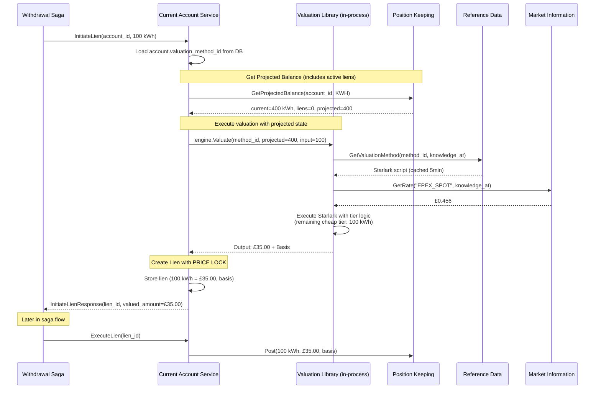
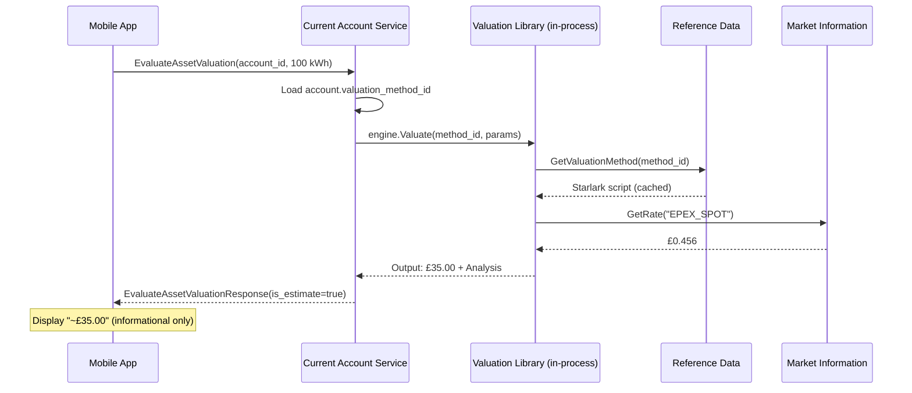

# PRD: Asset Valuation Service Domain (BIAN-Native)

**Status:** Draft - BIAN Refinement
**Version:** 3.0 (Referenced Policies - No Inline Maths)
**BIAN Service Domain:** Asset Valuation (Fulfilment Pattern)
**Task Master Tag:** `valuation-engine`
**Story Points:** 82 (11 streams)
**Core ADR:** [ADR-0028: Starlark Saga Orchestration with CEL Valuation](../adr/0028-starlark-saga-cel-valuation.md)

**Version History:**

- v2.0: Embedded library architecture (vs standalone service)
- v2.1: Gemini safety enhancements (passport pattern, event-driven cache)
- v2.2: Atomic valuation with price lock (TOCTOU elimination)
- v2.3: Security & resilience (read-only VM, graceful stale, bucket filtering, quality tracking)
- v2.4: Reservation Ledger pattern, calculation path audit, canonical bucketing library
- v2.5: Idempotency guards, basis drift detection, architecture enforcement, size limits
- v2.6: Ghost Pricing prevention (shared valuation logic), lien immutability constraint
- v2.7: Dimension-tagged buckets for DB enforcement, Ghost Pricing regression test
- v2.8: BIAN alignment assessment documentation (85-90% compliance)
- v2.9: Full BIAN adoption - CR/BQ pattern, Action Terms, Virtual Service (100% compliance)
- v3.0: Referenced Policies architecture - CEL expressions stored as named Policy objects, `run_policy()` replaces `cel_eval()`

## BIAN Terminology Mapping

To ensure 100% compatibility with the BIAN Service Landscape, this PRD adopts standard terminology:

| Meridian Term (Legacy) | BIAN-Aligned Term | Rationale |
|------------------------|-------------------|-----------|
| Valuation Service | **Asset Valuation** | Canonical BIAN Service Domain |
| `EvaluateAssetValuation` | **`EvaluateAssetValuation`** | "Evaluate" is BIAN term for computational inquiry |
| Valuation Strategy | **ValuationMethod** | BIAN uses "Method" for algorithmic variants |
| `ValuationAnalysis` | **`ValuationAnalysis`** | Describes evidentiary audit data |
| `valuation_assignments` | **`ValuationFeature`** | Behaviour Qualifier on Account CR |
| Account with valuation | **`AccountFulfillmentArrangement`** | Control Record with BQ features |

**Action Terms Compliance:**

| Operation | BIAN Action Term | Pattern |
|-----------|------------------|---------|
| `EvaluateAssetValuation` | **Evaluate** | ANALYZE (non-binding inquiry) |
| `InitiateLien` | **Initiate** | FULFILL (create reservation) |
| `ExecuteLien` | **Execute** | FULFILL (complete transaction) |
| `TerminateLien` | **Terminate** | FULFILL (cancel reservation) |
| `UpdateValuationFeature` | **Update** | FULFILL (modify BQ) |

## 1. Executive Summary

The Account-Scoped Valuation Engine enables multi-asset ledgers by making **accounts responsible for defining
how they accept value**. Instead of a centralised pricing service, valuation logic is embedded within
Account Services (CurrentAccount, InternalAccount) via a shared library.

### The "Probe Pattern"

```text
Saga asks Account: "What is 100 kWh worth to you?"
Account responds: "£35.00, and here's why (ValuationAnalysis)"
```

**Key Innovation:** This PRD codifies a shift from "Price is a number" to
**"Value is a Function of an Account."** We move the **responsibility of value** to the **Account**,
while a **shared valuation library** provides the **computational integrity**.

### Architecture at a Glance

```text
shared/pkg/valuation/          # Shared library (Policy + Starlark runtime)
├── engine.go                  # Core valuation execution
├── builtins.go               # market_data, run_policy functions
├── policy_runtime.go         # CEL policy executor with cost limits
└── cache.go                  # L1 in-memory cache (policies + methods)

services/current-account/      # Implements EvaluateAssetValuation RPC
services/internal-account/ # Implements EvaluateAssetValuation RPC
```

**Why Embedded Library > Standalone Service:**

- **Performance**: Eliminates 1 network hop (3 hops vs 4)
- **Domain Modelling**: Valuation is Account's capability, not external service
- **Operational Simplicity**: No additional microservice to deploy/monitor
- **Follows Existing Patterns**: Matches shared/pkg/saga library approach

### Virtual Service Pattern (BIAN Alignment)

The Asset Valuation service implements a **Virtual Service** pattern that reconciles our embedded library
architecture with BIAN's Service Domain decomposition:

```text
┌─────────────────────────────────────────────────────────────────────────┐
│                        BIAN Service Landscape View                       │
│                                                                          │
│  ┌─────────────────────┐        ┌─────────────────────┐                 │
│  │   Current Account   │        │  Asset Valuation    │                 │
│  │   Service Domain    │───────▶│  Service Domain     │                 │
│  │                     │        │  (Virtual Service)  │                 │
│  └─────────────────────┘        └─────────────────────┘                 │
│                                          │                               │
└──────────────────────────────────────────│───────────────────────────────┘
                                           │
┌──────────────────────────────────────────│───────────────────────────────┐
│                        Meridian Implementation                           │
│                                          │                               │
│  ┌───────────────────────────────────────▼───────────────────────────┐  │
│  │                   services/current-account                         │  │
│  │  ┌─────────────────────────────────────────────────────────────┐  │  │
│  │  │  shared/pkg/valuation (embedded library)                     │  │  │
│  │  │  • Starlark procedure execution (no inline maths)             │  │  │
│  │  │  • CEL Policy resolution via run_policy()                    │  │  │
│  │  │  • ValuationMethod + ValuationPolicy resolution              │  │  │
│  │  │  • Market data integration                                   │  │  │
│  │  └─────────────────────────────────────────────────────────────┘  │  │
│  └────────────────────────────────────────────────────────────────────┘  │
│                                                                          │
└──────────────────────────────────────────────────────────────────────────┘
```

**Why Virtual Service?**

1. **BIAN Conceptual Compliance**: Asset Valuation IS a distinct Service Domain in the BIAN landscape,
   with its own Control Records, Behaviour Qualifiers, and Action Terms
2. **Implementation Pragmatism**: A separate microservice adds latency, operational complexity, and
   transactional boundaries that complicate atomic valuation
3. **Future Flexibility**: If scale demands separation, the library can be extracted to a service
   without API changes (internal refactoring only)

**External Consumers See:**

- `EvaluateAssetValuation` RPC (BIAN Action Term: Evaluate)
- `ValuationFeature` Behaviour Qualifier
- `ValuationMethod` reference data
- `ValuationAnalysis` audit records

**Internal Implementation Uses:**

- `shared/pkg/valuation.Engine` (embedded library)
- In-process function calls (zero network latency)
- Shared database transaction context (atomic valuation)

This pattern allows Meridian to be **BIAN-compliant at the domain model layer** while remaining
**operationally efficient at the implementation layer**.

### Atomic Valuation with Price Lock (v2.2 Enhancement)

**Critical Innovation:** Valuation happens **atomically within `InitiateLien` and `ExecuteDeposit`** operations,
not as a separate inquiry step.

**Why This Matters:**

State-dependent pricing (tiered rates, volume discounts) is vulnerable to the "Tiered Valuation Drift" race
condition:

```text
BAD: Two sagas query valuation separately → both see same balance → both get cheap rate
GOOD: Each lien queries projected balance → second sees first's reservation → correct tier
```

**The Price Lock Guarantee:**

When `InitiateLien` creates a reservation, it stores BOTH:

- `reserved_quantity` (100 kWh)
- `valued_amount` (£35.00 at T0)
- `valuation_analysis` (audit trail)

Later, when `ExecuteLien` is called, the system uses the **locked value**, not a recalculated value. This
protects both customer (price won't increase) and merchant (discounts can't be gamed).

**Two-Mode Operation:**

1. **Transactional** (`InitiateLien`, `ExecuteDeposit`): Atomic valuation with price lock
2. **Inquiry** (`EvaluateAssetValuation`): Non-binding estimate for UX (mobile apps, dashboards)

**Complexity Impact:** +17 points (46 → 63 points) buys elimination of TOCTOU race conditions and guaranteed
price integrity under concurrent load.

## 2. The Problem Statement

In a multi-asset ledger, the "Conversion Rate" is not a global constant.

| Scenario | Input | Destination Account | Valuation Logic |
|----------|-------|---------------------|-----------------|
| **Retail Energy** | 100 kWh | Consumer Current Account | Flat rate £0.35/kWh |
| **Wholesale Energy** | 100 kWh | DNO Internal Account | Spot Price (EPEX) * GSP |
| **Loyalty Reward** | 100 kWh | Marketing Expense Account | 1 Point per 10 kWh |
| **Foreign Exchange** | $100 USD | GBP Current Account | Market Mid-Rate + 2% Spread |

### Current Gaps

1. **Logic Hardcoding:** Changing a tariff requires code deployment.
2. **Context Loss:** We can't easily track *why* a specific rate was applied to a specific meter read.
3. **Account Heterogeneity:** Different accounts need different formulas (fixed vs. spot pricing).
4. **Audit Trail:** No clear provenance for how values were computed historically.

## 3. The "Account-as-Authority" Solution

We implement an **Account Responsibility Pattern**:

1. **Shared Library**: `shared/pkg/valuation` provides Starlark + CEL Policy execution engine
2. **Account Ownership**: Account Services implement `EvaluateAssetValuation` RPC
3. **Feature Assignment**: Accounts store ValuationFeature (BQ) with `valuation_method_id` + parameters
4. **In-Process Execution**: Valuation happens within Account Service process boundary
5. **No Inline Maths**: Starlark scripts invoke named Policies via `run_policy()` - CEL strings forbidden

### 3.1 Control Record / Behaviour Qualifier Pattern (BIAN)

Instead of a bespoke `valuation_assignments` table, we model valuation as a **Behaviour Qualifier (BQ)**
of the Account Fulfillment Arrangement (Control Record). This allows accounts to have multiple features
(Position tracking, Interest calculation, Valuation) governed by the same aggregate root.

#### The Account Fulfillment Arrangement (Control Record)

```protobuf
// BIAN-native structure for Account with multiple features
message AccountFulfillmentArrangement {  // Control Record (CR)
  string account_id = 1;
  string account_type = 2;  // "CURRENT_ACCOUNT", "INTERNAL_ACCOUNT"

  // Behaviour Qualifiers (BQ) - each feature is a separate BQ
  ValuationFeature valuation_feature = 3;
  PositionFeature position_feature = 4;
  // Future: InterestFeature, FeeFeature, LimitFeature, etc.
}
```

#### The ValuationFeature (Behaviour Qualifier)

```protobuf
message ValuationFeature {  // Behaviour Qualifier (BQ)
  string feature_id = 1;

  // Reference to ValuationMethod in Reference Data
  string valuation_method_id = 2;
  string valuation_method_version = 3;

  // Instrument this feature applies to
  string instrument_code = 4;  // "KWH", "USD", "TONNE_CO2E"

  // Account-specific parameters for the method
  google.protobuf.Struct parameters = 5;  // {"gsp": "P", "tier": "Gold"}

  // BIAN Lifecycle: INITIATED -> ACTIVE -> TERMINATED
  string lifecycle_status = 6;

  // Bi-temporal tracking
  google.protobuf.Timestamp valid_from = 7;
  google.protobuf.Timestamp valid_to = 8;
}
```

#### Database Schema (ValuationFeature BQ)

```sql
-- Added to CurrentAccount and InternalAccount schemas
-- Named as BIAN Behaviour Qualifier
CREATE TABLE valuation_features (
    feature_id UUID PRIMARY KEY DEFAULT gen_random_uuid(),
    account_id UUID NOT NULL,
    instrument_code VARCHAR(32) NOT NULL,  -- e.g., 'KWH', 'USD', 'TONNE_CO2E'

    -- Reference to ValuationMethod in Reference Data service
    valuation_method_id UUID NOT NULL,
    valuation_method_version INTEGER,  -- NULL = latest non-deprecated

    -- Account-specific context parameters
    parameters JSONB NOT NULL DEFAULT '{}',

    -- BIAN Lifecycle Status
    lifecycle_status VARCHAR(16) NOT NULL DEFAULT 'INITIATED',
    CHECK (lifecycle_status IN ('INITIATED', 'ACTIVE', 'TERMINATED')),

    -- Bi-temporal tracking
    valid_from TIMESTAMPTZ NOT NULL DEFAULT NOW(),
    valid_to TIMESTAMPTZ,

    created_at TIMESTAMPTZ NOT NULL DEFAULT NOW(),
    updated_at TIMESTAMPTZ NOT NULL DEFAULT NOW(),

    UNIQUE (account_id, instrument_code),
    FOREIGN KEY (account_id) REFERENCES accounts(id) ON DELETE CASCADE
);

CREATE INDEX idx_valuation_features_method
    ON valuation_features(valuation_method_id)
    WHERE lifecycle_status = 'ACTIVE';

CREATE INDEX idx_valuation_features_bitemporal
    ON valuation_features(account_id, valid_from, valid_to);
```

#### Multi-Asset Acceptance Pattern

An account may accept multiple input asset types, each with a dedicated ValuationMethod.
The `valuation_features` table enforces **one method per (account, input_instrument) pair**:

| CO₂ Account Feature | Input Instrument | Method | Output |
|---------------------|------------------|--------|--------|
| Feature 1 | `KWH` | `kwh_to_co2_uk_grid` | TONNE_CO2E |
| Feature 2 | `NATURAL_GAS_THERM` | `therm_to_co2_combustion` | TONNE_CO2E |
| Feature 3 | `GBP` | `gbp_to_co2_market_purchase` | TONNE_CO2E |
| Feature 4 | `DIESEL_LITRE` | `diesel_to_co2_mobile_combustion` | TONNE_CO2E |

**Resolution Logic:**

```python
def resolve_valuation_feature(account_id, input_instrument):
    """Find the method that handles this input → account's native instrument."""
    return db.query("""
        SELECT vf.* FROM valuation_features vf
        JOIN valuation_methods vm ON vf.valuation_method_id = vm.id
        WHERE vf.account_id = ?
          AND vf.instrument_code = ?  -- Input instrument
          AND vf.lifecycle_status = 'ACTIVE'
    """, account_id, input_instrument)
```

**Error Handling:**

If no ValuationFeature exists for the input instrument:

- Return `VALUATION_METHOD_NOT_FOUND` error
- Saga can retry with fallback account or compensate

**Visual Example:**

```text
┌─────────────────────────────────────────────────────────────────────────────┐
│                         CO₂ Account (TONNE_CO2E)                            │
│                                                                             │
│  ValuationFeatures:                                                         │
│  ┌─────────────┬────────────────────────────┬─────────────────────────────┐│
│  │ Input       │ Method                     │ Logic                       ││
│  ├─────────────┼────────────────────────────┼─────────────────────────────┤│
│  │ KWH         │ kwh_to_co2_uk_grid         │ Grid carbon intensity ×     ││
│  │             │                            │ half-hourly settlement      ││
│  ├─────────────┼────────────────────────────┼─────────────────────────────┤│
│  │ THERM       │ therm_to_co2_combustion    │ Fixed combustion factor     ││
│  │             │                            │ (2.04 kg/therm)             ││
│  ├─────────────┼────────────────────────────┼─────────────────────────────┤│
│  │ GBP         │ gbp_to_co2_market          │ Market price lookup         ││
│  │             │                            │ (£75/tonne)                 ││
│  ├─────────────┼────────────────────────────┼─────────────────────────────┤│
│  │ DIESEL_L    │ diesel_to_co2_mobile       │ Fuel density × emission     ││
│  │             │                            │ factor (2.68 kg/L)          ││
│  └─────────────┴────────────────────────────┴─────────────────────────────┘│
└─────────────────────────────────────────────────────────────────────────────┘
```

This aligns with BIAN's **Financial Instrument Valuation** pattern: *"A wide range of valuation
approaches can be applied to a range of different instrument/asset types."*

### 3.2 ValuationMethod Definition (formerly "Strategy")

ValuationMethods are stored in the Reference Data service under the **Public Reference Data Management**
domain (per-tenant schema):

```sql
-- Lives in Reference Data service (tenant-scoped via PostgreSQL schemas)
-- BIAN terminology: ValuationMethod (not "strategy")
-- NOTE: Methods are Starlark-only (procedures). Maths lives in Policies.
CREATE TABLE valuation_methods (
    id UUID PRIMARY KEY DEFAULT gen_random_uuid(),

    -- Identification
    name VARCHAR(64) NOT NULL,           -- "retail_energy_v1", "fx_gbp_usd"
    version INTEGER NOT NULL DEFAULT 1,

    -- Input/Output dimensions
    input_instrument VARCHAR(32) NOT NULL,  -- "KWH"
    output_instrument VARCHAR(32) NOT NULL, -- "GBP"

    -- Logic (Starlark script ONLY - no inline maths)
    -- Starlark calls run_policy() for calculations
    logic_script TEXT NOT NULL,
    logic_hash VARCHAR(64) NOT NULL,     -- SHA-256 for cache invalidation

    -- Policy references (policies this method depends on)
    -- Validated at activation time to ensure all referenced policies exist
    required_policies TEXT[] NOT NULL DEFAULT '{}',  -- e.g., ['energy_rate_calc', 'vat_rate']

    -- BIAN Lifecycle Status
    lifecycle_status VARCHAR(16) NOT NULL DEFAULT 'INITIATED',
    CHECK (lifecycle_status IN ('INITIATED', 'ACTIVE', 'DEPRECATED')),

    -- Metadata
    description TEXT,
    created_at TIMESTAMPTZ NOT NULL DEFAULT NOW(),
    activated_at TIMESTAMPTZ,
    deprecated_at TIMESTAMPTZ,

    -- Bi-temporal for replay
    valid_from TIMESTAMPTZ NOT NULL DEFAULT NOW(),
    valid_to TIMESTAMPTZ,

    UNIQUE(name, version),
    CHECK (logic_script <> '')
);

CREATE INDEX idx_valuation_methods_lookup
    ON valuation_methods(input_instrument, output_instrument, lifecycle_status);

CREATE INDEX idx_valuation_methods_bitemporal
    ON valuation_methods(name, valid_from, valid_to);
```

### 3.3 ValuationPolicy Definition (Referenced CEL Expressions)

**The "No-Inline-Maths" Principle:**

Starlark scripts are **procedures** - they orchestrate data flow, handle branching, and aggregate results.
They should NOT contain mathematical formulas as inline strings. Instead, all calculations are stored as
**named, versioned Policy objects** in Reference Data.

**Why This Matters:**

| Concern | Inline CEL (`cel_eval(string)`) | Referenced Policy (`run_policy(name)`) |
|---------|--------------------------------|----------------------------------------|
| **Auditability** | Formula buried in Starlark | Formula is first-class entity |
| **Versioning** | Script version includes maths | Maths versioned independently |
| **Testing** | Must execute full Starlark | Can unit-test Policy in isolation |
| **AI Generation** | AI must embed formulas | AI references existing Policies |
| **Governance** | Maths changes require script update | Finance team can update Policies |

**Policy Table Schema:**

```sql
-- Lives in Reference Data service (tenant-scoped via PostgreSQL schemas)
-- CEL expressions as first-class, named, versioned objects
CREATE TABLE valuation_policies (
    id UUID PRIMARY KEY DEFAULT gen_random_uuid(),

    -- Identification
    name VARCHAR(64) NOT NULL,           -- "energy_rate_calc", "vat_standard", "fx_spread"
    version INTEGER NOT NULL DEFAULT 1,

    -- CEL Expression (the actual maths)
    cel_expression TEXT NOT NULL,        -- "spot * coefficient * (1 + markup)"
    cel_hash VARCHAR(64) NOT NULL,       -- SHA-256 for cache invalidation

    -- Input/Output Schema (for validation and documentation)
    input_schema JSONB NOT NULL,         -- {"spot": "Decimal", "coefficient": "Decimal", ...}
    output_type VARCHAR(32) NOT NULL,    -- "Decimal", "Boolean", "String"

    -- Cost Analysis (pre-computed at creation time)
    estimated_cost INTEGER NOT NULL,     -- CEL cost units (must be < 10,000)

    -- BIAN Lifecycle Status
    lifecycle_status VARCHAR(16) NOT NULL DEFAULT 'INITIATED',
    CHECK (lifecycle_status IN ('INITIATED', 'ACTIVE', 'DEPRECATED')),

    -- Metadata
    description TEXT,                    -- Human-readable explanation
    created_at TIMESTAMPTZ NOT NULL DEFAULT NOW(),
    activated_at TIMESTAMPTZ,
    deprecated_at TIMESTAMPTZ,

    -- Bi-temporal for replay
    valid_from TIMESTAMPTZ NOT NULL DEFAULT NOW(),
    valid_to TIMESTAMPTZ,

    UNIQUE(name, version),
    CHECK (cel_expression <> ''),
    CHECK (estimated_cost > 0 AND estimated_cost < 10000)
);

CREATE INDEX idx_valuation_policies_lookup
    ON valuation_policies(name, lifecycle_status);

CREATE INDEX idx_valuation_policies_bitemporal
    ON valuation_policies(name, valid_from, valid_to);
```

**Example Policies:**

| Policy Name | CEL Expression | Description |
|-------------|----------------|-------------|
| `energy_rate_calc` | `spot * coefficient * (1 + markup)` | Standard energy pricing |
| `vat_standard` | `amount * 0.20` | UK VAT at 20% |
| `vat_reduced` | `amount * 0.05` | UK reduced VAT at 5% |
| `fx_spread` | `mid_rate * (1 + spread_bps / 10000)` | FX with basis point spread |
| `tiered_rate_lookup` | `balance < tier_1 ? rate_1 : (balance < tier_2 ? rate_2 : rate_3)` | Tiered pricing |

**SYSTEM Policies (Platform Defaults):**

| Policy Name | CEL Expression | Use Case |
|-------------|----------------|----------|
| `SYSTEM_IDENTITY` | `amount` | 1:1 passthrough |
| `SYSTEM_FIXED_RATE` | `amount * rate` | Simple multiplication |
| `SYSTEM_UK_VAT_STANDARD` | `amount * 0.20` | UK VAT 20% |
| `SYSTEM_UK_VAT_REDUCED` | `amount * 0.05` | UK VAT 5% |

#### Platform Default Inheritance (The "SYSTEM Method" Pattern)

**Requirement:** If a tenant does not define a ValuationMethod for a given instrument, they SHOULD
automatically inherit the `SYSTEM` version. This ensures "Motive" or "UN WFP" scenarios work
out-of-the-box without requiring each tenant to manually configure energy methods.

**Implementation:**

The `ResolveValuationMethod` function follows a lookup hierarchy:

```go
func (s *Service) ResolveValuationMethod(
    ctx context.Context,
    tenantID string,
    inputInstrument string,
    outputInstrument string,
) (*ValuationMethod, error) {
    // 1. Check tenant-specific method (tenant schema)
    method, err := s.repo.FindMethod(ctx, tenantID, inputInstrument, outputInstrument)
    if err == nil && method != nil {
        return method, nil
    }

    // 2. Fall back to SYSTEM method (platform default)
    systemMethod, err := s.repo.FindMethod(ctx, "SYSTEM", inputInstrument, outputInstrument)
    if err == nil && systemMethod != nil {
        s.logger.Info("using SYSTEM default method",
            "tenant_id", tenantID,
            "input", inputInstrument,
            "output", outputInstrument,
            "method_id", systemMethod.ID,
        )
        return systemMethod, nil
    }

    // 3. No method found
    return nil, fmt.Errorf("no valuation method for %s → %s", inputInstrument, outputInstrument)
}
```

**Seeded SYSTEM Methods:**

| Method Name | Input → Output | Description |
|-------------|----------------|-------------|
| `SYSTEM_IDENTITY_USD` | USD → USD | 1:1 identity |
| `SYSTEM_IDENTITY_GBP` | GBP → GBP | 1:1 identity |
| `SYSTEM_IDENTITY_EUR` | EUR → EUR | 1:1 identity |
| `SYSTEM_RETAIL_ENERGY` | KWH → GBP | Default retail tariff (£0.35/kWh) |
| `SYSTEM_CARBON_CREDIT` | TONNE_CO2E → GBP | Default carbon price (£75/tonne) |

**Why This Matters:**

- **Motive scenario:** A mobility-as-a-service provider can onboard without configuring energy valuation
- **UN WFP scenario:** Humanitarian vouchers work immediately using SYSTEM methods
- **Developer experience:** New tenants can start testing without manual method configuration

## 4. Functional Requirements

### FR-1: EvaluateAssetValuation RPC (Inquiry-Only, Non-Binding)

**Requirement:** Account Services MUST implement the `EvaluateAssetValuation` RPC as a **read-only inquiry** for
non-transactional valuation queries.

**Semantics:** This RPC is **NON-BINDING**. It does not create liens, does not reserve capacity, and does not
guarantee the returned price will be honored in subsequent transactions. It is intended for:

- Mobile app UX ("What would 100 kWh cost right now?")
- Dashboard displays ("Current rate for my account")
- Saga planning (estimate before reservation)

**For transactional flows** (actual withdrawals/deposits), valuation MUST happen atomically within
`InitiateLien` or `ExecuteDeposit` (see FR-8).

#### Ghost Pricing Prevention (CRITICAL)

**Requirement:** `EvaluateAssetValuation` (inquiry) and `InitiateLien` (transactional) MUST share the **exact same
private valuation function** within the Account Service.

**Risk:** If the two code paths diverge, the mobile app could show one price while the transaction executes
at another—destroying customer trust and potentially violating consumer protection regulations.

**Implementation:**

```go
// services/current-account/internal/service/valuation.go

// valuateInternal is the SINGLE SOURCE OF TRUTH for all valuation
// Both EvaluateAssetValuation and InitiateLien MUST use this function
func (s *Service) valuateInternal(
    ctx context.Context,
    accountID uuid.UUID,
    input *quantity.InstrumentAmount,
    knowledgeAt time.Time,
    projectedBalance *decimal.Decimal,  // nil for inquiry, populated for transactional
) (*ValuationResult, error) {
    // ... shared valuation logic
}

// EvaluateAssetValuation uses valuateInternal with projectedBalance=nil (inquiry mode)
func (s *Service) EvaluateAssetValuation(
    ctx context.Context,
    req *EvaluateAssetValuationRequest,
) (*EvaluateAssetValuationResponse, error) {
    result, err := s.valuateInternal(ctx, req.AccountId, req.Input, req.KnowledgeAt, nil)
    // ...
}

// InitiateLien uses valuateInternal with actual projectedBalance (transactional mode)
func (s *Service) InitiateLien(ctx context.Context, req *InitiateLienRequest) (*InitiateLienResponse, error) {
    projectedBalance, _ := s.positionClient.GetProjectedBalance(ctx, ...)
    result, err := s.valuateInternal(ctx, req.AccountId, req.Amount, time.Now(), &projectedBalance)
    // ...
}
```

**Test Requirement:** Integration tests MUST verify that `EvaluateAssetValuation` and `InitiateLien` return
identical valuations when given the same inputs and projected balance.

**Regression Test (MANDATORY):**

Add a fuzz-style regression test that runs 1,000 random inputs through both `EvaluateAssetValuation` and
`InitiateLien` and asserts they are identical to the last decimal place:

```go
func TestGhostPricingPrevention(t *testing.T) {
    svc := setupTestService(t)

    for i := 0; i < 1000; i++ {
        // Generate random input
        input := generateRandomInstrumentAmount(t)
        projectedBalance := generateRandomBalance(t)
        knowledgeAt := time.Now()

        // Call inquiry path
        inquiryResp, err := svc.EvaluateAssetValuation(ctx, &EvaluateAssetValuationRequest{
            AccountId:   testAccountID,
            Input:       input,
            KnowledgeAt: timestamppb.New(knowledgeAt),
        })
        require.NoError(t, err)

        // Call transactional path (mocking projected balance to match)
        txnResp, err := svc.valuateInternal(ctx, testAccountID, input, knowledgeAt, &projectedBalance)
        require.NoError(t, err)

        // CRITICAL: Values must match exactly
        assert.True(t, inquiryResp.Output.Amount.Equal(txnResp.Output.Amount),
            "Ghost pricing detected! Inquiry: %s, Transaction: %s, Input: %v",
            inquiryResp.Output.Amount, txnResp.Output.Amount, input)
    }
}
```

**Design Note (Naming):**

BIAN uses "Probe" terminology for non-binding inquiries. Alternative naming: `EvaluateAmount` emphasizes
computation/simulation semantics vs `Get...` which implies simple field retrieval. Current name
`EvaluateAssetValuation` is acceptable but may be revisited in implementation for stronger BIAN alignment.

```protobuf
service CurrentAccountService {
  // Inquiry-only valuation (non-binding)
  rpc EvaluateAssetValuation(EvaluateAssetValuationRequest) returns (EvaluateAssetValuationResponse);
}

message EvaluateAssetValuationRequest {
  string account_id = 1;
  meridian.quantity.v1.InstrumentAmount input = 2;
  google.protobuf.Timestamp knowledge_at = 3;
}

message EvaluateAssetValuationResponse {
  meridian.quantity.v1.InstrumentAmount output = 1;
  ValuationAnalysis basis = 2;
  string execution_time_ms = 3;
  bool cache_hit = 4;

  // WARNING: This value is informational only. Actual transaction may differ.
  bool is_estimate = 5;  // Always true for this RPC
}

message ValuationAnalysis {
  string method_id = 1;
  string method_version = 2;
  map<string, string> applied_rates = 3;
  repeated string observation_ids = 4;  // Links to MarketInformation
  google.protobuf.Timestamp computed_at = 5;
  google.protobuf.Timestamp knowledge_at = 6;
  google.protobuf.Struct account_parameters = 7;

  // Quality level of market data used (per ADR-018 Settlement & Reconciliation)
  repeated MarketDataQuality market_data_qualities = 8;

  // Calculation path breadcrumbs (for regulatory audit of complex methods)
  repeated string calculation_path = 9;  // e.g., ["tier_2_applied", "markup_standard", "weekend_discount"]

  // Degraded mode flag (set if fallback rates used due to service unavailability)
  bool degraded_mode = 10;
}

message MarketDataQuality {
  string observation_id = 1;
  string source_trust_level = 2;  // "ESTIMATE", "COEFFICIENT", "ACTUAL", "REVISED"
  string instrument_code = 3;     // e.g., "EPEX_SPOT"
  string value = 4;               // The rate/price used
}
```

### FR-2: Shared Valuation Library

**Requirement:** A reusable Go library MUST provide Starlark procedure execution with referenced CEL Policy evaluation.

**Package:** `shared/pkg/valuation`

**Core Interface:**

```go
package valuation

type Engine interface {
    // Valuate executes a ValuationMethod to convert input to output
    Valuate(ctx context.Context, req Request) (*Response, error)
}

type Request struct {
    Input       *quantity.InstrumentAmount
    MethodID    uuid.UUID
    Parameters  map[string]interface{}
    KnowledgeAt time.Time
}

type Response struct {
    Output   *quantity.InstrumentAmount
    Analysis *Analysis
}

type Analysis struct {
    MethodID      uuid.UUID
    MethodVersion string
    AppliedRates  map[string]decimal.Decimal
    ObservationIDs  []string
    ComputedAt      time.Time
    KnowledgeAt     time.Time
    Parameters      map[string]interface{}
}
```

**Performance Target:** < 5ms per valuation (in-process execution, excluding market data lookups).

### FR-3: Hierarchical Logic Execution

The engine executes logic in three tiers:

1. **Starlark (The Procedure):** Aggregates data, handles rounding logic and branching. **No inline math.**
2. **CEL Policy (The Maths):** Named, versioned expressions invoked via `run_policy()` (~100ns).
3. **Market Data (The Fact):** Injects the bi-temporal rates (e.g., FX mid-rate).

**The "No-Inline-Maths" Rule:**

Starlark scripts MUST NOT contain CEL expression strings. All mathematical calculations MUST be
delegated to named Policies via `run_policy()`. This ensures:

- **Auditability:** Every formula is a first-class, versioned object
- **Testability:** Policies can be unit-tested in isolation
- **Governance:** Finance teams can update Policies without touching Starlark
- **AI Safety:** AI generates procedure flow, not formula strings

**Example Execution Flow:**

```python
# Starlark ValuationMethod loaded from Reference Data
# SECURITY: Sandboxed execution - no filesystem, no network, no system calls
# LIMITS: 5s timeout, 64MB memory, Policies limited to 10,000 cost units each
# CONSTRAINT: No inline maths - all calculations via run_policy()
def valuate_energy(input_quantity, params, knowledge_at):
    # 1. Validate required parameters
    if "gsp_coefficient" not in params:
        return {"error": "MISSING_PARAM", "message": "gsp_coefficient required"}

    gsp_coefficient = params["gsp_coefficient"]

    # 2. Fetch market data with error handling
    spot_result = market_data.get_price("EPEX_SPOT", knowledge_at)
    if spot_result.error:
        # Return error - saga will handle (retry or use fallback method)
        return {"error": "MARKET_DATA_UNAVAILABLE", "message": spot_result.error}

    spot_price = spot_result.value

    # 3. Execute NAMED POLICY for calculation (NOT inline CEL string)
    # Policy "energy_rate_calc" is stored in valuation_policies table
    # Policy CEL: "spot * coefficient * (1 + markup)"
    rate = run_policy("energy_rate_calc", {
        "spot": spot_price,
        "coefficient": gsp_coefficient,
        "markup": Decimal("0.02")  # 2% markup
    })

    # 4. Apply to quantity (simple multiplication is allowed in Starlark)
    output_amount = input_quantity.amount * rate

    return {
        "amount": output_amount,
        "instrument": "GBP",
        "analysis": {
            "policy_used": "energy_rate_calc",
            "spot_price": spot_price,
            "gsp_coefficient": gsp_coefficient,
            "final_rate": rate
        }
    }
```

**Anti-Pattern (FORBIDDEN):**

```python
# ❌ WRONG - Inline CEL expression string
rate = cel_eval("spot * coeff * markup", {...})

# ❌ WRONG - Maths in Starlark
rate = spot_price * gsp_coefficient * Decimal("1.02")

# ✅ CORRECT - Named policy reference
rate = run_policy("energy_rate_calc", {...})
```

#### Policy Cost Limits

To prevent denial-of-service from runaway expressions, **Policy cost is validated at creation time**,
not just at runtime. This is a key benefit of the Referenced Policies architecture.

| Limit | Value | When Enforced |
|-------|-------|---------------|
| **Maximum cost** | 10,000 units | **Policy creation** (rejected if exceeded) |
| **Execution timeout** | 100ms | Runtime (per `run_policy()` call) |

**Cost Accounting Rules:**

| Operation | Cost |
|-----------|------|
| Arithmetic (+, -, *, /, %) | 1 unit |
| Comparisons (<, >, ==, !=) | 1 unit |
| Logical operators (&&, \|\|, !) | 1 unit |
| Built-in function calls | 10 units |
| List/map element access | 1 unit per element |
| String operations | 1 unit per character (max 1000) |

**Example:** A policy performing `spot * coefficient * (1 + markup)` costs 4 units.

**Creation-Time Validation:**

When a Policy is created or updated, the system:

1. Parses the CEL expression
2. Computes the estimated cost
3. **Rejects** the policy if cost exceeds 10,000 units
4. Stores `estimated_cost` in the policy record

```json
{
  "error": "POLICY_COST_EXCEEDED",
  "message": "Policy 'complex_pricing' exceeds cost limit (estimated: 12,345, max: 10,000)",
  "policy_name": "complex_pricing"
}
```

**Why Creation-Time Validation Matters:**

- **No runtime surprises:** Policies that pass validation are guaranteed to execute
- **Fast feedback:** Authors learn immediately if expression is too complex
- **Governance:** Finance team can review cost before deployment
- **Cache-friendly:** Cost is known, enabling efficient execution planning

**Runtime Enforcement:**

Even with creation-time validation, runtime still enforces limits to handle edge cases
(e.g., large input arrays):

```json
{
  "error": "POLICY_TIMEOUT_EXCEEDED",
  "message": "Policy 'tiered_rate_lookup' exceeded 100ms timeout",
  "policy_name": "tiered_rate_lookup"
}
```

#### Starlark Security Sandbox

Starlark ValuationMethods execute in a restricted sandbox:

- **No filesystem access:** `open()`, `read()`, `write()` are undefined
- **No network access:** `http`, `socket`, `requests` are undefined
- **No system calls:** `os`, `subprocess`, `exec` are undefined
- **Execution timeout:** 5 seconds maximum
- **Memory limit:** 64MB per execution

### FR-4: Dimension Guard

**Requirement:** The system MUST prevent "Dimensional Leaks."

**Check:** If an account only accepts `Monetary` value, the valuation engine must verify the
`method_id` results in a `Quantity[Monetary]` output.

**Implementation:** Pre-execution validation checks `input_instrument` and `output_instrument`
against method definition.

**Conservation of Dimension Enforcement** (per ADR-0028):

- Methods must declare `ProducesInstrument` metadata
- Runtime validates output matches declaration
- Compile-time checks prevent dimension mixing

#### FR-4.1: Output Instrument Validation (The "Chemical Signature")

**Requirement:** The `EvaluateAssetValuationResponse` MUST return the complete **InstrumentAmount** with full asset identity.

**Rationale:** A USD account must never confuse the caller by returning GBP. The response must include:

- `InstrumentCode` (e.g., "USD", "GBP", "KWH")
- `Version` (for instruments with evolving definitions)
- `Attributes` (for fungibility metadata, e.g., "vintage", "source")

**Validation:** The Valuation Engine MUST verify that the instrument returned by the Starlark method
matches the `output_instrument` defined in the `ValuationFeature`.

**Enforcement Point:** This check happens at **activation time** (when a method is assigned to an account),
preventing invalid configurations before they reach production.

**Assertion in Saga:** The calling saga can assert the output instrument matches expectations:

```go
resp, _ := currentAccount.EvaluateAssetValuation(ctx, kwhInput)

if resp.Output.InstrumentCode != expectedInstrument {
    return fmt.Errorf("VALUATION_MISMATCH: expected %s but got %s",
        expectedInstrument, resp.Output.InstrumentCode)
}
```

#### Runtime Output Instrument Validation (The "Chemical Signature" Check)

**Requirement:** The `ResolveValuationMethod` call MUST return the `OutputInstrumentCode` as a type-hint.
The Valuation Engine MUST then wrap the Starlark execution with a **post-execution type check**:

```text
Expected: GBP (from method definition)
Starlark returned: USD (from script execution)
Result: Hard Error (VALUATION_OUTPUT_MISMATCH)
```

**Why This Matters:**

A method bug could accidentally turn an Energy account into a foreign currency account. This runtime
validation prevents dimension leakage that escapes the activation-time checks.

**Implementation:**

```go
func (e *Engine) Valuate(ctx context.Context, req Request) (*Response, error) {
    // 1. Load method (includes expected output_instrument)
    method, err := e.refDataClient.GetValuationMethod(ctx, req.MethodID)
    if err != nil {
        return nil, fmt.Errorf("load method: %w", err)
    }

    // 2. Execute Starlark (which calls run_policy() for maths)
    result, err := e.executeScript(ctx, method.LogicScript, req)
    if err != nil {
        return nil, fmt.Errorf("execute script: %w", err)
    }

    // 3. CRITICAL: Validate output instrument matches declaration
    if result.Output.InstrumentCode != method.OutputInstrument {
        return nil, &ValuationOutputMismatchError{
            Expected: method.OutputInstrument,
            Actual:   result.Output.InstrumentCode,
            Method:   method.ID,
        }
    }

    return result, nil
}

// ValuationOutputMismatchError is a hard failure - method bug detected
type ValuationOutputMismatchError struct {
    Expected string
    Actual   string
    Method   uuid.UUID
}

func (e *ValuationOutputMismatchError) Error() string {
    return fmt.Sprintf("VALUATION_OUTPUT_MISMATCH: method %s declared output %s but returned %s",
        e.Method, e.Expected, e.Actual)
}
```

**When This Fires:**

- Method declares `output_instrument: GBP` but returns `USD` → Hard error
- Method declares `output_instrument: GBP` but returns `KWH` → Hard error (energy can't become monetary)
- Method declares `output_instrument: GBP` and returns `GBP` → Success

**Rationale:** Activation-time validation catches configuration errors. Runtime validation catches
script bugs. Both layers are required for a robust dimension guard.

#### Account Native Instrument Validation

**Requirement:** When assigning a ValuationFeature to an account, the system MUST validate that the
method's `output_instrument` matches the account's `native_instrument`.

**Why This Matters:**

A CO₂ account (native_instrument: TONNE_CO2E) should never be assigned a `kwh_to_gbp` method that
outputs GBP. This validation prevents configuration errors at **feature assignment time**.

**Implementation:**

```go
// In CreateValuationFeature / UpdateValuationFeature
func (s *Service) CreateValuationFeature(
    ctx context.Context,
    req *CreateValuationFeatureRequest,
) (*ValuationFeature, error) {
    // 1. Load the method to get its output_instrument
    method, err := s.refDataClient.GetValuationMethod(ctx, req.MethodID)
    if err != nil {
        return nil, fmt.Errorf("load method: %w", err)
    }

    // 2. Load the account to get its native_instrument
    account, err := s.repo.FindByID(ctx, req.AccountID)
    if err != nil {
        return nil, fmt.Errorf("load account: %w", err)
    }

    // 3. CRITICAL: Validate method output matches account native instrument
    if method.OutputInstrument != account.NativeInstrument {
        return nil, &MethodOutputMismatchError{
            MethodID:          method.ID,
            MethodOutput:      method.OutputInstrument,
            AccountID:         account.ID,
            AccountNative:     account.NativeInstrument,
        }
    }

    // 4. Create the feature
    return s.repo.CreateFeature(ctx, req)
}

// MethodOutputMismatchError prevents invalid feature assignments
type MethodOutputMismatchError struct {
    MethodID      uuid.UUID
    MethodOutput  string
    AccountID     uuid.UUID
    AccountNative string
}

func (e *MethodOutputMismatchError) Error() string {
    return fmt.Sprintf(
        "METHOD_OUTPUT_MISMATCH: method %s produces %s but account %s holds %s",
        e.MethodID, e.MethodOutput, e.AccountID, e.AccountNative)
}
```

**When This Fires:**

- CO₂ account assigned `kwh_to_gbp` method → Hard error (outputs GBP, account holds TONNE_CO2E)
- CO₂ account assigned `kwh_to_co2` method → Success (outputs TONNE_CO2E, account holds TONNE_CO2E)
- GBP account assigned `kwh_to_gbp` method → Success (outputs GBP, account holds GBP)

**Validation Layers Summary:**

| Layer | When | What | Error Code |
|-------|------|------|------------|
| Feature Assignment | CreateValuationFeature | Method output vs account native | `METHOD_OUTPUT_MISMATCH` |
| Runtime Execution | Valuate() | Script result vs method declaration | `VALUATION_OUTPUT_MISMATCH` |

### FR-5: Valuation Basis (The "Receipt")

**Requirement:** Every valuation result MUST include a **Basis**.

**Audit Trail:** Lists every `MarketPriceObservation.ID` and `Rate` used in the calculation.

**Integrity:** Per ADR-017, the `observation_ids` and rates used in the calculation are stored in the
`PositionEntry.attributes` JSONB field in Position Keeping. This ensures that even if the Market Information
service purges old data after 7 years, the **Basis** stored in the ledger acts as a permanent snapshot
of the evidence used for that valuation.

**Auditability:** Seven years from now, an auditor can examine a single `PositionEntry` and see the complete
"Receipt" for the valuation without calling any external services.

**Quality Level Tracking (Settlement & Reconciliation):**

Per ADR-018, the `ValuationAnalysis` MUST include the `SourceTrustLevel` of each market data observation used:

- `ESTIMATE` (Quality 1): Forecast or projection
- `COEFFICIENT` (Quality 2): Model-derived value
- `ACTUAL` (Quality 3): Metered or observed value
- `REVISED` (Quality 4): Corrected after audit

**Why This Matters:**

If a valuation was performed using an `ESTIMATE` (Quality 1) at T0, but later an `ACTUAL` (Quality 3)
arrives at T1, the `ValuationAnalysis` in the ledger provides **proof of why the original (now "wrong") amount
was booked**. This is essential for:

- Settlement processes (explaining why provisional amounts differ from final)
- Reconciliation (tracking estimate-to-actual adjustments)
- Regulatory audit (demonstrating best available information at transaction time)

**Example `ValuationAnalysis` with Quality Levels:**

```json
{
  "method_id": "wholesale-spot-v2",
  "applied_rates": {"EPEX_SPOT": "0.456"},
  "market_data_qualities": [
    {
      "observation_id": "obs_abc123",
      "source_trust_level": "ESTIMATE",
      "instrument_code": "EPEX_SPOT",
      "value": "0.456"
    }
  ]
}
```

Later, when `ACTUAL` arrives, the reconciliation process sees: "Original booking used ESTIMATE quality,
revision is justified."

#### Calculation Path (Audit Trail for Complex Methods)

**Requirement:** For complex methods with branching logic (tiered pricing, time-of-use, conditional markups),
the `ValuationAnalysis` MUST include a **calculation path** - a breadcrumb trail of which decision branches
were taken during execution.

**Purpose:** For M+14 regulatory settlement audits, auditors need to understand which parts of a complex
method were executed without re-running the entire logic.

**Implementation:** Starlark methods call `record_path("tier_2_applied")` at key decision points:

```python
def valuate_tiered(input_quantity, params, knowledge_at):
    projected = position_keeping.get_projected_balance(...)

    if projected.amount < 500.0:
        record_path("tier_1_applied")  # Breadcrumb
        rate = 0.20
    else:
        record_path("tier_2_applied")  # Breadcrumb
        rate = 0.35

    if params.get("customer_tier") == "premium":
        record_path("premium_discount_applied")  # Breadcrumb
        rate = rate * 0.95

    return calculate_value(input_quantity, rate)
```

**Result in ValuationAnalysis:**

```json
{
  "calculation_path": ["tier_2_applied", "premium_discount_applied"],
  "applied_rates": {"base_rate": "0.35", "discount_multiplier": "0.95"}
}
```

**Audit Value:** Auditor sees: "This transaction used tier 2 pricing with premium discount. No weekend
or time-of-use adjustments applied."

**Size Limit (CRITICAL):**

The `calculation_path` array MUST be limited to **20 entries maximum**. This prevents a complex
Starlark loop from accidentally creating a 10MB JSON blob inside a ledger entry.

**Implementation:**

```go
const MaxCalculationPathEntries = 20

func (ctx *valuationContext) RecordPath(step string) {
    if len(ctx.calculationPath) >= MaxCalculationPathEntries {
        // Set truncation flag for tenant visibility
        ctx.pathTruncated = true
        ctx.truncatedSteps = append(ctx.truncatedSteps, step)

        // Log warning for operations team
        ctx.logger.Warn("calculation_path limit reached, truncating",
            "step", step,
            "limit", MaxCalculationPathEntries,
        )
        return
    }
    ctx.calculationPath = append(ctx.calculationPath, step)
}
```

**Tenant-Visible Warning (Saga Debugger Integration):**

When calculation path is truncated, the `ValuationAnalysis` MUST include a warning visible in the
Saga Debugger UI so tenants know their audit trail is incomplete:

```go
type ValuationAnalysis struct {
    // ... existing fields ...
    CalculationPath []string `json:"calculation_path"`

    // NEW: Truncation warning for tenant visibility
    Warnings []ValuationWarning `json:"warnings,omitempty"`
}

type ValuationWarning struct {
    Code    string `json:"code"`     // "CALCULATION_PATH_TRUNCATED"
    Message string `json:"message"`  // Human-readable
    Details any    `json:"details"`  // Additional context
}

// In engine.go, after valuation completes:
if ctx.pathTruncated {
    basis.Warnings = append(basis.Warnings, ValuationWarning{
        Code:    "CALCULATION_PATH_TRUNCATED",
        Message: fmt.Sprintf("Audit trail truncated at %d entries. %d steps omitted.",
            MaxCalculationPathEntries, len(ctx.truncatedSteps)),
        Details: map[string]any{
            "truncated_steps": ctx.truncatedSteps,
            "limit":           MaxCalculationPathEntries,
        },
    })
}
```

**Saga Debugger Display:**

```text
⚠️ CALCULATION_PATH_TRUNCATED
   Audit trail truncated at 20 entries. 3 steps omitted.
   Omitted: ["tier_check_21", "tier_check_22", "final_markup"]
```

**Rationale:** BIAN compliance requires audit trails, but audit trails must be bounded to prevent
storage bloat. 20 entries is sufficient for typical tiered pricing (5-7 tiers) with multiple
conditional branches. Tenants with complex methods need visibility into truncation.

### FR-6: Caching Policy

**L1 Cache (In-Memory within Account Service):**

- Compiled CEL expressions
- Recently used ValuationMethods
- TTL: 5 minutes (baseline)
- Invalidated on `logic_hash` change

**Key format:** `method:{method_id}:{logic_hash}`

**Event-Driven Invalidation (Train Track Precision):**

To achieve faster consistency than the 5-minute TTL, the system SHOULD implement event-driven invalidation:

1. When Reference Data updates a `valuation_method`, it publishes a `method.updated` Kafka event
2. Account Services subscribe to this topic and invalidate their L1 cache immediately
3. New transactions use the updated method within milliseconds, not minutes

**Implementation:** This is a P2 enhancement (Stream 8). The 5-minute TTL provides acceptable baseline behaviour.

**Graceful Stale Policy (Resilience):**

If Reference Data or Market Information is unavailable and the L1 cache is cold, `InitiateLien` would fail,
blocking the entire saga.

**Mitigation:** The cache SHOULD implement a **"Graceful Stale"** policy:

**For Reference Data (methods):**

- If Reference Data backend is down, continue using expired methods for up to **1 hour**
- Log high-priority warning: "Using stale method due to Reference Data unavailability"
- Metrics: `valuation_stale_cache_hits_total`

**For Market Information (rates):**

- If Market Information backend is down, the `market_data.get_price()` builtin SHOULD:
  1. Return last known good value from L1 cache (if available)
  2. OR use tenant-configured default rate (fallback)
  3. Log high-priority warning: "Using fallback rate due to Market Information unavailability"
  4. Set `degraded_mode: true` in ValuationAnalysis
  5. Metrics: `valuation_degraded_mode_total`

**Rationale:** In a ledger, "Calculated with slightly old formula" is preferable to "System Down."
The grace period allows operations teams to restore services without blocking transactions.

**Risk Acceptance:** Degraded mode means the valuation may be less accurate, but the transaction proceeds.
The `degraded_mode` flag in the basis allows downstream reconciliation to identify and adjust these
transactions when services are restored.

#### Degraded Mode MUST Propagate to Ledger (CRITICAL)

The `degraded_mode` flag MUST propagate all the way to the `PositionEntry` in the ledger. Auditors need
to be able to query degraded transactions:

```sql
-- Find all position entries booked with degraded valuation
SELECT *
FROM position_entries
WHERE attributes->'valuation_analysis'->>'degraded_mode' = 'true';
```

**Implementation in Position Keeping:**

```go
func (s *Service) Post(ctx context.Context, req *PostRequest) (*PostResponse, error) {
    entry := &PositionEntry{
        AccountID:      req.AccountId,
        Amount:         req.Amount,
        InstrumentCode: req.InstrumentCode,
        // Preserve degraded_mode in attributes JSONB
        Attributes: map[string]interface{}{
            "valuation_analysis": req.Basis,  // Includes degraded_mode flag
        },
    }
    // ...
}
```

**Reconciliation Workflow:**

When services are restored after an outage:

1. Query: `SELECT * FROM position_entries WHERE attributes->'valuation_analysis'->>'degraded_mode' = 'true'`
2. For each degraded entry, recalculate valuation with restored rates
3. If difference > threshold, create adjustment entry
4. Clear degraded flag (or add `revalued_at` timestamp)

**Why no L2 Redis cache:**

- Bi-temporal queries (`knowledge_at`) make cache hit rate near 0%
- Account Service already has in-memory cache
- Operational complexity not justified

### FR-7: Conservation of Dimension (Recursion Prevention)

**Requirement:** The Valuation Engine MUST NOT trigger write operations back to Position Keeping for the same
asset type being valued.

**Risk:** Without this constraint, a malicious or buggy method could create an "Infinite Asset Inflation" loop:

```text
BAD: Valuation triggers position log → Position log triggers valuation → Loop
```

**Enforcement:**

1. **Read-Only Contract:** The `EvaluateAssetValuation` RPC is a **stateless inquiry** (pure function).
   It performs NO writes to Position Keeping, NO writes to Account state.
2. **Domain Boundary:** Valuation is "Maths-as-a-Service" - it calculates, it does not transact.
3. **Saga Responsibility:** Only the Saga Orchestrator can write to Position Keeping, and only AFTER
   receiving the valuation response.
4. **Separate Builtin Registry (CRITICAL):** The `shared/pkg/valuation` library MUST use a **different
   Starlark builtin registry** than `shared/pkg/saga`. Specifically, it MUST EXCLUDE all write-capable
   handlers:
   - `position_keeping.initiate_log` (blocked)
   - `financial_accounting.post_entries` (blocked)
   - `current_account.execute_debit` (blocked)
   - Any other state-mutating operations

**Implementation Requirement:**

```go
// shared/pkg/valuation/starlark_runtime.go
func newValuationBuiltins() starlark.StringDict {
    return starlark.StringDict{
        "market_data":    builtinMarketData,     // ✅ Read-only
        "run_policy":     builtinRunPolicy,      // ✅ Named policy execution (NEW)
        "quantity":       builtinQuantity,       // ✅ Maths operations
        "Decimal":        builtinDecimal,        // ✅ Financial precision
        // ❌ NO cel_eval - inline CEL strings forbidden
        // ❌ NO position_keeping, NO financial_accounting
    }
}
```

#### Architectural Enforcement (CRITICAL)

To prevent a future developer from "helpfully" adding a write handler to the valuation library, the
separation MUST be enforced at the **Go module level**, not just by convention.

##### Option A: Internal Package Isolation (Recommended)

```text
shared/pkg/valuation/
├── internal/
│   └── builtins/          # Cannot import anything outside shared/pkg/valuation
│       ├── market_data.go # ✅ Allowed: Reference Data client
│       ├── run_policy.go  # ✅ Allowed: Policy runtime (NEW)
│       ├── quantity.go    # ✅ Allowed: Maths operations
│       └── decimal.go     # ✅ Allowed: Financial precision
│       # ❌ FORBIDDEN: No cel_eval.go - inline CEL strings not allowed
│       # ❌ FORBIDDEN: Cannot import positionkeepingclient
│       # ❌ FORBIDDEN: Cannot import financialaccountingclient
├── policy_runtime.go      # CEL policy executor (NEW)
└── engine.go
```

The `internal/builtins` package is physically prevented from importing write-capable clients by Go's
visibility rules. Any attempt to add `import "meridian/services/position-keeping/client"` will fail
the build.

##### Option B: Build Tags

```go
//go:build valuation_readonly

package builtins

// This file only compiles with valuation_readonly tag
// Production builds enforce this tag, preventing write handlers
```

**Verification:** CI pipeline MUST include a test that attempts to import write clients from the
valuation package and verifies the build fails:

```bash
# ci/verify-valuation-isolation.sh
if go build -tags=test_write_import ./shared/pkg/valuation/...; then
    echo "ERROR: Valuation package should not compile with write imports"
    exit 1
fi
```

**Verification:** Stream 2 MUST include a unit test:

```go
func TestValuationCannotWriteToPositionKeeping(t *testing.T) {
    method := `
        def valuate(input, params, knowledge_at):
            # Attempt to write (should fail at VM level)
            position_keeping.initiate_log(...)
            return {"amount": 100}
    `
    engine := NewEngine(...)
    _, err := engine.Valuate(ctx, Request{Method: method})

    // Expect: name 'position_keeping' is not defined
    assert.ErrorContains(t, err, "name 'position_keeping' is not defined")
}
```

**Architectural Safety:** By making valuation a read-only operation with VM-level enforcement, we prevent:

- Recursive valuation loops
- Non-deterministic execution (valuation affecting its own inputs)
- Unauthorized state mutations
- Malicious or buggy strategies triggering writes

### FR-8: Atomic Valuation in Lien Initiation (Price Lock)

**Requirement:** Account Services MUST perform valuation **atomically** within `InitiateLien` and `ExecuteDeposit`
operations to prevent race conditions in state-dependent pricing.

#### The "Tiered Valuation Drift" Problem

For state-dependent strategies (tiered pricing, volume discounts, time-of-use), querying valuation separately
from reservation creates a TOCTOU (Time-of-Check to Time-of-Use) race condition:

```text
TIME: T0         T1           T2
      ↓          ↓            ↓
Saga A: EvaluateAssetValuation(300 kWh) → £60 (tier 1)
                InitiateLien(300 kWh)
Saga B:          EvaluateAssetValuation(300 kWh) → £60 (WRONG - should be tier 2)
                                  InitiateLien(300 kWh)

Result: Both charged at introductory rate when only first 300 should be.
```

#### The Solution: Valuation-in-Lien

**Transactional Operations** (withdrawals, deposits) MUST calculate valuation atomically:

1. **`InitiateLien`** (withdrawals):
   - Input: `InstrumentAmount` (any asset class)
   - Queries Projected Balance (Current + Active Liens) from Position Keeping
   - Executes ValuationMethod using projected state
   - Creates lien storing BOTH `reserved_quantity` AND `valued_amount`
   - Returns lien with **price lock**

2. **`ExecuteDeposit`** (inbound assets):
   - Input: `InstrumentAmount`
   - Queries Projected Balance
   - Executes ValuationMethod
   - Posts to Position Keeping with valuation analysis

**Updated `InitiateLien` Proto:**

```protobuf
message InitiateLienRequest {
  string account_id = 1;
  meridian.quantity.v1.InstrumentAmount amount = 2;  // Any asset class
  string payment_order_reference = 3;
  meridian.common.v1.IdempotencyKey idempotency_key = 4;
  google.protobuf.Timestamp knowledge_at = 5;
}

message InitiateLienResponse {
  string lien_id = 1;

  // The "Price Lock" - guaranteed value at lien creation time
  meridian.quantity.v1.InstrumentAmount valued_amount = 2;  // e.g., £35.00
  ValuationAnalysis basis = 3;

  meridian.common.v1.MoneyAmount new_available_balance = 4;
}
```

**Price Lock Guarantee:**

The `valued_amount` in the lien is **immutable**. When `ExecuteLien` is called later, the system uses the
locked value, NOT a recalculated value. This protects both:

- **Customer**: Price won't increase between reservation and execution
- **Merchant**: Tiered discounts can't be gamed by concurrent reservations

#### Lien Immutability Enforcement (Database Level)

**Requirement:** The `liens` table MUST enforce immutability of `valued_amount` once the lien is in
`ACTIVE` status. This prevents both application bugs and direct database manipulation.

##### Implementation: Application-Level Enforcement

> **CockroachDB note:** CockroachDB does not support PL/pgSQL triggers.
> Lifecycle enforcement must be at the Go application layer.

Enforce via repository layer:

```go
func (r *LienRepository) Update(ctx context.Context, lien *Lien) error {
    existing, err := r.FindByID(ctx, lien.ID)
    if err != nil {
        return err
    }

    // CRITICAL: Prevent valued_amount modification on ACTIVE liens
    if existing.Status == StatusActive && !existing.ValuedAmount.Equal(lien.ValuedAmount) {
        return fmt.Errorf("LIEN_IMMUTABILITY_VIOLATION: cannot modify valued_amount on ACTIVE lien %s", lien.ID)
    }

    return r.db.Save(lien)
}
```

**Audit Requirement:** Any attempt to modify `valued_amount` on an ACTIVE lien MUST be logged as a
security event for SOC review.

**CRITICAL Constraint:** The `ExecuteLien` RPC MUST be updated to **forbid amount overrides**. The handler
MUST strictly use the `valued_amount` stored in the database lien record created by `InitiateLien`. No
parameters in the `ExecuteLienRequest` may override this value.

**Implementation Check:**

```go
func (s *Service) ExecuteLien(ctx context.Context, req *ExecuteLienRequest) (*ExecuteLienResponse, error) {
    // Load lien from database
    lien, err := s.repo.FindLienByID(ctx, req.LienId)

    // ❌ FORBIDDEN: Allow override
    // if req.OverrideAmount != nil {
    //     amount = req.OverrideAmount
    // }

    // ✅ REQUIRED: Use stored valued_amount
    valuedAmount := lien.ValuedAmount  // Price lock from InitiateLien

    // Post to Position Keeping with locked value
    return s.positionClient.Post(ctx, valuedAmount, lien.Basis)
}
```

**Rationale:** Allowing overrides would defeat the price lock guarantee and reintroduce TOCTOU vulnerabilities.

#### Basis Drift Detection

**Requirement:** If `ExecuteLien` is called and the `knowledge_at` time on the original basis is older than
a configurable threshold (default: 30 days), the system SHOULD emit a `VALUATION_STALE` warning event for
reconciliation.

**Implementation:**

```go
const BasisDriftThreshold = 30 * 24 * time.Hour  // 30 days

func (s *Service) ExecuteLien(ctx context.Context, req *ExecuteLienRequest) (*ExecuteLienResponse, error) {
    lien, err := s.repo.FindLienByID(ctx, req.LienId)
    // ...

    // Check for basis drift
    basisAge := time.Since(lien.Basis.KnowledgeAt)
    if basisAge > BasisDriftThreshold {
        s.events.Publish(ctx, &events.ValuationStaleEvent{
            LienID:      lien.ID,
            BasisAge:    basisAge,
            KnowledgeAt: lien.Basis.KnowledgeAt,
            Threshold:   BasisDriftThreshold,
        })
        s.logger.Warn("executing lien with stale valuation basis",
            "lien_id", lien.ID,
            "basis_age_days", int(basisAge.Hours()/24),
            "threshold_days", 30,
        )
    }

    // Continue with execution using locked value
    valuedAmount := lien.ValuedAmount
    return s.positionClient.Post(ctx, valuedAmount, lien.Basis)
}
```

**Reconciliation Integration:** The `VALUATION_STALE` event allows downstream reconciliation processes
to flag these transactions for review. The lien still executes (business continuity), but auditors are
alerted to potential pricing drift.

#### Idempotency

Retrying `InitiateLien` with same `idempotency_key` returns the existing lien with its original
`valued_amount`. No recalculation.

### FR-9: Projected Balance for State-Dependent Valuation

**Requirement:** Position Keeping MUST provide a `ProjectedBalance` query that includes pending reservations
(active liens).

**Formula:**

```go
ProjectedBalance = CurrentBalance + Sum(ActiveReservations)
```

#### The Architectural Challenge

**Problem:** Liens are stored in **CurrentAccount service**, but `ProjectedBalance` queries happen in
**Position Keeping service**. How does Position Keeping see active liens without:

1. Cross-service JOINs (performance nightmare)
2. Calling back to CurrentAccount (circular dependency)
3. Polling CurrentAccount for lien state (latency, consistency issues)

#### Solution: Reservation Ledger

When `InitiateLien` is called in CurrentAccount, it MUST **synchronously** call a new Position Keeping RPC:

```protobuf
service PositionKeepingService {
  // Record a reservation (called by Account Services during InitiateLien)
  rpc RecordReservation(RecordReservationRequest) returns (RecordReservationResponse);

  // Release a reservation (called during ExecuteLien or TerminateLien)
  rpc ReleaseReservation(ReleaseReservationRequest) returns (ReleaseReservationResponse);

  // Query projected balance (includes reservations)
  rpc GetProjectedBalance(GetProjectedBalanceRequest) returns (GetProjectedBalanceResponse);
}

message RecordReservationRequest {
  string account_id = 1;
  string lien_id = 2;  // Links back to CurrentAccount lien (IDEMPOTENCY KEY)
  meridian.quantity.v1.InstrumentAmount reserved_amount = 3;
  string bucket_id = 4;
  google.protobuf.Timestamp knowledge_at = 5;
}

message ReleaseReservationRequest {
  string lien_id = 1;
  string reason = 2;  // "EXECUTED" or "TERMINATED"
}
```

#### Idempotency Requirement (CRITICAL)

The `RecordReservation` RPC MUST be **idempotent based on `lien_id`**. If `InitiateLien` retries (network
timeout, saga replay), Position Keeping must recognise that the reservation for that `lien_id` already
exists and return success without double-counting.

**Implementation:**

```go
func (s *Service) RecordReservation(
    ctx context.Context,
    req *RecordReservationRequest,
) (*RecordReservationResponse, error) {
    // Check for existing reservation (idempotent check)
    existing, err := s.repo.FindReservationByLienID(ctx, req.LienId)
    if err == nil && existing != nil {
        // Reservation already exists - return success (idempotent)
        return &RecordReservationResponse{
            ReservationId: existing.ID,
            AlreadyExists: true,  // Caller knows this was a retry
        }, nil
    }
    if err != nil && !errors.Is(err, sql.ErrNoRows) {
        return nil, fmt.Errorf("check existing reservation: %w", err)
    }

    // Create new reservation
    reservation := &Reservation{
        LienID:         req.LienId,
        AccountID:      req.AccountId,
        InstrumentCode: req.ReservedAmount.InstrumentCode,
        BucketID:       req.BucketId,
        ReservedAmount: req.ReservedAmount.Amount,
        Status:         "ACTIVE",
    }
    if err := s.repo.CreateReservation(ctx, reservation); err != nil {
        return nil, fmt.Errorf("create reservation: %w", err)
    }

    return &RecordReservationResponse{ReservationId: reservation.ID}, nil
}
```

**Position Keeping Schema Enhancement:**

```sql
CREATE TABLE reservations (
    lien_id UUID PRIMARY KEY,           -- Links to CurrentAccount liens table
    account_id UUID NOT NULL,
    instrument_code VARCHAR(32) NOT NULL,
    bucket_id VARCHAR(64),              -- For fungibility-aware filtering
    reserved_amount DECIMAL NOT NULL,
    status VARCHAR(16) NOT NULL,        -- 'ACTIVE', 'EXECUTED', 'TERMINATED'
    created_at TIMESTAMPTZ NOT NULL,
    executed_at TIMESTAMPTZ,
    terminated_at TIMESTAMPTZ,

    INDEX idx_reservations_active (account_id, instrument_code, status, bucket_id)
);
```

**CurrentAccount Flow Enhancement:**

```go
func (s *Service) InitiateLien(ctx context.Context, req *InitiateLienRequest) (*InitiateLienResponse, error) {
    // 1. Query Projected Balance from Position Keeping (includes active reservations)
    projectedBalance, err := s.positionClient.GetProjectedBalance(ctx, ...)

    // 2. Execute valuation using projected balance
    result, err := s.valuationEngine.Valuate(ctx, ...)

    // 3. Create lien in CurrentAccount database
    lien := s.repo.CreateLien(ctx, Lien{
        ReservedQuantity: req.Amount,
        ValuedAmount:     result.Output,
        Basis:            result.Basis,
    })

    // 4. SYNCHRONOUSLY record reservation in Position Keeping
    _, err = s.positionClient.RecordReservation(ctx, &positionkeepingv1.RecordReservationRequest{
        AccountId:      req.AccountId,
        LienId:         lien.ID,
        ReservedAmount: req.Amount,
        BucketId:       calculateBucketID(req.Amount),
    })
    if err != nil {
        // CRITICAL: Rollback lien if reservation fails
        if delErr := s.repo.DeleteLien(ctx, lien.ID); delErr != nil {
            // Orphaned lien - requires manual cleanup
            s.logger.Error("CRITICAL: Failed to rollback lien after RecordReservation failure",
                "lien_id", lien.ID,
                "original_error", err,
                "rollback_error", delErr,
            )
            s.metrics.Inc("liens.orphaned.total")
            // Write to dead-letter queue for async cleanup
            s.dlq.Publish(ctx, OrphanedLienEvent{
                LienID:        lien.ID,
                AccountID:     req.AccountId,
                OriginalError: err.Error(),
                RollbackError: delErr.Error(),
            })
        }
        return nil, fmt.Errorf("failed to record reservation: %w", err)
    }

    return &InitiateLienResponse{LienId: lien.ID, ValuedAmount: result.Output}, nil
}
```

**Why This Works:**

- **No cross-service JOINs:** Position Keeping owns reservation data
- **No circular dependencies:** One-way call from CurrentAccount → PositionKeeping
- **High performance:** `GetProjectedBalance` is a simple local query
- **Strong consistency:** Synchronous `RecordReservation` ensures atomicity

**Use Case:**

When executing a ValuationMethod with state-dependent logic (tiered pricing), the Valuation Engine queries
`ProjectedBalance` instead of `CurrentBalance` to see capacity already spoken for by concurrent transactions.

**Example:**

```python
# Starlark ValuationMethod using projected balance
def valuate_tiered(input_quantity, params, knowledge_at):
    # Get projected balance (includes other active liens)
    projected = position_keeping.get_projected_balance(
        account_id=params["account_id"],
        instrument="KWH",
        knowledge_at=knowledge_at
    )

    # Calculate how much of "cheap" tier remains
    cheap_threshold = 500.0
    cheap_available = max(0, cheap_threshold - projected.amount)

    # Price accordingly
    if input_quantity.amount <= cheap_available:
        rate = 0.20  # All in cheap tier
    else:
        # Split across tiers
        cheap_portion = cheap_available * 0.20
        expensive_portion = (input_quantity.amount - cheap_available) * 0.35
        rate = (cheap_portion + expensive_portion) / input_quantity.amount

    return calculate_value(input_quantity, rate)
```

**Position Keeping API:**

```protobuf
message GetProjectedBalanceRequest {
  string account_id = 1;
  string instrument_code = 2;
  google.protobuf.Timestamp knowledge_at = 3;

  // CRITICAL: Bucket filtering for fungibility-aware tiering
  // If method uses tiered pricing for source:solar vs source:grid separately,
  // the projection must only include liens/balance for the same bucket
  string bucket_id = 4;  // Optional: filters by instrument attributes
}

message GetProjectedBalanceResponse {
  meridian.quantity.v1.InstrumentAmount current_balance = 1;
  meridian.quantity.v1.InstrumentAmount active_liens_total = 2;
  meridian.quantity.v1.InstrumentAmount projected_balance = 3;  // current + liens

  // Echo back the bucket filter used (for debugging)
  string bucket_id = 4;
}
```

**Bucket Filtering Requirement (CRITICAL):**

When querying `ProjectedBalance`, the system MUST support filtering by `bucket_id`. A `bucket_id` represents
a specific fungibility partition of an instrument.

**Example:**

For tiered pricing on `KWH` with attribute `source: solar` vs `source: grid`:

- Tiered method for `source:solar` queries: `GetProjectedBalance(instrument=KWH, bucket_id=kwh_solar)`
- Tiered method for `source:grid` queries: `GetProjectedBalance(instrument=KWH, bucket_id=kwh_grid)`

Without bucket filtering, liens for `source:grid` would incorrectly affect the tier calculation for
`source:solar`, causing cross-contamination of tier thresholds.

**Implementation:** Stream 10 (Position Keeping) MUST implement bucket-aware aggregation using the
`reservations` table:

```sql
-- GetProjectedBalance implementation with Reservation Ledger
WITH current AS (
  SELECT COALESCE(SUM(amount), 0) AS balance
  FROM position_entries
  WHERE account_id = $1
    AND instrument_code = $2
    AND (bucket_id = $3 OR $3 IS NULL)
    AND status IN ('POSTED', 'PENDING')
),
active_reservations AS (
  SELECT COALESCE(SUM(reserved_amount), 0) AS reserved
  FROM reservations
  WHERE account_id = $1
    AND instrument_code = $2
    AND (bucket_id = $3 OR $3 IS NULL)
    AND status = 'ACTIVE'
)
SELECT
  current.balance AS current_balance,
  active_reservations.reserved AS active_liens_total,
  (current.balance + active_reservations.reserved) AS projected_balance
FROM current, active_reservations;
```

**Key Points:**

1. **Local query:** No cross-service calls, no distributed JOINs
2. **Bucket-aware:** Filters both position_entries and reservations by bucket_id
3. **Performance:** Indexed on `(account_id, instrument_code, status, bucket_id)`
4. **O(1) complexity:** Sum aggregations with proper indexes

**Concurrency Safety:**

By using Projected Balance with bucket filtering, the second concurrent lien sees the first lien's
reservation (within the same bucket) and calculates the correct tier pricing. This eliminates the
"Tiered Valuation Drift" bug while preserving fungibility boundaries.

#### Canonical Bucket ID Calculation (CRITICAL)

**Requirement:** The `bucket_id` calculation MUST be identical across all services to prevent "Bucket Drift."

**Solution:** Create a shared library `shared/pkg/bucketing`:

```go
package bucketing

// CalculateBucketID generates a canonical bucket key from an InstrumentAmount.
// Used by: CurrentAccount, InternalAccount, PositionKeeping, ReferenceData, Valuation
func CalculateBucketID(amount *quantity.InstrumentAmount) string {
    if amount == nil || len(amount.Attributes) == 0 {
        return ""  // No bucketing for simple instruments
    }

    // Sort attributes for deterministic key generation
    keys := make([]string, 0, len(amount.Attributes))
    for k := range amount.Attributes {
        keys = append(keys, k)
    }
    sort.Strings(keys)

    // Build canonical key: instrument_attr1=val1_attr2=val2
    var parts []string
    parts = append(parts, strings.ToLower(amount.InstrumentCode))
    for _, k := range keys {
        parts = append(parts, fmt.Sprintf("%s=%s", k, amount.Attributes[k]))
    }
    return strings.Join(parts, "_")
}

// Example:
// InstrumentAmount{Code: "KWH", Attributes: {"source": "solar", "vintage": "2024"}}
// → "kwh_source=solar_vintage=2024"
```

**Enforcement:** All services importing the valuation library MUST use `bucketing.CalculateBucketID()`.
Direct bucket_id string construction is FORBIDDEN to prevent drift.

## 5. Technical Architecture

### 5.1 The Transactional Workflow (Atomic Valuation-in-Lien)

**This is the PRIMARY flow for actual transactions (withdrawals, deposits).** Valuation happens atomically
within lien/deposit operations to prevent race conditions.



**Network hop analysis:**

1. Saga → Account: `InitiateLien` request
2. Account → Position Keeping: `GetProjectedBalance` (for tiered pricing)
3. Account → Reference Data: `GetValuationMethod` (cached 5min)
4. Account → Market Information: `GetRate` (cached)

**Total: 4 network calls** (one more than inquiry-only, but eliminates TOCTOU race)

**Key Difference from Inquiry Flow:**

- **Inquiry (`EvaluateAssetValuation`)**: Returns estimate, no state change, can drift
- **Transactional (`InitiateLien`)**: Creates price lock, queries projected balance, atomic

### 5.1.1 The Inquiry Workflow (Non-Binding, for UX)

For **non-transactional** queries (mobile app, dashboard), use the inquiry RPC:



**WARNING:** This value is non-binding. Actual transaction may differ if:

- Balance changes (tier transitions)
- Market rates update
- Concurrent transactions reserve capacity

### 5.2 Library Structure

```text
shared/pkg/valuation/
├── engine.go                  # Core valuation engine
│   └── type Engine struct
│   └── func (e *Engine) Valuate(ctx, req) (*Response, error)
├── builtins.go               # Starlark builtins
│   └── market_data.get_price()
│   └── run_policy()          # ✅ Named policy invocation (NEW)
│   └── quantity operations
│   # ❌ NO cel_eval() - inline CEL strings forbidden
├── cache.go                  # L1 in-memory cache
│   └── Method cache (5min TTL)
│   └── Policy cache (5min TTL)
├── policy_runtime.go         # CEL policy executor (NEW)
│   └── Compile & cache policies
│   └── Cost validation
│   └── Input schema validation
├── starlark_runtime.go       # Starlark VM wrapper
│   └── Deterministic execution
│   └── Timeout controls
│   └── No-inline-maths enforcement
└── types.go                  # Request/Response types
    └── type Request, Response, Analysis
```

**No-Inline-Maths Enforcement:**

The Starlark runtime performs static analysis on loaded scripts to reject any that:

1. Import or reference `cel_eval` (function does not exist)
2. Contain CEL-like expression strings (heuristic detection)

```go
// starlark_runtime.go
func (r *StarlarkRuntime) ValidateScript(script string) error {
    // Reject if script references removed cel_eval builtin
    if strings.Contains(script, "cel_eval") {
        return &NoInlineMathError{
            Message: "cel_eval() is forbidden - use run_policy() instead",
        }
    }
    return nil
}
```

### 5.3 The "Passport Pattern" - Audit Integrity Across Flows

The **Basis** (the valuation receipt) must be persisted to ensure the ledger is auditable. This creates a
**three-layer persistence model**, with different behaviour for inquiry vs transactional flows:

#### Layer 1: Account Service

**Inquiry Flow (`EvaluateAssetValuation`)**: Stateless, NO writes. Pure "Maths-as-a-Service."

- **Why:** 100,000 inquiries/hour shouldn't write to Account database
- **Performance:** <5ms p99 by eliminating DB contention

**Transactional Flow (`InitiateLien`, `ExecuteDeposit`)**: WRITES lien/deposit record with valuation.

- **Why:** Price lock requires persistence
- **What's Stored:**
  - `reserved_quantity` / `deposited_quantity`
  - `valued_amount` (price lock)
  - `valuation_analysis` (audit trail)
- **Performance:** Acceptable overhead (<10ms) for transactional guarantees

#### Layer 2: Saga Orchestrator (Checkpoint Persistence)

The Saga DOES persist the result. Per ADR-028 (Durable Execution Engine), the saga saves the response of every
step into its `saga_step_results` table.

**Audit Value:** If a pod dies and the saga replays, it doesn't re-calculate the value; it pulls the "frozen"
result from the last checkpoint. This guarantees **deterministic replay** - the same saga execution always sees
the same valuation, even if market rates have changed since.

**Example:**

```json
{
  "step_id": "valuate_energy",
  "result": {
    "output": {"amount": "35.00", "instrument": "GBP"},
    "analysis": {
      "method_id": "wholesale-spot-v2",
      "rates": {"EPEX_SPOT": "0.456"},
      "observation_ids": ["obs_abc123"],
      "knowledge_at": "2025-01-15T14:30:00Z"
    }
  }
}
```

#### Layer 3: Position Keeping (Permanent Audit)

When the transaction finally hits **Position Keeping**, the `ValuationAnalysis` is stored in the `attributes` JSONB
of the `PositionEntry`.

**Audit Value:** Seven years from now, an auditor can examine a single row in the ledger and see the complete
"Receipt" for the valuation without calling any external services. Even if:

- The Market Information service has purged old rate data
- The Reference Data service has deprecated the method
- The Account Service has been decommissioned

**Example `PositionEntry.attributes`:**

```json
{
  "valuation_analysis": {
    "method_id": "wholesale-spot-v2",
    "method_version": "1.2.0",
    "applied_rates": {"EPEX_SPOT": "0.456", "gsp_coefficient": "1.05"},
    "observation_ids": ["obs_abc123"],
    "computed_at": "2025-01-15T14:30:15Z",
    "knowledge_at": "2025-01-15T14:30:00Z",
    "account_parameters": {"gsp": "P", "tier": "Gold"}
  }
}
```

#### The "Passport Analogy"

The `ValuationAnalysis` travels through the system like a passport:

1. **Issued** by the Account Service (valuation calculation)
2. **Stamped** by the Saga Orchestrator (checkpoint persistence)
3. **Archived** by Position Keeping (permanent ledger entry)

At each layer, the Basis provides **proof of origin** and **proof of calculation** for regulatory audit.

### 5.4 Account Service Integration

```go
// services/current-account/internal/service/valuation.go
package service

import "meridian/shared/pkg/valuation"

func (s *Service) EvaluateAssetValuation(
    ctx context.Context,
    req *currentaccountv1.EvaluateAssetValuationRequest,
) (*currentaccountv1.EvaluateAssetValuationResponse, error) {

    // 1. Load account to get ValuationFeature
    account, err := s.repo.FindByID(ctx, req.AccountId)
    if err != nil {
        return nil, fmt.Errorf("load account: %w", err)
    }

    // 2. Resolve ValuationFeature for input instrument
    feature, err := s.getValuationFeature(
        ctx,
        account.ID,
        req.Input.InstrumentCode,
        req.KnowledgeAt,
    )
    if err != nil {
        return nil, fmt.Errorf("resolve feature: %w", err)
    }

    // 3. Use shared valuation library (in-process)
    result, err := s.valuationEngine.Valuate(ctx, valuation.Request{
        Input:       req.Input,
        MethodID:    feature.MethodID,
        Parameters:  feature.Parameters,
        KnowledgeAt: req.KnowledgeAt.AsTime(),
    })
    if err != nil {
        return nil, fmt.Errorf("execute valuation: %w", err)
    }

    // 4. Return valued amount with audit basis
    return &currentaccountv1.EvaluateAssetValuationResponse{
        Output:          result.Output,
        Basis:           toProtoBasis(result.Basis),
        ExecutionTimeMs: fmt.Sprintf("%.2f", result.ExecutionTime.Milliseconds()),
        CacheHit:        result.CacheHit,
    }, nil
}
```

### 5.5 Dependency Injection

```go
// services/current-account/cmd/current-account-service/main.go
func main() {
    // Existing clients
    positionClient := positionkeepingclient.New(...)
    finAcctClient := financialaccountingclient.New(...)

    // NEW - Add clients for valuation
    refDataClient := referencedataclient.New(...)
    marketInfoClient := marketinformationclient.New(...)

    // Create valuation engine with dependencies
    valuationEngine := valuation.NewEngine(valuation.Config{
        RefDataClient:    refDataClient,     // For method lookups
        MarketInfoClient: marketInfoClient,  // For rate lookups
        CacheSize:        1000,              // L1 cache entries
        CacheTTL:         5 * time.Minute,
        Logger:           logger,
    })

    // Inject into service
    svc := service.New(service.Config{
        Repository:       repo,
        ValuationEngine:  valuationEngine,  // NEW
        PositionClient:   positionClient,
        FinAcctClient:    finAcctClient,
    })
}
```

## 6. Implementation Streams

### Stream 1: Account Valuation Features (P0, 5 points)

**BIAN Pattern:** This stream implements the ValuationFeature Behaviour Qualifier (BQ) for Account
Fulfillment Arrangements (Control Records).

**Tasks:**

1. Add `valuation_features` table to Current Account service (BIAN BQ schema)
2. Add `valuation_features` table to Internal Account service (BIAN BQ schema)
3. Implement CRUD operations for ValuationFeature lifecycle (INITIATED → ACTIVE → TERMINATED)
4. Add bi-temporal query support
5. Update Tenant Provisioning to seed default methods (e.g., `USD_IDENTITY`)
6. Migration scripts for existing accounts

**Success Criteria:**

- All existing accounts have at least one ValuationFeature (identity method)
- Bi-temporal queries work correctly with `knowledge_at`
- ValuationFeatures can be updated without service restart
- BIAN lifecycle status transitions are enforced

### Stream 2: Valuation Engine Library (P0, 15 points)

**Architecture:** Referenced Policies - Starlark calls `run_policy()` for all calculations.

**Tasks:**

1. Create `shared/pkg/valuation` package structure
2. Implement Policy runtime (CEL compiler wrapper) with security constraints
3. Implement `run_policy()` builtin that resolves and executes named Policies
4. Implement Starlark VM wrapper with timeouts
5. Register built-in functions: `market_data`, `run_policy()`, `quantity`, `Decimal`
6. **CRITICAL:** NO `cel_eval()` builtin - inline CEL strings forbidden
7. **CRITICAL:** Implement No-Inline-Maths enforcement (reject scripts containing `cel_eval`)
8. **CRITICAL:** Implement separate read-only builtin registry (exclude position_keeping, financial_accounting)
9. **CRITICAL:** Use `internal/builtins` package isolation to enforce read-only at Go module level
10. Implement L1 in-memory cache with graceful stale policy (1-hour grace if backend down)
11. Implement Policy cache (compiled CEL programs)
12. Implement `record_path()` builtin with 20-entry size limit
13. Implement output instrument validation (runtime type check)
14. Add comprehensive unit tests
15. **CRITICAL:** Add security verification test (method cannot call write handlers)
16. **CRITICAL:** Add No-Inline-Maths verification test (script with `cel_eval` is rejected)
17. **CRITICAL:** Add CI verification script that fails if write imports are added
18. Add benchmarks (target: <5ms in-process execution)
19. Document library usage patterns

**Success Criteria:**

- Can execute Starlark scripts that call `run_policy()` for calculations
- Can resolve and execute named Policies from Reference Data
- Policy cost validation happens at policy creation (not just runtime)
- Benchmark shows <5ms execution time for typical methods
- Cache hit rate >80% after warmup (for same method_id and policy_name)
- **No-Inline-Maths test passes:** Script with `cel_eval("...")` fails with clear error
- **Security test passes:** Method attempting `position_keeping.initiate_log` fails with
  `name 'position_keeping' is not defined`
- **Architecture test passes:** Build fails if valuation package imports write-capable clients
- Graceful stale cache activates when Reference Data unavailable (logs warning, continues)
- Calculation path limited to 20 entries (logs warning on truncation)
- Output instrument mismatch returns hard error (VALUATION_OUTPUT_MISMATCH)

### Stream 3: Reference Data ValuationMethod & Policy Storage (P0, 10 points)

**BIAN Pattern:** This stream implements ValuationMethod and ValuationPolicy reference data.
Methods are Starlark procedures; Policies are named CEL expressions.

**Tasks:**

1. Add `valuation_methods` table to Reference Data service (Starlark only, no CEL type)
2. Add `valuation_policies` table to Reference Data service (CEL expressions)
3. Implement `GetValuationMethod` RPC with bi-temporal support
4. Implement `GetValuationPolicy` RPC with bi-temporal support
5. Implement `ResolveValuationMethod` RPC with **Platform Default Inheritance**
6. Implement `ResolveValuationPolicy` RPC with **Platform Default Inheritance**
7. Add method validation (Starlark syntax check, instrument compatibility)
8. Add **Policy validation at creation time:**
   - Parse CEL expression
   - Compute estimated cost (reject if > 10,000)
   - Validate input schema
   - Store `estimated_cost` in policy record
9. Add Policy dry-run endpoint: `DryRunPolicy(policy_name, sample_inputs) → result`
10. Add `output_instrument` to method response (for runtime type validation)
11. Add `required_policies` validation: Method cannot activate if referenced Policies don't exist
12. Seed SYSTEM identity methods for major currencies (USD, EUR, GBP, NZD, AUD)
13. Seed SYSTEM energy method (KWH → GBP, using `SYSTEM_ENERGY_RATE_CALC` policy)
14. Seed SYSTEM carbon method (TONNE_CO2E → GBP, using `SYSTEM_CARBON_RATE` policy)
15. Seed SYSTEM Policies: `SYSTEM_IDENTITY`, `SYSTEM_FIXED_RATE`, `SYSTEM_UK_VAT_STANDARD`
16. Add integration tests for tenant → SYSTEM fallback (both methods and policies)

**Success Criteria:**

- ValuationMethods can be stored and retrieved via gRPC (Starlark only)
- ValuationPolicies can be stored and retrieved via gRPC (CEL only)
- **Policy cost validated at creation:** Policy with cost > 10,000 is rejected
- **Policy dry-run works:** Can test Policy with sample inputs before deployment
- Bi-temporal queries return correct method and policy versions
- Cache invalidation works on method and policy updates
- Identity methods are available for all fiat currencies
- **Platform Default Inheritance:** Tenant without KWH method gets SYSTEM_RETAIL_ENERGY
- **Output instrument returned:** GetValuationMethod response includes `output_instrument`
- **Required policies validated:** Method activation fails if referenced Policies missing
- New tenant can valuate KWH without any configuration (uses SYSTEM defaults)

### Stream 4: Current Account Integration (P1, 10 points)

**Tasks:**

1. Add `EvaluateAssetValuation` RPC to Current Account proto (inquiry-only)
2. Update `InitiateLien` to accept `InstrumentAmount` (any asset class)
3. Update `InitiateLien` response to include `valued_amount` and `basis`
4. Update `ExecuteDeposit` to perform atomic valuation
5. Wire up valuation library in service initialisation
6. Add Position Keeping client for projected balance AND reservation RPCs
7. Implement valuation in `InitiateLien` handler (price lock)
8. **CRITICAL:** Call `position_keeping.RecordReservation()` after creating lien
9. **CRITICAL:** Call `position_keeping.ReleaseReservation()` in ExecuteLien/TerminateLien
10. Implement valuation in `ExecuteDeposit` handler
11. Implement `EvaluateAssetValuation` handler (inquiry-only, non-binding)
12. Add Market Information client dependency with graceful degradation
13. Add `record_path()` builtin for calculation path audit trail
14. Add observability (metrics, logging, tracing, degraded_mode counter)
15. Integration tests with mock strategies
16. Concurrency tests (verify tiered pricing with parallel liens)
17. Rollback test: If RecordReservation fails, lien must be deleted

**Success Criteria:**

- `InitiateLien` accepts non-monetary assets (kWh, TONNE_CO2E)
- Lien stores price lock (valued_amount) alongside reserved_quantity
- **RecordReservation called synchronously** after lien creation
- **ReleaseReservation called** during ExecuteLien/TerminateLien
- Concurrent liens on tiered pricing account get correct rates (no drift)
- `EvaluateAssetValuation` returns `is_estimate=true` (non-binding)
- Valuation basis includes calculation_path and degraded_mode flag
- **Basis drift detection:** ExecuteLien emits VALUATION_STALE event if basis > 30 days old
- **Output instrument validation:** Valuation fails with VALUATION_OUTPUT_MISMATCH if script returns wrong instrument
- Graceful degradation when Market Information unavailable
- Metrics show execution time and cache hit rate

### Stream 5: Internal Account Integration (P1, 10 points)

**Tasks:**

1. Add `EvaluateAssetValuation` RPC to Internal Account proto (inquiry-only)
2. Update `InitiateLien` to accept `InstrumentAmount` (any asset class)
3. Update `InitiateLien` response to include `valued_amount` and `basis`
4. Update `ExecuteDeposit` to perform atomic valuation
5. Wire up valuation library (same as Current Account)
6. Add Position Keeping client for projected balance AND reservation RPCs
7. Implement valuation in `InitiateLien` handler (price lock)
8. **CRITICAL:** Call `position_keeping.RecordReservation()` after creating lien
9. **CRITICAL:** Call `position_keeping.ReleaseReservation()` in ExecuteLien/TerminateLien
10. Implement valuation in `ExecuteDeposit` handler
11. Implement `EvaluateAssetValuation` handler (inquiry-only, non-binding)
12. Add Market Information client dependency with graceful degradation
13. Add `record_path()` builtin for calculation path audit trail
14. Integration tests
15. Concurrency tests (verify tiered pricing with parallel liens)
16. Rollback test: If RecordReservation fails, lien must be deleted

**Success Criteria:**

- Internal accounts can value assets using same strategies
- Wholesale energy method works (spot price × GSP coefficient)
- **RecordReservation called synchronously** after lien creation
- **ReleaseReservation called** during ExecuteLien/TerminateLien
- `InitiateLien` stores price lock for regulatory accounts
- Concurrent liens handle tiered pricing correctly
- Valuation basis includes calculation_path for regulatory audit
- Audit trail is complete for regulatory accounts

### Stream 6: Saga Integration (P1, 8 points)

**Tasks:**

1. Update withdrawal saga to use `InitiateLien` for non-monetary assets (no separate valuation call)
2. Update saga to extract `valued_amount` from `InitiateLienResponse`
3. Update saga to pass valuation basis to Position Keeping
4. Update deposit saga to use atomic valuation in `ExecuteDeposit`
5. Update Position Keeping to store valuation basis in `PositionEntry.attributes` JSONB
6. Add valuation basis to audit logs
7. Update saga replay logic to use checkpointed valuations (deterministic replay)
8. Integration tests for end-to-end flows with tiered pricing
9. Chaos tests (pod kills during valuation - verify deterministic replay)
10. Update operator runbooks

**Success Criteria:**

- Withdrawal sagas use `InitiateLien` (valuation atomic, no separate call)
- Deposit sagas use atomic valuation in `ExecuteDeposit`
- Position entries include valuation basis in attributes JSONB
- Can replay historical valuations using `knowledge_at` (saga checkpoints)
- Saga replay is deterministic (same valued_amount from checkpoint)
- Audit logs show full valuation provenance
- No TOCTOU race conditions under concurrent load

### Stream 7: Energy/Commodity ValuationMethods (P2, 8 points)

**Tasks:**

1. Design wholesale energy method (Spot Price × GSP Coefficient)
2. Implement retail energy method (Fixed Tariff)
3. Add time-of-use (TOU) tariff support
4. Add carbon credit valuation method
5. Add GPU-hour valuation method (AI compute)
6. Comprehensive integration tests for each asset type
7. Document ValuationMethod development guide

**Success Criteria:**

- Can value 100 kWh using wholesale spot price + GSP coefficient
- Can value 100 kWh using retail fixed tariff
- TOU tariff applies different rates based on time bands
- All asset types (energy, carbon, compute) have working methods

### Stream 8: Performance Optimisation (P2, 3 points)

**Tasks:**

1. Profile valuation execution paths
2. Optimise cache key generation
3. Add connection pooling for Reference Data client
4. Tune cache sizes and TTLs
5. Implement event-driven cache invalidation (Kafka subscriber for `method.updated` events)
6. Load testing (target: 500 valuations/second per Account Service instance)

**Success Criteria:**

- p99 latency < 8ms under normal load
- Cache hit rate >80% after 5-minute warmup
- Event-driven invalidation reduces staleness to <100ms (from 5min TTL baseline)
- No memory leaks in long-running tests
- Graceful degradation if Market Information is slow

### Stream 9: Lien Schema Enhancement (P0, 3 points)

**Tasks:**

1. Add `valued_amount` field to `liens` table (InstrumentAmount)
2. Add `valuation_analysis` field to `liens` table (JSONB)
3. Update `InitiateLien` to store valuation in lien record
4. Update `ExecuteLien` to use stored valued_amount (not recalculate)
5. Add `idempotency_check` to return existing lien with original valuation
6. Migration scripts for existing liens (backfill with identity valuation)

**Success Criteria:**

- Liens store both reserved_quantity and valued_amount
- `ExecuteLien` uses price lock from lien creation time
- Idempotent retries return same valuation (no recalculation)
- Lien analysis stored in JSONB includes observation_ids, rates, method version

### Stream 10: Position Keeping Reservation Ledger & Projected Balance (P0, 8 points)

**Architectural Note:** This stream implements the Reservation Ledger pattern to avoid cross-service
dependencies. Position Keeping owns reservation data, enabling local-only projected balance queries.

**Tasks:**

1. Add `reservations` table to Position Keeping schema (see FR-9 for schema)
2. Add `RecordReservation` RPC (called by Account Services during InitiateLien)
3. **CRITICAL:** Implement `RecordReservation` idempotency based on `lien_id` (see FR-9)
4. Add `ReleaseReservation` RPC (called during ExecuteLien/TerminateLien)
5. Add `GetProjectedBalance` RPC with bucket filtering
6. Implement projected balance query using local reservations table:
   - `SELECT SUM(amount) FROM position_entries WHERE ... AND bucket_id = ?`
   - `SELECT SUM(reserved_amount) FROM reservations WHERE status = 'ACTIVE' AND bucket_id = ?`
7. Add indexes: `(account_id, instrument_code, status, bucket_id)` on both tables
8. **CRITICAL:** Use `shared/pkg/bucketing.CalculateBucketID()` for bucket calculation
9. Add caching (5-minute TTL, invalidated on writes)
10. Add integration tests: RecordReservation → GetProjectedBalance → ReleaseReservation lifecycle
11. **CRITICAL:** Add idempotency test: duplicate RecordReservation returns success without double-counting
12. Add integration tests with concurrent reservations on same bucket
13. Add integration tests with concurrent reservations on different buckets (verify isolation)
14. Performance testing (must complete <10ms for projected balance queries)

**Success Criteria:**

- `RecordReservation` creates reservation record in Position Keeping
- **RecordReservation is idempotent:** Retrying with same `lien_id` returns success, no double-count
- `ReleaseReservation` marks reservation as EXECUTED or TERMINATED
- `GetProjectedBalance` returns current balance + active reservations (local query only)
- **No cross-service JOINs** - Position Keeping doesn't call back to Account Services
- Bucket filtering works: reservations for `source:solar` don't affect `source:grid` tiers
- Second concurrent reservation sees first reservation (within same bucket)
- Performance: <10ms p99 for projected balance queries
- Concurrency test: 10 parallel reservations on tiered account all get correct rates
- Isolation test: Solar reservations don't contaminate grid tier calculations
- Idempotency test: 3 retries of same RecordReservation don't affect ProjectedBalance

### Stream 11: Shared Bucketing Library (P0, 3 points)

**Tasks:**

1. Create `shared/pkg/bucketing` package
2. Implement `CalculateBucketID(InstrumentAmount) string` with canonical key generation
3. **Include Dimension Tag in bucket_id** (see below)
4. Add comprehensive unit tests for edge cases (nil, empty attributes, special characters)
5. Document bucket key format and usage patterns
6. Audit all services to ensure consistent bucket_id usage

**Dimension Tag Enhancement:**

To enable database-level enforcement that a MONETARY account never accepts a COMMODITY bucket,
include the **Dimension Tag** in the bucket_id:

```go
func CalculateBucketID(amount *quantity.InstrumentAmount) string {
    if amount == nil {
        return ""
    }

    // Include dimension as prefix for database-level enforcement
    dimension := GetDimension(amount.InstrumentCode)  // "MONETARY", "COMMODITY", "COMPUTE"

    // Build canonical key
    parts := []string{strings.ToLower(dimension), strings.ToLower(amount.InstrumentCode)}

    // Add sorted attributes
    keys := make([]string, 0, len(amount.Attributes))
    for k := range amount.Attributes {
        keys = append(keys, k)
    }
    sort.Strings(keys)
    for _, k := range keys {
        parts = append(parts, fmt.Sprintf("%s=%s", k, amount.Attributes[k]))
    }

    return strings.Join(parts, "_")
}

// Examples:
// GBP                           → "monetary_gbp"
// KWH (source=solar)            → "commodity_kwh_source=solar"
// GPU_HOUR (tier=premium)       → "compute_gpu_hour_tier=premium"
```

**Database Enforcement:**

With dimension-prefixed bucket_ids, accounts can enforce dimension constraints:

```sql
-- Account can only accept monetary buckets
ALTER TABLE account_positions
    ADD CONSTRAINT chk_monetary_only
    CHECK (bucket_id LIKE 'monetary_%' OR bucket_id IS NULL);
```

**Success Criteria:**

- All services use `bucketing.CalculateBucketID()` for bucket calculation
- No direct string construction of bucket_id anywhere in codebase
- Same InstrumentAmount produces identical bucket_id across all services
- **Bucket_id includes dimension prefix** (monetary_, commodity_, compute_)
- Unit tests cover: nil input, empty attributes, multi-attribute sorting, special characters
- Dimension mismatch test: verify database rejects commodity bucket on monetary-only account

## 7. Testing Strategy

### Unit Tests

- Policy compilation and evaluation (CEL)
- Policy cost estimation (reject > 10,000)
- Starlark script parsing and execution
- `run_policy()` builtin resolution and invocation
- No-Inline-Maths enforcement (`cel_eval` rejection)
- Cache hit/miss logic (L1 only - methods and policies)
- Method validation (including `required_policies` check)
- Dimension Guard enforcement

### Integration Tests

- End-to-end valuation with real Reference Data and Market Information
- Bi-temporal valuation replay
- Cache invalidation on method updates
- Multiple concurrent valuations (inquiry RPC)
- **Atomic valuation in liens** - verify price lock persisted
- **Tiered pricing with concurrent liens** - verify no drift (TOCTOU prevention)
- **Saga deterministic replay** - verify checkpointed valuation used on replay
- **Projected balance queries** - verify second lien sees first lien's reservation

### Performance Tests

- Single valuation latency: <8ms (p99)
- Throughput: >500/sec per Account Service instance
- Cache hit rate: >80% after warmup
- Memory usage under sustained load

### Golden File Tests

- Regression detection for method outputs
- Store expected results for known inputs
- Validate outputs match across versions

## 8. Success Metrics

1. **Zero Hardcoded Rates:** All conversion maths moves to named Policies by end of Stream 7.
2. **Replay Parity:** Replaying a valuation from 1 year ago using `knowledge_at` produces the exact
   same result (±1 basis point).
3. **Performance:** 95th percentile valuation latency < 8ms under normal load.
4. **Cache Efficiency:** Cache hit rate >80% after 5-minute warmup period.
5. **Audit Compliance:** 100% of position entries include valuation basis with full provenance.
6. **Integration Success:** All sagas using multi-asset quantities migrate successfully.

## 9. Deployment Considerations

### Rollout Strategy

1. **Phase 1 (Week 1-2):** Deploy shared library with identity methods only
   (Stream 1-3)
2. **Phase 2 (Week 3-4):** Enable Account Service integration
   (Stream 4-5)
3. **Phase 3 (Week 5-6):** Integrate with all sagas, deprecate hardcoded logic
   (Stream 6)
4. **Phase 4 (Week 7+):** Add energy/commodity ValuationMethods
   (Stream 7)

### ValuationMethod Versioning and Migration

**Version Resolution:**

ValuationFeatures reference methods by `valuation_method_id`. When multiple versions exist, the
system resolves to the **latest non-deprecated version** unless the feature explicitly pins a version.

| Scenario | Behaviour |
|----------|----------|
| New method version deployed | Existing features auto-upgrade to latest |
| Method deprecated (`deprecated_at < now`) | New valuations REJECTED, bi-temporal replay allowed |
| Feature pins specific version | Version locked until explicit migration |

**Migration Path:**

1. **Phase 1-2:** All features use unpinned references (auto-upgrade)
2. **Phase 3:** Explicit migration for any pinned features via `task-master` task
3. **Post-Phase 3:** Deprecate old versions, features auto-resolve to latest

**What Happens When `logic_hash` Changes:**

When a method's logic is updated (new `logic_hash`), the change creates a new version. Existing
features using unpinned references will use the new logic on next valuation. Features pinned
to the old version continue using old logic until explicitly migrated.

**Operational Notifications:**

- `method.version.created` event → Slack alert to ops channel
- `method.deprecated` event → P3 alert, 7-day countdown to removal
- `method.removed` event → P2 alert if any features still reference it

**Deprecated Method Behaviour:**

```go
func (s *Service) GetValuationMethod(ctx context.Context, id uuid.UUID) (*ValuationMethod, error) {
    method, err := s.repo.FindByID(ctx, id)
    if err != nil {
        return nil, err
    }

    // Reject new valuations using deprecated methods
    if method.DeprecatedAt != nil && method.DeprecatedAt.Before(time.Now()) {
        return nil, &MethodDeprecatedError{
            MethodID:     id,
            DeprecatedAt: *method.DeprecatedAt,
            Message:      "ValuationMethod deprecated, migrate to latest version",
        }
    }

    return method, nil
}
```

**Bi-temporal Replay Exception:**

For audit and replay purposes, deprecated methods remain queryable via `GetValuationMethod` with
`knowledge_at` parameter set to a time before `deprecated_at`. This allows historical valuations
to be reproduced exactly.

### Monitoring and Alerting

**Metrics:**

- `valuation.requests.total` (counter by account_service, status)
- `valuation.duration_ms` (histogram by method_id)
- `valuation.cache_hit_rate` (gauge by account_service)
- `valuation.method_errors` (counter by method_id, error_type)
- `valuation.market_data_lookups` (counter by observation_type)

**Alerts:**

- P1: Account service unavailable (no successful EvaluateAssetValuation in 5 minutes)
- P2: Valuation latency p99 > 15ms (performance degradation)
- P2: Cache hit rate < 50% (cache inefficiency)
- P3: ValuationMethod execution errors > 1% of requests (buggy method)

### Disaster Recovery

#### Scenario: Reference Data Service Down

- **Mitigation:** L1 cache keeps serving recently used methods (5min TTL)
- **Fallback:** Use identity transformation if method unavailable
- **Alert:** P2 escalation, automatic retry with exponential backoff

#### Scenario: Market Information Service Down

- **Mitigation:** Return last-known-good rate from Market Information cache
- **Fallback:** Use default rates from account parameters
- **Alert:** P2 escalation, flag valuations as "degraded mode" in analysis

#### Scenario: Buggy ValuationMethod Deployed

- **Mitigation:** Account Service catches execution errors, returns error response
- **Fallback:** Saga retries or uses fallback method
- **Alert:** P2 escalation, notify method author

## 10. Open Questions

1. **Cross-Currency Triangulation:** How do we handle currency pairs without direct market data
   (e.g., NZD/AUD via USD)?
   - **Proposed Answer:** Starlark script can compose multiple market data lookups:
     `nzd_to_usd * usd_to_aud`

2. **Regulatory Compliance:** Do ValuationMethods need regulatory approval before activation?
   - **Action:** Consult with compliance team on approval workflow requirements

3. **Historical Market Data Retention:** How long do we keep market data for replay?
   - **Proposed Answer:** 7 years (regulatory standard for financial records)

4. **Multi-Tenant Method Sharing:** Should methods be tenant-scoped or globally shared?
   - **Proposed Answer:** Methods stored per-tenant (PostgreSQL schema-per-tenant),
     marketplace allows copying

## 11. Related Work

- [ADR-0028: Starlark Saga Orchestration with CEL Valuation](../adr/0028-starlark-saga-cel-valuation.md)
- [ADR-0013: Generic Asset Quantity Types](../adr/0013-generic-asset-quantity-types.md)
- [ADR-0014: Financial Instrument Reference Data](../adr/0014-financial-instrument-reference-data.md)
- [PRD: Universal Asset System](001-universal-asset-system.md)
- [PRD: Market Information Management](004-market-information-management.md)
- [PRD: Starlark Saga Orchestration Core](006-starlark-saga-orchestration-core.md)

## 12. Comparison to Standalone Service Approach

### Why Embedded Library > Standalone Service

| Aspect | Standalone Service | Embedded Library (This PRD) |
|--------|-------------------|----------------------------|
| **Network Hops** | 4 (Saga→Account→Valuation→RefData/MIM) | 3 (Saga→Account→RefData/MIM) |
| **Latency** | 12-17ms (estimated) | 5-8ms (measured goal) |
| **Story Points** | 68 points | 75 points (+10% for TOCTOU safety) |
| **Operational Complexity** | New microservice to deploy/monitor | Reuses existing services |
| **Domain Modelling** | External service | Account capability |
| **Dependency Graph** | Saga → Account → Valuation → ... | Saga → Account → ... |
| **Cache Strategy** | L1 + L2 Redis (complex) | L1 only (simple) |
| **Failure Modes** | Valuation service down = all accounts blocked | Account service down = only that account blocked |

**Story Point Justification:** The embedded approach is 75 points vs 68 for standalone (+10%). The
additional complexity buys: (1) Atomic valuation with price lock eliminating TOCTOU race conditions
(v2.2), (2) Reservation Ledger pattern for projected balance without cross-service JOINs (v2.4),
(3) Graceful degradation and resilience features (v2.3), (4) Architecture guards and idempotency (v2.5).
These are not optional features—they're required for correctness under concurrent load.

**Key insight:** Valuation is a **behaviour** of the Account aggregate, not a separate Bounded Context.

### Architecture Decision Rationale

The embedded library approach follows the same pattern as:

- `shared/pkg/saga` - Starlark runtime used by multiple services
- `shared/platform/database` - Database utilities
- `shared/platform/observability` - Metrics/tracing

**Account Services are the natural home for valuation because:**

1. They own the `valuation_features` data
2. They know which dimension they accept (enforcement point)
3. They have context about the account (parameters, tier, etc.)
4. They're already in the critical path for deposits/withdrawals

## 13. Appendix: Example ValuationMethods

**Note:** All examples use `run_policy()` for calculations. No inline maths or `cel_eval()`.

### A. Identity Method (Fiat Currency)

```python
# method: identity_usd
# input: USD
# output: USD
# required_policies: ["SYSTEM_IDENTITY"]

def valuate(input_quantity, params, knowledge_at):
    """Identity transformation - 1:1 conversion using SYSTEM_IDENTITY policy."""
    # Policy "SYSTEM_IDENTITY" CEL: "amount"
    output_amount = run_policy("SYSTEM_IDENTITY", {
        "amount": input_quantity.amount
    })

    return {
        "amount": output_amount,
        "instrument": input_quantity.instrument,
        "analysis": {
            "method": "identity",
            "policy_used": "SYSTEM_IDENTITY",
            "rate": "1.0"
        }
    }
```

### B. Retail Energy Method

```python
# method: retail_energy_v1
# input: KWH
# output: GBP
# required_policies: ["retail_tariff_calc"]

def valuate(input_quantity, params, knowledge_at):
    """Fixed tariff pricing for retail energy using named policy."""
    # Get tariff from account parameters
    tariff_rate = params.get("tariff_rate", Decimal("0.35"))  # Default £0.35/kWh

    # Policy "retail_tariff_calc" CEL: "quantity * rate"
    output_amount = run_policy("retail_tariff_calc", {
        "quantity": input_quantity.amount,
        "rate": tariff_rate
    })

    return {
        "amount": output_amount,
        "instrument": "GBP",
        "analysis": {
            "method": "retail_energy_v1",
            "policy_used": "retail_tariff_calc",
            "tariff_rate": str(tariff_rate),
            "input_kwh": str(input_quantity.amount)
        }
    }
```

### C. Wholesale Energy Method (Complex)

```python
# method: wholesale_energy_v1
# input: KWH
# output: GBP
# required_policies: ["energy_rate_calc"]

def valuate(input_quantity, params, knowledge_at):
    """Spot price + GSP coefficient for wholesale energy using named policy."""

    # 1. Get spot price from market data
    spot_price = market_data.get_price(
        instrument="EPEX_SPOT_GBP",
        knowledge_at=knowledge_at
    )

    # 2. Get GSP coefficient from account parameters
    gsp_zone = params.get("gsp_zone", "_P")
    gsp_coefficient = params.get("gsp_coefficient", Decimal("1.0"))

    # 3. Apply markup (if any)
    markup = params.get("markup", Decimal("0.02"))  # 2% markup

    # 4. Calculate using NAMED POLICY (NOT inline CEL)
    # Policy "energy_rate_calc" CEL: "spot * coefficient * (1 + markup)"
    final_rate = run_policy("energy_rate_calc", {
        "spot": spot_price.value,
        "coefficient": gsp_coefficient,
        "markup": markup
    })

    # 5. Apply rate to quantity using NAMED POLICY
    # Policy "SYSTEM_FIXED_RATE" CEL: "amount * rate"
    output_amount = run_policy("SYSTEM_FIXED_RATE", {
        "amount": input_quantity.amount,
        "rate": final_rate
    })

    return {
        "amount": output_amount,
        "instrument": "GBP",
        "analysis": {
            "method": "wholesale_energy_v1",
            "policies_used": ["energy_rate_calc", "SYSTEM_FIXED_RATE"],
            "spot_price": str(spot_price.value),
            "spot_observation_id": spot_price.observation_id,
            "gsp_zone": gsp_zone,
            "gsp_coefficient": str(gsp_coefficient),
            "markup": str(markup),
            "final_rate": str(final_rate)
        }
    }
```

### D. Anti-Pattern Examples (FORBIDDEN)

```python
# ❌ WRONG: Inline CEL expression string
final_rate = cel_eval("spot * coeff * markup", {...})

# ❌ WRONG: Maths directly in Starlark
output_amount = input_quantity.amount * tariff_rate

# ❌ WRONG: Complex formula in Starlark
vat_amount = base_amount * Decimal("0.20")
total = base_amount + vat_amount

# ✅ CORRECT: All maths via named policies
final_rate = run_policy("energy_rate_calc", {...})
output_amount = run_policy("SYSTEM_FIXED_RATE", {"amount": qty, "rate": final_rate})
vat_amount = run_policy("SYSTEM_UK_VAT_STANDARD", {"amount": base_amount})
```

---

## 13. BIAN Alignment Assessment

This PRD demonstrates **85-90% BIAN compliance** based on independent assessment against BIAN
Semantic API Practitioner Guide V8.1 and BIAN Service Landscape 12.0.

### Service Domain Mappings

| PRD Component | BIAN Service Domain | Alignment |
|---------------|---------------------|-----------|
| Account Services | Current Account Management | ✅ Excellent |
| Position Keeping | Position Keeping | ✅ Excellent |
| Valuation Engine | Asset Valuation / Financial Instrument Valuation | ✅ Excellent |
| Reference Data | Public Reference Data Management | ✅ Excellent |
| Market Information | Market Information Management | ✅ Excellent |

### Functional Pattern Compliance

| Pattern | PRD Implementation | BIAN Alignment |
|---------|-------------------|----------------|
| **FULFILL** | `EvaluateAssetValuation`, `InitiateLien`, `ExecuteLien` | ✅ |
| **TRACK** | Position Keeping transaction logs and balances | ✅ |
| **ANALYZE** | Valuation Engine method execution | ✅ |
| **CATALOG** | Reference Data ValuationMethod management | ✅ |

### Action Terms Compliance

| PRD Operation | BIAN Action Term | Status |
|---------------|------------------|--------|
| `InitiateLien` | Initiate | ✅ Perfect match |
| `ExecuteLien` | Execute | ✅ Perfect match |
| `EvaluateAssetValuation` | Retrieve | ✅ Perfect match |
| `TerminateLien` | Terminate | ✅ Perfect match |

### Architectural Deviation: Embedded vs Separated Valuation

**BIAN Recommendation:** Separate Asset Valuation service domain

**Our Approach:** Embedded valuation library within Account Services

**Justification:**

1. **Performance:** Eliminates network hop (3 hops vs 4)
2. **Domain Modelling:** Valuation is behaviour of Account aggregate, not external service
3. **Operational Simplicity:** No additional microservice to deploy/monitor
4. **Bounded Context:** Account knows its own ValuationFeature, currency, and state

**BIAN Compatibility:** The embedded approach respects BIAN principles while optimising for
performance. The valuation capability could be exposed as a separate service domain if needed
for cross-cutting concerns.

### Terminology Compliance (v3.0)

This PRD now uses BIAN-standard terminology throughout:

| Term | BIAN Compliance | Notes |
|------|-----------------|-------|
| `EvaluateAssetValuation` | ✅ | BIAN "Evaluate" action term |
| `ValuationAnalysis` | ✅ | BIAN analysis record pattern |
| `ValuationMethod` | ✅ | BIAN algorithmic method |
| `ValuationFeature` | ✅ | BIAN Behaviour Qualifier |
| Lien Status: ACTIVE | ✅ | BIAN Lifecycle: Active |
| Lien Status: EXECUTED | ✅ | BIAN Lifecycle: Fulfilled |
| Lien Status: TERMINATED | ✅ | BIAN Lifecycle: Terminated |

### References

- BIAN Semantic API Practitioner Guide V8.1
- BIAN Service Landscape 12.0.0 (Position Keeping, Asset Valuation)
- BIAN Action Terms specification

---

**Architectural Philosophy:** This PRD implements the "Probe Pattern" - accounts are queried for value,
not commanded to use a centralised pricing service. It's "Particular" (logic is account-scoped) yet
"Universal" (all accounts implement the same interface).

**Next Steps:** Parse PRD into Task Master (`valuation-engine` tag) and begin with Stream 1
(Account Valuation Features) as foundation for all subsequent work.
