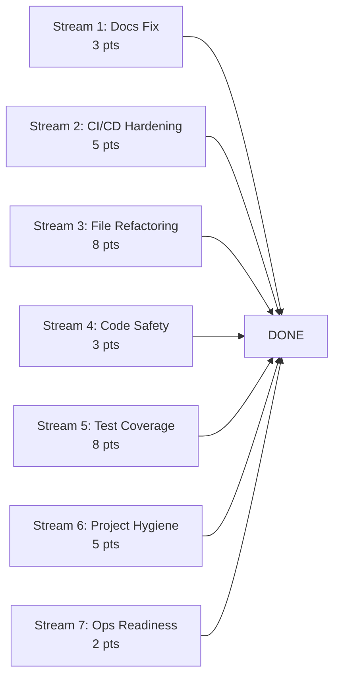

# PRD: Codebase Health Audit Remediation

## Overview

This PRD defines remediation work identified during a comprehensive codebase
scan covering project structure, Go code quality, CI/CD configuration,
documentation consistency, and security posture. Findings are organized into
parallel work streams to maximise concurrent execution.

## Goals

1. **Documentation Accuracy**: Eliminate stale or conflicting documentation
2. **CI/CD Hardening**: Close security scanning gaps and tool version inconsistencies
3. **Code Hygiene**: Refactor oversized files, standardize patterns, address panics in request paths
4. **Test Coverage**: Improve coverage on critical infrastructure (saga framework, E2E tests)
5. **Operational Readiness**: Fill gaps in deployment documentation and environment setup

## Non-Goals

- New feature development
- Performance optimisation or benchmarking
- Withdrawal persistence (covered in prd-technical-debt-remediation.md)
- Idempotency gap fixes (covered in prd-technical-debt-remediation.md)
- ADR-0013/0014/0017 implementation (separate PRDs)

## Complexity Assessment

Total estimated complexity: **34 story points** across 7 work streams.

Critical path: Stream 1 (3 pts) has no dependencies and unblocks contributor
onboarding. All other streams are independent and can execute concurrently.

All 7 streams are independent with zero inter-stream dependencies. Maximum parallelization: 7 concurrent work streams.

---

## Stream 1: Documentation Accuracy (3 pts)

No dependencies. Can start immediately.

### Task 1.1: Fix Go Version Mismatch

**Problem**: `CONTRIBUTING.md:63` states Go 1.23+. `README.md:225` states
Go 1.25+. `go.mod` requires 1.25.7. Developers following CONTRIBUTING.md
will use the wrong Go version.

**Files Affected**:

- `CONTRIBUTING.md:63`

**Acceptance Criteria**:

1. CONTRIBUTING.md states Go 1.25+ matching README.md and go.mod
2. Any other version references in docs are consistent

### Task 1.2: Add ADR-0028 to Index

**Problem**: ADR-0028 (Starlark Saga + CEL Valuation) exists at
`docs/adr/0028-starlark-saga-cel-valuation.md` but is missing from the ADR
index table in `docs/adr/README.md`.

**Files Affected**:

- `docs/adr/README.md` (lines 39-74, index table)

**Acceptance Criteria**:

1. ADR-0028 entry added to the ADR index table with correct title, status, and date
2. Verify ADR-0027 also has a corresponding index entry

### Task 1.3: Complete .env.example

**Problem**: `.env.example` only documents 4 variables (APP_ENV, APP_PORT,
APP_HOST, LOG_LEVEL). Missing 8+ database URLs, Kafka config, Redis URL,
Keycloak settings that developers need for local setup.

**Files Affected**:

- `.env.example`

**Acceptance Criteria**:

1. All database URLs documented with placeholder patterns (PLATFORM_DATABASE_URL, CURRENT_ACCOUNT_DATABASE_URL, etc.)
2. Kafka, Redis, Keycloak connection patterns documented
3. Comments distinguish required vs optional variables
4. Comments distinguish local dev vs production differences

---

## Stream 2: CI/CD Hardening (5 pts)

No dependencies. Can start immediately.

### Task 2.1: Pin golangci-lint Version Consistently

**Problem**: Pre-commit hook (`.githooks/pre-commit:134`) pins v2.5.0.
CI workflow (`quality.yml:55`) uses v2.7.2. Different lint results locally
vs CI causes confusion.

**Files Affected**:

- `.githooks/pre-commit` (line 134, version pin)

**Acceptance Criteria**:

1. Pre-commit hook uses same golangci-lint version as CI
2. Single source of truth for the version (ideally a variable or shared config)

### Task 2.2: Enable CodeQL on Main Branch

**Problem**: `codeql.yml:16` only runs on develop branch. Main branch gets no static analysis.

**Files Affected**:

- `.github/workflows/codeql.yml` (line 16, branches list)

**Acceptance Criteria**:

1. CodeQL runs on both develop and main branches
2. PR triggers unchanged

### Task 2.3: Add Gitleaks to Pre-commit Hook

**Problem**: Secrets could be committed before CI catches them. The pre-commit
hook runs buf, markdown, gofumpt, golangci-lint but not Gitleaks.

**Files Affected**:

- `.githooks/pre-commit`

**Acceptance Criteria**:

1. Gitleaks runs as part of pre-commit on staged files
2. Auto-installs gitleaks if missing (matching existing tool install pattern)
3. Skips if gitleaks not available (graceful degradation, not blocking)

### Task 2.4: Enable Trivy Scanning for PR Builds

**Problem**: `build.yml:52` skips Trivy scanning on PR builds.
Vulnerability-introducing PRs pass CI without image scanning.

**Files Affected**:

- `.github/workflows/build.yml` (line 52, conditional)

**Acceptance Criteria**:

1. Trivy scan runs on PR builds (at minimum as non-blocking warning)
2. Existing non-PR scanning behaviour unchanged
3. PR build time increase is reasonable (< 2 min added)

---

## Stream 3: Large File Refactoring (8 pts)

No dependencies. Can start immediately. Individual subtasks within this
stream are independent and can be parallelized.

### Task 3.1: Refactor current-account grpc_service.go (2135 lines)

**Problem**: Largest non-generated Go file in the codebase. Mixes endpoint
definitions, request handling, response mapping, and validation in a single
file.

**Files Affected**:

- `services/current-account/service/grpc_service.go`

**Acceptance Criteria**:

1. File split into logical modules (e.g., endpoints, request handlers, response mappers)
2. No file exceeds 600 lines
3. All existing tests pass unchanged
4. No public API changes

### Task 3.2: Refactor payment-order grpc_service.go (1772 lines)

**Files Affected**:

- `services/payment-order/service/grpc_service.go`

**Acceptance Criteria**:

1. File split into logical modules
2. No file exceeds 600 lines
3. All existing tests pass unchanged

### Task 3.3: Refactor financial-accounting service (1765 lines)

**Files Affected**:

- `services/financial-accounting/service/financial_accounting_service.go`

**Acceptance Criteria**:

1. File split into logical modules
2. No file exceeds 600 lines
3. All existing tests pass unchanged

### Task 3.4: Refactor payment_orchestrator.go (1403 lines)

**Files Affected**:

- `services/payment-order/service/payment_orchestrator.go`

**Acceptance Criteria**:

1. File split into logical modules (orchestration, state transitions, compensation)
2. No file exceeds 600 lines
3. All existing tests pass unchanged

### Task 3.5: Refactor postgres_provisioner.go (1408 lines)

**Files Affected**:

- `services/tenant/provisioner/postgres_provisioner.go`

**Acceptance Criteria**:

1. File split into logical modules (provisioner, schema builder, migration runner)
2. No file exceeds 600 lines
3. All existing tests pass unchanged

---

## Stream 4: Code Safety (3 pts)

No dependencies. Can start immediately.

### Task 4.1: Migrate MustFromContext to Error-Based Handling

**Problem**: `shared/platform/tenant/context.go:33` `MustFromContext()` panics
if tenant context is missing. In request handler paths, this causes
unrecoverable crashes instead of graceful error responses.
`RequireFromContext()` (line 41) already exists but callers haven't been
migrated.

**Files Affected**:

- `shared/platform/tenant/context.go`
- All callers of `MustFromContext()` across services

**Acceptance Criteria**:

1. Audit all `MustFromContext()` call sites in request handler paths
2. Migrate request handler callers to `RequireFromContext()` with proper error handling
3. `MustFromContext()` retained for init/startup paths where panic is appropriate
4. Add deprecation comment directing future callers to `RequireFromContext()`
5. All existing tests pass

### Task 4.2: Standardize SQL Identifier Quoting in Tests

**Problem**: Mixed approaches to SQL schema name interpolation. Some tests
use `pq.QuoteIdentifier()` (safe), others use bare `fmt.Sprintf` with `%s`
(unsafe pattern).

**Files Affected**:

- `internal/audit-consumer/adapters/persistence/tenant_audit_writer_integration_test.go:108`
- `tests/audit-e2e/audit_writer_e2e_test.go:174,187`
- Any other test files using `fmt.Sprintf` for schema names in SQL

**Acceptance Criteria**:

1. All SQL schema/table name interpolation uses `pq.QuoteIdentifier()` or parameterized queries
2. No bare `fmt.Sprintf` with `%s` for SQL identifiers in test code
3. All affected tests pass

---

## Stream 5: Test Coverage (8 pts)

No dependencies. Can start immediately. Subtasks are independent.

### Task 5.1: Improve Saga Framework Test Coverage

**Problem**: `shared/pkg/saga/` has ~53% test coverage. This is the core
orchestration framework - Starlark execution, CEL evaluation, schema
validation, state machine transitions. Compensation integration tests are
skipped (`schema/compensation_integration_test.go:16`).

**Files Affected**:

- `shared/pkg/saga/` (83 files, 44 test files)
- `shared/pkg/saga/schema/compensation_integration_test.go`

**Acceptance Criteria**:

1. Saga framework test coverage reaches 65%+
2. Compensation integration test is either enabled or replaced with working alternative
3. State machine transition edge cases covered
4. Schema validation error paths covered

### Task 5.2: Improve Client Library Test Coverage

**Problem**: `shared/pkg/clients/` has ~47% test coverage. Contains circuit
breaker, retry logic, and service discovery patterns critical for production
resilience.

**Files Affected**:

- `shared/pkg/clients/` (17 files, 8 test files)

**Acceptance Criteria**:

1. Client library test coverage reaches 65%+
2. Circuit breaker open/close/half-open transitions tested
3. Retry logic with backoff tested
4. Error propagation paths covered

### Task 5.3: Enable Payment Order E2E Test Infrastructure

**Problem**: `services/payment-order/e2e/e2e_test.go:146-150` has 15+ TODOs
for multi-service gRPC startup. Payment saga orchestration is not
end-to-end tested.

**Files Affected**:

- `services/payment-order/e2e/e2e_test.go`

**Acceptance Criteria**:

1. Multi-service test harness starts position-keeping, financial-accounting, current-account, and payment-order services
2. At least one happy-path payment saga E2E test passes
3. At least one compensation (rollback) scenario tested
4. TODOs in setup function resolved

---

## Stream 6: Project Hygiene (5 pts)

No dependencies. Can start immediately.

### Task 6.1: Expand audit-worker to Proper Service Structure

**Problem**: `services/audit-worker/` contains only `main.go` and `main_test.go` (2 files).
No domain, adapters, or service layer. Core audit functionality has no architectural
structure despite `internal/audit-consumer/` having the business logic.

**Files Affected**:

- `services/audit-worker/`
- `internal/audit-consumer/`

**Acceptance Criteria**:

1. audit-worker follows the standard service directory pattern (adapters/, domain/, service/, cmd/)
2. Business logic from `internal/audit-consumer/` properly integrated
3. Existing functionality preserved
4. K8s manifests remain functional

### Task 6.2: Consolidate Duplicate Platform Packages

**Problem**: Both `shared/pkg/platform/` and `pkg/platform/` exist with overlapping
concerns. Suggests incomplete migration or accidental duplication.

**Files Affected**:

- `pkg/platform/`
- `shared/pkg/platform/` (if exists as separate from `shared/platform/`)

**Acceptance Criteria**:

1. Single canonical location for platform code
2. All imports updated
3. Duplicate package removed
4. All tests pass

### Task 6.3: Add K8s Manifests for reference-data Service

**Problem**: `services/reference-data/` has no `k8s/` directory. Every other service has Kubernetes manifests.

**Files Affected**:

- `services/reference-data/k8s/` (new)

**Acceptance Criteria**:

1. K8s manifests created following the pattern of other services
2. Deployment, Service, and ConfigMap defined
3. Manifests pass `validate-manifests.yml` workflow checks

---

## Stream 7: Operational Readiness (2 pts)

No dependencies. Can start immediately.

### Task 7.1: Expand SECURITY.md with Financial System Specifics

**Problem**: Current SECURITY.md is generic. For a financial transaction engine, it
should address threat model, data classification, audit trail protection, and
multi-tenancy security boundaries.

**Files Affected**:

- `SECURITY.md`

**Acceptance Criteria**:

1. Financial system threat model section added
2. Data classification documented (PII, transaction data, audit logs)
3. Multi-tenancy security boundary documentation
4. CockroachDB encryption and isolation guarantees referenced
5. Audit log tampering prevention documented

### Task 7.2: Create Production Deployment Guide

**Problem**: Runbooks cover operations but no "First-Time Deployment" documentation
exists. Deployment knowledge is locked in people.

**Files Affected**:

- `docs/runbooks/production-deployment.md` (new)

**Acceptance Criteria**:

1. Step-by-step production deployment procedure documented
2. Infrastructure prerequisites listed (CockroachDB, Kafka, Redis, Keycloak)
3. Database initialisation and migration procedures
4. Service startup order and health check verification
5. Rollback procedure documented

---

## Parallelization Summary

| Stream | Points | Dependencies | Parallelizable With |
|--------|--------|-------------|-------------------|
| 1. Documentation Accuracy | 3 | None | All others |
| 2. CI/CD Hardening | 5 | None | All others |
| 3. Large File Refactoring | 8 | None | All others |
| 4. Code Safety | 3 | None | All others |
| 5. Test Coverage | 8 | None | All others |
| 6. Project Hygiene | 5 | None | All others |
| 7. Ops Readiness | 2 | None | All others |

**Within-stream parallelization**:

- Stream 3: All 5 refactoring tasks are independent (different services)
- Stream 5: All 3 test coverage tasks are independent
- Stream 6: Tasks 6.1, 6.2, 6.3 are independent

**Critical path**: 8 pts (any single 8-point stream). With full parallelization,
all 34 pts of work complete in the time it takes to finish the longest stream.

## Task Master Parsing Guidance

When parsing this PRD into Task Master tasks:

- **Create exactly 22 tasks** corresponding to the 22 numbered tasks in this PRD (1.1 through 7.2)
- Each task maps to a single PR-able unit of work
- Preserve the stream grouping as task numbering (Task 1 = Stream 1 tasks, Task 2 = Stream 2 tasks, etc.)
- **Do not collapse tasks** - each task addresses a distinct issue identified in the codebase scan
- **Do not add tasks** beyond what is specified here
- Mark all inter-stream dependencies as none (all streams are independent)
- Within-stream subtask dependencies should reflect the acceptance criteria ordering

**Suggested task-to-stream mapping:**

| Task ID | PRD Reference | Stream |
|---------|--------------|--------|
| 1 | Task 1.1: Fix Go Version Mismatch | Docs |
| 2 | Task 1.2: Add ADR-0028 to Index | Docs |
| 3 | Task 1.3: Complete .env.example | Docs |
| 4 | Task 2.1: Pin golangci-lint Version | CI/CD |
| 5 | Task 2.2: Enable CodeQL on Main | CI/CD |
| 6 | Task 2.3: Add Gitleaks to Pre-commit | CI/CD |
| 7 | Task 2.4: Enable Trivy for PR Builds | CI/CD |
| 8 | Task 3.1: Refactor current-account grpc_service.go | Refactoring |
| 9 | Task 3.2: Refactor payment-order grpc_service.go | Refactoring |
| 10 | Task 3.3: Refactor financial-accounting service | Refactoring |
| 11 | Task 3.4: Refactor payment_orchestrator.go | Refactoring |
| 12 | Task 3.5: Refactor postgres_provisioner.go | Refactoring |
| 13 | Task 4.1: Migrate MustFromContext | Code Safety |
| 14 | Task 4.2: Standardize SQL Identifier Quoting | Code Safety |
| 15 | Task 5.1: Saga Framework Test Coverage | Test Coverage |
| 16 | Task 5.2: Client Library Test Coverage | Test Coverage |
| 17 | Task 5.3: Payment Order E2E Infrastructure | Test Coverage |
| 18 | Task 6.1: Expand audit-worker Structure | Project Hygiene |
| 19 | Task 6.2: Consolidate Platform Packages | Project Hygiene |
| 20 | Task 6.3: Add reference-data K8s Manifests | Project Hygiene |
| 21 | Task 7.1: Expand SECURITY.md | Ops Readiness |
| 22 | Task 7.2: Production Deployment Guide | Ops Readiness |

## Success Criteria

1. All acceptance criteria met across all streams
2. CI passes on all changes
3. No regression in existing test suites
4. No new linter warnings introduced
