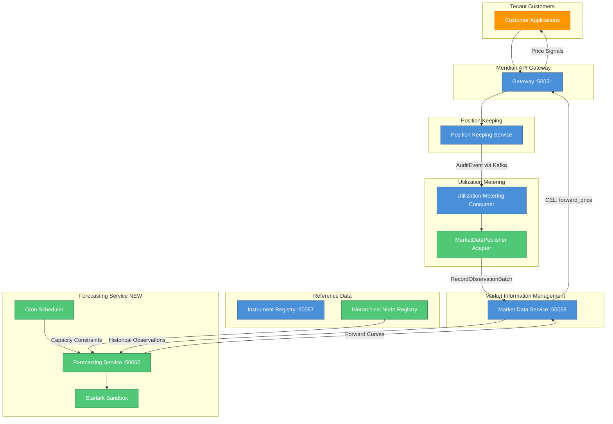
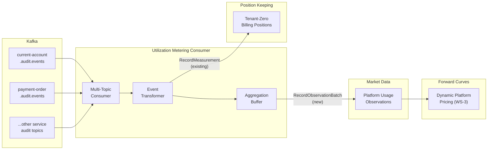

# Market Data & Dynamic Pricing PRD

**Status:** Draft
**Owner:** Platform Team
**Last Updated:** 2026-02-09

## Executive Summary

This PRD defines the capabilities required to transform Meridian from a
position-keeping engine into a **closed-loop dynamic pricing platform**.
By extending the existing `utilization-metering-consumer` to publish usage
patterns as market data, introducing a **Hierarchical Reference Data**
capability alongside the existing Instrument Registry, and creating a new
**Forecasting Service** with pluggable Starlark-based algorithms, Meridian
enables tenants to implement sophisticated time-of-use tariffs and demand
shaping strategies.

### The Metronome Gap

Metronome (Stripe's $1B acquisition) demonstrates market demand for usage-based billing, but has fundamental limitations:

- **34-day correction window** - cannot reprocess older billing periods
- **No bi-temporal support** - cannot model "as-at" vs "as-of" distinctions
- **Pre-loaded rate cards** - pricing logic evaluated at ingest time, not settlement
- **Webhooks only** - no durable saga patterns for complex billing orchestration
- **No forward curves** - purely reactive to historical usage

Meridian's existing capabilities (bi-temporal positions, wash-and-reload
settlement, CEL runtime evaluation, durable sagas) already surpass Metronome.
This PRD adds the final piece: **forward-looking market data and algorithmic
pricing**.

## Problem Statement

Modern pricing scenarios require forward-looking price signals:

1. **AI Compute Infrastructure**: Data center operators need to price GPU time
   based on predicted demand, incentivising off-peak usage
2. **Energy Markets**: Utilities publish day-ahead prices so consumers can shift
   load (EV charging, industrial processes) to lower-cost periods
3. **Telecommunications**: 5G slicing requires dynamic bandwidth pricing based
   on network congestion forecasts
4. **Financial Services**: FX forwards, interest rate curves, commodity futures
   all require forward curve modelling

The common pattern: **publish future prices to change behaviour, not just react to historical usage**.

Meridian already collects the raw signal (usage via
`utilization-metering-consumer`) but doesn't expose it as market data for
tenant-level dynamic pricing.

## Goals

| Goal | Success Metric |
|------|---------------|
| Enable closed-loop demand shaping | Tenants can publish forward curves that influence customer behaviour |
| Support pluggable forecasting algorithms | At least 3 algorithm types deployable via Starlark |
| Hierarchical reference data | Tenants can model capacity at any granularity (region > zone > rack) |
| External forecast ingestion | Tenants can import third-party forecasts (weather, demand, market) |
| Bi-temporal forecast tracking | Full audit trail of forecast vs actual for model improvement |

## Non-Goals

- Building a general-purpose time-series database (use existing Market Information Management service)
- Real-time streaming analytics (batch forecasting is sufficient for day-ahead markets)
- Replacing tenant-specific pricing engines (we provide curves; they apply business logic)

---

## Architecture Overview



---

## Existing Infrastructure Inventory

Before detailing work streams, here is what already exists and what this PRD builds upon.

| Component | Status | Key Capabilities |
|-----------|--------|------------------|
| `utilization-metering-consumer` | Implemented | Consumes `AuditEvent` from 6+ Kafka topics (`{schema}.audit.events`), transforms to `UtilizationMeasurement`, sends to Position Keeping for tenant-zero billing. **WS-1 adds MDS output alongside PK** for time-of-use pricing analytics |
| Market Information Management | Implemented (17/18 tasks) | Bi-temporal observations, quality ladder (ESTIMATE/PROVISIONAL/ACTUAL/VERIFIED), CEL validation, resolution keys, data sources with trust levels, batch ingestion, Kafka event publishing (`ObservationRecorded`) |
| Reference Data (Instrument Registry) | Implemented | Instrument definitions, CEL validation expressions, fungibility keys, lifecycle management (DRAFT/ACTIVE/DEPRECATED), tiered caching |
| Starlark Runtime | Implemented | `shared/pkg/saga/starlark_runner.go`, service module injection from `handlers.yaml`, compensation support, bounded execution |
| CEL Runtime | Implemented | `cel-go v0.27.0`, used in market information (validation, resolution keys), reference data (instrument validation), saga evaluation |
| Kafka Infrastructure | Implemented | `franz-go v1.20.6`, proto consumers with manual offset commit, topic pattern: `{service}.{event-type}.v{version}` |
| handlers.yaml Schema | Implemented | `shared/pkg/saga/schema/handlers.yaml`, type-safe handler definitions with compensation mappings |

### Quality Ladder Alignment

The Market Information Service defines a 4-level quality ladder at the proto level:

| Level | Proto Enum | Domain Mapping | Value |
|-------|-----------|----------------|-------|
| ESTIMATE | `QUALITY_LEVEL_ESTIMATE` | `QualityLevelEstimate` | 1 |
| PROVISIONAL | `QUALITY_LEVEL_PROVISIONAL` | `QualityLevelProvisional` | 2 |
| ACTUAL | `QUALITY_LEVEL_ACTUAL` | `QualityLevelActual` | 3 |
| VERIFIED | `QUALITY_LEVEL_REVISED` (slot 4) | `QualityLevelVerified` | 4 |

**Note:** The domain layer is a 1:1 four-level confidence ladder (Axis A of
ADR-0017): ESTIMATE=1, PROVISIONAL=2, ACTUAL=3, VERIFIED=4. Proto slot 4 is still
spelled `QUALITY_LEVEL_REVISED` but is semantically VERIFIED; the symbol rename is
deferred. This PRD's forecasting output should publish at `QUALITY_LEVEL_ESTIMATE`
quality, allowing actuals to naturally supersede forecasts via the quality ladder.

### Reference Data Service: Instrument Registry vs Hierarchical Nodes

The existing Reference Data service (`services/reference-data/`) is an
**Instrument Registry** managing asset type definitions (currencies, energy
units, compute units) with CEL-based validation and fungibility expressions.

WS-2 of this PRD proposes a **Hierarchical Node Registry** - a distinct
capability for modelling topology and capacity structures (region > zone > rack,
DNO > GSP > meter). This is **not an extension of instrument definitions** but
a new domain concept within the Reference Data service boundary, analogous to
how Market Information manages both DataSetDefinitions and DataSources.

---

## Work Streams

### WS-1: Utilization Metering Extension (P0)

**Objective:** Extend `utilization-metering-consumer` to publish
aggregated platform usage as market data observations alongside its
existing Position Keeping output, demonstrating the MDS pipeline that
tenants will independently use for their own asset tracking.

#### Two Separate Data Flows

This PRD enables tenants to track **their own assets** (kWh, GPU-hours,
carbon credits) using MDS observations, forward curves, and dynamic
pricing. The UMC extension is Meridian dogfooding that same
infrastructure for its own platform usage analytics.

| Concern | Data Flow | Owner |
|---------|-----------|-------|
| **Platform billing** (existing) | Audit events → UMC → tenant-zero PK | Meridian — tracks how much each tenant uses the platform |
| **Platform pricing analytics** (new, WS-1) | Audit events → UMC → MDS observations | Meridian — feeds forward curves for dynamic platform pricing |
| **Tenant asset tracking** (new, tenant-driven) | Tenant's own events → Tenant's own MDS | Tenant — tracks their own customers' usage for their own pricing |

Tenant-zero Position Keeping **stays** — it accumulates billable
positions for platform billing. The MDS output is additive: it gives
Meridian's pricing engine the same quality-ladder observations and
forward curve infrastructure that tenants get for their own data.

#### Current State

The `utilization-metering-consumer` currently:

- Consumes `AuditEvent` protobuf messages from Kafka (6+ service audit
  topics: `current-account.audit.events`, `payment-order.audit.events`,
  `position-keeping.audit.events`, `financial-accounting.audit.events`,
  `party.audit.events`, `tenant.audit.events`, and any new services)
- Transforms audit events into `UtilizationMeasurement` via `AuditEventTransformer`
- Sends measurements to Position Keeping service for tenant-zero billing via gRPC
- Tracks instruments: TRANSACTION, API_CALL, STORAGE_GB, COMPUTE_HOUR, NETWORK_GB

#### Target State

The consumer will additionally:

- Publish usage aggregates to Market Information Management service via the existing `RecordObservationBatch` RPC
- Support configurable aggregation windows (hourly, daily)
- Enable per-tenant usage visibility via dataset scoping
- Track usage by hierarchical reference data keys (when WS-2 is available)
- Tenant-zero PK output continues unchanged (platform billing)



#### Key Changes

| Component | Change |
|-----------|--------|
| `utilization-metering-consumer` | Add `MarketDataPublisher` output adapter alongside existing `PositionKeepingClient` |
| Market Information datasets | Register new `UTILIZATION_AGGREGATE` dataset definitions (one per instrument type) |
| Resolution keys | Support hierarchical keys: `{tenant}/{resource_type}/{resource_id}` |
| Aggregation | In-memory windowed aggregation with periodic flush to MDS |

#### Design: MarketDataPublisher Adapter

```go
// MarketDataPublisher publishes aggregated utilization data to Market Information Service.
// Lives alongside the existing PositionKeepingClient - both receive transformed measurements.
// This is Meridian dogfooding the same MDS infrastructure that tenants use for their own data.
type MarketDataPublisher struct {
    misClient  marketinformationv1.MarketInformationServiceClient
    windowSize time.Duration // e.g., 1 hour
    buffer     *AggregationBuffer
    logger     *slog.Logger
}

// AggregationBuffer accumulates measurements within a time window before flushing.
type AggregationBuffer struct {
    mu      sync.Mutex
    windows map[string]*UtilizationWindow // keyed by resolution_key + window_start
}

// UtilizationWindow represents aggregated metrics for a single time window.
type UtilizationWindow struct {
    ResolutionKey    string
    WindowStart      time.Time
    WindowEnd        time.Time
    TotalUnits       decimal.Decimal
    PeakUnits        decimal.Decimal
    AvgUnits         decimal.Decimal
    ObservationCount int64
    DatasetCode      string // e.g., "UTILIZATION_TRANSACTION", "UTILIZATION_API_CALL"
}
```

The publisher uses the existing `RecordObservationBatch` RPC with:

- `dataset_code`: Registered utilisation dataset (e.g., `UTILIZATION_TRANSACTION`)
- `quality`: `QUALITY_LEVEL_ACTUAL` (derived from real audit events)
- `resolution_key`: Hierarchical key computed from tenant + resource context
- `observed_at`: Window midpoint
- `valid_from` / `valid_to`: Window boundaries

#### Tenant Asset Tracking (Independent)

Tenants use the **same MDS infrastructure** to track their own
customers' assets — but via their own data ingestion, not the UMC.
A tenant data flow looks like:

```text
Tenant's own systems → RecordObservationBatch (tenant's MDS schema)
                        → Forward curves (tenant's Starlark strategies)
                        → CEL pricing rules (forward_price())
                        → Billing cycle (Stripe Connect PRD WS-4)
```

This is entirely separate from Meridian's platform billing. The
reference data hierarchy (WS-2), forecasting service (WS-3), and
forward curve consumption (WS-4) all operate within the tenant's
own schema boundary (ADR-0016).

#### Tasks

| ID | Task | Complexity | Dependencies |
|----|------|------------|--------------|
| UM-1 | Define `MarketDataPublisher` interface and adapter skeleton | 3 | - |
| UM-2 | Implement `AggregationBuffer` with configurable window size | 3 | UM-1 |
| UM-3 | Register `UTILIZATION_*` dataset definitions in MDS (one per instrument type) | 2 | - |
| UM-4 | Implement periodic flush to MDS via `RecordObservationBatch` RPC | 3 | UM-2, UM-3 |
| UM-5 | Add hierarchical resolution key computation from tenant context | 2 | UM-1 |
| UM-6 | Wire `MarketDataPublisher` into `AuditConsumer` handler chain | 2 | UM-4 |
| UM-7 | Add Prometheus metrics for aggregation buffer and publish latency | 2 | UM-6 |
| UM-8 | Integration tests: audit event flow through to MDS observations | 3 | UM-6 |

**WS-1 Complexity:** 20

---

### WS-2: Hierarchical Reference Data (P0)

**Objective:** Extend the Reference Data service with a hierarchical node
registry for modelling topology and capacity structures with bi-temporal
validity.

#### Design Principles

The Hierarchical Node Registry must be:

1. **Generic** - No rigid schemas; tenants define their own structures (like instrument definitions)
2. **Hierarchical** - Natural tree structures: DNO > GSP > Meter; Region > Zone > Rack
3. **Bi-temporal** - Valid-time and transaction-time tracking for auditable seed data
4. **Tenant-scoped** - Full isolation between tenants
5. **Colocated** - Lives within the Reference Data service boundary, sharing
   infrastructure (database schema, caching, rate limiting) but maintaining
   a separate domain aggregate
6. **Immutable when active** - Like instruments, active nodes cannot change
   attributes that affect their `resolutionKey`. Moving a rack from Zone A
   to Zone B requires terminating the old node (`valid_to = NOW()`) and
   creating a new node under the new parent. This follows the existing
   `enforce_instrument_lifecycle()` pattern in Reference Data and prevents
   historical data orphaning. The `UpdateNode` RPC enforces: only
   non-key-affecting attributes (e.g., `gpu_count`, `cooling`) are mutable
   on active nodes; `nodeType`, `parentID`, and identity fields are frozen

#### Data Model

```go
// ReferenceDataNode represents a single node in a hierarchical reference data structure.
// Nodes form arbitrary trees within a tenant's namespace, with bi-temporal validity tracking.
type ReferenceDataNode struct {
    id              uuid.UUID
    tenantID        string
    nodeType        string          // e.g., "region", "zone", "rack", "dno", "gsp", "meter"
    parentID        *uuid.UUID      // nil for root nodes
    attributes      map[string]any  // Flexible key-value metadata (JSON in DB)
    resolutionKey   string          // Computed: "parent_key/type:id"
    validFrom       time.Time       // Effective start
    validTo         *time.Time      // Effective end (nil = unbounded)
    createdAt       time.Time       // Transaction time (system-managed)
    version         int64           // Optimistic locking
}
```

#### Resolution Key Computation

Resolution keys are computed hierarchically, enabling correlation with Market Data observations:

```text
Root:   "dno:dno-001"
Child:  "dno:dno-001/gsp:gsp-exeter"
Leaf:   "dno:dno-001/gsp:gsp-exeter/meter:meter-12345"
```

This mirrors the resolution key pattern already used in Market Information
Service observations, enabling direct joins between usage data and reference
topology.

#### Example: Energy Grid Hierarchy

```json
{"id": "dno-001", "type": "dno", "parent_id": null,
 "attributes": {"name": "Western Power Distribution", "region": "South West"},
 "resolution_key": "dno:dno-001"}

{"id": "gsp-exeter", "type": "gsp", "parent_id": "dno-001",
 "attributes": {"name": "Exeter GSP", "capacity_mw": 450},
 "resolution_key": "dno:dno-001/gsp:gsp-exeter"}

{"id": "meter-12345", "type": "meter", "parent_id": "gsp-exeter",
 "attributes": {"mpan": "12345678901234", "profile_class": 1},
 "resolution_key": "dno:dno-001/gsp:gsp-exeter/meter:meter-12345"}
```

#### Example: AI Compute Hierarchy

```json
{"id": "us-east-1", "type": "region", "parent_id": null,
 "attributes": {"provider": "aws", "tier": "primary"},
 "resolution_key": "region:us-east-1"}

{"id": "us-east-1a", "type": "zone", "parent_id": "us-east-1",
 "attributes": {"gpu_types": ["A100", "H100"]},
 "resolution_key": "region:us-east-1/zone:us-east-1a"}

{"id": "rack-gpu-42", "type": "rack", "parent_id": "us-east-1a",
 "attributes": {"gpu_count": 64, "cooling": "liquid"},
 "resolution_key": "region:us-east-1/zone:us-east-1a/rack:rack-gpu-42"}
```

#### RPCs

```protobuf
// Extends the existing ReferenceDataService with hierarchical node operations.
// These RPCs live alongside the existing instrument registry RPCs.

// Node CRUD
rpc CreateNode(CreateNodeRequest) returns (ReferenceDataNode);
rpc UpdateNode(UpdateNodeRequest) returns (ReferenceDataNode);
rpc GetNode(GetNodeRequest) returns (ReferenceDataNode);

// Hierarchy traversal
rpc GetChildren(GetChildrenRequest) returns (GetChildrenResponse);
rpc GetAncestors(GetAncestorsRequest) returns (GetAncestorsResponse);
rpc GetSubtree(GetSubtreeRequest) returns (GetSubtreeResponse);

// Bi-temporal queries
rpc GetNodeAsAt(GetNodeAsAtRequest) returns (ReferenceDataNode);
rpc GetNodeHistory(GetNodeHistoryRequest) returns (GetNodeHistoryResponse);

// Bulk operations for seeding
rpc ImportNodes(stream ReferenceDataNode) returns (ImportNodesResponse);
```

#### Tasks

| ID | Task | Complexity | Dependencies |
|----|------|------------|--------------|
| RD-1 | Design `reference_data_node` table schema with bi-temporal columns and CockroachDB compatibility | 3 | - |
| RD-2 | Implement `ReferenceDataNode` domain entity with builder pattern | 3 | RD-1 |
| RD-3 | Implement repository with hierarchical resolution key computation | 5 | RD-2 |
| RD-4 | Implement bi-temporal query methods (as-at, history) | 5 | RD-3 |
| RD-5 | Create gRPC handler with node CRUD operations | 3 | RD-3 |
| RD-6 | Add hierarchy traversal RPCs (children, ancestors, subtree) | 3 | RD-5 |
| RD-7 | Implement streaming bulk import for seeding | 3 | RD-5 |
| RD-8 | Add tenant isolation (reuse existing rate-limiting middleware) | 2 | RD-5 |
| RD-9 | Integrate with existing Redis cache tier for hot-path lookups | 2 | RD-5 |
| RD-10 | Integration tests: hierarchy + bi-temporal queries on CockroachDB | 3 | RD-4, RD-6 |

**WS-2 Complexity:** 32

---

### WS-3: Forecasting Service (P1)

**Objective:** Create a new service that computes forward curves using pluggable
Starlark-based algorithms, leveraging the existing Starlark runtime and MDS
infrastructure.

#### Core Concepts

| Concept | Description |
|---------|-------------|
| **Forecasting Strategy** | A named Starlark script that computes future values from historical data |
| **Forward Curve** | A series of future prices/values published to Market Data Service as observations |
| **Forecast Horizon** | How far into the future the curve extends (e.g., 24 hours, 7 days) |
| **Computation Schedule** | When forecasts are regenerated (e.g., hourly, daily at 16:00) |

#### Starlark Sandbox Design

The Forecasting Service reuses the existing `go.starlark.net` runtime
(`shared/pkg/saga/starlark_runner.go` pattern) with a forecasting-specific
context:

```go
// ForecastContext is injected into the Starlark global scope.
// It provides read-only access to historical observations and reference data.
type ForecastContext struct {
    Observations  []Observation     // Historical data from MDS
    ReferenceData *ReferenceNode    // Hierarchy node with attributes
    Horizon       int               // Forecast hours
    Granularity   int               // Point spacing hours
    Now           time.Time         // Current computation time
}
```

Strategies receive a standardised context and must return a list of forecast points:

```python
# Available in Starlark context:
# - ctx.observations: list of historical observations from MDS
# - ctx.reference_data: hierarchical node with attributes
# - ctx.horizon: forecast horizon in hours
# - ctx.granularity: point spacing in hours
# - ctx.now: current timestamp

def compute_forecast(ctx):
    """
    Simple moving average with capacity constraint.
    """
    # Calculate historical average by hour-of-day
    hourly_avgs = {}
    for obs in ctx.observations:
        hour = obs.timestamp.hour
        if hour not in hourly_avgs:
            hourly_avgs[hour] = []
        hourly_avgs[hour].append(obs.value)

    for hour in hourly_avgs:
        hourly_avgs[hour] = sum(hourly_avgs[hour]) / len(hourly_avgs[hour])

    # Get capacity constraint from reference data
    capacity = ctx.reference_data.attributes.get("capacity", 100.0)

    # Generate forecast points
    points = []
    for i in range(0, ctx.horizon, ctx.granularity):
        forecast_time = ctx.now + duration(hours=i)
        hour = forecast_time.hour
        base_value = hourly_avgs.get(hour, 0.0)

        # Apply capacity-based pricing
        utilisation = base_value / capacity
        if utilisation > 0.8:
            price_multiplier = 1.5  # Peak pricing
        elif utilisation > 0.5:
            price_multiplier = 1.0  # Standard pricing
        else:
            price_multiplier = 0.7  # Off-peak pricing

        points.append({
            "timestamp": forecast_time,
            "value": price_multiplier,
            "metadata": {
                "expected_utilisation": utilisation,
                "pricing_tier": "peak" if utilisation > 0.8 else "standard" if utilisation > 0.5 else "off_peak",
            },
        })

    return points
```

**Starlark safety properties** (inherited from existing platform):

- No `while` loops (only `for` over finite iterables)
- No recursion
- Execution bounded by configured timeout (`context.WithTimeout` +
  `thread.Cancel`); programs terminate within the timeout window
- Near-deterministic execution time (bounded by timeout, subject to
  goroutine scheduling)

#### Built-in Algorithm Templates

| Template | Description |
|----------|-------------|
| `moving_average` | Simple/exponential moving average projection |
| `seasonal_decomposition` | Hour-of-day, day-of-week patterns |
| `capacity_pricing` | Price curves based on utilisation vs capacity |
| `external_blend` | Blend internal forecasts with external feeds |

#### Forward Curve Output

Forward curves are published to MDS as standard observations:

- `dataset_code`: Tenant-specific forward curve dataset (e.g., `FORWARD_PRICE_GPU`)
- `quality`: `QUALITY_LEVEL_ESTIMATE` (forecasts are estimates by definition)
- `valid_from` / `valid_to`: Future time window the price applies to
- `observed_at`: Computation timestamp (when forecast was generated)
- `resolution_key`: Same hierarchical key as the input observations

This means forward curves are automatically:

- **Superseded** when actuals arrive (ESTIMATE < ACTUAL in quality ladder)
- **Bi-temporally queryable** ("What was the forecast at 9am for 3pm pricing?")
- **Auditable** via the existing `superseded_by` chain

#### External Forecast Ingestion

Tenants can import third-party forecasts (weather, market prices, demand forecasts)
using the existing `RecordObservationBatch` RPC with:

- `quality`: `QUALITY_LEVEL_ESTIMATE` for third-party forecasts
- `source_code`: Registered external data source (e.g., `MET_OFFICE`, `EPEX_SPOT`)
- Existing trust level resolution applies when multiple external sources conflict

#### AI-Native Validation Feedback

Strategy validation returns structured errors for LLM self-correction:

```go
type ValidationResult struct {
    Valid                  bool
    Errors                 []ValidationError
    AvailableContextFields []string // ["observations", "reference_data", ...]
    AvailableFunctions     []string // ["duration", "sum", "avg", ...]
}

type ValidationError struct {
    Line       int
    Column     int
    Message    string
    Suggestion string // AI-friendly fix suggestion
}
```

#### Tasks

| ID | Task | Complexity | Dependencies |
|----|------|------------|--------------|
| FS-1 | Design Forecasting Service domain model (Strategy, ForwardCurve entities) | 3 | - |
| FS-2 | Implement `ForecastingStrategy` entity and CockroachDB repository | 5 | FS-1 |
| FS-3 | Create Starlark execution sandbox with `ForecastContext` injection (reuse `starlark_runner` patterns) | 5 | FS-2 |
| FS-4 | Implement built-in algorithm templates (moving_average, seasonal, capacity, blend) | 5 | FS-3 |
| FS-5 | Add strategy validation with AI-native structured feedback | 3 | FS-3 |
| FS-6 | Create gRPC service with strategy CRUD RPCs | 3 | FS-2 |
| FS-7 | Implement `ComputeForwardCurve` RPC (reads MDS + reference data, runs Starlark, publishes to MDS) | 5 | FS-3, WS-1, WS-2 |
| FS-8 | Add scheduled computation via cron with configurable per-strategy schedules | 3 | FS-7 |
| FS-9 | External forecast ingestion via `RecordObservationBatch` with source registration and quality enforcement | 3 | FS-6 |
| FS-10 | Implement forecast vs actual accuracy tracking (compare ESTIMATE vs ACTUAL observations) | 5 | FS-7 |
| FS-11 | Publish forward curves to MDS via `RecordObservationBatch` with ESTIMATE quality | 3 | FS-7 |
| FS-12 | Integration tests: end-to-end forecasting flow with CockroachDB testcontainers | 5 | FS-7, FS-11 |

**WS-3 Complexity:** 48

---

### WS-4: Forward Curve Consumption (P1)

**Objective:** Enable tenants to consume forward curves in their pricing logic via CEL expressions.

#### CEL Extension Functions

Extend the existing CEL environment (`cel-go v0.27.0`) with forward curve access functions:

```cel
// Get forward price for a specific timestamp
forward_price("region:us-east-1/zone:us-east-1a", timestamp("2026-02-10T14:00:00Z"))

// Get pricing tier metadata for next hour
forward_metadata("region:us-east-1", now() + duration("1h")).pricing_tier

// Calculate average forward price over a window
avg_forward_price("gsp:exeter", now(), now() + duration("24h"))
```

These CEL functions query the Market Information Service for observations where:

- `dataset_code` matches the tenant's forward curve dataset
- `resolution_key` matches the requested key
- `quality` = ESTIMATE (forward curves)
- `valid_from` / `valid_to` bracket the requested timestamp

#### Performance: Forward Curve Cache

Forward curves are relatively static (recomputed hourly/daily), so a read-through cache avoids per-request MDS lookups:

```go
// ForwardCurveCache provides sub-millisecond CEL access to forward curves.
// Follows the same tiered cache pattern used in Reference Data service.
type ForwardCurveCache struct {
    local    *lru.Cache       // L1: In-memory, per-pod
    redis    *redis.Client    // L2: Shared across pods
    mis      MISClient        // L3: Market Information Service
    ttl      time.Duration    // Cache TTL (default: 5 minutes)
}
```

#### Tasks

| ID | Task | Complexity | Dependencies |
|----|------|------------|--------------|
| FC-1 | Register `FORWARD_PRICE` and `FORWARD_UTILIZATION` dataset definitions in MDS | 2 | WS-3 |
| FC-2 | Implement `GetForwardCurve` query helper (wraps MDS `ListObservations` with curve-specific filters) | 3 | FC-1 |
| FC-3 | Create CEL extension functions (`forward_price`, `forward_metadata`, `avg_forward_price`) | 5 | FC-2 |
| FC-4 | Implement tiered forward curve cache (in-memory + Redis, same pattern as Reference Data) | 3 | FC-3 |
| FC-5 | Integration tests: CEL expressions using forward curves in pricing rules | 3 | FC-3 |

**WS-4 Complexity:** 16

---

## Critical Path

```mermaid
gantt
    title Critical Path: Market Data & Dynamic Pricing
    dateFormat X
    axisFormat %s pts

    section WS-1 Metering Extension
    UM-1 Publisher Interface     :um1, 0, 3
    UM-2 Aggregation Buffer      :um2, after um1, 3
    UM-3 Register Datasets       :um3, 0, 2
    UM-4 Flush to MDS            :um4, after um2, 3
    UM-5 Resolution Keys         :um5, after um1, 2
    UM-6 Wire into Consumer      :um6, after um4, 2
    UM-7 Metrics                 :um7, after um6, 2
    UM-8 Integration Tests       :um8, after um6, 3

    section WS-2 Hierarchical Ref Data
    RD-1 Schema Design           :rd1, 0, 3
    RD-2 Domain Entity           :rd2, after rd1, 3
    RD-3 Repository              :rd3, after rd2, 5
    RD-4 Bi-temporal Queries     :rd4, after rd3, 5
    RD-5 gRPC Handler            :rd5, after rd3, 3
    RD-6 Traversal RPCs          :rd6, after rd5, 3
    RD-7 Bulk Import             :rd7, after rd5, 3
    RD-8 Tenant Isolation        :rd8, after rd5, 2
    RD-9 Redis Cache             :rd9, after rd5, 2
    RD-10 Integration Tests      :rd10, after rd4, 3

    section WS-3 Forecasting Service
    FS-1 Domain Model            :fs1, 0, 3
    FS-2 Repository              :fs2, after fs1, 5
    FS-3 Starlark Sandbox        :fs3, after fs2, 5
    FS-4 Algorithm Templates     :fs4, after fs3, 5
    FS-5 Validation              :fs5, after fs3, 3
    FS-6 gRPC Service            :fs6, after fs2, 3
    FS-7 ComputeForwardCurve     :crit, fs7, after fs3, 5
    FS-8 Cron Scheduler          :fs8, after fs7, 3
    FS-9 External Ingestion      :fs9, after fs6, 3
    FS-10 Accuracy Tracking      :fs10, after fs7, 5
    FS-11 Publish to MDS         :fs11, after fs7, 3
    FS-12 Integration Tests      :fs12, after fs11, 5

    section WS-4 Curve Consumption
    FC-1 Forward Datasets        :fc1, after fs11, 2
    FC-2 Query Helper            :fc2, after fc1, 3
    FC-3 CEL Extensions          :crit, fc3, after fc2, 5
    FC-4 Forward Curve Cache     :fc4, after fc3, 3
    FC-5 Integration Tests       :fc5, after fc3, 3
```



### Critical Path Analysis

**Longest dependency chain:** RD-1 > RD-2 > RD-3 > RD-4 > (gate) > FS-7 > FS-11 > FC-1 > FC-2 > FC-3

| Segment | Tasks | Complexity |
|---------|-------|------------|
| Reference Data Foundation | RD-1 > RD-2 > RD-3 > RD-4 | 16 |
| Metering Path (parallel) | UM-1 > UM-2 > UM-4 > UM-6 > UM-8 | 14 |
| Forecasting Core | FS-1 > FS-2 > FS-3 > FS-7 | 18 |
| Curve Consumption | FS-11 > FC-1 > FC-2 > FC-3 | 13 |
| **Critical Path Total** | | **47** (RD path) or **31** (FS path, parallel) |

### Parallelisation Opportunities

| Parallel Track | Tasks | Notes |
|----------------|-------|-------|
| WS-1 + WS-2 | UM-*parallel with RD-* | Both complete before FS-7 gate |
| Algorithm Templates | FS-4, FS-5 | After FS-3, not on critical path |
| External Ingestion | FS-9 | After FS-6, not on critical path |
| Accuracy Tracking | FS-10 | After FS-7, not on critical path |
| gRPC Services | FS-6 parallel with FS-3 | Both depend on FS-2 only |

---

## Summary

| Work Stream | Complexity | Priority |
|-------------|------------|----------|
| WS-1: Utilization Metering Extension | 20 | P0 |
| WS-2: Hierarchical Reference Data | 32 | P0 |
| WS-3: Forecasting Service | 48 | P1 |
| WS-4: Forward Curve Consumption | 16 | P1 |
| **Total** | **116** | |
| **Critical Path** | **47** | |

---

## Success Criteria

### Minimum Viable Product (P0 Complete)

1. Platform usage from `utilization-metering-consumer` flows to MDS as
   `UTILIZATION_*` observations (alongside existing tenant-zero PK)
2. Tenants can define hierarchical reference data (e.g., region > zone > rack)
3. Reference data supports bi-temporal queries (as-at, history)
4. Market data observations correlate with reference data resolution keys
5. Tenants can independently ingest their own asset usage data via `RecordObservationBatch`

### Full Feature Set (P1 Complete)

1. Tenants can define Starlark forecasting strategies
2. Forward curves are computed on schedule and published to Market Data Service at ESTIMATE quality
3. CEL expressions can access forward prices for real-time pricing decisions
4. External forecasts can be ingested and blended with internal predictions
5. Forecast vs actual accuracy is tracked for model improvement
6. Actuals automatically supersede forecasts via the existing quality ladder
7. **Shadow billing support**: Forward curves + valuation produce ESTIMATE
   quality positions that the Stripe Connect PRD's shadow billing mode
   can render as draft invoices, letting tenants preview "What would I
   have charged?" before enabling payment rails

---

## Risks and Mitigations

| Risk | Impact | Mitigation |
|------|--------|------------|
| Starlark sandbox escape | High | Use `go.starlark.net` with restricted globals (same pattern as existing saga runner) |
| Forecast computation latency | Medium | Async computation with cron scheduling; results cached in MDS |
| Reference data tree explosion | Medium | Pagination, efficient CockroachDB indexing, max depth constraint |
| Quality ladder collision | Low | Forecasts publish at ESTIMATE; actuals always supersede naturally |
| Aggregation buffer memory | Medium | Configurable max buffer size with overflow flush |

---

## Dependencies

| Dependency | Status | Notes |
|------------|--------|-------|
| Market Information Management Service | Implemented | 17/18 tasks complete; provides `RecordObservationBatch`, `ListObservations` |
| Kafka infrastructure | Implemented | `franz-go v1.20.6`; 6 audit topics consumed by metering |
| Starlark runtime | Implemented | `go.starlark.net`; used in saga runner and valuation runtime |
| CEL runtime | Implemented | `cel-go v0.27.0`; used in market info and reference data |
| Reference Data Service (Instrument Registry) | Implemented | Provides deployment infrastructure for WS-2 extension |
| CockroachDB | Implemented | Used across all services; no TSTZRANGE (use start/end columns) |

---

## BIAN Alignment

### Service Domain Mapping

| PRD Component | BIAN Service Domain | Alignment |
|---------------|---------------------|-----------|
| Market Data Service (existing) | Market Information Management | Consolidates market info from multiple sources |
| Forecasting Service (new) | Market Analysis | Analytical functions with reference data inputs |
| Reference Data Nodes (new) | Public Reference Data Management | Hierarchical structured access to reference data |
| Reference Data Instruments (existing) | Financial Instrument Reference Data | Asset type definitions and validation |
| Position Keeping (existing) | Position Keeping | Transaction logs feeding utilisation data |

### Control Record Patterns

| PRD Entity | BIAN Control Record | Asset Type |
|------------|---------------------|------------|
| `UtilizationAggregate` | Financial Market Information Administrative Plan | Financial Market Information |
| `ForecastingStrategy` | Market Analysis Administrative Plan | Capacity to Perform |
| `ReferenceDataNode` | Reference Data Directory Entry | Reference Information |
| `ForwardCurve` (observations) | Financial Market Information | Derived Market Information |

### Behavioural Qualifiers

| Qualifier | Implementation |
|-----------|----------------|
| **Routine** | Scheduled forecast computation via cron |
| **Reporting** | Forward curve publication to Market Data Service |
| **Improvement** | Forecast vs actual accuracy tracking for model tuning |
| **Consolidation** | Aggregating usage data from utilization-metering-consumer |

---

## Open Questions

1. **Forecast granularity limits**: Should we enforce minimum/maximum granularity
   for forward curves? (Suggest minimum 15 minutes to align with half-hourly
   settlement periods)
2. **Multi-tenant forecast sharing**: Can tenants opt to share anonymised
   forecasts for collective intelligence?
3. **Forecast versioning**: When a strategy is updated mid-forecast-period,
   should in-flight curves complete with the old version or be recomputed?
4. **Quality ladder expansion**: Should PROVISIONAL be given its own domain-level
   value (currently mapped to ESTIMATE) to distinguish "forecasted" from
   "provisional measurement"?

---

## Appendix: Closed-Loop Example

### AI Compute Dynamic Pricing

```text
Day 1, 16:00 - Forecast Computation
+-- Input: Last 7 days of GPU utilisation by zone (from MDS UTILIZATION_COMPUTE_HOUR dataset)
+-- Reference: Zone capacity constraints (from Hierarchical Node: rack-gpu-42.attributes.gpu_count)
+-- Algorithm: capacity_pricing with seasonal_decomposition (Starlark strategy)
+-- Output: 24-hour forward curve published to MDS as FORWARD_PRICE_GPU observations (ESTIMATE quality)

Day 2, 00:00-23:59 - Customer Behaviour
+-- Customer A queries CEL: forward_price("region:us-east-1/zone:us-east-1a", tomorrow_3am)
+-- Returns 0.7x multiplier (off-peak); schedules batch training for 3am
+-- Customer B queries CEL: forward_price("region:us-east-1/zone:us-east-1a", tomorrow_2pm)
+-- Returns 1.5x multiplier (peak); delays non-urgent inference to evening

Day 2, 16:00 - Cycle Repeats
+-- Actual utilisation recorded via audit events -> metering consumer -> MDS (ACTUAL quality)
+-- ACTUAL observations supersede ESTIMATE forward curve (quality ladder)
+-- New forecast reflects changed behaviour patterns
+-- Prices adjust to maintain target utilisation
```

This closed-loop system transforms Meridian from a passive record-keeper into an **active demand-shaping platform**.
