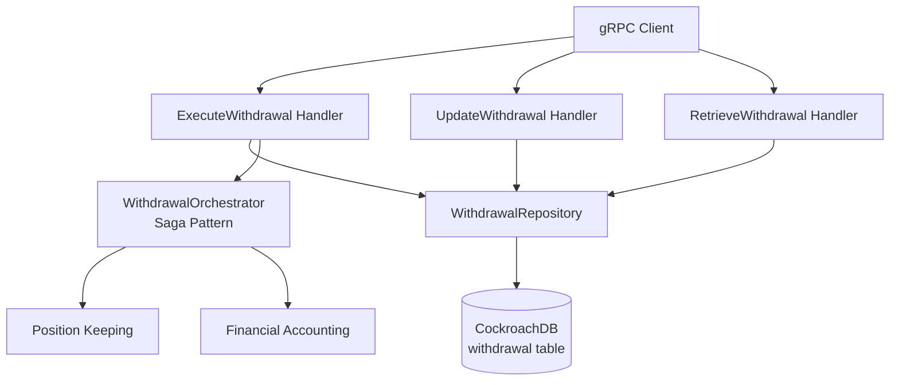

# PRD: Current Account Withdrawal Persistence

**Status:** Draft
**Version:** 1.0
**Date:** 2026-02-10
**Author:** Architecture Team
**Task Master Tag:** TBD

**ADRs:**

- [0002 - Microservices Per BIAN Domain](../adr/0002-microservices-per-bian-domain.md)
- [0015 - Standard Service Directory Structure](../adr/0015-standard-service-directory-structure.md)

**Related PRDs:**

- [Reconciliation gRPC Wiring](017-reconciliation-grpc-wiring.md) -
  Appendix: Cross-Service Unimplemented RPC Audit (source of this work)

---

## Problem Statement

Three withdrawal gRPC handlers in the current-account service return `codes.Unimplemented` when `withdrawalRepo == nil`:

| Handler | File | Line | Error Message |
|---------|------|------|---------------|
| `UpdateWithdrawal` | `service/grpc_withdrawal_manage.go` | 173 | "withdrawal persistence not configured" |
| `RetrieveWithdrawal` | `service/grpc_withdrawal_manage.go` | 262 | Returns empty list for account queries; errors on direct withdrawal-by-ID lookup |
| `ExecuteWithdrawal` | `service/grpc_withdrawal_execute.go` | 54 | "withdrawal persistence not configured" |

**Severity:** Medium - Withdrawal-by-ID operations fail in production. Account-based operations degrade gracefully.

---

## Root Cause Analysis

The `WithdrawalRepository` persistence adapter already exists and is already wired in `cmd/main.go`:

```go
// cmd/main.go:97
withdrawalRepo := persistence.NewWithdrawalRepository(db)
```

The repository is passed to `createServiceWithClients` (line 125) and then to
`service.NewServiceWithExistingClients` (line 483). The service struct holds it at
`service/grpc_service.go:129`:

```go
withdrawalRepo *persistence.WithdrawalRepository
```

**The nil guards are dead code.** Since `withdrawalRepo` is unconditionally
initialized in `cmd/main.go:97` and always passed to the Service constructor,
the `withdrawalRepo == nil` checks in the three handlers will never execute in
normal operation. These guards were written defensively before the persistence
adapter was implemented but are now obsolete. They should be removed as part
of this work.

The adapter exists at
`services/current-account/adapters/persistence/withdrawal_repository.go` with
full CRUD operations:

- `Create(ctx, withdrawal)` - Insert new withdrawal
- `FindByID(ctx, id)` - Lookup by UUID
- `FindByReference(ctx, reference)` - Lookup by idempotency reference
- `Update(ctx, withdrawal)` - Optimistic locking update
- `List(ctx, accountID, pagination)` - Paginated list by account

The entity is defined at
`services/current-account/adapters/persistence/withdrawal_entity.go` with table
name `withdrawal`.

**What is missing:** The database migration that creates the `withdrawal` table.
The repository Go code is wired and non-nil, but without the backing table,
withdrawal operations would fail with SQL errors at runtime. The implementation
should:

1. Create the `withdrawal` table migration
2. Remove the now-obsolete nil guards from the three handlers

---

## Technical Design

### Architecture



### Handler Behaviour

#### ExecuteWithdrawal (`grpc_withdrawal_execute.go`)

Two execution modes:

1. **Direct withdrawal**: Provide `account_id` + `amount` for immediate execution (no repo needed)
2. **Execute pending withdrawal**: Provide `withdrawal_id` to execute a previously
   initiated withdrawal (requires repo for lookup)

The nil guard at line 52-54 only affects mode 2 (withdrawal-by-ID). Mode 1 works without the repo.

#### UpdateWithdrawal (`grpc_withdrawal_manage.go`)

Modifies a pending withdrawal before execution. The nil guard at line 171-173 blocks
all operations. Currently supports retrieval and validation only; field updates (amount,
description) are not yet supported as the domain model treats these as immutable.

#### RetrieveWithdrawal (`grpc_withdrawal_manage.go`)

Two query modes:

1. **By withdrawal_id**: Returns single withdrawal (requires repo)
2. **By account_id**: Returns paginated list (degrades to empty list when repo is nil)

The nil guard at line 257-282 provides graceful degradation for account queries but
errors on direct ID lookup.

### Database Migration

Create the `withdrawal` table matching `WithdrawalEntity`:

```sql
CREATE TABLE withdrawal (
    id UUID PRIMARY KEY DEFAULT gen_random_uuid(),
    account_id UUID NOT NULL,
    amount_cents BIGINT NOT NULL CHECK (amount_cents > 0),
    currency VARCHAR(3) NOT NULL,
    status VARCHAR(20) NOT NULL CHECK (status IN ('PENDING', 'COMPLETED', 'FAILED', 'CANCELLED')),
    reference VARCHAR(255) NOT NULL,
    created_at TIMESTAMPTZ NOT NULL DEFAULT NOW(),
    updated_at TIMESTAMPTZ NOT NULL DEFAULT NOW(),
    version BIGINT NOT NULL DEFAULT 1,
    CONSTRAINT uq_withdrawal_reference UNIQUE (reference)
);

CREATE INDEX idx_withdrawal_account_status ON withdrawal(account_id, status);
```

### Files to Modify

**New files:**

- `services/current-account/migrations/<next_version>_create_withdrawal_table.sql` - Database migration

**Existing files (no changes needed if migration is applied):**

- `services/current-account/adapters/persistence/withdrawal_repository.go` - Already implemented
- `services/current-account/adapters/persistence/withdrawal_entity.go` - Already implemented
- `services/current-account/cmd/main.go` - Already wires the repository (line 97)

### Pattern Reference

The existing `LienRepository` at
`services/current-account/adapters/persistence/lien_repository.go` demonstrates the
established pattern:

- GORM-based persistence with `WithGormTenantTransaction` for multi-tenant isolation
- Optimistic locking via version column
- Domain-to-entity and entity-to-domain mappers
- `WithTx` method for transactional composition

The `WithdrawalRepository` follows this pattern identically.

---

## Implementation Tasks

| Task ID | Description | Story Points |
|---------|-------------|-------------|
| CAW-001 | Create database migration for `withdrawal` table | 1 |
| CAW-002 | Remove obsolete nil guards from 3 handlers | 1 |
| CAW-003 | Write integration tests for `WithdrawalRepository` (CockroachDB) | 2 |
| CAW-004 | Verify all 3 handlers work end-to-end through gRPC transport | 1 |

### Total: 3 Story Points

The implementation is small because the Go code (repository, entity, handler wiring)
already exists. The gap is the database migration and test coverage.

---

## Testing Strategy

### Unit Tests

- Verify `WithdrawalRepository` CRUD operations against CockroachDB testcontainer
- Test optimistic locking conflict scenarios
- Test `FindByReference` uniqueness constraint
- Test `List` with pagination

### Integration Tests

- Call `ExecuteWithdrawal` with `withdrawal_id` through gRPC transport
- Call `UpdateWithdrawal` through gRPC transport
- Call `RetrieveWithdrawal` with both `withdrawal_id` and `account_id` through gRPC transport

### Regression

- Verify direct withdrawal mode (`account_id` + `amount`) still works without pending withdrawal
- Verify account-based `RetrieveWithdrawal` returns results (not empty list)

---

## Success Criteria

- [ ] `withdrawal` table exists in CockroachDB schema
- [ ] `ExecuteWithdrawal` with `withdrawal_id` returns success (not Unimplemented)
- [ ] `UpdateWithdrawal` returns withdrawal details (not Unimplemented)
- [ ] `RetrieveWithdrawal` by withdrawal_id returns the withdrawal (not Unimplemented)
- [ ] `RetrieveWithdrawal` by account_id returns non-empty list when withdrawals exist
- [ ] Integration tests pass with CockroachDB testcontainers
- [ ] No regression in direct withdrawal mode

---

## Rollout Plan

1. **Migration**: Apply `withdrawal` table migration (safe, additive schema change)
2. **Code**: Remove obsolete nil guards from 3 handlers
3. **Deploy**: Deploy updated service with migration
4. **Verify**: Run gRPC calls against each handler to confirm Unimplemented is gone
5. **Monitor**: Check Prometheus metrics for `execute_withdrawal`,
   `update_withdrawal`, `retrieve_withdrawal` operation durations

---

## Risk Assessment

- **Low risk**: Repository code already exists and is wired. The gaps are the
  database migration and removing dead-code nil guards.
- **No breaking changes**: Adding a table is an additive operation.
- **Graceful degradation preserved**: If migration is not applied, the nil guard behaviour continues (no worse than today).

<!-- End of PRD -->
