# PRD: Internal Account - Position Keeping Client Wiring

**Status:** Draft
**Version:** 1.0
**Date:** 2026-02-10
**Author:** Architecture Team
**Task Master Tag:** TBD

**ADRs:**

- [0002 - Microservices Per BIAN Domain](../adr/0002-microservices-per-bian-domain.md)
- [0015 - Standard Service Directory Structure](../adr/0015-standard-service-directory-structure.md)

**Related PRDs:**

- [Internal Account Service](002-internal-account.md) -
  Parent service PRD (FR-3: Balance Retrieval via Position Keeping)
- [Reconciliation gRPC Wiring](017-reconciliation-grpc-wiring.md) -
  Appendix: Cross-Service Unimplemented RPC Audit (source of this work)

---

## Problem Statement

The `GetBalance` RPC in the internal-account service returns `codes.Unimplemented` when `positionKeepingClient == nil`:

| Handler | File | Line | Error Message |
|---------|------|------|---------------|
| `GetBalance` | `service/server.go` | 594-596 | "position keeping service not configured" |

**Severity:** Medium - Balance retrieval is non-functional without Position Keeping
integration. This is a core requirement (FR-3 in the Internal Account PRD)
because Position Keeping is the single source of truth for all account balance data.

---

## Root Cause Analysis

The client adapter and wiring already exist but the connection can fail at startup:

### What Exists

**1. Client Interface** (`service/client_interfaces.go`):

<!-- markdownlint-disable MD013 -->

```go
type PositionKeepingClient interface {
    GetAccountBalances(ctx context.Context, req *positionkeepingv1.GetAccountBalancesRequest) (*positionkeepingv1.GetAccountBalancesResponse, error)
    GetAccountBalance(ctx context.Context, req *positionkeepingv1.GetAccountBalanceRequest) (*positionkeepingv1.GetAccountBalanceResponse, error)
    Close() error
}
```

<!-- markdownlint-enable MD013 -->

**2. gRPC Client Adapter** (`adapters/grpc/position_keeping_client.go`):

Full implementation with DNS-based service discovery, round-robin load balancing,
retry logic with exponential backoff, correlation ID and organisation context
propagation, and observability metrics. 305 lines of production-ready code.

**3. Main Wiring** (`cmd/main.go:301-323`):

```go
posKeepingClient, posKeepingCleanup, err := poskeepingclient.New(poskeepingclient.Config{...})
// ...
svc, err := service.NewServiceWithClients(
    repo,
    posKeepingClient, // *poskeepingclient.Client implements service.PositionKeepingClient
    nil,              // referenceDataClient - not wired yet (future task)
    logger,
    tracer,
)
```

**4. Handler Implementation** (`service/server.go:573-619`):

The `GetBalance` handler is fully implemented: it validates account existence, checks
account is active, queries Position Keeping via `GetAccountBalances`, extracts the
CURRENT balance type from the response, and maps it to the proto response. The only
guard is the nil check at line 594.

### What is Actually Wrong

The Position Keeping client is created using `poskeepingclient.New()` which calls
`poskeepingclient.Config` with the standard `position-keeping` service name. In
`cmd/main.go` line 301-316, this client is created and if it succeeds, it is passed
to `service.NewServiceWithClients`. The nil guard in `GetBalance` exists as a
defensive pattern.

**The actual gap** is that in environments where Position Keeping is not deployed or
not reachable at startup, the client creation succeeds (gRPC connections are lazy)
but the nil guard remains as a safety pattern. The handler works correctly when
Position Keeping is reachable.

The remaining work is:

1. Ensure Position Keeping is deployed alongside internal-account in all environments
2. Add integration tests that verify the GetBalance flow end-to-end
3. Consider removing the nil guard and letting the gRPC call fail naturally with
   a descriptive error (since the client is always non-nil after successful creation)

---

## Technical Design

### Architecture

```mermaid
graph LR
    A[gRPC Client] --> B[GetBalance Handler<br/>server.go:573]
    B --> C{positionKeepingClient<br/>== nil?}
    C -->|nil| D[codes.Unimplemented]
    C -->|non-nil| E[PositionKeepingGRPCClient<br/>adapters/grpc/]
    E --> F[Position Keeping Service<br/>:50053]
    F --> G[GetAccountBalances RPC]
    G --> H[Pre-computed Balance<br/>O&#40;1&#41; lookup]
```



### Handler Flow (server.go:573-619)

1. Validate account exists and is ACTIVE
2. Check `positionKeepingClient != nil` (the nil guard)
3. Call `positionKeepingClient.GetAccountBalances` with account ID and instrument code
4. Extract `BALANCE_TYPE_CURRENT` from response
5. Map to `GetBalanceResponse` with `InstrumentAmount` and `as_of` timestamp

### Files to Modify

**Modified files:**

- `services/internal-account/service/server.go` - Consider replacing nil guard
  with descriptive error from gRPC call failure (optional, defensive pattern is
  acceptable)

**New files:**

- `services/internal-account/service/server_balance_test.go` - Integration test for GetBalance flow

**Deployment:**

- Ensure Position Keeping service is deployed in all environments where internal-account runs
- Kubernetes deployment should declare Position Keeping as a dependency (readiness probe)

### Service Dependency

The `cmd/main.go` already creates the Position Keeping client at startup
(line 301-316). The health checker at line 125-132 also monitors Position Keeping
connectivity:

```go
healthChecker, err := service.NewHealthChecker(service.HealthCheckerConfig{
    PositionKeepingClient:       svcClients.positionKeeping,
    PositionKeepingHealthClient: svcClients.positionKeepingHealth,
    // ...
})
```

This means the service already reports unhealthy when Position Keeping is unreachable.

---

## Implementation Tasks

| Task ID | Description | Story Points |
|---------|-------------|-------------|
| IBA-PK-001 | Verify GetBalance works end-to-end in local development (Tilt) | 1 |
| IBA-PK-002 | Write integration test for GetBalance with mocked Position Keeping | 1 |
| IBA-PK-003 | Update Kubernetes manifests to ensure Position Keeping dependency | 1 |

### Total: 3 Story Points

The implementation is small because all Go code already exists. The gap is
operational (ensuring Position Keeping is deployed alongside this service) and
test coverage.

---

## Testing Strategy

### Unit Tests

- Mock `PositionKeepingClient` interface
- Test `GetBalance` handler returns correct balance when client returns data
- Test `GetBalance` handler maps `BALANCE_TYPE_CURRENT` correctly
- Test `GetBalance` returns appropriate error when account is not ACTIVE
- Test `GetBalance` returns `NotFound` when account does not exist

### Integration Tests

- Start both internal-account and position-keeping in testcontainers
- Create an internal account, record a transaction via Financial Accounting, then call `GetBalance`
- Verify balance amount and instrument code match

### Error Scenarios

- Position Keeping returns `NotFound` (no position for account/instrument)
- Position Keeping is temporarily unavailable (verify retry behaviour)
- Position Keeping returns no `BALANCE_TYPE_CURRENT` entry

---

## Success Criteria

- [ ] `GetBalance` RPC returns balance data (not Unimplemented) when Position Keeping is reachable
- [ ] Balance amount matches what Position Keeping reports for the account/instrument
- [ ] `as_of` timestamp is populated from Position Keeping response
- [ ] Health check reports Position Keeping dependency status
- [ ] Integration tests pass in CI

---

## Rollout Plan

1. **Verify in Tilt**: Run both services locally, call `GetBalance` via grpcurl
2. **Deploy to staging**: Ensure Position Keeping is deployed first
3. **Smoke test**: Call `GetBalance` for a known internal account with a recorded position
4. **Monitor**: Check Prometheus metrics for `get_account_balances` operation
   duration and `position_keeping_error` rate

---

## Risk Assessment

- **Low risk**: All code exists. The gap is deployment and test coverage.
- **No code changes required**: The nil guard is a defensive pattern, not a bug.
  Position Keeping client is already wired.
- **Dependency risk**: If Position Keeping is not deployed, `GetBalance` returns
  Unimplemented (same as today). The health check already surfaces this.

<!-- End of PRD -->
