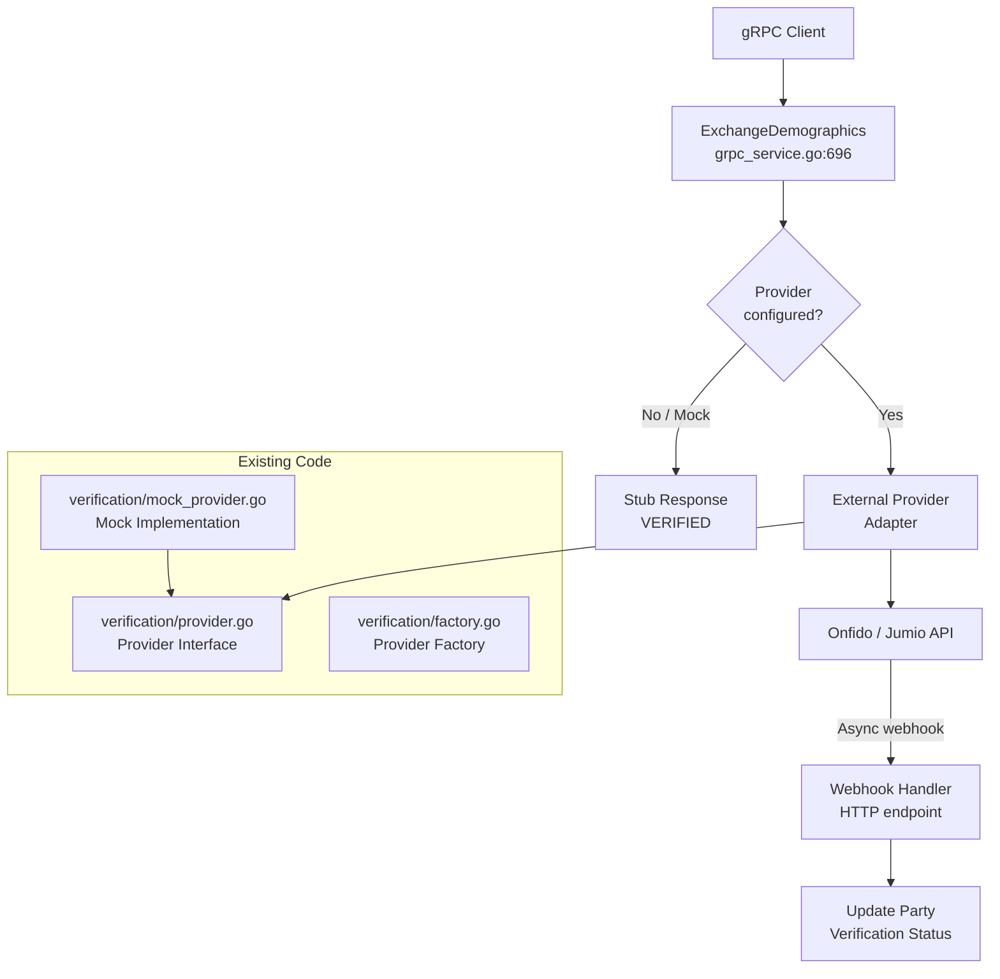
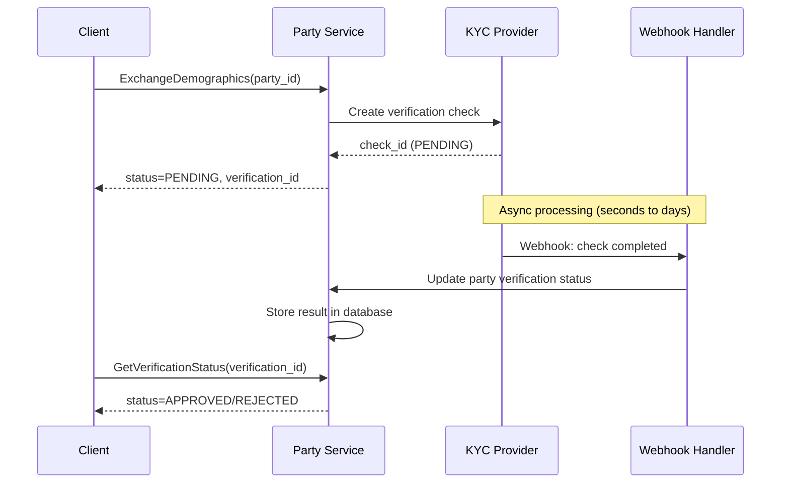

# PRD: Party Service - KYC/AML Provider Integration

**Status:** Draft
**Version:** 1.0
**Date:** 2026-02-10
**Author:** Architecture Team
**Task Master Tag:** TBD

**ADRs:**

- [0002 - Microservices Per BIAN Domain](../adr/0002-microservices-per-bian-domain.md)
- [0015 - Standard Service Directory Structure](../adr/0015-standard-service-directory-structure.md)

**Related PRDs:**

- [Reconciliation gRPC Wiring](017-reconciliation-grpc-wiring.md) -
  Appendix: Cross-Service Unimplemented RPC Audit (source of this work)

---

## Problem Statement

The `ExchangeDemographics` RPC in the party service returns
`codes.Unimplemented` in production environments without an external KYC/AML
provider:

<!-- markdownlint-disable MD013 -->

| Handler | File | Line |
|---------|------|------|
| `ExchangeDemographics` | `service/grpc_service.go` | 711-713 |

<!-- markdownlint-enable MD013 -->

**Condition:** `ENVIRONMENT=production` AND `KYC_STUB_ENABLED != true`

**Error:** "KYC/AML verification not implemented - cannot operate in production
without external provider integration"

**Severity:** Medium - By design. This is an intentional production safety guard, not a bug.

### Current Behaviour Matrix

| Environment | `KYC_STUB_ENABLED` | Behaviour |
|-------------|-------------------|----------|
| production | unset / false | `codes.Unimplemented` - refuses to auto-approve |
| production | true | Returns VERIFIED (stub) with warning log |
| non-production | any | Returns VERIFIED (stub) |

The guard ensures Meridian cannot operate in production with auto-approved verifications, which would be a regulatory violation.

---

## Root Cause Analysis

### What Exists

**1. Provider Interface** (`verification/provider.go`):

```go
type Provider interface {
    VerifyIdentity(ctx context.Context, party *domain.Party) (Result, error)
    CheckSanctions(ctx context.Context, party *domain.Party) (SanctionsResult, error)
    GetVerificationStatus(ctx context.Context, verificationID string) (Result, error)
}
```

The `Result` type supports:

- `Status`: PENDING, APPROVED, REJECTED, MANUAL_REVIEW
- `RiskScore`: 0.0 to 1.0
- `VerificationID`: Unique ID for async tracking
- `Metadata`: Provider-specific key-value data

The `SanctionsResult` type supports:

- `Status`: CLEAR, MATCH, PENDING, ERROR
- `Matches`: List of `SanctionsMatch` with list name, matched name, confidence score

**2. Mock Provider** (`verification/mock_provider.go`):

Full implementation supporting:

- Synchronous mode (immediate approve/reject)
- Asynchronous mode (returns PENDING, resolves on subsequent status check)
- Configurable simulated delay
- Deterministic verification IDs for test reproducibility
- Sanctions screening simulation

**3. Factory** (`verification/factory.go`):

```go
func NewProvider(cfg *config.VerificationConfig) (Provider, error) {
    switch provider {
    case "mock":
        return NewMockProvider().WithAlwaysApprove(true), nil
    case "jumio":
        return nil, ErrUnsupportedProvider  // Stub
    case "onfido":
        return nil, ErrUnsupportedProvider  // Stub
    default:
        return nil, ErrUnsupportedProvider
    }
}
```

**4. Handler** (`service/grpc_service.go:696-746`):

The `ExchangeDemographics` handler currently:

1. Validates party exists
2. Checks production safety guard (environment + KYC_STUB_ENABLED)
3. Returns hardcoded "VERIFIED" status

The handler does NOT use the `Provider` interface. It bypasses the verification
framework entirely with a hardcoded stub response.

### What is Missing

1. **External provider adapter**: No implementation of `Provider` for Onfido, Jumio, or any real KYC service
2. **Handler-to-provider wiring**: `ExchangeDemographics` does not call `Provider.VerifyIdentity()`
3. **Vendor selection**: No vendor has been chosen for production KYC/AML
4. **Webhook handling**: External providers use async webhooks for verification results; no webhook endpoint exists
5. **Credential management**: No configuration for provider API keys, webhook secrets, etc.

---

## Technical Design

### Architecture



### Provider Adapter Design

A real KYC provider adapter must implement the `Provider` interface:

```go
// verification/onfido_provider.go (example)
type OnfidoProvider struct {
    apiKey    string
    baseURL   string
    client    *http.Client
    logger    *slog.Logger
}

func (p *OnfidoProvider) VerifyIdentity(ctx context.Context, party *domain.Party) (Result, error) {
    // 1. Create applicant in Onfido
    // 2. Create identity check
    // 3. Return PENDING with verification ID
    // 4. Onfido will call our webhook when complete
}

func (p *OnfidoProvider) CheckSanctions(ctx context.Context, party *domain.Party) (SanctionsResult, error) {
    // 1. Submit watchlist screening request
    // 2. Return immediate result (synchronous check)
}

func (p *OnfidoProvider) GetVerificationStatus(ctx context.Context, verificationID string) (Result, error) {
    // 1. Query Onfido check status
    // 2. Map to Result type
}
```

### Webhook Handling

External KYC providers operate asynchronously. The verification flow is:



#### Webhook Implementation Concerns

The webhook handler (KYC-003) must address:

- **Signature verification**: Validate webhook authenticity using
  `KYC_WEBHOOK_SECRET` (HMAC-SHA256 or provider-specific scheme)
- **Idempotency**: Detect and ignore duplicate webhook deliveries using
  the provider's event ID as deduplication key
- **Correlation**: Map webhook payload `check_id` back to the party
  record using the `verification_id` stored during initiation
- **Timeout handling**: Background job to poll for stuck verifications
  that never received a webhook (configurable timeout, e.g., 24 hours)
- **Out-of-order delivery**: Use status FSM to handle webhooks arriving
  in unexpected order (e.g., ignore "in_progress" after "completed")

### Handler Refactoring

The `ExchangeDemographics` handler needs to be refactored to use the `Provider`
interface instead of hardcoded stub logic:

<!-- markdownlint-disable MD013 -->

```go
func (s *Service) ExchangeDemographics(ctx context.Context, req *pb.ExchangeDemographicsRequest) (*pb.ExchangeDemographicsResponse, error) {
    // 1. Validate party exists (already implemented)
    // 2. Call s.verificationProvider.VerifyIdentity(ctx, party)
    // 3. Call s.verificationProvider.CheckSanctions(ctx, party)
    // 4. Map Result to ExchangeDemographicsResponse
    // 5. Return verification status (PENDING for async, VERIFIED for sync)
}
```

<!-- markdownlint-enable MD013 -->

### Configuration

```yaml
# Environment variables for KYC provider configuration
KYC_PROVIDER: "onfido"              # Provider name (mock, onfido, jumio)
KYC_API_KEY: "live_xxxxx"           # Provider API key (from secret)
KYC_WEBHOOK_SECRET: "whsec_xxxxx"  # Webhook signature verification
KYC_BASE_URL: "https://api.onfido.com/v3.6"  # Provider API base URL
```

### Files to Create

| File | Description |
|------|-------------|
| `services/party/verification/<provider>_provider.go` | Provider adapter (e.g., `onfido_provider.go`) |
| `services/party/verification/<provider>_provider_test.go` | Unit tests with recorded HTTP responses |
| `services/party/service/webhook_handler.go` | HTTP webhook endpoint for async verification results |
| `services/party/config/verification.go` | (may need extension for provider-specific config) |

### Files to Modify

| File | Change |
|------|--------|
| `services/party/verification/factory.go` | Add real provider to factory switch statement |
| `services/party/service/grpc_service.go` | Refactor `ExchangeDemographics` to use `Provider` interface |
| `services/party/cmd/main.go` | Wire provider from config, add webhook HTTP handler |

---

## Implementation Tasks

| Task ID | Description | Story Points |
|---------|-------------|-------------|
| KYC-001 | Select KYC/AML vendor (Onfido, Jumio, or alternative) | 0 (decision) |
| KYC-002 | Implement provider adapter for selected vendor | 3 |
| KYC-003 | Implement webhook handler for async verification results | 2 |
| KYC-004 | Refactor `ExchangeDemographics` handler to use `Provider` interface | 1 |
| KYC-005 | Wire provider in `cmd/main.go` and factory | 1 |
| KYC-006 | Write unit tests with recorded HTTP responses | 2 |
| KYC-007 | Write integration tests (mock provider with async mode) | 1 |

### Story Point Summary

| Scope | Tasks | Story Points |
|-------|-------|-------------|
| Core implementation | KYC-002 through KYC-005 | 5 |
| Test coverage | KYC-006 through KYC-007 | 3 |
| **Grand total** | | **8** |

KYC-001 (vendor selection) is a decision gate with no story points that must
be resolved before implementation begins.

---

## Vendor Evaluation Criteria

The vendor selection (KYC-001) should consider:

| Criteria | Weight | Notes |
|----------|--------|-------|
| API quality and documentation | High | RESTful, well-documented, sandbox environment |
| Webhook support | Required | Async verification results must be delivered via webhook |
| Sanctions screening | Required | Must support global watchlist screening |
| Geographic coverage | High | UK/EU compliance (GDPR, PSD2, AML5D) |
| Pricing | Medium | Per-check pricing model |
| SDK availability | Low | Go SDK preferred but HTTP client is sufficient |

### Candidate Providers

| Provider | Strengths | Considerations |
|----------|-----------|----------------|
| **Onfido** | Strong identity verification, good EU coverage, well-documented API | Higher per-check cost |
| **Jumio** | Document + biometric verification, good compliance coverage | More complex integration |
| **Sumsub** | All-in-one compliance platform, flexible pricing | Less established in UK market |
| **Sardine** | Fraud + KYC combined, real-time risk scoring | Newer entrant |

---

## Testing Strategy

### Unit Tests

- Test provider adapter with recorded HTTP responses (no live API calls)
- Test webhook signature verification
- Test `Result` and `SanctionsResult` validation
- Test factory creates correct provider type

### Integration Tests

- Use `MockProvider` with `AsyncMode=true` to simulate full async flow
- Test webhook handler receives and processes verification callbacks
- Test party status transitions through verification lifecycle

### End-to-End Tests

- Test full party onboarding flow: register party, initiate verification, receive webhook, verify status
- Use provider sandbox environment for staging tests

---

## Success Criteria

- [ ] `ExchangeDemographics` in production does not return `codes.Unimplemented` when provider is configured
- [ ] Verification results are persisted and retrievable via `GetVerificationStatus`
- [ ] Sanctions screening returns CLEAR/MATCH with confidence scores
- [ ] Webhook handler processes async verification results correctly
- [ ] Mock provider continues to work in development/test environments
- [ ] Production safety guard remains active when no provider is configured

---

## Rollout Plan

1. **Vendor selection**: Choose KYC provider based on evaluation criteria
2. **Sandbox integration**: Implement and test against provider sandbox
3. **Staging deployment**: Deploy with real provider credentials in staging
4. **Production rollout**: Enable for production with gradual traffic shift
5. **Monitor**: Track verification latency, approval rate, sanctions match rate

### Rollback Strategy

If the external provider is unavailable or experiencing issues:

- Set `KYC_STUB_ENABLED=true` temporarily to allow party onboarding
- Log all stub verifications for manual review when provider recovers
- This maintains the production safety guard principle (explicit opt-in to stub mode)

---

## Risk Assessment

- **Medium risk**: External provider dependency introduces a new failure mode for party onboarding
- **Regulatory requirement**: Cannot ship production without real KYC/AML (this is the reason for the Unimplemented guard)
- **Vendor lock-in**: The `Provider` interface abstracts the provider, making vendor switching straightforward
- **Async complexity**: Webhook-based verification adds state management complexity (pending verifications, timeout handling)
- **Data privacy**: KYC data (identity documents, biometrics) must be handled per GDPR requirements; consider data residency

---

## Design Decisions

| # | Decision | Resolution | Rationale |
|---|----------|-----------|-----------|
| 1 | Vendor selection | **Deferred** | Requires business input on budget and compliance requirements |
| 2 | Sync vs async verification | **Async** | Real KYC checks take seconds to days; sync would block party onboarding |
| 3 | Store verification results locally? | **Yes** | Party service needs verification status for account opening decisions |
| 4 | Webhook vs polling for results? | **Webhook** | Lower latency, less infrastructure cost than polling |
| 5 | Remove production guard after implementation? | **No** | Keep guard as fallback; only remove the Unimplemented response when provider is configured |

<!-- End of PRD -->
