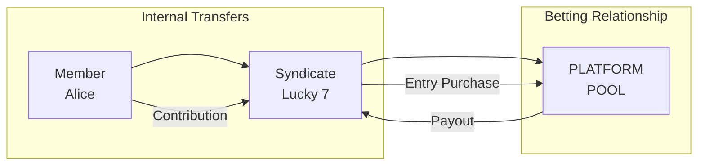

# PRD: Multi-Party Resource Pooling (BIAN Syndicate Pattern)

**Status:** Draft
**Version:** 1.5
**Date:** 2026-02-13
**Author:** Architecture Team
**Task Master Tag:** `org-scoped-accounts`

**ADRs:**

- [0002 - Microservices Per BIAN Domain](../adr/0002-microservices-per-bian-domain.md)
- [0013 - Universal Quantity Type System](../adr/0013-generic-asset-quantity-types.md)
- [0028 - Starlark Saga Orchestration with CEL Valuation](../adr/0028-starlark-saga-cel-valuation.md)

**Related PRDs:**

- [Internal Account](./002-internal-account.md)
- [Starlark Saga Orchestration](./006-starlark-saga-orchestration-core.md)

---

## Table of Contents

- [BIAN Mapping & Terminology](#bian-mapping--terminology)
- [Executive Summary](#executive-summary)
- [Problem Statement](#problem-statement)
- [Solution Architecture](#solution-architecture)
- [Data Model Specification](#data-model-specification)
- [Saga Integration (Fulfillment Pattern)](#saga-integration-fulfillment-pattern)
- [Implementation Tasks](#implementation-tasks)
- [Appendix A: Syndicate Use Cases](#appendix-a-syndicate-use-cases)
- [Appendix B: Parimutuel Betting Regulatory Context](#appendix-b-parimutuel-betting-regulatory-context)
- [Appendix C: UKGC 2026 Transparency Mapping](#appendix-c-ukgc-2026-transparency-mapping)

---

## BIAN Mapping & Terminology

This feature implements the **Syndicated Loan** and
**Collateral Allocation Management** patterns to handle multi-party pooling.

| Meridian Concept | BIAN Service Domain | BIAN Description |
|---|---|---|
| Org-Scoped Account | Business Unit Management | Account scoped to an org unit while owned by a party |
| Syndicate / Club | Syndicate Management | Parties pooling resources for a shared financial purpose |
| Member | Participant | A party involved in the syndicate arrangement |
| Distribution Logic | Collateral Allocation | Logic determining asset/liability splits among participants |
| Association Metadata | Structuring | Configuration of syndicate terms (share %, voting rights) |
| Distribution Saga | Fulfillment | Execution of the allocation rules |

---

## Executive Summary

This PRD extends Meridian to support **Consortium Financial Management**.
By implementing BIAN's **Syndicate Pattern**, we enable accounts to be owned
by one Party (the Participant) while being operationally scoped to an
Organisation (the Syndicate).

### Core Capabilities

1. **Normalised Scoping:** Explicit `org_party_id` on accounts to track
   "Participant balance *within* Syndicate."
2. **Governance Metadata:** Enhanced `PartyAssociation` to store
   "Structuring" data (equity share, roles).
3. **Dynamic Incentivization:** CEL valuation policies and Starlark
   Sagas that read Governance Metadata to execute Collateral Allocation
   with dynamic fee adjustment (see ADR-0028).

---

## Problem Statement

### The "Commingling" Gap

In a standard ledger, if Alice transfers £100 to an "Investment Club"
account, the money moves:

`DR Alice Personal` -> `CR Investment Club Pool`

**The Issue:** The ledger loses the link between Alice and that specific £100.

1. We know the Club has £100.
2. We know Alice *sent* £100 (via transaction history).
3. We **do not** have a live balance record stating
   "Alice owns £100 of the Club's equity."

### The "Rigid Cost" Gap

Even when member positions are tracked correctly, platform fees remain
static. A syndicate with 50 active members pays the same rate as a
solo user. This creates a perverse incentive: syndicates that drive
the most volume receive no cost benefit for doing so.

Dynamic platforms solve this with **volume-based fee tiers**, but
hard-coding tiers into application logic creates maintenance burden
and prevents tenant-level customisation. CEL valuation policies
(ADR-0028) allow fee rules to be expressed as evaluable expressions
that respond to syndicate metrics at runtime.

### Why this fails BIAN compliance

BIAN **Position Keeping** requires accurate tracking of all positions.
Relying on re-calculating transaction history or storing balances in
metadata fields violates the **Single Source of Truth** principle
for balances.

---

## Solution Architecture

### 1. Business Unit Scoping (The "Sub-Facility" Model)

We treat the Syndicate as a **Business Unit** or **Legal Entity** context.
Accounts can now carry this context.

**Account Structure:**

- **Owner (`party_id`):** The legal owner of the funds (e.g., Alice).
- **Scope (`org_party_id`):** The Syndicate context (e.g., Venture Alpha).
- **Instrument:** The asset being tracked (GBP, USD, VCU-2024).

### 2. Structuring via Associations

We extend the Party Service to act as the **Syndicate Assembly** engine.

- **Relationship:** Defines the link (e.g., `SYNDICATE_PARTICIPANT`).
- **Metadata:** Defines the rules (e.g., `{ "allocation_share": 0.25 }`).

### 3. Fulfillment via Sagas

Distribution Sagas (Collateral Allocation) read the Metadata to determine
splits, then execute transfers to the Scoped Accounts.

### 4. Dynamic Fee Adjustment via CEL Policies (FR-3.3)

Per ADR-0028, fee calculations can be expressed as CEL valuation
policies rather than hard-coded application logic. This enables
tenant-configurable pricing that responds to syndicate metrics.

**Example CEL policy (stored in valuation service):**

```cel
// Tiered platform fee based on active syndicate member count
member_count <= 5  ? base_fee :
member_count <= 20 ? base_fee * 0.85 :
member_count <= 50 ? base_fee * 0.70 :
                     base_fee * 0.55
```

**Integration point:** Sagas call `run_policy(policy_id, context)` to
evaluate fee rules at distribution time. The context map includes
syndicate metrics (member count, total pool size, activity period)
drawn from Party Association data.

This solves the "Rigid Cost Gap": syndicates that drive volume
receive proportional fee reductions, configured per-tenant without
code deployment.

---

## Data Model Specification

### 1. Current Account (Expansion)

*Reflects BIAN Account instances within a Business Unit.*

> **Note:** The database table is `account` (not `current_account`).
> The service name is "current-account" but the table was created
> as `account` in the initial migration.
>
> **CockroachDB:** Column addition and index creation MUST be in
> separate migration files. CockroachDB requires the column to be
> committed ("public") before partial indexes can reference it.

#### Migration 1: Add column

```sql
-- services/current-account/migrations/20260214000001_add_org_party_id.sql
ALTER TABLE account ADD COLUMN org_party_id UUID NULL;
```

#### Migration 2: Add indexes (separate file)

```sql
-- services/current-account/migrations/20260214000002_add_org_scoping_indexes.sql

-- NFR-1 Support: "Show me Alice's position in Venture Alpha"
CREATE INDEX idx_account_participant_syndicate
ON account (party_id, org_party_id)
WHERE org_party_id IS NOT NULL;

-- NFR-2 Support: "Show me all participants in Venture Alpha"
CREATE INDEX idx_account_syndicate_participants
ON account (org_party_id)
WHERE org_party_id IS NOT NULL;

-- Integrity: One account per person per syndicate per currency
CREATE UNIQUE INDEX idx_account_syndicate_scope_integrity
ON account (party_id, org_party_id, currency)
WHERE org_party_id IS NOT NULL;
```

> **Design Decision: Personal account uniqueness.**
> Currently, a party MAY hold multiple accounts of the same currency
> (no uniqueness constraint on `party_id + currency`). Adding a
> constraint for non-scoped accounts (`WHERE org_party_id IS NULL`)
> would be a new business rule. This PRD intentionally does NOT add
> that constraint to avoid breaking existing behaviour.
> Syndicate-scoped accounts enforce one-per-party-per-org-per-currency;
> personal accounts retain their current flexibility.

### 2. Internal Account (Expansion)

*Allows Syndicates to hold their own P&L accounts.*

> **Architecture Note:** Internal accounts use schema-per-tenant
> isolation (`org_{tenant_id}` schema routing). The `org_party_id`
> here represents a *sub-organisation within a tenant* (e.g., a
> syndicate within a betting platform tenant), not the tenant itself.
> Tenant isolation remains at the schema level.
>
> **CockroachDB:** Split into separate migration files as above.

#### Migration 1: Add column

```sql
-- services/internal-account/migrations/20260214000001_add_org_party_id.sql
ALTER TABLE internal_account ADD COLUMN org_party_id UUID NULL;
```

*Validation Rule (application-layer):* Org-Scoped internal accounts
CANNOT have `account_type` of `CLEARING`. Enforced in Go domain model,
not via database trigger (CockroachDB does not support PL/pgSQL
triggers in UDFs).

### 3. Party Association (Enhancement)

*Implements BIAN Syndicate Assembly & Structuring.*

> **CockroachDB:** Column additions, backfill, and partial indexes
> must be in separate migration files.

#### Migration 1: Add columns

```sql
-- services/party/migrations/20260214000001_enhance_party_association.sql
ALTER TABLE party_association ADD COLUMN metadata JSONB NULL DEFAULT '{}'::jsonb;
ALTER TABLE party_association
  ADD COLUMN status VARCHAR(20) NOT NULL DEFAULT 'ACTIVE';
ALTER TABLE party_association
  ADD COLUMN effective_from TIMESTAMPTZ NOT NULL DEFAULT now();
ALTER TABLE party_association ADD COLUMN effective_to TIMESTAMPTZ NULL;
```

#### Migration 2: Add constraints and indexes (separate file)

```sql
-- services/party/migrations/20260214000002_party_association_constraints.sql
ALTER TABLE party_association
ADD CONSTRAINT chk_party_association_status
CHECK (status IN ('ACTIVE', 'SUSPENDED', 'TERMINATED'));

ALTER TABLE party_association
ADD CONSTRAINT chk_party_association_validity_range
CHECK (effective_to IS NULL OR effective_to > effective_from);

CREATE INDEX idx_party_association_status
ON party_association (status)
WHERE status = 'ACTIVE';
```

#### Proto update

```protobuf
// api/proto/meridian/party/v1/party.proto

enum RelationshipType {
  // ... existing types (0-5, includes BENEFICIAL_OWNER at 5)
  RELATIONSHIP_TYPE_SYNDICATE_PARTICIPANT = 6; // BIAN: Participant
  RELATIONSHIP_TYPE_SYNDICATE_HOST = 7;        // BIAN: Lead/Arranger
}

message PartyAssociation {
  string id = 1;
  string related_party_id = 2;
  RelationshipType relationship_type = 3;

  // BIAN Structuring Data (e.g., allocation rules)
  google.protobuf.Struct metadata = 4;

  // BIAN Arrangement Lifecycle
  AssociationStatus status = 5;
  google.protobuf.Timestamp effective_from = 6;
  google.protobuf.Timestamp effective_to = 7;
}
```

> **Note:** `BENEFICIAL_OWNER` already exists at value 5 in the
> current proto. Only `SYNDICATE_PARTICIPANT` (6) and
> `SYNDICATE_HOST` (7) are new additions.

---

## Saga Integration (Fulfillment Pattern)

The Saga runtime acts as the **Collateral Allocation Management**
engine. It requires access to the **Structuring** data stored in
Party Associations.

### New Starlark Handlers

#### `party.get_structuring_data`

Retrieves the metadata for a specific relationship.

```python
# Starlark
structuring = party.get_structuring_data(
    party_id="alice-uuid",
    org_id="venture-alpha-uuid",
    relationship_type="SYNDICATE_PARTICIPANT"
)
# Returns: {"allocation_share": "0.25", "role": "LP"}
```

#### `party.list_participants`

Retrieves all active participants in a syndicate.

```python
# Starlark
participants = party.list_participants(
    org_id="venture-alpha-uuid",
    relationship_type="SYNDICATE_PARTICIPANT"
)
# Returns list of {party_id, metadata} dicts
```

### Account Resolution for Org-Scoped Accounts

The existing `resolve_account(reference)` builtin resolves account IDs
from a single string reference via the Reference Data service (with
bi-temporal lookup cache for deterministic replay).

For org-scoped accounts, we extend the reference convention rather
than changing the function signature:

```python
# Starlark - resolve using composite reference
# Reference format: "party:<party_id>:org:<org_id>:currency:<code>"
account_id = resolve_account(
    "party:alice-uuid:org:venture-alpha-uuid:currency:GBP"
)
```

The Reference Data service's `ResolveAccount` implementation will be
extended to parse this composite reference format and query the
`account` table with the appropriate `party_id`, `org_party_id`,
and `currency` filters.

> **Alternative:** A new dedicated handler
> `current_account.resolve_scoped_account(party_id, org_id, currency)`
> could provide a more explicit API. Decision deferred to implementation.
>
> **Implementation notes:** Whichever approach is chosen, ensure:
> (a) a builtin helper constructs references to avoid manual string
> concatenation in sagas, (b) malformed references produce clear
> errors, and (c) existing single-segment references continue to
> work (backward compatibility).

### Example: Dividend Distribution Saga

```python
# sagas/syndicate/distribution.star

# BIAN Pattern: Collateral Allocation Management

def distribute_yield(ctx):
    total_yield = Decimal(input.amount)

    # 1. Retrieve Participants (Syndicate Assembly)
    participants = party.list_participants(
        org_id=ctx.org_id,
        relationship_type="SYNDICATE_PARTICIPANT"
    )

    postings = []

    # 2. Calculate Allocation (Structuring)
    for p in participants:
        data = party.get_structuring_data(
            party_id=p.party_id,
            org_id=ctx.org_id,
            relationship_type="SYNDICATE_PARTICIPANT"
        )
        share = Decimal(data["allocation_share"])

        allocation = total_yield * share

        # 3. Resolve Scoped Account (Position Keeping)
        # Finds "Alice's account scoped to Venture Alpha"
        ref = (
            "party:" + p.party_id
            + ":org:" + ctx.org_id
            + ":currency:GBP"
        )
        account_id = resolve_account(ref)

        postings.append(posting(
            account_id=account_id,
            amount=allocation,
            direction="CREDIT",
            description="Dividend Distribution"
        ))

    return postings
```

### Example: Viral Fee Discount Saga

Demonstrates dynamic fee calculation using CEL policies. When a
syndicate grows, its platform fee decreases, incentivizing member
recruitment.

```python
# sagas/syndicate/viral_fee.star

def apply_syndicate_fee(ctx):
    """Calculate and apply platform fee with syndicate discount."""

    participants = party.list_participants(
        org_id=ctx.org_id,
        relationship_type="SYNDICATE_PARTICIPANT"
    )

    # CEL policy evaluates fee based on syndicate size
    fee_result = run_policy(
        policy_id="syndicate_platform_fee",
        context={
            "member_count": len(participants),
            "pool_size": ctx.pool_amount,
            "base_fee": Decimal("5.00"),
        }
    )

    adjusted_fee = Decimal(fee_result["value"])

    pool_ref = (
        "party:" + ctx.org_id
        + ":org:" + ctx.org_id
        + ":currency:GBP"
    )
    pool_account = resolve_account(pool_ref)

    return [
        posting(
            account_id=pool_account,
            amount=adjusted_fee,
            direction="DEBIT",
            description="Platform Fee (syndicate discount applied)"
        ),
        posting(
            account_id=ctx.platform_fee_account,
            amount=adjusted_fee,
            direction="CREDIT",
            description="Platform Fee Revenue"
        ),
    ]
```

---

## Implementation Tasks

### Stream 1: Core Data Models (3 SP)

- [ ] DB Migration 1a: Add `org_party_id` to `account` table.
- [ ] DB Migration 1b: Add indexes for org-scoped queries (separate file).
- [ ] DB Migration 2a: Add `org_party_id` to `internal_account`
  table.
- [ ] DB Migration 2b: Add indexes for org-scoped queries on
  `internal_account` (separate file).
- [ ] DB Migration 3a: Add `metadata`, `status`, `effective_from`,
  `effective_to` to `party_association`.
- [ ] DB Migration 3b: Add constraints and indexes for party
  association (separate file).
- [ ] Proto: Update `Party`, `CurrentAccount`, `InternalAccount`
  definitions.

### Stream 2: Service Logic (5 SP)

- [ ] Party Service: Implement validation for Metadata JSONB.
- [ ] Current Account: Update `InitiateAccount` to handle scoping
  and enforce syndicate uniqueness.
- [ ] Current Account: Update domain model and entity with
  `OrgPartyID` field.
- [ ] Internal Account: Add application-layer validation
  preventing Org-Scoped accounts from being CLEARING accounts.

### Stream 3: Saga Infrastructure (5 SP)

- [ ] Handler: Implement `party.list_participants` in
  `services/party/client/starlark.go`.
- [ ] Handler: Implement `party.get_structuring_data`.
- [ ] Handler: Extend Reference Data `ResolveAccount` to support
  composite reference format for org-scoped lookups.

### Stream 4: Verification (3 SP)

- [ ] Integration Test: Create Syndicate, Add Members, Run
  Distribution Saga.
- [ ] Performance Test: Validate `idx_account_participant_syndicate`
  performance with 10k accounts.

**Total: 16 SP.** Streams 1 and 3 can run in parallel (no dependency).
Stream 2 depends on Stream 1. Stream 4 depends on all.

---

## Appendix A: Syndicate Use Cases

### A. Investment Club (Asset Pooling)

**Scenario:** 4 partners pool money to buy 1000 Carbon Credits
(TONNE_CO2E).

1. **Origination:** Syndicate created. Partners defined with 25%
   share in metadata.
2. **Contribution:** Partners transfer GBP to their Scoped Accounts.
3. **Purchase:** Saga debits Scoped Accounts (GBP), Credits Syndicate
   Inventory (TONNE_CO2E).
   - *Result:* Partners hold 0 GBP, Syndicate holds 1000 Assets.
4. **Allocation:** Saga credits Partners' Scoped Accounts (TONNE_CO2E)
   based on share.
   - *Result:* Each Partner holds 250 TONNE_CO2E *within* the
     Syndicate context.

### B. Gig Economy Fleet (Revenue Split)

**Scenario:** A Fleet Owner manages 100 Drivers.

1. **Revenue:** Platform pays Fleet £10,000.
2. **Structuring:** Each Driver has a `commission_rate` (e.g., 80%)
   in association metadata.
3. **Fulfillment:** Saga iterates drivers, calculates 80% split,
   credits Driver Scoped Account.
4. **Payout:** Drivers withdraw from Scoped Account to Personal
   Bank Account.

### C. Parimutuel Betting Syndicate (Initial Driver)

**Scenario:** "Lucky 7" Syndicate pools funds for a specific sports
event (e.g., The Grand National).

*This represents the primary use case driving the Org-Scoped Account
architecture.*

**Structure:**

- **Syndicate:** "Lucky 7" (Party Type: ORG)
- **Members:** Alice (Lead, 50% share), Bob (25%), Charlie (25%)
- **Accounts:** Each member has a `GBP` account scoped to `Lucky 7`.

**Lifecycle:**

1. **Contribution (Funding):**
   - Alice transfers £50 from her Personal Wallet to
     `ALICE_LUCKY7_GBP`.
   - Bob and Charlie transfer £25 each to their respective
     scoped accounts.
   - *State:* The Syndicate has £100 purchasing power, fully
     attributed to members.

2. **Bet Placement (Commitment):**
   - Syndicate Lead (Alice) initiates a bet on "Red Rum".
   - **Saga:** Debits £50 from `ALICE_LUCKY7_GBP`, £25 from
     `BOB...`, £25 from `CHARLIE...`.
   - **Saga:** Credits `LUCKY7_POOL` (Internal Holding Account)
     with £100.
   - **Saga:** Transfers £100 from `LUCKY7_POOL` to the Platform's
     Global Pool (External Settlement).

3. **Winnings (Distribution):**
   - "Red Rum" wins. Platform pays £500 to `LUCKY7_POOL`.
   - **Distribution Saga:** Reads Member Metadata (shares).
   - Credits `ALICE_LUCKY7_GBP`: £250.
   - Credits `BOB_LUCKY7_GBP`: £125.
   - Credits `CHARLIE_LUCKY7_GBP`: £125.

**Why this matters:**

This ensures strict segregation of funds. Even though Lucky 7 acts as
a single entity to the outside world (the Betting Platform), internally,
Meridian maintains a perfect, auditable ledger of exactly how much of
the syndicate's balance belongs to Alice vs Bob vs Charlie at every
second.

---

## Appendix B: Parimutuel Betting Regulatory Context

*This appendix provides UK-specific regulatory context for the betting
syndicate use case.*

### UK Gambling Act 2005 Classification

Under **Section 12 of the Gambling Act 2005**, parimutuel betting is
classified as **pool betting**:

> *"Betting is pool betting if made on terms that all or part of
> winnings shall be determined by reference to the aggregate of
> stakes paid... [and] shall be divided among the winners"*

### Required Licence

**Remote Pool Betting Operating Licence** from the UK Gambling
Commission.

| Fee Category | GGY Threshold | Application Fee | Annual Fee |
|---|---|---|---|
| F1 | < £1.5 million | £938 | £2,406 |
| G1 | £1.5m - £3m | £1,414 | £16,053 |
| G2 | £3m - £7.5m | £1,414 | £19,054 |

**Personal Management Licences (PMLs):** £370 per key staff member.
Required for specified management roles (financial planning,
compliance, IT security).

The F1 tier provides a viable runway to test and grow the business.

### Pool Betting Model Classification

Per UKGC guidance, this model is **Model B - Actual Co-mingling**:

> *"The customer's funds would be directly entered into the Pool,
> thereby affecting the Pool dividend. The licensed operator and
> the Pool would each be required to hold a pool betting operating
> licence."*

### Syndicate Design: Staying Within Pool Betting

**Critical Design Constraint:** Syndicates must be structured as
**collective entries into the platform's pool**, NOT as bets between
syndicate members.



The betting relationship is always **Syndicate <-> Platform Pool**,
never **Member <-> Member**.

This is precisely why Meridian's org-scoped accounts matter: member
contributions and distributions are **internal transfers** (not bets),
while the syndicate's interaction with the platform pool is the
**betting relationship**.

### Compliance Requirements

| Requirement | Meridian Support |
|---|---|
| AML/KYC | Party service stores verification status; Stripe handles identity |
| Responsible Gambling | Account limits via CEL policies; self-exclusion via account status |
| Fair & Transparent | Bi-temporal audit trail; Market Data Service for verifiable results |
| Protect Vulnerable | Spending limits; cooling-off periods via saga rules |

### Recommended Next Step

Before committing to licence application, contact the Gambling
Commission at <info@gamblingcommission.gov.uk> with the exact model
description. Key question: *"Does our parimutuel sports platform with
syndicate pooling require just a Remote Pool Betting licence, or also
a Remote Betting Intermediary licence?"*

---

## Success Criteria

- [ ] NFR-1: "My Positions" query < 20ms p99.
- [ ] Auditability: Full trace of Funds -> Syndicate -> Member
  Allocation.
- [ ] Flexibility: Distribution logic changes via Starlark
  (no code deploy).
- [ ] Dynamic Pricing: CEL policy evaluation completes < 5ms p99.

---

## Appendix C: UKGC 2026 Transparency Mapping

*Maps Meridian capabilities to the UKGC's anticipated 2026
transparency requirements for online gambling operators.*

The Gambling Commission's evolving framework emphasizes
**real-time transparency** and **auditable fund segregation**.
Meridian's architecture maps directly to these requirements.

| UKGC Requirement | Meridian Feature |
|---|---|
| Real-time fund segregation visibility | Org-scoped accounts with bi-temporal audit trail |
| Individual player balance attribution | `party_id + org_party_id` scoping on `account` table |
| Fee transparency and disclosure | CEL valuation policies with audit log of evaluated rules |
| Anti-money laundering trail | Immutable saga execution log with full posting lineage |
| Syndicate/pool structure disclosure | Party Association metadata (publicly queryable per member) |
| Dispute resolution data | Bi-temporal queries reconstruct state at any point in time |

This mapping positions Meridian ahead of anticipated regulatory
changes, reducing compliance risk for operators adopting the
syndicate pattern.
