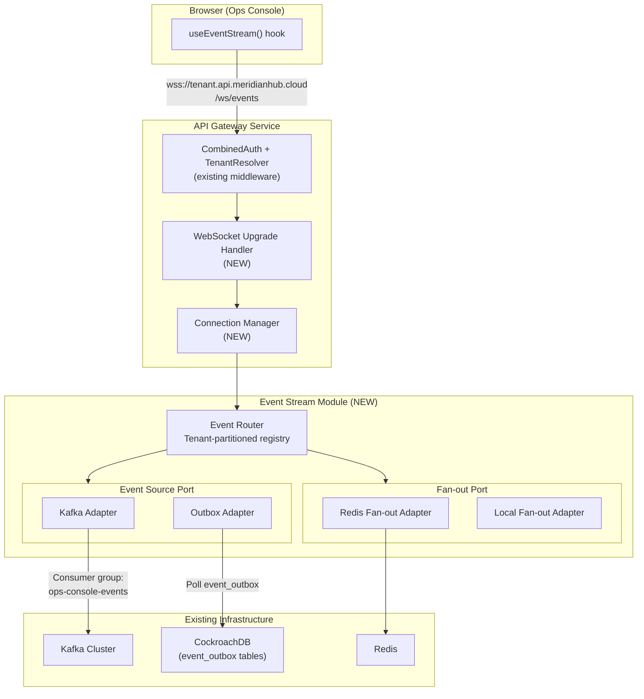
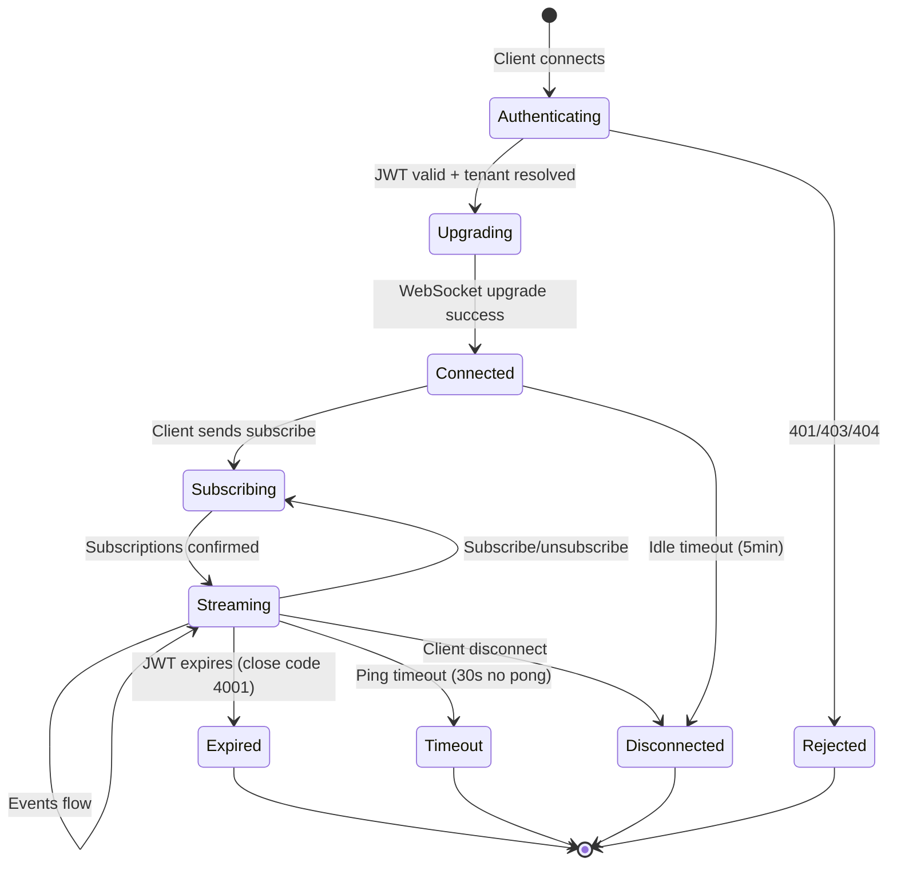

# PRD-025: Real-Time Event Streaming for Meridian Operations Console

**Author:** Meridian Platform Team
**Status:** Draft
**Date:** 2026-02-22

---

## 1. Problem Statement

Meridian is event-driven — Kafka carries domain events across all service
domains, the outbox pattern guarantees delivery, and every state transition
produces a traceable event. But today there is no way for a human operator
or external system to observe these events in real time without tailing
Kafka topics directly.

The planned Operations Console (React + TypeScript + shadcn/ui) requires a
backend capability that does not yet exist: a tenant-aware, authenticated,
filterable event stream delivered over a persistent connection to browser
clients.

Without this, the frontend is limited to polling REST endpoints —
introducing latency, wasted bandwidth, and inability to show live saga
progression, balance changes, or reconciliation status as they happen.

### Hexagonal Architecture Constraint

Meridian uses hexagonal (ports & adapters) architecture throughout.
This streaming capability must follow the same pattern:

- **Inbound port** (event source): An interface abstracting where events
  come from
- **Outbound port** (event delivery): An interface abstracting how events
  reach clients
- **Adapters**: Concrete implementations for Kafka, outbox polling, Redis
  fan-out, WebSocket delivery

Critically, Meridian supports builds with `KAFKA_ENABLED=false`. The event
streaming system must work in both Kafka and non-Kafka configurations,
using the outbox table as an alternative event source.

---

## 2. Goals

| # | Goal | Success Metric |
|---|------|----------------|
| G1 | Sub-second event delivery to browser | p95 < 500ms from publish to receipt |
| G2 | Zero new infrastructure dependencies | Uses existing Kafka, Gateway, Redis |
| G3 | Tenant isolation by default | Tenant A events never reach tenant B |
| G4 | Horizontal scalability | 100+ concurrent WS connections per instance |
| G5 | Graceful degradation | Falls back to REST polling if unavailable |
| G6 | Minimal blast radius | Failure does not affect gRPC/REST APIs |
| G7 | Works without Kafka | Outbox-based source when `KAFKA_ENABLED=false` |

### Non-Goals

- Full event sourcing replay from Kafka (operational stream, not replay)
- Replacing Kafka consumer groups for service-to-service communication
- Push notifications to mobile devices or external webhooks
- Sub-millisecond latency (ops console, not HFT)

---

## 3. Architecture Overview



### Key Architectural Decisions

**Hexagonal structure**: The event stream module defines two ports:

1. **`EventSource` port** — abstracts event ingestion
   - `KafkaEventSource`: Consumes from Kafka topics
     (when `KAFKA_ENABLED=true`)
   - `OutboxEventSource`: Polls `event_outbox` tables across services
     (when `KAFKA_ENABLED=false`)

2. **`FanOut` port** — abstracts cross-instance event distribution
   - `RedisFanOut`: Uses Redis Pub/Sub for multi-instance deployments
   - `LocalFanOut`: In-process channel for single-instance or dev mode

This means a developer running Meridian locally with
`KAFKA_ENABLED=false` still gets live event streaming via outbox polling.

---

## 4. Detailed Design

### 4.1 Transport: WebSocket over the Existing Gateway

| Criterion | WebSocket | SSE |
|-----------|-----------|-----|
| Bidirectional | Yes — subscription changes inline | No — server only |
| Subscription filtering | Same connection | Separate REST calls |
| Connection management | Native ping/pong keepalive | HTTP-level reconnect |
| Go ecosystem | `nhooyr.io/websocket` (context-aware) | `net/http` Flusher |
| Browser support | Universal | Universal |

WebSocket wins because the ops console needs bidirectional
communication: operators subscribe/unsubscribe to specific event
streams, apply filters, and request backfill — all over the same
connection.

**Endpoint:**

```http
GET /ws/events
Upgrade: websocket
Connection: Upgrade
Authorization: Bearer <jwt>
X-Tenant-Slug: acme  (LOCAL_DEV_MODE only)
```

The existing gateway middleware chain handles tenant resolution and JWT
validation before the WebSocket upgrade:
`CombinedAuthMiddleware` → `TenantResolverMiddleware` →
`TenantAuthzMiddleware`. The upgrade only proceeds for authenticated,
tenant-resolved requests.

**Gateway integration**: The gateway currently uses Go's `http.ServeMux`
with Go 1.22+ routing patterns. The WebSocket handler registers as
`GET /ws/events` alongside the existing `GET /api/` proxy routes.
Health endpoints (`/health`, `/ready`) remain unprotected.

### 4.2 Event Source Port (Hexagonal)

The core abstraction that decouples event ingestion from the streaming
system:

```go
// Port: Where events come from
type EventSource interface {
    // Start begins consuming events. Calls handler for each event.
    // Blocks until ctx is cancelled.
    Start(ctx context.Context, handler EventHandler) error
}

type EventHandler func(ctx context.Context, event DomainEvent) error

type DomainEvent struct {
    EventID       string
    EventType     string
    Topic         string
    AggregateID   string
    AggregateType string
    TenantID      string
    CorrelationID string
    CausationID   string
    Timestamp     time.Time
    Payload       []byte // JSON-encoded domain payload
}
```

**Adapter: KafkaEventSource** (`KAFKA_ENABLED=true`)

- Subscribes to all domain event topics with a dedicated consumer
  group (`ops-console-events`)
- Reads `x-tenant-id` from Kafka message headers (already set by all
  publishers via `PublishWithTenant`)
- Reads event metadata from standard Kafka headers: `event_id`,
  `event_type`, `aggregate_type`, `aggregate_id`, `correlation_id`,
  `causation_id`
- Deserializes protobuf payloads to JSON via `protojson`
- Independent consumer group — no impact on existing processing

**Adapter: OutboxEventSource** (`KAFKA_ENABLED=false`)

- Polls `event_outbox` tables across service databases
- Reads entries with `status = 'completed'` (already published to
  Kafka, or would have been)
- Tracks a high-water mark (last processed `created_at` + `id`)
  per table
- Poll interval: configurable, default 500ms
- Enables event streaming in dev environments without Kafka

### 4.3 Kafka Topics Consumed

These are the existing topics — no new topics needed:

```yaml
# Position Keeping events
- position-keeping.transaction-captured.v1
- position-keeping.transaction-amended.v1
- position-keeping.transaction-reconciled.v1
- position-keeping.transaction-posted.v1
- position-keeping.transaction-rejected.v1
- position-keeping.transaction-failed.v1
- position-keeping.transaction-cancelled.v1
- position-keeping.bulk-transaction-captured.v1
- position-keeping.opening-balance-recorded.v1

# Current Account events
- current-account.account-frozen.v1
- current-account.account-unfrozen.v1
- current-account.account-closed.v1

# Payment Order events (saga lifecycle)
- payment-order.initiated.v1
- payment-order.reserved.v1
- payment-order.executing.v1
- payment-order.completed.v1
- payment-order.failed.v1
- payment-order.cancelled.v1
- payment-order.reversed.v1

# Financial Accounting events
- financial-accounting.booking-log.controlled

# Reconciliation events
- reconciliation.run.started
- reconciliation.run.completed
- reconciliation.variance.detected
- reconciliation.position.lock.requested
- reconciliation.dispute.created
- reconciliation.dispute.resolved

# Market Information events
- meridian.market_information.v1.ObservationRecorded

# Audit events (per-service)
- audit.events.current-account
- audit.events.financial-accounting
- audit.events.position-keeping
- audit.events.payment-order
- audit.events.tenant
- audit.events.party
```

**Consumer group strategy**: The `ops-console-events` consumer group is
separate from all existing service consumers. It can be scaled
independently, and lag does not affect business operations.

**Note on topic naming inconsistency**: The codebase has evolved
organically, resulting in mixed naming conventions (some topics use
`.v1` suffix, reconciliation uses dots instead of hyphens,
market-information uses a fully-qualified protobuf-style name). The
event stream module normalizes these into a consistent channel
namespace for subscription purposes (see Section 4.4).

### 4.4 Subscription Protocol

Clients communicate subscription intent over the WebSocket connection
using JSON messages.

**Client → Server (Subscribe):**

```json
{
  "type": "subscribe",
  "id": "sub-1",
  "channels": ["payment-order.*", "current-account.*"],
  "filters": {
    "aggregate_id": "acc-12345",
    "correlation_id": "corr-67890"
  }
}
```

**Client → Server (Unsubscribe):**

```json
{
  "type": "unsubscribe",
  "id": "sub-1"
}
```

**Server → Client (Event):**

```json
{
  "type": "event",
  "subscription_id": "sub-1",
  "channel": "payment-order.reserved",
  "event": {
    "event_id": "evt-abc-123",
    "event_type": "payment_order.reserved.v1",
    "aggregate_id": "po-789",
    "aggregate_type": "PaymentOrder",
    "tenant_id": "tenant-uuid",
    "correlation_id": "corr-67890",
    "causation_id": "evt-parent",
    "timestamp": "2026-02-22T14:30:00Z",
    "payload": {
      "payment_order_id": "po-789",
      "debtor_account_id": "acc-12345",
      "lien_id": "lien-456",
      "amount": {
        "currency_code": "GBP",
        "units": 150,
        "nanos": 0
      }
    }
  }
}
```

**Server → Client (Subscription Confirmed):**

```json
{
  "type": "subscribed",
  "id": "sub-1",
  "channels": ["payment-order.*", "current-account.*"]
}
```

**Server → Client (Error):**

```json
{
  "type": "error",
  "id": "sub-1",
  "code": "INVALID_CHANNEL",
  "message": "Channel 'admin.*' is not available for your role"
}
```

**Channel namespace**: Topics are normalized into a consistent channel
namespace by stripping version suffixes and normalizing separators:

| Kafka Topic | Channel |
|-------------|---------|
| `payment-order.initiated.v1` | `payment-order.initiated` |
| `position-keeping.transaction-captured.v1` | `position-keeping.transaction-captured` |
| `reconciliation.run.started` | `reconciliation.run-started` |
| `audit.events.current-account` | `audit.current-account` |
| `meridian.market_information.v1.ObservationRecorded` | `market-information.observation-recorded` |

Channel patterns use glob-style matching:

- `payment-order.*` — all payment order events
- `position-keeping.transaction-*` — all PK transaction events
- `audit.*` — all audit events across services
- `reconciliation.*` — all reconciliation events
- `*` — firehose (all events for the tenant, requires admin role)

### 4.5 Tenant Isolation

Tenant isolation is enforced at three layers:

1. **Authentication**: JWT must contain a valid `tenant_id` claim
   (existing `x-tenant-id` claim, validated by
   `CombinedAuthMiddleware`). The WebSocket upgrade only proceeds
   for authenticated requests.

2. **Subscription Registration**: The tenant ID from the JWT is
   bound to the connection. The event router only evaluates events
   for delivery if `event.TenantID == connection.TenantID`.

3. **Event Source Filtering**: Every Kafka message carries an
   `x-tenant-id` header (set by `PublishWithTenant` in
   `shared/platform/kafka/producer.go`). Every outbox entry is
   scoped to a service database that is tenant-aware. The event
   source reads this tenant context during consumption and routes
   to the correct tenant bucket before evaluating channel filters.

```go
// Tenant-safe fan-out (pseudocode)
func (r *EventRouter) HandleEvent(event DomainEvent) {
    if event.TenantID == "" {
        r.metrics.IncDroppedNoTenant()
        return
    }

    connections := r.registry.GetConnectionsByTenant(
        event.TenantID,
    )
    for _, conn := range connections {
        for _, sub := range conn.Subscriptions() {
            if sub.MatchesChannel(event.Channel) &&
                sub.MatchesFilters(event) {
                conn.Send(event)
            }
        }
    }
}
```

### 4.6 Cross-Instance Fan-Out (FanOut Port)

When running multiple gateway instances behind a load balancer, an
event consumed by instance A needs to reach clients connected to
instance B.

```go
// Port: Cross-instance event distribution
type FanOut interface {
    // Publish sends an event to all instances with
    // subscribers for this tenant.
    Publish(
        ctx context.Context,
        tenantID string,
        event DomainEvent,
    ) error

    // Subscribe receives events for a tenant from other
    // instances. Blocks until ctx cancelled.
    Subscribe(
        ctx context.Context,
        tenantID string,
        handler EventHandler,
    ) error

    // Unsubscribe stops receiving events for a tenant
    // (when last connection disconnects).
    Unsubscribe(
        ctx context.Context,
        tenantID string,
    ) error
}
```

**Adapter: RedisFanOut** (multi-instance deployments)

- Redis channel naming: `meridian:events:{tenant_id}`
- Each gateway instance subscribes to Redis channels for tenants
  with active connections
- When a tenant's last connection disconnects, the instance
  unsubscribes
- Redis Pub/Sub is fire-and-forget (no persistence) — acceptable
  because the ops console is a live view; missed events during
  reconnect are covered by REST backfill
- Adds ~1ms latency, within p95 target

**Adapter: LocalFanOut** (single-instance / dev mode)

- In-process Go channels
- No external dependency
- Suitable for development and single-replica deployments

**Fallback**: If Redis is unavailable, each instance fans out only
events it consumes locally. Monitoring alerts on Redis connectivity.

### 4.7 Connection Lifecycle



- **Keepalive**: Server sends WebSocket ping frames every 30 seconds.
  No pong within 30 seconds → connection terminated.
- **JWT Expiry**: Checked every 60 seconds. Expired → close frame
  with code `4001` (Token Expired). Client re-authenticates and
  reconnects.
- **Backpressure**: Per-connection buffer of 256 messages. Buffer
  full → oldest messages dropped, client receives `dropped_events`
  notification with count. Client fetches current state via REST.

### 4.8 Authorization & Role-Based Channel Access

Channel access is controlled by JWT roles. These are new role
definitions to be added to the auth system:

| Role | Allowed Channels | Use Case |
|------|------------------|----------|
| `ops:admin` | `*` (all channels) | Platform operators |
| `ops:accounts` | `current-account.*`, `party.*`, `audit.party` | Account management |
| `ops:payments` | `payment-order.*`, `audit.payment-order` | Payment operations |
| `ops:finance` | `financial-accounting.*`, `position-keeping.*`, `reconciliation.*` | Finance / recon |
| `ops:audit` | `audit.*` | Compliance / audit |

These roles are carried in the JWT `roles` claim (already supported
by `CombinedAuthMiddleware` and the `MeridianClaims` struct in
`shared/platform/auth/jwt.go`). The subscription handler validates
channel access against the connection's roles before confirming a
subscription.

---

## 5. Package Structure

Following the hexagonal pattern used by existing services
(e.g., `current-account/adapters/`, `payment-order/adapters/`):

```text
services/gateway/
├── eventstream/
│   ├── ports.go              # EventSource, FanOut interfaces
│   ├── domain.go             # DomainEvent, Subscription, Channel
│   ├── router.go             # Tenant-partitioned registry
│   ├── router_test.go
│   ├── handler.go            # WebSocket upgrade + connection
│   ├── handler_test.go
│   ├── connection.go         # Per-connection state, buffer
│   ├── connection_test.go
│   ├── protocol.go           # JSON message types
│   ├── protocol_test.go
│   ├── channel.go            # Normalization + glob matching
│   └── channel_test.go
├── eventstream/adapters/
│   ├── kafka_source.go       # KafkaEventSource adapter
│   ├── kafka_source_test.go
│   ├── outbox_source.go      # OutboxEventSource adapter
│   ├── outbox_source_test.go
│   ├── redis_fanout.go       # RedisFanOut adapter
│   ├── redis_fanout_test.go
│   ├── local_fanout.go       # LocalFanOut adapter
│   └── local_fanout_test.go
```

### Wiring (in `cmd/main.go`)

```go
// Select event source based on configuration
var source eventstream.EventSource
if cfg.Kafka.Enabled {
    source = adapters.NewKafkaEventSource(
        kafkaClient, topicRegistry,
    )
} else {
    source = adapters.NewOutboxEventSource(
        dbPools, pollInterval,
    )
}

// Select fan-out based on configuration
var fanout eventstream.FanOut
if cfg.Redis.URL != "" {
    fanout = adapters.NewRedisFanOut(redisClient)
} else {
    fanout = adapters.NewLocalFanOut()
}

router := eventstream.NewRouter(
    source, fanout, logger, metrics,
)
wsHandler := eventstream.NewHandler(
    router, authMiddleware, logger,
)

mux.HandleFunc("GET /ws/events", wsHandler.ServeHTTP)
```

---

## 6. Implementation Plan

### Phase 1: Core WebSocket + Local Event Streaming

**Deliverables:**

- Port interfaces (`EventSource`, `FanOut`)
- `LocalFanOut` adapter (in-process channels)
- `OutboxEventSource` adapter (database polling — works without Kafka)
- WebSocket upgrade handler integrated into gateway `http.ServeMux`
- Connection manager with tenant-partitioned registry
- Subscription protocol (subscribe/unsubscribe/event messages)
- Channel normalization and glob matching
- Ping/pong keepalive and JWT expiry checking
- Unit tests for connection lifecycle, tenant isolation, channel
  matching

**Key decisions:**

- WebSocket library: `nhooyr.io/websocket` (context-aware,
  stdlib-compatible)
- No Kafka or Redis dependency in this phase
- Fully functional in `KAFKA_ENABLED=false` mode

### Phase 2: Kafka Event Source

**Deliverables:**

- `KafkaEventSource` adapter consuming all domain event topics
- Dedicated consumer group (`ops-console-events`)
- Tenant extraction from Kafka headers (`x-tenant-id`)
- Protobuf to JSON serialization via `protojson`
- Topic-to-channel normalization for inconsistent naming conventions
- Backpressure handling (buffer + drop policy)
- Metrics: events consumed, delivered, dropped, active connections

### Phase 3: Multi-Instance Scale-Out

**Deliverables:**

- `RedisFanOut` adapter using Redis Pub/Sub
- Dynamic Redis channel subscription based on active tenant
  connections
- Graceful fallback to `LocalFanOut` when Redis is unavailable
- Load testing: 100 concurrent connections, 1000 events/sec

### Phase 4: Observability & Hardening

**Deliverables:**

- OpenTelemetry spans for WebSocket connections and event delivery
  (integrates with existing `shared/platform/observability`)
- Structured logging with `slog` (consistent with codebase)
- Prometheus metrics:
  - `meridian_ws_connections_active` (gauge)
  - `meridian_ws_events_delivered_total` (counter)
  - `meridian_ws_events_dropped_total` (counter)
  - `meridian_ws_subscription_count` (gauge)
  - `meridian_ws_event_latency_seconds` (histogram)
- Health check endpoint for WebSocket subsystem
- Runbook for operations

---

## 7. Event Payload Format

Events delivered over WebSocket use a standardized envelope wrapping
the domain-specific payload:

```typescript
// TypeScript type (for frontend consumption)
interface StreamEvent {
  type: "event";
  subscription_id: string;
  channel: string; // normalized channel name
  event: {
    event_id: string; // UUID
    event_type: string; // e.g., "payment_order.reserved.v1"
    aggregate_id: string; // e.g., payment order ID
    aggregate_type: string; // e.g., "PaymentOrder"
    tenant_id: string;
    correlation_id: string; // cross-service tracing
    causation_id: string; // parent event
    timestamp: string; // ISO 8601
    payload: Record<string, unknown>; // domain data
  };
}
```

The `payload` field contains domain-specific event data,
JSON-serialized from protobuf definitions via `protojson`. Frontend
TypeScript types for each payload can be generated from the same
proto definitions used for gRPC services.

---

## 8. Client Library Contract

The frontend consumes this via a React hook:

```typescript
const { events, status, subscribe, unsubscribe } =
  useEventStream({
    channels: ["payment-order.*"],
    filters: { aggregate_id: "acc-12345" },
    onEvent: (event: StreamEvent) => {
      // Handle individual event
    },
    onConnectionChange: (
      status: "connected" | "reconnecting" | "disconnected",
    ) => {
      // Update UI connection indicator
    },
    reconnect: {
      enabled: true,
      maxDelay: 30_000,
      maxAttempts: 10,
    },
  });
```

**Client responsibilities:**

- Automatic reconnection with exponential backoff
- Re-subscribe to all active subscriptions after reconnect
- Fetch current state via REST after reconnect to fill gaps
- Display connection status indicator in the UI

**Server guarantees:**

- Events are delivered at-most-once over WebSocket (no redelivery)
- Events within a single aggregate are delivered in order (Kafka
  partition ordering / outbox `created_at` ordering)
- Cross-aggregate ordering is best-effort
- Close frame with reason code before intentional disconnection

---

## 9. Testing Strategy

Consistent with ADR-0008 (Defensive Testing Standards):

| Layer | What | How |
|-------|------|-----|
| Unit | Channel normalization + glob | Table-driven tests |
| Unit | Subscription filter engine | Property-based tests |
| Unit | Tenant isolation in registry | Verify no cross-tenant leak |
| Unit | Backpressure / buffer overflow | Simulate slow client |
| Unit | JWT expiry detection | Mock time, verify close frame |
| Integration | WS upgrade through gateway | `httptest.Server` + JWT |
| Integration | Outbox → Router → WS | CockroachDB testcontainer |
| Integration | Kafka → Router → WS | Embedded Kafka + WS client |
| Integration | Redis fan-out | Two instances, shared Redis |
| Load | 100 conns, 1000 events/sec | k6 WebSocket load test |

All integration tests use `testdb.SetupCockroachDB` for
database-backed tests and the `shared/platform/await` package
instead of `time.Sleep`.

---

## 10. Risks & Mitigations

| Risk | Impact | Mitigation |
|------|--------|------------|
| Kafka consumer lag → stale events | Medium | Monitor lag, alert >5s. Dedicated group. |
| WS connections exhaust memory | High | 256-msg buffer cap. Max 500 conns/instance. |
| Redis Pub/Sub message loss | Low | Live view only. REST backfill on reconnect. |
| JWT token replay on WS | Medium | Expiry checked every 60s. Close on expiry. |
| Noisy tenant floods events | Medium | Per-tenant rate limiting on fan-out. |
| Outbox polling latency (non-Kafka) | Low | 500ms poll acceptable for ops console. |
| Topic naming inconsistency | Medium | Normalization + table-driven tests. |

---

## 11. Dependencies on Existing Infrastructure

| Component | What We Use | Changes Needed |
|-----------|-------------|----------------|
| API Gateway | `http.ServeMux`, auth middleware | Add `GET /ws/events` route |
| Kafka | Domain topics, `x-tenant-id` headers | New consumer group only |
| CockroachDB | `event_outbox` tables | Read-only access (non-Kafka) |
| Redis | Pub/Sub channels | New Pub/Sub usage |
| JWT Auth | `MeridianClaims` (roles, tenant_id) | Add `ops:*` role defs |
| OpenTelemetry | Tracer via `shared/platform/observability` | New WS span kinds |
| Protobuf | Event defs, `protojson` marshalling | No changes |

No new infrastructure. No new databases. No new message brokers.

---

## 12. Success Criteria

| Criterion | Measurement | Target |
|-----------|-------------|--------|
| Latency (Kafka mode) | Publish → receipt p95 | < 500ms |
| Latency (outbox mode) | Insert → receipt p95 | < 1s |
| Connection stability | Mean time between disconnects | > 1 hour |
| Tenant isolation | Cross-tenant leakage in tests | 0 (zero) |
| Resource efficiency | Memory per idle connection | < 50KB |
| Throughput | Events/sec per instance | 5,000 |
| Recovery time | Reconnect + state sync | < 3 seconds |

---

## 13. Future Considerations (Out of Scope)

| Capability | When | Notes |
|------------|------|-------|
| Event replay / time-travel | Post-MVP | Kafka offset seek or event store |
| GraphQL subscriptions | If needed | Compatible WS transport |
| External webhook delivery | Separate PRD | At-least-once guarantees |
| Event stream to SIEM | Post-MVP | Kafka consumer → Splunk/Datadog |
| Mobile push notifications | Separate PRD | FCM/APNs integration |
| More current-account events | When implemented | Proto defs exist, not yet on Kafka |
