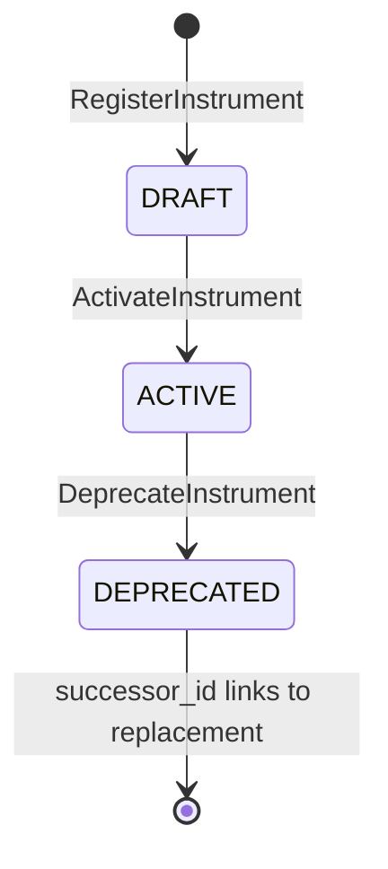
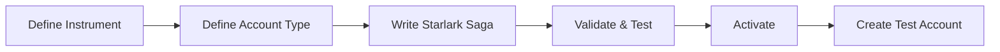

<!-- markdownlint-disable MD013 -->

# PRD-026: Meridian Operations Console UI

**Author:** Meridian Platform Team
**Status:** Draft
**Date:** 2026-02-22

---

## 1. Overview & Problem Statement

Meridian is a multi-tenant, multi-asset transaction integrity engine with 14 services, 60+ gRPC RPCs, and a rich event-driven architecture — but no human-operated interface. Platform operators and tenant administrators interact with the system exclusively through gRPC tooling, CLI commands, and direct database inspection.

The Operations Console is the first frontend for the Meridian platform. It provides:

- **Tenant administrators** with a purpose-built interface for managing accounts, transactions, payments, positions, ledger postings, parties, reconciliation, and Starlark saga configuration within their tenant
- **Platform administrators** with the same tenant-scoped views plus cross-tenant switching, tenant lifecycle management, platform Starlark defaults configuration, and system monitoring

This is a single React application serving two personas through role-based scoping, not two separate UIs.

### Why Now

Every service exposes gRPC endpoints with full Vanguard JSON transcoding. The API surface is stable, the gateway handles authentication and tenant resolution, and the Starlark saga system has a complete CRUD API. The backend is ready — the console is the missing operational layer.

---

## 2. Target Users & Personas

### Platform Administrator (Meridian Operator)

- **JWT claims:** `roles: ["platform-admin"]` or `roles: ["super-admin"]`, **no** `x-tenant-id` claim
- **Capabilities:** See all tenants, switch between tenants, manage platform Starlark defaults, provision/suspend tenants, view system health
- **Mental model:** "I operate the platform. I need to see any tenant's universe on demand, and manage platform-level configuration."

### Tenant Administrator (e.g., Acme Bank Operator)

- **JWT claims:** `roles: ["admin"]` or `roles: ["operator"]`, `x-tenant-id: "org_acme_uuid"`
- **Capabilities:** Manage their tenant's accounts, transactions, payments, positions, ledger, parties, reconciliation, and Starlark overrides
- **Mental model:** "This is my application. I manage my organization's financial operations."

### Tenant Auditor

- **JWT claims:** `roles: ["auditor"]`, `x-tenant-id: "org_acme_uuid"`
- **Capabilities:** Read-only access to all tenant-scoped data including audit logs
- **Mental model:** "I need to verify compliance and trace transactions."

### Role Hierarchy (from `shared/platform/auth/rbac.go`)

| Role | Account | Position | Transaction | Audit | System |
|------|---------|----------|-------------|-------|--------|
| admin | RWDX | RWDX | RWDX | RWDX | RWDX |
| operator | RWX | RWX | RWX | R | R |
| auditor | R | R | R | R | R |
| platform-admin | RWDX | RWDX | RWDX | RWDX | RWDX |
| super-admin | RWDX | RWDX | RWDX | RWDX | RWDX |

---

## 3. Architecture Decisions

### 3.1 Tech Stack (Locked In)

| Concern | Decision | Rationale |
|---------|----------|-----------|
| Framework | React 19 + TypeScript (strict mode) | Type safety, ecosystem |
| Components | shadcn/ui (copy-paste, Radix primitives) | AI-modifiable, no opaque deps |
| Styling | Tailwind CSS | Utility-first, consistent with shadcn |
| Build | Vite | Fast dev builds, ESM-native |
| Routing | React Router v7 (or TanStack Router) | File-based routing, type-safe |
| Data fetching | TanStack Query (React Query v5) | Server state management |
| Testing | Vitest + React Testing Library (jsdom) | Fast feedback, no browser |
| Real-time transport | WebSocket + protobuf binary frames | Defined in PRD-025 |
| Real-time pattern | WebSocket events invalidate React Query cache | Components are transport-agnostic |

### 3.2 API Client Strategy

**Decision: Connect-ES (`@connectrpc/connect-web`) with `buf generate`**

Rationale:

- Meridian's gateway uses Vanguard for gRPC-to-HTTP transcoding. Connect-ES is the official TypeScript client for Connect/gRPC-Web protocol, built by the same team (Buf) that Meridian already uses for proto management.
- `buf generate` produces fully typed TypeScript service clients directly from proto definitions — no manual types, no drift from backend contracts.
- The generated clients work with Vanguard's Connect protocol out of the box. Binary protobuf over HTTP/1.1 for performance, with JSON fallback for debugging.
- This preserves the proto-first philosophy: types are generated from `.proto` files, never hand-written.

**Alternative considered:** OpenAPI generation from proto annotations. Rejected because it adds an intermediate swagger spec layer, losing proto enum type safety and oneof discriminated unions. The `google.api.http` annotations are already used by Vanguard — Connect-ES connects to the same transcoding layer directly.

**Code generation setup:**

```yaml
# buf.gen.yaml (frontend)
version: v2
plugins:
  - local: protoc-gen-es
    out: src/api/gen
    opt: target=ts
  - local: protoc-gen-connect-es
    out: src/api/gen
    opt: target=ts
```

**Usage pattern:**

```typescript
import { createClient } from "@connectrpc/connect";
import { createConnectTransport } from "@connectrpc/connect-web";
import { CurrentAccountService } from "@/api/gen/meridian/current_account/v1/current_account_connect";

const transport = createConnectTransport({
  baseUrl: `https://${tenantSlug}.api.meridian.io`,
  // JWT injected via interceptor
});

const client = createClient(CurrentAccountService, transport);
const response = await client.retrieveCurrentAccount({ accountId: "..." });
// response is fully typed: RetrieveCurrentAccountResponse
```

### 3.3 Tenant Context Model

**Two-lens architecture** implemented through a single
`TenantContext` React context:

```text
Platform Admin Flow:
  1. Login → JWT has no x-tenant-id, has platform-admin role
  2. Shell renders TenantSelector in header
  3. Platform admin selects tenant (e.g., "Acme Bank")
  4. TenantContext stores selected tenant slug
  5. Connect transport configured with tenant slug as subdomain
  6. All API calls route through gateway as if tenant-scoped
  7. Switching tenant → clear all React Query caches → refetch

Tenant Admin Flow:
  1. Login → JWT has x-tenant-id claim, has admin/operator role
  2. Shell hides TenantSelector (not rendered)
  3. TenantContext extracts tenant from JWT (fixed)
  4. Connect transport uses fixed tenant subdomain
  5. No cross-tenant visibility
```

**How platform admin accesses tenant data:**

The gateway already handles this. A platform admin JWT (no `x-tenant-id` claim) can still reach tenant-scoped services by:

1. Using the tenant's subdomain (`acme.api.meridian.io`) — the gateway's `TenantResolverMiddleware` resolves the subdomain to tenant ID
2. The `TenantAuthorizationMiddleware` skips JWT tenant matching for platform-admin role (they are authorized for any tenant)
3. The downstream service receives the tenant context via `x-tenant-id` header

**Open item:** The current `TenantAuthorizationMiddleware` compares JWT `x-tenant-id` with resolved tenant and rejects mismatches. For platform admins (no `x-tenant-id` in JWT), this comparison is skipped when the role is `platform-admin` or `super-admin`. **Verify this skip logic exists in `combined_middleware.go` lines 195-271** — the codebase shows API keys bypass this check, but the platform-admin bypass for JWT needs confirmation.

If the bypass doesn't exist yet, the gateway needs a small change: when JWT has `platform-admin` or `super-admin` role and no `x-tenant-id` claim, skip the tenant authorization check but still inject the resolved tenant into context.

**Platform-level API calls** (tenant management, platform config):

The Tenant Service uses `PlatformAdminInterceptor` which requires:

- JWT with `platform-admin` or `super-admin` role
- JWT must NOT have `x-tenant-id` claim

These calls go to a fixed platform endpoint (no subdomain), not through tenant resolution.

### 3.4 Backend-for-Frontend Decision

**Decision: No BFF. The UI talks directly to the gateway.**

Rationale:

1. **All UI views map to existing RPCs.** The service inventory shows complete CRUD coverage for every domain entity. No aggregation queries span multiple services that aren't already handled by saga orchestration.
2. **The gateway already handles authentication, tenant resolution, and transcoding.** Adding a BFF would duplicate this middleware chain.
3. **A BFF would violate BIAN service boundaries** (ADR-0002). Each service owns its domain — a BFF that composes across services becomes a god service.
4. **Connect-ES can call multiple services from the browser.** If a dashboard page needs data from CurrentAccount + PositionKeeping + PaymentOrder, React Query fetches them in parallel with separate queries. This is the standard React Query pattern.

**Exception:** If a future dashboard requires aggregated metrics (e.g., "total accounts across all services"), that query should be added as an RPC on the appropriate service (or a new metrics service), not as a BFF aggregation layer.

### 3.5 Data Fetching Architecture

```text
┌─────────────────────────────────────────────────────────┐
│                    React Component                       │
│                                                         │
│  const { data } = useQuery({                            │
│    queryKey: ['accounts', tenantSlug, filters],          │
│    queryFn: () => client.listCurrentAccounts(filters),   │
│    staleTime: 30_000,  // 30s before refetch             │
│  });                                                     │
└─────────────────┬───────────────────────────────────────┘
                  │
                  ▼
┌─────────────────────────────────────────────────────────┐
│               TanStack Query Cache                       │
│                                                         │
│  Cache key: ['accounts', 'acme', { status: 'ACTIVE' }]  │
│  State: fresh | stale | fetching | error                 │
└─────────────────┬───────────────────────────────────────┘
                  │
                  ▼ (on cache miss or stale)
┌─────────────────────────────────────────────────────────┐
│           Connect-ES Transport (HTTP)                    │
│                                                         │
│  POST https://acme.api.meridian.io/                     │
│       meridian.current_account.v1.CurrentAccountService/ │
│       ListCurrentAccounts                                │
│  Headers: Authorization: Bearer <JWT>                    │
└─────────────────┬───────────────────────────────────────┘
                  │
                  ▼ (Vanguard transcodes to gRPC)
┌─────────────────────────────────────────────────────────┐
│              Gateway → Backend Service                   │
└─────────────────────────────────────────────────────────┘
```

**Real-time integration (Phase 3, per PRD-025):**

```text
WebSocket event arrives (e.g., AccountStatusChanged)
    ↓
useEventStream() hook receives event
    ↓
queryClient.invalidateQueries({
  queryKey: ['accounts', tenantSlug, { accountId }]
})
    ↓
React Query auto-refetches affected query
    ↓
Component re-renders with fresh data
```

Components are built identically whether WebSocket exists or not. No polling. No `setInterval`. React Query manages staleness via `staleTime` and `gcTime`.

**Query key convention:**

```typescript
// Pattern: [resource, tenantSlug, ...params]
['accounts', slug]                              // list all
['accounts', slug, { accountId: '123' }]        // single account
['accounts', slug, { status: 'ACTIVE', page: 2 }] // filtered list
['position-logs', slug, { accountId: '123' }]   // position logs for account
['booking-logs', slug]                           // all booking logs
['payment-orders', slug, { status: 'EXECUTING' }] // filtered payments
['tenants']                                       // platform-level (no slug)
['sagas', slug]                                   // tenant sagas
['sagas', 'platform']                             // platform saga defaults
```

Including `tenantSlug` in every query key means switching tenants invalidates all cached data automatically:

```typescript
queryClient.invalidateQueries({ queryKey: [undefined, previousSlug] });
// Or more precisely:
queryClient.removeQueries(); // Nuclear option on tenant switch
```

### 3.6 Authentication Flow

```text
1. User navigates to console.meridian.io
2. Redirect to identity provider (Keycloak, Auth0, etc.)
3. OAuth 2.0 PKCE flow → receive JWT access token + refresh token
4. Store tokens in memory (not localStorage — XSS risk)
5. Connect-ES interceptor attaches Authorization header to all requests
6. On 401 response → attempt token refresh
7. On refresh failure → redirect to login
```

**JWT structure** (from `shared/platform/auth/jwt.go`):

```json
{
  "user_id": "alice@acme.com",
  "x-tenant-id": "org_acme_uuid",    // absent for platform admins
  "roles": ["admin"],
  "scopes": ["read:accounts", "write:transactions"],
  "exp": 1724594400,
  "iss": "https://auth.example.com",
  "aud": "meridian-api"
}
```

**Role extraction for UI:**

```typescript
function getUserLens(claims: JWTClaims): 'platform' | 'tenant' {
  if (!claims.tenantId && (claims.roles.includes('platform-admin') || claims.roles.includes('super-admin'))) {
    return 'platform';
  }
  return 'tenant';
}
```

**Open item:** The identity provider (Keycloak, Auth0, etc.) is not specified. The console needs a `/login` redirect endpoint and JWKS URL for token validation. This is a deployment concern, not a UI architecture concern. The UI treats JWT as opaque except for claims extraction.

---

## 4. Page Map & Feature Specifications

### 4.1 Service Inventory → Page Mapping

The codebase contains 14 service directories. Here is how they map to UI pages:

| Service | UI Page(s) | Lens |
|---------|-----------|------|
| current-account | Accounts, Account Detail | Both |
| position-keeping | Positions | Both |
| financial-accounting | Ledger | Both |
| payment-order | Payments | Both |
| party | Parties | Both |
| reconciliation | Reconciliation | Both |
| reference-data (saga registry) | Starlark Config | Both (different views) |
| market-information | Market Data | Both |
| internal-bank-account | Internal Accounts | Both |
| forecasting | Forecasting | Both |
| tenant | Tenant Management | Platform only |
| gateway | (infrastructure, no UI) | — |
| control-plane | Platform Monitoring | Platform only |
| audit-worker | Audit Log | Both |
| utilization-metering-consumer | (background, no direct UI) | — |

### 4.2 Dashboard

**Lens:** Both (scoped to active tenant)

**Purpose:** At-a-glance summary of the active tenant's operational state.

**Layout:**

- **Stat cards row:** Total accounts (active/frozen/closed), open payment orders, pending reconciliations, recent events count (24h)
- **Recent activity feed:** Last 10 domain events (account created, payment completed, variance detected)
- **Quick actions:** Create account, initiate payment, run reconciliation

**RPCs consumed:**

- `CurrentAccountService.ListCurrentAccounts` (with status filter for counts — placeholder: may need a count-only endpoint or client-side count from paginated response)
- `PaymentOrderService.ListPaymentOrders` (status filter: INITIATED, EXECUTING)
- `ReconciliationService.ListReconciliationResults` (status filter: RUNNING)

**Aggregation concern:** Dashboard requires data from 3+ services. React Query fetches in parallel. No BFF needed — components render independently as each query resolves.

**Real-time candidates:** Event activity feed (Phase 3 WebSocket).

### 4.3 Accounts (Current Accounts)

**Lens:** Both

**Layout:**

- **List view:** DataTable with columns: Account ID, IBAN, Status, Base Currency, Customer Ref, Created. Filterable by status, searchable by ID/IBAN.
- **Detail view:** Account header (status badge, IBAN, currency) → Tabs: Overview, Transactions, Liens, Valuation, Audit Trail.
- **Actions:** Create account, deposit, initiate withdrawal, freeze/unfreeze/close (ControlCurrentAccount), create lien.

**RPCs consumed:**

- `CurrentAccountService.InitiateCurrentAccount`
- `CurrentAccountService.RetrieveCurrentAccount`
- `CurrentAccountService.ListCurrentAccounts` (paginated, via `page_token`)
- `CurrentAccountService.ExecuteDeposit`
- `CurrentAccountService.InitiateWithdrawal` / `ExecuteWithdrawal`
- `CurrentAccountService.ControlCurrentAccount` (action: SUSPEND, RESUME, TERMINATE)
- `CurrentAccountService.InitiateLien` / `ExecuteLien` / `TerminateLien` / `RetrieveLien`
- `CurrentAccountService.GetActiveAmountBlocks`
- `CurrentAccountService.CreateValuationFeature` / `ListValuationFeatures` / `EvaluateAssetValuation`

**Real-time candidates:** Account status changes, transaction completion, withdrawal status updates.

### 4.4 Internal Bank Accounts

**Lens:** Both

**Purpose:** Non-customer-facing accounts (CLEARING, NOSTRO, VOSTRO) used for settlement.

**Layout:** Same pattern as Current Accounts but for internal accounts. Separate page to avoid confusing customer accounts with internal accounts.

**RPCs consumed:**

- `InternalBankAccountService.InitiateInternalBankAccount`
- `InternalBankAccountService.RetrieveInternalBankAccount`
- `InternalBankAccountService.ListInternalBankAccounts`
- `InternalBankAccountService.GetBalance`
- `InternalBankAccountService.ControlInternalBankAccount`
- `InternalBankAccountService.InitiateLien` / `ExecuteLien` / `TerminateLien`
- `InternalBankAccountService.CreateValuationFeature` / `ListValuationFeatures` / `EvaluateAssetValuation`

### 4.5 Payments

**Lens:** Both

**Layout:**

- **List view:** DataTable with columns: Payment Order ID, Debtor Account, Creditor Ref (IBAN), Amount, Status, Created. Filterable by status.
- **Detail view:** Payment header (status badge, amount, saga state) → Tabs: Overview, Saga Steps, Audit Trail.
- **Saga visualization:** Timeline showing saga progression: INITIATED → RESERVED → EXECUTING → COMPLETED (or FAILED with compensation). Each step shows timestamp and outcome.
- **Actions:** Initiate payment, cancel payment, reverse payment (post-completion).

**RPCs consumed:**

- `PaymentOrderService.InitiatePaymentOrder`
- `PaymentOrderService.RetrievePaymentOrder`
- `PaymentOrderService.ListPaymentOrders`
- `PaymentOrderService.CancelPaymentOrder`
- `PaymentOrderService.ReversePaymentOrder`

**Real-time candidates:** Saga state transitions (high value — shows live payment progress).

### 4.6 Positions (Position Keeping)

**Lens:** Both

**Purpose:** Financial position logs with bi-temporal data quality support.

**Layout:**

- **List view:** DataTable with columns: Log ID, Account ID, Amount, Currency/Instrument, Direction (DEBIT/CREDIT), Status, Quality Level, Transaction Date. Filterable by account, direction, quality level.
- **Detail view:** Position log details with quality ladder indicator (ESTIMATE → COEFFICIENT → ACTUAL → REVISED). Balance view showing provisional vs available balance.
- **Measurement view:** Quality ladder visualization for a position — shows the progression from estimate to actual.
- **Actions:** Record position log, record measurement, record reservation, release reservation, get projected balance.

**RPCs consumed:**

- `PositionKeepingService.InitiateFinancialPositionLog`
- `PositionKeepingService.RetrieveFinancialPositionLog`
- `PositionKeepingService.ListFinancialPositionLogs`
- `PositionKeepingService.RecordMeasurement`
- `PositionKeepingService.GetAccountBalance` / `GetAccountBalances`
- `PositionKeepingService.RecordReservation` / `ReleaseReservation`
- `PositionKeepingService.GetProjectedBalance`
- `PositionKeepingService.BulkImportTransactions`

**Real-time candidates:** Balance updates, measurement quality transitions.

### 4.7 Ledger (Financial Accounting)

**Lens:** Both

**Purpose:** Double-entry bookkeeping — booking logs and ledger postings.

**Layout:**

- **List view:** DataTable of booking logs: Log ID, Account Type, Status (PENDING/POSTED/CLOSED), Base Currency, Business Unit, Posting Count. Filterable by status.
- **Detail view:** Booking log header → Postings table (posting ID, direction DEBIT/CREDIT, amount, account, value date, status). Visual balance indicator (total debits vs total credits).
- **Actions:** Create booking log, capture posting, post booking log, close booking log, control (suspend/resume/terminate).

**RPCs consumed:**

- `FinancialAccountingService.InitiateFinancialBookingLog`
- `FinancialAccountingService.RetrieveFinancialBookingLog`
- `FinancialAccountingService.ListFinancialBookingLogs`
- `FinancialAccountingService.CaptureLedgerPosting`
- `FinancialAccountingService.RetrieveLedgerPosting`
- `FinancialAccountingService.ListLedgerPostings`
- `FinancialAccountingService.ControlFinancialBookingLog`

**Real-time candidates:** Posting status changes, balance validation failures.

### 4.8 Parties

**Lens:** Both

**Purpose:** Party management — customer profiles, demographics, KYC/AML status.

**Layout:**

- **List view:** DataTable of parties with name, type (Individual/Organization), status, KYC status, risk score. Searchable by name/ID.
- **Detail view:** Party header → Tabs: Demographics, Addresses, Relationships, KYC/AML Status, Audit Trail.
- **Actions:** Register party, update demographics, trigger KYC verification.

**RPCs consumed:**

- `PartyService.RegisterParty`
- `PartyService.RetrieveParty`
- `PartyService.ListParties`
- `PartyService.UpdatePartyDemographics`
- `PartyService.InitiateVerification`
- `PartyService.RetrieveVerification`

**Real-time candidates:** KYC verification completion events.

### 4.9 Reconciliation

**Lens:** Both

**Purpose:** Settlement runs, variance detection, dispute resolution,
balance assertions.

**Layout:**

- **List view:** DataTable of reconciliation runs: Run ID, Account,
  Scope, Settlement Type, Status, Variance Count, Period.
  Filterable by status, scope, type.
- **Detail view:** Reconciliation header with tabs:
  Variances (expected vs actual, reason classification),
  Disputes (status, resolution), Balance Assertions.
- **Variance detail:** Side-by-side comparison of expected vs actual
  amounts with reason codes: `AMOUNT_MISMATCH`, `MISSING_ENTRY`,
  `DUPLICATE_ENTRY`, `TIMING_DIFFERENCE`, `CURRENCY_MISMATCH`,
  `DIRECTION_ERROR`, `QUALITY_UPGRADE`, `EXTERNAL_MISMATCH`,
  `CORRECTION_APPLIED`.
- **Dispute workflow:** Open, Resolved, Rejected flow with
  resolution notes.
- **Actions:** Initiate reconciliation, execute reconciliation,
  create/resolve dispute, assert balance (CEL expression).

#### Initiation Configuration

The initiation form exposes the configurable parameters:

| Parameter | Type | Description |
|-----------|------|-------------|
| Account ID | Select | Account to reconcile |
| Scope | Enum | ACCOUNT, INSTRUMENT, PORTFOLIO, FULL |
| Settlement Type | Enum | DAILY, WEEKLY, MONTHLY, ON_DEMAND |
| Period Start/End | DateTime | Reconciliation time window |
| Instrument Code | Select | Optional filter to specific asset |
| Attributes | Key-value | Free-form business metadata (max 50) |

#### Balance Assertions with CEL

The `AssertBalance` action accepts a **CEL expression** as the
assertion rule. The UI provides a `CELEditor` (Section 6.11) for
authoring these expressions with inline validation feedback.

```typescript
// Balance assertion form fields
interface AssertBalanceForm {
  accountId: string;
  instrumentCode: string;
  expression: string;       // CEL expression (e.g., "balance >= 0")
  expectedBalance: string;  // Decimal string for audit trail
}
```

The reconciliation service stores the CEL expression for audit
purposes. The actual assertion checks strict equality
(total debits == total credits). Future phases may evaluate the
CEL expression for custom tolerance rules.

#### Design Note: Variance Detection

Variance detection uses **strict equality** (zero vs non-zero).
There are no user-configurable tolerance thresholds — this is
intentional for financial integrity. The quality ladder
(ESTIMATE, COEFFICIENT, ACTUAL, REVISED) drives variance detection
when data quality improves between reconciliation runs.

Persistent imbalances trigger P1 alerts after 3 consecutive days
(hard-coded threshold in the reconciliation service).

**RPCs consumed:**

- `ReconciliationService.InitiateAccountReconciliation`
- `ReconciliationService.ExecuteAccountReconciliation`
- `ReconciliationService.RetrieveAccountReconciliation`
- `ReconciliationService.ControlAccountReconciliation`
- `ReconciliationService.ListReconciliationResults`
- `ReconciliationService.AssertBalance`
- `ReconciliationService.InitiateDispute`
- `ReconciliationService.ControlDispute`
- `ReconciliationService.RetrieveDispute`

**Real-time candidates:** Reconciliation run completion,
variance detection, dispute resolution.

### 4.10 Market Data

**Lens:** Both

**Purpose:** Market data management — datasets, data sources, time-series observations.

**Layout:**

- **Datasets list:** DataTable of datasets: Name, Asset Class, Status, Source Count, Last Observation.
- **Dataset detail:** Metadata → Tabs: Observations (time-series chart + table), Sources, Configuration.
- **Observation chart:** Time-series line chart (using a lightweight charting library like recharts or lightweight-charts) showing observation values over time.
- **Actions:** Register dataset, register data source, record observation, record batch observations.

**RPCs consumed:**

- `MarketInformationService.RegisterDataSet` / `UpdateDataSet` / `RetrieveDataSet` / `ListDataSets`
- `MarketInformationService.RegisterDataSource` / `UpdateDataSource` / `ListDataSources`
- `MarketInformationService.RecordObservation` / `RecordObservationBatch`
- `MarketInformationService.RetrieveObservation` / `ListObservations`

**Real-time candidates:** New observations (Phase 3).

### 4.11 Forecasting

**Lens:** Both

**Purpose:** Forward curve computation via Starlark strategies.

**Layout:**

- **Compute form:** Select instruments, base date, forward horizon. Execute computation.
- **Result view:** Forward curve chart (tenor vs forward price) + data table of curve nodes.

**RPCs consumed:**

- `ForecastingService.ComputeForwardCurve`

**Real-time candidates:** None (on-demand computation).

### 4.12 Audit Log

**Lens:** Both (scoped to active tenant)

**Purpose:** Browse immutable audit trail for compliance and debugging.

**Layout:**

- **List view:** DataTable of audit entries: Timestamp, Table, Operation (INSERT/UPDATE/DELETE), Record ID, Changed By. Filterable by table name, operation type, date range, user.
- **Detail view:** Side-by-side diff of old_values vs new_values (JSON diff viewer).

**Data source:** Audit Worker writes to `audit_log` table. Need a read-only RPC endpoint for querying audit logs.

**Open item:** No audit query RPC exists in the current proto definitions. The audit-worker consumes events and stores them, but there is no gRPC service for querying the stored audit log. **This needs to be added** — either as an `AuditService` with `ListAuditEntries` / `RetrieveAuditEntry` RPCs, or as a read path on an existing service.

**Real-time candidates:** Live audit feed (Phase 3 WebSocket — new audit entries appear in real time).

### 4.13 Starlark Configuration

**Lens:** Both (different views per role)

**Purpose:** Manage Starlark saga definitions — the configurable business logic layer.

#### Platform Admin View: Starlark Defaults

**Layout:**

- **List view:** DataTable of platform saga definitions: Name, Version, Status (DRAFT/ACTIVE/DEPRECATED), Display Name, Last Updated.
- **Detail view:** Saga metadata + StarlarkEditor showing the script. Validation status, complexity metrics.
- **Override indicator:** For each saga, show count of tenants with overrides.
- **Actions:** Create draft, edit draft script, validate, activate, deprecate (with successor).

**RPCs consumed:**

- `SagaRegistryService.ListSagas` (with platform context)
- `SagaRegistryService.CreateSagaDraft`
- `SagaRegistryService.UpdateSagaDefinition`
- `SagaRegistryService.ValidateSagaDraft` / `ValidateSaga`
- `SagaRegistryService.ActivateSaga`
- `SagaRegistryService.DeprecateSaga`
- `SagaRegistryService.AnalyzeDeprecationImpact`

#### Tenant Admin View: Starlark Overrides

**Layout:**

- **List view:** DataTable showing all saga names with columns: Name, Source (Platform Default / Custom Override), Status, Version.
- **Detail view:** Split pane — left shows platform default script (read-only, dimmed), right shows tenant's override script (editable). Clear visual distinction between "using default" and "custom override".
- **Actions:** Create override from default (copies script, marks as custom), edit override, validate, activate, revert to default (delete override).

**RPCs consumed:**

- `SagaRegistryService.ListSagas` (tenant context — returns tenant overrides + system defaults)
- `SagaRegistryService.GetActiveSaga` (shows `is_tenant_override` flag)
- `SagaRegistryService.CreateSagaDraft` (creates tenant override)
- `SagaRegistryService.UpdateSagaDefinition`
- `SagaRegistryService.ValidateSagaDraft` / `ValidateSaga`
- `SagaRegistryService.ActivateSaga`

**StarlarkEditor component:** Uses CodeMirror 6 with Starlark/Python syntax highlighting. CodeMirror chosen over Monaco because:

- Lighter bundle size (CodeMirror ~150KB vs Monaco ~3MB)
- Better mobile support
- Starlark is syntactically close to Python — Python mode works directly
- CodeMirror's extension system is composable and tree-shakeable

### 4.14 Tenant Management (Platform Admin Only)

**Lens:** Platform only

**Layout:**

- **List view:** DataTable of tenants: Tenant ID, Display Name, Slug, Settlement Asset, Status, Created. Filterable by status.
- **Detail view:** Tenant metadata → Tabs: Configuration (metadata JSON), Provisioning Status (per-service progress), Party Link.
- **Provisioning status:** Per-service progress bars/status badges showing migration versions and any errors. Uses `GetTenantProvisioningStatus` for granular per-service breakdown.
- **Actions:** Provision new tenant (InitiateTenant with async polling for completion), suspend, activate, deprovision. Reconcile migrations.

**RPCs consumed:**

- `TenantService.InitiateTenant`
- `TenantService.RetrieveTenant`
- `TenantService.ListTenants`
- `TenantService.UpdateTenantStatus`
- `TenantService.ReconcileMigrations`
- `TenantService.GetTenantProvisioningStatus`

**Provisioning UX:** When initiating a tenant:

1. Submit form → call `InitiateTenant`
2. Check `provisioning_hint` in response
3. If `"pending"` → show provisioning progress UI, poll `GetTenantProvisioningStatus` with exponential backoff (1s initial, 30s max)
4. Show per-service status (PENDING → IN_PROGRESS → COMPLETED/FAILED)
5. On completion → navigate to tenant detail

**Real-time candidates:** Provisioning progress (Phase 3 WebSocket).

### 4.15 Reference Data & Product Configuration

**Lens:** Both

**Purpose:** Define and manage the building blocks of the platform:
instruments (asset types), account types (behavioral templates),
and hierarchical reference data nodes. This is where operators
create new product types — not just manage instances.

**Note:** Saga definitions are managed under the Starlark
Configuration page (4.13), not here.

#### 4.15.1 Instruments

Instruments define the asset types the platform can track:
currencies (GBP, USD), energy (kWh), carbon credits
(TONNE_CO2E), compute (GPU_HOUR), etc.

**Layout:**

- **List view:** DataTable with columns: Code, Dimension,
  Precision, Status (DRAFT/ACTIVE/DEPRECATED), Display Name,
  Version. Filterable by status and dimension.
- **Detail view:** Instrument header with tabs:
  - **Definition:** Code, dimension, precision (0-18 decimals),
    display name, description
  - **CEL Expressions:** Three editable CEL fields with inline
    `CELEditor` (Section 6.11):
    - `validation_expression` — validates amounts
      (e.g., `amount > 0`)
    - `fungibility_key_expression` — groups fungible units
    - `error_message_expression` — custom error messages
  - **Attribute Schema:** JSON Schema editor for instrument
    metadata
  - **Lineage:** Version history with successor chain for
    deprecated instruments
- **CEL Playground:** Test button that calls `EvaluateInstrument`
  with sample data. Shows compile errors, validation result,
  fungibility key output, and error message output in real time.
- **Actions:** Create draft, edit draft, validate CEL expressions,
  activate (DRAFT to ACTIVE), deprecate (with successor).

**Lifecycle:**



**RPCs consumed:**

- `ReferenceDataService.RegisterInstrument`
- `ReferenceDataService.UpdateInstrument`
- `ReferenceDataService.RetrieveInstrument`
- `ReferenceDataService.ListInstruments`
- `ReferenceDataService.ActivateInstrument`
- `ReferenceDataService.DeprecateInstrument`
- `ReferenceDataService.EvaluateInstrument` (CEL playground)
- `ReferenceDataService.GetAttributeSchema`

**Dimension enum values:** CURRENCY, ENERGY, MASS, VOLUME, TIME,
COMPUTE, CARBON, DATA, COUNT.

#### 4.15.2 Account Types

Account types define behavioral templates: how accounts behave,
what instruments they hold, what validation rules apply, and what
saga handles their transactions.

**Layout:**

- **List view:** DataTable with columns: Code, Display Name,
  Behavior Class, Normal Balance, Instrument, Status, Version.
  Filterable by behavior class and status.
- **Detail view:** Account type header with tabs:
  - **Definition:** Code, display name, behavior class
    (CUSTOMER, CLEARING, NOSTRO, VOSTRO, HOLDING, SUSPENSE,
    REVENUE, EXPENSE, INVENTORY), normal balance (DEBIT/CREDIT),
    instrument code, default saga prefix
  - **CEL Policies:** Three editable CEL fields with inline
    `CELEditor`:
    - `validation_cel` — validates transactions against this
      account type (e.g., `amount > 0 && amount <= 1000000`)
    - `bucketing_cel` — determines how amounts are grouped
      (e.g., `instrument_code + ':' + attributes.batch_id`)
    - `eligibility_cel` — determines which parties can hold
      this account type
  - **Valuation Methods:** Linked valuation method templates
    for currency conversion (input instrument, method,
    parameters)
  - **Attribute Schema:** JSON Schema for account metadata
  - **Lineage:** Version history with successor chain
- **Validate button:** Calls `ValidateProductDefinition` which
  returns structured errors with field, error_code, message,
  line, column, and suggestions.
- **Actions:** Create draft, edit draft, validate, activate,
  deprecate (with successor).

**RPCs consumed:**

- `ReferenceDataService.CreateDraft` (AccountType)
- `ReferenceDataService.UpdateDefinition` (AccountType)
- `ReferenceDataService.GetDefinition`
- `ReferenceDataService.GetActiveDefinition`
- `ReferenceDataService.ListActive` (AccountType)
- `ReferenceDataService.ActivateAccountType`
- `ReferenceDataService.DeprecateAccountType`
- `ReferenceDataService.ValidateProductDefinition`

#### 4.15.3 Reference Data Nodes

Hierarchical reference data for region/zone/meter trees,
DNO/GSP/asset hierarchies, and market data correlation structures.

**Layout:**

- **Tree browser:** Collapsible tree view of nodes by type.
  Each node shows: type, attributes, validity period
  (valid_from/valid_to).
- **Node detail:** Attributes (key-value), temporal validity,
  resolution key (computed hierarchical path), version.
- **Temporal query:** "As-at" date picker for bi-temporal
  point-in-time queries. Slide the date to see what the
  hierarchy looked like at any past moment.
- **History view:** All temporal versions of a node, ordered
  newest first.
- **Actions:** Create node (with optional parent), update
  attributes, batch import (up to 1000 nodes).

**RPCs consumed:**

- `ReferenceDataService.CreateNode`
- `ReferenceDataService.UpdateNode`
- `ReferenceDataService.GetNode`
- `ReferenceDataService.GetChildren`
- `ReferenceDataService.GetAncestors`
- `ReferenceDataService.GetSubtree` (max depth 20)
- `ReferenceDataService.GetNodeAsAt` (bi-temporal query)
- `ReferenceDataService.GetNodeHistory`
- `ReferenceDataService.ImportNodes` (batch, max 1000)

**Real-time candidates:** Instrument activation, account type
changes.

### 4.16 Platform Monitoring (Platform Admin Only)

**Lens:** Platform only

**Layout:**

- **Service health grid:** Card per service showing health status (from gateway health checker or Control Plane).
- **Kafka consumer lag:** If observable (depends on control-plane metrics endpoints).
- **Event throughput:** Event count per topic per time window.

**Data source:** This depends on what the Control Plane and gateway expose. The gateway has a `/health` and `/ready` endpoint. If the Control Plane exposes service registry or metrics via gRPC, those RPCs would be consumed here.

**Open item:** What observability endpoints does the Control Plane
expose? Check `services/control-plane/` for any gRPC service
definitions or metrics endpoints. If none exist, this page may be
deferred until the Control Plane is more developed, or it can
start with basic gateway health.

### 4.17 Product Configuration Workflow

**Lens:** Both (platform admin creates defaults, tenant admin
creates overrides)

**Purpose:** End-to-end guided flow for creating a new product
type — the "AI-configurable" workflow that makes Meridian more
than a ledger.

**The workflow connects pages 4.13 (Starlark), 4.15 (Reference
Data), and 4.9 (Reconciliation) into a coherent authoring
experience.**

#### The Configuration Journey



**Step 1: Define the Instrument** (Reference Data page)

Create a new instrument definition with dimension, precision,
and CEL validation rules. Use the CEL Playground to test
expressions against sample data before saving.

Example: Creating a `GPU_HOUR` instrument with dimension
COMPUTE, precision 6, validation `amount > 0`.

**Step 2: Define the Account Type** (Reference Data page)

Create an account type that uses the new instrument. Set
behavior class, normal balance direction, CEL validation and
eligibility policies. Link valuation methods for cross-asset
conversion.

Example: Creating a `COMPUTE_INVENTORY` account type with
behavior class INVENTORY, normal balance DEBIT, instrument
`GPU_HOUR`.

**Step 3: Write the Starlark Saga** (Starlark Config page)

Write the business logic that handles transactions for this
product type. The StarlarkEditor (Section 6.8) provides:

- Handler autocomplete from the schema registry
- Type-safe parameter hints
- Real-time validation with line-level error annotations
- Complexity metrics (handler calls, estimated duration)

Example: A `compute_billing` saga that calls
`position_keeping.initiate_log()` with the GPU_HOUR
instrument.

**Step 4: Validate and Test** (Starlark Config page)

Call `ValidateSaga` for dry-run execution. Review:

- Compilation errors (syntax, undefined handlers, type
  mismatches)
- Complexity score (0-10 scale)
- Handler call count and estimated duration
- Reference validation (instruments and handlers exist)

**Step 5: Activate** (Both pages)

Activate the instrument, account type, and saga in sequence.
Each activation validates CEL expressions and locks the
definition (immutable after activation).

**Step 6: Test with Real Data** (Accounts page)

Create a test account using the new account type and run a
transaction through it to verify the full stack.

#### Implementation Approach

This workflow is **not a wizard** — it is a contextual guide
that connects existing pages. Each step links to the relevant
page with pre-filled context. A "Product Setup" checklist
component tracks progress across the steps:

```typescript
interface ProductSetupChecklist {
  instrumentCode: string | null;
  accountTypeCode: string | null;
  sagaName: string | null;
  allActivated: boolean;
  testAccountCreated: boolean;
}
```

The checklist persists in the browser's session storage and
appears as a collapsible panel on the relevant pages during
an active configuration session.

---

## 5. Real-Time Readiness

### 5.1 React Query Cache Invalidation Architecture

Every component uses React Query for data fetching. Real-time events (Phase 3, per PRD-025) integrate by invalidating specific query keys:

```typescript
// Event → Query Key mapping
const EVENT_QUERY_MAP: Record<string, (event: DomainEvent) => QueryKey[]> = {
  'AccountStatusChanged':    (e) => [['accounts', e.tenantSlug], ['accounts', e.tenantSlug, { accountId: e.accountId }]],
  'TransactionCompleted':    (e) => [['accounts', e.tenantSlug, { accountId: e.accountId }], ['position-logs', e.tenantSlug]],
  'PaymentOrderCompleted':   (e) => [['payment-orders', e.tenantSlug], ['payment-orders', e.tenantSlug, { paymentOrderId: e.paymentOrderId }]],
  'LedgerPostingCaptured':   (e) => [['booking-logs', e.tenantSlug]],
  'ReconciliationCompleted': (e) => [['reconciliations', e.tenantSlug]],
  'VarianceDetected':        (e) => [['reconciliations', e.tenantSlug, { reconciliationId: e.reconciliationId }]],
};
```

### 5.2 Event Stream Hook Interface

Contract for the `useEventStream` hook (implementation in PRD-025):

```typescript
interface UseEventStreamOptions {
  /** Event types to subscribe to */
  eventTypes?: string[];
  /** Called when event received */
  onEvent?: (event: DomainEvent) => void;
  /** Auto-invalidate React Query cache */
  autoInvalidate?: boolean;
}

function useEventStream(options?: UseEventStreamOptions): {
  connected: boolean;
  lastEvent: DomainEvent | null;
  error: Error | null;
};
```

Components never import WebSocket directly. They use `useEventStream` or rely on automatic React Query cache invalidation.

### 5.3 Real-Time-Aware Components

| Page | Component | Event Types | Priority |
|------|-----------|-------------|----------|
| Dashboard | Activity Feed | All domain events | High |
| Accounts | Status Badge | AccountStatusChanged, AccountFrozen/Unfrozen | High |
| Accounts | Balance Display | TransactionCompleted | High |
| Payments | Saga Timeline | PaymentOrder* events | High |
| Positions | Balance View | TransactionCaptured | Medium |
| Ledger | Posting Status | LedgerPostingPosted/Rejected | Medium |
| Reconciliation | Run Status | ReconciliationRun* | Medium |
| Tenant Mgmt | Provisioning | (future: provisioning events) | Low |
| Audit | Live Feed | AuditEvent | Medium |

---

## 6. Shared UI Components

### 6.1 AppShell

The outer layout that implements the two-lens model.

```text
┌──────────────────────────────────────────────────────────┐
│  [Logo]  Meridian Console    [TenantSelector?]  [User ▼] │
├──────────┬───────────────────────────────────────────────┤
│          │                                               │
│ Dashboard│              Page Content                     │
│ Accounts │                                               │
│ Internal │                                               │
│ Payments │                                               │
│ Positions│                                               │
│ Ledger   │                                               │
│ Parties  │                                               │
│ Recon    │                                               │
│ Mkt Data │                                               │
│ Forecast │                                               │
│ Starlark │                                               │
│ Audit    │                                               │
│ ──────── │  (Platform admin only below)                   │
│ Tenants  │                                               │
│ Platform │                                               │
│          │                                               │
└──────────┴───────────────────────────────────────────────┘
```

**Behavior:**

- Reads JWT claims on mount to determine lens (platform vs tenant)
- Platform admin: shows TenantSelector in header, shows Tenants/Platform nav items below separator
- Tenant admin: hides TenantSelector, hides platform nav items. Shell feels like a standalone app.
- Auditor: same as tenant admin but mutating actions are hidden/disabled per RBAC matrix.

### 6.2 TenantSelector

Platform admin only. A combobox/dropdown in the header that:

- Lists all tenants (calls `TenantService.ListTenants`)
- Shows currently selected tenant with display name and slug
- On selection change:
  1. Updates TenantContext
  2. Calls `queryClient.removeQueries()` to clear all cached data
  3. Reconfigures Connect transport base URL to new tenant subdomain
  4. All visible queries automatically refetch

### 6.3 MoneyDisplay

Renders monetary and instrument amounts with correct formatting.

```typescript
interface MoneyDisplayProps {
  amount: bigint | string;  // cents or decimal string
  currency: string;         // ISO 4217 or instrument code
  showSign?: boolean;       // +/- prefix for debits/credits
}
```

**Formatting rules** (from ADR-0013 universal quantity type):

- Fiat currencies: Use `Intl.NumberFormat` with ISO 4217 currency code. JPY = 0 decimals, GBP/USD = 2, BHD = 3.
- Non-fiat instruments (kWh, GPU_HOUR, TONNE_CO2E): Display with instrument-specific precision. Unit shown as suffix.
- Amounts stored as cents (int64) — divide by 10^precision for display.

### 6.4 StatusBadge

Renders status values with consistent color coding.

```typescript
type StatusVariant = 'success' | 'warning' | 'error' | 'info' | 'neutral';

const STATUS_MAP: Record<string, StatusVariant> = {
  // Account statuses
  ACTIVE: 'success', FROZEN: 'warning', CLOSED: 'neutral', SUSPENDED: 'error',
  // Payment order statuses
  INITIATED: 'info', RESERVED: 'info', EXECUTING: 'warning',
  COMPLETED: 'success', FAILED: 'error', CANCELLED: 'neutral', REVERSED: 'neutral',
  // Saga statuses
  DRAFT: 'neutral', DEPRECATED: 'warning',
  // Reconciliation statuses
  RUNNING: 'warning',
  // Tenant statuses
  PROVISIONING: 'info', PROVISIONING_PENDING: 'info',
  PROVISIONING_FAILED: 'error', DEPROVISIONED: 'neutral',
  // Position quality ladder
  ESTIMATE: 'warning', COEFFICIENT: 'info', ACTUAL: 'success', REVISED: 'info',
};
```

### 6.5 DataTable

Built on shadcn Table + React Query pagination.

```typescript
interface DataTableProps<T> {
  queryKey: QueryKey;
  queryFn: (params: { pageToken?: string; pageSize: number }) => Promise<{ items: T[]; nextPageToken?: string }>;
  columns: ColumnDef<T>[];
  pageSize?: number;        // default: 25
  filters?: FilterConfig[];
  searchable?: boolean;
  onRowClick?: (row: T) => void;
}
```

Uses cursor-based pagination (page tokens from protobuf responses), not offset-based.

### 6.6 TimeDisplay

Renders protobuf `Timestamp` with relative and absolute formats.

```typescript
interface TimeDisplayProps {
  timestamp: Timestamp;      // protobuf timestamp
  format?: 'relative' | 'absolute' | 'both';  // default: 'both'
  timezone?: string;         // IANA timezone, default: browser local
}

// Renders: "2 hours ago" with tooltip "2026-02-22 14:30:00 UTC"
```

### 6.7 AuditTrail

Reusable audit history component.

```typescript
interface AuditTrailProps {
  entityType: string;  // table name
  entityId: string;    // record ID
}
```

Fetches audit entries for a specific entity and displays them as a timeline. Each entry shows timestamp, operation, changed fields (diff), and actor.

**Dependency:** Requires the audit query RPC (open item from 4.12).

### 6.8 StarlarkEditor

Code editor for Starlark saga definitions with rich validation
feedback from the backend.

- **Library:** CodeMirror 6 with `@codemirror/lang-python`
  (Starlark is syntactically Python-compatible)
- **Features:** Syntax highlighting, line numbers, code folding,
  bracket matching, search/replace
- **Read-only mode:** For viewing platform defaults (dimmed
  background)
- **Diff mode:** Side-by-side comparison for tenant overrides
  vs platform defaults

#### Validation Error Display

The editor surfaces `ValidationError` responses from
`ValidateSaga` / `ValidateSagaDraft` with full detail:

```typescript
interface ValidationError {
  line: number;      // 1-indexed source line
  column: number;    // 1-indexed source column
  message: string;   // Human-readable description
  category: ErrorCategory;
  suggestion?: string; // Fix hint
}

type ErrorCategory =
  | 'SYNTAX'             // Starlark parse error
  | 'UNDEFINED_HANDLER'  // Handler not in schema registry
  | 'TYPE_MISMATCH'      // Wrong parameter types
  | 'RUNTIME'            // Script runtime error
  | 'TIMEOUT';           // Execution exceeded 5s limit
```

**Inline annotations:** Each error renders as a CodeMirror
diagnostic at the exact line/column. Errors are color-coded
by category (red for SYNTAX/RUNTIME, orange for TYPE_MISMATCH,
yellow for UNDEFINED_HANDLER). Hovering shows the message and
suggestion.

**Error panel:** Below the editor, a collapsible panel lists
all errors in a table: line, category, message, suggestion.
Clicking a row jumps the cursor to that location.

#### Complexity Metrics Panel

After validation, display `ComplexityMetrics` beside the editor:

| Metric | Display |
|--------|---------|
| Handler calls | Count badge (e.g., "7 handlers") |
| Operations | Count (loops, conditionals, assignments) |
| Est. duration | Milliseconds (e.g., "~70ms") |
| Complexity | Score 0-10 with color indicator |

Complexity score color: 0-3 green, 4-6 yellow, 7-10 red.

#### Handler Autocomplete

The editor provides autocompletion for handler calls using
the schema registry. When the user types a service module
name (e.g., `position_keeping.`), the editor suggests
available handlers with parameter signatures:

```text
position_keeping.initiate_log(
  position_id: string (required)
  amount: Decimal (required)
  direction: enum [DEBIT, CREDIT] (required)
  instrument_code: string
  ...
)
```

Handler metadata is fetched once on page load from a handler
schema endpoint (or embedded in the generated Connect-ES
client). The `HandlerReference` component (Section 6.12)
provides a browsable reference alongside the editor.

### 6.9 QualityLadderBadge

Visual indicator for position keeping quality levels.

```text
ESTIMATE → COEFFICIENT → ACTUAL → REVISED
  [○]         [◐]         [●]       [↻]
```

Each level has a distinct icon and color, showing the data provenance chain.

### 6.10 SagaTimeline

Visual timeline for payment order saga progression.

```text
INITIATED ─── RESERVED ─── EXECUTING ─── COMPLETED
    ●            ●             ◌              ○
  14:30        14:30         14:31
```

Shows each step with timestamp, status (completed/active/pending),
and expansion for error details on failure. Compensation steps
shown below the main timeline when saga rolls back.

### 6.11 CELEditor

Inline editor for CEL (Common Expression Language) expressions
used across instruments, account types, and balance assertions.

```typescript
interface CELEditorProps {
  /** The CEL expression string */
  value: string;
  onChange: (value: string) => void;
  /** CEL context type determines available variables */
  context: 'validation' | 'bucketKey' | 'eligibility' | 'value';
  /** Compile errors from backend */
  errors?: Array<{ message: string; line?: number }>;
  /** Read-only mode */
  readOnly?: boolean;
  /** Show variable reference panel */
  showVariables?: boolean;
}
```

**Available variables by context:**

| Context | Variables |
|---------|-----------|
| validation | `attributes`, `amount`, `valid_from`, `valid_to`, `source` |
| bucketKey | `attributes` |
| eligibility | `party` (type, status, external_reference_type), `attributes` |
| value | `attributes`, `amount`, `valid_from`, `valid_to`, `source` |

**Built-in functions:** `parse_iso_date()`, `parse_int()`,
`parse_decimal()`, `parse_bool()`, `bucket_key()`.

**Security constraints** (displayed as hints):

- Max expression length: 4,096 bytes
- Max nesting depth: 10 levels
- Cost limit: 10,000 evaluation units

**Implementation:** CodeMirror 6 with a minimal configuration
(single-line or few-line expressions, no code folding). The
variable reference panel shows available variables with types
as a sidebar tooltip.

**Playground mode:** For instruments, a "Test" button calls
`EvaluateInstrument` with user-provided sample data and shows:

- Compile errors (if any)
- Validation result (boolean)
- Fungibility key output (string)
- Error message output (string)

### 6.12 HandlerReference

Browsable reference panel for Starlark handler schemas, shown
alongside the StarlarkEditor.

```typescript
interface HandlerReferenceProps {
  /** Filter to specific service modules */
  filter?: string;
  /** Callback when handler name is clicked (insert into editor) */
  onInsert?: (handlerCall: string) => void;
}
```

**Layout:** Collapsible accordion grouped by service module:

```text
position_keeping
  ├─ initiate_log (params: position_id, amount, direction, ...)
  ├─ record_measurement (params: position_id, quality, ...)
  └─ get_balance (params: account_id)
financial_accounting
  ├─ initiate_booking_log (params: ...)
  └─ capture_posting (params: ...)
current_account
  ├─ initiate (params: ...)
  └─ execute_deposit (params: ...)
```

Each handler expands to show:

- Description
- Parameters with types, required flags, enum values
- Return fields with types
- Compensation handler (if defined)
- "Insert" button that generates a Starlark call template

**Data source:** Handler schema is loaded from the
`handlers.yaml` definitions via a schema endpoint or
embedded at build time during proto code generation.

---

## 7. Frontend Project Structure

```text
frontend/
├── buf.gen.yaml                    # Protobuf TypeScript code generation config
├── package.json
├── tsconfig.json
├── vite.config.ts
├── vitest.config.ts
├── tailwind.config.ts
├── index.html
├── public/
├── src/
│   ├── main.tsx                    # App entry point
│   ├── app.tsx                     # Router + providers
│   ├── api/
│   │   ├── gen/                    # buf generate output (gitignored)
│   │   │   └── meridian/
│   │   │       ├── current_account/v1/
│   │   │       ├── payment_order/v1/
│   │   │       ├── financial_accounting/v1/
│   │   │       ├── position_keeping/v1/
│   │   │       ├── party/v1/
│   │   │       ├── reconciliation/v1/
│   │   │       ├── market_information/v1/
│   │   │       ├── internal_bank_account/v1/
│   │   │       ├── forecasting/v1/
│   │   │       ├── saga/v1/
│   │   │       ├── tenant/v1/
│   │   │       └── events/v1/
│   │   ├── transport.ts            # Connect transport factory (tenant-aware)
│   │   └── clients.ts              # Service client instances
│   ├── components/
│   │   ├── ui/                     # shadcn/ui primitives (button, input, dialog, etc.)
│   │   ├── layout/
│   │   │   ├── app-shell.tsx       # Shell with sidebar + header
│   │   │   ├── sidebar.tsx         # Navigation with role-based items
│   │   │   ├── header.tsx          # Header with tenant selector + user menu
│   │   │   └── tenant-selector.tsx # Platform admin tenant picker
│   │   └── shared/
│   │       ├── money-display.tsx
│   │       ├── status-badge.tsx
│   │       ├── data-table.tsx
│   │       ├── time-display.tsx
│   │       ├── audit-trail.tsx
│   │       ├── starlark-editor.tsx
│   │       ├── cel-editor.tsx         # CEL expression editor
│   │       ├── handler-reference.tsx  # Handler schema browser
│   │       ├── quality-ladder-badge.tsx
│   │       ├── saga-timeline.tsx
│   │       ├── product-setup-checklist.tsx
│   │       └── empty-state.tsx
│   ├── pages/
│   │   ├── dashboard/
│   │   │   └── index.tsx
│   │   ├── accounts/
│   │   │   ├── index.tsx           # List view
│   │   │   └── [accountId].tsx     # Detail view
│   │   ├── internal-accounts/
│   │   │   ├── index.tsx
│   │   │   └── [accountId].tsx
│   │   ├── payments/
│   │   │   ├── index.tsx
│   │   │   └── [paymentOrderId].tsx
│   │   ├── positions/
│   │   │   ├── index.tsx
│   │   │   └── [logId].tsx
│   │   ├── ledger/
│   │   │   ├── index.tsx
│   │   │   └── [bookingLogId].tsx
│   │   ├── parties/
│   │   │   ├── index.tsx
│   │   │   └── [partyId].tsx
│   │   ├── reconciliation/
│   │   │   ├── index.tsx
│   │   │   └── [reconciliationId].tsx
│   │   ├── market-data/
│   │   │   ├── index.tsx
│   │   │   └── [datasetId].tsx
│   │   ├── forecasting/
│   │   │   └── index.tsx
│   │   ├── reference-data/
│   │   │   ├── instruments/
│   │   │   │   ├── index.tsx       # Instrument list
│   │   │   │   └── [code].tsx      # Instrument detail + CEL playground
│   │   │   ├── account-types/
│   │   │   │   ├── index.tsx       # Account type list
│   │   │   │   └── [code].tsx      # Account type detail + CEL policies
│   │   │   └── nodes/
│   │   │       └── index.tsx       # Hierarchical tree browser
│   │   ├── starlark/
│   │   │   ├── index.tsx           # List (defaults or overrides)
│   │   │   └── [sagaId].tsx        # Detail/editor
│   │   ├── audit/
│   │   │   └── index.tsx
│   │   ├── tenants/                # Platform admin only
│   │   │   ├── index.tsx
│   │   │   └── [tenantId].tsx
│   │   └── platform/               # Platform admin only
│   │       └── index.tsx
│   ├── hooks/
│   │   ├── use-accounts.ts         # React Query hooks for CurrentAccount RPCs
│   │   ├── use-payments.ts         # React Query hooks for PaymentOrder RPCs
│   │   ├── use-positions.ts        # React Query hooks for PositionKeeping RPCs
│   │   ├── use-ledger.ts           # React Query hooks for FinancialAccounting RPCs
│   │   ├── use-parties.ts          # React Query hooks for Party RPCs
│   │   ├── use-reconciliation.ts   # React Query hooks for Reconciliation RPCs
│   │   ├── use-market-data.ts      # React Query hooks for MarketInformation RPCs
│   │   ├── use-sagas.ts            # React Query hooks for SagaRegistry RPCs
│   │   ├── use-tenants.ts          # React Query hooks for Tenant RPCs
│   │   ├── use-instruments.ts     # React Query hooks for instrument CRUD
│   │   ├── use-account-types.ts   # React Query hooks for account type CRUD
│   │   ├── use-reference-nodes.ts # React Query hooks for reference data nodes
│   │   ├── use-auth.ts             # JWT decode, role checks
│   │   ├── use-tenant-context.ts   # Current tenant slug, switching
│   │   └── use-event-stream.ts     # WebSocket integration (stub until PRD-025)
│   ├── lib/
│   │   ├── auth.ts                 # JWT helpers, token storage
│   │   ├── formatters.ts           # Money formatting, date formatting
│   │   ├── query-keys.ts           # Centralized query key factory
│   │   └── constants.ts            # Status maps, role definitions
│   ├── contexts/
│   │   ├── auth-context.tsx        # JWT claims, user info
│   │   └── tenant-context.tsx      # Selected tenant state
│   └── test/
│       ├── setup.ts                # Vitest setup (jsdom)
│       ├── msw-handlers.ts         # Mock Service Worker handlers
│       ├── fixtures/               # Test data factories
│       │   ├── accounts.ts
│       │   ├── payments.ts
│       │   └── tenants.ts
│       └── test-utils.tsx          # Custom render with providers
├── tests/                          # Integration / page-level tests
│   ├── accounts.test.tsx
│   ├── payments.test.tsx
│   └── tenant-management.test.tsx
└── .env.example                    # VITE_API_BASE_URL, VITE_AUTH_DOMAIN
```

---

## 8. Testing Strategy

Aligned with ADR-0008 defensive testing standards. The feedback loop is `tsc → ESLint → Vitest` in under 5 seconds.

### 8.1 Type Checking (First Gate)

```bash
tsc --noEmit
```

Catches: wrong prop types, missing required fields, incorrect enum values, proto type mismatches. Since types are generated from protos, this catches API contract violations at compile time.

### 8.2 Unit Tests (Every Component)

**Framework:** Vitest + React Testing Library (jsdom, no browser).

**Table-driven tests** for data transformation logic:

```typescript
describe('formatMoney', () => {
  it.each([
    { amount: 10000n, currency: 'GBP', expected: '£100.00' },
    { amount: 10000n, currency: 'JPY', expected: '¥10,000' },
    { amount: 0n, currency: 'USD', expected: '$0.00' },
    { amount: -5000n, currency: 'EUR', expected: '-€50.00' },
  ])('formats $currency correctly', ({ amount, currency, expected }) => {
    expect(formatMoney(amount, currency)).toBe(expected);
  });
});
```

### 8.3 Test Categories (Per ADR-0008)

For every page component:

| Category | What to Test | Example |
|----------|-------------|---------|
| **Happy path** | Component renders with valid data | Account list shows 10 accounts with correct columns |
| **Unhappy path** | API errors, empty states, loading states | Network error shows retry button; empty list shows "No accounts" |
| **Edge cases** | Pagination boundaries, long text, zero balances, terminal states | Account with 200-char IBAN truncates; zero-balance account shows "0.00" not blank |
| **Negative testing** | Invalid props (TypeScript catches at compile-time), malformed API responses | Graceful fallback when API returns unexpected field types |

### 8.4 Integration Tests (Page-Level)

**Framework:** Vitest + MSW (Mock Service Worker).

MSW intercepts Connect-ES HTTP calls and returns proto-like JSON responses. Tests verify:

- Full page render with mocked API data
- User interactions (click button → form appears → submit → list refreshes)
- Navigation (list → detail → back)
- Error boundaries (service unavailable → error state)
- Role-based rendering (auditor sees read-only, admin sees actions)

### 8.5 No Browser Tests

Everything runs in jsdom via Vitest unless explicitly justified. Browser tests (Playwright) are not in scope for Phase 1. If visual regression testing is needed later, it would be a separate concern.

---

## 9. Implementation Phases

### Phase 1: Foundation + Core Pages

**Goal:** Working console with account and payment management.

1. **Project setup:** Vite + React + TypeScript + Tailwind +
   shadcn/ui. Configure `buf generate` for proto code
   generation. Set up Connect-ES transport with JWT
   interceptor.
2. **Auth flow:** Login redirect, JWT extraction, role
   detection, token refresh.
3. **AppShell + routing:** Sidebar navigation, two-lens
   rendering, TenantSelector for platform admin.
4. **Shared components:** MoneyDisplay, StatusBadge, DataTable,
   TimeDisplay, EmptyState.
5. **Accounts page:** List + detail + create + deposit +
   withdraw + control actions.
6. **Payments page:** List + detail + initiate + cancel.
   SagaTimeline component for saga visualization.
7. **Testing infrastructure:** Vitest + MSW + fixtures. Tests
   for all Phase 1 components.

### Phase 2: Full Service Coverage + Configuration

**Goal:** Every service has a UI page. Product configuration
tools are available.

1. **Positions page:** List + detail + balance views + quality
   ladder badge.
2. **Ledger page:** Booking logs + postings + balance
   validation display.
3. **Parties page:** List + detail + KYC status.
4. **Reconciliation page:** Runs + variances + disputes +
   balance assertions with CELEditor for assertion
   expressions.
5. **Internal Accounts page:** Same pattern as current
   accounts for internal accounts.
6. **Market Data page:** Datasets + sources + observations
   with time-series chart.
7. **Forecasting page:** Forward curve computation form +
   result chart.
8. **Audit page:** Audit log browser with filtering (requires
   audit query RPC — open item).
9. **Instruments page:** Full instrument lifecycle with CEL
   expression editing and CEL Playground
   (EvaluateInstrument).
10. **Account Types page:** Full account type lifecycle with
    CEL policy editing and ValidateProductDefinition.
11. **Reference Data Nodes page:** Hierarchical tree browser
    with bi-temporal queries.
12. **CELEditor component:** Shared CEL expression editor
    with variable reference and security constraint hints.

### Phase 3: Real-Time + Starlark Editor + Product Workflow

**Goal:** Live updates, Starlark configuration management,
and end-to-end product configuration.

1. **WebSocket integration:** Implement `useEventStream` hook
   per PRD-025. Wire cache invalidation map.
2. **Starlark Configuration page:** StarlarkEditor component
   (CodeMirror) with inline validation errors, complexity
   metrics panel, and handler autocomplete. Platform
   defaults view, tenant overrides view with diff.
3. **HandlerReference component:** Browsable handler schema
   panel alongside the StarlarkEditor.
4. **Product Configuration Workflow:** Guided checklist
   connecting instruments, account types, and sagas into a
   coherent authoring flow (Section 4.17).
5. **Tenant Management page:** Full tenant lifecycle with
   provisioning progress UI.
6. **Platform Monitoring page:** Service health grid (depends
   on Control Plane API surface).
7. **Dashboard enrichment:** Live activity feed via WebSocket
   events.

---

## 10. Open Items & Dependencies

<!-- markdownlint-disable MD013 -->

| # | Item | Status | Resolution Needed |
|---|------|--------|-------------------|
| 1 | **Audit query RPC** | Missing | Need `AuditService.ListAuditEntries` and `RetrieveAuditEntry` RPCs. Audit-worker writes to DB but has no read API. |
| 2 | **Platform admin gateway bypass** | Needs verification | Confirm `TenantAuthorizationMiddleware` allows JWT with `platform-admin` role and no `x-tenant-id` claim via subdomain. |
| 3 | **Identity provider** | Not specified | OAuth 2.0/OIDC provider (Keycloak, Auth0) needs choosing. UI needs login redirect URL and JWKS endpoint. |
| 4 | **Control Plane API surface** | Unclear | What gRPC services does the Control Plane expose? Determines Platform Monitoring page scope. |
| 5 | **Party service proto** | Not fully explored | Party proto needs detailed review for complete page specification. |
| 6 | **Reference Data RPCs** | Mapped | Instrument (8 RPCs), Account Type (8 RPCs), Node (9 RPCs) now fully specified in Section 4.15. |
| 7 | **WebSocket backend** | Separate PRD | PRD-025 defines the real-time streaming backend. Phase 3 depends on it. |
| 8 | **Starlark override API** | Partially exists | Check if `CreateTenantOverride()` is exposed as gRPC RPC or internal only. |
| 9 | **Dashboard count endpoints** | May need RPCs | Count-only RPCs for dashboard stats, or use `page_size=1` with `next_page_token`. |
| 10 | **Handler schema endpoint** | Needs design | StarlarkEditor needs handler metadata for autocomplete. Either expose via gRPC RPC or embed at build time. |
| 11 | **CEL evaluation in reconciliation** | Future | Balance assertion CEL expressions are stored but not evaluated by the recon service. Future work to add evaluation. |

<!-- markdownlint-enable MD013 -->

---

## Appendix A: Complete RPC Coverage Matrix

Every RPC in the system mapped to its UI surface:

### Current Account Service (17 RPCs)

| RPC | UI Page | Action Type |
|-----|---------|------------|
| InitiateCurrentAccount | Accounts | Create form |
| RetrieveCurrentAccount | Accounts | Detail view |
| ListCurrentAccounts | Accounts | List view |
| UpdateCurrentAccount | Accounts | Edit form |
| ControlCurrentAccount | Accounts | Action buttons (suspend/resume/terminate) |
| ExecuteDeposit | Accounts | Action dialog |
| InitiateWithdrawal | Accounts | Action dialog |
| ExecuteWithdrawal | Accounts | Action button |
| UpdateWithdrawal | Accounts | Edit form |
| RetrieveWithdrawal | Accounts | Detail tab |
| InitiateLien | Accounts | Action dialog |
| ExecuteLien | Accounts | Action button |
| TerminateLien | Accounts | Action button |
| RetrieveLien | Accounts | Detail tab |
| GetActiveAmountBlocks | Accounts | Detail tab |
| CreateValuationFeature | Accounts | Config form |
| ListValuationFeatures | Accounts | Detail tab |

### Payment Order Service (6 RPCs)

| RPC | UI Page | Action Type |
|-----|---------|------------|
| InitiatePaymentOrder | Payments | Create form |
| RetrievePaymentOrder | Payments | Detail view |
| ListPaymentOrders | Payments | List view |
| UpdatePaymentOrder | Payments | Edit form |
| CancelPaymentOrder | Payments | Action button |
| ReversePaymentOrder | Payments | Action button |

### Financial Accounting Service (9 RPCs)

| RPC | UI Page | Action Type |
|-----|---------|------------|
| InitiateFinancialBookingLog | Ledger | Create form |
| UpdateFinancialBookingLog | Ledger | Edit form |
| RetrieveFinancialBookingLog | Ledger | Detail view |
| ListFinancialBookingLogs | Ledger | List view |
| CaptureLedgerPosting | Ledger | Action form |
| UpdateLedgerPosting | Ledger | Edit form |
| RetrieveLedgerPosting | Ledger | Detail view |
| ListLedgerPostings | Ledger | Detail tab |
| ControlFinancialBookingLog | Ledger | Action buttons |

### Position Keeping Service (13 RPCs)

| RPC | UI Page | Action Type |
|-----|---------|------------|
| InitiateFinancialPositionLog | Positions | Create form |
| InitiateFinancialPositionLogBatch | Positions | Bulk import |
| InitiateWithOpeningBalance | Positions | Create form |
| UpdateFinancialPositionLog | Positions | Edit form |
| RetrieveFinancialPositionLog | Positions | Detail view |
| ListFinancialPositionLogs | Positions | List view |
| BulkImportTransactions | Positions | Bulk import dialog |
| RecordMeasurement | Positions | Action form |
| GetAccountBalance | Positions | Balance display |
| GetAccountBalances | Positions | Balance display |
| RecordReservation | Positions | Action form |
| ReleaseReservation | Positions | Action button |
| GetProjectedBalance | Positions | Balance display |

### Reconciliation Service (9 RPCs)

| RPC | UI Page | Action Type |
|-----|---------|------------|
| InitiateAccountReconciliation | Reconciliation | Create form |
| ExecuteAccountReconciliation | Reconciliation | Action button |
| RetrieveAccountReconciliation | Reconciliation | Detail view |
| ControlAccountReconciliation | Reconciliation | Action buttons |
| ListReconciliationResults | Reconciliation | List view |
| AssertBalance | Reconciliation | Action form |
| InitiateDispute | Reconciliation | Action form |
| ControlDispute | Reconciliation | Action button |
| RetrieveDispute | Reconciliation | Detail view |

### Market Information Service (14 RPCs)

| RPC | UI Page | Action Type |
|-----|---------|------------|
| RegisterDataSet | Market Data | Create form |
| UpdateDataSet | Market Data | Edit form |
| ActivateDataSet | Market Data | Action button |
| DeprecateDataSet | Market Data | Action button |
| RetrieveDataSet | Market Data | Detail view |
| ListDataSets | Market Data | List view |
| RegisterDataSource | Market Data | Create form |
| UpdateDataSource | Market Data | Edit form |
| DeactivateDataSource | Market Data | Action button |
| ListDataSources | Market Data | List view |
| RecordObservation | Market Data | Action form |
| RecordObservationBatch | Market Data | Bulk import |
| RetrieveObservation | Market Data | Detail view |
| ListObservations | Market Data | Chart + list |

### Internal Bank Account Service (15 RPCs)

| RPC | UI Page | Action Type |
|-----|---------|------------|
| InitiateInternalBankAccount | Internal Accounts | Create form |
| UpdateInternalBankAccount | Internal Accounts | Edit form |
| ControlInternalBankAccount | Internal Accounts | Action buttons |
| RetrieveInternalBankAccount | Internal Accounts | Detail view |
| ListInternalBankAccounts | Internal Accounts | List view |
| GetBalance | Internal Accounts | Balance display |
| CreateValuationFeature | Internal Accounts | Config form |
| UpdateValuationFeature | Internal Accounts | Edit form |
| GetValuationFeature | Internal Accounts | Detail tab |
| ListValuationFeatures | Internal Accounts | Detail tab |
| EvaluateAssetValuation | Internal Accounts | Action button |
| InitiateLien | Internal Accounts | Action dialog |
| ExecuteLien | Internal Accounts | Action button |
| TerminateLien | Internal Accounts | Action button |
| RetrieveLien | Internal Accounts | Detail tab |

### Forecasting Service (1 RPC)

| RPC | UI Page | Action Type |
|-----|---------|------------|
| ComputeForwardCurve | Forecasting | Compute form + result |

### Saga Registry Service (9 RPCs)

| RPC | UI Page | Action Type |
|-----|---------|------------|
| CreateSagaDraft | Starlark Config | Create form |
| UpdateSagaDefinition | Starlark Config | Editor save |
| ActivateSaga | Starlark Config | Action button |
| DeprecateSaga | Starlark Config | Action button |
| GetSaga | Starlark Config | Detail view |
| GetActiveSaga | Starlark Config | Resolution view |
| ListSagas | Starlark Config | List view |
| ValidateSagaDraft | Starlark Config | Validate button |
| ValidateSaga | Starlark Config | Validate button |
| AnalyzeDeprecationImpact | Starlark Config | Impact analysis |

### Tenant Service (6 RPCs)

| RPC | UI Page | Action Type |
|-----|---------|------------|
| InitiateTenant | Tenant Management | Create form |
| RetrieveTenant | Tenant Management | Detail view |
| ListTenants | Tenant Management, TenantSelector | List view |
| UpdateTenantStatus | Tenant Management | Action buttons |
| ReconcileMigrations | Tenant Management | Action button |
| GetTenantProvisioningStatus | Tenant Management | Provisioning progress |

### Reference Data Service — Instruments (8 RPCs)

| RPC | UI Page | Action Type |
|-----|---------|------------|
| RegisterInstrument | Instruments | Create form |
| UpdateInstrument | Instruments | Edit form |
| RetrieveInstrument | Instruments | Detail view |
| ListInstruments | Instruments | List view |
| ActivateInstrument | Instruments | Action button |
| DeprecateInstrument | Instruments | Action button |
| EvaluateInstrument | Instruments | CEL playground |
| GetAttributeSchema | Instruments | Schema discovery |

### Reference Data Service — Account Types (8 RPCs)

| RPC | UI Page | Action Type |
|-----|---------|------------|
| CreateDraft | Account Types | Create form |
| UpdateDefinition | Account Types | Edit form |
| GetDefinition | Account Types | Detail view |
| GetActiveDefinition | Account Types | Active lookup |
| ListActive | Account Types | List view |
| ActivateAccountType | Account Types | Action button |
| DeprecateAccountType | Account Types | Action button |
| ValidateProductDefinition | Account Types | Validate button |

### Reference Data Service — Nodes (9 RPCs)

| RPC | UI Page | Action Type |
|-----|---------|------------|
| CreateNode | Reference Nodes | Create form |
| UpdateNode | Reference Nodes | Edit form |
| GetNode | Reference Nodes | Detail view |
| GetChildren | Reference Nodes | Tree expand |
| GetAncestors | Reference Nodes | Breadcrumb |
| GetSubtree | Reference Nodes | Tree load |
| GetNodeAsAt | Reference Nodes | Temporal query |
| GetNodeHistory | Reference Nodes | History view |
| ImportNodes | Reference Nodes | Batch import |

**Total: 124 RPCs across 14 services, all mapped to UI
surfaces.**

---

## Appendix B: Event Catalog Summary

Events that drive real-time cache invalidation (Phase 3):

| Domain | Event Count | Key Events for UI |
|--------|------------|-------------------|
| Current Account | 11 | AccountStatusChanged, TransactionCompleted, AccountFrozen/Unfrozen |
| Payment Order | 7 | PaymentOrderInitiated/Reserved/Executing/Completed/Failed |
| Financial Accounting | 10 | BookingLogPosted, LedgerPostingCaptured, BalanceValidationFailed |
| Position Keeping | 9 | TransactionCaptured, TransactionPosted/Rejected |
| Reconciliation | 7 | ReconciliationRunCompleted, VarianceDetected, DisputeCreated/Resolved |
| Party | 1 | PartyVerificationCompleted |
| Audit | 1 | AuditEvent |
| **Total** | **46** | |

---

## Appendix C: React Query Configuration Defaults

```typescript
const queryClient = new QueryClient({
  defaultOptions: {
    queries: {
      staleTime: 30_000,           // 30s — data considered fresh
      gcTime: 5 * 60 * 1000,      // 5min — keep in cache after unmount
      retry: 2,                    // retry failed queries twice
      retryDelay: (attempt) => Math.min(1000 * 2 ** attempt, 10_000),
      refetchOnWindowFocus: true,  // refetch when tab becomes active
      refetchOnReconnect: true,    // refetch on network reconnect
    },
    mutations: {
      retry: 0,                    // don't retry mutations
    },
  },
});
```

**Page-specific overrides:**

- Dashboard stat cards: `staleTime: 60_000` (1 min — summary data changes slowly)
- Audit log: `staleTime: 0` (always refetch — audit data is append-only, new entries matter)
- Tenant list (TenantSelector): `staleTime: 5 * 60_000` (5 min — tenant list changes rarely)
- Payment detail during saga: `staleTime: 5_000` (5s — saga transitions are frequent)

All values are initial defaults, validated during testing. Marked as "validate in testing" per PRD requirements.
