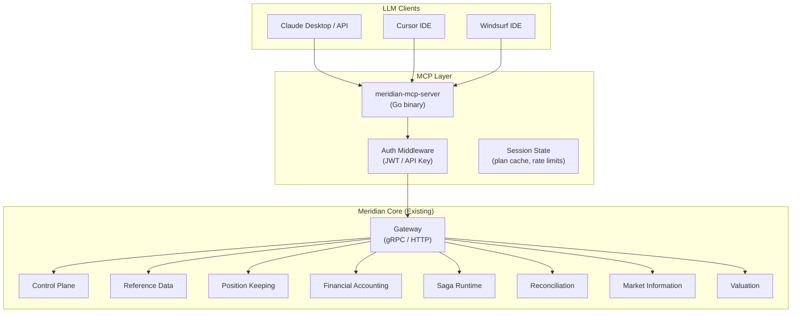
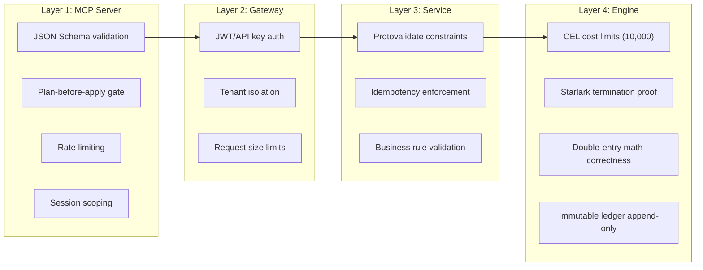
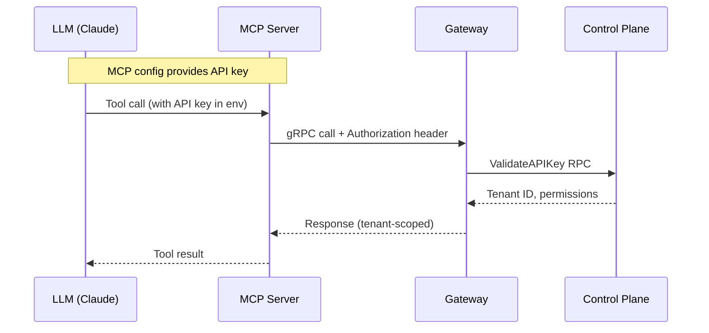
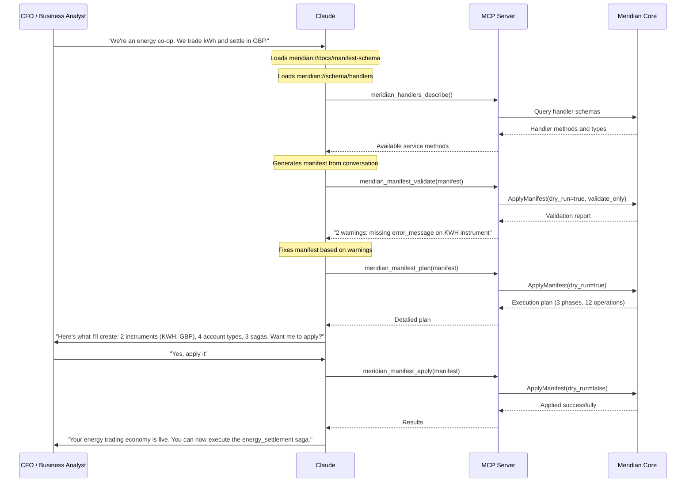
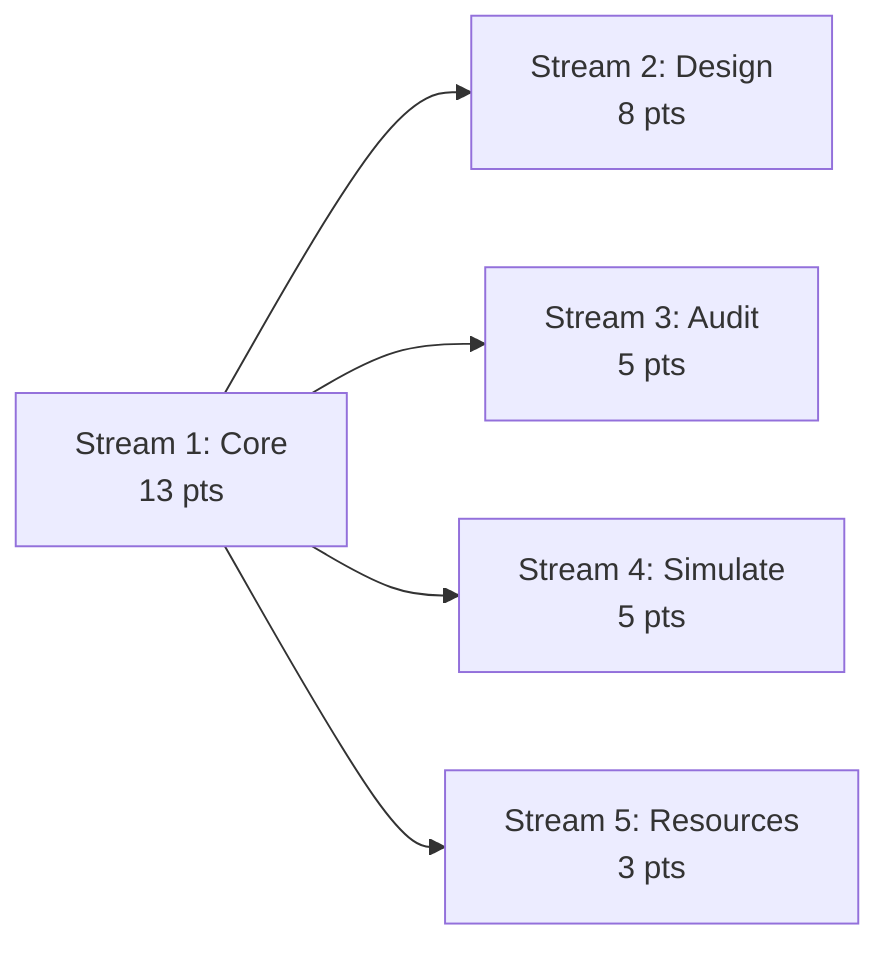

# Meridian MCP Server

> **Status**: Not Started
> **Task Master Tag**: `mcp-server`
> **Complexity**: 34 points (estimated)
> **Last Updated**: 2026-02-24
> **Companion PRDs**: [Control Plane](014-control-plane.md), [Starlark Saga Orchestration](006-starlark-saga-orchestration-core.md)
> **ADR References**: [ADR-028](../adr/0028-starlark-saga-cel-valuation.md)

---

## Table of Contents

- [1. Executive Summary](#1-executive-summary)
- [2. The Junior Operator Principle](#2-the-junior-operator-principle)
- [3. Functional Requirements](#3-functional-requirements)
- [4. MCP Tool Catalog](#4-mcp-tool-catalog)
- [5. Technical Architecture](#5-technical-architecture)
- [6. Safety Model](#6-safety-model)
- [7. Authentication and Multi-Tenancy](#7-authentication-and-multi-tenancy)
- [8. Conversational Workflows](#8-conversational-workflows)
- [9. Work Streams](#9-work-streams)
- [10. Success Criteria](#10-success-criteria)
- [11. Risks and Mitigations](#11-risks-and-mitigations)
- [12. Open Questions](#12-open-questions)

---

## 1. Executive Summary

The Meridian MCP Server is a **Model Context Protocol adapter** that exposes
Meridian's core capabilities to Large Language Models. It transforms Meridian
from a developer platform into a business platform where AI agents can:

| Capability | What the AI Does | What Meridian Enforces |
|------------|-----------------|----------------------|
| **Design Economy** | Generate Manifests (instruments, accounts, sagas) via conversation | Schema validation, CEL compilation, Starlark termination proof |
| **Audit Operations** | Traverse causation trees to explain why a balance exists | Read-only queries, bi-temporal consistency |
| **Simulate Scenarios** | Dry-run manifests and sagas to predict outcomes | Sandbox execution, no side effects, deterministic replay |

### Why This Works

Most platforms cannot safely expose their internals to an LLM. Meridian can,
because safety is enforced at the engine level, not the client level:

- **CEL expressions** have cost limits and guaranteed termination
- **Starlark scripts** cannot loop infinitely or recurse
- **The immutable ledger** rejects invalid double-entry math
- **Dry-run mode** executes the full pipeline with zero side effects
- **Protovalidate constraints** reject malformed input before it reaches business logic

The LLM cannot hallucinate a corrupt ledger state because the engine rejects
invalid math or logic at compile time. This is the architectural prerequisite
that makes an MCP server viable.

### The Market Insight

Every fintech offers an API. None offer a conversation:

```text
CFO:    "What happens if we change the energy settlement formula to include
         transmission loss?"

Claude: [calls manifest_plan] "Here's what changes: 3 valuation rules updated,
         2 sagas affected. The dry-run shows settlement amounts increase by
         ~2.3% across your test portfolio. Want me to apply this to staging?"

CFO:    "Show me the causation tree for last Tuesday's failed settlement."

Claude: [calls causation_tree] "The root saga spawned 3 child sagas. Child #2
         (meter-data-enrichment) failed at step 4 because the market data
         service returned ESTIMATE quality when the saga required ACTUAL.
         This is the temporal quality ladder at work - the meter read hadn't
         arrived yet."
```

This is the difference between a developer platform and a business platform.

---

## 2. The Junior Operator Principle

The AI is treated as a **Junior Operator**. It has the same access and
constraints as a new human team member:

| Concern | Junior Operator Rule | Enforcement |
|---------|---------------------|-------------|
| **No direct DB access** | All operations through public gRPC API | MCP server has no database connection |
| **Dry-run before apply** | Mutations preview before execution | `manifest_plan` required before `manifest_apply` |
| **Scoped to one tenant** | Cannot cross tenant boundaries | JWT/API key scoped to tenant, gRPC interceptors enforce |
| **Read-heavy, write-light** | Most tools are queries, few are mutations | Tool categorization (read vs write) |
| **Audit trail** | Every action logged | Existing audit-worker captures all gRPC calls |
| **Validation at every layer** | Invalid input rejected before execution | Protovalidate, CEL cost limits, Starlark sandbox |

The MCP server does not bypass any safety mechanism. It cannot do anything
a human operator cannot do through the same gRPC API.

---

## 3. Functional Requirements

### FR-1: Economy Design Tools

The MCP server exposes manifest lifecycle operations that allow an AI to
iteratively build a business model through conversation.

**FR-1.1**: Validate a manifest (structural, CEL, Starlark, cross-reference).
**FR-1.2**: Plan a manifest application (dry-run showing diff and execution plan).
**FR-1.3**: Apply a validated manifest (requires prior plan confirmation).
**FR-1.4**: List and inspect manifest history for a tenant.
**FR-1.5**: Query, describe, and search instruments, account types, and sagas.
**FR-1.6**: Validate individual CEL expressions and Starlark scripts in isolation.

### FR-2: Audit and Observability Tools

Read-only tools for understanding system state and explaining outcomes.

**FR-2.1**: Retrieve causation trees for saga instances (parent/child hierarchy).
**FR-2.2**: Query positions (balances) with optional bi-temporal parameters.
**FR-2.3**: Query ledger postings with filters (account, instrument, date range).
**FR-2.4**: Inspect saga execution history (steps, timing, errors).
**FR-2.5**: Check reconciliation status and variance reports.

### FR-3: Simulation Tools

Predict outcomes without side effects.

**FR-3.1**: Dry-run saga execution with simulated input data.
**FR-3.2**: Evaluate CEL expressions with provided context variables.
**FR-3.3**: Compare two manifests and show the diff.
**FR-3.4**: Simulate valuation computation for a given quantity and market context.

### FR-4: Reference Data Tools

Query the catalog of available definitions.

**FR-4.1**: Query market data (rates, prices) for instruments.
**FR-4.2**: List and describe available saga handler schemas (what service methods exist).
**FR-4.3**: Describe the handler parameter types for generating Starlark code.

### FR-5: Prompt Resources and Context

MCP resources that provide context to the LLM without tool invocation.

**FR-5.1**: Expose the current tenant's active manifest as an MCP resource.
**FR-5.2**: Expose handler schemas as MCP resources (so the LLM knows available service methods).
**FR-5.3**: Expose Starlark language reference and saga authoring guide as resources.
**FR-5.4**: Expose CEL expression syntax reference as a resource.

---

## 4. MCP Tool Catalog

### 4.1 Economy Design Tools (Write Path)

#### `meridian_manifest_validate`

Validate a manifest without applying it.

```json
{
  "name": "meridian_manifest_validate",
  "description": "Validate a manifest for structural, CEL, Starlark, and cross-reference correctness.",
  "inputSchema": {
    "type": "object",
    "properties": {
      "manifest": {
        "type": "object",
        "description": "The complete Meridian manifest to validate"
      }
    },
    "required": ["manifest"]
  }
}
```

**Maps to**: Control Plane `ApplyManifest` RPC with `dry_run=true`, validation-only mode.

#### `meridian_manifest_plan`

Preview what changes a manifest would make.

```json
{
  "name": "meridian_manifest_plan",
  "description": "Dry-run a manifest. Returns the execution plan (create/update/delete) without applying.",
  "inputSchema": {
    "type": "object",
    "properties": {
      "manifest": {
        "type": "object",
        "description": "The manifest to plan"
      }
    },
    "required": ["manifest"]
  }
}
```

**Maps to**: Control Plane `ApplyManifest` RPC with `dry_run=true`.

**Returns**: Diff plan with phases, actions (CREATE/UPDATE/NO_CHANGE), affected resources, idempotency keys.

#### `meridian_manifest_apply`

Apply a previously planned manifest.

```json
{
  "name": "meridian_manifest_apply",
  "description": "Apply a manifest. Requires meridian_manifest_plan first. Returns execution results.",
  "inputSchema": {
    "type": "object",
    "properties": {
      "manifest": {
        "type": "object",
        "description": "The manifest to apply (must match a previously planned manifest)"
      }
    },
    "required": ["manifest"]
  }
}
```

**Maps to**: Control Plane `ApplyManifest` RPC with `dry_run=false`.

**Safety**: The tool description instructs the LLM to plan first. The server validates
that a plan was generated for this manifest within the session before executing.

#### `meridian_manifest_history`

List applied manifest versions.

```json
{
  "name": "meridian_manifest_history",
  "description": "List applied manifest versions with timestamps and change summaries.",
  "inputSchema": {
    "type": "object",
    "properties": {
      "limit": { "type": "integer", "description": "Max results (default 20)" },
      "offset": { "type": "integer", "description": "Pagination offset" }
    }
  }
}
```

**Maps to**: Control Plane `ListManifestVersions` RPC.

#### `meridian_cel_validate`

Validate a CEL expression in isolation.

```json
{
  "name": "meridian_cel_validate",
  "description": "Compile and validate a CEL expression. Returns result, return type, and cost estimate.",
  "inputSchema": {
    "type": "object",
    "properties": {
      "expression": { "type": "string", "description": "The CEL expression to validate" },
      "environment": {
        "type": "string",
        "enum": ["validation", "bucket_key", "error_message", "eligibility", "precondition"],
        "description": "Which CEL environment to compile against (determines available variables)"
      }
    },
    "required": ["expression", "environment"]
  }
}
```

**Maps to**: Shared CEL compiler (new lightweight RPC or inline validation).

#### `meridian_starlark_validate`

Validate a Starlark saga script.

```json
{
  "name": "meridian_starlark_validate",
  "description": "Validate a Starlark saga script for syntax, termination, and handler references.",
  "inputSchema": {
    "type": "object",
    "properties": {
      "script": { "type": "string", "description": "The Starlark script source code" },
      "handler_context": {
        "type": "object",
        "description": "Optional: instrument codes and handler names to validate references against"
      }
    },
    "required": ["script"]
  }
}
```

**Maps to**: Reference Data `ValidateSaga` RPC (existing).

### 4.2 Audit Tools (Read Path)

#### `meridian_causation_tree`

Explain why something happened.

```json
{
  "name": "meridian_causation_tree",
  "description": "Get the causation tree for a saga: parent-child hierarchy, steps, timing, failures.",
  "inputSchema": {
    "type": "object",
    "properties": {
      "saga_id": { "type": "string", "description": "UUID of the saga instance" }
    },
    "required": ["saga_id"]
  }
}
```

**Maps to**: `SagaAdminService.GetCausationTree` RPC (existing).

#### `meridian_positions_query`

Query balances.

```json
{
  "name": "meridian_positions_query",
  "description": "Query positions (balances). Filter by account, instrument, and bi-temporal params.",
  "inputSchema": {
    "type": "object",
    "properties": {
      "account_id": { "type": "string", "description": "Account UUID (optional, queries all if omitted)" },
      "instrument_code": { "type": "string", "description": "Filter by instrument (e.g., 'USD', 'KWH')" },
      "effective_at": { "type": "string", "description": "ISO 8601 timestamp for bi-temporal effective date" },
      "knowledge_at": { "type": "string", "description": "ISO 8601 timestamp for bi-temporal knowledge date" }
    }
  }
}
```

**Maps to**: Position Keeping query RPCs (existing).

#### `meridian_postings_query`

Query the ledger.

```json
{
  "name": "meridian_postings_query",
  "description": "Query ledger postings. Filter by account, instrument, date range, or transaction type.",
  "inputSchema": {
    "type": "object",
    "properties": {
      "account_id": { "type": "string", "description": "Account UUID" },
      "instrument_code": { "type": "string", "description": "Filter by instrument" },
      "from_date": { "type": "string", "description": "ISO 8601 start date" },
      "to_date": { "type": "string", "description": "ISO 8601 end date" },
      "transaction_type": { "type": "string", "description": "Filter by type (DEPOSIT, WITHDRAWAL, etc.)" },
      "limit": { "type": "integer", "description": "Max results (default 50)" }
    }
  }
}
```

**Maps to**: Financial Accounting query RPCs (existing).

#### `meridian_saga_executions`

Query saga execution history.

```json
{
  "name": "meridian_saga_executions",
  "description": "List saga executions with status, timing, and outcome. Filter by name, status, or date.",
  "inputSchema": {
    "type": "object",
    "properties": {
      "saga_name": { "type": "string", "description": "Filter by saga definition name" },
      "status": {
        "type": "string",
        "enum": ["PENDING", "RUNNING", "COMPLETED", "COMPENSATING", "COMPENSATED", "FAILED"],
        "description": "Filter by execution status"
      },
      "from_date": { "type": "string", "description": "ISO 8601 start date" },
      "to_date": { "type": "string", "description": "ISO 8601 end date" },
      "limit": { "type": "integer", "description": "Max results (default 20)" }
    }
  }
}
```

**Maps to**: Saga query RPCs (per-service saga instance tables).

#### `meridian_reconciliation_status`

Check settlement health.

```json
{
  "name": "meridian_reconciliation_status",
  "description": "Query reconciliation cycles and variance reports for a given period.",
  "inputSchema": {
    "type": "object",
    "properties": {
      "cycle_id": { "type": "string", "description": "Specific reconciliation cycle UUID" },
      "from_date": { "type": "string", "description": "ISO 8601 start date for period query" },
      "to_date": { "type": "string", "description": "ISO 8601 end date for period query" },
      "status": {
        "type": "string",
        "enum": ["PENDING", "IN_PROGRESS", "MATCHED", "VARIANCE_DETECTED", "RESOLVED"],
        "description": "Filter by reconciliation status"
      }
    }
  }
}
```

**Maps to**: Reconciliation Service query RPCs (existing).

### 4.3 Simulation Tools

#### `meridian_cel_evaluate`

Test CEL expressions with live data.

```json
{
  "name": "meridian_cel_evaluate",
  "description": "Evaluate a CEL expression with provided context variables. Returns the result.",
  "inputSchema": {
    "type": "object",
    "properties": {
      "expression": { "type": "string", "description": "The CEL expression to evaluate" },
      "context": {
        "type": "object",
        "description": "Variable bindings (e.g., {\"amount\": 100, \"attributes\": {...}})"
      },
      "environment": {
        "type": "string",
        "enum": ["validation", "bucket_key", "error_message", "eligibility", "precondition"],
        "description": "CEL environment (determines available variables and expected return type)"
      }
    },
    "required": ["expression", "context", "environment"]
  }
}
```

**Maps to**: Shared CEL evaluator (new lightweight RPC or inline evaluation).

#### `meridian_manifest_diff`

Compare manifests.

```json
{
  "name": "meridian_manifest_diff",
  "description": "Compare two manifests. Returns structured diff of added, removed, and modified resources.",
  "inputSchema": {
    "type": "object",
    "properties": {
      "base": { "type": "object", "description": "The base manifest (e.g., current active)" },
      "target": { "type": "object", "description": "The target manifest (e.g., proposed changes)" }
    },
    "required": ["base", "target"]
  }
}
```

**Maps to**: Control Plane Differ component (existing, expose as standalone).

#### `meridian_valuation_simulate`

Test pricing computations.

```json
{
  "name": "meridian_valuation_simulate",
  "description": "Simulate a valuation computation. Returns value without creating ledger entries.",
  "inputSchema": {
    "type": "object",
    "properties": {
      "instrument_code": { "type": "string", "description": "Source instrument (e.g., 'KWH')" },
      "target_instrument": { "type": "string", "description": "Target instrument (e.g., 'GBP')" },
      "amount": { "type": "string", "description": "Quantity as decimal string (e.g., '1500.00')" },
      "market_context": {
        "type": "object",
        "description": "Market data overrides (e.g., {\"spot_price\": \"0.15\"})"
      },
      "effective_at": { "type": "string", "description": "ISO 8601 timestamp for historical valuation" }
    },
    "required": ["instrument_code", "target_instrument", "amount"]
  }
}
```

**Maps to**: Valuation service compute RPCs + Market Information lookups.

### 4.4 Reference Data Tools

#### `meridian_instruments_list`

```json
{
  "name": "meridian_instruments_list",
  "description": "List instrument definitions. Returns code, dimension, precision, status.",
  "inputSchema": {
    "type": "object",
    "properties": {
      "status": { "type": "string", "enum": ["DRAFT", "ACTIVE", "DEPRECATED"] },
      "dimension": { "type": "string", "enum": ["MONETARY", "ENERGY", "COMPUTE", "QUANTITY", "TIME", "MASS", "VOLUME"] }
    }
  }
}
```

#### `meridian_instrument_describe`

```json
{
  "name": "meridian_instrument_describe",
  "description": "Get instrument details: CEL expressions, attribute schema, version history.",
  "inputSchema": {
    "type": "object",
    "properties": {
      "code": { "type": "string", "description": "Instrument code (e.g., 'USD', 'KWH')" }
    },
    "required": ["code"]
  }
}
```

#### `meridian_sagas_list`

```json
{
  "name": "meridian_sagas_list",
  "description": "List all saga definitions for the current tenant. Returns name, version, status, and description.",
  "inputSchema": {
    "type": "object",
    "properties": {
      "status": { "type": "string", "enum": ["DRAFT", "ACTIVE", "DEPRECATED"] }
    }
  }
}
```

#### `meridian_saga_describe`

```json
{
  "name": "meridian_saga_describe",
  "description": "Get saga details: Starlark source, preconditions, handler refs, version history.",
  "inputSchema": {
    "type": "object",
    "properties": {
      "name": { "type": "string", "description": "Saga definition name" },
      "version": { "type": "integer", "description": "Specific version (latest if omitted)" }
    },
    "required": ["name"]
  }
}
```

#### `meridian_handlers_describe`

```json
{
  "name": "meridian_handlers_describe",
  "description": "Describe saga handler methods: signatures, parameter types, compensation methods.",
  "inputSchema": {
    "type": "object",
    "properties": {
      "service": {
        "type": "string",
        "description": "Filter by service name (e.g., 'position_keeping', 'financial_accounting')"
      }
    }
  }
}
```

**Maps to**: Handler schema registry (new read-only endpoint to expose handler YAML as structured data).

### 4.5 MCP Resources (Context, Not Tools)

MCP resources are loaded into the LLM's context automatically, not invoked
as tools. They provide background knowledge for generating correct output.

| Resource URI | Description | Source |
|-------------|-------------|--------|
| `meridian://tenant/manifest` | Current active manifest for this tenant | Control Plane `GetManifestVersion` |
| `meridian://schema/handlers` | All handler method signatures | Handler schema registry |
| `meridian://docs/starlark-guide` | Saga authoring guide with examples | Static markdown |
| `meridian://docs/cel-reference` | CEL expression syntax and available functions | Static markdown |
| `meridian://docs/manifest-schema` | Manifest JSON schema with field descriptions | Generated from proto |
| `meridian://tenant/instruments` | Active instruments for this tenant | Reference Data |

### 4.6 MCP Prompts (Guided Workflows)

MCP prompts are pre-built conversation starters for common workflows.

| Prompt Name | Description | Flow |
|-------------|-------------|------|
| `design-economy` | "Describe your business and I'll generate a manifest" | Interview → Generate manifest → Validate → Plan → Apply |
| `explain-balance` | "Why does account X have this balance?" | Query positions → Find recent postings → Get causation tree |
| `simulate-change` | "What happens if we change rule X?" | Get current manifest → Modify → Diff → Dry-run → Report |
| `debug-failure` | "Why did transaction X fail?" | Find saga execution → Get causation tree → Identify failure step |

---

## 5. Technical Architecture

### 5.1 Component Diagram



### 5.2 Server Implementation

The MCP server is a standalone Go binary at `services/mcp-server/`:

```text
services/mcp-server/
├── cmd/
│   └── main.go                    # MCP stdio/SSE transport entry point
├── internal/
│   ├── server/
│   │   └── server.go              # MCP protocol handler
│   ├── tools/
│   │   ├── design.go              # Economy design tools
│   │   ├── audit.go               # Audit tools
│   │   ├── simulate.go            # Simulation tools
│   │   └── reference.go           # Reference data tools
│   ├── resources/
│   │   ├── manifest.go            # Manifest resource provider
│   │   ├── handlers.go            # Handler schema resource
│   │   └── docs.go                # Static documentation resources
│   ├── prompts/
│   │   └── prompts.go             # Guided workflow prompts
│   ├── auth/
│   │   └── auth.go                # JWT/API key extraction from MCP config
│   └── session/
│       └── session.go             # Plan cache, rate limiting state
├── docs/
│   ├── starlark-guide.md          # Saga authoring reference
│   └── cel-reference.md           # CEL expression reference
└── migrations/                    # None - MCP server has no database
```

### 5.3 Transport

The MCP server supports two transports:

| Transport | Use Case | Configuration |
|-----------|----------|---------------|
| **stdio** | Claude Desktop, Claude Code, Cursor | Binary invoked as subprocess |
| **SSE** | Web-based clients, remote connections | HTTP server with Server-Sent Events |

**stdio configuration** (`.mcp.json`):

```json
{
  "mcpServers": {
    "meridian": {
      "command": "meridian-mcp-server",
      "args": ["--transport", "stdio"],
      "env": {
        "MERIDIAN_API_URL": "https://api.meridian.example.com",
        "MERIDIAN_API_KEY": "mk_live_..."
      }
    }
  }
}
```

### 5.4 gRPC Client Wiring

The MCP server reuses existing typed clients from `shared/pkg/clients/`:

```go
type MeridianMCPServer struct {
    controlPlane    controlplaneclient.Client
    referenceData   referencedataclient.Client
    positionKeeping positionkeepingclient.Client
    accounting      financialaccountingclient.Client
    reconciliation  reconciliationclient.Client
    marketInfo      marketinfoclient.Client
    valuation       valuationclient.Client

    // Session state
    planCache       *session.PlanCache
    rateLimiter     *session.RateLimiter
}
```

Each MCP tool handler is a thin function that:

1. Validates input (JSON schema)
2. Constructs the gRPC request
3. Calls the appropriate service through the Gateway
4. Transforms the gRPC response into MCP-friendly JSON

No business logic lives in the MCP server.

---

## 6. Safety Model

### 6.1 Defense in Depth



### 6.2 Tool Classification

Every MCP tool is classified by mutation risk:

| Category | Tools | Confirmation Required |
|----------|-------|----------------------|
| **Read** | `causation_tree`, `positions_query`, `postings_query`, `instruments_list`, `saga_describe`, `handlers_describe`, `reconciliation_status`, `saga_executions`, `manifest_history` | None |
| **Simulate** | `manifest_validate`, `manifest_plan`, `cel_validate`, `cel_evaluate`, `starlark_validate`, `manifest_diff`, `valuation_simulate` | None (no side effects) |
| **Write** | `manifest_apply` | Requires prior `manifest_plan` in session |

Only **one tool** (`manifest_apply`) can mutate state, and it requires a
preceding plan in the same session.

### 6.3 Rate Limiting

| Tier | Limit | Tools |
|------|-------|-------|
| Read | 60 requests/minute | All read tools |
| Simulate | 30 requests/minute | Validation, evaluation, dry-run |
| Write | 5 requests/minute | `manifest_apply` only |

### 6.4 What the LLM Cannot Do

Even with full MCP access, an LLM **cannot**:

- Execute arbitrary SQL (no database connection)
- Bypass tenant isolation (JWT scoped)
- Create infinite loops (Starlark rejects `while`)
- Corrupt ledger balances (double-entry enforcement)
- Skip validation (protovalidate on every request)
- Apply without preview (plan gate enforced server-side)
- Access other tenants' data (gRPC interceptors)
- Exceed CEL computation limits (cost budget = 10,000)

---

## 7. Authentication and Multi-Tenancy

### 7.1 Authentication Flow



The MCP server extracts the API key from its environment configuration
(`MERIDIAN_API_KEY`) and attaches it to every outbound gRPC call. The
existing Gateway + Control Plane auth pipeline handles validation and
tenant scoping.

### 7.2 Multi-Tenant Isolation

- One MCP server instance per API key (per tenant)
- API key determines tenant scope - enforced at Gateway level
- MCP server never stores or manages tenant IDs directly
- All tenant isolation relies on existing gRPC interceptors

---

## 8. Conversational Workflows

### 8.1 Design Economy Flow



### 8.2 Audit Flow

```mermaid
sequenceDiagram
    participant User as Support Engineer
    participant LLM as Claude
    participant MCP as MCP Server

    User->>LLM: "Why does account ACC-123 show -500 kWh?"

    LLM->>MCP: meridian_positions_query(account_id="ACC-123")
    MCP-->>LLM: Position: -500 KWH (3 postings)

    LLM->>MCP: meridian_postings_query(account_id="ACC-123", limit=5)
    MCP-->>LLM: 3 postings, most recent from saga SAGA-456

    LLM->>MCP: meridian_causation_tree(saga_id="SAGA-456")
    MCP-->>LLM: Root saga → 2 child sagas, step 3 posted -500 KWH

    LLM->>User: "Account ACC-123 shows -500 kWh because:
    1. Saga 'energy_settlement' (SAGA-456) executed on Feb 20
    2. Step 3 'debit_customer' posted -500 kWh as DEBIT
    3. This was part of a settlement cycle matching meter read MR-789
    The balance is correct - it reflects energy consumed but not yet invoiced."
```

---

## 9. Work Streams

### Stream 1: Core MCP Server (13 points)

Foundation: MCP protocol, transport, auth, tool registration.

| Task | Points | Description |
|------|--------|-------------|
| 1.1 | 3 | MCP server skeleton with stdio + SSE transport |
| 1.2 | 2 | Auth middleware (API key extraction, Gateway integration) |
| 1.3 | 2 | Session state (plan cache, rate limiter) |
| 1.4 | 3 | gRPC client wiring (reuse `shared/pkg/clients/`) |
| 1.5 | 3 | Tool registration framework with JSON schema validation |

### Stream 2: Economy Design Tools (8 points)

| Task | Points | Description |
|------|--------|-------------|
| 2.1 | 3 | `manifest_validate`, `manifest_plan`, `manifest_apply` |
| 2.2 | 2 | `cel_validate`, `starlark_validate` |
| 2.3 | 2 | `manifest_history` |
| 2.4 | 1 | Plan-before-apply gate enforcement |

### Stream 3: Audit Tools (5 points)

| Task | Points | Description |
|------|--------|-------------|
| 3.1 | 2 | `causation_tree`, `saga_executions` |
| 3.2 | 2 | `positions_query`, `postings_query` |
| 3.3 | 1 | `reconciliation_status` |

### Stream 4: Simulation and Reference Data Tools (5 points)

| Task | Points | Description |
|------|--------|-------------|
| 4.1 | 2 | `cel_evaluate`, `manifest_diff` |
| 4.2 | 1 | `valuation_simulate` |
| 4.3 | 2 | `instruments_list`, `instrument_describe`, `sagas_list`, `saga_describe`, `handlers_describe` |

### Stream 5: Resources, Prompts, and Documentation (3 points)

| Task | Points | Description |
|------|--------|-------------|
| 5.1 | 1 | MCP resources (manifest, handlers, static docs) |
| 5.2 | 1 | MCP prompts (design-economy, explain-balance, simulate-change, debug-failure) |
| 5.3 | 1 | Starlark guide and CEL reference markdown docs |

### Dependency Graph



**Critical path**: Stream 1 → Stream 2 (21 points).
Streams 3, 4, and 5 can run in parallel after Stream 1 completes.

---

## 10. Success Criteria

### Functional

| Criterion | Measurement |
|-----------|-------------|
| LLM can generate a valid manifest from conversation | End-to-end test: business description → applied manifest |
| LLM can explain any balance via causation tree | Given account ID, produces human-readable explanation |
| Dry-run produces identical plan to actual apply | Diff between plan output and apply audit log = empty |
| Zero state corruption from MCP access | Ledger integrity check passes after 1000 random tool calls |

### Non-Functional

| Criterion | Target |
|-----------|--------|
| Tool response latency (p95) | < 2s for read tools, < 5s for simulate, < 10s for apply |
| MCP server memory footprint | < 50MB baseline |
| Concurrent sessions | 100+ per MCP server instance |
| Zero additional database connections | MCP server has no DB - all through gRPC |

### Safety

| Criterion | Measurement |
|-----------|-------------|
| Cannot apply without plan | Server rejects `manifest_apply` without prior `manifest_plan` in session |
| Cannot access other tenants | Cross-tenant tool call returns auth error |
| CEL cost budget enforced | Expression exceeding 10,000 cost returns error |
| Starlark termination enforced | Script with `while` loop returns compilation error |
| Rate limits enforced | Exceeding limits returns 429 with retry-after |

---

## 11. Risks and Mitigations

| Risk | Impact | Mitigation |
|------|--------|------------|
| LLM generates invalid manifests frequently | Poor user experience, wasted API calls | MCP resources provide handler schema and manifest schema as context; `manifest_validate` catches errors before plan |
| Causation tree too large for LLM context | Truncated explanations | Pagination support + depth limits on causation tree query |
| MCP protocol version drift | Client incompatibility | Pin MCP SDK version, test against Claude Desktop/Cursor/Windsurf |
| Latency from gRPC round-trips | Slow tool responses | Connection pooling, response caching for reference data |
| Session state loss (stdio restarts) | Plan cache lost, must re-plan | Stateless fallback: hash manifest and check if identical plan was recently generated |

---

## 12. Open Questions

| Question | Options | Decision |
|----------|---------|----------|
| **MCP SDK language** | Go (consistency with Meridian), TypeScript (larger MCP ecosystem) | Leaning Go for consistency and existing client reuse |
| **Handler schema exposure** | New RPC on Reference Data, or embedded in MCP server from build-time codegen | TBD - depends on how dynamic handler schemas are |
| **Saga dry-run** | Extend existing saga runtime with simulation mode, or build separate simulation engine | TBD - existing `knowledge_at` parameter provides partial simulation |
| **Multi-tenant MCP** | One server per tenant (simple), or single server with tenant switching (complex) | Leaning one-per-tenant for isolation simplicity |
| **Resource refresh** | Poll for changes, or invalidate on manifest apply | TBD - poll is simpler, invalidation is more responsive |
