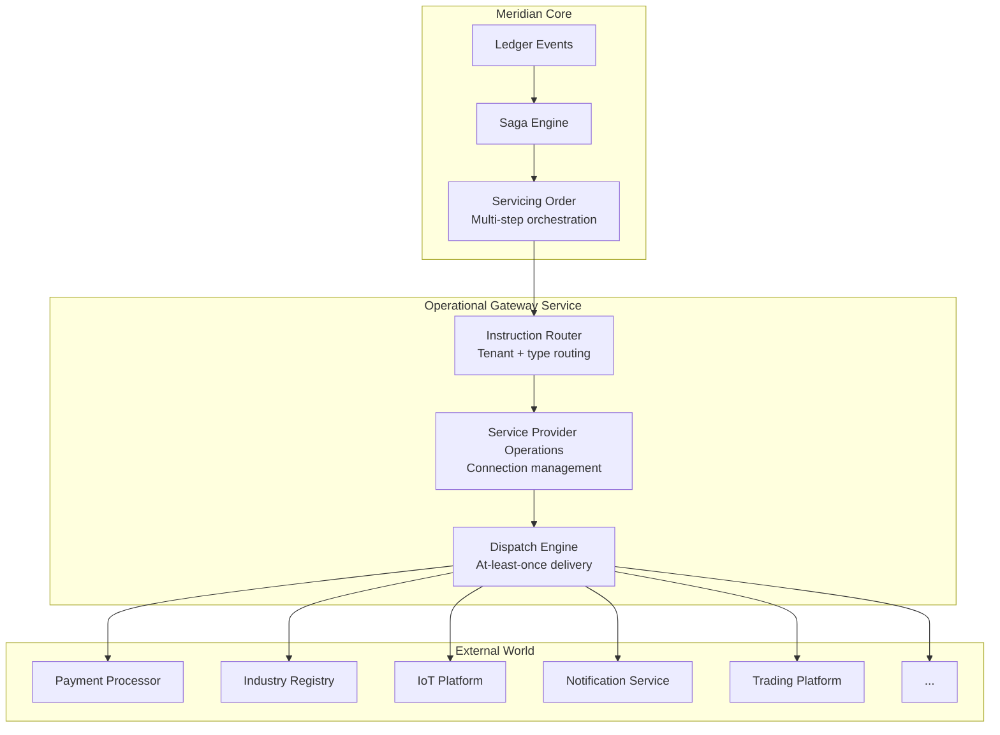
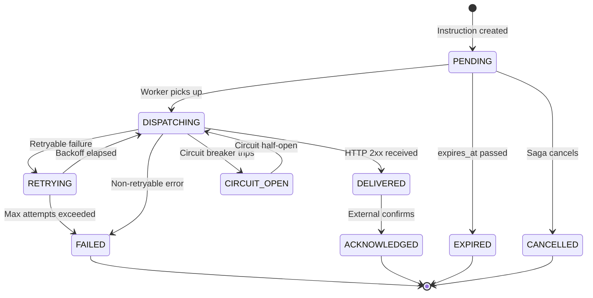

# PRD-029: Operational Gateway

**Status:** Not Started
**Version:** 1.0
**Date:** 2026-02-27
**Author:** Architecture Team
**Task Master Tag:** `operational-gateway`

---

## 1. Problem Statement

Meridian records what happened. It does not act on what happened.

The ledger tracks positions, the reconciliation engine detects variances,
sagas orchestrate internal workflows, and the event stream broadcasts
state changes to operators. But when a state change demands action in
the outside world — collecting a payment, notifying a customer, sending
a registration to an industry body, requesting a meter read, commanding
an IoT device — there is no standardized outbound pathway.

Today, each external integration must be hard-coded into saga scripts
as direct HTTP calls or bespoke adapter code. This creates problems:

| Problem | Impact |
|---------|--------|
| No reusable connection management | Every saga reinvents auth, retry, circuit breaking |
| No delivery guarantees | Fire-and-forget HTTP calls lose instructions on failure |
| No unified audit trail | Outbound instructions are invisible to the ledger |
| No manifest-declared routing | Tenants cannot configure external integrations declaratively |
| No provider abstraction | Switching providers requires rewriting saga scripts |
| No response correlation | No standard way to track acknowledgements from external systems |

The Operational Gateway closes this gap. It is the syscall interface
between Meridian's internal state machine and the external world —
the layer that turns a ledger into an operating system.

### What Triggers an Outbound Instruction?

Every outbound instruction originates from a ledger state change
evaluated by a saga:

```text
Ledger Position Change (event)
        |
   Saga evaluates policy (Starlark)
        |
   Servicing Order - orchestrates multi-step instruction
        |
   Service Provider Operations - manages auth/access with provider
        |
   Operational Gateway - sends the actual control signal
        |
   [External System] - receives and processes instruction
```

Examples across asset classes:

| Trigger (Ledger State) | Instruction | Target |
|------------------------|-------------|--------|
| Customer balance exceeds threshold | Collect payment | Payment processor (Stripe, GoCardless) |
| Position unbalanced for N hours | Flag exception | Operations dashboard / alerting system |
| Quality degrades below threshold | Request fresh data | External data provider API |
| New tariff validated and applied | Push rate schedule | IoT device management platform |
| Customer registration approved | Submit registration | Industry registry / switching service |
| Read gap detected in time series | Request on-demand read | Metering infrastructure API |
| Settlement cycle completes | Generate and deliver invoice | Document service + email/SMS provider |
| Counterparty fails to deliver | Escalate dispute | Dispute resolution workflow |
| KYC verification expires | Re-verify identity | KYC/AML provider |
| Forecast variance exceeds tolerance | Adjust hedging position | Trading platform API |

The gateway does not care what the instruction is or what the target
system does. It routes a structured message to a configured provider
endpoint, tracks delivery, and records the outcome.

---

## 2. BIAN Service Domain Alignment

This PRD maps to three BIAN Service Domains that compose the outbound
instruction architecture:

### Primary: Operational Gateway (OPERATE)

| Property | Value |
|----------|-------|
| **Service Domain** | Operational Gateway |
| **Functional Pattern** | OPERATE |
| **Generic Artifact** | Operating Session |
| **Definition** | Handles the secure sending and receiving of non-financial messages to and from professional entities outside the organization |

The Operational Gateway handles the routing and delivery of control
signals — non-payment instructions sent to external professional
entities. It supports multiple communication channels and mechanisms
appropriate for the type of information exchanged, governed by service
level agreements.

### Secondary: Service Provider Operations (OPERATE)

| Property | Value |
|----------|-------|
| **Service Domain** | Service Provider Operations |
| **Functional Pattern** | OPERATE |
| **Generic Artifact** | Operating Session |
| **Definition** | Handles the range of operational actions used in production interactions with an external service provider |

Manages connection lifecycle with external providers: authentication,
access tokens, consent management, rate limiting, circuit breaking.
Most exchanges are automated. This domain owns the reusable provider
connection that multiple instruction types share.

### Tertiary: Servicing Order (PROCESS)

| Property | Value |
|----------|-------|
| **Service Domain** | Servicing Order |
| **Functional Pattern** | PROCESS |
| **Generic Artifact** | Procedure |
| **Definition** | Handles processing of a request that may impact multiple products and services and may involve processing cycles/steps |

Orchestrates multi-step outbound workflows where a single ledger event
triggers a sequence of instructions across multiple providers. For
example: settlement completes -> generate invoice -> collect payment ->
send confirmation. Each step is tracked as a work item within the
servicing order.

### Domain Composition



---

## 3. Goals

| # | Goal | Success Metric |
|---|------|----------------|
| G1 | At-least-once delivery for all outbound instructions | Zero lost instructions under failure scenarios |
| G2 | Manifest-declared provider connections and routes | Tenants configure integrations without code changes |
| G3 | Starlark-programmable routing and transformation | Business rules determine what gets sent where |
| G4 | Asset-agnostic instruction model | Same service handles payments, notifications, API calls, device commands |
| G5 | Full audit trail for every outbound instruction | Every send, retry, ack, failure recorded in the ledger |
| G6 | Provider-independent instruction abstraction | Swap providers by changing manifest, not saga scripts |
| G7 | Response correlation and acknowledgement tracking | Instructions have a complete lifecycle from dispatch to confirmation |

### Non-Goals

- **Inbound message processing** — Handled by the Structured Mapping
  Layer (PRD-024) and gateway transcoding
- **Real-time event streaming to browsers** — Handled by the Event
  Streaming system (PRD-025)
- **Financial payment execution** — The Payment Order service handles
  the ledger side; the gateway handles the external provider communication
- **Building provider-specific SDKs** — Adapters are thin; provider
  SDKs are third-party dependencies
- **Replacing Kafka for service-to-service events** — The gateway
  handles outbound-to-external only

---

## 4. Architecture

### 4.1 Instruction Model

Every outbound instruction follows a common envelope regardless of
asset class or provider:

```protobuf
// api/proto/meridian/operational_gateway/v1/instruction.proto

message Instruction {
  string instruction_id = 1;        // UUID, idempotency key
  string tenant_id = 2;
  string instruction_type = 3;      // e.g., "payment.collect", "notification.send"
  string provider_connection_id = 4; // References manifest-declared connection
  string correlation_id = 5;        // Links to originating saga/event
  string causation_id = 6;          // Parent instruction (for multi-step)

  google.protobuf.Struct payload = 7;  // Instruction-specific data
  google.protobuf.Struct metadata = 8; // Routing hints, priority, SLA

  InstructionPriority priority = 9;
  google.protobuf.Timestamp scheduled_at = 10; // Null = immediate
  google.protobuf.Timestamp expires_at = 11;   // Null = no expiry

  // Lifecycle (set by the gateway, not the caller)
  InstructionStatus status = 12;
  repeated InstructionAttempt attempts = 13;
}

enum InstructionStatus {
  INSTRUCTION_STATUS_UNSPECIFIED = 0;
  INSTRUCTION_STATUS_PENDING = 1;
  INSTRUCTION_STATUS_DISPATCHING = 2;
  INSTRUCTION_STATUS_DELIVERED = 3;
  INSTRUCTION_STATUS_ACKNOWLEDGED = 4;
  INSTRUCTION_STATUS_FAILED = 5;
  INSTRUCTION_STATUS_EXPIRED = 6;
  INSTRUCTION_STATUS_CANCELLED = 7;
}

enum InstructionPriority {
  INSTRUCTION_PRIORITY_UNSPECIFIED = 0;
  INSTRUCTION_PRIORITY_LOW = 1;       // Batch-friendly, no SLA
  INSTRUCTION_PRIORITY_NORMAL = 2;    // Standard processing
  INSTRUCTION_PRIORITY_HIGH = 3;      // Priority queue
  INSTRUCTION_PRIORITY_CRITICAL = 4;  // Immediate dispatch, alerting on failure
}

message InstructionAttempt {
  int32 attempt_number = 1;
  google.protobuf.Timestamp attempted_at = 2;
  int32 http_status = 3;
  string response_body = 4;   // Truncated to 4KB
  string error_message = 5;
  google.protobuf.Duration latency = 6;
}
```

### 4.2 Provider Connection Model

Provider connections are declared in the tenant manifest and managed
by the Service Provider Operations domain:

```protobuf
message ProviderConnection {
  string connection_id = 1;        // Manifest-declared identifier
  string tenant_id = 2;
  string provider_name = 3;        // Human-readable (e.g., "Stripe", "Twilio")
  string provider_type = 4;        // Category (e.g., "payment", "notification", "registry")

  ConnectionProtocol protocol = 5;
  string base_url = 6;
  AuthConfig auth = 7;
  RetryPolicy retry_policy = 8;
  CircuitBreakerConfig circuit_breaker = 9;
  RateLimitConfig rate_limit = 10;

  ConnectionStatus status = 11;
  google.protobuf.Timestamp last_health_check = 12;
}

enum ConnectionProtocol {
  CONNECTION_PROTOCOL_UNSPECIFIED = 0;
  CONNECTION_PROTOCOL_HTTPS = 1;
  CONNECTION_PROTOCOL_GRPC = 2;
  CONNECTION_PROTOCOL_WEBHOOK = 3;
  CONNECTION_PROTOCOL_MQTT = 4;      // IoT device protocols
  CONNECTION_PROTOCOL_AMQP = 5;      // Message queue integration
}

message AuthConfig {
  oneof auth_method {
    ApiKeyAuth api_key = 1;
    OAuth2Auth oauth2 = 2;
    BasicAuth basic = 3;
    MtlsAuth mtls = 4;
    HmacAuth hmac = 5;
  }
}

message RetryPolicy {
  int32 max_attempts = 1;           // Default: 3
  google.protobuf.Duration initial_backoff = 2;  // Default: 1s
  google.protobuf.Duration max_backoff = 3;      // Default: 60s
  double backoff_multiplier = 4;    // Default: 2.0
  repeated int32 retryable_status_codes = 5;     // Default: [429, 500, 502, 503, 504]
}

message CircuitBreakerConfig {
  int32 failure_threshold = 1;      // Trips after N consecutive failures
  google.protobuf.Duration reset_timeout = 2;  // Half-open after this duration
  int32 half_open_max_requests = 3; // Probes before fully closing
}

message RateLimitConfig {
  int32 requests_per_second = 1;
  int32 burst_size = 2;
}
```

### 4.3 Manifest Integration

Provider connections and instruction routes are declared in the
tenant manifest alongside instruments, account types, and sagas:

```yaml
# In tenant manifest
operational_gateway:
  provider_connections:
    - connection_id: stripe-payments
      provider_name: Stripe
      provider_type: payment
      protocol: HTTPS
      base_url: https://api.stripe.com/v1
      auth:
        api_key:
          header_name: Authorization
          secret_ref: stripe_api_key    # References tenant secret store
      retry_policy:
        max_attempts: 3
        initial_backoff: 1s
        max_backoff: 30s
      rate_limit:
        requests_per_second: 25
        burst_size: 50

    - connection_id: twilio-notifications
      provider_name: Twilio
      provider_type: notification
      protocol: HTTPS
      base_url: https://api.twilio.com/2010-04-01
      auth:
        basic:
          username_ref: twilio_account_sid
          password_ref: twilio_auth_token
      retry_policy:
        max_attempts: 2
        initial_backoff: 500ms
        max_backoff: 5s

    - connection_id: webhook-ops-alerts
      provider_name: Operations Alerts
      provider_type: webhook
      protocol: WEBHOOK
      base_url: https://hooks.slack.com/services/T00000/B00000
      auth:
        hmac:
          secret_ref: webhook_signing_key
          header_name: X-Signature-256

  instruction_routes:
    - instruction_type: payment.collect
      connection_id: stripe-payments
      outbound_mapping: payment-collect-to-stripe   # MappingDefinition name
      inbound_mapping: stripe-response-to-ack       # Response mapping
      http_method: POST
      path_template: /payment_intents

    - instruction_type: notification.sms
      connection_id: twilio-notifications
      outbound_mapping: sms-to-twilio
      http_method: POST
      path_template: "/Accounts/{{.auth.username}}/Messages.json"

    - instruction_type: alert.exception
      connection_id: webhook-ops-alerts
      outbound_mapping: exception-to-slack-webhook
      http_method: POST
      path_template: ""

    - instruction_type: notification.email
      connection_id: sendgrid-email
      outbound_mapping: email-to-sendgrid
      http_method: POST
      path_template: /v3/mail/send
      # CEL condition for routing decisions
      condition: "instruction.metadata.priority == 'CRITICAL'"
```

### 4.4 Payload Transformation via MappingDefinition (Reuse of PRD-024)

Instead of Starlark scripts for payload transformation, the Operational
Gateway reuses the **bidirectional MappingDefinition** pattern from
PRD-024 (Structured Mapping Layer). This is the same engine that handles
inbound data transformation at the API gateway — applied in the outbound
direction.

**Why reuse MappingDefinition instead of Starlark:**

| Concern | MappingDefinition | Starlark Script |
|---------|-------------------|-----------------|
| Safety | CEL-bounded, guaranteed termination | Bounded but more surface area |
| Bidirectionality | Built-in auto-reverse | Must write transform + parse_response |
| Validation | Compilation-time, schema-checked | Runtime errors possible |
| DryRun | Already designed in PRD-024 | Would need separate tooling |
| Complexity | Declarative field mapping | Imperative code |
| AI generation | Structured YAML, easy to validate | Script generation harder to verify |
| Tenant self-service | Edit mapping in manifest | Must understand Starlark |

**When Starlark is still needed:** Complex routing **policy** — deciding
which instruction type to dispatch based on ledger state, computing
derived values that require business logic beyond field mapping. This
logic lives in the saga script, not in the transform layer.

**Separation of concerns:**

```text
Saga (Starlark)        → Decides WHAT to send and WHEN
  ↓
InstructionRoute       → Decides WHERE to send (connection + path)
  ↓
MappingDefinition      → Decides HOW to format the payload
  ↓
ProviderConnection     → Handles auth, retry, circuit breaking
```

#### Outbound Mapping Example: Payment Collection to Stripe

```yaml
# Declared in manifest under mappings (PRD-024 format)
name: payment-collect-to-stripe
target_service: operational_gateway   # Special: outbound mapping
target_rpc: dispatch                  # Marks as outbound

fields:
  - external_path: "amount"           # Stripe field
    internal_path: "payload.amount.units"
    transform:
      cel_transform:
        # Stripe expects cents; Meridian stores units
        outbound_cel: "int(source * 100)"
        inbound_cel: "source / 100"

  - external_path: "currency"
    internal_path: "payload.amount.currency_code"
    transform:
      cel_transform:
        outbound_cel: "source.lowerAscii()"
        inbound_cel: "source.upperAscii()"

  - external_path: "customer"
    internal_path: "payload.customer_stripe_id"

  - external_path: "metadata.meridian_instruction_id"
    internal_path: "instruction_id"

  - external_path: "metadata.meridian_account_id"
    internal_path: "payload.account_id"

  - external_path: "metadata.meridian_correlation_id"
    internal_path: "correlation_id"

idempotency:
  source_selector: "body:instruction_id"
```

#### Inbound Mapping Example: Stripe Response to Acknowledgement

```yaml
name: stripe-response-to-ack
target_service: operational_gateway
target_rpc: acknowledge

fields:
  - external_path: "id"               # Stripe PaymentIntent ID
    internal_path: "external_id"

  - external_path: "status"
    internal_path: "provider_status"
    transform:
      enum_mapping:
        values:
          succeeded: "ACKNOWLEDGED"
          requires_payment_method: "PENDING"
          requires_action: "PENDING"
          canceled: "CANCELLED"
        fallback: "FAILED"
```

#### Outbound Mapping Example: Exception to Slack Webhook

```yaml
name: exception-to-slack-webhook
target_service: operational_gateway
target_rpc: dispatch

fields:
  - external_path: "text"
    internal_path: "payload.title"

outbound_computed_fields:
  - target_path: "blocks"
    cel_expression: >
      [{"type": "section", "text": {"type": "mrkdwn", "text":
        "*" + mapped.text + "*\nAccount: `" +
        string(input.payload.account_id) + "`\nType: " +
        string(input.payload.exception_type) + "\nSeverity: " +
        string(input.metadata.priority)
      }}]
```

This gives the same expressive power as the Starlark scripts but
within the declarative, compilation-validated, bidirectional mapping
framework that PRD-024 already defines. The mapping engine is shared
infrastructure — the same code that transforms inbound partner JSON
also transforms outbound provider JSON.

#### Fallback: Starlark for Exceptional Cases

For providers with truly complex request construction that exceeds
MappingDefinition capabilities (e.g., multi-part form uploads,
dynamic path construction from payload values, conditional field
inclusion), a route can reference a Starlark transform script instead
of a mapping name:

```yaml
instruction_routes:
  - instruction_type: document.upload
    connection_id: document-service
    # Falls back to Starlark when mapping isn't sufficient
    transform_script: document_upload_multipart
    http_method: POST
    path_template: /documents
```

This is the exception, not the rule. The mapping engine should handle
90%+ of provider integrations declaratively.

### 4.5 Dispatch Engine

The dispatch engine provides at-least-once delivery using the outbox
pattern already established in Meridian:



**Persistence**: Instructions are written to an `instructions` table
in the operational gateway's database. The dispatch worker polls for
PENDING instructions (or consumes from a Kafka topic when enabled).
This follows the same outbox-based pattern used across Meridian.

**Idempotency**: The `instruction_id` serves as the idempotency key.
If a provider supports idempotency keys (e.g., Stripe), the transform
script includes it in the request. The gateway itself deduplicates
on `instruction_id` — resubmitting the same instruction is a no-op.

**Circuit Breaking**: Per-connection circuit breakers prevent a failing
provider from consuming retry budget across all instruction types.
When a circuit opens, instructions queue and resume when the circuit
transitions to half-open.

### 4.6 Saga Integration

Sagas create instructions through the generated Starlark service client:

```python
# In a saga script
def execute(ctx):
    # Ledger operations first
    position_keeping.initiate_log(
        account_id=ctx.customer_account_id,
        amount=ctx.settlement_amount,
        direction="DEBIT",
    )

    # Then trigger outbound instruction
    operational_gateway.dispatch_instruction(
        instruction_type="payment.collect",
        payload={
            "account_id": ctx.customer_account_id,
            "customer_stripe_id": ctx.customer_stripe_id,
            "amount": ctx.settlement_amount,
        },
        priority="NORMAL",
    )

def compensate(ctx):
    # Cancel any pending outbound instruction
    operational_gateway.cancel_instruction(
        correlation_id=ctx.saga_instance_id,
    )
```

The `operational_gateway` Starlark client is auto-generated from the
service handler definitions in `handlers.yaml`, following the same
typed service client pattern as all other Meridian services (PRD-007).

### 4.7 Response Handling and Correlation

External systems respond asynchronously. The gateway supports two
response patterns:

**Synchronous**: HTTP response from the dispatch call itself. The
`parse_response` function in the transform script interprets the
response and updates the instruction status.

**Asynchronous (Webhook Callback)**: Some providers confirm delivery
via callback. The gateway exposes an inbound webhook endpoint per
provider connection:

```http
POST /api/v1/gateway/callbacks/{connection_id}
```

The callback handler:

1. Validates the webhook signature (using auth config from the connection)
2. Extracts the Meridian instruction ID from the callback payload
3. Updates the instruction status to ACKNOWLEDGED
4. Emits an event that the originating saga can consume to continue
   its workflow

This enables multi-step workflows where the saga waits for external
confirmation before proceeding.

---

## 5. Design Pattern: Bidirectional Mapping Reuse

### The Insight

PRD-024 (Structured Mapping Layer) solves inbound transformation:
external partner JSON arrives at the API gateway, gets mapped to
Meridian's proto format, and forwarded to the correct service.

The Operational Gateway has the **exact same problem in reverse**:
an internal instruction payload must be mapped to the provider's
expected JSON format for the outbound HTTP request, and the
provider's response must be mapped back to an instruction outcome.

This is the same engine running in two directions:

```text
PRD-024 (Inbound):   Partner JSON  → MappingEngine → Meridian Proto
PRD-029 (Outbound):  Instruction   → MappingEngine → Provider JSON
PRD-024 (Response):  Meridian Proto → MappingEngine → Partner JSON
PRD-029 (Response):  Provider JSON  → MappingEngine → Instruction Outcome
```

### Shared Infrastructure

The mapping engine must be extracted to shared infrastructure so both
the API gateway and the Operational Gateway can use it:

```text
shared/pkg/cel/        # CEL compiler (PRD-024 Phase 1 extraction)
shared/pkg/mapping/    # Mapping engine (PRD-024 Phase 2 extraction)
  ├── engine.go        # Core transform logic
  ├── field.go         # FieldCorrespondence evaluation
  ├── reverse.go       # Auto-reverse transforms
  ├── cel_transform.go # CEL-based transforms
  ├── enum.go          # Enum mapping + inversion
  ├── flatten.go       # Attribute flattening
  └── dryrun.go        # DryRun evaluation
```

The API gateway uses the engine for `/mapping/{name}` inbound routes.
The Operational Gateway uses the same engine for outbound instruction
dispatch. Same code, same validation, same safety guarantees.

### What This Means for Tenants

A tenant's manifest declares both inbound and outbound mappings in
the same format:

```yaml
mappings:
  # Inbound: partner sends data to Meridian (PRD-024)
  - name: bank-x-party-onboarding
    target_service: meridian.party.v1.PartyService
    target_rpc: RegisterParty
    fields: [...]

  # Outbound: Meridian sends instructions to providers (PRD-029)
  - name: payment-collect-to-stripe
    target_service: operational_gateway
    target_rpc: dispatch
    fields: [...]

  # Outbound: Response mapping for callbacks
  - name: stripe-response-to-ack
    target_service: operational_gateway
    target_rpc: acknowledge
    fields: [...]
```

One pattern. One engine. One manifest section. Bidirectional by
construction.

---

## 6. Service Design

### 5.1 Package Structure

```text
services/operational-gateway/
├── README.md
├── domain/
│   ├── instruction.go            # Instruction aggregate
│   ├── instruction_test.go
│   ├── provider_connection.go    # Connection aggregate
│   ├── provider_connection_test.go
│   ├── dispatch.go               # Dispatch engine domain logic
│   ├── dispatch_test.go
│   ├── circuit_breaker.go        # Per-connection circuit breaker
│   └── circuit_breaker_test.go
├── ports/
│   ├── instruction_repository.go # Persistence port
│   ├── connection_repository.go
│   ├── dispatcher.go             # HTTP dispatch port
│   └── payload_transformer.go    # Payload transformation port
├── adapters/
│   ├── grpc/
│   │   ├── instruction_handler.go
│   │   ├── callback_handler.go
│   │   └── connection_handler.go
│   ├── persistence/
│   │   ├── cockroach_instruction_repo.go
│   │   └── cockroach_connection_repo.go
│   ├── http/
│   │   ├── http_dispatcher.go       # Makes outbound HTTP calls
│   │   └── http_dispatcher_test.go
│   ├── mapping/
│   │   ├── mapping_transformer.go   # Uses PRD-024 MappingDefinition engine
│   │   └── mapping_transformer_test.go
│   └── starlark/
│       ├── starlark_transformer.go  # Fallback for complex transforms
│       └── starlark_transformer_test.go
├── worker/
│   ├── dispatch_worker.go        # Polls/consumes pending instructions
│   ├── dispatch_worker_test.go
│   ├── expiry_worker.go          # Expires overdue instructions
│   └── health_check_worker.go    # Periodic provider health checks
└── migrations/
    └── 20260227000001_operational_gateway.sql
```

The `payload_transformer.go` port defines a common interface:

```go
// Port: transforms instruction payload to provider request format
type PayloadTransformer interface {
    // TransformOutbound converts an instruction payload to the
    // provider-specific request body.
    TransformOutbound(ctx context.Context, instruction *Instruction) ([]byte, error)

    // TransformInbound converts a provider response to an
    // instruction outcome (status, external_id, metadata).
    TransformInbound(ctx context.Context, statusCode int, body []byte) (*InstructionOutcome, error)
}
```

Two adapters implement this port:

- **`mapping_transformer.go`** — delegates to the PRD-024 mapping
  engine (`shared/pkg/mapping/` or gateway middleware). This is the
  default for 90%+ of integrations.
- **`starlark_transformer.go`** — executes a Starlark script for
  complex cases. Used only when the instruction route specifies
  `transform_script` instead of `outbound_mapping`.

### 5.2 Database Schema

```sql
-- Operational Gateway schema (CockroachDB)

CREATE TABLE provider_connections (
    connection_id    VARCHAR(255) NOT NULL,
    tenant_id        UUID NOT NULL,
    provider_name    VARCHAR(255) NOT NULL,
    provider_type    VARCHAR(100) NOT NULL,
    protocol         VARCHAR(50) NOT NULL,
    base_url         VARCHAR(2048) NOT NULL,
    auth_config      JSONB NOT NULL DEFAULT '{}',
    retry_policy     JSONB NOT NULL DEFAULT '{}',
    circuit_breaker  JSONB NOT NULL DEFAULT '{}',
    rate_limit       JSONB NOT NULL DEFAULT '{}',
    status           VARCHAR(50) NOT NULL DEFAULT 'ACTIVE',
    last_health_check TIMESTAMPTZ,
    created_at       TIMESTAMPTZ NOT NULL DEFAULT now(),
    updated_at       TIMESTAMPTZ NOT NULL DEFAULT now(),

    PRIMARY KEY (tenant_id, connection_id)
);

CREATE TABLE instructions (
    instruction_id   UUID NOT NULL DEFAULT gen_random_uuid(),
    tenant_id        UUID NOT NULL,
    instruction_type VARCHAR(255) NOT NULL,
    connection_id    VARCHAR(255) NOT NULL,
    correlation_id   VARCHAR(255) NOT NULL,
    causation_id     VARCHAR(255),
    payload          JSONB NOT NULL,
    metadata         JSONB NOT NULL DEFAULT '{}',
    priority         VARCHAR(50) NOT NULL DEFAULT 'NORMAL',
    status           VARCHAR(50) NOT NULL DEFAULT 'PENDING',
    scheduled_at     TIMESTAMPTZ,
    expires_at       TIMESTAMPTZ,
    attempt_count    INT NOT NULL DEFAULT 0,
    max_attempts     INT NOT NULL DEFAULT 3,
    next_attempt_at  TIMESTAMPTZ,
    external_id      VARCHAR(255),       -- ID from external system
    created_at       TIMESTAMPTZ NOT NULL DEFAULT now(),
    updated_at       TIMESTAMPTZ NOT NULL DEFAULT now(),

    PRIMARY KEY (tenant_id, instruction_id)
);

-- Worker polling index: find dispatchable instructions
CREATE INDEX idx_instructions_dispatchable
    ON instructions (tenant_id, status, next_attempt_at)
    WHERE status IN ('PENDING', 'RETRYING');

-- Correlation lookup: find instructions by saga/event
CREATE INDEX idx_instructions_correlation
    ON instructions (tenant_id, correlation_id);

-- Expiry index: find expired instructions
CREATE INDEX idx_instructions_expiry
    ON instructions (expires_at)
    WHERE status = 'PENDING' AND expires_at IS NOT NULL;

CREATE TABLE instruction_attempts (
    attempt_id       UUID NOT NULL DEFAULT gen_random_uuid(),
    instruction_id   UUID NOT NULL,
    tenant_id        UUID NOT NULL,
    attempt_number   INT NOT NULL,
    attempted_at     TIMESTAMPTZ NOT NULL DEFAULT now(),
    http_status      INT,
    response_body    VARCHAR(4096),      -- Truncated
    error_message    VARCHAR(1024),
    latency_ms       INT,

    PRIMARY KEY (tenant_id, instruction_id, attempt_number),
    CONSTRAINT fk_instruction FOREIGN KEY (tenant_id, instruction_id)
        REFERENCES instructions (tenant_id, instruction_id)
);
```

### 5.3 gRPC Service Definition

```protobuf
// api/proto/meridian/operational_gateway/v1/service.proto

service OperationalGatewayService {
  // Dispatch an instruction to an external provider
  rpc DispatchInstruction(DispatchInstructionRequest)
      returns (DispatchInstructionResponse);

  // Cancel a pending instruction
  rpc CancelInstruction(CancelInstructionRequest)
      returns (CancelInstructionResponse);

  // Query instruction status and history
  rpc GetInstruction(GetInstructionRequest)
      returns (GetInstructionResponse);

  // List instructions with filtering
  rpc ListInstructions(ListInstructionsRequest)
      returns (ListInstructionsResponse);

  // Process an inbound callback from an external provider
  rpc ProcessCallback(ProcessCallbackRequest)
      returns (ProcessCallbackResponse);
}

service ProviderConnectionService {
  // Register or update a provider connection (from manifest apply)
  rpc UpsertConnection(UpsertConnectionRequest)
      returns (UpsertConnectionResponse);

  // Get connection status and health
  rpc GetConnection(GetConnectionRequest)
      returns (GetConnectionResponse);

  // List all connections for a tenant
  rpc ListConnections(ListConnectionsRequest)
      returns (ListConnectionsResponse);

  // Test a connection (send health check probe)
  rpc TestConnection(TestConnectionRequest)
      returns (TestConnectionResponse);
}
```

### 5.4 Kafka Events

The gateway emits events for every instruction lifecycle transition,
following the established topic naming convention:

```yaml
- operational-gateway.instruction-dispatched.v1
- operational-gateway.instruction-delivered.v1
- operational-gateway.instruction-acknowledged.v1
- operational-gateway.instruction-failed.v1
- operational-gateway.instruction-expired.v1
- operational-gateway.instruction-cancelled.v1
- operational-gateway.circuit-opened.v1
- operational-gateway.circuit-closed.v1
```

These events integrate with the existing event streaming system
(PRD-025), making outbound instruction lifecycle visible in the
operations console.

---

## 7. Manifest Apply Integration

When `ApplyManifest` processes the `operational_gateway` section:

1. **Validate connections** — CEL expressions verify required fields,
   valid protocols, sensible retry/rate-limit values
2. **Validate routes** — Ensure referenced `connection_id` exists,
   transform script is a valid Starlark script, instruction types
   follow naming convention
3. **Upsert connections** — Create or update provider connections
   via `ProviderConnectionService.UpsertConnection`
4. **Register routes** — Store instruction type -> connection + script
   mapping in reference data
5. **Generate Starlark client** — The `operational_gateway` service
   handlers are added to the `handlers.yaml` registry, and
   `BuildServiceModules()` generates the typed Starlark client that
   saga scripts use

This follows the same manifest apply pattern as instruments, account
types, and sagas — the gateway configuration is part of the tenant's
economy definition.

---

## 8. Security

### Secret Management

Provider credentials (API keys, OAuth secrets, HMAC keys) are
referenced by name in the manifest (`secret_ref`) but stored in a
tenant-scoped secret store. The gateway retrieves secrets at dispatch
time, never persists them in the instructions table, and never logs
them.

Phase 1 uses environment variables per tenant (consistent with current
Stripe integration). Phase 2 introduces a proper secret store (HashiCorp
Vault or similar).

### Request Signing

For webhook callbacks, the gateway validates signatures using the
auth config from the provider connection. This prevents spoofed
callbacks from updating instruction state.

### Tenant Isolation

All tables are partitioned by `tenant_id` (primary key prefix).
The gateway enforces tenant scoping at every layer:

- gRPC interceptors inject tenant context
- Repository methods scope all queries by tenant
- Dispatch workers process instructions within tenant boundaries
- Circuit breakers are per-connection per-tenant

---

## 9. Observability

### Metrics (Prometheus)

```text
meridian_gateway_instructions_total{tenant, type, status}     # Counter
meridian_gateway_instruction_latency_seconds{tenant, type}    # Histogram
meridian_gateway_dispatch_attempts_total{tenant, connection}  # Counter
meridian_gateway_circuit_state{tenant, connection}            # Gauge (0=closed, 1=open, 2=half-open)
meridian_gateway_active_instructions{tenant, status}          # Gauge
meridian_gateway_provider_health{tenant, connection}          # Gauge (0=unhealthy, 1=healthy)
```

### Tracing (OpenTelemetry)

Each instruction dispatch creates a span linked to the originating
saga's trace context via `correlation_id`. This enables end-to-end
tracing from ledger event through saga through gateway to external
provider response.

### Logging (slog)

Structured logging with instruction ID, connection ID, tenant ID,
and attempt number in every log line. Response bodies are logged at
DEBUG level only (may contain PII).

---

## 10. Implementation Plan

### Phase 1: Core Instruction Dispatch (13 points)

**Prerequisites:** PRD-024 Phase 2 (mapping engine in `shared/pkg/mapping/`)

**Deliverables:**

- Proto definitions (instruction, connection, service)
- Domain model (instruction aggregate, connection aggregate)
- CockroachDB persistence (instructions, attempts, connections)
- Dispatch worker (polls pending instructions, makes HTTP calls)
- Mapping-based payload transformer (delegates to PRD-024 engine)
- gRPC service handlers (dispatch, cancel, get, list)
- Retry logic with exponential backoff
- Idempotency (instruction_id dedup)
- Kafka events for instruction lifecycle
- Manifest integration (connection and route declaration)
- Starlark service client generation (for saga scripts to call)
- Outbound mapping definitions for Stripe (reference implementation)
- Unit and integration tests

**Key decisions:**

- HTTP dispatcher only (HTTPS protocol) in Phase 1
- MappingDefinition (PRD-024) for payload transformation — not Starlark
- Starlark fallback adapter available but not primary path
- No circuit breaker or rate limiter yet
- Outbox-based dispatch (works without Kafka)

### Phase 2: Resilience and Connection Management (8 points)

**Deliverables:**

- Per-connection circuit breaker
- Token bucket rate limiter
- Provider health check worker (periodic probes)
- OAuth2 token refresh (client credentials flow)
- Connection status tracking and alerting
- `TestConnection` RPC for manifest validation
- Circuit breaker events on Kafka

### Phase 3: Asynchronous Response Handling (8 points)

**Deliverables:**

- Webhook callback endpoint per connection
- Signature validation per auth method
- Response correlation (external event -> instruction update)
- Saga continuation on acknowledgement (event -> saga step)
- Multi-step servicing orders (chain of instructions)
- Timeout-based escalation (no ack within SLA -> alert)

### Phase 4: Extended Protocols and Operations (5 points)

**Deliverables:**

- gRPC dispatch adapter (for providers with gRPC APIs)
- MQTT dispatch adapter (for IoT device management)
- Bulk instruction dispatch (batch API)
- Instruction replay (re-dispatch failed instructions)
- Operations console integration (instruction lifecycle view)
- Runbook and operational documentation

---

## 11. Testing Strategy

| Layer | What | How |
|-------|------|-----|
| Unit | Instruction lifecycle state machine | Table-driven tests |
| Unit | Starlark transform execution | Script fixtures + assertion |
| Unit | Circuit breaker state transitions | Simulated failure sequences |
| Unit | Retry backoff calculation | Property-based tests |
| Unit | Manifest validation (CEL) | Invalid config fixtures |
| Integration | Dispatch -> HTTP -> response parsing | `httptest.Server` |
| Integration | Full lifecycle: saga -> gateway -> provider | CockroachDB testcontainer + HTTP mock |
| Integration | Callback -> instruction update -> saga event | End-to-end with Kafka |
| Integration | Manifest apply -> connections created | Through control plane |
| Load | 1000 instructions/sec sustained dispatch | k6 + provider mock |

All tests use `testdb.SetupCockroachDB` and `shared/platform/await`
(no `time.Sleep`).

---

## 12. Dependencies

| Component | Relationship | Status |
|-----------|-------------|--------|
| Saga Engine (PRD-006) | Instructions originate from sagas | Implemented |
| Starlark Service Clients (PRD-007) | Gateway exposes typed Starlark client | Implemented |
| Control Plane / Manifest (PRD-014) | Connections declared in manifest | Implemented |
| **Structured Mapping (PRD-024)** | **Payload transformation engine (outbound + inbound)** | **Not Started** |
| Event Streaming (PRD-025) | Gateway events visible in ops console | Not Started |
| Stripe Connect (PRD-015) | Payment collection is a gateway instruction type | Implemented |
| Outbox Pattern | At-least-once dispatch uses outbox | Implemented |

### Critical Dependency: PRD-024 Structured Mapping Layer

The Operational Gateway depends on PRD-024 Phase 2 (Bidirectional
Mapping) for payload transformation. Specifically:

- **MappingDefinition** — the data model for field correspondences,
  transforms, and CEL expressions
- **Mapping engine core** — path extraction (gjson), CEL evaluation,
  enum mapping, auto-reverse transforms
- **DryRunMapping** — test outbound transforms before live dispatch

PRD-024 Phase 2 must be extracted to a shared location (likely
`shared/pkg/mapping/`) so both the API gateway (inbound) and the
Operational Gateway (outbound) can use the same engine. This
extraction is a natural extension of PRD-024's Phase 1 CEL compiler
extraction to `shared/pkg/cel/`.

**Build order recommendation:**

1. PRD-024 Phase 1 (CEL extraction + unified property model)
2. PRD-024 Phase 2 (mapping engine to `shared/pkg/mapping/`)
3. PRD-029 Phase 1 (instruction dispatch using mapping engine)

### Migration Path for Existing Integrations

The current Stripe integration (direct HTTP calls from saga scripts)
should be migrated to use the Operational Gateway once Phase 1 is
complete. This demonstrates the pattern and validates the architecture
before adding more providers.

---

## 13. Risks and Mitigations

| Risk | Impact | Mitigation |
|------|--------|------------|
| Provider API changes break transforms | Medium | Starlark scripts are tenant-versioned; canary dispatch before full rollout |
| Secret leakage in logs or instruction table | High | Secrets resolved at dispatch time only; never persisted in payload; audit log redaction |
| Circuit breaker starvation | Medium | Per-connection breakers prevent one provider from affecting others |
| Outbox polling latency | Low | Acceptable for async instructions; Kafka path for time-sensitive dispatch |
| Transform script complexity | Low | Starlark is intentionally bounded (no while loops, no recursion); max execution time enforced |
| Callback endpoint abuse | Medium | Signature validation mandatory; rate limiting on callback endpoint |
| Instruction queue backlog | Medium | Priority queues; monitoring on queue depth; alerting on dispatch lag |

---

## 14. Success Criteria

| Criterion | Measurement | Target |
|-----------|-------------|--------|
| Delivery reliability | Instructions that reach DELIVERED or ACKNOWLEDGED | > 99.9% (excluding provider errors) |
| Dispatch latency (p95) | Time from PENDING to DISPATCHING | < 2 seconds |
| End-to-end latency (p95) | Ledger event to provider receipt | < 5 seconds |
| Provider swap time | Time to change provider via manifest | < 5 minutes (manifest apply) |
| Tenant isolation | Cross-tenant instruction leakage | 0 (zero) |
| Instruction audit completeness | Instructions with full attempt history | 100% |

---

## 15. Future Considerations (Out of Scope)

| Capability | When | Notes |
|------------|------|-------|
| Bidirectional protocol adapters (MQTT, AMQP) | Phase 4 | IoT and message queue integration |
| Instruction scheduling (cron-based) | Post-MVP | Recurring instructions (monthly billing) |
| Provider marketplace | Post-MVP | Pre-built connection templates for common providers |
| AI-generated transform scripts | Post-MVP | LLM generates Starlark from provider API docs |
| Multi-region dispatch | Post-MVP | Route to geographically closest provider endpoint |
| Instruction cost tracking | Post-MVP | Track API call costs per provider per tenant |
| Dead letter queue with manual retry UI | Phase 3+ | Operations console integration for failed instructions |
