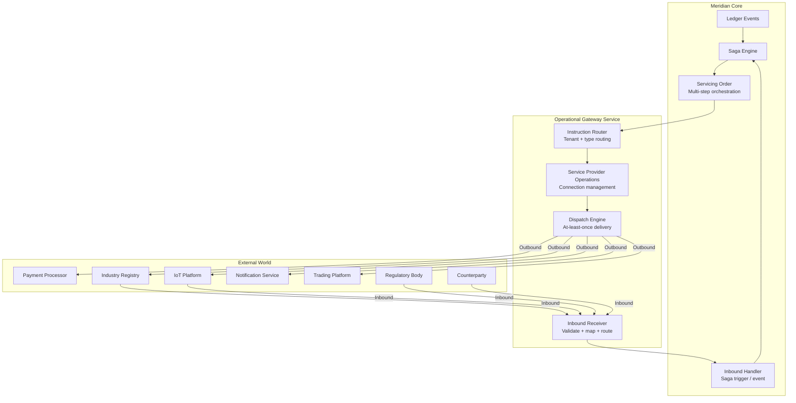
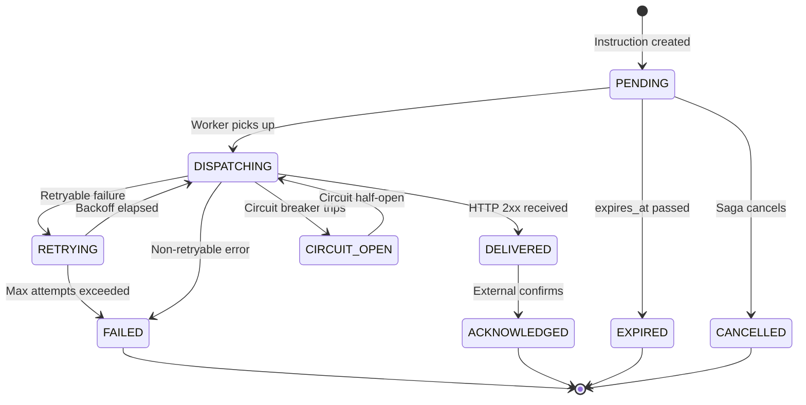

# PRD-029: Operational Gateway

**Status:** Not Started
**Version:** 1.0
**Date:** 2026-02-27
**Author:** Architecture Team
**Task Master Tag:** `operational-gateway`

---

## 1. Problem Statement

Meridian records what happened. It does not act on what happened.
And when the outside world acts, Meridian has no standard way to listen.

The ledger tracks positions, the reconciliation engine detects variances,
sagas orchestrate internal workflows, and the event stream broadcasts
state changes to operators. But two gaps exist:

**Outbound**: When a state change demands action in the outside world —
collecting a payment, notifying a customer, sending a registration to
an industry body, requesting a meter read, commanding an IoT device —
there is no standardized outbound pathway. Each external integration
must be hard-coded into saga scripts as direct HTTP calls or bespoke
adapter code.

**Inbound**: When external parties send unsolicited non-financial
messages to Meridian — regulatory notices, counterparty status updates,
industry body communications, device telemetry alerts — there is no
standard reception and routing layer. Each inbound source requires
custom webhook handlers.

| Problem | Impact |
|---------|--------|
| No reusable connection management | Every saga reinvents auth, retry, circuit breaking |
| No delivery guarantees | Fire-and-forget HTTP calls lose instructions on failure |
| No unified audit trail | Outbound instructions are invisible to the ledger |
| No manifest-declared routing | Tenants cannot configure external integrations declaratively |
| No provider abstraction | Switching providers requires rewriting saga scripts |
| No response correlation | No standard way to track acknowledgements from external systems |
| No inbound message reception | Unsolicited external messages require bespoke handlers |
| No inbound audit trail | External notifications arrive without structured logging |

The Operational Gateway closes both gaps. It is the syscall interface
between Meridian's internal state machine and the external world —
the bidirectional I/O layer that turns a ledger into an operating
system. BIAN defines this domain as handling "the secure sending
**and receiving** of non-financial messages to and from professional
entities outside the organization."

### What Triggers an Outbound Instruction?

Every outbound instruction originates from a ledger state change
evaluated by a saga:

```text
Ledger Position Change (event)
        |
   Saga evaluates policy (Starlark)
        |
   Servicing Order - orchestrates multi-step instruction
        |
   Service Provider Operations - manages auth/access with provider
        |
   Operational Gateway - sends the actual control signal
        |
   [External System] - receives and processes instruction
```

Examples across asset classes:

| Trigger (Ledger State) | Instruction | Target |
|------------------------|-------------|--------|
| Customer balance exceeds threshold | Collect payment | Payment processor (Stripe, GoCardless) |
| Position unbalanced for N hours | Flag exception | Operations dashboard / alerting system |
| Quality degrades below threshold | Request fresh data | External data provider API |
| New tariff validated and applied | Push rate schedule | IoT device management platform |
| Customer registration approved | Submit registration | Industry registry / switching service |
| Read gap detected in time series | Request on-demand read | Metering infrastructure API |
| Settlement cycle completes | Generate and deliver invoice | Document service + email/SMS provider |
| Counterparty fails to deliver | Escalate dispute | Dispute resolution workflow |
| KYC verification expires | Re-verify identity | KYC/AML provider |
| Forecast variance exceeds tolerance | Adjust hedging position | Trading platform API |

### What Triggers an Inbound Message?

Inbound non-financial messages are **unsolicited** — they originate
from external parties, not in response to a Meridian instruction.
(Webhook callbacks to outbound instructions are handled by the
response correlation mechanism in Phase 3, not the inbound message
system.)

```text
[External Party] - sends unsolicited message
        |
   Operational Gateway - receives, validates, maps
        |
   Inbound Router - matches to connection + message type
        |
   MappingDefinition - transforms to internal format
        |
   Saga trigger or internal event
```

| Source | Inbound Message | Internal Action |
|--------|-----------------|-----------------|
| Regulatory body | Compliance notice or rule change | Trigger compliance review saga |
| Counterparty | Settlement status update | Update reconciliation position |
| Industry registry | Registration confirmation/rejection | Update party record status |
| KYC/AML provider | Verification result (async) | Update customer verification state |
| Device platform | Unsolicited telemetry alert | Trigger exception handling saga |
| Trading platform | Position or margin call notification | Trigger hedging adjustment |

The gateway treats inbound and outbound symmetrically: same provider
connections, same mapping engine, same audit trail. The direction
determines whether the gateway initiates (outbound) or listens (inbound).

---

## 2. BIAN Service Domain Alignment

This PRD maps to three BIAN Service Domains that compose the
bidirectional non-financial message architecture:

### Primary: Operational Gateway (OPERATE)

| Property | Value |
|----------|-------|
| **Service Domain** | Operational Gateway |
| **Functional Pattern** | OPERATE |
| **Generic Artifact** | Operating Session |
| **Definition** | Handles the secure sending and receiving of non-financial messages to and from professional entities outside the organization |

The Operational Gateway handles the **sending and receiving** of
non-financial messages to and from external professional entities. It
supports multiple communication channels and mechanisms appropriate
for the type of information exchanged, governed by service level
agreements. This PRD implements both directions: outbound instructions
(Phases 1-4) and inbound unsolicited messages (Phase 5).

### Secondary: Service Provider Operations (OPERATE)

| Property | Value |
|----------|-------|
| **Service Domain** | Service Provider Operations |
| **Functional Pattern** | OPERATE |
| **Generic Artifact** | Operating Session |
| **Definition** | Handles the range of operational actions used in production interactions with an external service provider |

Manages connection lifecycle with external providers: authentication,
access tokens, consent management, rate limiting, circuit breaking.
Most exchanges are automated. This domain owns the reusable provider
connection that multiple instruction types share.

### Tertiary: Servicing Order (PROCESS)

| Property | Value |
|----------|-------|
| **Service Domain** | Servicing Order |
| **Functional Pattern** | PROCESS |
| **Generic Artifact** | Procedure |
| **Definition** | Handles processing of a request that may impact multiple products and services and may involve processing cycles/steps |

Orchestrates multi-step outbound workflows where a single ledger event
triggers a sequence of instructions across multiple providers. For
example: settlement completes -> generate invoice -> collect payment ->
send confirmation. Each step is tracked as a work item within the
servicing order.

### BIAN Terminology Mapping

| Meridian Term | BIAN Equivalent | Notes |
|---------------|-----------------|-------|
| `Instruction` | Operating Session (outbound control record) | Domain-specific naming; functionally equivalent |
| `InboundMessage` | Operating Session (inbound control record) | Same BIAN artifact, opposite direction |
| `ProviderConnection` | Service Provider Operating Session | Bidirectional connection lifecycle |
| `InstructionRoute` | (Implicit in BIAN routing) | Meridian extension for declarative routing |
| `InboundRoute` | (Implicit in BIAN routing) | Maps inbound message type to internal handler |
| `dispatch` | Initiate action term (within OPERATE) | OPERATE is the functional pattern; dispatch is the action |
| `receive` | Capture action term (within OPERATE) | Inbound counterpart to dispatch |
| `DISPATCHING` | "Active" in BIAN lifecycle | Acceptable domain-specific status naming |

> **Note on functional patterns**: All three domains use BIAN functional
> patterns (OPERATE and PROCESS). The `dispatch` verb is an action within
> the OPERATE pattern, not BIAN's Execute pattern (which applies to
> different domain types). BIAN auditors should map `dispatch_instruction`
> to the Initiate action term of the Operational Gateway's OPERATE pattern.

### Domain Composition



---

## 3. Goals

| # | Goal | Success Metric |
|---|------|----------------|
| G1 | At-least-once delivery for all outbound instructions | Zero lost instructions under failure scenarios |
| G2 | Manifest-declared provider connections and routes | Tenants configure integrations without code changes |
| G3 | Declarative mapping-based transformation with programmable routing policy | Business rules determine what gets sent where |
| G4 | Asset-agnostic instruction model | Same service handles payments, notifications, API calls, device commands |
| G5 | Full audit trail for every message (outbound and inbound) | Every send, retry, ack, failure, and inbound receipt recorded |
| G6 | Provider-independent instruction abstraction | Swap providers by changing manifest, not saga scripts |
| G7 | Response correlation and acknowledgement tracking | Instructions have a complete lifecycle from dispatch to confirmation |
| G8 | Structured inbound message reception | Unsolicited external messages validated, mapped, and routed to internal handlers |

### Non-Goals

- **Real-time event streaming to browsers** — Handled by the Event
  Streaming system (PRD-025)
- **Financial payment execution** — The Payment Order service handles
  the ledger side; the gateway handles the external provider communication
- **Building provider-specific SDKs** — Adapters are thin; provider
  SDKs are third-party dependencies
- **Replacing Kafka for service-to-service events** — The gateway
  handles external-facing messages only
- **File transfer protocols** — BIAN's Operational Gateway includes
  "messages and files." Bulk file exchange (SFTP, S3 presigned URLs)
  is deferred to Phase 4 or a separate PRD
- **Inbound data ingestion** — High-volume data feeds (meter reads,
  market prices) are handled by dedicated ingestion services. The
  gateway handles discrete non-financial messages, not bulk data
  streams
- **Routing intelligence or control logic** — The gateway dispatches,
  it does not decide. Sagas own all "what happens when" logic.
  Routes support `fallback_connection_id` for transparent failover,
  but no CEL/Starlark evaluates in the dispatch hot path

---

## 4. Architecture

### 4.1 Instruction Model

Every outbound instruction follows a common envelope regardless of
asset class or provider. The key fields are:

| Field | Purpose |
|-------|---------|
| `instruction_id` | UUID, serves as idempotency key |
| `tenant_id` | Tenant scoping |
| `instruction_type` | Routing key (e.g., `payment.collect`, `notification.send`) |
| `provider_connection_id` | References manifest-declared connection |
| `correlation_id` | Links to originating saga/event |
| `causation_id` | Parent instruction (for multi-step chains) |
| `payload` | Instruction-specific data (structured, not typed) |
| `metadata` | Routing hints, priority, SLA parameters |
| `priority` | LOW / NORMAL / HIGH / CRITICAL |
| `scheduled_at` | Null = immediate, otherwise deferred dispatch |
| `expires_at` | Null = no expiry, otherwise auto-expire if not dispatched |
| `status` | Lifecycle state (see state machine below) |
| `attempts` | Ordered list of dispatch attempts with outcome |

The exact proto definition will be determined during implementation.
Field numbers, message nesting, and `oneof` choices are implementation
decisions.

### 4.2 Provider Connection Model

Provider connections are declared in the tenant manifest and managed
by the Service Provider Operations domain. Each connection captures:

| Aspect | Fields |
|--------|--------|
| Identity | `connection_id`, `tenant_id`, `provider_name`, `provider_type` |
| Transport | `protocol` (HTTPS, gRPC, WEBHOOK, MQTT, AMQP), `base_url` |
| Authentication | API key, OAuth2, Basic, mTLS, HMAC (one per connection) |
| Resilience | Retry policy, circuit breaker config, rate limit |
| Health | Connection status, last health check timestamp |

Connections are bidirectional — the same connection identity is used
for outbound dispatch and inbound message reception.

### 4.3 Manifest Integration

Provider connections and instruction routes are declared in the
tenant manifest alongside instruments, account types, and sagas:

```yaml
# In tenant manifest
operational_gateway:
  provider_connections:
    - connection_id: stripe-payments
      provider_name: Stripe
      provider_type: payment
      protocol: HTTPS
      base_url: https://api.stripe.com/v1
      auth:
        api_key:
          header_name: Authorization
          secret_ref: stripe_api_key    # References tenant secret store
      retry_policy:
        max_attempts: 3
        initial_backoff: 1s
        max_backoff: 30s
      rate_limit:
        requests_per_second: 25
        burst_size: 50

    - connection_id: twilio-notifications
      provider_name: Twilio
      provider_type: notification
      protocol: HTTPS
      base_url: https://api.twilio.com/2010-04-01
      auth:
        basic:
          username_ref: twilio_account_sid
          password_ref: twilio_auth_token
      retry_policy:
        max_attempts: 2
        initial_backoff: 500ms
        max_backoff: 5s

    - connection_id: webhook-ops-alerts
      provider_name: Operations Alerts
      provider_type: webhook
      protocol: WEBHOOK
      base_url: https://hooks.slack.com/services/T00000/B00000
      auth:
        hmac:
          secret_ref: webhook_signing_key
          header_name: X-Signature-256

  instruction_routes:
    - instruction_type: payment.collect
      connection_id: stripe-payments
      fallback_connection_id: adyen-payments   # Used when primary circuit breaker is open
      outbound_mapping: payment-collect-to-stripe
      inbound_mapping: stripe-response-to-ack
      http_method: POST
      path_template: /payment_intents

    - instruction_type: notification.sms
      connection_id: twilio-notifications
      outbound_mapping: sms-to-twilio
      http_method: POST
      path_template: "/Accounts/{{.auth.username}}/Messages.json"

    - instruction_type: alert.exception
      connection_id: webhook-ops-alerts
      outbound_mapping: exception-to-slack-webhook
      http_method: POST
      path_template: ""

    - instruction_type: notification.email
      connection_id: sendgrid-email
      outbound_mapping: email-to-sendgrid
      http_method: POST
      path_template: /v3/mail/send
      # CEL condition for routing decisions
      condition: "instruction.metadata.priority == 'CRITICAL'"
```

### 4.4 Payload Transformation via MappingDefinition (Reuse of PRD-024)

Instead of Starlark scripts for payload transformation, the Operational
Gateway reuses the **bidirectional MappingDefinition** pattern from
PRD-024 (Structured Mapping Layer). This is the same engine that handles
inbound data transformation at the API gateway — applied in the outbound
direction.

**Why reuse MappingDefinition instead of Starlark:**

| Concern | MappingDefinition | Starlark Script |
|---------|-------------------|-----------------|
| Safety | CEL-bounded, guaranteed termination | Bounded but more surface area |
| Bidirectionality | Built-in auto-reverse | Must write transform + parse_response |
| Validation | Compilation-time, schema-checked | Runtime errors possible |
| DryRun | Already designed in PRD-024 | Would need separate tooling |
| Complexity | Declarative field mapping | Imperative code |
| AI generation | Structured YAML, easy to validate | Script generation harder to verify |
| Tenant self-service | Edit mapping in manifest | Must understand Starlark |

**When Starlark is still needed:** Complex routing **policy** — deciding
which instruction type to dispatch based on ledger state, computing
derived values that require business logic beyond field mapping. This
logic lives in the saga script, not in the transform layer.

**Separation of concerns:**

```text
Saga (Starlark)        → Decides WHAT to send and WHEN
  ↓
InstructionRoute       → Decides WHERE to send (connection + path)
  ↓
MappingDefinition      → Decides HOW to format the payload
  ↓
ProviderConnection     → Handles auth, retry, circuit breaking
```

#### Outbound Mapping Example: Payment Collection to Stripe

```yaml
# Declared in manifest under mappings (PRD-024 format)
name: payment-collect-to-stripe
target_service: operational_gateway   # Special: outbound mapping
target_rpc: dispatch                  # Marks as outbound

fields:
  - external_path: "amount"           # Stripe field
    internal_path: "payload.amount.units"
    transform:
      cel_transform:
        # Stripe expects cents; Meridian stores units
        outbound_cel: "int(source * 100)"
        inbound_cel: "source / 100"

  - external_path: "currency"
    internal_path: "payload.amount.currency_code"
    transform:
      cel_transform:
        outbound_cel: "source.lowerAscii()"
        inbound_cel: "source.upperAscii()"

  - external_path: "customer"
    internal_path: "payload.customer_stripe_id"

  - external_path: "metadata.meridian_instruction_id"
    internal_path: "instruction_id"

  - external_path: "metadata.meridian_account_id"
    internal_path: "payload.account_id"

  - external_path: "metadata.meridian_correlation_id"
    internal_path: "correlation_id"

idempotency:
  source_selector: "body:instruction_id"
```

#### Inbound Mapping Example: Stripe Response to Acknowledgement

```yaml
name: stripe-response-to-ack
target_service: operational_gateway
target_rpc: acknowledge

fields:
  - external_path: "id"               # Stripe PaymentIntent ID
    internal_path: "external_id"

  - external_path: "status"
    internal_path: "provider_status"
    transform:
      enum_mapping:
        values:
          succeeded: "ACKNOWLEDGED"
          requires_payment_method: "PENDING"
          requires_action: "PENDING"
          canceled: "CANCELLED"
        fallback: "FAILED"
```

#### Outbound Mapping Example: Exception to Slack Webhook

```yaml
name: exception-to-slack-webhook
target_service: operational_gateway
target_rpc: dispatch

fields:
  - external_path: "text"
    internal_path: "payload.title"

outbound_computed_fields:
  - target_path: "blocks"
    cel_expression: >
      [{"type": "section", "text": {"type": "mrkdwn", "text":
        "*" + mapped.text + "*\nAccount: `" +
        string(input.payload.account_id) + "`\nType: " +
        string(input.payload.exception_type) + "\nSeverity: " +
        string(input.metadata.priority)
      }}]
```

This gives the same expressive power as the Starlark scripts but
within the declarative, compilation-validated, bidirectional mapping
framework that PRD-024 already defines. The mapping engine is shared
infrastructure — the same code that transforms inbound partner JSON
also transforms outbound provider JSON.

#### Fallback: Starlark for Exceptional Cases

For providers with truly complex request construction that exceeds
MappingDefinition capabilities (e.g., multi-part form uploads,
dynamic path construction from payload values, conditional field
inclusion), a route can reference a Starlark transform script instead
of a mapping name:

```yaml
instruction_routes:
  - instruction_type: document.upload
    connection_id: document-service
    # Falls back to Starlark when mapping isn't sufficient
    transform_script: document_upload_multipart
    http_method: POST
    path_template: /documents
```

This is the exception, not the rule. The mapping engine should handle
90%+ of provider integrations declaratively.

### 4.5 Dispatch Engine

The dispatch engine provides at-least-once delivery using the outbox
pattern already established in Meridian:



> **Note**: `RETRYING` and `CIRCUIT_OPEN` are transient sub-states of
> `DISPATCHING` in the proto enum. The dispatch worker tracks retry
> count and next-attempt time on the instruction record; the circuit
> breaker state lives on the connection, not the instruction. The
> diagram shows logical flow; the persisted `status` column uses only
> the `InstructionStatus` enum values.

**Persistence**: Instructions are written to an `instructions` table
in the operational gateway's database. The dispatch worker polls for
PENDING instructions (or consumes from a Kafka topic when enabled).
This follows the same outbox-based pattern used across Meridian.

**Idempotency**: The `instruction_id` serves as the idempotency key.
If a provider supports idempotency keys (e.g., Stripe), the outbound
mapping includes it in the request payload. The gateway itself
deduplicates on `instruction_id` — resubmitting the same instruction
is a no-op.

**Circuit Breaking**: Per-connection circuit breakers prevent a failing
provider from consuming retry budget across all instruction types.
When a circuit opens, instructions queue and resume when the circuit
transitions to half-open.

### 4.6 Saga Integration

Sagas create instructions through the generated Starlark service client:

```python
# In a saga script
def execute(ctx):
    # Ledger operations first
    position_keeping.initiate_log(
        account_id=ctx.customer_account_id,
        amount=ctx.settlement_amount,
        direction="DEBIT",
    )

    # Then trigger outbound instruction
    operational_gateway.dispatch_instruction(
        instruction_type="payment.collect",
        payload={
            "account_id": ctx.customer_account_id,
            "customer_stripe_id": ctx.customer_stripe_id,
            "amount": ctx.settlement_amount,
        },
        priority="NORMAL",
    )

def compensate(ctx):
    # Cancel any pending outbound instruction
    operational_gateway.cancel_instruction(
        correlation_id=ctx.saga_instance_id,
    )
```

The `operational_gateway` Starlark client is auto-generated from the
service handler definitions in `handlers.yaml`, following the same
typed service client pattern as all other Meridian services (PRD-007).

### 4.7 Response Handling and Correlation

External systems respond asynchronously. The gateway supports two
response patterns:

**Synchronous**: HTTP response from the dispatch call itself. The
configured inbound mapping (or Starlark fallback when explicitly
configured) interprets the response and updates the instruction status.

**Asynchronous (Webhook Callback)**: Some providers confirm delivery
via callback. The gateway exposes an inbound webhook endpoint per
provider connection:

```http
POST /api/v1/gateway/callbacks/{connection_id}
```

The callback handler:

1. Validates the webhook signature (using auth config from the connection)
2. Extracts the Meridian instruction ID from the callback payload
3. Updates the instruction status to ACKNOWLEDGED
4. Emits an event that the originating saga can consume to continue
   its workflow

This enables multi-step workflows where the saga waits for external
confirmation before proceeding.

### 4.8 Inbound Non-Financial Messages (Phase 5)

Distinct from webhook callbacks (which correlate to outbound
instructions), inbound messages are **unsolicited** communications
from external parties. The gateway receives, validates, transforms,
and routes them to internal handlers.

#### Inbound Message Model

Each inbound message captures:

| Field | Purpose |
|-------|---------|
| `message_id` | UUID, assigned by gateway on receipt |
| `tenant_id`, `connection_id` | Scoping and source identification |
| `message_type` | Classified type (e.g., `regulatory.notice`) |
| `source_identifier` | External party identifier |
| `raw_payload` | Original payload preserved for audit |
| `mapped_payload` | After MappingDefinition transform |
| `status` | RECEIVED → PROCESSING → DELIVERED (or FAILED / REJECTED) |

#### Inbound Endpoint

Each provider connection that supports inbound messages exposes a
receiver endpoint:

```http
POST /api/v1/gateway/inbound/{connection_id}
```

The inbound handler:

1. Validates the request signature (same auth config as outbound)
2. Identifies the message type from the payload (via a CEL classifier
   expression declared in the inbound route)
3. Persists the raw payload for audit
4. Applies the MappingDefinition to transform to internal format
5. Routes to the configured internal handler:
   - **Saga trigger**: Enqueues a saga execution with the mapped payload
   - **Kafka event**: Publishes to a topic for downstream consumers
   - **gRPC call**: Forwards to an internal service directly

#### Inbound Route Declaration (Manifest)

```yaml
operational_gateway:
  inbound_routes:
    - message_type: regulatory.notice
      connection_id: industry-registry
      # CEL expression to classify incoming payload into this type
      classifier: "has(body.notice_type) && body.category == 'regulatory'"
      inbound_mapping: registry-notice-to-internal
      handler:
        type: saga_trigger
        saga_name: process_regulatory_notice

    - message_type: counterparty.status
      connection_id: trading-platform
      classifier: "has(body.event) && body.event == 'position_update'"
      inbound_mapping: trading-status-to-internal
      handler:
        type: kafka_event
        topic: operational-gateway.inbound-message.v1

    - message_type: verification.result
      connection_id: kyc-provider
      classifier: "has(body.verification_id)"
      inbound_mapping: kyc-result-to-internal
      handler:
        type: grpc_call
        service: meridian.party.v1.PartyService
        rpc: UpdateVerificationStatus
```

#### Symmetry with Outbound

The inbound path reuses the same infrastructure as outbound:

| Component | Outbound | Inbound |
|-----------|----------|---------|
| Connection | Same `ProviderConnection` | Same `ProviderConnection` |
| Auth | Signs outbound requests | Validates inbound signatures |
| Mapping | `outbound_mapping` (internal → provider) | `inbound_mapping` (provider → internal) |
| Audit | Instruction + attempts table | Inbound messages table |
| Events | `instruction-dispatched.v1` etc. | `inbound-message-received.v1` etc. |

This symmetry is the key architectural insight: one connection to a
provider handles communication in both directions. The mapping engine
is inherently bidirectional (PRD-024), so the same `FieldCorrespondence`
definitions work in either direction.

### 4.9 Statelessness and Horizontal Scaling

The Operational Gateway must be stateless — any pod can handle any
request for any tenant. This is a hard architectural constraint,
not an optimisation.

**Why statelessness is non-negotiable**: Asynchronous provider
interactions mean the pod that dispatches an instruction is not the
pod that receives the callback. A saga dispatches a payment
instruction on pod A; Stripe's webhook fires 30 minutes later and
hits pod B. Pod B must correlate the callback to the instruction,
update its state, and emit the saga continuation event — without
any knowledge of pod A.

**All state lives in the database or shared infrastructure:**

| Concern | Where state lives | Not in-process |
|---------|-------------------|----------------|
| Instruction lifecycle | CockroachDB `instructions` table | No in-memory instruction cache |
| Connection config | Loaded from manifest at apply time, cached with short TTL | No pod-affinity required |
| Circuit breaker state | Redis (Phase 2) or CockroachDB | Not per-pod gobreaker |
| Rate limiter tokens | Redis token bucket (Phase 2) | Not per-pod `rate.Limiter` |
| Dispatch worker state | `FOR UPDATE SKIP LOCKED` row-level locking | No leader election needed |
| Callback correlation | Database lookup by `instruction_id` | No in-memory correlation map |
| Secret resolution | `SecretStore` port (env vars or Vault) | Resolved per-request |

**Dispatch worker scaling**: Multiple pods poll the `instructions`
table concurrently using `FOR UPDATE SKIP LOCKED`. Each pod claims
a batch of PENDING instructions without coordination. This is the
same pattern used by the outbox worker and audit worker — proven
to scale horizontally without leader election.

**Callback routing**: Inbound webhook and callback endpoints are
tenant-scoped via the connection ID in the URL path
(`/api/v1/gateway/callbacks/{connection_id}`). Any pod can handle
any callback because correlation is a database lookup, not
in-process state.

**Lesson from existing Stripe integration**: The current
payment-order service uses per-pod circuit breakers
(`gobreaker.CircuitBreaker`) and per-pod LRU config caches. In a
multi-pod deployment, this means N pods each independently track
failures — one pod can trip its breaker while others continue
dispatching, exceeding the provider's error threshold. The
Operational Gateway must not repeat this pattern: circuit breaker
and rate limiter state must be shared from Phase 2 onward.

**Tenant isolation**: Every database query, Kafka event, and gRPC
call is scoped by `tenant_id`. The gateway is tenant-agnostic in
its logic — the same dispatch engine, the same mapping engine, the
same callback handler — with tenant context injected via gRPC
metadata and the standard `tenant.WithTenant(ctx, tenantID)`
pattern used across all Meridian services.

---

## 5. Design Pattern: Bidirectional Mapping Reuse

### The Insight

PRD-024 (Structured Mapping Layer) solves inbound transformation:
external partner JSON arrives at the API gateway, gets mapped to
Meridian's proto format, and forwarded to the correct service.

The Operational Gateway has the **exact same problem in reverse**:
an internal instruction payload must be mapped to the provider's
expected JSON format for the outbound HTTP request, and the
provider's response must be mapped back to an instruction outcome.

This is the same engine running in every direction:

```text
PRD-024 (Inbound):          Partner JSON   → MappingEngine → Meridian Proto
PRD-029 (Outbound):         Instruction    → MappingEngine → Provider JSON
PRD-024 (Response):         Meridian Proto → MappingEngine → Partner JSON
PRD-029 (Callback):         Provider JSON  → MappingEngine → Instruction Outcome
PRD-029 (Inbound Message):  External JSON  → MappingEngine → Internal Event/Saga
```

### Shared Infrastructure

The mapping engine must be extracted to shared infrastructure so both
the API gateway and the Operational Gateway can use it:

```text
shared/pkg/cel/        # CEL compiler (PRD-024 Phase 1 extraction)
shared/pkg/mapping/    # Mapping engine (PRD-024 Phase 2 extraction)
  ├── engine.go        # Core transform logic
  ├── field.go         # FieldCorrespondence evaluation
  ├── reverse.go       # Auto-reverse transforms
  ├── cel_transform.go # CEL-based transforms
  ├── enum.go          # Enum mapping + inversion
  ├── flatten.go       # Attribute flattening
  └── dryrun.go        # DryRun evaluation
```

The API gateway uses the engine for `/mapping/{name}` inbound routes.
The Operational Gateway uses the same engine for outbound instruction
dispatch. Same code, same validation, same safety guarantees.

### What This Means for Tenants

A tenant's manifest declares both inbound and outbound mappings in
the same format:

```yaml
mappings:
  # Inbound: partner sends data to Meridian (PRD-024)
  - name: bank-x-party-onboarding
    target_service: meridian.party.v1.PartyService
    target_rpc: RegisterParty
    fields: [...]

  # Outbound: Meridian sends instructions to providers (PRD-029)
  - name: payment-collect-to-stripe
    target_service: operational_gateway
    target_rpc: dispatch
    fields: [...]

  # Outbound: Response mapping for callbacks
  - name: stripe-response-to-ack
    target_service: operational_gateway
    target_rpc: acknowledge
    fields: [...]
```

One pattern. One engine. One manifest section. Bidirectional by
construction.

---

## 6. Open Design Questions

The following architectural questions require resolution during
implementation. They are listed here to prevent premature specificity
in the PRD — the right answers will emerge from real-world usage
(particularly migrating the existing Stripe integration through the
gateway).

### 6.1 Compensation After Delivery

Once an instruction reaches DELIVERED, it cannot be "undelivered."
If the originating saga needs to compensate, it must create a **new
compensating instruction** (e.g., refund, cancellation request), not
reverse the original dispatch. How should the saga engine express
"cancel if still pending, otherwise create a compensating instruction"?

This is analogous to the problem in event-driven systems where you
cannot unpublish a message — compensation must be a forward action,
not a rollback.

### 6.2 Timeout Composition

A single `expires_at` field is insufficient for real async flows.
Consider a payment collection via Stripe:

```text
Dispatch timeout:  5 seconds (HTTP call to Stripe must respond)
Ack timeout:       24 hours (Stripe webhook should fire within a day)
SLA timeout:       72 hours (business expectation for settlement)
Escalation:        If no ack within SLA, create alert instruction
```

These are three different timeouts with different consequences.
Should they be modelled as:

- Per-route timeout tiers in the manifest?
- Per-instruction metadata set by the saga?
- A composable timeout chain (similar to stream processing throttle
  composition)?

### 6.3 In-Flight Concurrency

Rate limiting controls requests-per-second, but does not cap the
number of instructions concurrently awaiting acknowledgement. If a
provider allows 25 req/s but 500 instructions are awaiting callbacks,
does that constitute overload? Should the gateway track and limit
in-flight (dispatched but not yet acknowledged) instructions per
connection?

This is the backpressure question: in streaming systems, a slow
consumer causes the producer to slow down. In the gateway, a slow
provider (delayed callbacks) should arguably throttle the saga engine
from creating more instructions for that connection.

### 6.4 Dead Letter Handling

The PRD describes retry with exponential backoff, but what happens
after max retries? Options:

- Mark FAILED and emit event (saga handles recovery)
- Move to a dead letter table for manual inspection and replay
- Both (DLQ for ops visibility, event for saga awareness)

Production experience with dead letter queues shows they need:
replay tooling, filtering by error type, bulk retry, and alerting
on queue depth. This should be designed in Phase 2, not deferred to
Phase 4.

### 6.5 Duplicate Callback Idempotency

External systems may deliver the same webhook multiple times. Stripe
explicitly documents this. The gateway must be idempotent on callback
processing — receiving the same callback twice should not create
duplicate events or corrupt instruction state. How is deduplication
keyed? Options:

- External event ID (provider-assigned, e.g., Stripe event ID)
- Payload hash
- Both, with the external ID preferred when available

### 6.6 Ordered vs Unordered Processing

The dispatch worker polls for dispatchable instructions. Should it
process them strictly in order (FIFO by creation time) or allow
out-of-order processing for throughput?

In stream processing, `asyncMap()` preserves order while
`unorderedWaitWithRetry()` trades ordering for throughput. The
gateway likely needs both modes:

- Ordered within a correlation group (instructions from the same
  saga should dispatch sequentially)
- Unordered across correlation groups (independent sagas should
  not block each other)

### 6.7 Fan-Out / Fan-In

A single saga may create multiple instructions (e.g., settlement
completes → collect payment + send invoice + notify customer). The
saga may need to wait for all three to complete before proceeding.
Is this a gateway concern (track instruction groups) or a saga
engine concern (saga waits for N events)?

The `correlation_id` links instructions to a saga, but there is no
"instruction group" concept. If fan-out/fan-in is needed, should the
gateway provide a `WaitForInstructions` RPC, or should the saga
engine track completion via Kafka events?

### 6.8 Circuit Breaker Scope in Multi-Pod Deployments

A local-only circuit breaker in a 3-pod deployment allows 3x the
failure threshold before tripping. For providers with strict rate
limits, this can cause account suspension. Options:

- Redis-backed shared state (adds latency + Redis dependency)
- Gossip protocol between pods (eventually consistent)
- Accept local-only with lower thresholds (simpler, less accurate)

### 6.9 Secret Rotation

The PRD defines a `SecretStore` port for secret resolution, but
doesn't address rotation. When a provider API key is rotated:

- In-flight instructions using the old key: retry with new key?
- Connection health check: should detect auth failures as "rotate"
  vs "broken"
- Manifest apply: should secret rotation trigger connection re-test?

### 6.10 Configuration Storage (Resolved)

**Decision**: Gateway configuration lives in the Manifest proto as
a new `operational_gateway` section, applied atomically alongside
instruments, sagas, and payment rails. Operational telemetry
(dispatch latency, retry counts, connection health) flows to
Prometheus metrics.

**Rationale**: The existing `payment_rails` manifest section is
the direct precedent — the Operational Gateway generalises it to
arbitrary providers. The manifest already provides atomic
versioning, diff/plan/apply validation, history, and AI
configuration via MCP tools (`meridian_manifest_plan`,
`meridian_manifest_apply`). Storing gateway config in the Reference
Data Service would conflate platform configuration with tenant
business data (nodes, hierarchies) and create a runtime dependency
on Reference Data for every dispatch.

**What was considered and rejected**:

- *Reference Data for gateway config*: Adds bi-temporal complexity
  for configuration that only changes at manifest apply time. The
  instruction record itself captures the route config at creation
  time, serving as the audit trail.
- *Publishing to Market Data*: Provider latency is operational
  telemetry, not instrument valuation. Market data datasets are
  consumed by forecasting and valuation engines. Prometheus is
  purpose-built for operational metrics.

### 6.11 Routing Intelligence Level (Resolved)

**Decision**: The gateway is a dispatch engine, not a decision
engine. Sagas own all "what happens when" logic. Routes support an
optional `fallback_connection_id` for single-hop failover when the
primary connection's circuit breaker is open. No CEL expressions or
Starlark scripts evaluate in the dispatch hot path.

**Rationale**: Section 4.4 already defines the separation of
concerns — sagas decide WHAT and WHEN, routes decide WHERE,
mappings decide HOW. Every example of "control logic" proposed
(conditional dispatch, market-driven triggers, escalation chains)
is expressible as saga Starlark today. Adding a second control
logic layer in the gateway would create two places where business
intent can hide, complicating debugging and support.

The `fallback_connection_id` handles the one case that genuinely
belongs in the gateway: transparent failover when a provider is
down. This is a 2-point field addition rather than a 13-point
rules engine.

**Explicit boundary**: If cross-saga operational rules are needed
in future (e.g., "when any payment saga fails 3 times for
provider X, pause all dispatches to X"), they belong in a dedicated
operational rules service consuming gateway Kafka events — not
embedded in the gateway itself.

### 6.12 Worker Architecture (Resolved)

**Decision**: All gateway periodic operations use
`shared/platform/scheduler.WorkerLifecycle` for goroutine-based
polling. The `CronScheduler` is not used for gateway workers.

| Worker | Mechanism | Frequency |
|--------|-----------|-----------|
| Dispatch worker | `WorkerLifecycle` + poll loop | 1-5s |
| Health check probes | `WorkerLifecycle` + ticker | 15-30s |
| Instruction expiry sweep | `WorkerLifecycle` + ticker | 30-60s |
| Circuit breaker transition | In-process timer | Event-driven |

**Rationale**: The `CronScheduler` has a 1-minute minimum
resolution and requires Redis + database writes per execution. The
gateway's dispatch worker needs sub-second polling, and health
checks need sub-30-second detection. `WorkerLifecycle` is the
established pattern for this — used by the outbox worker, audit
worker, and dunning worker. It provides clean start/stop lifecycle
without cron overhead.

`CronScheduler` is reserved for future tenant-defined scheduled
instructions (e.g., "dispatch a daily settlement report at 6am")
where minute-level resolution, persistence, and distributed locking
are appropriate.

### 6.13 Control Surfaces (Resolved)

**Decision**: The gateway exposes standard gRPC RPCs consumed by
both the React Operations Console (via ConnectRPC) and the MCP
Server (via gRPC client wrappers). Connection CRUD is handled by
existing manifest tools. Phase 1 adds at most 3 MCP tools for
operational visibility. Real-time event delivery uses PRD-025.

**Phase 1 MCP tools**:

| Tool | Category | Purpose |
|------|----------|---------|
| `meridian_gateway_dispatch_status` | Read | List/filter instructions by status, connection, time range |
| `meridian_gateway_connection_health` | Read | Connection status, circuit breaker state, recent error rates |
| `meridian_gateway_retry_instruction` | Write | Retry a failed instruction (resets to PENDING) |

**Rationale**: The MCP server already has 22 tools. Tool sprawl
degrades AI usability. Connection configuration is manifest state,
already managed by `meridian_manifest_plan` / `apply`. Operational
actions (inspect failures, retry) need thin wrappers around gateway
gRPC RPCs — consistent with how every other service's tools are
registered. The React frontend calls the same gRPC RPCs directly
via ConnectRPC with no additional work.

Real-time dispatch visibility is a PRD-025 concern. The gateway
emits Kafka events for every lifecycle transition (Section 7.4).
PRD-025 consumes those and streams to the frontend. No
gateway-specific WebSocket channel needed.

---

## 7. Service Design (Indicative)

### 7.1 Package Structure

```text
services/operational-gateway/
├── README.md
├── domain/
│   ├── instruction.go            # Outbound instruction aggregate
│   ├── instruction_test.go
│   ├── inbound_message.go        # Inbound message aggregate (Phase 5)
│   ├── inbound_message_test.go
│   ├── provider_connection.go    # Connection aggregate (bidirectional)
│   ├── provider_connection_test.go
│   ├── dispatch.go               # Dispatch engine domain logic
│   ├── dispatch_test.go
│   ├── circuit_breaker.go        # Per-connection circuit breaker
│   └── circuit_breaker_test.go
├── ports/
│   ├── instruction_repository.go # Outbound persistence port
│   ├── inbound_repository.go     # Inbound persistence port (Phase 5)
│   ├── connection_repository.go
│   ├── dispatcher.go             # HTTP dispatch port
│   ├── payload_transformer.go    # Payload transformation port
│   └── secret_store.go           # Secret resolution port
├── adapters/
│   ├── grpc/
│   │   ├── instruction_handler.go
│   │   ├── callback_handler.go
│   │   ├── inbound_handler.go    # Inbound message receiver (Phase 5)
│   │   └── connection_handler.go
│   ├── persistence/
│   │   ├── cockroach_instruction_repo.go
│   │   ├── cockroach_inbound_repo.go  # Phase 5
│   │   └── cockroach_connection_repo.go
│   ├── http/
│   │   ├── http_dispatcher.go       # Makes outbound HTTP calls
│   │   └── http_dispatcher_test.go
│   ├── mapping/
│   │   ├── mapping_transformer.go   # Uses PRD-024 MappingDefinition engine
│   │   └── mapping_transformer_test.go
│   └── starlark/
│       ├── starlark_transformer.go  # Fallback for complex transforms
│       └── starlark_transformer_test.go
├── worker/
│   ├── dispatch_worker.go        # Polls/consumes pending instructions
│   ├── dispatch_worker_test.go
│   ├── expiry_worker.go          # Expires overdue instructions
│   └── health_check_worker.go    # Periodic provider health checks
└── migrations/
    └── 20260227000001_operational_gateway.sql
```

The `payload_transformer.go` port defines a common interface:

```go
// Port: transforms instruction payload to provider request format
type PayloadTransformer interface {
    // TransformOutbound converts an instruction payload to the
    // provider-specific request body.
    TransformOutbound(ctx context.Context, instruction *Instruction) ([]byte, error)

    // TransformInbound converts a provider response to an
    // instruction outcome (status, external_id, metadata).
    TransformInbound(ctx context.Context, statusCode int, body []byte) (*InstructionOutcome, error)
}
```

Two adapters implement this port:

- **`mapping_transformer.go`** — delegates to the PRD-024 mapping
  engine (`shared/pkg/mapping/` or gateway middleware). This is the
  default for 90%+ of integrations.
- **`starlark_transformer.go`** — executes a Starlark script for
  exceptional cases where MappingDefinition is insufficient. Used
  only when the instruction route specifies `transform_script`
  instead of `outbound_mapping`.

The `secret_store.go` port defines secret resolution:

```go
// Port: resolves secret references to their values at dispatch time.
// Secrets are never persisted in instruction payloads or logged.
type SecretStore interface {
    // Resolve returns the secret value for a given tenant and secret ref.
    Resolve(ctx context.Context, tenantID, secretRef string) (string, error)
}
```

Phase 1 adapter: `EnvVarSecretStore` — resolves `secret_ref` to
`os.Getenv("TENANT_{TENANT_SLUG}_{SECRET_REF}")`, consistent with
the current Stripe integration. Environment variables should be
injected via Kubernetes Secrets (not plain env vars in deployment
manifests) to maintain at-rest encryption and RBAC-scoped access.
Phase 2 introduces a Vault-backed adapter without changing the
domain or dispatch logic.

#### Correlation Field Contract

Inbound mappings for callback/response handling **must** map the
external correlation field to the Meridian instruction ID. The gateway
validates that this field is populated after transformation; if absent,
the callback cannot be correlated and is rejected with a 422 status.

```yaml
# Required in every inbound_mapping for callbacks
fields:
  - external_path: "metadata.meridian_instruction_id"  # Or provider equivalent
    internal_path: "context.instruction_id"             # Reserved internal path
```

This contract ensures that every provider integration includes
correlation as a first-class mapping concern, not an afterthought.

### 7.2 Data Model

Four core tables, all partitioned by `tenant_id` as primary key prefix
(standard Meridian multi-tenant pattern):

| Table | Purpose | Key indexes |
|-------|---------|-------------|
| `provider_connections` | Connection config (from manifest) | PK: `(tenant_id, connection_id)` |
| `instructions` | Outbound instruction lifecycle | Dispatchable (status + next_attempt), correlation, expiry |
| `instruction_attempts` | Per-attempt outcome log | PK: `(tenant_id, instruction_id, attempt_number)` |
| `inbound_messages` | Inbound message audit (Phase 5) | Connection + type, processing status |

The `instructions` table doubles as the outbox — the dispatch worker
polls for dispatchable rows. A dead letter mechanism (see Open
Questions) handles instructions that exhaust retries.

Exact column definitions, JSONB vs typed columns, and index strategies
are implementation decisions informed by the query patterns that
emerge during Phase 1.

### 7.3 Service RPCs

Two gRPC services following standard Meridian patterns:

**OperationalGatewayService** (instruction lifecycle):

| RPC | Phase | Purpose |
|-----|-------|---------|
| `DispatchInstruction` | 1 | Create and queue an outbound instruction |
| `CancelInstruction` | 1 | Cancel a pending instruction |
| `GetInstruction` | 1 | Query instruction status and attempt history |
| `ListInstructions` | 1 | List instructions with filtering |
| `ProcessCallback` | 3 | Handle an inbound webhook callback for a dispatched instruction |
| `ReceiveInboundMessage` | 5 | Receive an unsolicited inbound message |
| `ListInboundMessages` | 5 | Query inbound message history |

**ProviderConnectionService** (connection management):

| RPC | Phase | Purpose |
|-----|-------|---------|
| `UpsertConnection` | 1 | Create/update connection from manifest apply |
| `GetConnection` | 1 | Get connection status and health |
| `ListConnections` | 1 | List all connections for a tenant |
| `TestConnection` | 2 | Send health check probe to validate connection |

### 7.4 Kafka Events

The gateway emits events for every instruction lifecycle transition,
following the established topic naming convention:

```yaml
- operational-gateway.instruction-dispatched.v1
- operational-gateway.instruction-delivered.v1
- operational-gateway.instruction-acknowledged.v1
- operational-gateway.instruction-failed.v1
- operational-gateway.instruction-expired.v1
- operational-gateway.instruction-cancelled.v1
- operational-gateway.circuit-opened.v1
- operational-gateway.circuit-closed.v1
# Phase 5: Inbound message events
- operational-gateway.inbound-message-received.v1
- operational-gateway.inbound-message-delivered.v1
- operational-gateway.inbound-message-failed.v1
```

These events integrate with the existing event streaming system
(PRD-025), making outbound instruction lifecycle visible in the
operations console.

---

## 8. Manifest-as-Declaration: Tenant-Defined Intent

The Operational Gateway follows Meridian's core principle: **tenants
declare intent at definition time, not at runtime.** Provider
connections, instruction routes, inbound routes, and mapping
definitions are all declared in the tenant manifest alongside
instruments, account types, and sagas. The gateway configuration is
part of the tenant's economy definition — versioned, validated, and
applied atomically.

This is the "operating system for a business" pattern: the manifest
is the kernel configuration, and the gateway is the I/O subsystem
that the kernel configures.

### Declarative Lifecycle

```text
Tenant defines manifest (v1)
  → provider_connections: [stripe, twilio, registry]
  → instruction_routes: [payment.collect, notification.sms]
  → inbound_routes: [regulatory.notice, verification.result]
  → mappings: [payment-to-stripe, stripe-response-to-ack, ...]

ApplyManifest(v1) → validates, creates connections, registers routes

Tenant updates manifest (v2)
  → Adds new provider connection (sendgrid)
  → Adds new instruction route (notification.email)
  → Updates mapping (payment-to-stripe with new field)

ApplyManifest(v2) → validates diff, upserts changes, preserves v1 state
```

### Manifest Apply Steps

When `ApplyManifest` processes the `operational_gateway` section:

1. **Validate connections** — CEL expressions verify required fields,
   valid protocols, sensible retry/rate-limit values
2. **Validate routes** — Ensure referenced `connection_id` exists,
   referenced mapping names resolve, instruction types follow naming
   convention
3. **Validate inbound routes** — Ensure classifier CEL expressions
   compile, handler targets exist (saga names, Kafka topics, gRPC
   services)
4. **Upsert connections** — Create or update provider connections
   via `ProviderConnectionService.UpsertConnection`
5. **Register routes** — Store instruction type -> connection + mapping
   routing in reference data
6. **Generate Starlark client** — The `operational_gateway` service
   handlers are added to the `handlers.yaml` registry, and
   `BuildServiceModules()` generates the typed Starlark client that
   saga scripts use

### Versioning and Safety

Gateway configuration follows the same versioning semantics as other
manifest sections:

- **Additive changes** (new connection, new route) apply immediately
- **Breaking changes** (remove connection with in-flight instructions)
  are rejected with a validation error
- **Route changes** take effect for new instructions only — in-flight
  instructions continue with the route configuration captured at
  creation time
- **Manifest history** tracks every version, enabling rollback if a
  configuration change causes dispatch failures

This means a tenant can evolve their external integrations — add
providers, change mappings, adjust retry policies — through manifest
updates alone, without code changes or redeployments. The same
pattern used for adding a new instrument or account type applies to
adding a new external provider.

---

## 9. Security

### Secret Management

Provider credentials (API keys, OAuth secrets, HMAC keys) are
referenced by name in the manifest (`secret_ref`) but stored in a
tenant-scoped secret store. The gateway retrieves secrets at dispatch
time, never persists them in the instructions table, and never logs
them.

Phase 1 uses environment variables per tenant (consistent with current
Stripe integration). Phase 2 introduces a proper secret store (HashiCorp
Vault or similar).

### Request Signing

For webhook callbacks, the gateway validates signatures using the
auth config from the provider connection. This prevents spoofed
callbacks from updating instruction state.

### Tenant Isolation

All tables are partitioned by `tenant_id` (primary key prefix).
The gateway enforces tenant scoping at every layer:

- gRPC interceptors inject tenant context
- Repository methods scope all queries by tenant
- Dispatch workers process instructions within tenant boundaries
- Circuit breakers are per-connection per-tenant

---

## 10. Observability

### Metrics (Prometheus)

```text
# Outbound
meridian_gateway_instructions_total{tenant, type, status}     # Counter
meridian_gateway_instruction_latency_seconds{tenant, type}    # Histogram
meridian_gateway_dispatch_attempts_total{tenant, connection}  # Counter
meridian_gateway_circuit_state{tenant, connection}            # Gauge (0=closed, 1=open, 2=half-open)
meridian_gateway_active_instructions{tenant, status}          # Gauge
meridian_gateway_provider_health{tenant, connection}          # Gauge (0=unhealthy, 1=healthy)
# Inbound (Phase 5)
meridian_gateway_inbound_messages_total{tenant, type, status} # Counter
meridian_gateway_inbound_latency_seconds{tenant, type}        # Histogram
```

### Tracing (OpenTelemetry)

Each instruction dispatch creates a span linked to the originating
saga's trace context via `correlation_id`. This enables end-to-end
tracing from ledger event through saga through gateway to external
provider response.

### Logging (slog)

Structured logging with instruction ID, connection ID, tenant ID,
and attempt number in every log line. Raw response bodies are never
logged. Only redacted or allow-listed fields and payload hashes are
recorded for debugging purposes.

---

## 11. Implementation Plan

### Phase 1: Core Instruction Dispatch (13 points)

**Prerequisites:** PRD-024 Phase 2 (mapping engine in `shared/pkg/mapping/`)

**Deliverables:**

- Proto definitions (instruction, connection, service)
- Domain model (instruction aggregate, connection aggregate)
- CockroachDB persistence (instructions, attempts, connections)
- Dispatch worker (polls pending instructions, makes HTTP calls)
- Mapping-based payload transformer (delegates to PRD-024 engine)
- gRPC service handlers (dispatch, cancel, get, list)
- Retry logic with exponential backoff
- Idempotency (instruction_id dedup)
- Kafka events for instruction lifecycle
- Manifest integration (connection and route declaration)
- Starlark service client generation (for saga scripts to call)
- Outbound mapping definitions for Stripe (reference implementation)
- Unit and integration tests

**Key decisions:**

- HTTP dispatcher only (HTTPS protocol) in Phase 1
- MappingDefinition (PRD-024) for payload transformation — not Starlark
- Starlark fallback adapter available but not primary path
- No circuit breaker or rate limiter yet
- Outbox-based dispatch (works without Kafka)

### Phase 2: Resilience and Connection Management (8 points)

**Deliverables:**

- Per-connection circuit breaker (shared state via Redis for
  multi-pod consistency — local-only breakers allow N × threshold
  failures before tripping, which can trigger provider rate limits).
  Redis is an infrastructure dependency introduced in Phase 2;
  Phase 1 uses local-only breakers suitable for single-pod
  deployments
- Token bucket rate limiter
- Provider health check worker (periodic probes, using the shared
  `platform/scheduler` package from PRD-021)
- OAuth2 token refresh (client credentials flow)
- Connection status tracking and alerting
- `TestConnection` RPC for manifest validation
- Circuit breaker events on Kafka
- Vault-backed `SecretStore` adapter (replaces `EnvVarSecretStore`)

### Phase 3: Asynchronous Response Handling (8 points)

**Deliverables:**

- Webhook callback endpoint per connection
- Signature validation per auth method
- Response correlation (external event -> instruction update)
- Saga continuation on acknowledgement (event -> saga step)
- Multi-step servicing orders (chain of instructions)
- Timeout-based escalation (no ack within SLA -> alert)

### Phase 4: Extended Protocols and Operations (5 points)

**Deliverables:**

- gRPC dispatch adapter (for providers with gRPC APIs)
- MQTT dispatch adapter (for IoT device management)
- Bulk instruction dispatch (batch API)
- Instruction replay (re-dispatch failed instructions)
- Operations console integration (instruction lifecycle view)
- Runbook and operational documentation

### Phase 5: Inbound Non-Financial Messages (8 points)

**Prerequisites:** Phases 1-3 (outbound infrastructure, connections,
callback handling)

**Deliverables:**

- Inbound message model and persistence (`inbound_messages` table)
- Inbound receiver endpoint (`/api/v1/gateway/inbound/{connection_id}`)
- CEL-based message classifier (routes payload to correct message type)
- Inbound MappingDefinition transforms (provider format -> internal)
- Inbound route declaration in manifest (`inbound_routes` section)
- Three handler types: saga trigger, Kafka event, gRPC forward
- Signature validation reuse from callback handling (Phase 3)
- Inbound message Kafka events (`inbound-message-received.v1` etc.)
- `ReceiveInboundMessage` and `ListInboundMessages` gRPC RPCs
- Inbound audit trail and observability (metrics, tracing)
- Unit and integration tests

**Key decisions:**

- Reuses same `ProviderConnection` as outbound (bidirectional)
- Same MappingDefinition engine in reverse direction
- Inbound messages are persisted before processing (crash safety)
- Deduplication via source_identifier + message hash
- Rate limiting on inbound endpoint per connection (reuses outbound
  rate limit config)

Total across all phases: 42 points.

---

## 12. Testing Strategy

| Layer | What | How |
|-------|------|-----|
| Unit | Instruction lifecycle state machine | Table-driven tests |
| Unit | Starlark transform execution | Script fixtures + assertion |
| Unit | Circuit breaker state transitions | Simulated failure sequences |
| Unit | Retry backoff calculation | Property-based tests |
| Unit | Manifest validation (CEL) | Invalid config fixtures |
| Integration | Dispatch -> HTTP -> response parsing | `httptest.Server` |
| Integration | Full lifecycle: saga -> gateway -> provider | CockroachDB testcontainer + HTTP mock |
| Integration | Callback -> instruction update -> saga event | End-to-end with Kafka |
| Integration | Manifest apply -> connections created | Through control plane |
| Integration | Inbound message -> classify -> map -> saga trigger | CockroachDB + HTTP mock |
| Integration | Inbound signature validation + rejection | Invalid signature fixtures |
| Integration | Inbound deduplication | Replay same message twice |
| Load | 1000 instructions/sec sustained dispatch | k6 + provider mock |
| Load | 500 inbound messages/sec reception | k6 + internal handler mock |

All tests use `testdb.SetupCockroachDB` and `shared/platform/await`
(no `time.Sleep`).

---

## 13. Dependencies

| Component | Relationship | Status |
|-----------|-------------|--------|
| Saga Engine (PRD-006) | Instructions originate from sagas | Implemented |
| Starlark Service Clients (PRD-007) | Gateway exposes typed Starlark client | Implemented |
| Control Plane / Manifest (PRD-014) | Connections declared in manifest | Implemented |
| Platform Scheduler (PRD-021) | Health check and expiry workers use shared scheduler | In Progress |
| **Structured Mapping (PRD-024)** | **Payload transformation engine (outbound + inbound)** | **Not Started** |
| Event Streaming (PRD-025) | Gateway events visible in ops console | Not Started |
| Stripe Connect (PRD-015) | Payment collection is a gateway instruction type | Implemented |
| Outbox Pattern | At-least-once dispatch uses outbox | Implemented |

### Critical Dependency: PRD-024 Structured Mapping Layer

The Operational Gateway depends on PRD-024 Phase 2 (Bidirectional
Mapping) for payload transformation. Specifically:

- **MappingDefinition** — the data model for field correspondences,
  transforms, and CEL expressions
- **Mapping engine core** — path extraction (gjson), CEL evaluation,
  enum mapping, auto-reverse transforms
- **DryRunMapping** — test outbound transforms before live dispatch

PRD-024 Phase 2 must be extracted to a shared location (likely
`shared/pkg/mapping/`) so both the API gateway (inbound) and the
Operational Gateway (outbound) can use the same engine. This
extraction is a natural extension of PRD-024's Phase 1 CEL compiler
extraction to `shared/pkg/cel/`.

**Build order recommendation:**

1. PRD-024 Phase 1 (CEL extraction + unified property model)
2. PRD-024 Phase 2 (mapping engine to `shared/pkg/mapping/`)
3. PRD-029 Phase 1 (instruction dispatch using mapping engine)

### Design Validation: Stripe Integration Migration

The existing Stripe integration is the first concrete test of the
gateway's abstraction. If the gateway cannot subsume Stripe's
outbound calls and webhook consumption, the design is wrong.

**Current Stripe architecture** (distributed across services):

| Component | Location | What it does |
|-----------|----------|-------------|
| `PaymentRails` manifest config | `manifest.proto` | Declares Stripe account ID, webhook secret, payout schedule |
| `ClientFactory` | `payment-order/adapters/gateway/stripe/` | Creates Stripe API client with per-pod LRU cache + circuit breaker |
| `GatewayAdapter` | `payment-order/adapters/gateway/stripe/` | Calls Stripe `PaymentIntents.Create()` |
| `WebhookHandler` | `control-plane/internal/stripe/` | Verifies Stripe signatures, publishes to Kafka |
| `PaymentEventConsumer` | `control-plane/internal/stripe/` | Hard-coded Go switch routing events to sagas |

**After migration** (unified through gateway):

| Current | Gateway equivalent |
|---------|-------------------|
| `PaymentRails` manifest section | `operational_gateway.provider_connections` entry |
| `ClientFactory` + LRU cache | `ProviderConnection` with shared-state circuit breaker |
| `GatewayAdapter.Create()` | `DispatchInstruction(type="payment.collect")` |
| `WebhookHandler` | Callback endpoint with signature validation |
| `PaymentEventConsumer` Go switch | Inbound route with CEL classifier |
| Stripe-specific payload construction | `MappingDefinition` (outbound mapping) |
| Stripe-specific response parsing | `MappingDefinition` (inbound mapping) |

**What moves and what stays**:

- **Moves to gateway**: HTTP calls to Stripe API, webhook
  reception, signature verification, retry logic, circuit breaking
- **Stays in payment-order**: Financial domain logic (lien
  creation, ledger entries, position updates)
- **Stays in sagas**: Orchestration logic (when to collect, what
  to do on success/failure, compensation)

**Migration phases**:

1. Build gateway Phase 1 with Stripe as the reference integration
2. Create `MappingDefinition` for `payment-collect-to-stripe` and
   `stripe-webhook-to-ack` (the YAML examples in Section 4.3
   already show this)
3. Update payment saga to call
   `operational_gateway.dispatch_instruction()` instead of
   `payment_order.collect_payment()`
4. Migrate webhook handler to gateway callback endpoint
5. Remove `PaymentRails` manifest section (replaced by gateway
   connection config)
6. Remove Stripe-specific code from payment-order and
   control-plane services

**Scaling improvements from migration**: The current Stripe
integration uses per-pod circuit breakers and per-pod config caches
(see Section 4.9). The gateway replaces these with shared-state
circuit breakers (Redis) and database-backed config (manifest
apply), eliminating the multi-pod consistency issues that exist
today.

---

## 14. Risks and Mitigations

| Risk | Impact | Mitigation |
|------|--------|------------|
| Provider API changes break transforms | Medium | Starlark scripts are tenant-versioned; canary dispatch before full rollout |
| Secret leakage in logs or instruction table | High | Secrets resolved at dispatch time only; never persisted in payload; audit log redaction |
| Circuit breaker starvation | Medium | Per-connection breakers prevent one provider from affecting others |
| Outbox polling latency | Low | Acceptable for async instructions; Kafka path for time-sensitive dispatch |
| Transform script complexity | Low | Starlark is intentionally bounded (no while loops, no recursion); max execution time enforced |
| Callback endpoint abuse | Medium | Signature validation mandatory; rate limiting on callback endpoint |
| Instruction queue backlog | Medium | Priority queues; monitoring on queue depth; alerting on dispatch lag |
| Inbound message flood | Medium | Per-connection rate limiting; signature validation rejects unauthenticated traffic early |
| Inbound message misclassification | Low | CEL classifiers are compile-time validated; DryRun testing before go-live |

---

## 15. Success Criteria

| Criterion | Measurement | Target |
|-----------|-------------|--------|
| Outbound delivery reliability | Instructions that reach DELIVERED or ACKNOWLEDGED | > 99.9% (excluding provider errors) |
| Dispatch latency (p95) | Time from PENDING to DISPATCHING | < 2 seconds |
| End-to-end outbound latency (p95) | Ledger event to provider receipt | < 5 seconds |
| Provider swap time | Time to change provider via manifest | < 5 minutes (manifest apply) |
| Tenant isolation | Cross-tenant message leakage (outbound or inbound) | 0 (zero) |
| Outbound audit completeness | Instructions with full attempt history | 100% |
| Inbound processing reliability | Messages that reach DELIVERED status | > 99.9% (excluding invalid signatures) |
| Inbound processing latency (p95) | Receipt to internal handler delivery | < 1 second |
| Inbound audit completeness | Messages with raw payload preserved | 100% |

---

## 16. Future Considerations (Out of Scope)

| Capability | When | Notes |
|------------|------|-------|
| File transfer protocols (SFTP, S3) | Post-Phase 5 | BIAN includes "messages and files"; bulk file exchange for batch integrations |
| Bidirectional protocol adapters (MQTT, AMQP) | Phase 4 | IoT and message queue integration |
| Recurring instruction scheduling | Post-MVP | Uses `platform/scheduler` (PRD-021) — same shared infrastructure as reconciliation settlement cycles and forecast generation |
| Provider marketplace | Post-MVP | Pre-built connection templates for common providers |
| AI-generated mappings | Post-MVP | LLM generates MappingDefinitions from provider API docs |
| Multi-region dispatch | Post-MVP | Route to geographically closest provider endpoint |
| Instruction cost tracking | Post-MVP | Track API call costs per provider per tenant |
| Dead letter queue with manual retry UI | Phase 3+ | Operations console integration for failed instructions |
| Inbound message replay | Post-Phase 5 | Re-process failed inbound messages after mapping fix |
