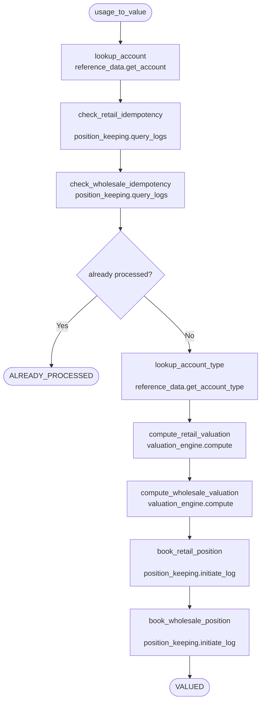

# PRD: Cookbook Browser - Visual Pattern & Component Explorer

## Problem Statement

PRD-034 restructured the frontend into feature modules and
created a component registry. PRD-035 built the Meridian
Cookbook: a unified, machine-readable registry of economy
patterns and UI components with MCP discovery tools.

The registry data is complete: 11 economy patterns with
manifest fragments, Starlark sagas, and composition metadata;
10+ UI component entries with feature module mappings. CI
validates everything. MCP tools can browse and discover.

But none of this is visible to humans.

The economy patterns exist as JSON metadata and code files
that only engineers can read. Starlark sagas — the most
expressive artefact in the platform — read as code when
their intent is a structured flow: "this service calls that
service, which calls that service." The composition
relationships between patterns (composes_with, extends,
conflicts_with) are declared in JSON but never visualised.

**Three gaps:**

1. **No browsable catalogue.** There is no page where a
   product manager, solutions architect, or tenant
   administrator can see what Meridian offers out of the
   box. The cookbook is invisible without `jq` or an MCP
   client.

2. **No visual saga rendering.** Starlark sagas contain
   structured, parseable flow information — named steps,
   service module calls, conditional branches, compensation
   paths — but are presented as raw code. This is like
   shipping Mermaid source without the renderer: the
   structure is there, but the visualisation is not.

3. **No dependency/composition graph.** Patterns declare
   rich relationships (depends on, composes with, conflicts
   with, extends) but these are invisible without querying
   JSON. A node graph would reveal the interconnected
   nature of Meridian's building blocks at a glance.

## Vision

A **Cookbook Browser** page in the Meridian frontend that
renders the registry as a visual catalogue with three views:

**Catalogue View** — Filterable grid of all registry entries
(patterns and UI components). Filter by type, category,
industry, complexity. Click to drill into detail.

**Pattern Detail View** — For economy patterns: rendered
manifest fragment, visual saga flow diagram, composition
relationships, and the raw Starlark (with the existing
CodeMirror editor in read-only mode). For UI components:
live rendered preview, prop documentation, feature module
context.

**Graph View** — Interactive node graph showing all patterns
and their relationships. Nodes are patterns; edges are
`registryDependencies`, `composes_with`, `extends`, and
`conflicts_with` (with distinct visual styles per
relationship type). Click a node to navigate to its detail.

### Starlark as Rendered Flow

The key insight: Starlark sagas have **parseable structure**
that maps directly to a visual flow diagram:

```text
Source (Starlark)                    Rendered (Flow)
─────────────────                    ───────────────
step(name="lookup_account")    →     [lookup_account]
  reference_data.get_account() →       ↓ reference_data

step(name="check_idempotency") →     [check_idempotency]
  position_keeping.query_logs()→       ↓ position_keeping

if logs.count > 0:             →     ◇ already processed?
    return ALREADY_PROCESSED   →       → [exit: skip]

step(name="compute_valuation") →     [compute_valuation]
  valuation_engine.compute()   →       ↓ valuation_engine

step(name="book_position")     →     [book_position]
  position_keeping.initiate()  →       ↓ position_keeping
```

This is analogous to how Markdown is easy to write but we
render it as formatted HTML. The `.star` file IS the source
of truth; the rendered flow is a presentation layer that
makes the intent accessible to non-engineers.

**What the renderer extracts from each saga:**

| Starlark construct | Visual element |
|--------------------|---------------|
| `step(name="...")` | Flow node (labelled box) |
| `service_module.method()` | Service badge on the node |
| `if ... return` | Decision diamond with exit path |
| Compensation steps | Red-tinted branch (reuse existing saga-timeline pattern) |
| Header comments (`# Trigger:`, `# Filter:`) | Trigger badge at flow entry |
| `saga(name="...")` | Flow title |

**Parsing approach:** The renderer does NOT execute Starlark.
It performs lightweight static analysis on the `.star` text:

- Line-by-line regex extraction of `step()` calls and
  their names (each step is a top-level call, never
  nested — Starlark's flat structure makes this safe)
- Regex extraction of `service_module.method()` calls
  within each step block (identified by the
  `module.method(` pattern between consecutive `step()`
  calls)
- Detection of `if ... return` blocks for early-exit
  paths
- Header comment parsing for trigger/filter metadata

This is intentionally simple. Starlark's bounded nature
(no while loops, no recursion, deterministic flow) means
that static analysis covers the vast majority of saga
structures without needing a full interpreter.

## Architecture

### Data Source: gRPC, Not MCP

**Decision**: The browser page fetches data through the
existing gRPC-Web transport (Connect-RPC), not MCP tools.

**Rationale**: MCP is a veneer over gRPC for AI agent
consumption. The frontend already has a Connect-RPC
transport with interceptors, auth, tenant context, and
React Query caching. Using MCP as a UI data source would:

- Add an unnecessary protocol hop (gRPC → MCP → frontend)
- Bypass existing auth/tenant interceptors
- Create a dependency on the MCP server for a traditional
  UI page
- Conflate AI-agent interfaces with human-UI interfaces

The cookbook data lives in two places:

1. **Static files** (`cookbook/` directory) — registry.json,
   pattern.json, component.json, manifest fragments, .star
   files. These are bundled at build time or served as
   static assets.

2. **Runtime state** (for discovery) — tenant's current
   manifest and economy structure, served by existing gRPC
   services (control-plane, reference-data).

For the catalogue and detail views, static file bundling
is sufficient. For the discovery view ("what can this
tenant add?"), the page calls existing gRPC services
directly.

### Static Content Strategy

The cookbook directory is small (< 1MB total) and changes
only on deployment. Two options:

**Option A: Build-time bundling** — A Vite plugin reads
`cookbook/` at build time and emits a JSON bundle. The
browser page imports it as a static module. Zero runtime
fetches for catalogue data.

**Option B: Static asset serving** — The cookbook directory
is served as static files via the existing Caddy/gateway
config. The browser page fetches `registry.json` on mount,
then fetches individual entries on drill-down.

**Recommendation**: Option A for the registry index and
pattern metadata (small, always needed), Option B for
`.star` file contents and manifest fragments (larger,
only fetched on detail view). This gives instant catalogue
load with lazy detail fetching.

### Component Architecture

```text
frontend/src/features/cookbook/
├── pages/
│   ├── index.tsx              # Catalogue grid view
│   └── detail.tsx             # Pattern/component detail
├── components/
│   ├── catalogue-grid.tsx     # Filterable card grid
│   ├── pattern-detail.tsx     # Economy pattern detail
│   ├── component-detail.tsx   # UI component detail
│   ├── saga-flow.tsx          # Mermaid flow diagram
│   ├── saga-flow-parser.ts   # .star text → flow model
│   ├── saga-mermaid.ts        # Flow model → Mermaid markup
│   ├── handler-reference.tsx  # Service module API docs
│   ├── composition-graph.tsx  # Node graph (patterns)
│   ├── manifest-viewer.tsx    # YAML syntax highlight
│   ├── linked-detail.tsx      # Split: editor + diagram + API ref
│   └── filter-bar.tsx         # Type/category/industry
├── hooks/
│   ├── use-cookbook.ts         # Registry data (static)
│   ├── use-handlers.ts        # Handler definitions (gRPC)
│   └── use-discovery.ts       # Tenant compatibility (gRPC)
├── lib/
│   └── star-parser.ts         # Starlark static analysis
└── index.ts
```

### Saga Flow Renderer

The saga flow component renders a vertical flow diagram
from parsed Starlark:

```typescript
// saga-flow-parser.ts output model
interface SagaFlow {
  name: string
  trigger: string | null       // "event:position-keeping..."
  filter: string | null        // CEL expression
  steps: SagaFlowStep[]
}

interface SagaFlowStep {
  name: string                 // from step(name="...")
  serviceCalls: ServiceCall[]  // service_module.method()
  earlyExit: EarlyExit | null  // if ... return
}

interface ServiceCall {
  service: string              // "position_keeping"
  method: string               // "initiate_log"
  params: string[]             // parameter names
}

interface EarlyExit {
  condition: string            // "logs.count > 0"
  returnStatus: string         // "ALREADY_PROCESSED"
}
```

**Visual rendering**: Each step is a card/node in a
vertical flow. Service calls show as coloured badges
(one colour per service module). Early exits branch off
as dashed paths to exit nodes. The trigger/filter renders
as the entry point at the top.

**No execution**: The renderer works entirely from the
`.star` text. It does not import Starlark, Go, or any
runtime. It is a text → visual transformation, like a
Mermaid renderer.

**Mermaid as the rendering engine**: The parsed flow
model maps directly to Mermaid flowchart syntax:



Mermaid is the right tool here because:

- The Starlark flow is inherently linear with branches
  — exactly what Mermaid flowcharts express
- mermaid.js is already a standard rendering library
  (< 50KB gzipped for the flowchart module)
- GitHub, GitLab, and Markdown tools render it natively,
  making the generated diagrams portable
- Starlark's bounded nature (no while loops, no
  recursion) means every saga maps to a finite flowchart

The parser generates Mermaid markup as a string; the
component renders it with mermaid.js. This keeps the
rendering stateless and cacheable.

### Service Module Reference (Live from handlers.yaml)

The `handlers.yaml` files are the **runtime source of
truth** for every service module available to Starlark.
The saga engine reads them at startup to build
type-safe service modules. The browser renders the
same data — not a copy, not documentation that can
drift, but the actual interface definitions the
platform enforces at execution time.

**This is not documentation. It is the code rendered.**

The handlers.yaml is to Starlark service modules what
proto files are to gRPC services: the authoritative
contract. The browser visualises this contract the
same way a proto viewer renders `.proto` files — from
the source, not from hand-written docs.

**What each handler definition contains:**

| Field | Runtime purpose | Visual rendering |
|-------|----------------|-----------------|
| `description` | Logged in saga audit trail | Handler summary text |
| `params` (typed, required/optional) | Enforced at script load time | Parameter signature |
| `returns` | Available to subsequent saga steps | Return type table |
| `compensate` | Automatic rollback on saga failure | Compensation chain link |

**Rendered as a browsable reference:**

```text
Service: position_keeping

  initiate_log(account_id, instrument_code, direction, amount, ...)
    Initiate a position log entry for a DEBIT or CREDIT.
    Params: account_id (string, required), instrument_code (string, required), ...
    Returns: log_id (string), position_id (string)
    Compensates via: position_keeping.cancel_log

  query_logs(correlation_id, instrument_code, account_id)
    Query position logs by correlation ID and filters.
    Params: correlation_id (string, required), ...
    Returns: count (int), logs (array)
```

**Data path**: The handlers.yaml is already parsed by
the schema registry at startup and served via an
existing gRPC endpoint (`handlers_describe`). The
browser reads from this same endpoint — no new data
path, no separate docs to maintain. When a developer
adds a parameter to handlers.yaml, it appears in the
browser on the next deploy because it IS the same
data.

**Why this matters**: The Starlark sagas look simple
because the service modules hide the complexity. The
service module reference reveals what's behind each
`service.method()` call — parameter types, return
values, and crucially, the compensation chain that
makes rollback automatic. Without this context, a
reader sees `position_keeping.initiate_log(...)` and
has to guess what it does. With the reference, they
see the live contract the platform enforces.

### Linked Experience

The three views — editor, flow diagram, and API
reference — are interconnected:

```text
+---------------------------+---------------------------+
|  Starlark Editor          |  Flow Diagram (Mermaid)   |
|                           |                           |
|  step("create_lien")  <---|--- [create_lien]          |
|  lien = payment_order.    |       payment_order       |
|    create_lien(...)       |           |               |
|                           |    [dispatch_payment]     |
|  step("dispatch")         |       financial_gateway   |
|  ...                      |                           |
+---------------------------+---------------------------+
|  API Reference (collapsible)                          |
|  > payment_order.create_lien                          |
|    Params: account_id (string, required), ...         |
|    Returns: lien_id, bucket_id                        |
|    Compensates via: payment_order.terminate_lien       |
+-------------------------------------------------------+
```

**Interactions:**

- Click a node in the Mermaid diagram → scroll to and
  highlight the corresponding `step()` block in the
  editor
- Click a `service.method()` call in the editor →
  expand the API reference panel for that handler
- Hover a service badge in the flow diagram → tooltip
  showing handler signature and compensation chain

This linked experience is what makes the cookbook
browser more than a static catalogue: it's an
interactive exploration tool where the visual flow,
the source code, and the API documentation are all
connected.

### Composition Graph

An interactive node graph using a lightweight graph
library (e.g., @xyflow/react, d3-force, or elkjs for
layout):

**Nodes**: Each registry:pattern entry. Sized by
complexity score. Coloured by category.

**Edges** (four types, visually distinct):

| Relationship | Edge style | Meaning |
|-------------|-----------|---------|
| `registryDependencies` | Solid arrow | Must install first |
| `composes_with` | Dashed line | Works well together |
| `extends` | Thick arrow | Builds on top of |
| `conflicts_with` | Red dashed | Cannot combine |

**Interaction**: Click a node to navigate to detail.
Hover to highlight connected patterns. Filter to show
only patterns matching a category or industry.

**Layout**: Force-directed for overview, with foundation
patterns (base-fiat-*) gravitating to the centre and
leaf patterns at the edges. The graph should feel like
a dependency map that reveals the platform's
composability at a glance.

### UI Component Preview

For `registry:ui` entries, the detail view renders:

1. **Live preview** — The actual React component rendered
   with sample props. The component already exists in the
   frontend codebase; the browser page imports and renders
   it with mock data.

2. **Prop table** — From the component.json metadata:
   configurable props, types, defaults.

3. **Feature module context** — Where this component is
   used (`meta.used_by`), whether it's tenant-configurable,
   and its registry dependencies.

This is the Storybook replacement that PRD-034 deferred.
The difference: it lives inside the app itself, uses real
theme tokens, and is queryable alongside economy patterns.

### Routing

```text
/cookbook                        # Catalogue grid (all entries)
/cookbook?type=pattern           # Filtered to economy patterns
/cookbook?type=ui                # Filtered to UI components
/cookbook?category=energy        # Filtered by category
/cookbook/:name                  # Detail view (auto-detects type)
/cookbook/graph                  # Full composition graph
```

The cookbook page is a feature module in the sidebar
under a "Platform" or "Developer" section. It is not
tenant-configurable (the cookbook content is the same
for all users). Access control (which roles see the
page) is an open question — see OQ5.

## Implementation Phases

### Phase 1: Catalogue Page

- Create `features/cookbook/` module
- Build-time bundling of `cookbook/registry.json` +
  all `pattern.json` / `component.json` files
- Filterable grid with cards showing name, type,
  description, complexity, categories
- Route: `/cookbook`
- No detail view yet (cards link to nowhere)

### Phase 2: Pattern Detail View

- Pattern detail page with sections: description,
  manifest fragment (YAML syntax highlighted), raw
  Starlark (existing CodeMirror editor, read-only),
  composition metadata
- Lazy loading of `.star` and `.yaml` file contents
- Route: `/cookbook/:name`

### Phase 3: Saga Flow Renderer (Mermaid)

- Starlark static parser (`star-parser.ts`) — regex
  extraction of `step()`, `service.method()`, and
  `if...return` blocks
- Mermaid markup generator from parsed flow model
- Render with mermaid.js in pattern detail view
- Shows trigger/filter as entry node, steps as
  rectangles with service badges, branches as diamonds,
  compensation as dashed edges
- Integrated as primary view above the raw code editor

### Phase 4: Service Module Reference

- Fetch handler definitions from existing gRPC
  endpoint (handlers_describe)
- Render as collapsible API reference panel: service
  name, handler signature, typed params, returns,
  compensation chain
- Shown alongside saga detail — click a
  `service.method()` in the code or flow diagram to
  expand the relevant handler docs
- No separate documentation — this IS the runtime
  contract rendered

### Phase 5: Linked Experience

- Click a Mermaid node → scroll to the corresponding
  `step()` in the CodeMirror editor
- Click a service call in the editor → expand the
  API reference for that handler
- Hover a service name in the flow diagram → tooltip
  with handler signature and compensation chain
- Split-panel layout: editor left, diagram right,
  API reference below (collapsible)

### Phase 6: Composition Graph

- Node graph component using @xyflow/react with elkjs
  layout
- Renders all patterns with four edge types
- Interactive: click to navigate, hover to highlight,
  filter by category/industry
- Route: `/cookbook/graph`
- Also embedded as a mini-graph on each pattern detail
  (showing immediate neighbours only)

### Phase 7: UI Component Preview

- Live component rendering with mock data
- Prop table from component.json metadata
- Feature module usage context
- Integrated into detail view for `registry:ui` entries

### Phase 8: Tenant Discovery View (Optional)

- "What can I add?" panel that calls existing gRPC
  services to inspect the tenant's current manifest
- Shows compatible patterns with reasons (replicates
  the HATEOAS discovery logic from MCP, but using
  gRPC directly)
- This phase depends on whether the discovery logic
  is extracted to a shared Go package or duplicated
  in the frontend

## Technology Choices

### Saga Flow Rendering

**Decision: Mermaid** — Parse `.star` → generate Mermaid
flowchart syntax → render with mermaid.js.

Rationale:

- Starlark's bounded structure (no while, no recursion)
  maps perfectly to finite Mermaid flowcharts
- mermaid.js is lightweight (< 50KB gzipped for
  flowcharts), well-maintained, and renders natively
  in GitHub/GitLab/Markdown tools
- The generated Mermaid markup is portable — it can be
  embedded in ADRs, PRDs, or issue descriptions
- Mermaid handles layout automatically (no manual
  positioning or force-directed physics)
- The parser output is a string (Mermaid markup), not
  a component tree — trivially cacheable and testable

Alternatives considered:

- **@xyflow/react**: More interactive (drag, zoom) but
  adds ~150KB, requires layout logic, and the
  interactivity isn't needed for a read-only flow view
- **Custom SVG**: Full design control but high
  implementation cost for layout algorithms

### Composition Graph

**Decision: @xyflow/react (React Flow)** — For the
pattern relationship graph only (not saga flows).

The composition graph benefits from interactivity
(click to navigate, hover to highlight neighbours,
filter by category) in a way that saga flows do not.
Force-directed layout with **elkjs** running in a web
worker for automatic positioning.

This means two rendering approaches:

| View | Library | Why |
|------|---------|-----|
| Saga flow | mermaid.js | Linear flow, read-only, portable |
| Composition graph | @xyflow/react | Interactive exploration, force layout |

## Open Questions

1. **Parser scope**: The initial parser covers `step()`,
   `service.method()`, and `if...return` — sufficient
   for all current cookbook patterns. The open question
   is whether to extend it proactively (e.g., `for`
   loops, nested function calls) or reactively when a
   new pattern requires it. SC8 requires the parser to
   handle all patterns without manual annotation; this
   question is about how far ahead to build.

2. **Graph library weight**: @xyflow/react adds ~150KB
   gzipped. Is this acceptable for a staff-only page?
   Alternative: render to SVG server-side and serve as
   static images (loses interactivity).

3. **Component preview mocking**: UI component previews
   need sample data. Where does this come from?
   Options: hardcoded fixtures in component.json, a
   `preview` field with sample props, or generated from
   prop types. **Constraint**: Preview fixtures must be
   synthetic data only — never real tenant or production
   data. The browser is a platform tool, not a tenant
   data viewer.

4. **Discovery duplication**: The HATEOAS discovery logic
   currently lives in the MCP server (Go). Phase 8
   needs this in the frontend. Options: call existing
   gRPC services and compute compatibility client-side,
   add a dedicated gRPC endpoint for discovery, or
   skip Phase 8 and keep discovery MCP-only.

5. **Access control**: Should the cookbook browser be
   visible to all staff, or gated behind a role
   (e.g., admin, developer)? Tenant administrators
   might benefit from seeing available patterns;
   operations staff probably don't need it.

## Non-Goals

- Editing patterns or components from the browser
  (the browser is read-only; authoring follows the
  existing file-based workflow)
- Executing sagas from the browser (use the existing
  saga management pages)
- MCP as the data protocol for this UI (gRPC and static
  files only)
- Mobile-responsive layout (staff-only, desktop assumed)
- Starlark execution or simulation (static analysis
  only)

## Success Criteria

1. A staff user can browse all cookbook entries from a
   single page, filtered by type, category, or industry
2. Economy pattern details show a Mermaid flow diagram
   that communicates the service call chain without
   reading code
3. Service module handlers are browsable as a live API
   reference rendered from the same handlers.yaml that
   the runtime enforces — no separate docs to maintain
4. Clicking a node in the flow diagram highlights the
   corresponding step in the code editor; clicking a
   service call opens its handler reference
5. The composition graph reveals pattern relationships
   (depends, composes, extends, conflicts) as an
   interactive node graph
6. UI component details show a live rendered preview
   with prop documentation
7. All data comes from gRPC or static files — no MCP
   dependency
8. The saga flow parser handles all cookbook patterns
   present at implementation time without manual
   annotation (currently 11; this criterion scales
   with the registry)
9. Page loads in < 2s on a standard connection
   (static bundling for catalogue, lazy fetch for detail)

## Relationship to Previous PRDs

| PRD | What it built | What this PRD adds |
|-----|--------------|-------------------|
| 034 | Feature modules, component registry schema, theme preview panel | UI component live preview, the visual catalogue PRD-034 deferred |
| 035 | Economy patterns, MCP discovery tools, CI validation, authoring guides | Human-visible presentation layer for all cookbook content |
| **036** | — | **The visual browser that makes 034 + 035 accessible to non-engineers** |

PRD-034 explicitly listed "Storybook or similar visual
component browser" as a non-goal, noting that "the
component registry replaces this need." In practice,
the registry serves AI consumers well but leaves humans
without a visual catalogue. This PRD closes that gap
without reintroducing Storybook — the browser lives
inside the app, uses the same theme, and covers both
UI components and economy patterns in one unified view.
