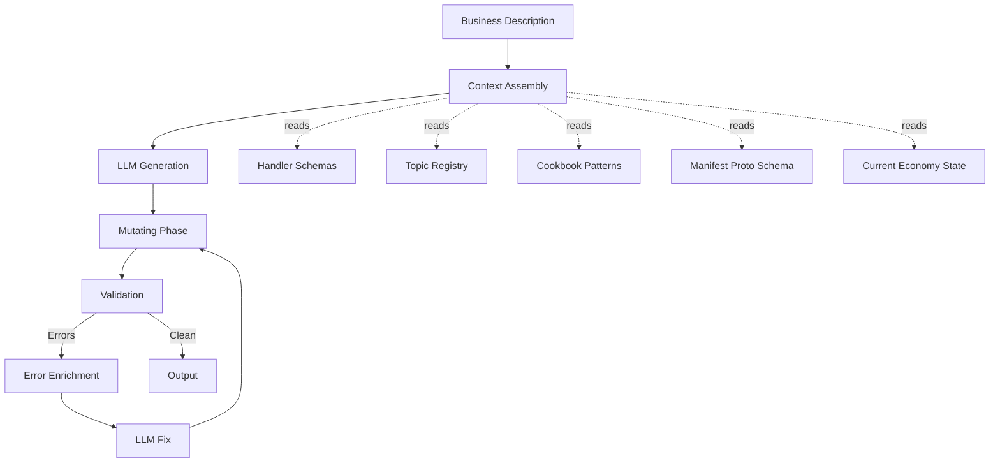

# PRD: Economy Generator — From Business Description to Running Economy

## Problem Statement

Meridian has a complete manifest lifecycle (validate -> plan -> apply) and a rich
set of building blocks (instruments, account types, sagas, valuation rules). But
creating a new economy requires deep knowledge of:

- The manifest proto schema (30+ message types, nested structures)
- Handler schemas (`handlers.yaml`) for valid Starlark service calls
- Topic registry for event triggers
- Cookbook patterns for industry-specific configurations
- Cross-reference rules (instruments referenced by account types, sagas, valuation rules)

Today, manifests are hand-authored. A developer must read documentation, study
cookbook patterns, and manually assemble YAML. This is the "assembly language"
experience — correct but laborious.

The typed service modules (PRD-039) closed the validation gap: invalid handler
calls are caught at manifest validation time. The cookbook (PRD-035) provides
discoverable patterns. The relationship graph provides impact analysis. What's
missing is the **synthesis step** — taking a business description and producing a
manifest that passes the type checker.

## Vision

An MCP tool — `meridian_economy_generate` — that accepts a business description
and returns a validated manifest ready for plan and apply. The tool packages the
right context for LLM generation, runs a validate-fix loop, and returns a clean
result.

The tagline from PRD-039: **"Describe your business. We build your economy."**

This PRD delivers the backend engine. PRD-042 delivers the frontend IDE that
calls it.

## Goals

1. **Single MCP tool** that takes natural language and returns a valid manifest
2. **Context packaging** that gives the LLM enough information to generate correctly
3. **Validate-fix loop** that catches and repairs generation errors automatically
4. **Amend mode** for incremental changes to existing economies
5. **Structured output** with generation metadata (patterns used, decisions made, warnings)

## Non-Goals

1. **Frontend UI** — PRD-042 handles the conversational interface
2. **Template engine** — no Jinja/Mustache; the LLM generates directly
3. **Package manager** — no `meridian install`; copy-and-own (shadcn model)
4. **Simulation** — PRD-039 Phase 4 handles what-if analysis
5. **Multi-turn conversation management** — the tool is stateless; conversation
   state lives in the calling client (MCP client, IDE, Claude Code)

## Architecture

### The Generation Pipeline



### Component Design

#### 1. Context Assembler

Packages the generation context — everything the LLM needs to produce a valid
manifest. This is the critical component that determines generation quality.

**Static context** (same for all generations):

| Source | What It Provides | How It's Packaged |
|--------|-----------------|-------------------|
| `manifest.proto` | Field names, types, constraints, enums | Extracted schema summary (not raw proto) |
| `handlers.yaml` | Valid handler names, parameters, types, compensation | Handler reference card |
| `topics.All()` | Valid event trigger channels | Topic list with descriptions |
| `api/asyncapi/*.yaml` | Event payload schemas | Field lists per topic |
| `cookbook/registry.json` | Pattern metadata, composition rules | Pattern index with `provides`/`requires`/`composes_with` |

**Dynamic context** (varies per request):

| Source | What It Provides | When Included |
|--------|-----------------|---------------|
| Current manifest | Existing economy state | Amend mode only |
| Relationship graph | Cross-resource dependencies | Amend mode only |
| Cookbook pattern details | Full manifest fragments, saga scripts | When matched patterns are relevant |

**Context budget**: The assembler must respect token limits. Strategy:

1. Always include: handler reference card, topic list, manifest schema summary
2. Include when relevant: matched cookbook patterns (top 3 by relevance)
3. Include in amend mode: current manifest + graph summary
4. Never include: raw proto files, full AsyncAPI specs, all cookbook details

The context assembler produces a **generation prompt** — a structured document
with sections that the LLM can reference. Not a template to fill in; a reference
guide alongside the business description.

#### 2. LLM Generator

Takes the assembled context + business description and produces a manifest YAML
string. This is a single LLM call with structured output guidance.

**Prompt structure**:

```text
You are generating a Meridian economy manifest.

## Business Description
{user_input}

## Manifest Schema Reference
{schema_summary}

## Available Handlers
{handler_reference_card}

## Available Event Topics
{topic_list}

## Relevant Patterns
{matched_cookbook_patterns}

## Current Economy (amend mode only)
{current_manifest_yaml}

## Instructions
Generate a complete manifest YAML. Requirements:
- Every handler call in Starlark scripts must use handlers from the reference
- Every event trigger must reference a topic from the list
- Every account_type.allowed_instruments must reference instruments defined above
- Include metadata.name, metadata.industry, metadata.description
- Return ONLY the manifest YAML, no explanation
```

**Model selection**: The generator uses the MCP server's configured model. No
hardcoded model dependency.

#### 3. Validate-Fix Loop

After generation, the manifest enters the existing validation pipeline. If
validation fails, errors are enriched and fed back to the LLM for repair.

```text
Loop (max 3 iterations):
  1. Run mutating phase (auto-convert deprecated handler calls)
  2. Run full validation (typed modules, CEL, triggers, cross-refs)
  3. If clean: break
  4. If errors:
     a. Format errors with location, code, suggestion, available values
     b. Send to LLM: "Fix these validation errors in the manifest: {errors}"
     c. LLM returns corrected manifest
     d. Continue loop
```

The validate-fix loop leverages the structured error model from PRD-039 (section
2.5). Errors include `suggestion` and `available` fields — exactly what an LLM
needs to self-correct.

**Max iterations**: 3. If the manifest still has errors after 3 fix attempts,
return the manifest with remaining errors. The calling client can show these to
the user for manual resolution.

#### 4. Output Formatter

Returns the generation result with metadata:

```json
{
  "manifest_yaml": "version: '1.0'\nmetadata:\n  name: ...",
  "valid": true,
  "validation_errors": [],
  "validation_warnings": [
    {
      "code": "DEPRECATED_HANDLER",
      "location": "sagas[0].script:8",
      "message": "handler position_keeping.initiate_log is deprecated",
      "suggestion": "Use position_keeping.record_entry instead"
    }
  ],
  "generation_metadata": {
    "patterns_used": ["energy-settlement", "time-of-use-pricing"],
    "instruments_created": ["GBP", "KWH"],
    "account_types_created": ["FLEET_RECEIVABLE", "ENERGY_DELIVERED", "CHARGING_REVENUE"],
    "sagas_created": ["record_charging_session", "monthly_fleet_invoice"],
    "fix_iterations": 1,
    "decisions": [
      "Selected GBP as settlement currency (UK market)",
      "Added time-of-use pricing based on peak/off-peak mention",
      "Created OCPP webhook trigger for charger data"
    ]
  },
  "relationship_graph": {
    "nodes": [...],
    "edges": [...]
  }
}
```

### MCP Tool Interface

#### `meridian_economy_generate`

**Category**: `CategorySimulate` (no side effects — generates but does not apply)

**Input schema**:

```json
{
  "type": "object",
  "properties": {
    "description": {
      "type": "string",
      "description": "Natural language description of the business and its economy requirements"
    },
    "mode": {
      "type": "string",
      "enum": ["create", "amend"],
      "default": "create",
      "description": "create: new economy from scratch. amend: modify existing economy"
    },
    "tenant_id": {
      "type": "string",
      "description": "Required for amend mode. The tenant whose economy to modify"
    },
    "preferences": {
      "type": "object",
      "description": "Optional generation preferences",
      "properties": {
        "industry": {
          "type": "string",
          "description": "Industry hint (energy, finance, logistics, saas)"
        },
        "instruments": {
          "type": "array",
          "items": { "type": "string" },
          "description": "Preferred instrument codes to include"
        },
        "patterns": {
          "type": "array",
          "items": { "type": "string" },
          "description": "Cookbook pattern names to use as guidance"
        }
      }
    },
    "max_fix_iterations": {
      "type": "integer",
      "default": 3,
      "minimum": 0,
      "maximum": 5,
      "description": "Maximum validate-fix loop iterations"
    }
  },
  "required": ["description"]
}
```

#### `meridian_economy_generate_context`

A companion read-only tool that returns the generation context without running
the LLM. Useful for AI clients that want to do their own generation.

**Category**: `CategoryRead`

**Input schema**:

```json
{
  "type": "object",
  "properties": {
    "description": {
      "type": "string",
      "description": "Business description (used for pattern matching)"
    },
    "include_patterns": {
      "type": "boolean",
      "default": true,
      "description": "Include matched cookbook pattern details"
    },
    "include_current_economy": {
      "type": "boolean",
      "default": false,
      "description": "Include current tenant economy state"
    },
    "tenant_id": {
      "type": "string",
      "description": "Required if include_current_economy is true"
    }
  },
  "required": ["description"]
}
```

**Output**: The assembled context document (handler reference card, topic list,
matched patterns, schema summary). This enables "bring your own LLM" workflows
where Claude Code or another client generates the manifest directly using the
context.

### Generation Modes

#### Create Mode

For new economies with no existing state. The full pipeline:

1. Assemble static context + matched patterns
2. Generate manifest from business description
3. Validate-fix loop
4. Return result

#### Amend Mode

For modifying existing economies. Adds current state awareness:

1. Load current manifest via `meridian_economy_structure`
2. Load relationship graph via `meridian_economy_graph`
3. Assemble context including current state
4. Generate **diff instructions**: what to add, modify, remove
5. Apply diff to current manifest
6. Validate-fix loop (with destructive change detection)
7. Return result with impact analysis

Amend mode is harder than create — the LLM must understand the existing economy
and produce changes that don't break running operations. The relationship graph
and destructive change detection (PRD-039 task 12) provide the safety net.

### Pattern Matching

The context assembler uses cookbook pattern metadata to select relevant patterns:

1. **Industry match**: `meta.industries` contains the detected industry
2. **Keyword match**: Business description terms match pattern `provides` fields
3. **Composition rules**: Selected patterns checked for `composes_with` compatibility
4. **Conflict check**: `conflicts_with` prevents incompatible pattern combinations

Pattern content (manifest fragments, saga scripts) is included as few-shot
examples in the generation prompt — not as templates to fill in. The LLM
dissolves patterns into its output.

### Error Recovery

The structured error model from PRD-039 (section 2.5) is the foundation:

| Error Code | Recovery Strategy |
|-----------|-------------------|
| `UNKNOWN_HANDLER` | LLM receives error + `available` list, picks closest match |
| `MISSING_REQUIRED_PARAM` | LLM adds the missing parameter |
| `WRONG_PARAM_TYPE` | LLM corrects the type |
| `UNKNOWN_EVENT_TOPIC` | LLM receives `suggestion` (Did you mean?) |
| `DANGLING_INSTRUMENT_REF` | LLM adds the missing instrument or fixes the reference |
| `DEPRECATED_HANDLER` | Auto-fixed by mutating phase (no LLM needed) |

Errors that persist after max iterations are returned to the caller. The
calling client (IDE, Claude Code) can present them for manual resolution.

## Implementation Phases

### Phase 1: Context Assembler and Read-Only Tool

- Build context assembler: handler reference card, topic list, schema summary
- Implement `meridian_economy_generate_context` MCP tool
- Pattern matcher: industry/keyword matching against cookbook registry
- Unit tests: context assembly produces correct reference documents

This phase delivers value immediately — AI clients can use the context tool to
generate manifests themselves, without waiting for the full generate tool.

### Phase 2: Generate Tool (Create Mode)

- Implement `meridian_economy_generate` MCP tool (create mode only)
- LLM generation with assembled context
- Validate-fix loop (max 3 iterations)
- Output formatter with generation metadata
- Integration tests: business description -> valid manifest
- Golden file tests: known descriptions produce expected output structure

### Phase 3: Amend Mode

- Load current economy state and relationship graph
- Diff-aware generation: add/modify/remove instructions
- Destructive change detection integration
- Impact analysis in output
- Integration tests: amend existing economy without breaking it

### Phase 4: Quality and Refinement

- Prompt engineering: improve generation accuracy across industries
- Pattern utilisation metrics: track which patterns are used
- Error analysis: identify common generation failures, add targeted fixes
- Performance: context assembly caching for repeated generations

## Testing Strategy

### Unit Tests

- Context assembler produces correct handler reference cards
- Pattern matcher selects relevant patterns for known industries
- Output formatter includes all required metadata fields
- Error enrichment formats validation errors for LLM consumption

### Integration Tests

- **Create mode**: "EV charging network UK" -> valid manifest with GBP, KWH instruments
- **Create mode**: "SaaS billing platform" -> valid manifest with subscription sagas
- **Amend mode**: Add carbon credits to existing energy economy -> new instruments + sagas
- **Validate-fix loop**: Deliberately inject errors, verify self-correction

### Golden File Tests

For regression detection. Known business descriptions should produce manifests
with specific structural properties (not exact YAML match, but presence of
expected instruments, account types, sagas).

## Success Criteria

1. `meridian_economy_generate` produces a valid manifest (passes `meridian_manifest_validate`)
   for 5 known industry descriptions without manual intervention
2. Validate-fix loop resolves at least 80% of first-pass generation errors
3. Amend mode preserves existing economy structure (no unintended removals)
4. Context assembly completes in < 500ms (LLM call time excluded)
5. Any MCP client (Claude Code, ChatGPT, custom agent) can call the tool

## Open Questions

1. **Model flexibility**: Should the generate tool accept a model parameter, or
   always use the MCP server's configured model? (Recommendation: use configured
   model, keep the tool simple.)

2. **Streaming**: Should the generate tool stream partial results during the
   validate-fix loop? (Recommendation: no streaming in v1. Return final result.
   The calling client can show a spinner.)

3. **Cost control**: The validate-fix loop makes multiple LLM calls. Should there
   be a cost/token budget parameter? (Recommendation: max_fix_iterations is
   sufficient control for v1.)

4. **Context window**: If the current economy is very large (50+ sagas), the amend
   mode context may exceed token limits. Strategy: summarise the current economy
   rather than including full YAML. (Recommendation: handle in Phase 3.)
