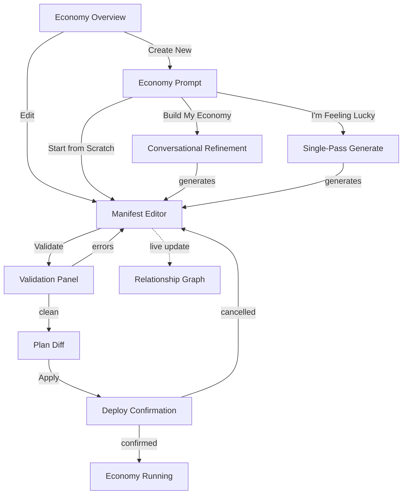
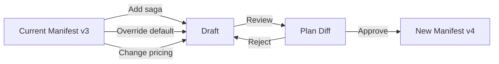

# PRD: Economy IDE — Conversational Creation and Manifest Editor

## Problem Statement

Meridian has all the backend machinery for economy management:

- Manifest validate/plan/apply via gRPC and MCP tools
- Typed service modules that catch invalid handler calls
- Cookbook patterns for industry-specific configurations
- Relationship graph for cross-resource dependency analysis
- Handler evolution with auto-conversion of deprecated calls

But there is no UI for creating or editing economies. Tenants must:

1. Hand-author manifest YAML (requires schema knowledge)
2. Call `ManifestValidate` via gRPC or MCP (requires API tooling)
3. Review validation errors in raw JSON (requires parsing structured errors)
4. Call `ManifestPlan` to see what will change (requires reading diff output)
5. Call `ManifestApply` to deploy (requires tenant admin role)

This is a developer-only workflow. Non-technical operators cannot create or
modify their economy configuration. Even developers find it slow — there is no
inline validation, no autocomplete, no visual feedback.

The operations console (PRD-026) provides dashboards for monitoring running
economies but has no creation or editing capability.

## Vision

An **Economy IDE** inside the Meridian frontend — a feature module that provides:

1. **Conversational prompt**: Describe your business, get a manifest
2. **Manifest editor**: YAML editing with syntax highlighting and inline validation
3. **Deploy wizard**: Validate -> plan diff -> one-click apply
4. **Relationship graph**: Visual dependency map that updates as you edit
5. **Economy explorer**: Navigate the running economy, see where sagas and
   triggers are attached, discover unbound events, override platform defaults
6. **Draft changes**: Compose pending modifications (like a PR) that accumulate
   into a new manifest version for review before deployment

The IDE follows the shadcn philosophy: the user sees the actual manifest
YAML and owns every line. The conversational prompt is an on-ramp; the
editor is where real work happens. The economy explorer is how operators
understand and incrementally evolve their running economy.

## Goals

1. **Create economies via conversation** — prompt -> generate -> review -> deploy
2. **Edit manifests with inline feedback** — syntax errors, validation errors,
   handler autocomplete, cross-reference warnings as you type
3. **Deploy with confidence** — plan diff shows exactly what will change
4. **Understand dependencies** — relationship graph shows how resources connect
5. **Explore the running economy** — navigate system elements, see attached
   sagas/triggers, discover unbound events, override platform defaults
6. **Draft and review changes** — compose pending modifications into a new
   manifest version, review the aggregate diff, optionally get team approval
7. **Works without the generator** — manual YAML editing is a first-class path

## Non-Goals

1. **Form-based wizard** — no step-by-step form; the manifest editor is the interface
2. **Visual drag-and-drop** — not building a node editor; YAML + graph view
3. **Real-time collaboration** — single-user editing for v1
4. **Economy simulation** — PRD-039 Phase 4; this PRD is create/edit/deploy
5. **Operator dashboard** — PRD-039 Phase 3.5 covers operational monitoring

## Architecture

### Architectural Principle: gRPC First, MCP as Client

All IDE backend capabilities are implemented as **gRPC service RPCs first**.
The MCP server is a thin client wrapper — it holds gRPC stubs and translates
MCP tool calls into gRPC requests. The React frontend calls the same gRPC
services via the Vanguard transcoder (HTTP/JSON -> gRPC).

```text
gRPC Service (source of truth)
  ├── React frontend (calls gRPC via Vanguard transcoder)
  ├── MCP server (thin wrapper, calls gRPC stubs)
  └── Claude Code / scripts (can call gRPC directly)
```

**Implementation rule**: If a new capability is needed, define a proto RPC
first, implement the service handler, then add the MCP tool as a thin
client wrapper. Never put business logic in the MCP tool handler.

This means all features described in this PRD — validation, plan, apply,
economy graph, economy structure, handler metadata — are gRPC RPCs that
happen to also be exposed as MCP tools. Claude Code can call gRPC directly
via scripts without relying on MCP as the only integration path.

### Feature Module Structure

Following the existing frontend pattern (`frontend/src/features/`):

```text
frontend/src/features/economy/
├── components/
│   ├── economy-prompt.tsx          # Conversational input
│   ├── manifest-editor.tsx         # YAML editor with validation
│   ├── manifest-diff.tsx           # Plan diff viewer
│   ├── deploy-wizard.tsx           # Validate -> plan -> apply flow
│   ├── relationship-graph.tsx      # Dependency visualization
│   ├── generation-status.tsx       # Progress during generate + fix loop
│   └── validation-panel.tsx        # Structured error/warning display
├── hooks/
│   ├── use-manifest-validate.ts    # Calls ManifestValidate RPC
│   ├── use-manifest-plan.ts        # Calls ManifestPlan RPC
│   ├── use-manifest-apply.ts       # Calls ManifestApply RPC
│   ├── use-economy-generate.ts     # Calls GeneratorService.GenerateManifest RPC (PRD-041)
│   ├── use-economy-graph.ts        # Calls meridian_economy_graph
│   └── use-economy-structure.ts    # Calls meridian_economy_structure
├── pages/
│   ├── economy-create.tsx          # New economy creation page
│   ├── economy-edit.tsx            # Edit existing economy
│   └── economy-overview.tsx        # Current economy summary + graph
└── lib/
    ├── manifest-schema.ts          # Manifest field metadata for autocomplete
    ├── validation-formatter.ts     # Format structured errors for inline display
    └── graph-layout.ts             # Relationship graph layout helpers
```

### Screen Flow



### Core Screens

#### 1. Economy Prompt

The entry point for new economies. Three paths:

**"Build My Economy"** (interactive):

- Text area for business description
- Submit triggers generation via `meridian_economy_generate` (PRD-041)
- While generating: show progress (context assembly, generation, validation, fix iterations)
- On completion: open manifest editor with generated YAML

**"I'm Feeling Lucky"** (single-pass):

- Same text area, but skips conversation
- Generates, validates, shows plan diff immediately
- Always stops at preview — never auto-applies

**"Start from Scratch"** (manual):

- Opens empty manifest editor with a skeleton template:

```yaml
version: "1.0"
metadata:
  name: ""
  industry: ""
  description: ""

instruments: []
account_types: []
sagas: []
```

The prompt page works with or without the generator backend (PRD-041). If the
generator is not available, "Build My Economy" and "I'm Feeling Lucky" are
disabled. "Start from Scratch" always works.

#### 2. Manifest Editor

The core editing experience. A YAML editor with:

**Syntax highlighting**: Standard YAML highlighting plus Meridian-specific:

- Starlark code blocks within `script:` fields
- CEL expressions within `filter:` and `validation:` fields
- Instrument codes, handler names as distinct token types

**Inline validation**: As the user types (debounced 500ms), call
`ManifestValidate`. Each request carries a monotonic sequence number; stale
responses (from older drafts) are discarded when a newer response has arrived:

- Errors displayed inline at the relevant YAML line
- Warnings displayed with lower visual weight
- Structured error panel below the editor for full details
- "Did you mean?" suggestions are clickable (auto-fix)
- In-flight validation cancelled on new edit (abort controller pattern)

**Handler autocomplete**: Within `script:` blocks, provide autocomplete for:

- Service module names (`position_keeping`, `financial_accounting`)
- Handler names (`position_keeping.initiate_log`)
- Parameter names (`account_id`, `instrument_code`, `quantity`)
- Enum values (`DEBIT`, `CREDIT`, `FIAT`, `COMMODITY`)

Autocomplete data sourced from `HandlerService.DescribeHandlers` RPC
(exposed as `meridian_handlers_describe` MCP tool), called at page init
and cached for the session. This is the single canonical source for
handler metadata (no compiled schema file — aligns with PRD-040's
elimination of standalone handler schema files).

**Layout**: Split view:

- Left: YAML editor (70% width)
- Right: Relationship graph (30% width), renders the persisted economy state
  or the graph returned from the latest `ManifestValidate` response (which
  includes relationship graph extraction). In v1, the graph updates after
  each successful validation pass, not on every keystroke. Validation
  requests use a monotonic sequence counter — stale responses from older
  drafts are discarded when a newer validation has already completed.
  When validation fails, the graph panel shows a "stale" indicator over the
  last valid graph and disables interaction until the next successful
  validation. This prevents users from reasoning about an outdated graph

#### 3. Validation Panel

Displays structured validation results. Mirrors the error model from PRD-039
section 2.5:

| Column | Source |
|--------|--------|
| Severity | `error` (red) or `warning` (amber) |
| Code | Machine-readable code (e.g., `UNKNOWN_HANDLER`) |
| Location | YAML path + line number, clickable to jump to editor |
| Message | Human-readable description |
| Suggestion | "Did you mean?" with clickable auto-fix |

Errors sorted by: severity (errors first), then location (top-to-bottom in YAML).

Conversion warnings (from the mutating phase) displayed separately:
"Auto-converted: `initiate_log` -> `record_entry` (3 occurrences)"

#### 4. Plan Diff

After validation passes, the user clicks "Plan" to see what will change.
Calls `ManifestPlan` and displays the structured diff:

- **New resources**: Green highlight (instruments, account types, sagas to be created)
- **Modified resources**: Amber highlight with before/after comparison
- **Removed resources**: Red highlight with dependency warning

The plan diff includes the `plan_hash` required for apply. The user reviews
the diff and clicks "Apply" to proceed.

**Plan hash invalidation**: Any manifest edit after `ManifestPlan` invalidates
the current diff and `plan_hash`. The UI must disable the Apply button and
require the user to re-run Plan before deployment. This prevents deploying a
manifest that differs from the reviewed diff.

For new economies (no existing state), the plan shows all resources as "New."

#### 5. Deploy Confirmation

A modal before apply:

- Summary: "This will create 3 instruments, 5 account types, 2 sagas"
- Warnings: Any validation warnings that were not errors
- Impact: Relationship graph changes (new edges highlighted)
- Button: "Deploy Economy" (requires admin role, enforced by RBAC)

On success: redirect to economy overview with live relationship graph.

On failure: show apply error with "Back to Editor" option.

#### 6. Relationship Graph

A visual representation of the economy's dependency structure. Rendered using
a graph layout library (e.g., ELK, dagre, or React Flow).

**Node types** (from `meridian_economy_graph`):

- Instruments (blue circles)
- Account types (green rectangles)
- Sagas (orange diamonds)
- Handlers (grey squares)

**Edge types**:

- `calls_handler`: saga -> handler
- `uses_instrument`: saga -> instrument
- `reads_from` / `writes_to`: saga -> account_type
- `denominated_in`: account_type -> instrument
- `converts`: valuation_rule -> instrument pair
- `triggers_on`: saga -> event channel

**Interactions**:

- Click node: highlight all connected edges and nodes
- Hover node: tooltip with resource details
- Click "Impact" on a node: show what breaks if removed (calls `meridian_economy_graph` with impact parameter)

The graph updates when:

- The latest `ManifestValidate` response returns a relationship graph
  (validation extracts the graph from the draft manifest)
- A new manifest is generated (generation response includes the graph)
- A plan diff is displayed (highlights changed nodes)

#### 7. Economy Explorer

An interactive view of the running economy that lets operators understand
and incrementally modify their configuration. Unlike the manifest editor
(which shows raw YAML), the explorer presents the economy as a navigable
system.

**Navigation panels**:

- **Event channels**: List all known event topics (from topics registry and
  AsyncAPI specs). For each topic, show:
  - Which sagas trigger on this event (bound)
  - Which events have no saga triggers (unbound — opportunity to add)
  - The event payload schema (fields available for CEL filters)

- **Sagas**: List all active sagas. For each saga, show:
  - Trigger type and source (event, API, webhook, scheduled)
  - Whether it runs the platform default script or a tenant override
  - The Starlark script (read-only view with syntax highlighting)
  - Handler calls made by the script (from relationship graph)
  - Compensation handlers defined

- **API endpoints**: List gRPC/REST endpoints (from OpenAPI spec). For each:
  - Whether a saga is bound to this endpoint
  - The bound saga's trigger string

- **Instruments and account types**: List with usage indicators showing
  which sagas and valuation rules reference each resource

**Actions from the explorer**:

Each panel supports contextual actions that feed into the draft system:

- "Add saga for this event" — opens editor pre-populated with a saga
  skeleton bound to the selected event trigger
- "Override platform default" — creates a tenant override for a platform
  saga (calls `CreateTenantOverride`, drafts as part of pending changes)
- "Add trigger for this endpoint" — pre-populates a saga with the
  selected API trigger

These actions do not apply immediately. They create **draft changes** that
accumulate in the draft manifest (see screen 8).

#### 8. Draft Changes (Manifest Versioning)

The manifest is an immutable artifact — each applied version is a snapshot.
The draft system allows operators to compose multiple changes before
creating a new version:

**Draft lifecycle**:



**How it works**:

1. Each change from the explorer or editor is recorded as a pending
   modification against the current manifest version
2. The draft panel shows all pending changes as a list:
   - "Added saga `carbon_offset_tracking` (event trigger)"
   - "Overrode platform default for `deposit` saga"
   - "Added instrument `TONNE_CO2E`"
3. Individual changes can be reverted from the draft
4. "Review Draft" merges all pending changes into a candidate manifest,
   runs validation, and shows the aggregate plan diff
5. The plan diff compares current version to the candidate — showing
   everything that will change in the new version
6. "Apply" creates the new manifest version (immutable snapshot)

**Optional team review**:

For teams that want approval before deployment:

- Draft can be shared via a permalink (draft ID in URL)
- A second operator can review the plan diff
- The system records who reviewed and when (audit trail)
- Apply requires the reviewer to be a different user than the drafter
  (four-eye principle, configurable — can be disabled for solo operators)

This is not a hard requirement for v1. The draft system works for solo
operators (draft -> review yourself -> apply). Four-eye review is an
enhancement that builds on the same draft infrastructure.

#### 9. Economy Overview

The landing page for an existing economy. Shows:

- Metadata: name, industry, description, current version
- Stats: instrument count, account type count, saga count
- Relationship graph (full view)
- History: manifest version timeline (from `meridian_manifest_history`)
- Pending draft indicator (if draft changes exist)
- Actions: "Edit Economy", "Explore Economy", "View Draft", "View History"

### API Integration

The IDE calls existing gRPC services. The draft system requires local
state management (pending changes stored in browser) and one new concept
(draft manifest merging) but no new backend APIs beyond what exists:

| Frontend Hook | gRPC RPC | MCP Tool (thin wrapper) | Purpose |
|--------------|----------|------------------------|---------|
| `useManifestValidate` | `ManifestService.ValidateManifest` | `meridian_manifest_validate` | Inline validation + draft graph extraction |
| `useManifestPlan` | `ApplyManifestService.PlanManifest` | `meridian_manifest_plan` | Plan diff |
| `useManifestApply` | `ApplyManifestService.ApplyManifest` | `meridian_manifest_apply` | Deploy |
| `useEconomyGenerate` | `GeneratorService.GenerateManifest` | `meridian_economy_generate` | AI generation (PRD-041) |
| `useEconomyGraph` | `EconomyService.GetEconomyGraph` | `meridian_economy_graph` | Persisted economy relationship data |
| `useEconomyStructure` | `EconomyService.GetEconomyStructure` | `meridian_economy_structure` | Current state |
| `useManifestHistory` | `ManifestService.GetManifestHistory` | `meridian_manifest_history` | Version timeline |
| `useHandlersDescribe` | `HandlerService.DescribeHandlers` | `meridian_handlers_describe` | Handler autocomplete data |

**Draft graph**: The relationship graph for in-editor drafts comes from the
`ManifestValidate` response, which already extracts the graph during validation.
No separate graph-from-draft endpoint is needed — the validate call serves
double duty. `EconomyService.GetEconomyGraph` is used for the persisted
economy state on the overview page.

**Generator integration**: The `useEconomyGenerate` hook calls the generator
tool from PRD-041. If the generator is not deployed, the hook returns a
"not available" status and the prompt page disables generation buttons.
Manual editing remains fully functional.

### Editor Technology

**Recommendation**: [CodeMirror 6](https://codemirror.net/6/) with custom extensions.

Rationale:

- YAML language support (syntax highlighting, folding)
- Extensible: custom lint source (wired to `ManifestValidate`)
- Extensible: custom autocomplete (wired to handler schema)
- Lightweight: no Monaco bloat for a focused use case
- React integration via `@uiw/react-codemirror`

Custom extensions needed:

- **Manifest lint**: Calls `ManifestValidate` on change (debounced 500ms),
  maps validation errors to CodeMirror diagnostics with line positions
- **Handler autocomplete**: In Starlark blocks, provides handler/param completion
- **Starlark highlighting**: Within `script: |` blocks, switch to Starlark grammar
- **CEL highlighting**: Within `filter:` and `validation:` fields, switch to CEL grammar

### Graph Visualization Technology

**Recommendation**: [React Flow](https://reactflow.dev/) with ELK layout.

Rationale:

- React-native (fits existing frontend stack)
- Built-in interaction handling (pan, zoom, click, hover)
- ELK layout engine produces clean hierarchical graphs
- Custom node types for different resource kinds
- Minimap for large economies

## Implementation Phases

### Phase 1: Manifest Editor with Inline Validation

The foundation — a working editor that validates as you type.

- CodeMirror 6 YAML editor with manifest lint extension
- Validation panel showing structured errors and warnings
- "Validate" button calling `ManifestValidate` RPC
- Skeleton template for new manifests
- Route: `/economy/edit`

This phase delivers value immediately — developers can edit manifests with
inline feedback instead of running CLI commands.

### Phase 2: Deploy Wizard (Validate -> Plan -> Apply)

The complete deployment flow.

- Plan diff viewer calling `ManifestPlan` RPC
- Deploy confirmation modal
- Apply execution calling `ManifestApply` RPC
- Success/failure handling with redirect
- Route: `/economy/deploy` (or modal from editor)

### Phase 3: Relationship Graph

Visual dependency map.

- React Flow graph component with custom node types
- ELK layout for hierarchical arrangement
- Click-to-highlight interaction
- Impact analysis on node click
- Integration with editor (graph updates on validate)
- Route: inline panel in editor + full page at `/economy/graph`

### Phase 4: Economy Prompt and Generation

The conversational creation experience. Depends on PRD-041 generator.

- Economy prompt page with three paths
- `useEconomyGenerate` hook calling `GeneratorService.GenerateManifest` RPC
- Generation progress display (status updates during fix loop)
- Generated manifest loaded into editor for review
- Route: `/economy/create`

### Phase 5: Economy Overview and History

The landing page for existing economies.

- Economy metadata display
- Manifest version timeline
- Full relationship graph view
- Edit/deploy action buttons
- Route: `/economy`

### Phase 6: Economy Explorer

Navigate the running economy and discover modification opportunities.

- Event channels panel: bound vs unbound events, payload schemas
- Sagas panel: trigger info, platform default vs tenant override indicator,
  read-only Starlark viewer
- API endpoints panel: bound saga indicators
- Instruments/account types panel: usage indicators
- Contextual actions: "Add saga for event", "Override default", "Add trigger"
- Route: `/economy/explore`

### Phase 7: Draft Changes System

Compose pending modifications before creating a new manifest version.

- Draft state management (browser-local, persisted to localStorage)
- Pending changes list with individual revert
- Draft merge: combine pending changes into candidate manifest
- Aggregate plan diff (current version vs candidate)
- Apply creates new immutable manifest version
- Draft permalink for sharing
- Route: `/economy/draft`

### Phase 8: Team Review (Optional Enhancement)

Four-eye principle for manifest changes.

- Draft review workflow: drafter submits, reviewer approves
- Audit trail: who drafted, who reviewed, timestamps
- Configurable: can disable four-eye for solo operators
- Apply blocked until review recorded (when enabled)

### Phase 9: Editor Enhancements

Polish the editing experience.

- Handler autocomplete in Starlark blocks
- Starlark syntax highlighting within `script:` fields
- CEL syntax highlighting within `filter:` and `validation:` fields
- Clickable "Did you mean?" suggestions (auto-fix)
- Keyboard shortcuts (Ctrl+S to validate, Ctrl+Enter to plan)

## Testing Strategy

### Unit Tests

- Validation formatter: structured errors -> inline diagnostics
- Graph layout: node/edge data -> React Flow elements
- Manifest schema: autocomplete candidates for known positions

### Integration Tests

- Editor validates manifest on change and displays errors at correct lines
- Plan diff renders correct additions/modifications/removals
- Apply flow with valid manifest succeeds and redirects
- Apply flow with invalid manifest shows error and returns to editor

### E2E Tests (Playwright)

- Create economy from scratch: open editor -> type manifest -> validate -> plan -> apply
- Generate economy: open prompt -> enter description -> generate -> review -> apply
- Edit existing economy: open overview -> click edit -> modify -> validate -> plan -> apply
- Amend economy: open prompt in amend mode -> describe change -> generate diff -> apply

## Success Criteria

1. A developer can create and deploy an economy entirely through the UI
   (no CLI or API tools needed)
2. Validation errors appear inline in the editor within 1 second of typing
3. Plan diff accurately reflects all changes between current and proposed manifest
4. Relationship graph renders correctly for economies with up to 20 sagas
5. The editor works without the generator (PRD-041) — manual editing is complete

## Dependency on PRD-041

| IDE Feature | Needs Generator? | Fallback |
|-------------|-----------------|----------|
| Manifest editor | No | Always available |
| Inline validation | No | Uses existing `ManifestValidate` |
| Plan diff + apply | No | Uses existing `ManifestPlan`/`ManifestApply` |
| Relationship graph | No | Uses existing `meridian_economy_graph` |
| Economy overview | No | Uses existing `meridian_economy_structure` |
| Economy explorer | No | Uses existing relationship graph + topics registry |
| Draft changes | No | Pure frontend state + existing validate/plan/apply |
| Team review | No | Extends draft system with audit fields |
| **Conversational prompt** | **Yes** | Disabled if generator not deployed |
| **"I'm Feeling Lucky"** | **Yes** | Disabled if generator not deployed |

Phases 1-3, 5-8 have **zero dependency** on PRD-041. Only Phase 4
(prompt and generation) requires the generator backend. This is why the
two PRDs can run in parallel.

## Open Questions

1. **Editor library**: CodeMirror 6 vs Monaco. CodeMirror is lighter and more
   extensible; Monaco has richer out-of-box language support. The frontend
   already uses neither — this is a new dependency either way.
   (Recommendation: CodeMirror 6 for its extension model.)

2. **Graph library**: React Flow vs D3 + custom rendering. React Flow provides
   interaction handling out of the box; D3 offers more rendering control.
   (Recommendation: React Flow for faster delivery.)

3. **Starlark grammar**: No standard CodeMirror 6 grammar exists for Starlark.
   Options: (a) use Python grammar as close approximation, (b) write a custom
   Lezer grammar for Starlark subset. (Recommendation: Python grammar for v1,
   custom grammar in Phase 6 if needed.)

4. **Real-time validation**: Should validation run on every keystroke (debounced)
   or only on explicit "Validate" button click? (Recommendation: debounced at
   500ms for a responsive feel, with explicit button as fallback.)

5. **Draft persistence**: Should drafts be stored in the browser (localStorage)
   or on the server? Browser storage is simpler and works offline; server
   storage enables sharing and survives browser clears. (Recommendation:
   browser-local for v1, server-side in Phase 8 when team review is added.)

6. **Four-eye enforcement**: Should the four-eye review be a hard gate
   (cannot apply without reviewer) or soft (warning but allowed)?
   (Recommendation: configurable per tenant. Default to soft for v1.)
