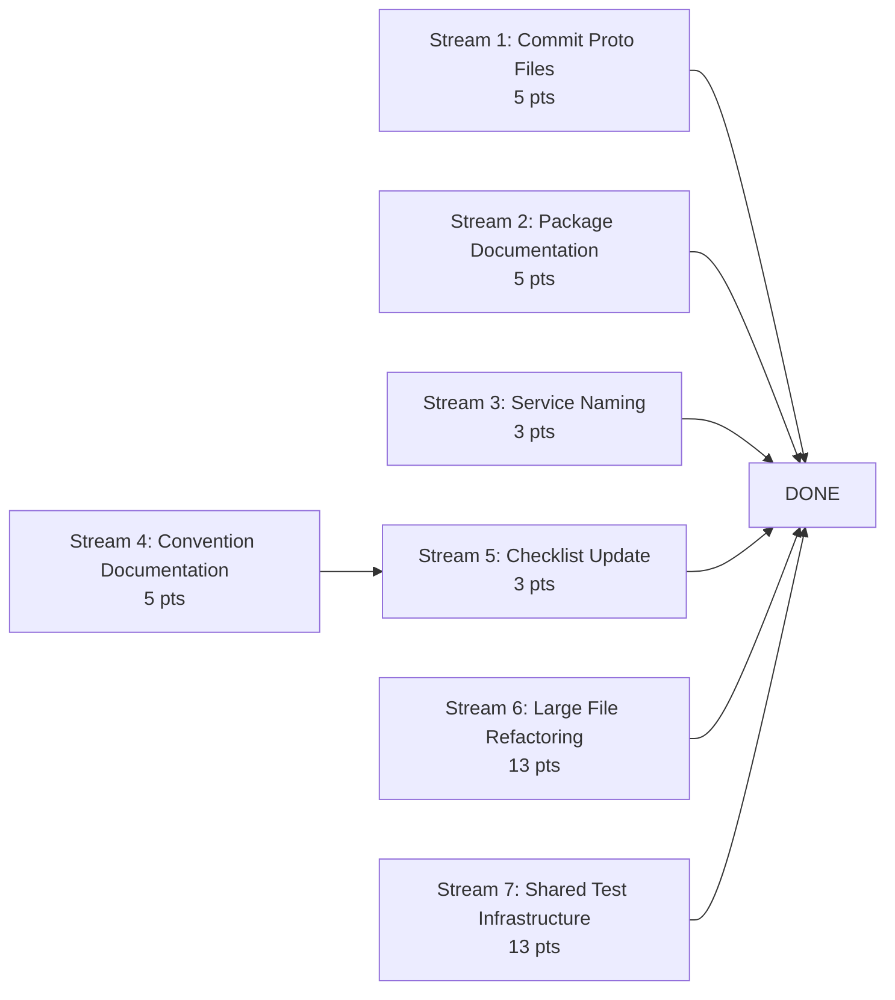

# PRD-049: Codebase Consistency & AI Navigability

## Overview

A comprehensive codebase audit identified micro-inconsistencies across Meridian's 16 services
that individually are trivial but collectively degrade AI code generation reliability and
developer onboarding speed. This PRD addresses the structural improvements that make the
codebase self-describing - reducing the need to read surrounding code before writing new code.

### The Core Problem

When an AI (or new developer) needs to write code in a service, they currently must:

1. **Guess filenames** - Is it `grpc_service.go`, `server.go`, or `financial_accounting_service.go`?
2. **Read proto source** to understand types (generated `.pb.go` files aren't in git)
3. **Scan every shared package** to find utilities (no `doc.go` explaining purpose)
4. **Check each service independently** for error naming, repository shape, config location

Each guess costs a file read. Each file read burns context window. The result: AI performance
degrades as codebase size increases - not because the architecture is wrong, but because the
codebase isn't self-describing enough.

## Goals

1. **Commit proto-generated Go files** to git so types are readable without running codegen
2. **Add `doc.go`** to all shared packages so purpose is discoverable in one read
3. **Standardize service file naming** so navigation is predictable
4. **Document canonical patterns** for errors, repositories, and value types
5. **Update the new-service checklist** to encode all conventions established here

## Non-Goals

- Rewriting service internals or changing architecture
- New feature development
- Performance optimization
- Test coverage improvements (covered in PRD-048)

## Complexity Assessment

Total estimated complexity: **47 story points** across 7 streams.

Streams 1-4, 6, 7 are independent. Stream 5 depends on Stream 4.



Stream 5 depends on Stream 4 (conventions must be documented before the checklist encodes them).

---

## Stream 1: Commit Proto-Generated Files to Git (5 pts)

### Rationale

Generated `.pb.go` files are currently excluded from git. This means:

- AI cannot read service API types without running `buf generate`
- Import aliases vary per service (`iav1`, `iba`, `posv1`) with no discoverable convention
- New worktrees require codegen before compilation
- Code review cannot show proto-generated type changes inline

This is the same rationale behind shadcn/ui's approach: copy the code into your project so it's
readable, searchable, and versionable. If generated code is invisible,
it is effectively unavailable for navigation.

### Task 1.1: Add Proto-Generated Files to Git

**Problem**: `.pb.go` and `_grpc.pb.go` files are gitignored. Every worktree, every CI run,
and every AI session must regenerate them before types are readable.

**Files Affected**:

- `.gitignore` (remove `*.pb.go` exclusion if present)
- `api/proto/meridian/*/v1/*.pb.go` (generated files to commit)
- `api/proto/meridian/*/v1/*_grpc.pb.go` (generated files to commit)

**Acceptance Criteria**:

1. Run `buf generate api/proto` and commit all generated `.pb.go` files
2. Verify `.gitignore` does not exclude `*.pb.go` in the `api/proto/` tree
3. `go build ./...` succeeds from a clean checkout without running `buf generate`
4. Document in CONTRIBUTING.md: "Run `buf generate api/proto` after
   modifying `.proto` files and commit the generated output"

### Task 1.2: Document Proto Import Alias Convention

**Problem**: Services use inconsistent import aliases for proto packages:
`iav1`, `iba`, `posv1`, `pkv1`, `fav1` - no discoverable pattern.

**Files Affected**:

- `docs/guides/proto-conventions.md` (new)

**Acceptance Criteria**:

1. Document the canonical import alias pattern: `{service-abbreviation}v1`
2. List all current proto packages with their canonical alias
3. Include the mapping: proto path -> Go import path -> canonical alias
4. Reference from CONTRIBUTING.md

### Task 1.3: Add CI Check for Proto Freshness

**Problem**: Once proto files are committed, they can drift from `.proto` source if a developer
modifies a `.proto` file but forgets to regenerate.

**Files Affected**:

- `.github/workflows/quality.yml` (add proto freshness check)

**Acceptance Criteria**:

1. CI step runs `buf generate api/proto` and checks for uncommitted changes
2. Fails with clear message: "Proto generated files are stale. Run `buf generate api/proto` and commit."
3. Only runs when `.proto` files or `buf.gen.yaml` are modified (path filter)

---

## Stream 2: Package Documentation (5 pts)

### Rationale

`shared/pkg/` has 20 packages and `shared/platform/` has 19 packages. Fewer than half have
`doc.go` files. Without them, understanding a package requires scanning all exported symbols -
expensive for humans, catastrophic for AI context windows.

A `doc.go` file costs 5-15 lines and saves hundreds of lines of exploratory reads.

### Task 2.1: Add doc.go to All shared/pkg/ Packages

**Problem**: 16 of 20 `shared/pkg/` packages lack `doc.go`. An AI or
developer discovering `shared/pkg/mapping/` has no way to know what it
does without reading implementation files.

**Packages missing doc.go** (verify current state before implementing):

- `amount/`, `bucketing/`, `cel/`, `credentials/`, `grpc/`, `health/`,
  `idempotency/`, `mapping/`, `money/`, `proto/`, `refdata/`, `saga/`,
  `tokens/`, `validation/`, `valuation/`, `valuationfeature/`

**Acceptance Criteria**:

1. Every package under `shared/pkg/` has a `doc.go` file
2. Each `doc.go` contains: package purpose (1 sentence),
   key types/functions (2-3 lines),
   usage example or "see X for usage" pointer
3. Format follows Go convention: `// Package X provides...`
4. No implementation code in `doc.go` files

**Example**:

```go
// Package mapping provides a bidirectional JSON transformation engine
// for converting between external formats and Meridian domain types.
//
// Key types: Engine, MappingSpec, TransformResult
// Used by: operational-gateway, api-gateway for inbound/outbound data mapping
package mapping
```

### Task 2.2: Add doc.go to All shared/platform/ Packages

**Problem**: 14 of 19 `shared/platform/` packages lack `doc.go`.

**Packages missing doc.go** (verify current state before implementing):

- `auth/`, `await/`, `db/`, `gateway/`, `kafka/`, `observability/`,
  `ports/`, `quantity/`, `ratelimit/`, `redislock/`, `sandbox/`,
  `scheduler/`, `tenant/`, `testdb/`

**Acceptance Criteria**:

1. Every package under `shared/platform/` has a `doc.go` file
2. Same format requirements as Task 2.1
3. Platform packages should note whether they're infrastructure-only or have domain semantics

### Task 2.3: Add shared/ Navigation README

**Problem**: No documentation explains the `shared/pkg/` vs `shared/platform/` split.
Developers don't know where to add new shared code.

**Files Affected**:

- `shared/README.md` (new)

**Acceptance Criteria**:

1. Explains the two-tier split: `pkg/` = domain logic shared across services,
   `platform/` = infrastructure utilities
2. Decision guide: "If it knows about business concepts
   (money, sagas, instruments) -> pkg/.
   If it's infrastructure plumbing (DB, auth, events) -> platform/"
3. Lists all packages with one-line descriptions
   (can be generated from doc.go files)
4. Notes the canonical value type: `shared/platform/quantity.Quantity[D]`
   is the primary dimensional type; `shared/pkg/money` and
   `shared/pkg/amount` are convenience wrappers

---

## Stream 3: Service File Naming Standardization (3 pts)

### Rationale

Three different naming patterns for the main gRPC service file:

| Pattern | Services |
|---------|----------|
| `server.go` | internal-account, market-information |
| `grpc_service.go` | current-account, party, payment-order, tenant, identity, financial-gateway, operational-gateway |
| `service.go` | position-keeping, reconciliation |
| `{name}_service.go` | financial-accounting (`financial_accounting_service.go`), audit-worker (`audit_service.go`) |

This means "find the gRPC handler registration" requires checking
multiple filenames per service.

### Task 3.1: Rename Variant Service Files to server.go

**Problem**: ADR-015 establishes `server.go` as the canonical name
for the gRPC service implementation file. Most services use
`grpc_service.go` or other variants instead.

**Files Affected** (verify current state before implementing):

- `services/current-account/service/grpc_service.go` -> `server.go`
- `services/party/service/grpc_service.go` -> `server.go`
- `services/payment-order/service/grpc_service.go` -> `server.go`
- `services/tenant/service/grpc_service.go` -> `server.go`
- `services/identity/service/grpc_service.go` -> `server.go`
- `services/financial-gateway/service/grpc_service.go` -> `server.go`
- `services/operational-gateway/service/grpc_service.go` -> `server.go`
- `services/financial-accounting/service/financial_accounting_service.go`
  -> `server.go`
- `services/position-keeping/service/service.go` -> `server.go`
- `services/audit-worker/service/audit_service.go` -> `server.go`
- `services/reconciliation/service/service.go` -> `server.go`

**Acceptance Criteria**:

1. All services use `server.go` as the main gRPC service file per ADR-015
2. All imports and references updated
3. All tests pass
4. `git log --follow` preserves file history (use `git mv`)

### Task 3.2: Standardize gRPC Handler File Splitting Convention

**Problem**: Some services split handlers into `grpc_{operation}_endpoints.go` files, others
inline everything. No convention for when to split.

**Files Affected**:

- `docs/guides/service-file-conventions.md` (new)

**Acceptance Criteria**:

1. Document the convention: split into `grpc_{operation}_endpoints.go`
   when `server.go` exceeds 400 LOC
2. Document the naming pattern: `server.go` (constructor + registration),
   `grpc_{operation}_endpoints.go` (handler implementations)
3. List the current state of each service for reference
4. Do NOT refactor existing services in this task (documentation only - refactoring is in PRD-012)

---

## Stream 4: Convention Documentation (5 pts)

### Rationale

Inconsistencies persist because conventions are implicit. Documenting them explicitly creates
a reference that both humans and AI can check before writing new code.

### Task 4.1: Document Error Naming Convention

**Problem**: Mixed patterns across services: `ErrNotFound` (generic) vs `ErrAccountNotFound`
(entity-prefixed). Neither is wrong, but the inconsistency means you can't predict error
names without reading each service's `errors.go`.

**Files Affected**:

- `docs/guides/error-conventions.md` (new)

**Acceptance Criteria**:

1. Establish the canonical pattern: entity-prefixed errors
   (`Err{Entity}NotFound`) for domain errors,
   generic errors (`ErrNotFound`) only in shared packages
2. Document the standard error set every domain should define: `NotFound`, `Conflict`, `InvalidStatus`, `OptimisticLock`
3. Document gRPC status code mapping convention (e.g., `ErrNotFound` -> `codes.NotFound`)
4. Include examples from existing services
5. Do NOT refactor existing errors in this task (documentation only - migration is future work)

### Task 4.2: Document Repository Pattern Convention

**Problem**: Repository interfaces live in `domain/repository.go` (position-keeping) or
`adapters/persistence/repository.go` (most others). Method names vary: `Create`/`Insert`,
`Find`/`Get`, `Update`/`UpdateStatus`.

**Files Affected**:

- `docs/guides/repository-conventions.md` (new)

**Acceptance Criteria**:

1. Establish canonical locations per ADR-015:
   `domain/repository.go` for interfaces (ports),
   `adapters/persistence/repository.go` for implementations (adapters)
2. Document standard method naming: `Create`, `FindByID`, `List`, `Update`, `Delete`
3. Document optional methods: `CreateBatch`, `CreateWithOutbox`, `SoftDelete`
4. Document the GORM vs pgx decision: GORM for standard CRUD, pgx for performance-critical paths (position-keeping)
5. Include the standard constructor pattern and tenant scoping
6. Do NOT refactor existing repositories (documentation only)

### Task 4.3: Document Value Type Hierarchy

**Problem**: Three packages deal with "amounts of things": `shared/platform/quantity/`,
`shared/pkg/money/`, `shared/pkg/amount/`. Unclear which to use when.

**Files Affected**:

- `docs/guides/value-types.md` (new)

**Acceptance Criteria**:

1. Document the hierarchy: `Quantity[D]` is the foundational type
   (dimensional safety), `Money` wraps `Quantity[Currency]`
   for convenience, `Amount` provides decimal arithmetic
2. Decision guide: use `Quantity[D]` for multi-asset contexts,
   `Money` for currency-only contexts, `Amount` for raw decimals
3. Note which is used where (e.g., position-keeping uses `Quantity[D]`, current-account uses both)
4. Flag `shared/pkg/money/` as a thin wrapper with 2 imports - candidate for future removal

---

## Stream 5: Update New Service Checklist (3 pts)

Depends on: Stream 4 (conventions must be documented first).

### Task 5.1: Update new-bian-service-checklist.md with Established Conventions

**Problem**: The current checklist (`docs/guides/new-bian-service-checklist.md`) doesn't
encode the naming conventions, file patterns, or documentation requirements established
in this PRD and ADR-015.

**Files Affected**:

- `docs/guides/new-bian-service-checklist.md`

**Acceptance Criteria**:

1. Add task: "Create `doc.go` for every new package" with format example
2. Add task: "Create `errors.go` in `domain/` with entity-prefixed errors" referencing error-conventions.md
3. Update Task 7 (gRPC Service Handler) to mandate `server.go` naming per ADR-015
4. Add task: "Regenerate proto files and commit" after proto definition task
5. Add task: "Create service README.md with YAML frontmatter"
6. Reference the new convention docs (error-conventions.md, repository-conventions.md, value-types.md)
7. Add "Starlark Client Bindings" as a required task (currently most services have this but it's not in the checklist)

### Task 5.2: Add Service Consistency Verification Script

**Problem**: No automated way to verify a service follows conventions. Checklist is manual.

**Files Affected**:

- `scripts/verify-service-conventions.sh` (new)

**Acceptance Criteria**:

1. Script accepts a service name and checks:
   - `server.go` exists in `service/` (per ADR-015)
   - `domain/errors.go` exists
   - `doc.go` exists in each package
   - `README.md` exists with YAML frontmatter
   - Proto generated files exist and are committed
   - Atlas migration directory exists
2. Outputs pass/fail per check with actionable fix instructions
3. Can be run in CI for new service PRs

---

## Stream 6: Large File Refactoring (13 pts)

### Rationale

25 Go files exceed 800 lines. Large files degrade AI performance
(context window pressure), increase edit collision risk, and indicate
mixed concerns. This stream targets the 10 largest non-generated files
for decomposition.

### Task 6.1: Refactor manifest_validator.go (2753 lines)

**Problem**: Largest non-generated file in the codebase. Mixes
CEL type-checking, Starlark compilation, cross-reference validation,
and schema validation in a single file.

**File**: `services/control-plane/internal/validator/manifest_validator.go`

**Acceptance Criteria**:

1. Split into focused validators (e.g., `cel_validator.go`,
   `starlark_validator.go`, `crossref_validator.go`)
2. No file exceeds 600 lines
3. All existing tests pass unchanged
4. No public API changes

### Task 6.2: Refactor postgres_repository.go (1518 lines)

**File**: `services/position-keeping/adapters/persistence/postgres_repository.go`

**Acceptance Criteria**:

1. Split by concern (e.g., `position_log_repository.go`,
   `balance_queries.go`, `batch_operations.go`)
2. No file exceeds 600 lines
3. All existing tests pass unchanged

### Task 6.3: Refactor party grpc_service.go (1359 lines)

**File**: `services/party/service/grpc_service.go`

**Acceptance Criteria**:

1. Split into `server.go` (constructor + registration) and
   handler endpoint files per operation group
2. No file exceeds 600 lines
3. All existing tests pass unchanged

### Task 6.4: Refactor lien_service.go (1322 lines)

**File**: `services/current-account/service/lien_service.go`

**Acceptance Criteria**:

1. Split into focused modules (lifecycle, compensation, queries)
2. No file exceeds 600 lines
3. All existing tests pass unchanged

### Task 6.5: Refactor remaining >1000 LOC files

**Files** (each a sub-task):

- `services/reference-data/accounttype/postgres_registry.go` (1120)
- `services/reference-data/saga/reference_validator.go` (1069)
- `services/payment-order/cmd/main.go` (1068)
- `services/control-plane/internal/differ/manifest_differ.go` (1063)
- `services/reconciliation/service/service.go` (999)
- `services/party/adapters/persistence/repository.go` (965)

**Acceptance Criteria**:

1. Each file split so no resulting file exceeds 600 lines
2. All existing tests pass unchanged
3. No public API changes

---

## Stream 7: Shared Test Infrastructure (13 pts)

### Rationale

73 implementations of `setupTestDB` across the codebase, each with
slightly different signatures. 41 `time.Sleep` violations in tests.
277 inline mock struct definitions. This duplication makes writing
new tests slow and inconsistent.

### Task 7.1: Standardize Test DB Setup

**Problem**: 73 `setupTestDB` functions with inconsistent signatures.
Some return `*gorm.DB`, some return `(*gorm.DB, func())`, some use
SQLite, some use testcontainers. `shared/platform/testdb` exists but
many services don't use it.

**Files Affected**:

- `shared/platform/testdb/` (enhance existing package)
- All service `*_test.go` files with `setupTestDB` functions

**Acceptance Criteria**:

1. `shared/platform/testdb` provides a single `SetupTestDB(t)`
   function with consistent return signature: `(*gorm.DB, func())`
2. Function handles CockroachDB testcontainer setup, migration
   running, and tenant context injection
3. Migrate at least 5 high-traffic services to use the shared
   helper (current-account, financial-accounting, party,
   payment-order, reconciliation)
4. Document the pattern in `shared/platform/testdb/doc.go`
5. Remaining services tracked as follow-up

### Task 7.2: Migrate time.Sleep to await

**Problem**: 41 instances of `time.Sleep` in tests violate the
guideline in CLAUDE.md. These create flaky tests (sleep too short)
or slow CI (sleep too long).

**Files Affected**: 41 test files across services and shared/

**Acceptance Criteria**:

1. All `time.Sleep` in test files replaced with `await.Until()`
   or `await.UntilNoError()`
2. Exception: `time.Sleep` in `await/await_test.go` itself is
   acceptable (testing the await package)
3. Exception: `time.Sleep` used to simulate delays (not to wait
   for conditions) may be retained with a comment explaining why
4. CI time does not increase

### Task 7.3: Extract Shared Test Context Helpers

**Problem**: `tenant.WithTenant(context.Background(), ...)` pattern
repeated 4900+ times across test files. No centralized context
builder for tests.

**Files Affected**:

- `shared/platform/testdb/context.go` (new)

**Acceptance Criteria**:

1. Create `testdb.ContextWithTenant(t, tenantID)` that returns
   a context with tenant, deadline, and test cleanup
2. Create `testdb.ContextWithDefaultTenant(t)` for tests that
   don't care about specific tenant ID
3. Migrate at least 3 services to use the shared helpers
4. Document in `shared/platform/testdb/doc.go`

### Task 7.4: Extract Common Service Test Helpers Per Service

**Problem**: Only 3 of 16+ services have `testhelpers/` packages.
Other services inline test setup, entity factories, and mock
definitions in test files.

**Files Affected**:

- `services/*/domain/testfixtures/` or `testhelpers/` (new per
  service as needed)

**Acceptance Criteria**:

1. Create `testhelpers/` package for 5 highest-traffic services
   that lack one (current-account, financial-accounting,
   payment-order, reconciliation, tenant)
2. Extract entity factory functions (`NewTest*`) into testhelpers
3. Each testhelpers package has a `doc.go` explaining purpose
4. Remaining services tracked as follow-up

---

## Parallelization Summary

| Stream | Points | Dependencies | Parallelizable With |
|--------|--------|-------------|-------------------|
| 1. Proto Files | 5 | None | All except 5 |
| 2. Package Docs | 5 | None | All except 5 |
| 3. Service Naming | 3 | None | All except 5 |
| 4. Convention Docs | 5 | None | All except 5 |
| 5. Checklist Update | 3 | Stream 4 | After 4 |
| 6. Large File Refactoring | 13 | None | All except 5 |
| 7. Test Infrastructure | 13 | None | All except 5 |

**Critical path**: Stream 4 (5 pts) -> Stream 5 (3 pts) = 8 pts.
Streams 1-4, 6, 7 run concurrently, then Stream 5 follows.

## Task Master Parsing Guidance

When parsing this PRD into Task Master tasks:

- **Create exactly 22 tasks** corresponding to the numbered tasks
  (1.1 through 7.4)
- Each task maps to a single PR-able unit of work
- Preserve stream grouping in task numbering
- Mark Stream 5 tasks as depending on Stream 4 tasks
- All other streams have zero dependencies

**Task-to-stream mapping:**

| Task ID | PRD Reference | Stream |
|---------|--------------|--------|
| 1 | Task 1.1: Add Proto-Generated Files to Git | Proto Files |
| 2 | Task 1.2: Document Proto Import Alias Convention | Proto Files |
| 3 | Task 1.3: Add CI Check for Proto Freshness | Proto Files |
| 4 | Task 2.1: Add doc.go to shared/pkg/ | Package Docs |
| 5 | Task 2.2: Add doc.go to shared/platform/ | Package Docs |
| 6 | Task 2.3: Add shared/ Navigation README | Package Docs |
| 7 | Task 3.1: Rename Variant Service Files to server.go | Naming |
| 8 | Task 3.2: Standardize Handler File Splitting | Naming |
| 9 | Task 4.1: Document Error Naming Convention | Convention Docs |
| 10 | Task 4.2: Document Repository Pattern Convention | Convention Docs |
| 11 | Task 4.3: Document Value Type Hierarchy | Convention Docs |
| 12 | Task 5.1: Update New Service Checklist | Checklist |
| 13 | Task 5.2: Add Service Consistency Script | Checklist |
| 14 | Task 6.1: Refactor manifest_validator.go | Refactoring |
| 15 | Task 6.2: Refactor postgres_repository.go | Refactoring |
| 16 | Task 6.3: Refactor party grpc_service.go | Refactoring |
| 17 | Task 6.4: Refactor lien_service.go | Refactoring |
| 18 | Task 6.5: Refactor remaining >1000 LOC files | Refactoring |
| 19 | Task 7.1: Standardize Test DB Setup | Test Infra |
| 20 | Task 7.2: Migrate time.Sleep to await | Test Infra |
| 21 | Task 7.3: Extract Shared Test Context Helpers | Test Infra |
| 22 | Task 7.4: Extract Service Test Helpers | Test Infra |

## Success Criteria

1. `go build ./...` succeeds from a clean clone without `buf generate`
2. Every `shared/` package has a `doc.go` (< 15 lines)
3. Every service uses `server.go` as the main service file per ADR-015
4. Convention docs exist for errors, repositories, and value types
5. New service checklist references all established conventions
6. Verification script passes for all services (or documents exceptions)
7. No Go file exceeds 600 lines (excluding generated code)
8. Zero `time.Sleep` in test files (except await package tests)
9. Top 5 services use shared `testdb.SetupTestDB(t)` helper
