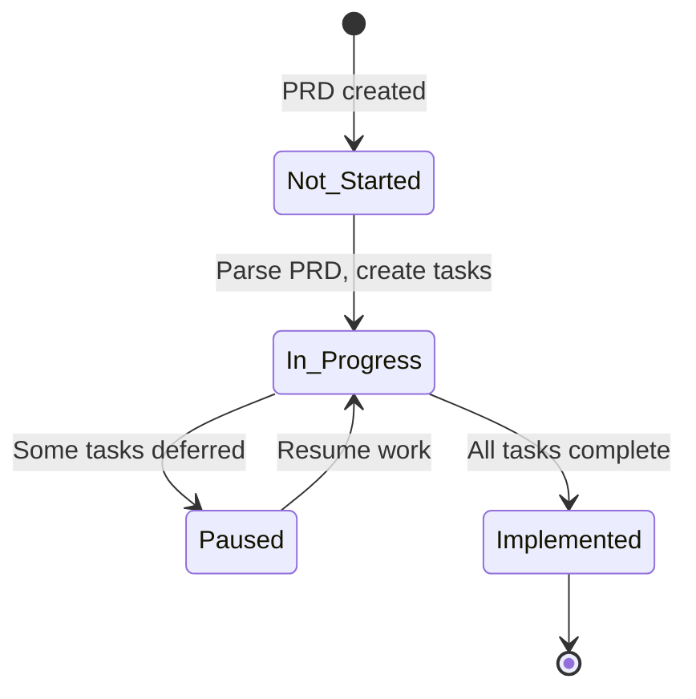

# Product Requirements Documents (PRDs)

This directory contains Product Requirements Documents for Meridian features. Like ADRs, these
documents are configured as Claude Code skills that automatically load when relevant triggers match.

## PRD Status Overview

### Status Definitions

| Status | Meaning |
|--------|---------|
| **Implemented** | All tasks completed (remaining tasks cancelled or deferred) |
| **Paused** | Mostly implemented with deferred items remaining |
| **In Progress** | Active work ongoing |
| **Not Started** | PRD exists but no Task Master tasks created |



### Git-Tracked PRDs (`docs/prd/`)

#### Implemented

| PRD | Task Master Tag | Tasks |
|-----|-----------------|-------|
| [Codebase Health Audit](012-codebase-health-audit.md) | `codebase-health-audit` | 22/22 done |
| [Durable Execution Engine](005-durable-execution-engine.md) | `starlark-saga-orchestration` | 24/24 done |
| [Internal Account](002-internal-bank-account.md) | `internal-account` | 33/33 done |
| [Market Information Management](004-market-information-management.md) | `market-information-management` | 17/18 done, 1 cancelled |
| [Market Data & Dynamic Pricing](016-market-data-dynamic-pricing.md) | `market-data-dynamic-pricing` | 12/12 done |
| [Production Readiness Review](009-production-readiness-review.md) | `production-readiness` | 10/10 done |
| [Reconciliation Service](013-reconciliation-service.md) | `reconciliation-service-completed-2026-02-12` | 24/24 done |
| [Reconciliation gRPC Wiring](017-reconciliation-grpc-wiring.md) | `reconciliation-service-completed-2026-02-12` (tasks 17-23) | Included in reconciliation-service completion |
| [Starlark Saga Orchestration (Core)](006-starlark-saga-orchestration-core.md) | `starlark-saga-orchestration` | 24/24 done |
| [Starlark Typed Service Clients](007-starlark-typed-service-clients.md) | `starlark-typed-clients` | 10/10 done |
| [Stripe Connect](015-stripe-connect.md) | `stripe-connect` | 12/12 done |
| [Universal Asset System](001-universal-asset-system.md) | `universal-asset-system` | 36/36 done |
| [Starlark Service Bindings](008-starlark-service-bindings.md) | N/A (tracked across other tags) | Implemented 2026-02-04 |
| [Starlark Testing Framework](010-starlark-testing-framework.md) | N/A (tracked across other tags) | Implemented 2026-02-06 |
| [Structured Mapping Layer](024-structured-inbound-mapping.md) | `structured-mapping-layer` | 16/16 done |
| [Valuation Service](011-valuation-service.md) | `valuation-engine` | 14/14 done |
| [Platform Scheduler](021-platform-scheduler.md) | `platform-scheduler` | 12/12 done |
| [Stripe Connect Wiring](015-stripe-connect.md) | `stripe-connect-wiring` | 10/10 done |
| [Current Account Withdrawal Persistence](018-current-account-withdrawal-persistence.md) | `account-service-wiring` | 20/21 done, 1 cancelled |
| [Internal Account - PK Client](019-internal-bank-account-position-keeping-client.md) | `account-service-wiring` | (included in account-service-wiring) |
| [Party KYC/AML Provider Integration](020-party-kyc-aml-provider-integration.md) | `party-kyc-aml` | 10/10 done |
| [MCP Server](027-mcp-server.md) | `mcp-server` | 17/18 done, 1 cancelled |
| [Operational Gateway](029-operational-gateway.md) | `operational-gateway` | 20/20 done |
| [Reconciliation Phase 2](013-reconciliation-service.md) | `reconciliation-service-phase2-completed-2026-02-13` | 10/10 done |

#### Paused (Deferred Items Remain)

| PRD | Task Master Tag | Tasks | Deferred |
|-----|-----------------|-------|----------|
| [Control Plane](014-control-plane.md) | `control-plane-completed-2026-02-10` | 12/13 done | 1 deferred |

#### In Progress

| PRD | Task Master Tag | Tasks |
|-----|-----------------|-------|
| [Test Coverage to 80%](048-test-coverage-80.md) | `test-coverage-80` | 0/13 done |

#### Not Started

| PRD | Description |
|-----|-------------|
| [Economy Visualization Completeness](046-economy-visualization-completeness.md) | Complete operations console economy visualization |
| [Security Audit](047-security-audit.md) | Security findings and remediation from Six Hats audit |
| [Codebase Consistency & AI Navigability](049-codebase-consistency.md) | Standardize naming, patterns, and documentation across services |
| [Asset-Agnostic Accounts](028-asset-agnostic-accounts.md) | Generalize account fields for non-fiat asset classes |
| [Identity and Access Management](031-identity-access-management.md) | Bridge Party service identity to authentication with dynamic user management and RBAC |
| [Meridian Edge](003-meridian-edge.md) | Embedded modular monolith for IoT devices and browser (WASM) |
| [AsyncAPI Specification](030-asyncapi-specification.md) | Formal AsyncAPI 3.0 specs for Kafka event contracts |
| [Event-Triggered Saga Execution](032-event-driven-valuation-saga.md) | Fourth saga trigger type (event:) for reactive workflows |
| [Gateway Architecture](033-gateway-architecture.md) | Unified gateway architecture |
| [Frontend Service Alignment](034-frontend-service-alignment.md) | Service-aligned frontend modules and runtime tenant UI |
| [Economy Cookbook](035-economy-cookbook.md) | Unified pattern registry for economy patterns |
| [Cookbook Browser](036-cookbook-browser.md) | Visual pattern and component explorer |
| [Multi-Asset Purity](037-multi-asset-purity.md) | Remove hardcoded asset references |
| [Manifest Business Model Visualization](038-manifest-business-model-visualization.md) | Interactive business model graph |
| [Meridian Economy Runtime](039-meridian-vm.md) | Programmable Economy Runtime with AI generator |
| [Org-Scoped Accounts](022-org-scoped-accounts.md) | Multi-party resource pooling |
| [Product Directory](023-product-directory.md) | Runtime-configurable product catalog |
| [Operations Console UI](026-operations-console-ui.md) | Meridian operations console frontend |
| [Handler Schema Alignment](040-handler-schema-alignment.md) | Derive handler schemas from proto definitions |
| [Economy Generator](041-economy-generator.md) | AI-assisted economy generation via MCP |
| [Economy IDE](042-economy-ide.md) | Conversational economy creation UI |
| [MCP Manifest Tenant Isolation](043-mcp-manifest-tenant-isolation.md) | Fix tenant leakage in MCP manifest validation |
| [Auth Flow Architecture](044-auth-flow-architecture.md) | Authentication entry points and tenant context flow |
| [Manifest as Sole Source of Truth](045-manifest-as-sole-source-of-truth.md) | Control plane owns all economy declarations |
| [Party Navigation](051-party-navigation.md) | Party navigation and service boundary cleanup |
| [Demo Sandbox](050-demo-sandbox.md) | Self-service AI economy creation on ephemeral demo environment |
| [Email Infrastructure MVP](052-email-platform.md) | Outbox, worker, Resend integration, invoice/dunning email delivery |
| [Auth Email Flows](053-auth-email-flows.md) | Email verification, password reset, user invitations (depends on 052) |
| [Billing UI](054-billing-ui.md) | Billing dashboard, invoice detail, email delivery status (depends on 052) |
| [Tenant Branding](055-tenant-branding.md) | Display name propagation to login page, header, and document title |
| [Correspondence Service](056-correspondence-service.md) | BIAN-aligned correspondence service for notifications and documents |
| [Convergent Manifest Apply](057-convergent-manifest-apply.md) | Rework ApplyManifest to diff against live state (kubectl apply semantics) |
| [Full Economy Visibility](058-full-economy-visibility.md) | Surface platform defaults and economy capabilities in UI |
| [Asset-Agnostic Posting Layer](059-asset-agnostic-posting-layer.md) | Replace hardcoded ISO 4217 currency validation for non-fiat assets |
| [Per-Tenant Scheduled Execution](060-per-tenant-scheduled-execution.md) | Phased scheduling identity: attribution, manifest bridge, deferred JWT auth |

### Task Master PRDs (`.taskmaster/docs/`)

These PRDs are used to generate Task Master tasks and are not tracked in git.

#### Implemented

| PRD | Task Master Tag | Tasks |
|-----|-----------------|-------|
| `prd-infra.md` | `1-infra-completed-2025-10-30` | 11/11 done |
| `prd-api-contracts.md` | `2-api-contracts-completed-2024-12-15` | 16/19 done, 3 cancelled |
| `prd-platform.md` | `3-platform` | 10/10 done |
| `prd-financial-accounting.md` | `4-financial-accounting` | 9/10 done, 1 cancelled |
| `prd-position-keeping.md` | `5-position-keeping` | 15/15 done |
| `prd-current-account.md` | `6-current-account` | 10/10 done |
| `prd-payment-order.md` | `7-payment-order` | 19/19 done |
| `prd-99-horizon-proof.md` | `99-horizon-proof` | 10/10 done |
| `go-compile-time-safety-prd.md` | `go-compile-time-safety-completed-2024-12-15` | 7/10 done, 3 cancelled |
| `prd-technical-debt-remediation.md` | `tech-debt-cleanup` | 84/84 done |
| `prd-position-keeping-balance-ownership.md` | `position-keeping-balance` | 17/17 done |
| `prd-database-per-service.md` | `database-per-service` | 14/15 done, 1 cancelled |
| `prd.md` (Master) | `master` | 5/5 done |
| N/A (saga-script-versioning has no dedicated PRD) | `saga-script-versioning` | 34/34 done |

#### Paused (Deferred Items Remain)

| PRD | Task Master Tag | Tasks | Deferred |
|-----|-----------------|-------|----------|
| `prd-multi-tenancy.md` | `8-multi-tenancy` | 89/95 done, 5 cancelled | 1 deferred |
| `ledger-integrity-prd.md` | `ledger-integrity` | 14/15 done | 1 deferred |
| `prd-audit-foundation.md` | `75-async-audit` | 19/20 done | 1 deferred |
| `prd-bian-alignment.md` | `bian-alignment` | 6/15 done, 4 cancelled | 5 deferred |
| `prd-iso-standards-alignment.md` | `iso-standards-alignment` | 4/15 done, 6 cancelled | 5 deferred |

#### Implemented Under Other Tags (No Dedicated Tag)

These PRDs were implemented by appending tasks to existing tags rather than creating dedicated tags.

| PRD | Where Tracked | Notes |
|-----|---------------|-------|
| `prd-party-service.md` | `8-multi-tenancy`, `bian-alignment`, `tech-debt-cleanup`, `75-async-audit` | Party service fully operational at `services/party/` |
| `api-gateway-service-prd.md` | `8-multi-tenancy`, `tech-debt-cleanup` | Gateway service at `services/api-gateway/`, JWT auth, subdomain routing |
| `async-schema-provisioning-prd.md` | `8-multi-tenancy` (tasks 46-48) | Schema provisioner integrated into InitiateTenant workflow |
| `external-tenant-isolation-prd.md` | `8-multi-tenancy`, `tech-debt-cleanup` | Subdomain resolution, slug cache, auth interceptor |
| `prd-current-account-refactor.md` | `223-shared-client-patterns`, `position-keeping-balance`, `universal-asset-system`, `starlark-saga-orchestration` | Refactored across multiple initiatives |
| `prd-docs-sync-q1-2026.md` | `tech-debt-cleanup` (task 53) | Documentation sync completed |
| `prd-multi-tenancy-phase2.md` | `8-multi-tenancy` | Most critical gaps addressed (89/95 done), 1 deferred (K8s wildcard ingress) |

#### Partially Addressed

| PRD | Where Tracked | Remaining |
|-----|---------------|-----------|
| `prd-concurrency-reliability-q1-2026.md` | `tech-debt-cleanup` (deadlock fix), `8-multi-tenancy` (retry logic) | Needs review to identify unaddressed items |

#### Not Started

| PRD | Description | Date Created |
|-----|-------------|--------------|
| `prd-internal-account-integration-phase2.md` | Phase 2: FA, Payment Order, Position Keeping integration | 2026-01-15 |

### Other Documents (`.taskmaster/docs/`)

| File | Type |
|------|------|
| `panic-audit-inventory.md` | Audit inventory (reference doc, not a PRD) |

## What are PRDs?

PRDs define the requirements, design, and implementation approach for significant features. They:

- Document the "what" and "why" of features before implementation
- Provide context for AI assistants during development
- Define Task Master tags for tracking work
- Link to related ADRs for architectural decisions

## PRD Locations: Strategic vs Tactical

Meridian uses two PRD locations with different purposes:

| Location | Purpose | Version Control | Usage |
|----------|---------|-----------------|-------|
| `docs/prd/` | **Strategic PRDs** | Git-tracked | Architectural decisions, feature design, team-reviewed |
| `../../.taskmaster/docs/` | **Tactical PRDs** | Not tracked | Task Master generation, implementation details, working docs |

### When to Use Each Location

**Strategic PRDs** (`docs/prd/`) - Use for:

- Major architectural changes or system-wide features
- Cross-service features requiring coordination
- Decisions requiring team review and consensus
- Long-term reference documentation
- Features with significant design complexity

**Examples:** Universal Asset System, Starlark Saga Orchestration, Internal Account Service

**Tactical PRDs** (`.taskmaster/docs/`) - Use for:

- Task breakdown for specific work packages
- Implementation checklists and tracking
- Gap analysis (e.g., BIAN alignment, ISO standards)
- Working documents for active development
- Feature-specific implementation plans

**Examples:** BIAN Alignment PRD, Multi-Tenancy Phase 2, Technical Debt Remediation

### Migration Path

PRDs often start as tactical documents in `.taskmaster/docs/` for implementation, then graduate
to strategic PRDs in `docs/prd/` once the feature stabilizes and becomes architectural reference
material.

## Categories

### Core Platform

- [Universal Asset System](001-universal-asset-system.md) - Multi-asset support with dimensional safety
- [Internal Account](002-internal-bank-account.md) - BIAN service for clearing, nostro/vostro accounts
- [Market Information Management](004-market-information-management.md) - BIAN service for market data and pricing
- [Starlark Typed Service Clients](007-starlark-typed-service-clients.md) - Type-safe service handlers for saga orchestration
- [Valuation Service](011-valuation-service.md) - BIAN-native multi-asset valuation engine
- [Asset-Agnostic Accounts](028-asset-agnostic-accounts.md) - Generalize account fields for non-fiat asset classes
- [Org-Scoped Accounts](022-org-scoped-accounts.md) - Multi-party resource pooling following BIAN Syndicate Pattern
- [Product Directory](023-product-directory.md) - BIAN-aligned AccountTypeRegistry for runtime-configurable product catalog
- [Multi-Asset Purity](037-multi-asset-purity.md) -
  Remove hardcoded asset references, enforce instrument resolution via Reference Data
- [Asset-Agnostic Posting Layer](059-asset-agnostic-posting-layer.md) -
  Replace hardcoded ISO 4217 currency validation for non-fiat assets

### Execution Engine

- [Starlark Saga Orchestration (Core)](006-starlark-saga-orchestration-core.md) - Runtime-configurable saga definitions
- [Durable Execution Engine](005-durable-execution-engine.md) - Resilience layer for saga execution
- [Starlark Service Bindings](008-starlark-service-bindings.md) - Service binding layer for Starlark saga scripts
- [Starlark Testing Framework](010-starlark-testing-framework.md) - Auto-validate Starlark scripts at upload time
- [Event-Triggered Saga Execution](032-event-driven-valuation-saga.md) -
  Fourth saga trigger type (`event:`) for reactive workflows via domain events
- [Meridian Economy Runtime](039-meridian-vm.md) -
  Formalise Meridian as programmable Economy Runtime with AI generator and IDE
- [Handler Schema Alignment](040-handler-schema-alignment.md) -
  Eliminate handlers.yaml; derive handler schemas from proto definitions

### Settlement & Reconciliation

- [Reconciliation Service](013-reconciliation-service.md) - BIAN-native settlement lifecycle and variance detection
- [Stripe Connect](015-stripe-connect.md) - Payment-reconciliation-settlement loop with Stripe
- [Reconciliation gRPC Wiring](017-reconciliation-grpc-wiring.md) - Wire reconciliation RPCs to service layer

### Market Data & Pricing

- [Market Data & Dynamic Pricing](016-market-data-dynamic-pricing.md) - Hierarchical reference data and Starlark-based forecasting

### Integration & External Systems

- [Operational Gateway](029-operational-gateway.md) - Asset-agnostic control signal gateway for outbound instructions
- [Gateway Architecture](033-gateway-architecture.md) -
  Unified gateway architecture consolidating API, operational, and admin gateways
- [Structured Mapping Layer](024-structured-inbound-mapping.md) - Bidirectional JSON mapping engine for data transformation
- [Real-Time Event Streaming](025-real-time-event-streaming.md) - WebSocket event delivery for operations console
- [AsyncAPI Specification](030-asyncapi-specification.md) - Formal AsyncAPI 3.0 specs for Kafka event contracts

### Operations & SaaS

- [Control Plane](014-control-plane.md) - SaaS operations layer for manifest management
- [Frontend Service Alignment](034-frontend-service-alignment.md) -
  Service-aligned frontend modules, Storybook, and runtime tenant UI customisation
- [MCP Server](027-mcp-server.md) - Model Context Protocol server bridging LLMs to Meridian Core
- [Codebase Health Audit](012-codebase-health-audit.md) - Remediation for documentation, CI/CD, and code hygiene
- [Codebase Consistency & AI Navigability](049-codebase-consistency.md) -
  Standardize naming, patterns, and documentation for AI and developer navigability
- [Production Readiness Review](009-production-readiness-review.md) - Audit and remediation for production gaps
- [Operations Console UI](026-operations-console-ui.md) - Meridian operations console frontend
- [Economy Cookbook](035-economy-cookbook.md) - Unified pattern registry for economy patterns and UI components
- [Cookbook Browser](036-cookbook-browser.md) - Visual pattern and component explorer
- [Manifest Business Model Visualization](038-manifest-business-model-visualization.md) -
  Interactive business model graph from live tenant manifest
- [Economy Generator](041-economy-generator.md) -
  AI-assisted economy generation via MCP tool producing validated manifests
- [Economy IDE](042-economy-ide.md) -
  Conversational economy creation UI with manifest editor and deploy wizard
- [MCP Manifest Tenant Isolation](043-mcp-manifest-tenant-isolation.md) -
  Fix tenant leakage and create-vs-amend mode in MCP manifest validation
- [Manifest as Sole Source of Truth](045-manifest-as-sole-source-of-truth.md) -
  Control plane owns all structural economy declarations, versioned in DB
- [Demo Sandbox](050-demo-sandbox.md) -
  Self-service AI economy creation with nightly reset and tenant registration
- [Email Infrastructure MVP](052-email-platform.md) -
  Transactional email via outbox pattern, Resend integration, invoice/dunning delivery,
  provider-agnostic Sender interface, per-tenant metering
- [Billing UI](054-billing-ui.md) -
  Billing dashboard, invoice detail pages, email delivery status visibility
- [Tenant Branding](055-tenant-branding.md) -
  Display name propagation to login page, header, and document title
- [Correspondence Service](056-correspondence-service.md) -
  BIAN-aligned correspondence service for notifications and documents
- [Convergent Manifest Apply](057-convergent-manifest-apply.md) -
  Rework ApplyManifest to diff against live state (kubectl apply semantics)
- [Full Economy Visibility](058-full-economy-visibility.md) -
  Surface platform defaults and economy capabilities in UI
- [Per-Tenant Scheduled Execution](060-per-tenant-scheduled-execution.md) -
  Phased scheduling identity, manifest bridge, and deferred JWT auth

### Identity & Access Control

Meridian separates access control into two service domains:

<!-- markdownlint-disable MD013 -->

- [Party KYC/AML Provider Integration](020-party-kyc-aml-provider-integration.md) -
  **Customer access control**: External KYC/AML verification for customer onboarding (regulatory)
- [Identity and Access Management](031-identity-access-management.md) -
  **Staff/operator access control**: Dynamic user management, role assignment,
  JWT claims population (operational)
- [Auth Flow Architecture](044-auth-flow-architecture.md) -
  **Authentication entry points**: BFF password, BFF SSO, MCP OAuth, and
  tenant context flow through each
- [Auth Email Flows](053-auth-email-flows.md) -
  **Email-based auth**: Verification, password reset, user invitations,
  account lockout notifications (depends on PRD 052)

<!-- markdownlint-enable MD013 -->

### Service Wiring (Micro-PRDs)

- [Current Account Withdrawal Persistence](018-current-account-withdrawal-persistence.md) - Wire withdrawal-by-ID gRPC handlers
- [Internal Account - PK Client](019-internal-bank-account-position-keeping-client.md) -
  Wire PK gRPC client in Internal Account service

### Deployment Targets

- [Meridian Edge](003-meridian-edge.md) - Embedded modular monolith for IoT devices and browser (WASM)

## How PRD Skills Work

Each PRD has YAML frontmatter that enables Claude Code to automatically load it when relevant:

```yaml
---
name: prd-universal-asset-system
description: Extend Meridian's ledger from fiat-only to multi-asset support
triggers:
  - Implementing multi-asset or universal asset support
  - Working on InstrumentType, Quantity, or asset definitions
instructions: |
  Key patterns and guidance for implementing this PRD...
---
```

Claude Code loads PRDs when:

- Discussion topics match the triggers
- Keywords align with the PRD's domain
- The instructions would be helpful for the current task

## Creating New PRDs

1. Create a new markdown file with the next available 3-digit prefix (e.g., `022-feature-name.md`)
2. Add YAML frontmatter with:
   - `name`: Unique identifier (e.g., `prd-feature-name`)
   - `description`: One-line summary
   - `triggers`: List of scenarios when this PRD should load
   - `instructions`: Key guidance for Claude Code
3. Write the PRD content following the existing structure
4. Set **Status** to `Not Started` until Task Master tasks are created
5. Update this README with the new entry
6. If applicable, create related ADRs for architectural decisions

## PRD Structure

PRDs typically include:

- **Overview**: Goals and non-goals
- **Requirements**: Functional and non-functional requirements
- **Design**: Technical approach and contracts
- **Work Streams**: Implementation phases with Task Master tags
- **Success Metrics**: How to measure completion

## Related Documentation

- [Architecture Decision Records](../adr/README.md) - Architectural decisions
- [Claude Code Skills](../claude-code-skills.md) - How skills work in Meridian
