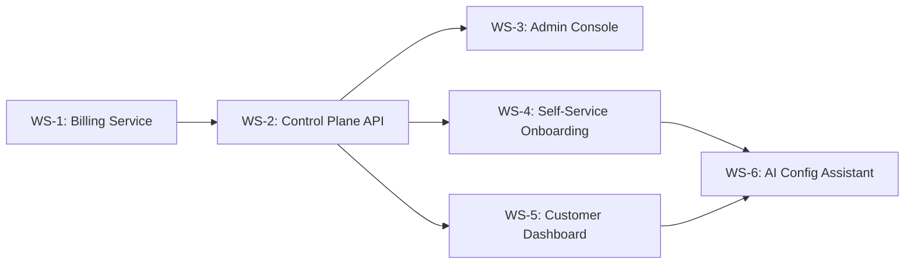

# Meridian Control Plane PRD

> **Status**: Not Started
> **Task Master Tag**: `control-plane`
> **Complexity**: 89 (Fibonacci)
> **Last Updated**: 2026-02-08

---

## Executive Summary

The Meridian Control Plane provides the management layer for operating Meridian as a commercial SaaS product. It builds upon existing infrastructure (Tenant Service, Usage Metering, RBAC, Gateway) to add:

1. **Stripe Integration** - Subscription billing and payment processing
2. **Admin Console** - Web UI for operators to manage tenants
3. **Self-Service Onboarding** - Web-based signup and provisioning flow
4. **Customer Dashboard** - Usage analytics and API key management
5. **AI Configuration Assistant** - Opus-powered conversational setup

This PRD focuses exclusively on **what needs building**, acknowledging the substantial existing infrastructure.

---

## What Already Exists

Before defining new work, we must acknowledge what's already built:

| Component | Location | Status |
|-----------|----------|--------|
| **Tenant Service** | `services/tenant/` | Full CRUD, async provisioning, status tracking |
| **Usage Metering** | `services/utilization-metering-consumer/` | Transforms audit events → measurements |
| **RBAC** | `shared/platform/auth/rbac.go` | Roles (admin, operator, auditor, service), permissions |
| **API Gateway** | `services/gateway/` | Subdomain routing, JWT auth, rate limiting |
| **Party Service** | `services/party/` | Organization/party registration |
| **tenantctl CLI** | `cmd/tenantctl/` | Register, list, get, deprovision tenants |
| **Gateway Config** | `services/payment-order/config/` | Payment gateway → account mapping |
| **Grafana Dashboards** | `deployments/grafana/dashboards/` | Org monitoring, production readiness |

**Key Insight**: The core multi-tenant infrastructure is production-ready. The Control Plane extends it for commercial operation, not replaces it.

---

## Goals

### Primary Goals

1. **Enable Revenue**: Connect usage metering to Stripe billing
2. **Self-Service Onboarding**: Customers can sign up without operator intervention
3. **Operational Visibility**: Operators have a single pane of glass for tenant management
4. **Customer Empowerment**: Tenants can view usage, manage API keys, access analytics

### Non-Goals

1. **Replacing CLI tools** - tenantctl remains for automation/scripting
2. **Custom billing engine** - Use Stripe's billing primitives
3. **Full CRM** - Customer relationship management is out of scope
4. **Support ticketing** - Integrate with existing solutions (Zendesk, Intercom)

---

## Architecture Overview

```
┌─────────────────────────────────────────────────────────────────┐
│                      Control Plane Layer                        │
├─────────────────────────────────────────────────────────────────┤
│                                                                 │
│  ┌──────────────┐  ┌──────────────┐  ┌──────────────────────┐  │
│  │ Admin Console│  │  Customer    │  │ AI Config Assistant  │  │
│  │   (React)    │  │  Dashboard   │  │     (Opus API)       │  │
│  └──────┬───────┘  └──────┬───────┘  └──────────┬───────────┘  │
│         │                 │                      │              │
│         └────────────┬────┴──────────────────────┘              │
│                      │                                          │
│              ┌───────▼────────┐                                 │
│              │ Control Plane  │                                 │
│              │   gRPC API     │                                 │
│              └───────┬────────┘                                 │
│                      │                                          │
├──────────────────────┼──────────────────────────────────────────┤
│                      │         Existing Services                │
│  ┌───────────────────┼───────────────────────────────────────┐  │
│  │                   ▼                                       │  │
│  │  ┌─────────┐ ┌─────────┐ ┌─────────┐ ┌─────────────────┐  │  │
│  │  │ Tenant  │ │  Usage  │ │  Party  │ │ Billing Service │  │  │
│  │  │ Service │ │ Metering│ │ Service │ │    (NEW)        │  │  │
│  │  └────┬────┘ └────┬────┘ └────┬────┘ └────────┬────────┘  │  │
│  │       │           │           │               │           │  │
│  │       └───────────┴───────────┴───────────────┘           │  │
│  │                          │                                │  │
│  │                    ┌─────▼─────┐                          │  │
│  │                    │  Stripe   │                          │  │
│  │                    │   API     │                          │  │
│  │                    └───────────┘                          │  │
│  └───────────────────────────────────────────────────────────┘  │
│                                                                 │
└─────────────────────────────────────────────────────────────────┘
```

---

## Work Streams

### WS-1: Billing Service & Stripe Integration (Complexity: 21)

**Objective**: Connect usage metering to Stripe for automated billing.

#### What Exists
- `UtilizationMeasurement` domain model in metering consumer
- Measurements recorded to Position Keeping's "tenant-zero" account
- Gateway account configuration supporting "stripe" as a gateway ID

#### What Needs Building

| Task | Description | Complexity |
|------|-------------|------------|
| **1.1** Create `services/billing/` service structure | gRPC service, domain models, repository | 3 |
| **1.2** Define billing protobuf contracts | `CreateSubscription`, `UpdateSubscription`, `CancelSubscription`, `GetInvoice`, `ListInvoices` | 2 |
| **1.3** Implement Stripe Customer sync | Create/update Stripe Customer on tenant creation | 3 |
| **1.4** Implement Stripe Subscription management | Map plan tiers to Stripe Price IDs | 3 |
| **1.5** Implement usage reporting to Stripe | Periodically push metered usage to Stripe Usage Records | 3 |
| **1.6** Implement Stripe webhook handler | Handle `invoice.paid`, `invoice.payment_failed`, `customer.subscription.updated`, etc. | 3 |
| **1.7** Add plan tier enforcement middleware | Check subscription status before allowing API calls | 2 |
| **1.8** Add graceful degradation for expired subscriptions | 7-day grace period, then read-only mode | 2 |

#### Plan Tier Definitions

```yaml
plans:
  starter:
    stripe_price_id: price_starter_monthly
    included:
      api_calls: 10000
      transactions: 1000
      storage_gb: 1
    rate_limits:
      requests_per_second: 10

  growth:
    stripe_price_id: price_growth_monthly
    included:
      api_calls: 100000
      transactions: 10000
      storage_gb: 10
    rate_limits:
      requests_per_second: 50

  scale:
    stripe_price_id: price_scale_monthly
    included:
      api_calls: unlimited
      transactions: unlimited
      storage_gb: 100
    rate_limits:
      requests_per_second: 200
```

#### Acceptance Criteria
- [ ] Tenant creation triggers Stripe Customer creation
- [ ] Subscription state synced bidirectionally (Meridian ↔ Stripe)
- [ ] Usage metrics reported to Stripe daily
- [ ] Webhooks update tenant status on payment events
- [ ] Expired subscriptions enter grace period, then freeze

---

### WS-2: Control Plane API (Complexity: 13)

**Objective**: Unified gRPC API for control plane operations.

#### What Exists
- `TenantService` with InitiateTenant, RetrieveTenant, UpdateTenantStatus
- `SagaAdminService` with GetCausationTree
- RBAC with platform-level permissions

#### What Needs Building

| Task | Description | Complexity |
|------|-------------|------------|
| **2.1** Define `ControlPlaneService` protobuf | Aggregate operations across tenant, billing, party | 2 |
| **2.2** Implement `OnboardTenant` RPC | Orchestrates: Party → Tenant → Stripe → Provisioning | 3 |
| **2.3** Implement `GetTenantDashboard` RPC | Returns tenant summary with billing, usage, status | 2 |
| **2.4** Implement `ManageAPIKeys` RPCs | CreateAPIKey, RevokeAPIKey, ListAPIKeys | 2 |
| **2.5** Implement `GetUsageAnalytics` RPC | Aggregated usage by time period, service, operation | 2 |
| **2.6** Add control plane auth interceptor | Require `platform:admin` or `platform:operator` role | 2 |

#### API Design

```protobuf
service ControlPlaneService {
  // Tenant lifecycle
  rpc OnboardTenant(OnboardTenantRequest) returns (OnboardTenantResponse);
  rpc SuspendTenant(SuspendTenantRequest) returns (SuspendTenantResponse);
  rpc DeprovisionTenant(DeprovisionTenantRequest) returns (DeprovisionTenantResponse);

  // Dashboard
  rpc GetTenantDashboard(GetTenantDashboardRequest) returns (TenantDashboard);
  rpc GetUsageAnalytics(GetUsageAnalyticsRequest) returns (UsageAnalytics);

  // API Keys
  rpc CreateAPIKey(CreateAPIKeyRequest) returns (APIKey);
  rpc RevokeAPIKey(RevokeAPIKeyRequest) returns (Empty);
  rpc ListAPIKeys(ListAPIKeysRequest) returns (ListAPIKeysResponse);

  // Billing
  rpc GetSubscription(GetSubscriptionRequest) returns (Subscription);
  rpc UpdateSubscription(UpdateSubscriptionRequest) returns (Subscription);
  rpc ListInvoices(ListInvoicesRequest) returns (ListInvoicesResponse);
}
```

#### Acceptance Criteria
- [ ] Single API for all control plane operations
- [ ] Proper authorization checks on all RPCs
- [ ] Audit logging for all state-changing operations
- [ ] Idempotent operations where appropriate

---

### WS-3: Admin Console (Complexity: 21)

**Objective**: Web UI for Meridian operators to manage tenants.

#### What Exists
- Grafana dashboards for monitoring (ops-focused, not management-focused)
- tenantctl CLI for basic operations
- gRPC-Gateway exposing REST endpoints

#### What Needs Building

| Task | Description | Complexity |
|------|-------------|------------|
| **3.1** Set up Next.js admin console project | `apps/admin-console/` with TypeScript, Tailwind | 3 |
| **3.2** Implement authentication flow | Platform user login via Auth0/Clerk | 3 |
| **3.3** Build tenant list view | Searchable, filterable table with status indicators | 2 |
| **3.4** Build tenant detail view | Billing info, usage stats, provisioning status, actions | 3 |
| **3.5** Build tenant creation wizard | Step-by-step: Org → Plan → Config → Review → Provision | 3 |
| **3.6** Build usage analytics dashboard | Charts: API calls, transactions, storage over time | 3 |
| **3.7** Build billing management view | Current plan, invoices, payment method, upgrade/downgrade | 2 |
| **3.8** Add real-time updates | WebSocket subscription for provisioning progress | 2 |

#### UI Wireframes

```
┌─────────────────────────────────────────────────────────────┐
│ Meridian Admin Console                    [User ▼] [Logout] │
├───────────┬─────────────────────────────────────────────────┤
│           │                                                 │
│ Dashboard │  Tenants (47)                    [+ New Tenant] │
│ Tenants   │  ┌─────────────────────────────────────────────┐│
│ Billing   │  │ Search...                    [Filter ▼]    ││
│ Analytics │  ├─────────────────────────────────────────────┤│
│ Settings  │  │ ● Acme Corp      | Growth  | $299/mo | Active│
│           │  │ ● TechStart Ltd  | Starter | $49/mo  | Active│
│           │  │ ○ OldCo Inc      | Scale   | $999/mo | Frozen│
│           │  │ ● NewBiz LLC     | Starter | $49/mo  | Prov..│
│           │  └─────────────────────────────────────────────┘│
│           │                                                 │
└───────────┴─────────────────────────────────────────────────┘
```

#### Tech Stack
- **Framework**: Next.js 14 (App Router)
- **UI**: shadcn/ui + Tailwind CSS
- **State**: TanStack Query (React Query)
- **Auth**: Clerk or Auth0
- **Charts**: Recharts or Tremor
- **gRPC**: Connect-Web (Buf)

#### Acceptance Criteria
- [ ] Operators can CRUD tenants without CLI
- [ ] Real-time visibility into provisioning progress
- [ ] Usage analytics with date range selection
- [ ] Invoice history with PDF download
- [ ] Role-based access (admin vs operator vs auditor views)

---

### WS-4: Self-Service Onboarding (Complexity: 13)

**Objective**: Customers can sign up and start using Meridian without operator intervention.

#### What Exists
- Party Service for organization registration
- Tenant Service with async provisioning
- Email verification patterns (not implemented)

#### What Needs Building

| Task | Description | Complexity |
|------|-------------|------------|
| **4.1** Set up onboarding web app | `apps/onboarding/` Next.js with multi-step wizard | 3 |
| **4.2** Implement email verification flow | Magic link or OTP verification | 2 |
| **4.3** Build organization setup step | Company name, industry, size | 1 |
| **4.4** Build plan selection step | Compare plans, select, enter payment | 2 |
| **4.5** Integrate Stripe Checkout | Embedded checkout for payment collection | 2 |
| **4.6** Implement provisioning progress view | Real-time status of schema creation | 2 |
| **4.7** Add welcome email with getting started | API keys, docs links, quickstart | 1 |

#### Onboarding Flow

```
┌──────────┐    ┌──────────┐    ┌──────────┐    ┌──────────┐    ┌──────────┐
│  Email   │───▶│  Verify  │───▶│   Org    │───▶│   Plan   │───▶│ Payment  │
│  Entry   │    │  Email   │    │  Setup   │    │ Selection│    │ (Stripe) │
└──────────┘    └──────────┘    └──────────┘    └──────────┘    └──────────┘
                                                                      │
┌──────────┐    ┌──────────┐    ┌──────────────────────────────────────┘
│ Dashboard│◀───│ Welcome  │◀───│   Provisioning   │
│  Access  │    │  Email   │    │    Progress      │
└──────────┘    └──────────┘    └──────────────────┘
```

#### Acceptance Criteria
- [ ] < 5 minutes from signup to working API keys
- [ ] Zero operator intervention for standard signups
- [ ] Failed payments block provisioning (don't create unpaid tenants)
- [ ] Abandoned signups tracked for re-engagement

---

### WS-5: Customer Dashboard (Complexity: 13)

**Objective**: Tenants can view their usage, manage API keys, and access billing.

#### What Exists
- Usage metering data in Position Keeping
- API key middleware (environment variable based)
- JWT claims include tenant_id

#### What Needs Building

| Task | Description | Complexity |
|------|-------------|------------|
| **5.1** Set up customer dashboard app | `apps/dashboard/` Next.js, tenant-scoped | 2 |
| **5.2** Implement tenant-scoped auth | JWT with tenant_id claim, route to correct tenant | 2 |
| **5.3** Build usage overview page | API calls, transactions, storage with sparklines | 2 |
| **5.4** Build API key management | Generate, revoke, view (masked), set permissions | 3 |
| **5.5** Build billing page | Current plan, upcoming invoice, payment method | 2 |
| **5.6** Build quickstart/docs integration | Embedded code samples with tenant's API key | 2 |

#### Customer Dashboard Layout

```
┌─────────────────────────────────────────────────────────────┐
│ Acme Corp Dashboard                       [Settings] [Help] │
├───────────┬─────────────────────────────────────────────────┤
│           │                                                 │
│ Overview  │  Usage This Month                               │
│ API Keys  │  ┌─────────────────────────────────────────────┐│
│ Billing   │  │ API Calls: 45,231 / 100,000  [━━━━━━░░░░░░]││
│ Docs      │  │ Transactions: 1,234 / 10,000 [━━░░░░░░░░░░]││
│ Settings  │  │ Storage: 2.1 GB / 10 GB      [━━░░░░░░░░░░]││
│           │  └─────────────────────────────────────────────┘│
│           │                                                 │
│           │  API Keys                          [+ New Key]  │
│           │  ┌─────────────────────────────────────────────┐│
│           │  │ pk_live_****4a2f  | Production | [Revoke]  ││
│           │  │ pk_test_****8b3c  | Test       | [Revoke]  ││
│           │  └─────────────────────────────────────────────┘│
│           │                                                 │
└───────────┴─────────────────────────────────────────────────┘
```

#### Acceptance Criteria
- [ ] Customers can view real-time usage
- [ ] API keys can be created/revoked without support
- [ ] Billing history accessible with invoice PDFs
- [ ] No access to other tenants' data

---

### WS-6: AI Configuration Assistant (Complexity: 8)

**Objective**: Opus-powered assistant helps customers configure their Meridian instance.

#### What Exists
- CEL policy runtime for validation, bucketing, valuation
- Starlark saga orchestration for business logic
- Instrument and account type definitions in Reference Data

#### What Needs Building

| Task | Description | Complexity |
|------|-------------|------------|
| **6.1** Define Meridian Manifest schema | JSON Schema for complete tenant configuration | 2 |
| **6.2** Create Opus system prompt for configuration | Domain expertise in ledgers, instruments, policies | 2 |
| **6.3** Implement manifest validation endpoint | Validate manifest against schema + dry-run | 2 |
| **6.4** Build conversational UI component | Chat interface in onboarding/dashboard | 2 |

#### Meridian Manifest Schema (Draft)

```json
{
  "$schema": "https://meridian.dev/manifest/v1",
  "organization": {
    "name": "Acme Energy Co",
    "industry": "energy"
  },
  "instruments": [
    {
      "code": "KWH",
      "name": "Kilowatt Hours",
      "type": "COMMODITY",
      "dimensions": { "unit": "energy", "precision": 3 }
    }
  ],
  "account_types": [
    {
      "code": "CUSTOMER_BALANCE",
      "normal_balance": "CREDIT",
      "instruments": ["KWH", "GBP"]
    }
  ],
  "policies": {
    "validation": {
      "customer_account_balance": "quantity >= 0"
    },
    "bucketing": {
      "energy_by_tariff": "period + '_' + tariff_code"
    }
  },
  "sagas": [
    {
      "name": "record_energy_usage",
      "script": "..."
    }
  ]
}
```

#### Acceptance Criteria
- [ ] User describes business in natural language
- [ ] Opus generates valid Meridian Manifest
- [ ] Manifest validates before provisioning
- [ ] CEL policies have syntax + type checking
- [ ] Generated config can be exported as YAML for GitOps

---

## Dependencies



**Critical Path**: WS-1 → WS-2 → WS-3/WS-4 (parallel) → WS-5 → WS-6

---

## Implementation Phases

### Phase 1: Revenue Foundation (Weeks 1-4)
- WS-1: Billing Service & Stripe Integration
- WS-2: Control Plane API

**Milestone**: Operators can onboard paying tenants via CLI with Stripe billing.

### Phase 2: Operator Experience (Weeks 5-8)
- WS-3: Admin Console

**Milestone**: Operators manage tenants through web UI.

### Phase 3: Customer Experience (Weeks 9-12)
- WS-4: Self-Service Onboarding
- WS-5: Customer Dashboard

**Milestone**: Customers can sign up and self-manage.

### Phase 4: Intelligence (Weeks 13-16)
- WS-6: AI Configuration Assistant

**Milestone**: Customers can configure Meridian conversationally.

---

## Success Metrics

| Metric | Target | Measurement |
|--------|--------|-------------|
| Time to first API call | < 5 minutes | Onboarding funnel analytics |
| Operator time per tenant | < 15 minutes | Admin console session tracking |
| Self-service signup rate | > 80% | Signups without support tickets |
| MRR per tenant | > $100 | Stripe dashboard |
| Churn rate | < 5%/month | Subscription cancellations |

---

## Related Documents

- [000-meridian-zero.md](000-meridian-zero.md) - Master vision for Meridian as a product
- [000-master-roadmap.md](000-master-roadmap.md) - PRD of PRDs with all work streams
- ADR-0019: Multi-Tenancy Architecture
- ADR-0021: Authentication and Authorization

---

## Appendix: Existing Infrastructure Deep Dive

### A. Tenant Service Capabilities

```go
// Already exists in services/tenant/service/grpc_service.go
type TenantService interface {
    InitiateTenant(ctx, req) (*TenantResponse, error)
    RetrieveTenant(ctx, req) (*TenantResponse, error)
    UpdateTenantStatus(ctx, req) (*TenantResponse, error)
    ListTenants(ctx, req) (*ListTenantsResponse, error)
    GetTenantProvisioningStatus(ctx, req) (*ProvisioningStatusResponse, error)
}
```

The Control Plane API (WS-2) wraps this with billing and party orchestration.

### B. Usage Metering Flow

```
Audit Event → Kafka → UtilizationMeteringConsumer → UtilizationMeasurement
                                ↓
                    Position Keeping (tenant-zero)
                                ↓
                    Billing Service (NEW) → Stripe Usage Records
```

The billing service plugs into existing metering, not replaces it.

### C. API Key Middleware

```go
// Exists in services/gateway/auth/apikey_middleware.go
// Currently: Environment variable based (API_KEYS="key:identity")
// Needed: Database-backed with per-tenant scoping
```

WS-5 (Customer Dashboard) upgrades this to database-backed API keys.
