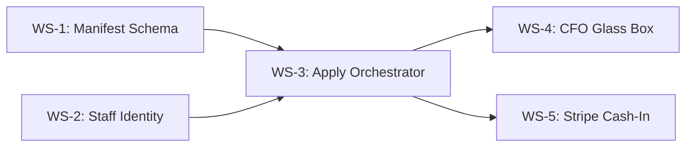

# Meridian Control Plane PRD

> **Status**: Not Started
> **Task Master Tag**: `control-plane`
> **Complexity**: 55 (First Client Sprint) / 89 (Full SaaS)
> **Last Updated**: 2026-02-08

---

## Executive Summary

The Meridian Control Plane is the **"Economy Compiler"** - the management layer that transforms declarative business model definitions into a running financial operations platform.

This PRD defines two paths:

1. **First Client Sprint (34 points)** - Minimum viable path to demo a paying client
2. **Full SaaS Build (89 points)** - Complete self-service platform

The key insight: **the Manifest is the product, not a feature**. The JSON schema that defines a business model is the core primitive. AI is just one way to generate it.

---

## What Already Exists

| Component | Location | Status |
|-----------|----------|--------|
| **Tenant Service** | `services/tenant/` | Full CRUD, async provisioning, status tracking |
| **Usage Metering** | `services/utilization-metering-consumer/` | Transforms audit events → measurements |
| **RBAC** | `shared/platform/auth/rbac.go` | Roles (admin, operator, auditor, service), permissions |
| **API Gateway** | `services/gateway/` | Subdomain routing, JWT auth, rate limiting |
| **Party Service** | `services/party/` | Organization/party registration (customers) |
| **Causation Tree** | `api/proto/meridian/saga/v1/saga_admin.proto` | GetCausationTree RPC for audit trails |
| **Dry-Run Validation** | Reference Data, Position Keeping | Validate before commit |
| **tenantctl CLI** | `cmd/tenantctl/` | Register, list, get, deprovision tenants |

**Critical Distinction**:
- `Party` = **Customers** with ledger positions (kWh balances, GBP holdings)
- `Staff` = **Employees** with Admin Console access (push Manifests, own API keys) ← **MISSING**

---

## First Client Sprint (4 Weeks, 34 Points)

This is the "behind-the-curtain" sequence to demo a paying client.

```
┌─────────────────────────────────────────────────────────────────┐
│                    FIRST CLIENT SPRINT                          │
├─────────────────────────────────────────────────────────────────┤
│                                                                 │
│  Week 1: Foundation          Week 2: Compiler                   │
│  ┌─────────────────────┐     ┌─────────────────────┐           │
│  │ Manifest Schema     │────▶│ ApplyManifest       │           │
│  │ Staff Registry      │     │ Orchestrator        │           │
│  │ API Key Persistence │     │ (Idempotent)        │           │
│  └─────────────────────┘     └──────────┬──────────┘           │
│                                         │                       │
│  Week 3: Glass Box           Week 4: Cash Rail                  │
│  ┌─────────────────────┐     ┌─────────▼───────────┐           │
│  │ Causation Visualizer│     │ Stripe Webhooks     │           │
│  │ Multi-Asset Balance │     │ Payment → Position  │           │
│  │ Sheet (CFO View)    │     │ Saga                │           │
│  └─────────────────────┘     └─────────────────────┘           │
│                                                                 │
└─────────────────────────────────────────────────────────────────┘
```

---

## Work Streams (Resequenced)

### WS-1: Meridian Manifest Schema (Complexity: 8) ⭐ P0

**Objective**: Define the declarative business model specification - the **"Administrative Control Record"**.

The Manifest is the single source of truth that prevents configuration drift. It defines the complete economy: assets, accounts, policies, and workflows.

#### What Needs Building

| Task | ID | Description | Complexity |
|------|-----|-------------|------------|
| **1.1** | `cp.manifest.schema` | Define JSON Schema for complete tenant configuration | 3 |
| **1.2** | `cp.manifest.validator` | Validate manifest against schema (structure check) | 2 |
| **1.3** | `cp.manifest.dryrun` | Dry-run validation using existing service mocks | 2 |
| **1.4** | `cp.manifest.examples` | Reference manifests for common industries | 1 |

#### Meridian Manifest Schema v1

```json
{
  "$schema": "https://meridian.dev/manifest/v1",
  "version": "1.0.0",
  "metadata": {
    "name": "Acme Energy Co",
    "industry": "energy",
    "description": "Prepaid energy metering for residential customers"
  },

  "instruments": [
    {
      "code": "KWH",
      "name": "Kilowatt Hours",
      "type": "COMMODITY",
      "dimensions": { "unit": "energy", "precision": 3 }
    },
    {
      "code": "GBP",
      "name": "British Pounds",
      "type": "FIAT",
      "dimensions": { "unit": "currency", "precision": 2 }
    }
  ],

  "account_types": [
    {
      "code": "CUSTOMER_PREPAID",
      "name": "Customer Prepaid Balance",
      "normal_balance": "CREDIT",
      "instruments": ["KWH", "GBP"],
      "policies": {
        "validation": "balance.quantity >= 0",
        "bucketing": "tariff_code + '_' + period_month"
      }
    },
    {
      "code": "REVENUE",
      "name": "Revenue Recognition",
      "normal_balance": "CREDIT",
      "instruments": ["GBP"]
    }
  ],

  "valuation_rules": [
    {
      "from": "KWH",
      "to": "GBP",
      "method": "SPOT_RATE",
      "source": "tariff_schedule"
    }
  ],

  "sagas": [
    {
      "name": "record_meter_reading",
      "trigger": "api:POST:/meters/{meter_id}/readings",
      "script_ref": "sagas/record_meter_reading.star"
    },
    {
      "name": "process_topup",
      "trigger": "webhook:stripe:payment_intent.succeeded",
      "script_ref": "sagas/process_topup.star"
    }
  ],

  "seed_data": {
    "tariffs": [
      { "code": "STANDARD", "rate_per_kwh": "0.28" },
      { "code": "ECONOMY7_DAY", "rate_per_kwh": "0.32" },
      { "code": "ECONOMY7_NIGHT", "rate_per_kwh": "0.12" }
    ]
  }
}
```

#### AI-Native Validation Feedback (Already Exists)

The Starlark and CEL runtimes already produce **structured, actionable error messages** at compilation time. This is the key to the AI-native feedback loop:

```
User/AI generates Manifest
        ↓
   ValidateManifest()
        ↓
   ┌────────────────────────────────────────────────────────┐
   │ Starlark Compiler    │ CEL Type Checker               │
   │ - Syntax errors      │ - Type mismatches              │
   │ - Undefined symbols  │ - Missing fields               │
   │ - Import failures    │ - Invalid operators            │
   └────────────────────────────────────────────────────────┘
        ↓
   Structured Error Response (machine-readable)
        ↓
   Feed back to AI / Display to user
        ↓
   Iterate until valid
```

**Example Validation Response** (what we already get):

```json
{
  "valid": false,
  "errors": [
    {
      "location": "policies.validation.customer_account_balance",
      "expression": "balance.quanity >= 0",
      "error_type": "CEL_UNDEFINED_FIELD",
      "message": "undefined field 'quanity' on type 'Balance'",
      "suggestion": "Did you mean 'quantity'?",
      "available_fields": ["quantity", "instrument", "bucket_id", "as_of"]
    },
    {
      "location": "sagas[0].script_ref",
      "expression": "sagas/record_meter_reading.star",
      "error_type": "STARLARK_COMPILE_ERROR",
      "message": "undefined: ctx.position_keepng",
      "line": 12,
      "column": 5,
      "suggestion": "Did you mean 'ctx.position_keeping'?"
    }
  ],
  "warnings": [
    {
      "location": "instruments[0]",
      "message": "Instrument 'KWH' has no valuation rule to base currency",
      "severity": "WARN"
    }
  ]
}
```

**Why This Matters**: The validation layer speaks the same language as the AI. When Opus generates a Manifest with a typo, the compiler tells it exactly what's wrong and how to fix it. No human in the loop required for iteration.

#### Acceptance Criteria
- [ ] JSON Schema published with full documentation
- [ ] Schema validation catches structural errors before API calls
- [ ] Dry-run validates CEL syntax and Starlark compilation
- [ ] **Validation errors include `suggestion` field for AI feedback loop**
- [ ] **Error responses are JSON-structured, not just strings**
- [ ] Example manifests for: energy, carbon credits, SaaS billing, loyalty points

---

### WS-2: Staff Identity Registry (Complexity: 8) ⭐ P0

**Objective**: Separate identity layer for tenant employees who manage the system.

This is distinct from `Party` (customers with ledger positions). Staff members:
- Log into the Admin Console
- Own and manage API keys
- Push Manifest updates
- View audit trails

#### What Exists
- RBAC with roles/permissions in `shared/platform/auth/rbac.go`
- JWT claims with `tenant_id`, `roles`, `scopes`
- API key middleware (environment variable based)

#### What Needs Building

| Task | ID | Description | Complexity |
|------|-----|-------------|------------|
| **2.1** | `cp.auth.staff-table` | Create `platform.staff_users` table with tenant association | 2 |
| **2.2** | `cp.auth.staff-service` | Staff CRUD: invite, activate, deactivate, list | 2 |
| **2.3** | `cp.auth.apikey-table` | Create `platform.api_keys` with hashed keys, scopes, rate limits | 2 |
| **2.4** | `cp.auth.apikey-gateway` | Update Gateway to validate API keys from database | 2 |

#### Data Model

```sql
-- Platform database (not tenant-scoped)
CREATE TABLE platform.staff_users (
    id UUID PRIMARY KEY DEFAULT gen_random_uuid(),
    tenant_id UUID NOT NULL REFERENCES platform.tenants(id),
    email VARCHAR(255) NOT NULL,
    name VARCHAR(255),
    role VARCHAR(50) NOT NULL DEFAULT 'operator', -- admin, operator, auditor
    status VARCHAR(20) NOT NULL DEFAULT 'invited', -- invited, active, suspended
    auth_provider_id VARCHAR(255), -- Auth0/Clerk user ID
    created_at TIMESTAMPTZ NOT NULL DEFAULT NOW(),
    updated_at TIMESTAMPTZ NOT NULL DEFAULT NOW(),
    UNIQUE(tenant_id, email)
);

CREATE TABLE platform.api_keys (
    id UUID PRIMARY KEY DEFAULT gen_random_uuid(),
    tenant_id UUID NOT NULL REFERENCES platform.tenants(id),
    staff_user_id UUID REFERENCES platform.staff_users(id), -- nullable for service keys
    key_prefix VARCHAR(12) NOT NULL, -- e.g., "pk_live_abc1"
    key_hash BYTEA NOT NULL, -- argon2id hash
    name VARCHAR(255),
    scopes TEXT[] NOT NULL DEFAULT '{}', -- ["read:positions", "write:transactions"]
    rate_limit_rps INTEGER DEFAULT 100,
    last_used_at TIMESTAMPTZ,
    expires_at TIMESTAMPTZ,
    created_at TIMESTAMPTZ NOT NULL DEFAULT NOW(),
    revoked_at TIMESTAMPTZ,
    UNIQUE(key_prefix)
);

CREATE INDEX idx_api_keys_prefix ON platform.api_keys(key_prefix) WHERE revoked_at IS NULL;
```

#### Acceptance Criteria
- [ ] Staff users can be invited to a tenant
- [ ] API keys are hashed (never stored plaintext)
- [ ] Gateway validates keys from database with caching
- [ ] Keys can be scoped to specific permissions
- [ ] Key usage is tracked (last_used_at)

---

### WS-3: Apply Manifest Orchestrator (Complexity: 13) ⭐ P0

**Objective**: The engine that turns JSON into gRPC calls. **Must be idempotent.**

This is the core "compiler" that reads a Manifest and orchestrates calls to existing services:
- `ReferenceData.RegisterInstrument`
- `ReferenceData.RegisterAccountType`
- `CurrentAccount.InitiateCurrentAccount`
- etc.

#### What Needs Building

| Task | ID | Description | Complexity |
|------|-----|-------------|------------|
| **3.1** | `cp.engine.differ` | Compute diff between current state and desired Manifest | 3 |
| **3.2** | `cp.engine.planner` | Generate ordered list of gRPC calls from diff | 3 |
| **3.3** | `cp.engine.executor` | Execute plan with rollback on failure | 3 |
| **3.4** | `cp.engine.status` | Track apply status: pending, applying, applied, failed | 2 |
| **3.5** | `cp.engine.history` | Store Manifest versions with who/when/diff | 2 |

#### API Design

```protobuf
service EconomyEngineService {
  // Validate manifest without applying
  rpc ValidateManifest(ValidateManifestRequest) returns (ValidationResult);

  // Compute what would change
  rpc PlanManifest(PlanManifestRequest) returns (ManifestPlan);

  // Apply manifest (idempotent)
  rpc ApplyManifest(ApplyManifestRequest) returns (ApplyManifestResponse);

  // Get current applied manifest
  rpc GetCurrentManifest(GetCurrentManifestRequest) returns (Manifest);

  // List manifest history
  rpc ListManifestVersions(ListManifestVersionsRequest) returns (ManifestVersionList);
}

message ManifestPlan {
  repeated PlannedAction actions = 1;
  bool has_breaking_changes = 2;
  string summary = 3;
}

message PlannedAction {
  string resource_type = 1; // "instrument", "account_type", "saga"
  string resource_id = 2;
  ActionType action = 3; // CREATE, UPDATE, DELETE, NO_CHANGE
  string description = 4;
}
```

#### Idempotency Contract

```
Apply(Manifest_v1) → State_A
Apply(Manifest_v1) → State_A  (no-op, same result)
Apply(Manifest_v2) → State_B  (diff applied)
Apply(Manifest_v1) → State_A  (rollback to v1)
```

#### Acceptance Criteria
- [ ] Applying the same manifest twice results in "No Changes"
- [ ] Plan shows exactly what will change before apply
- [ ] Failed applies leave system in consistent state
- [ ] Manifest history is auditable (who, when, diff)
- [ ] Breaking changes require explicit confirmation

---

### WS-4: CFO Glass Box UI (Complexity: 8)

**Objective**: The "Horizon-Proof" screen - show the numbers, then click to show the *why*.

This is the visualization layer that proves Meridian is trustworthy. It uses existing infrastructure:
- `GetCausationTree` RPC (exists in saga admin)
- Position aggregation from Position Keeping

#### What Needs Building

| Task | ID | Description | Complexity |
|------|-----|-------------|------------|
| **4.1** | `ui.causation.visualizer` | Interactive tree view of saga causation chains | 3 |
| **4.2** | `ui.balance.multiasset` | Multi-asset balance sheet (all instruments) | 2 |
| **4.3** | `ui.balance.drill` | Click position → see transactions → see causation | 2 |
| **4.4** | `ui.export.csv` | Export any view to CSV for auditors | 1 |

#### Causation Tree Visualization

```
┌─────────────────────────────────────────────────────────────────┐
│ Transaction: TXN-2026-0208-001                    [Export CSV]  │
├─────────────────────────────────────────────────────────────────┤
│                                                                 │
│  Causation Chain:                                               │
│                                                                 │
│  ┌─────────────────────────┐                                    │
│  │ Stripe Webhook          │ payment_intent.succeeded           │
│  │ 2026-02-08 14:23:01     │ £50.00                             │
│  └───────────┬─────────────┘                                    │
│              │                                                  │
│              ▼                                                  │
│  ┌─────────────────────────┐                                    │
│  │ Saga: process_topup     │ saga_exec_id: sge_abc123           │
│  │ 2026-02-08 14:23:02     │ duration: 45ms                     │
│  └───────────┬─────────────┘                                    │
│              │                                                  │
│       ┌──────┴──────┐                                           │
│       ▼             ▼                                           │
│  ┌─────────┐   ┌─────────┐                                      │
│  │ Debit   │   │ Credit  │                                      │
│  │ Stripe  │   │ Customer│                                      │
│  │ Nostro  │   │ Prepaid │                                      │
│  │ £50.00  │   │ £50.00  │                                      │
│  └─────────┘   └─────────┘                                      │
│                                                                 │
└─────────────────────────────────────────────────────────────────┘
```

#### Multi-Asset Balance Sheet

```
┌─────────────────────────────────────────────────────────────────┐
│ Balance Sheet: Acme Energy                   As of: 2026-02-08 │
├─────────────────────────────────────────────────────────────────┤
│                                                                 │
│  ASSETS                           GBP          KWH              │
│  ────────────────────────────────────────────────────────────   │
│  Stripe Nostro                    £12,450.00   -                │
│  Customer Receivables             £3,200.00    -                │
│  Energy Inventory                 -            45,000 kWh       │
│                                   ──────────   ──────────       │
│  Total Assets                     £15,650.00   45,000 kWh       │
│                                                                 │
│  LIABILITIES                                                    │
│  ────────────────────────────────────────────────────────────   │
│  Customer Prepaid Balances        £8,900.00    12,500 kWh       │
│  Deferred Revenue                 £2,100.00    -                │
│                                   ──────────   ──────────       │
│  Total Liabilities                £11,000.00   12,500 kWh       │
│                                                                 │
│  EQUITY                                                         │
│  ────────────────────────────────────────────────────────────   │
│  Retained Earnings                £4,650.00    32,500 kWh       │
│                                                                 │
│  [Click any row to drill down to positions and transactions]    │
│                                                                 │
└─────────────────────────────────────────────────────────────────┘
```

#### Acceptance Criteria
- [ ] Any number can be clicked to show its source transactions
- [ ] Causation tree shows complete audit trail
- [ ] Balance sheet supports multiple instruments
- [ ] CSV export for auditor compliance

---

### WS-5: Stripe Cash-In Rail (Complexity: 5)

**Objective**: Prove the system touches "Real Money" with the "Everything is a Position" invariant.

**Key Architectural Decision**: Billing records revenue as positions FIRST, then settles to Stripe. This maintains ledger integrity.

```
Stripe Webhook → Revenue Position (tenant-zero) → Stripe Settlement
                       ↓
              Internal Ledger is
              Source of Truth
```

#### What Needs Building

| Task | ID | Description | Complexity |
|------|-----|-------------|------------|
| **5.1** | `cp.stripe.webhook` | Webhook listener for payment events | 2 |
| **5.2** | `cp.stripe.saga` | Saga: payment_intent.succeeded → credit ledger | 2 |
| **5.3** | `cp.stripe.reconcile` | Daily reconciliation report (Stripe vs Ledger) | 1 |

#### Webhook → Saga Flow

```go
// Webhook handler
func (h *StripeWebhookHandler) HandlePaymentIntentSucceeded(event stripe.Event) error {
    pi := event.Data.Object.(*stripe.PaymentIntent)

    // Trigger saga via Kafka
    return h.publisher.Publish(ctx, &events.PaymentReceived{
        TenantID:        pi.Metadata["tenant_id"],
        PartyID:         pi.Metadata["party_id"],
        Amount:          pi.Amount,
        Currency:        pi.Currency,
        StripePaymentID: pi.ID,
        CausationID:     event.ID,
    })
}
```

```python
# sagas/stripe_payment_received.star
def execute(ctx, event):
    # Record revenue position (tenant-zero ledger)
    ctx.position_keeping.record_transaction(
        account_id = "stripe_nostro",
        instrument = event.currency.upper(),
        quantity = event.amount / 100,  # cents to major units
        direction = "DEBIT",
        causation_id = event.causation_id,
    )

    # Credit customer's prepaid balance
    ctx.position_keeping.record_transaction(
        account_id = event.party_id + "_prepaid",
        instrument = event.currency.upper(),
        quantity = event.amount / 100,
        direction = "CREDIT",
        causation_id = event.causation_id,
    )

    return {"status": "completed", "position_ids": [...]}
```

#### Acceptance Criteria
- [ ] Stripe webhooks are verified (signature check)
- [ ] Payment creates double-entry in ledger
- [ ] Daily reconciliation catches discrepancies
- [ ] Webhook failures are retried with idempotency

---

### WS-6: Billing Service (Complexity: 21) — Full SaaS Only

**Objective**: Connect usage metering to Stripe for automated subscription billing.

> **Note**: This is for billing **Meridian's customers**, not the tenant's customers.
> Uses tenant-zero as the billing ledger (dogfooding).

| Task | Description | Complexity |
|------|-------------|------------|
| **6.1** | Create `services/billing/` service structure | 3 |
| **6.2** | Define billing protobuf contracts | 2 |
| **6.3** | Implement Stripe Customer sync on tenant creation | 3 |
| **6.4** | Implement Stripe Subscription management | 3 |
| **6.5** | Implement usage reporting to Stripe | 3 |
| **6.6** | Implement Stripe webhook handler for Meridian billing | 3 |
| **6.7** | Add plan tier enforcement middleware | 2 |
| **6.8** | Add graceful degradation for expired subscriptions | 2 |

---

### WS-7: Admin Console (Complexity: 21) — Full SaaS Only

**Objective**: Web UI for Meridian operators to manage tenants.

| Task | Description | Complexity |
|------|-------------|------------|
| **7.1** | Set up Next.js admin console project | 3 |
| **7.2** | Implement authentication flow (Auth0/Clerk) | 3 |
| **7.3** | Build tenant list and detail views | 5 |
| **7.4** | Build tenant creation wizard with Manifest editor | 5 |
| **7.5** | Build usage analytics dashboard | 3 |
| **7.6** | Add real-time provisioning updates | 2 |

---

### WS-8: Self-Service Onboarding (Complexity: 13) — Full SaaS Only

**Objective**: Customers can sign up without operator intervention.

| Task | Description | Complexity |
|------|-------------|------------|
| **8.1** | Set up onboarding web app | 3 |
| **8.2** | Implement email verification | 2 |
| **8.3** | Build organization setup step | 1 |
| **8.4** | Build plan selection with Stripe Checkout | 3 |
| **8.5** | Implement provisioning progress view | 2 |
| **8.6** | Add welcome email with getting started | 2 |

---

### WS-9: Declarative Economy Engine (Complexity: 8) — Full SaaS Only

**Objective**: AI-assisted Manifest generation (Opus integration).

> **Renamed from "AI Configuration Assistant"** - The Manifest is the product; AI is one input method.

#### AI-Native Architecture (Leverage Existing Compiler)

The system is **AI-native by design** because the compiler feedback loop is already structured for machine consumption:

```
┌─────────────────────────────────────────────────────────────────┐
│                    OPUS GENERATION LOOP                         │
├─────────────────────────────────────────────────────────────────┤
│                                                                 │
│  User: "I run a prepaid energy company with day/night tariffs" │
│                          ↓                                      │
│  ┌──────────────────────────────────────────────────────────┐  │
│  │ Opus generates Manifest v1                                │  │
│  │ (instruments: KWH, GBP; policies: balance >= 0)          │  │
│  └────────────────────────┬─────────────────────────────────┘  │
│                           ↓                                     │
│  ┌──────────────────────────────────────────────────────────┐  │
│  │ ValidateManifest() → Starlark/CEL Compiler               │  │
│  │ Error: "undefined field 'quanity' on Balance"            │  │
│  │ Suggestion: "Did you mean 'quantity'?"                   │  │
│  └────────────────────────┬─────────────────────────────────┘  │
│                           ↓                                     │
│  ┌──────────────────────────────────────────────────────────┐  │
│  │ Opus receives structured error, auto-corrects            │  │
│  │ Generates Manifest v2 with fix                           │  │
│  └────────────────────────┬─────────────────────────────────┘  │
│                           ↓                                     │
│  ┌──────────────────────────────────────────────────────────┐  │
│  │ ValidateManifest() → ✓ Valid                             │  │
│  │ PlanManifest() → "Will create 2 instruments, 3 accounts" │  │
│  └────────────────────────┬─────────────────────────────────┘  │
│                           ↓                                     │
│  User: "Looks good, apply it"                                  │
│                           ↓                                     │
│  ApplyManifest() → Running tenant in < 5 minutes               │
│                                                                 │
└─────────────────────────────────────────────────────────────────┘
```

**Key Insight**: We don't need to build "AI validation" - the compiler IS the validator. Opus just needs to:
1. Generate JSON that conforms to the schema
2. Read structured errors from the compiler
3. Self-correct until valid

This is why Starlark and CEL were chosen: **they have excellent error messages by design**.

| Task | Description | Complexity |
|------|-------------|------------|
| **9.1** | Create Opus system prompt with schema + error handling instructions | 2 |
| **9.2** | Implement conversational UI with validate-on-change | 3 |
| **9.3** | Add "executable examples" corpus for few-shot learning | 2 |
| **9.4** | Implement export to YAML for GitOps workflows | 1 |

#### Acceptance Criteria
- [ ] Opus can self-correct from compiler errors without human help
- [ ] < 3 iterations from natural language to valid Manifest (p95)
- [ ] Generated CEL/Starlark passes type checking on first valid attempt
- [ ] User can export to YAML and apply via `git push`

---

## Dependencies & Sequencing

### First Client Sprint (34 Points)



| Order | Task Master ID | Work Stream | Points |
|:------|:---------------|:------------|:-------|
| 1 | `cp.manifest.*` | WS-1: Manifest Schema | 8 |
| 2 | `cp.auth.*` | WS-2: Staff Identity | 8 |
| 3 | `cp.engine.*` | WS-3: Apply Orchestrator | 13 |
| 4 | `ui.causation.*`, `ui.balance.*` | WS-4: CFO Glass Box | 8 |
| 5 | `cp.stripe.*` | WS-5: Stripe Cash-In | 5 |
| | | **Total** | **42** |

*Note: Adjusted to 42 after detailed task breakdown (Gemini estimated 34)*

### Full SaaS Build (89 Points)

After First Client Sprint:
- WS-6: Billing Service (21)
- WS-7: Admin Console (21)
- WS-8: Self-Service Onboarding (13)
- WS-9: Declarative Economy Engine (8)

---

## Implementation Timeline

### First Client Sprint (Weeks 1-4)

| Week | Focus | Deliverables |
|------|-------|--------------|
| **1** | Foundation | Manifest JSON Schema, `staff_users` + `api_keys` tables, Gateway API key validation |
| **2** | Compiler | `ApplyManifest` orchestrator, idempotent execution, manifest versioning |
| **3** | Glass Box | Causation tree visualizer, multi-asset balance sheet, drill-down UI |
| **4** | Cash Rail | Stripe webhooks, payment → ledger saga, reconciliation report |

**Demo Milestone**: Show client their business model as JSON, apply it, show the CFO balance sheet, process a Stripe payment, click to show the audit trail.

### Full SaaS (Weeks 5-16)

| Phase | Weeks | Work Streams |
|-------|-------|--------------|
| **Revenue Engine** | 5-8 | WS-6: Billing Service |
| **Operator Experience** | 9-12 | WS-7: Admin Console |
| **Customer Experience** | 13-16 | WS-8: Onboarding, WS-9: AI Engine |

---

## Success Metrics

### First Client Sprint

| Metric | Target |
|--------|--------|
| Manifest → Running Tenant | < 5 minutes |
| Apply idempotency | 100% (same manifest = no changes) |
| Causation tree depth | Visible to leaf transactions |
| Stripe → Ledger latency | < 1 second |

### Full SaaS

| Metric | Target |
|--------|--------|
| Time to first API call | < 5 minutes |
| Self-service signup rate | > 80% |
| MRR per tenant | > $100 |
| Churn rate | < 5%/month |

---

## Task Master Entry Format

Each task should be entered as:

```yaml
- id: cp.manifest.schema
  title: Define Meridian Manifest JSON Schema
  description: |
    Create the JSON Schema specification for the complete tenant
    business model configuration. Must cover:
    - Instruments (assets, currencies, commodities)
    - Account types with CEL policies
    - Valuation rules
    - Saga definitions with triggers
    - Seed data
  complexity: 3
  dependencies: []
  tags: [control-plane, p0, first-client]

- id: cp.auth.staff-registry
  title: Implement Staff Identity Registry
  description: |
    Create the admin/staff identity layer separate from Party.
    Staff users own API keys and access the Admin Console.
    Includes:
    - platform.staff_users table
    - platform.api_keys table with hashed keys
    - Staff CRUD service
  complexity: 4
  dependencies: []
  tags: [control-plane, p0, first-client]

- id: cp.engine.apply-orchestrator
  title: Implement ApplyManifest Orchestrator
  description: |
    The core "compiler" that turns Manifest JSON into gRPC calls.
    Must be idempotent - applying same manifest twice = no changes.
    Includes differ, planner, executor, and status tracking.
  complexity: 13
  dependencies: [cp.manifest.schema, cp.auth.staff-registry]
  tags: [control-plane, p0, first-client]
```

---

## Related Documents

- [000-meridian-zero.md](000-meridian-zero.md) - Master vision for Meridian as a product
- [000-master-roadmap.md](000-master-roadmap.md) - PRD of PRDs with all work streams
- ADR-0019: Multi-Tenancy Architecture
- ADR-0021: Authentication and Authorization

---

## Appendix: Architectural Decisions

### A. "Everything is a Position" Invariant

All financial state flows through the ledger, including Meridian's own billing:

```
Usage Event → Utilization Metering → Position (tenant-zero)
                                           ↓
                                    Billing Service
                                           ↓
                                    Stripe Invoice
                                           ↓
                                    Payment Webhook
                                           ↓
                              Revenue Position (tenant-zero)
```

This means:
1. Stripe is a settlement rail, not source of truth
2. Reconciliation compares Stripe to ledger (not the reverse)
3. Revenue recognition happens at position creation

### B. Staff vs Party Identity

| Aspect | Party | Staff |
|--------|-------|-------|
| **Purpose** | Customer with ledger positions | Employee managing the system |
| **Lives in** | Tenant schema (`org_xxx.party`) | Platform schema (`platform.staff_users`) |
| **Has** | Balances, transactions | API keys, console access |
| **Created by** | Tenant API calls | Admin invitation |
| **Examples** | "John Smith - Customer #123" | "Jane Doe - Acme Admin" |

### C. Manifest Idempotency

The Apply Orchestrator follows Terraform-style semantics:

```
State = f(Manifest)

Apply(M) when State = {} → Create all resources
Apply(M) when State = M → No-op
Apply(M') when State = M → Create/Update/Delete delta
```

This enables:
- GitOps workflows (commit manifest → auto-apply)
- Rollback by applying previous version
- Preview changes before apply (plan mode)

### D. AI-Native by Design

Meridian's technology choices were made with AI-assisted configuration in mind:

| Choice | Why AI-Native |
|--------|---------------|
| **Starlark** | Hermetic, deterministic, excellent error messages with line/column info |
| **CEL** | Strongly typed with inference, "Did you mean X?" suggestions built-in |
| **JSON Schema** | LLMs are pre-trained on JSON, schema provides guardrails |
| **Structured Errors** | Machine-readable errors can feed directly back to LLM context |
| **Dry-Run Validation** | Test without side effects, iterate until correct |

**The Compiler as AI Pair Programmer**:

Traditional systems require humans to interpret error messages and fix code. Meridian's compiler produces errors that are:

1. **Specific**: "Line 12, column 5: undefined 'ctx.position_keepng'"
2. **Actionable**: "Did you mean 'ctx.position_keeping'?"
3. **Contextual**: "Available fields: quantity, instrument, bucket_id, as_of"
4. **Structured**: JSON format, not prose

This means an LLM can:
1. Generate a Manifest
2. Receive structured validation errors
3. Self-correct without human interpretation
4. Iterate until valid

**Existing Infrastructure That Enables This**:

```go
// Already in shared/pkg/valuation/engine.go
type ValidationError struct {
    Location    string   `json:"location"`
    Expression  string   `json:"expression"`
    ErrorType   string   `json:"error_type"`
    Message     string   `json:"message"`
    Suggestion  string   `json:"suggestion,omitempty"`
    LineNumber  int      `json:"line,omitempty"`
    Column      int      `json:"column,omitempty"`
    Available   []string `json:"available_fields,omitempty"`
}
```

This is not "adding AI" - this is exposing existing compiler intelligence to external consumers (including AI).
