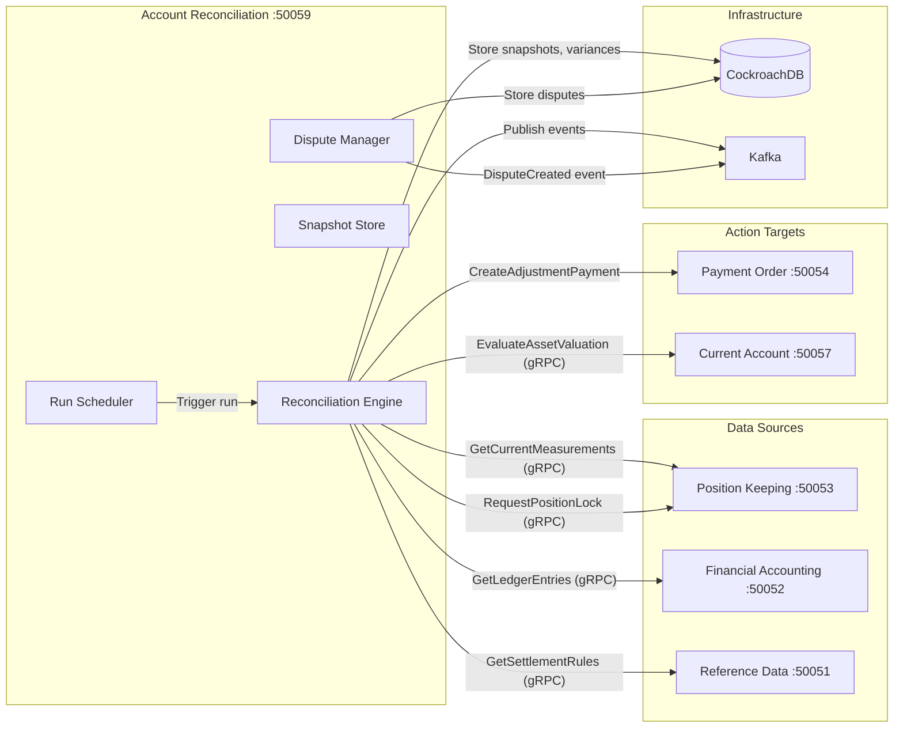
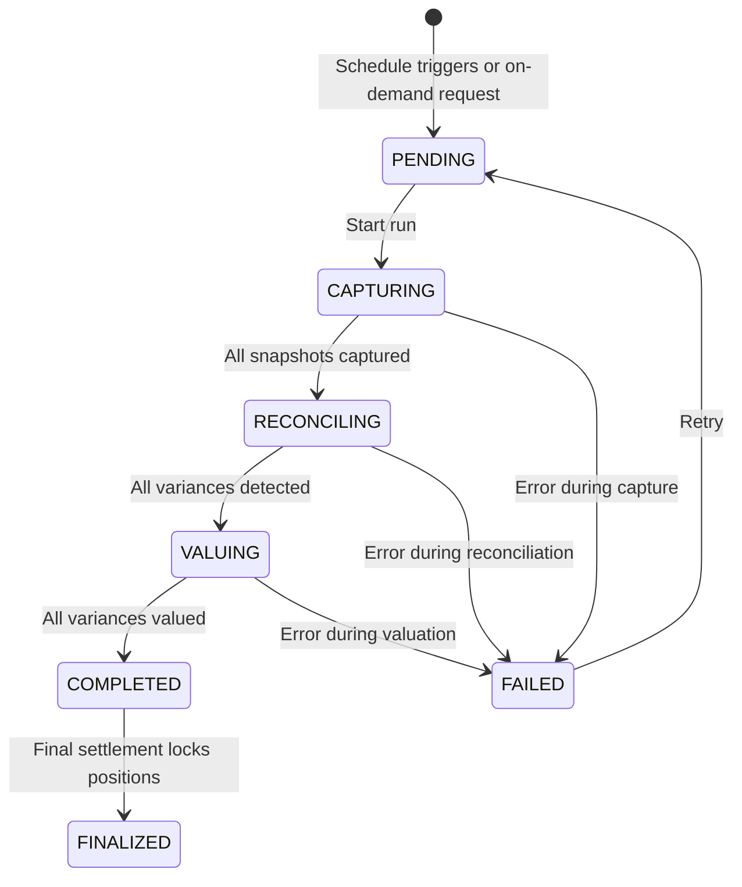
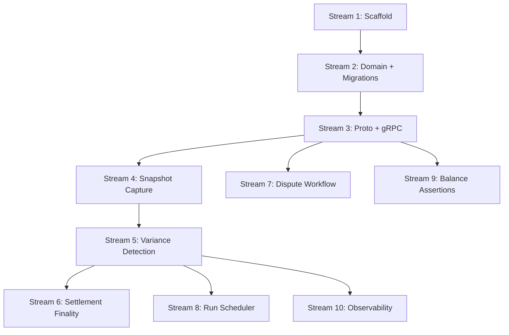

# PRD: Account Reconciliation Service Domain (BIAN-Native)

**Status:** Draft
**Version:** 1.0
**BIAN Service Domain:** Account Reconciliation (Fulfilment Pattern)
**Story Points:** 55 (estimated, 8 streams)
**Core ADRs:**

- [ADR-0017: Temporal Quality Ladder](../adr/0017-temporal-quality-ladder.md)
- [ADR-0018: Settlement & Reconciliation](../adr/0018-settlement-reconciliation.md)

## BIAN Terminology Mapping

| Meridian Term | BIAN-Aligned Term | Rationale |
|---------------|-------------------|-----------|
| Reconciliation Service | **Account Reconciliation** | Canonical BIAN Service Domain |
| Settlement Run | **AccountReconciliationProcedure** | Control Record (CR) for reconciliation lifecycle |
| Variance | **ReconciliationResult** | Behavior Qualifier capturing detected differences |
| Settlement Snapshot | **SettlementCapture** | BQ capturing position state at settlement time |
| Dispute | **ReconciliationDispute** | BQ for post-finality corrections |
| Adjustment Entry | **ReconciliationAdjustment** | BQ for financial corrections |

**Action Terms Compliance:**

| Operation | BIAN Action Term | Pattern |
|-----------|------------------|---------|
| `InitiateAccountReconciliation` | **Initiate** | FULFILL (start reconciliation run) |
| `ExecuteAccountReconciliation` | **Execute** | FULFILL (run variance detection) |
| `RetrieveAccountReconciliation` | **Retrieve** | INQUIRE (query results) |
| `ControlAccountReconciliation` | **Control** | FULFILL (lock for finality) |
| `RequestReconciliationDispute` | **Request** | FULFILL (create dispute) |
| `UpdateReconciliationDispute` | **Update** | FULFILL (resolve dispute) |

## 1. Executive Summary

The Account Reconciliation service manages the full settlement lifecycle:
capturing position snapshots, detecting variances when better data arrives,
generating financial adjustments, and handling disputes after settlement
finality.

This is the service that answers: **"We settled on 10 kWh, but the meter says 12 kWh. What do we owe?"**

### Why a Dedicated Service

Reconciliation is inherently cross-cutting. It must:

| Interaction | Service | Direction |
|-------------|---------|-----------|
| Read current measurements | Position Keeping | gRPC query |
| Read/write settlement snapshots | Own database | Local |
| Read GL entries for balance verification | Financial Accounting | gRPC query |
| Request variance valuation | Valuation Engine (via Account) | gRPC query |
| Create adjustment payments | Payment Order | gRPC/event |
| Read asset settlement rules | Reference Data | gRPC query |
| Publish reconciliation events | Kafka | Async |

Embedding this in Financial Accounting creates a circular dependency
(FA calls PK, PK publishes events to FA, FA calls PK again for reconciliation).
A dedicated service breaks this cycle cleanly.

### Architecture at a Glance

```text
services/reconciliation/           # Standalone microservice
├── cmd/                           # Entry point, main.go, Dockerfile
├── domain/                        # Core domain: runs, snapshots, variances, disputes
├── service/                       # gRPC service + settlement run orchestrator
├── adapters/
│   ├── persistence/               # CockroachDB repositories
│   └── messaging/                 # Kafka publisher
├── client/                        # Service-owned client library
├── worker/                        # Settlement run scheduler (cron-based)
├── atlas/                         # Atlas schema config
├── migrations/                    # Database migrations
├── observability/                 # Metrics, tracing
└── k8s/                           # Kubernetes manifests
```

## 2. The Problem Statement

### 2.1 The Settlement Gap

Meridian today guarantees **transactional consistency** (saga compensation
ensures debits match credits) but lacks **temporal consistency** (no mechanism
to detect and correct when estimated values are replaced by actuals).

| What Exists | What's Missing |
|-------------|----------------|
| Position Keeping tracks quality ladder (ESTIMATE → ACTUAL) | No process captures settlement state for later comparison |
| Delta Engine triggers Wash & Reload corrections | No aggregate view of net variance across a settlement period |
| Financial Accounting posts GL entries | No verification that GL totals match position totals |
| Payment Order executes payments | No trigger to create adjustment payments for variances |

### 2.2 Real-World Settlement Patterns

Every asset type has a settlement lifecycle with different timing:

| Asset Type | Example | Settlement Schedule | Final Settlement |
|------------|---------|---------------------|------------------|
| Currency (GBP) | Bank transfer | D+0 (same day) | D+0 |
| Energy (kWh) | Half-hourly consumption | D+1, D+5, M+3, M+14 | M+14 |
| Compute (GPU-hours) | Cloud billing | D+1, M+1 | M+1 |
| Carbon (tCO2e) | Offset certificate | M+3, M+12 | Registry-dependent |
| Vouchers | Aid disbursement | D+1, M+1 | M+3 |

### 2.3 The Cross-Account Balance Problem

Position Keeping doesn't validate that system-wide debits equal credits.
The safety today comes from saga design (every saga that debits one account
credits another). But:

- What if a saga partially completes and compensation fails silently?
- What if a Wash & Reload correction updates one side but not the other?
- What if an external system (bank, meter) reports different totals than our ledger?

The reconciliation service provides the **detective control** that catches these issues.

## 3. Service Boundaries

### 3.1 What This Service Owns

| Capability | Description |
|------------|-------------|
| **Settlement Runs** | Lifecycle management of scheduled and on-demand reconciliation runs |
| **Settlement Snapshots** | Point-in-time capture of measurement state for each position |
| **Variance Detection** | Compare snapshots against current positions, compute deltas |
| **Variance Valuation** | Price the delta using the tariff at the original period |
| **Adjustment Generation** | Create adjustment entries that feed into Payment Order |
| **Settlement Finality** | Request position locking in Position Keeping after final run |
| **Dispute Management** | Handle corrections for locked (finalized) positions |
| **Run Scheduling** | Cron-based execution of settlement runs per asset type |
| **Cross-Account Balance Assertions** | Verify system-wide debit/credit balance per instrument |

### 3.2 What This Service Does NOT Own

| Capability | Owned By | Interaction Pattern |
|------------|----------|---------------------|
| Measurements / Quality Ladder | Position Keeping | gRPC read |
| GL Entries / Ledger Postings | Financial Accounting | gRPC read |
| Position Locking (`locked_at`) | Position Keeping | gRPC request (Control operation) |
| Valuation / Pricing | Valuation Engine (embedded in Account services) | gRPC EvaluateAssetValuation |
| Payment Execution | Payment Order | gRPC / Kafka event |
| Asset Settlement Rules | Reference Data | gRPC read |
| Measurement Ingestion | Position Keeping | N/A (upstream of this service) |

### 3.3 Service Interaction Diagram



## 4. Domain Model

### 4.1 Settlement Run (Control Record)

```go
// SettlementRun is the aggregate root (BIAN: AccountReconciliationProcedure CR).
// Represents a single reconciliation cycle for a specific asset type and period.
type SettlementRun struct {
    ID              uuid.UUID
    TenantID        uuid.UUID
    AssetCode       string            // "ELEC_HH_KWH", "GBP", "GPU_HOUR"
    RunType         SettlementRunType // "D+1", "D+5", "M+3", "M+14", "FINAL", "ON_DEMAND"
    PeriodStart     time.Time         // Start of settlement window
    PeriodEnd       time.Time         // End of settlement window
    Status          RunStatus
    SnapshotCount   int               // Number of positions captured
    VarianceCount   int               // Number of variances detected
    TotalVariance   decimal.Decimal   // Net variance value (settlement currency)
    StartedAt       time.Time
    CompletedAt     *time.Time
    Error           *string           // If FAILED, the error message
    CreatedAt       time.Time
    Version         int               // Optimistic locking
}

type RunStatus string

const (
    RunStatusPending    RunStatus = "PENDING"     // Created, not started
    RunStatusCapturing  RunStatus = "CAPTURING"   // Taking settlement snapshots
    RunStatusReconciling RunStatus = "RECONCILING" // Comparing snapshots to current
    RunStatusValuing    RunStatus = "VALUING"      // Pricing variances
    RunStatusCompleted  RunStatus = "COMPLETED"    // All variances detected and valued
    RunStatusFailed     RunStatus = "FAILED"       // Error during processing
    RunStatusFinalized  RunStatus = "FINALIZED"    // Positions locked (final settlement only)
)
```

### 4.2 Settlement Snapshot (Behavior Qualifier)

```go
// SettlementSnapshot captures the measurement state at settlement time.
// Preserves provenance for variance explanation.
type SettlementSnapshot struct {
    ID               uuid.UUID
    SettlementRunID  uuid.UUID
    AccountID        uuid.UUID
    AssetCode        string
    PeriodStart      time.Time
    PeriodEnd        time.Time
    Attributes       map[string]string // Fungibility context (peak/off-peak, vintage)
    MeasurementID    uuid.UUID         // The measurement used at settlement
    QuantitySettled  decimal.Decimal   // Snapshot of quantity
    QualityAtSettle  int               // Quality score at settlement time
    SourceAtSettle   string            // "ESTIMATE", "ACTUAL_VALIDATED", etc.
    SettlementType   SettlementType    // PROVISIONAL or FINAL
    CreatedAt        time.Time
}

type SettlementType string

const (
    SettlementProvisional SettlementType = "PROVISIONAL" // Subject to reconciliation
    SettlementFinal       SettlementType = "FINAL"       // No further reconciliation
)
```

### 4.3 Variance (Behavior Qualifier)

```go
// Variance records a detected difference between settled and current positions.
type Variance struct {
    ID                uuid.UUID
    SettlementRunID   uuid.UUID
    SnapshotID        uuid.UUID
    AccountID         uuid.UUID
    AssetCode         string
    PeriodStart       time.Time
    PeriodEnd         time.Time

    // Settled state (from snapshot)
    QuantitySettled   decimal.Decimal
    SourceAtSettle    string
    QualityAtSettle   int

    // Current state (from Position Keeping)
    QuantityCurrent   decimal.Decimal
    SourceCurrent     string
    QualityCurrent    int

    // Delta
    QuantityDelta     decimal.Decimal   // Current - Settled
    ValueDelta        decimal.Decimal   // Priced variance in settlement currency
    Currency          string            // Settlement currency

    // Classification
    VarianceReason    VarianceReason    // Why the variance exists
    Status            VarianceStatus
    AdjustmentID      *uuid.UUID        // Links to Payment Order adjustment
    CreatedAt         time.Time
}

type VarianceReason string

const (
    VarianceReasonQualityUpgrade   VarianceReason = "QUALITY_UPGRADE"    // Better data replaced estimate
    VarianceReasonCorrectionApplied VarianceReason = "CORRECTION_APPLIED" // Wash & Reload occurred
    VarianceReasonExternalMismatch VarianceReason = "EXTERNAL_MISMATCH"  // External system disagrees
    VarianceReasonManualAdjustment VarianceReason = "MANUAL_ADJUSTMENT"  // Operator correction
)

type VarianceStatus string

const (
    VarianceStatusDetected  VarianceStatus = "DETECTED"   // Variance found
    VarianceStatusValued    VarianceStatus = "VALUED"      // Priced in settlement currency
    VarianceStatusAdjusted  VarianceStatus = "ADJUSTED"    // Adjustment payment created
    VarianceStatusDisputed  VarianceStatus = "DISPUTED"    // Referred to dispute workflow
)
```

### 4.4 Dispute (Behavior Qualifier)

```go
// Dispute represents a correction request for a locked (finalized) position.
type Dispute struct {
    ID                    uuid.UUID
    TenantID              uuid.UUID
    AccountID             uuid.UUID
    AssetCode             string
    PeriodStart           time.Time
    PeriodEnd             time.Time
    IncomingMeasurementID uuid.UUID         // New data that triggered the dispute
    ExistingMeasurementID uuid.UUID         // Locked measurement
    QuantityDifference    decimal.Decimal
    Reason                string
    Status                DisputeStatus
    Resolution            *DisputeResolution
    ResolvedAt            *time.Time
    ResolvedBy            *string           // Operator ID
    CreatedAt             time.Time
}

type DisputeStatus string

const (
    DisputeStatusPendingReview DisputeStatus = "PENDING_REVIEW"
    DisputeStatusInvestigating DisputeStatus = "INVESTIGATING"
    DisputeStatusApproved      DisputeStatus = "APPROVED"      // Will create adjustment
    DisputeStatusRejected      DisputeStatus = "REJECTED"      // No action needed
    DisputeStatusClosed        DisputeStatus = "CLOSED"
)

type DisputeResolution struct {
    Type          string          // "ADJUST", "REJECT", "EXTEND_WINDOW"
    AdjustmentID  *uuid.UUID      // If Type == "ADJUST"
    Notes         string
}
```

### 4.5 Balance Assertion (Cross-Account Verification)

```go
// BalanceAssertion verifies system-wide debit/credit balance for an instrument.
type BalanceAssertion struct {
    ID              uuid.UUID
    TenantID        uuid.UUID
    InstrumentCode  string          // "GBP", "KWH"
    AssertionTime   time.Time       // Point-in-time for the assertion
    TotalDebits     decimal.Decimal
    TotalCredits    decimal.Decimal
    Imbalance       decimal.Decimal // Should be zero
    Status          AssertionStatus // BALANCED or IMBALANCED
    Details         string          // If imbalanced, diagnostic info
    CreatedAt       time.Time
}

type AssertionStatus string

const (
    AssertionStatusBalanced   AssertionStatus = "BALANCED"
    AssertionStatusImbalanced AssertionStatus = "IMBALANCED"
)
```

## 5. Settlement Run Lifecycle

### 5.1 Run Execution Flow



### 5.2 Settlement Run Steps

#### Step 1: Capture (PENDING to CAPTURING)

Query Position Keeping for all current measurements in the settlement window.
For each position, create a `SettlementSnapshot` preserving the measurement ID,
quantity, quality, and source.

#### Step 2: Reconcile (CAPTURING to RECONCILING)

For runs after D+1 (i.e., D+5, M+3, M+14), compare this run's snapshots
against the previous run's snapshots. Any quantity difference is a variance.

For the first run (D+1), compare against the initial booking entries.
No previous snapshot exists, so this captures the baseline.

#### Step 3: Value (RECONCILING to VALUING)

For each variance, call the Valuation Engine to price the delta quantity at
the tariff effective during the original period. This produces a monetary
value for the adjustment.

#### Step 4: Complete (VALUING to COMPLETED)

Publish `ReconciliationCompleted` event with summary. Downstream consumers
(Payment Order) can create adjustment entries.

#### Step 5: Finalize (COMPLETED to FINALIZED, final runs only)

For the final settlement run (e.g., M+14 for energy), request Position Keeping
to lock all positions in the window. After locking, any new data for these
positions routes to the dispute workflow.

### 5.3 Scheduling

Settlement runs are scheduled based on asset-specific rules stored in Reference Data:

```go
// SettlementSchedule defines when runs execute for an asset type.
type SettlementSchedule struct {
    AssetCode          string
    Runs               []ScheduledRun
    FinalSettlementRun string // Which run triggers finality
}

type ScheduledRun struct {
    RunType  SettlementRunType // "D+1", "D+5", "M+3", "M+14"
    Schedule string            // Cron expression: "0 6 * * *" (daily at 6am)
    Offset   time.Duration     // How far back to look: 24h for D+1, 120h for D+5
}
```

The worker process evaluates schedules and creates `SettlementRun` records. The reconciliation engine processes them.

## 6. Proto API Design

### 6.1 Service Definition

```protobuf
syntax = "proto3";
package meridian.reconciliation.v1;

service AccountReconciliationService {
  // Settlement Run lifecycle
  rpc InitiateAccountReconciliation(InitiateRequest) returns (InitiateResponse);
  rpc ExecuteAccountReconciliation(ExecuteRequest) returns (ExecuteResponse);
  rpc RetrieveAccountReconciliation(RetrieveRequest) returns (RetrieveResponse);
  rpc ControlAccountReconciliation(ControlRequest) returns (ControlResponse);

  // Variance queries
  rpc ListVariances(ListVariancesRequest) returns (ListVariancesResponse);

  // Dispute workflow
  rpc RequestReconciliationDispute(DisputeRequest) returns (DisputeResponse);
  rpc UpdateReconciliationDispute(UpdateDisputeRequest) returns (UpdateDisputeResponse);
  rpc RetrieveReconciliationDispute(RetrieveDisputeRequest) returns (RetrieveDisputeResponse);

  // Balance assertions
  rpc ExecuteBalanceAssertion(BalanceAssertionRequest) returns (BalanceAssertionResponse);
}
```

### 6.2 Key Messages

```protobuf
message InitiateRequest {
  string asset_code = 1;        // "ELEC_HH_KWH"
  string run_type = 2;          // "D+1", "M+14", "ON_DEMAND"
  google.protobuf.Timestamp period_start = 3;
  google.protobuf.Timestamp period_end = 4;
}

message RetrieveResponse {
  string run_id = 1;
  string status = 2;
  int32 snapshot_count = 3;
  int32 variance_count = 4;
  string total_variance = 5;    // Decimal as string
  string currency = 6;
  repeated VarianceDetail variances = 7;
}

message VarianceDetail {
  string variance_id = 1;
  string account_id = 2;
  google.protobuf.Timestamp period_start = 3;
  google.protobuf.Timestamp period_end = 4;
  string quantity_settled = 5;
  string quantity_current = 6;
  string quantity_delta = 7;
  string value_delta = 8;
  string variance_reason = 9;
  string status = 10;
}

message BalanceAssertionRequest {
  string instrument_code = 1;   // "GBP", "KWH"
  google.protobuf.Timestamp as_of = 2;
}

message BalanceAssertionResponse {
  string instrument_code = 1;
  string total_debits = 2;
  string total_credits = 3;
  string imbalance = 4;
  string status = 5;            // "BALANCED" or "IMBALANCED"
}
```

## 7. Database Schema

### 7.1 Migrations

```sql
-- Settlement Runs (Control Records)
CREATE TABLE settlement_runs (
    id UUID PRIMARY KEY DEFAULT gen_random_uuid(),
    tenant_id UUID NOT NULL,
    asset_code VARCHAR(32) NOT NULL,
    run_type VARCHAR(20) NOT NULL,
    period_start TIMESTAMPTZ NOT NULL,
    period_end TIMESTAMPTZ NOT NULL,
    status VARCHAR(20) NOT NULL DEFAULT 'PENDING',
    snapshot_count INTEGER NOT NULL DEFAULT 0,
    variance_count INTEGER NOT NULL DEFAULT 0,
    total_variance DECIMAL(38, 18) NOT NULL DEFAULT 0,
    currency VARCHAR(10),
    started_at TIMESTAMPTZ,
    completed_at TIMESTAMPTZ,
    error TEXT,
    created_at TIMESTAMPTZ NOT NULL DEFAULT NOW(),
    version INTEGER NOT NULL DEFAULT 1,

    CONSTRAINT valid_period CHECK (period_end > period_start),
    CONSTRAINT valid_status CHECK (status IN (
        'PENDING', 'CAPTURING', 'RECONCILING', 'VALUING',
        'COMPLETED', 'FAILED', 'FINALIZED'
    ))
);

CREATE INDEX idx_settlement_runs_tenant ON settlement_runs(tenant_id);
CREATE INDEX idx_settlement_runs_asset_period
    ON settlement_runs(tenant_id, asset_code, period_start, period_end);
CREATE INDEX idx_settlement_runs_status ON settlement_runs(status)
    WHERE status NOT IN ('COMPLETED', 'FINALIZED');

-- Settlement Snapshots (Behavior Qualifier)
CREATE TABLE settlement_snapshots (
    id UUID PRIMARY KEY DEFAULT gen_random_uuid(),
    settlement_run_id UUID NOT NULL REFERENCES settlement_runs(id),
    account_id UUID NOT NULL,
    asset_code VARCHAR(32) NOT NULL,
    period_start TIMESTAMPTZ NOT NULL,
    period_end TIMESTAMPTZ NOT NULL,
    attributes JSONB NOT NULL DEFAULT '{}',
    measurement_id UUID NOT NULL,
    quantity_settled DECIMAL(38, 18) NOT NULL,
    quality_at_settle INTEGER NOT NULL,
    source_at_settle VARCHAR(50) NOT NULL,
    settlement_type VARCHAR(20) NOT NULL DEFAULT 'PROVISIONAL',
    created_at TIMESTAMPTZ NOT NULL DEFAULT NOW(),

    CONSTRAINT valid_settlement_type CHECK (settlement_type IN ('PROVISIONAL', 'FINAL'))
);

CREATE INDEX idx_snapshots_run ON settlement_snapshots(settlement_run_id);
CREATE INDEX idx_snapshots_account_period
    ON settlement_snapshots(account_id, asset_code, period_start, period_end);

-- Variances (Behavior Qualifier)
CREATE TABLE variances (
    id UUID PRIMARY KEY DEFAULT gen_random_uuid(),
    settlement_run_id UUID NOT NULL REFERENCES settlement_runs(id),
    snapshot_id UUID NOT NULL REFERENCES settlement_snapshots(id),
    account_id UUID NOT NULL,
    asset_code VARCHAR(32) NOT NULL,
    period_start TIMESTAMPTZ NOT NULL,
    period_end TIMESTAMPTZ NOT NULL,
    quantity_settled DECIMAL(38, 18) NOT NULL,
    source_at_settle VARCHAR(50) NOT NULL,
    quality_at_settle INTEGER NOT NULL,
    quantity_current DECIMAL(38, 18) NOT NULL,
    source_current VARCHAR(50) NOT NULL,
    quality_current INTEGER NOT NULL,
    quantity_delta DECIMAL(38, 18) NOT NULL,
    value_delta DECIMAL(38, 18),
    currency VARCHAR(10),
    variance_reason VARCHAR(30) NOT NULL,
    status VARCHAR(20) NOT NULL DEFAULT 'DETECTED',
    adjustment_id UUID,
    created_at TIMESTAMPTZ NOT NULL DEFAULT NOW(),

    CONSTRAINT valid_variance_status CHECK (status IN (
        'DETECTED', 'VALUED', 'ADJUSTED', 'DISPUTED'
    ))
);

CREATE INDEX idx_variances_run ON variances(settlement_run_id);
CREATE INDEX idx_variances_account ON variances(account_id, asset_code);

-- Disputes (Behavior Qualifier)
CREATE TABLE disputes (
    id UUID PRIMARY KEY DEFAULT gen_random_uuid(),
    tenant_id UUID NOT NULL,
    account_id UUID NOT NULL,
    asset_code VARCHAR(32) NOT NULL,
    period_start TIMESTAMPTZ NOT NULL,
    period_end TIMESTAMPTZ NOT NULL,
    incoming_measurement_id UUID NOT NULL,
    existing_measurement_id UUID NOT NULL,
    quantity_difference DECIMAL(38, 18) NOT NULL,
    reason TEXT NOT NULL,
    status VARCHAR(20) NOT NULL DEFAULT 'PENDING_REVIEW',
    resolution_type VARCHAR(20),
    resolution_adjustment_id UUID,
    resolution_notes TEXT,
    resolved_at TIMESTAMPTZ,
    resolved_by VARCHAR(255),
    created_at TIMESTAMPTZ NOT NULL DEFAULT NOW(),

    CONSTRAINT valid_dispute_status CHECK (status IN (
        'PENDING_REVIEW', 'INVESTIGATING', 'APPROVED', 'REJECTED', 'CLOSED'
    ))
);

CREATE INDEX idx_disputes_tenant ON disputes(tenant_id);
CREATE INDEX idx_disputes_status ON disputes(status)
    WHERE status NOT IN ('CLOSED', 'REJECTED');

-- Balance Assertions
CREATE TABLE balance_assertions (
    id UUID PRIMARY KEY DEFAULT gen_random_uuid(),
    tenant_id UUID NOT NULL,
    instrument_code VARCHAR(32) NOT NULL,
    assertion_time TIMESTAMPTZ NOT NULL,
    total_debits DECIMAL(38, 18) NOT NULL,
    total_credits DECIMAL(38, 18) NOT NULL,
    imbalance DECIMAL(38, 18) NOT NULL,
    status VARCHAR(20) NOT NULL,
    details TEXT,
    created_at TIMESTAMPTZ NOT NULL DEFAULT NOW(),

    CONSTRAINT valid_assertion_status CHECK (status IN ('BALANCED', 'IMBALANCED'))
);

CREATE INDEX idx_balance_assertions_tenant
    ON balance_assertions(tenant_id, instrument_code, assertion_time);
```

## 8. Event Contracts

Published to Kafka per ADR-0004:

| Event | Trigger | Key Payload Fields | Consumers |
|-------|---------|-------------------|-----------|
| `ReconciliationRunStarted` | Run begins | run_id, asset_code, period | Monitoring |
| `ReconciliationRunCompleted` | Run finishes | run_id, variance_count, total_variance | Payment Order, Alerting |
| `VarianceDetected` | Single variance found | variance_id, account_id, delta, value | Alerting |
| `PositionLockRequested` | Final settlement | run_id, period, asset_code | Position Keeping |
| `DisputeCreated` | Locked position receives new data | dispute_id, account_id | Alerting, Audit |
| `DisputeResolved` | Dispute closed | dispute_id, resolution_type | Financial Accounting, Audit |
| `BalanceImbalanceDetected` | System-wide imbalance found | instrument_code, imbalance | Critical Alerting |

**Kafka Topic:** `reconciliation.events.v1`

## 9. Consumed Events

| Event | Source | Action |
|-------|--------|--------|
| `TransactionPosted` | Position Keeping | Potential trigger for on-demand reconciliation |
| `MeasurementSuperseded` | Position Keeping | Mark related snapshots as stale (optimization hint) |

## 10. Handler Schema Extension

Add reconciliation handlers to `handlers.yaml` for saga integration:

```yaml
  # Account Reconciliation Service
  reconciliation.initiate_run:
    description: "Initiate a settlement reconciliation run"
    params:
      asset_code:
        type: string
        required: true
        description: "Asset type to reconcile"
      run_type:
        type: string
        required: true
        description: "Settlement run type (D+1, D+5, M+3, M+14, ON_DEMAND)"
      period_start:
        type: string
        required: true
        description: "Start of settlement period (RFC3339)"
      period_end:
        type: string
        required: true
        description: "End of settlement period (RFC3339)"
    returns:
      run_id:
        type: string
        description: "Generated settlement run ID"
      status:
        type: string
        description: "Status of the run (PENDING)"

  reconciliation.create_dispute:
    description: "Create a dispute for a locked position"
    params:
      account_id:
        type: string
        required: true
      asset_code:
        type: string
        required: true
      incoming_measurement_id:
        type: string
        required: true
      existing_measurement_id:
        type: string
        required: true
      reason:
        type: string
        required: true
    returns:
      dispute_id:
        type: string
        description: "Generated dispute ID"
      status:
        type: string
        description: "Status (PENDING_REVIEW)"
```

## 11. Implementation Streams

### Stream Breakdown

| # | Stream | Points | Dependencies | Description |
|---|--------|--------|-------------|-------------|
| 1 | Service scaffold | 3 | None | cmd, config, healthcheck, k8s manifests |
| 2 | Domain model + migrations | 5 | Stream 1 | Entities, repositories, initial schema |
| 3 | Proto + gRPC service | 5 | Stream 2 | Proto definitions, service stubs, client library |
| 4 | Settlement snapshot capture | 8 | Stream 3 | Query PK for measurements, create snapshots |
| 5 | Variance detection + valuation | 8 | Stream 4 | Compare snapshots to current, price deltas |
| 6 | Settlement finality + position locking | 5 | Stream 5 | Request PK to lock positions, finalize runs |
| 7 | Dispute workflow | 8 | Stream 3 | Create/resolve disputes, publish events |
| 8 | Run scheduler (worker) | 5 | Stream 5 | Cron-based settlement run scheduling |
| 9 | Balance assertions | 5 | Stream 3 | Cross-account debit/credit verification |
| 10 | Observability + alerting | 3 | Stream 5 | Metrics, tracing, Prometheus alerts |

**Critical Path:** 1 → 2 → 3 → 4 → 5 → 6 (34 points)
**Parallelizable:** Streams 7, 8, 9, 10 can run alongside streams 4-6

### Dependency Graph



## 12. Position Keeping API Extensions Required

The reconciliation service needs to read from Position Keeping. Some RPCs may not exist yet:

| RPC | Purpose | Exists? |
|-----|---------|---------|
| `GetCurrentMeasurements(account_id, asset_code, period)` | Fetch current (non-superseded) measurements for a position window | Needs verification |
| `BatchGetCurrentMeasurements(keys[])` | Batch version for reconciliation runs (avoid N+1) | Likely new |
| `RequestPositionLock(run_id, period, asset_code)` | Lock positions after final settlement | Likely new |
| `GetPositionSummary(instrument_code)` | Aggregate debits/credits for balance assertion | Likely new |

These extensions should be implemented as part of Stream 4 and 6.

## 13. Configuration

### Environment Variables

| Variable | Required | Default | Description |
|----------|----------|---------|-------------|
| `DATABASE_URL` | Yes | - | CockroachDB connection string |
| `GRPC_PORT` | No | 50059 | gRPC listen port |
| `METRICS_PORT` | No | 9090 | Prometheus metrics port |
| `KAFKA_BROKERS` | Yes | - | Kafka broker addresses |
| `POSITION_KEEPING_URL` | Yes | - | Position Keeping gRPC address |
| `FINANCIAL_ACCOUNTING_URL` | Yes | - | Financial Accounting gRPC address |
| `CURRENT_ACCOUNT_URL` | Yes | - | Current Account gRPC address (for valuation) |
| `REFERENCE_DATA_URL` | Yes | - | Reference Data gRPC address |
| `PAYMENT_ORDER_URL` | Yes | - | Payment Order gRPC address |
| `REDIS_ENABLED` | No | false | Enable distributed idempotency |
| `REDIS_URL` | When REDIS_ENABLED | - | Redis connection string |
| `SETTLEMENT_SCHEDULER_ENABLED` | No | true | Enable cron-based settlement runs |

### Service Port

| Service | gRPC Port | HTTP Port | Metrics Port |
|---------|-----------|-----------|--------------|
| Reconciliation | 50059 | - | 9090 |

## 14. Observability

### Metrics

| Metric | Type | Labels | Description |
|--------|------|--------|-------------|
| `reconciliation_run_duration_seconds` | Histogram | run_type, asset_code | Run processing time |
| `reconciliation_snapshots_created_total` | Counter | tenant_id, asset_code | Snapshots per run |
| `reconciliation_variances_detected_total` | Counter | tenant_id, asset_code, reason | Variances by reason |
| `reconciliation_variance_value` | Gauge | tenant_id, asset_code | Current variance amount |
| `reconciliation_disputes_pending_total` | Gauge | tenant_id | Open disputes |
| `reconciliation_balance_imbalance` | Gauge | tenant_id, instrument_code | System imbalance (should be 0) |
| `reconciliation_run_status` | Gauge | status | Runs by status |

### Alerting Rules

| Alert | Condition | Severity |
|-------|-----------|----------|
| SettlementRunOverdue | Run not completed within 2h of schedule | Critical |
| HighVarianceRate | >10% of positions have variances | Warning |
| BalanceImbalance | Any instrument has non-zero imbalance | Critical |
| DisputeBacklog | >50 pending disputes per tenant | Warning |
| ReconciliationFailure | 3 consecutive run failures | Critical |

## 15. Testing Strategy

### Unit Tests

- Domain model validation (run lifecycle state machine, variance calculation)
- Snapshot creation logic
- Variance detection algorithm
- Dispute state transitions

### Integration Tests

- Repository CRUD with CockroachDB testcontainer
- Settlement run end-to-end (capture → reconcile → value → complete)
- Kafka event publishing

### E2E Tests

- Full settlement cycle: create positions in PK, run reconciliation, verify variances
- Dispute creation when locked position receives new data
- Balance assertion across multiple accounts

### Performance Tests

- Reconciliation run with 17,520 snapshots (1 year of half-hourly data)
- Batch measurement fetch from Position Keeping
- Concurrent settlement runs for different asset types

## 16. Security Considerations

### Authorization

| Operation | Allowed Actors |
|-----------|---------------|
| Initiate on-demand run | Service account, Tenant admin |
| View reconciliation results | Tenant admin, Auditor |
| Resolve dispute | Tenant admin (with audit trail) |
| Execute balance assertion | Service account, System admin |
| Lock positions (finalize) | Settlement service account only |

### Rate Limiting

| Operation | Limit | Rationale |
|-----------|-------|-----------|
| On-demand reconciliation runs | 10/hour/tenant | Prevent abuse of compute-heavy operation |
| Dispute creation | 100/hour/tenant | Prevent dispute flooding |
| Balance assertions | 60/hour/tenant | Expensive cross-service query |

## 17. Migration Path

### Phase 1: Core Service (Streams 1-5)

- Deploy service with snapshot capture and variance detection
- Manual trigger only (no scheduler)
- No position locking

### Phase 2: Automation (Streams 6, 8)

- Enable settlement scheduler
- Position locking for final settlement
- Automatic adjustment generation

### Phase 3: Dispute Management (Stream 7)

- Dispute workflow for locked positions
- Operator UI integration

### Phase 4: Balance Assertions (Stream 9)

- Cross-account verification
- Automated alerting for imbalances

## 18. Open Questions

| # | Question | Impact | Decision Needed By |
|---|----------|--------|-------------------|
| 1 | Should balance assertions run per-tenant or platform-wide? | Stream 9 scope | Stream 9 start |
| 2 | Do we need a dedicated Dispute Resolution UI or is CLI sufficient for MVP? | Stream 7 scope | Phase 3 |
| 3 | Should reconciliation results be exposed through Gateway to external consumers? | Stream 3 scope | Stream 3 start |
| 4 | How do we handle reconciliation for cross-tenant transfers (e.g., inter-company energy settlement)? | Architecture | Phase 2 |

## 19. Success Criteria

| Criteria | Measurement |
|----------|-------------|
| Settlement runs complete within SLA | D+1 runs finish within 1 hour of trigger |
| Variance detection accuracy | 100% of quantity differences detected (zero false negatives) |
| Balance assertions pass | System-wide debit/credit balance is zero for all instruments |
| Dispute resolution time | 95% of disputes resolved within 5 business days |
| No data loss | All snapshots, variances, and disputes are durable and auditable |
