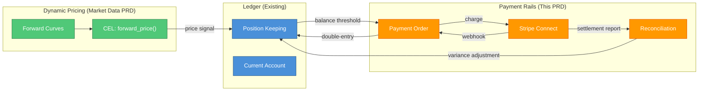
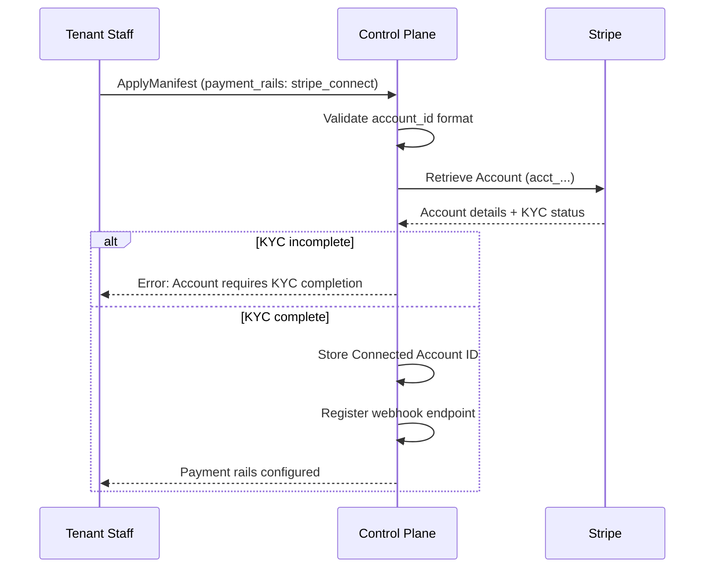
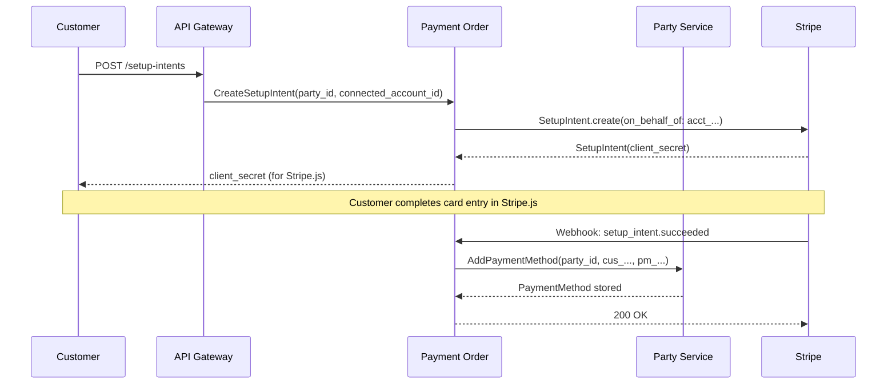
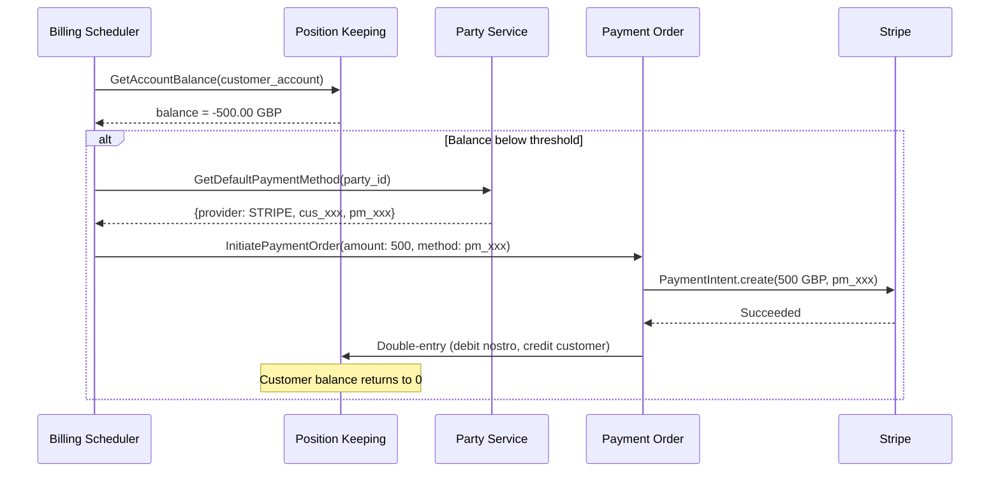
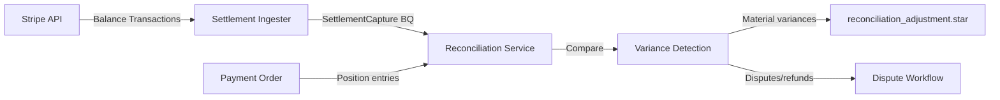

# PRD: Stripe Connect -- Tenant Payment Rails

**Status:** Draft
**Version:** 1.0
**Task Master Tag:** `stripe-connect`
**Estimated Complexity:** 55 story points (6 work streams)
**Critical Path:** 34 points
**Last Updated:** 2026-02-09

**Dependencies:**

- [Control Plane PRD](control-plane.md) (Manifest schema,
  `payment_rails` field, `services/control-plane/`)
- [Reconciliation Service PRD](reconciliation-service.md)
  (settlement snapshots, variance detection, finality)
- [Market Data & Dynamic Pricing PRD](market-data-dynamic-pricing.md)
  (forward curves, pricing signals)

---

## Executive Summary

The Market Data & Dynamic Pricing PRD builds the engine to **calculate
the price**. This PRD builds the rails to **collect the money**.

Together they form a closed loop:



Without this PRD, Meridian can tell customers **what they owe** but
cannot **collect payment**. The Metronome comparison from the Market
Data PRD is incomplete without settlement actuation.

---

## Decision: Single-Provider Focus (Phase 1)

While the Payment Order service maintains a **gateway-agnostic data
model** (`gateway_reference_id`, generic `WebhookRequest`), this PRD
exclusively implements the **Stripe Connect** adapter.

**Rationale:**

1. **Platform Semantics:** Meridian is B2B2C (Platform > Tenant >
   Customer). Abstracting multi-party settlement (KYC, splits,
   payouts) across vendors is exponentially harder than abstracting
   simple direct payments. Stripe Connect and Adyen for Platforms
   have fundamentally different onboarding, split, and payout APIs.
   A generic "Platform Payment Interface" would cost months of
   abstraction work with zero feature delivery.
2. **Implementation Velocity:** Stripe Connect's
   `application_fee_amount` and `on_behalf_of` semantics align
   directly with Meridian's revenue model and tenant isolation.
3. **Compliance:** Offloading sub-tenant KYC to Stripe allows
   Meridian to remain a technology provider rather than a regulated
   payment facilitator.

### Principle: Opinionated Rails, Agnostic Data

| Layer | Strategy | Example |
|-------|----------|---------|
| Proto / Database | **Generic column names** | `gateway_reference_id` not `stripe_payment_intent_id` |
| Manifest Config | **Stripe-specific structure** | `"provider": "stripe_connect"` with Stripe-specific fields |
| Service Logic | **Single adapter, no factory** | Instantiate `StripeGatewayAdapter` directly; no multi-provider dispatch |
| Party Storage | **Generic table, Stripe validation** | `provider_customer_id VARCHAR(255)` validated as `cus_*` in service layer |

If a future tenant needs Adyen, the architectural path is clear:
implement `AdyenGatewayAdapter`, add `"provider": "adyen_platforms"`
to the Manifest schema, and register the adapter in
`GatewayAccountConfig`. The data model requires zero migration.

---

## Existing Infrastructure Inventory

Before detailing work streams, here is what already exists and what
this PRD builds upon.

| Component | Status | Key Capabilities |
|-----------|--------|------------------|
| Payment Order Service | Implemented | Full saga orchestrator (INITIATED > RESERVED > EXECUTING > COMPLETED), gateway-agnostic webhook handler with HMAC validation, lien system, ledger posting, `GatewayAccountConfig` for multi-gateway support |
| Party Service | Implemented | BIAN Party Reference Data Directory, PERSON/ORGANIZATION types, external references (LEI, Companies House), demographics, bank relations. **No extensible attributes or payment method storage** |
| Tenant Service | Implemented | Full CRUD, async provisioning with per-service status, slug validation, schema-per-tenant (ADR-0016) |
| Current Account Service | Implemented | Lien management (ACTIVE/EXECUTED/TERMINATED), bucket-aware reservations, atomic valuation with price lock, deposit/withdrawal |
| Reconciliation Service | PRD Complete (55pts) | Settlement runs, variance detection, dispute management, NOSTRO_VOSTRO scope for external counterparty matching, balance assertions |
| Control Plane | PRD Complete (43pts) | Manifest schema with reserved `payment_rails` field, ApplyManifest orchestrator, Staff Identity Registry |
| handlers.yaml | Implemented | `payment_order.create_lien`, `payment_order.send_to_gateway`, `payment_order.post_ledger_entries`, `payment_order.execute_lien` with compensation chains |

### Gateway Architecture (Payment Order)

The Payment Order service is already **gateway-agnostic**. The webhook
handler accepts generic `WebhookRequest` payloads with `gateway_reference_id`
and maps status strings to proto enums. The `GatewayAccountConfig`
maps gateway IDs to contra-accounts:

```json
{
  "stripe": {
    "gateway_id": "stripe",
    "contra_account_id": "uuid-of-stripe-nostro",
    "account_type": "NOSTRO"
  }
}
```

This PRD adds Stripe as a **concrete gateway implementation** without
modifying the gateway-agnostic abstractions.

### Party Service Gap

The Party service currently has no extensible attribute system. The
`externalReference` field is singular and typed (COMPANIES_HOUSE,
LEI, NATIONAL_ID, TAX_ID) and unsuitable for payment provider tokens.

This PRD adds a dedicated `party_payment_methods` table (WS-1) with
**generic column names** (`provider`, `provider_customer_id`,
`provider_method_id`) but **Stripe-specific validation** in the
service layer (checking `cus_*` and `pm_*` prefixes). No JSONB
extensible attribute system or enum modification needed.

---

## Work Streams

### WS-1: Party Payment Method Registry (P0)

**Objective:** Extend the Party service to store tokenized payment
method references for tenant customers.

**Service:** `services/party/`

#### Current State

The Party service manages BIAN Party Reference Data Directory entries
with fixed fields: `partyType`, `legalName`, `demographics`,
`referenceData`, `bankRelations`, `associations`. There is a single
`externalReference` field with typed validation (LEI, Companies House).
No mechanism exists for storing payment provider tokens.

#### Target State

Parties can hold one or more payment method references. All sensitive
data (card numbers, bank details) remains in Stripe; Meridian stores
only provider tokens and metadata (last 4 digits, brand, expiry).

#### Data Model

```sql
-- New table in tenant schema (org_{id})
-- Follows schema-per-tenant isolation (ADR-0016)
CREATE TABLE party_payment_methods (
    id UUID PRIMARY KEY DEFAULT gen_random_uuid(),
    party_id UUID NOT NULL REFERENCES parties(id),
    provider VARCHAR(50) NOT NULL,          -- 'STRIPE'
    provider_customer_id VARCHAR(255) NOT NULL, -- 'cus_xxxxx'
    provider_method_id VARCHAR(255),        -- 'pm_xxxxx' (nil for customer-only)
    method_type VARCHAR(50),               -- 'CARD', 'BANK_ACCOUNT', 'SEPA'
    is_default BOOLEAN NOT NULL DEFAULT false,
    metadata JSONB NOT NULL DEFAULT '{}',  -- {"last4": "4242", "brand": "visa", "exp_month": 12, "exp_year": 2028}
    status VARCHAR(20) NOT NULL DEFAULT 'ACTIVE',
    created_at TIMESTAMPTZ NOT NULL DEFAULT NOW(),
    updated_at TIMESTAMPTZ NOT NULL DEFAULT NOW(),
    version INTEGER NOT NULL DEFAULT 1,

    -- Phase 1: Stripe only. Add providers here as adapters are built.
    CONSTRAINT valid_provider CHECK (provider IN ('STRIPE')),
    CONSTRAINT valid_status CHECK (status IN ('ACTIVE', 'EXPIRED', 'REMOVED'))
);

CREATE INDEX idx_party_payment_methods_party
    ON party_payment_methods(party_id) WHERE status = 'ACTIVE';

-- Enforce single default per party
CREATE UNIQUE INDEX idx_party_payment_methods_default
    ON party_payment_methods(party_id)
    WHERE is_default = true AND status = 'ACTIVE';
```

**PCI Compliance:** Meridian never stores PAN, CVV, or bank account
numbers. The `metadata` field contains only non-sensitive display
data provided by Stripe's token response. The `provider_customer_id`
and `provider_method_id` are Stripe-assigned opaque tokens.

#### RPCs

```protobuf
// New RPCs added to PartyService
rpc AddPaymentMethod(AddPaymentMethodRequest)
    returns (PartyPaymentMethod);
rpc RemovePaymentMethod(RemovePaymentMethodRequest)
    returns (RemovePaymentMethodResponse);
rpc SetDefaultPaymentMethod(SetDefaultPaymentMethodRequest)
    returns (PartyPaymentMethod);
rpc ListPaymentMethods(ListPaymentMethodsRequest)
    returns (ListPaymentMethodsResponse);
rpc GetDefaultPaymentMethod(GetDefaultPaymentMethodRequest)
    returns (PartyPaymentMethod);
```

#### Handler Schema Extension

```yaml
# Addition to handlers.yaml
party.get_default_payment_method:
  description: "Retrieve the default payment method for a party"
  params:
    party_id:
      type: string
      required: true
      description: "Party identifier"
  returns:
    provider:
      type: string
      description: "Payment provider (STRIPE)"
    provider_customer_id:
      type: string
      description: "Provider customer identifier"
    provider_method_id:
      type: string
      description: "Provider payment method identifier"
    method_type:
      type: string
      description: "Payment method type (CARD, BANK_ACCOUNT)"
```

#### Tasks

| ID | Task | Complexity | Dependencies |
|----|------|------------|--------------|
| PM-1 | Create `party_payment_methods` table migration | 2 | - |
| PM-2 | Implement `PartyPaymentMethod` domain entity | 2 | PM-1 |
| PM-3 | Implement repository with default-enforcement logic | 3 | PM-2 |
| PM-4 | Add payment method gRPC RPCs to Party service | 3 | PM-3 |
| PM-5 | Add `party.get_default_payment_method` handler to handlers.yaml | 1 | PM-4 |
| PM-6 | Integration tests with CockroachDB testcontainer | 2 | PM-4 |

**WS-1 Complexity:** 13

---

### WS-2: Stripe Connect Onboarding (P0)

**Objective:** Enable tenants to connect their Stripe accounts via
the Manifest `payment_rails` field, and route the SetupIntent flow
for customer payment method tokenization.

**Service:** `services/control-plane/` + `services/payment-order/`

#### Manifest Integration

The Control Plane PRD reserves the `payment_rails` array in the
Manifest schema. This PRD defines its structure:

```json
{
  "payment_rails": [
    {
      "provider": "stripe_connect",
      "mode": "standard",
      "account_id": "acct_1234567890",
      "webhook_endpoint_secret": "whsec_...",
      "platform_fee": {
        "type": "percentage",
        "value": "2.5"
      },
      "payout_schedule": "daily",
      "supported_methods": ["card", "sepa_debit"]
    }
  ]
}
```

#### Connect Onboarding Flow



#### Customer SetupIntent Flow



#### Tasks

| ID | Task | Complexity | Dependencies |
|----|------|------------|--------------|
| CO-1 | Define `payment_rails` Manifest schema and validation | 2 | CP WS-1 |
| CO-2 | Implement Connect Account verification in ApplyManifest | 3 | CO-1 |
| CO-3 | Add Stripe Go SDK dependency and client wrapper | 2 | - |
| CO-4 | Implement SetupIntent creation RPC in Payment Order | 3 | CO-3, WS-1 |
| CO-5 | Handle `setup_intent.succeeded` webhook to store payment method | 2 | CO-4 |
| CO-6 | KYC status tracking and Manifest validation rules | 2 | CO-2 |

**WS-2 Complexity:** 14

---

### WS-3: Stripe Payment Gateway Adapter (P0)

**Objective:** Implement Stripe as a concrete gateway adapter for
the existing Payment Order service, reusing the gateway-agnostic
architecture.

**Service:** `services/payment-order/`

#### Current Gateway Architecture

The Payment Order service has a `payment_order.send_to_gateway`
handler marked as `external: true` in handlers.yaml. The webhook
handler (`adapters/http/webhook_handler.go`) uses generic HMAC
signature validation. The `GatewayAccountConfig` maps gateway IDs
to contra-accounts.

#### Stripe Gateway Adapter

```go
// StripeGatewayAdapter implements the PaymentGateway interface
// for Stripe Connect. It creates PaymentIntents on the tenant's
// Connected Account with platform fee configuration.
type StripeGatewayAdapter struct {
    client         *stripe.Client
    accountConfig  *GatewayAccountConfig
    logger         *slog.Logger
}

// SendPayment creates a PaymentIntent on the tenant's Connected Account.
// The payment_order_id flows through as metadata for webhook correlation.
// The idempotency_key prevents duplicate charges on retry.
func (s *StripeGatewayAdapter) SendPayment(
    ctx context.Context, req GatewayPaymentRequest,
) (*GatewayPaymentResponse, error) {
    params := &stripe.PaymentIntentParams{
        Amount:   stripe.Int64(req.AmountCents),
        Currency: stripe.String(strings.ToLower(req.Currency)),
        Customer: stripe.String(req.CustomerID), // Stripe cus_xxx
        PaymentMethod: stripe.String(req.PaymentMethodID), // pm_xxx
        Confirm: stripe.Bool(true),
        OffSession: stripe.Bool(true),
        Metadata: map[string]string{
            "payment_order_id": req.PaymentOrderID,
            "tenant_id":        req.TenantID,
        },
    }

    // Connected Account routing
    params.SetStripeAccount(req.ConnectedAccountID)

    // Platform fee
    if req.PlatformFee > 0 {
        params.ApplicationFeeAmount = stripe.Int64(req.PlatformFee)
    }

    // Idempotency
    params.SetIdempotencyKey(req.IdempotencyKey)

    pi, err := s.client.PaymentIntents.New(params)
    if err != nil {
        return nil, fmt.Errorf("stripe payment intent: %w", err)
    }

    return &GatewayPaymentResponse{
        GatewayReferenceID: pi.ID,                // pi_xxx
        ChargeID:           pi.LatestCharge.ID,    // ch_xxx
        Status:             mapStripeStatus(pi.Status),
    }, nil
}
```

#### Stripe Webhook Handler

The existing `WebhookHandler` uses generic HMAC validation. Stripe
uses a different signature scheme (`Stripe-Signature` header with
timestamp + HMAC-SHA256). A Stripe-specific adapter translates:

```go
// StripeWebhookAdapter adapts Stripe webhook events to the
// generic WebhookRequest format expected by the Payment Order service.
type StripeWebhookAdapter struct {
    endpointSecret string
}

// ParseWebhook validates the Stripe signature and converts to
// a generic WebhookRequest.
func (a *StripeWebhookAdapter) ParseWebhook(
    r *http.Request, body []byte,
) (*WebhookRequest, error) {
    event, err := webhook.ConstructEvent(
        body,
        r.Header.Get("Stripe-Signature"),
        a.endpointSecret,
    )
    if err != nil {
        return nil, fmt.Errorf("stripe signature: %w", err)
    }

    switch event.Type {
    case "payment_intent.succeeded":
        pi := event.Data.Object
        return &WebhookRequest{
            GatewayReferenceID: pi["id"].(string),
            PaymentOrderID:     pi["metadata"].(map[string]any)["payment_order_id"].(string),
            Status:             "SETTLED",
            Timestamp:          time.Unix(event.Created, 0),
        }, nil
    case "payment_intent.payment_failed":
        pi := event.Data.Object
        return &WebhookRequest{
            GatewayReferenceID: pi["id"].(string),
            PaymentOrderID:     pi["metadata"].(map[string]any)["payment_order_id"].(string),
            Status:             "REJECTED",
            Message:            pi["last_payment_error"].(map[string]any)["message"].(string),
            Timestamp:          time.Unix(event.Created, 0),
        }, nil
    default:
        return nil, fmt.Errorf("unhandled event type: %s", event.Type)
    }
}
```

#### Payment Saga (Starlark)

Uses existing handlers from handlers.yaml:

```python
# stripe_payment/v1.0.0.star
# Tenant-configurable payment saga stored in Reference Data.
# Triggered by: API call or billing cycle orchestrator.

def stripe_payment(ctx):
    """Execute a Stripe payment with lien reservation and ledger posting."""

    # Step 1: Reserve funds via lien
    lien = step("create_lien",
        payment_order.create_lien(
            account_id = ctx.input["debtor_account_id"],
            amount_cents = ctx.input["amount_cents"],
            currency = ctx.input["currency"],
            payment_order_id = ctx.input["payment_order_id"],
            instrument_code = ctx.input.get("instrument_code", ""),
            payment_attributes = ctx.input.get("payment_attributes", {}),
        ))

    # Step 2: Charge via Stripe
    gateway = step("send_to_gateway",
        payment_order.send_to_gateway(
            payment_order_id = ctx.input["payment_order_id"],
            debtor_account_id = ctx.input["debtor_account_id"],
            creditor_reference = ctx.input["creditor_reference"],
            amount_cents = ctx.input["amount_cents"],
            currency = ctx.input["currency"],
            idempotency_key = ctx.input["idempotency_key"],
        ))

    # Step 3: Post ledger entries (double-entry)
    ledger = step("post_ledger",
        payment_order.post_ledger_entries(
            payment_order_id = ctx.input["payment_order_id"],
            debtor_account_id = ctx.input["debtor_account_id"],
            gateway_reference_id = gateway["gateway_reference_id"],
            amount_cents = ctx.input["amount_cents"],
            currency = ctx.input["currency"],
            idempotency_key = ctx.input["idempotency_key"] + "_ledger",
        ))

    # Step 4: Execute lien (finalise reservation)
    step("execute_lien",
        payment_order.execute_lien(
            lien_id = lien["lien_id"],
        ))

    return {
        "status": "completed",
        "gateway_reference_id": gateway["gateway_reference_id"],
        "booking_log_id": ledger["booking_log_id"],
    }
```

#### Tasks

| ID | Task | Complexity | Dependencies |
|----|------|------------|--------------|
| SG-1 | Add `stripe-go` SDK dependency to Payment Order service | 1 | - |
| SG-2 | Implement `StripeGatewayAdapter` (PaymentIntent creation on Connected Account) | 3 | SG-1 |
| SG-3 | Implement `StripeWebhookAdapter` (Stripe signature validation, event parsing) | 3 | SG-1 |
| SG-4 | Register Stripe gateway in `GatewayAccountConfig` during Manifest apply | 2 | SG-2, WS-2 |
| SG-5 | Create `stripe_payment` Starlark saga definition | 2 | SG-2 |
| SG-6 | Handle Stripe dispute/refund webhooks (charge.disputed, charge.refunded) | 2 | SG-3 |
| SG-7 | Integration tests: payment intent lifecycle with Stripe test mode | 3 | SG-2, SG-3 |

**WS-3 Complexity:** 16

---

### WS-4: Billing Cycle Orchestration (P1)

**Objective:** Implement automated invoice collection that queries
position balances, retrieves payment methods, and triggers the Stripe
payment saga.

**Service:** `services/payment-order/` (new billing worker)

This is the **"Closer"** - the component that bridges dynamic pricing
(Market Data PRD) to actual money collection.

#### Billing Trigger Modes

| Mode | Description | Use Case |
|------|-------------|----------|
| Threshold | Charge when balance exceeds amount | Prepaid top-up models |
| Periodic | Charge on schedule (monthly, weekly) | Subscription billing |
| Event | Charge on specific event | Pay-per-use models |

#### Billing Cycle Flow



#### Billing Saga (Starlark)

```python
# invoice_collection/v1.0.0.star
# Billing cycle saga - collects payment for outstanding balance.
# Triggered by: billing scheduler or manual collection request.

def invoice_collection(ctx):
    """Collect payment for a customer's outstanding balance."""

    # Step 1: Get payment method
    payment_method = step("get_payment_method",
        party.get_default_payment_method(
            party_id = ctx.input["party_id"],
        ))

    # Step 2: Reserve funds on customer account
    lien = step("create_lien",
        payment_order.create_lien(
            account_id = ctx.input["customer_account_id"],
            amount_cents = ctx.input["amount_cents"],
            currency = ctx.input["currency"],
            payment_order_id = ctx.input["payment_order_id"],
        ))

    # Step 3: Charge via Stripe
    gateway = step("charge_external",
        payment_order.send_to_gateway(
            payment_order_id = ctx.input["payment_order_id"],
            debtor_account_id = ctx.input["customer_account_id"],
            creditor_reference = ctx.input["creditor_reference"],
            amount_cents = ctx.input["amount_cents"],
            currency = ctx.input["currency"],
            idempotency_key = ctx.input["idempotency_key"],
        ))

    # Step 4: Post ledger entries (settles internal balance)
    ledger = step("post_ledger",
        payment_order.post_ledger_entries(
            payment_order_id = ctx.input["payment_order_id"],
            debtor_account_id = ctx.input["customer_account_id"],
            gateway_reference_id = gateway["gateway_reference_id"],
            amount_cents = ctx.input["amount_cents"],
            currency = ctx.input["currency"],
            idempotency_key = ctx.input["idempotency_key"] + "_ledger",
        ))

    # Step 5: Execute lien
    step("execute_lien",
        payment_order.execute_lien(
            lien_id = lien["lien_id"],
        ))

    return {
        "status": "collected",
        "gateway_reference_id": gateway["gateway_reference_id"],
        "booking_log_id": ledger["booking_log_id"],
    }
```

#### Billing Configuration (Manifest Extension)

```json
{
  "billing": {
    "mode": "periodic",
    "schedule": "0 6 1 * *",
    "threshold_amount": null,
    "currency": "GBP",
    "grace_period_days": 3,
    "retry_policy": {
      "max_attempts": 3,
      "backoff_hours": [24, 72, 168]
    }
  }
}
```

#### Tasks

| ID | Task | Complexity | Dependencies |
|----|------|------------|--------------|
| BC-1 | Design billing cycle domain model (BillingRun, BillingItem) | 2 | - |
| BC-2 | Implement billing scheduler (cron-based, reads from Manifest config) | 3 | BC-1 |
| BC-3 | Implement balance query aggregation (batch customer balances from Position Keeping) | 3 | BC-1 |
| BC-4 | Create `invoice_collection` Starlark saga definition | 2 | WS-3, WS-1 |
| BC-5 | Implement retry policy with exponential backoff for failed charges | 2 | BC-4 |
| BC-6 | Add billing run status tracking and Prometheus metrics | 2 | BC-2 |
| BC-7 | Integration tests: end-to-end billing cycle | 3 | BC-4 |

**WS-4 Complexity:** 17 (reduced from initial estimate; reuses
existing payment saga infrastructure)

---

### WS-5: Stripe Settlement Reconciliation (P1)

**Objective:** Ingest Stripe settlement reports and feed them into
the reconciliation service's NOSTRO_VOSTRO scope for variance
detection.

**Service:** `services/reconciliation/` + `services/payment-order/`

#### Reconciliation Integration

The Reconciliation Service PRD defines a `NOSTRO_VOSTRO` scope
specifically for reconciling internal records against external
counterparty reports. Stripe settlement reports are the external
counterparty data source.

#### Settlement Report Ingestion



#### Stripe-Specific Variance Categories

| Category | Stripe Event | Detection Method |
|----------|-------------|------------------|
| Failed charge | `charge.failed` | Position exists, no Stripe settlement |
| Dispute | `charge.disputed` | Stripe debit with no matching reversal position |
| Refund | `charge.refunded` | Stripe credit with no matching reversal position |
| Fee discrepancy | Payout report | Platform fee differs from configured percentage |
| Payout timing | `payout.paid` | Stripe payout date vs expected settlement window |

#### Tasks

| ID | Task | Complexity | Dependencies |
|----|------|------------|--------------|
| SR-1 | Implement Stripe Balance Transaction API client (paginated fetch) | 2 | SG-1 |
| SR-2 | Build settlement report transformer (Stripe format to SettlementCapture BQ) | 3 | SR-1, Recon Stream 2 |
| SR-3 | Register Stripe as NOSTRO_VOSTRO data source in reconciliation config | 1 | SR-2 |
| SR-4 | Handle Stripe dispute webhooks (charge.disputed) as dispute triggers | 2 | SG-6 |
| SR-5 | Integration tests: Stripe settlement vs position-keeping comparison | 3 | SR-2 |

**WS-5 Complexity:** 11 (leverages reconciliation service
infrastructure)

---

### WS-6: Multi-Party Settlement (P2)

**Objective:** Configure platform fees and tenant payout schedules
via Stripe Connect's `application_fee_amount`.

**Service:** `services/control-plane/` + `services/payment-order/`

#### Platform Fee Model

```text
Customer pays: GBP 100.00
  -> Tenant receives: GBP 97.50 (after 2.5% platform fee)
  -> Meridian receives: GBP 2.50 (application_fee)
  -> Stripe takes: ~GBP 1.55 (from tenant's portion, per Stripe pricing)

Ledger entries:
  DEBIT  stripe_nostro       GBP 100.00  (customer payment received)
  CREDIT customer_prepaid    GBP 100.00  (customer balance topped up)
  DEBIT  tenant_revenue      GBP 2.50    (platform fee)
  CREDIT meridian_ops_revenue GBP 2.50   (Meridian's share)
```

#### Tasks

| ID | Task | Complexity | Dependencies |
|----|------|------------|--------------|
| MS-1 | Implement platform fee calculation from Manifest config | 2 | WS-2 |
| MS-2 | Add `application_fee_amount` to Stripe PaymentIntent creation | 1 | WS-3 |
| MS-3 | Create fee reconciliation report (configured vs actual fees) | 2 | WS-5 |
| MS-4 | Implement payout schedule configuration in Manifest | 1 | WS-2 |

**WS-6 Complexity:** 6

---

## Critical Path

```mermaid
gantt
    title Critical Path: Stripe Connect
    dateFormat X
    axisFormat %s pts

    section WS-1 Payment Methods
    PM-1 Schema Migration         :pm1, 0, 2
    PM-2 Domain Entity            :pm2, after pm1, 2
    PM-3 Repository               :pm3, after pm2, 3
    PM-4 gRPC RPCs                :pm4, after pm3, 3
    PM-5 Handler Schema           :pm5, after pm4, 1
    PM-6 Integration Tests        :pm6, after pm4, 2

    section WS-2 Connect Onboarding
    CO-1 Manifest Schema          :co1, 0, 2
    CO-2 Account Verification     :co2, after co1, 3
    CO-3 Stripe SDK               :co3, 0, 2
    CO-4 SetupIntent RPC          :co4, after co3, 3
    CO-5 Webhook Handler          :co5, after co4, 2
    CO-6 KYC Tracking             :co6, after co2, 2

    section WS-3 Gateway Adapter
    SG-1 SDK Dependency           :sg1, 0, 1
    SG-2 Gateway Adapter          :sg2, after sg1, 3
    SG-3 Webhook Adapter          :sg3, after sg1, 3
    SG-4 Config Registration      :sg4, after sg2, 2
    SG-5 Payment Saga             :sg5, after sg2, 2
    SG-6 Dispute Webhooks         :sg6, after sg3, 2
    SG-7 Integration Tests        :sg7, after sg2, 3

    section WS-4 Billing Cycle
    BC-1 Domain Model             :bc1, 0, 2
    BC-2 Scheduler                :bc2, after bc1, 3
    BC-3 Balance Query            :bc3, after bc1, 3
    BC-4 Collection Saga          :crit, bc4, after bc2, 2
    BC-5 Retry Policy             :bc5, after bc4, 2
    BC-6 Metrics                  :bc6, after bc2, 2
    BC-7 Integration Tests        :bc7, after bc4, 3

    section WS-5 Reconciliation
    SR-1 Balance TX Client        :sr1, after sg1, 2
    SR-2 Report Transformer       :sr2, after sr1, 3
    SR-3 Data Source Config       :sr3, after sr2, 1
    SR-4 Dispute Webhooks         :sr4, after sg6, 2
    SR-5 Integration Tests        :sr5, after sr2, 3
```



### Critical Path Analysis

**Longest dependency chain:** PM-1 > PM-2 > PM-3 > PM-4 > (gate)
> BC-4 > BC-7

| Segment | Tasks | Complexity |
|---------|-------|------------|
| Payment Methods | PM-1 > PM-2 > PM-3 > PM-4 | 10 |
| Gateway Adapter (parallel) | SG-1 > SG-2 > SG-4 | 6 |
| Onboarding (parallel) | CO-1 > CO-2 > CO-6 | 7 |
| Billing Cycle | BC-1 > BC-2 > BC-4 > BC-7 | 10 |
| Reconciliation (parallel) | SR-1 > SR-2 > SR-5 | 8 |
| **Critical Path Total** | | **34** |

### Parallelisation Opportunities

| Parallel Track | Tasks | Notes |
|----------------|-------|-------|
| WS-1 + WS-2 + WS-3 | PM-*, CO-*, SG-* | All P0, no cross-dependencies until WS-4 |
| Billing Scheduler | BC-1, BC-2 | Can start before WS-1 completes |
| Reconciliation | SR-* | After SG-1, largely independent |
| Multi-Party | MS-* | P2, fully parallel after WS-2 + WS-3 |

---

## Summary

| Work Stream | Complexity | Priority |
|-------------|------------|----------|
| WS-1: Party Payment Method Registry | 13 | P0 |
| WS-2: Stripe Connect Onboarding | 14 | P0 |
| WS-3: Stripe Payment Gateway Adapter | 16 | P0 |
| WS-4: Billing Cycle Orchestration | 17 | P1 |
| WS-5: Stripe Settlement Reconciliation | 11 | P1 |
| WS-6: Multi-Party Settlement | 6 | P2 |
| **Total** | **77** | |
| **Critical Path** | **34** | |

---

## Success Criteria

### Minimum Viable Product (P0 Complete)

1. Tenants can connect their Stripe account via the Manifest
   `payment_rails` field
2. Tenant customers can save payment methods (cards) via
   SetupIntent flow
3. Payment Order service can charge customers via Stripe
   PaymentIntents on Connected Accounts
4. Webhook-confirmed payments create double-entry ledger
   positions with `external_reference_id` carrying the Stripe
   Charge ID
5. Party service stores tokenized payment method references
   (never raw card data)

### Full Feature Set (P1 Complete)

1. Automated billing cycles collect outstanding balances on
   schedule
2. **End-to-end flow**: Usage Event > Metering > Valuation >
   Forward Curve Pricing > Balance Accumulation > Invoice
   Collection > Stripe Charge > Ledger Settlement
3. Stripe settlement reports feed into reconciliation service
   as NOSTRO_VOSTRO data source
4. Variance detection catches failed charges, disputes, refunds,
   and fee discrepancies
5. Failed payment retries follow configurable exponential backoff

### Complete Platform (P2 Complete)

1. Platform fees automatically applied via
   `application_fee_amount`
2. Tenant payout schedules configurable in Manifest
3. Fee reconciliation report detects discrepancies between
   configured and actual platform fees

---

## Connection to Market Data & Dynamic Pricing PRD

The Market Data PRD stops at "Price Signals" (forward curves
delivered to customers via CEL expressions). This PRD closes the
loop:

```text
Market Data PRD                    This PRD
==============                     ========

Usage Event                        |
  |                                |
  v                                |
Utilization Metering (WS-1)        |
  |                                |
  v                                |
Market Information Service         |
  |                                |
  v                                |
Forecasting Service (WS-3)         |
  |                                |
  v                                |
Forward Curves (WS-4)              |
  |                                |
  v                                |
CEL: forward_price()               |
  |                                |
  v                                |
Customer sees price signal ------> Customer uses service
                                     |
                                     v
                                   Position Keeping records usage
                                     |
                                     v
                                   Balance accumulates (debit)
                                     |
                                     v
                                   Billing Cycle triggers (WS-4)
                                     |
                                     v
                                   Stripe charges customer (WS-3)
                                     |
                                     v
                                   Ledger settles (double-entry)
                                     |
                                     v
                                   Reconciliation verifies (WS-5)
                                     |
                                     v
                                   Settlement finality locks
```

The Hierarchical Reference Data nodes from Market Data WS-2 should
include a `billing_party_id` attribute so that usage on a specific
node (e.g., `rack-gpu-42`) resolves to a billable customer:

```json
{
  "id": "rack-gpu-42",
  "type": "rack",
  "parent_id": "us-east-1a",
  "attributes": {
    "gpu_count": 64,
    "cooling": "liquid",
    "billing_party_id": "party-uuid-of-customer-a"
  }
}
```

This links the capacity topology (Market Data PRD WS-2) to the
payment collection entity (this PRD WS-1).

---

## Risks and Mitigations

| Risk | Impact | Mitigation |
|------|--------|------------|
| Stripe API rate limits during billing runs | Medium | Batch PaymentIntent creation, stagger billing across time windows |
| PCI compliance scope expansion | High | Never store card data; Stripe.js handles all sensitive input; annual SAQ-A questionnaire |
| Webhook delivery failures | Medium | Existing retry mechanism in Payment Order; Stripe retries for 72 hours |
| Connected Account KYC delays | Low | Validate KYC status at Manifest apply; reject incomplete accounts |
| Multi-currency valuation during billing | Medium | Use existing valuation engine (atomic valuation with price lock on lien) |
| Billing run overlap with reconciliation | Low | Billing runs create payment orders; reconciliation runs operate on settled positions (different lifecycle stages) |

---

## BIAN Alignment

### Service Domain Mapping

| PRD Component | BIAN Service Domain | Alignment |
|---------------|---------------------|-----------|
| Party Payment Methods | Party Reference Data Directory | BQ extension for payment method registry |
| Stripe Gateway Adapter | Payment Order | Fulfilment pattern with external gateway |
| Billing Cycle | Payment Initiation | Scheduled payment initiation procedure |
| Settlement Reconciliation | Account Reconciliation | NOSTRO_VOSTRO scope with external counterparty |
| Platform Fees | Commissions | Fee calculation and distribution |

---

## Open Questions

1. **Connect account type**: Standard (tenant owns Stripe
   dashboard) vs Express (Meridian-branded onboarding). **Resolved:**
   Tenant choice declared in Manifest `payment_rails[].mode` field.
   Start with Standard only; Express requires additional Meridian UI
   components.
2. **Multi-currency**: How to handle tenants accepting payments in
   currencies different from their base ledger currency.
   **Recommendation:** Use existing atomic valuation with price lock
   on lien creation. The valued amount in the account's native
   instrument is what gets reserved.
3. **Dispute handling**: Stripe disputes need to flow into
   reconciliation-service's dispute workflow. **Resolved:** WS-5
   task SR-4 handles `charge.disputed` webhooks as dispute triggers
   for the reconciliation service's NOSTRO_VOSTRO scope.
4. **Refund sagas**: Reverse the original payment saga.
   **Recommendation:** Use the existing Payment Order `Reverse()`
   state transition. Create a `stripe_refund` Starlark saga that
   calls Stripe Refund API and posts compensating ledger entries.
   The `external_reference_id` on the original position entry
   enables O(1) lookup of the Stripe Charge ID for the refund.
5. **Billing run isolation**: Should billing runs be per-tenant
   or batched? **Recommendation:** Per-tenant, on the tenant's
   configured schedule. The billing scheduler iterates tenants with
   `payment_rails` configured and triggers independent saga
   instances.

---

## Dependencies

| Dependency | Status | Notes |
|------------|--------|-------|
| Control Plane: Manifest Schema (WS-1) | PRD Complete | `payment_rails` field reserved |
| Control Plane: ApplyManifest (WS-3) | PRD Complete | Orchestrator for Manifest changes |
| Reconciliation Service (Streams 1-5) | PRD Complete | Core reconciliation before Stripe integration |
| Payment Order Service | Implemented | Gateway-agnostic architecture ready for Stripe adapter |
| Party Service | Implemented | Needs WS-1 extension for payment methods |
| Position Keeping Service | Implemented | Balance queries for billing trigger |
| Market Data & Dynamic Pricing (WS-1, WS-4) | PRD Complete | Forward curves for pricing signals |
| Hierarchical Reference Data (Market Data WS-2) | PRD Complete | Node > Party linkage for billing resolution |
