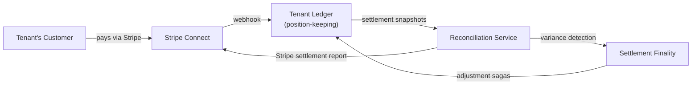

# PRD: Stripe Connect -- Tenant Payment Rails

**Status:** Not Started
**Version:** 0.1 (Placeholder)
**Estimated Complexity:** 13+ story points
**Dependencies:**

- [Control Plane PRD](control-plane.md) (Manifest schema,
  `payment_rails` field, `services/control-plane/`)
- [Reconciliation Service PRD](reconciliation-service.md)
  (settlement snapshots, variance detection, finality)
- [ADR-0018: Settlement & Reconciliation](../adr/0018-settlement-reconciliation.md)

## Vision

Complete the closed payment loop so tenants can accept payments from
their customers without leaving the Meridian platform:

Each tenant's Stripe Connected Account is declared in their Manifest
via the `payment_rails` field. The Control Plane configures the
integration during `ApplyManifest`.

## Scope Outline

### 1. Stripe Connect Onboarding (Complexity: ~3)

- Support Standard and Express Connect account types
- Tenant onboarding flow (OAuth or embedded components)
- Store Connected Account ID in Control Plane
- KYC/identity verification status tracking
- Manifest declares: `"payment_rails": [{"provider":
  "stripe_connect", "mode": "standard", "account_id": "acct_..."}]`

### 2. Customer Payment Methods (Complexity: ~3)

- Party service stores Stripe Customer ID as extensible attribute
- SetupIntent flow for saving payment methods
- Payment method lifecycle (add, remove, set default)
- PCI compliance: Meridian never touches raw card data (Stripe
  handles tokenization)

### 3. Payment Acceptance (Complexity: ~3)

- PaymentIntent creation on Connected Account
- Webhook routing: platform-level vs connected-account events
- Payment saga: webhook -> position-keeping double-entry
- `external_reference_id` carries Stripe Charge ID for
  reconciliation joins

### 4. Multi-Party Settlement (Complexity: ~2)

- Platform fee configuration (percentage or fixed per transaction)
- Stripe application_fee_amount on PaymentIntents
- Tenant payout schedule configuration
- Settlement report ingestion as reconciliation data source

### 5. Reconciliation Integration (Complexity: ~2)

- Stripe Balance Transaction export as settlement snapshot source
- Reconciliation service compares position-keeping entries against
  Stripe settlement reports
- Variance detection for: failed charges, disputes, refunds,
  fee discrepancies
- Settlement finality locks positions after Stripe payout completes

## Integration Points

| Service | Role | Interface |
|---------|------|-----------|
| `services/control-plane/` | Stores Connected Account ID, configures payment_rails | Manifest apply |
| `services/payment-order/` | Creates PaymentIntents, handles webhooks | gRPC + Kafka |
| `services/party/` | Stores Stripe Customer ID per Party | Extensible attributes |
| `services/position-keeping/` | Records payment positions | gRPC (record_transaction) |
| `services/reconciliation/` | Matches positions vs Stripe reports | Settlement snapshots |
| `services/reference-data/` | Payment saga definitions | Saga registry |

## Open Questions

1. **Connect account type**: Standard (tenant owns Stripe dashboard)
   vs Express (Meridian-branded onboarding) -- likely tenant choice
   declared in Manifest
2. **Multi-currency**: How to handle tenants accepting payments in
   currencies different from their base ledger currency (valuation
   engine integration)
3. **Dispute handling**: Stripe disputes need to flow into
   reconciliation-service's dispute workflow (task 7 in
   reconciliation-service TM tag)
4. **Refund sagas**: Reverse the original payment saga -- needs
   compensation logic in the saga definition
